## LangChain框架 

**学习目标:**

1. 熟悉 LangChain核心组件
2. 熟悉 LangChain的使用方式
3. 熟悉 LangChain各个开发组件


### 一. 简介

`LangChain` 是⼀个⽤于开发由⼤型语⾔模型（LLMs）驱动的应⽤程序的框架。

 官⽅⽂档：https://python.langchain.com/docs/introduction/ 

 中文文档:   https://langchain.ichuangpai.com/

**说明**: `LangChain`就是一个开发大模型应用开发框架,可以在原有模型的基础上加一些独属于我们自己的一些数据和配置(公司的内部数据 ),能让我们做开发的时候更加方便,类似`java`开发中`spring`和`python`开发中的`Django`,爬虫开发中的`scrapy`.

LangChain简化了LLM应用程序生命周期的各个阶段：

开发阶段：使用LangChain的开源构建块和组件构建应用程序，利用第三方集成和模板快速启动。

生产化阶段：使用LangSmith检查、监控和评估您的链，从而可以自信地持续优化和部署。

部署阶段：使用LangServe将任何链转化为API。

#### 1. Langchain的核心组件

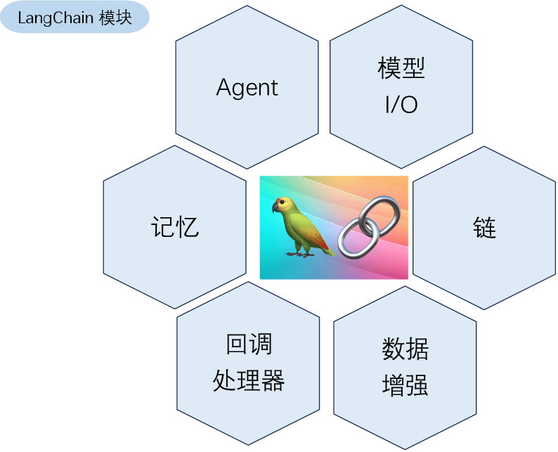

- 模型（Models）：包含各大语言模型的LangChain接口和调用细节，以及输出解析机制。
- 提示模板（Prompts）：使提示工程流线化，进一步激发大语言模型的潜力。
- 数据检索（Indexes）：构建并操作文档的方法，接受用户的查询并返回最相关的文档，轻松搭建本地知识库。
- 记忆（Memory）：通过短时记忆和长时记忆，在对话过程中存储和检索数据，让ChatBot记住你。
- 链（Chains）：LangChain中的核心机制，以特定方式封装各种功能，并通过一系列的组合，自动而灵活地完成任务。
- 代理（Agents）：另一个LangChain中的核心机制，通过“代理”让大模型自主调用外部工具和内部工具，使智能Agent成为可能。

#### 2. 模块封装的功能

> 这些核心模块里面又封装了很多功能

##### 2.1模型 I/O 封装 

- LLMs：大语言模型
- ChatModels：一般基于 LLMs，但按对话结构重新封装
- Prompt：提示词模板
- OutputParser：解析输出

##### 2.2 Retrieval 数据连接与向量检索封装 

- Retriever: 向量的检索
- Document Loader：各种格式文件的加载器
- Embedding Model：文本向量化表示，用于检索等操作
- Verctor Store: 向量的存储
- Text Splitting：对文档的常用操作

##### 2.3 Agents 代理封装

> 根据用户输入，自动规划执行步骤，自动选择每步需要的工具，最终完成用户指定的功能，包括： 

- Tools：调用外部功能的函数，例如：调 google 搜索、文件 I/O、Linux Shell 等等
- Toolkits：操作某软件的一组工具集，例如：操作 DB、操作 Gmail 等等


#### 3. 开源第三方库

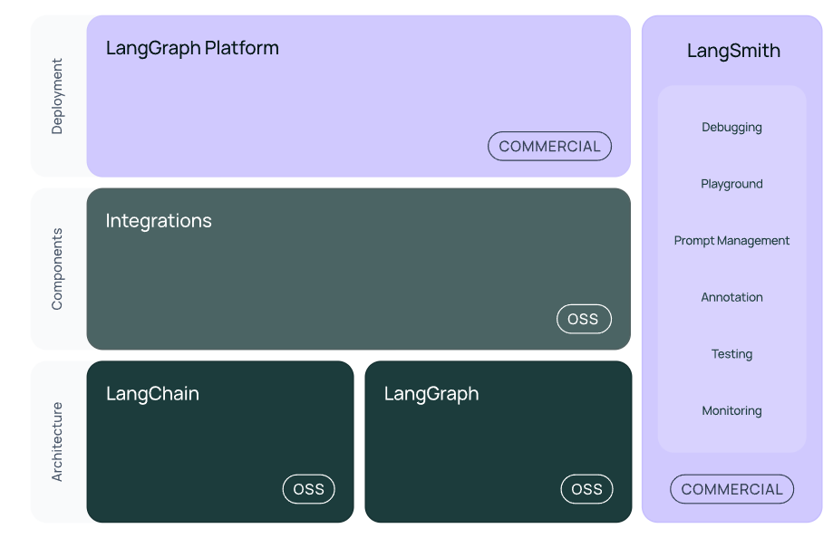

- langchain-core ：基础抽象和LangChain表达式语言
- langchain-community ：第三方集成。合作伙伴包（如langchain-openai、langchain-anthropic等），一些集成已经进一步拆分为自己的轻量级包，只依赖于langchain-core
- langchain ：构成应用程序认知架构的链、代理和检索策略
- langgraph：通过将步骤建模为图中的边和节点，使用 LLMs 构建健壮且有状态的多参与者应用程序
- langserve：将 LangChain 链部署为 REST API
- LangSmith：一个开发者平台，可让您调试、测试、评估和监控LLM应用程序，并与LangChain无缝集成

> 注意: Langchain开发我们一般说的是他的整个生态


#### 4. LangChain基本使用

- 模块安装

```
# 安装指定版本的LangChain 
pip install langchain==0.3.7  -i https://pypi.tuna.tsinghua.edu.cn/simple
pip install langchain-openai==0.2.3  -i https://pypi.tuna.tsinghua.edu.cn/simple
```

##### 4.1模型调用

- 通过LangChain的接口来调用OpenAI对话 

```
from dotenv import load_dotenv
from langchain_openai import ChatOpenAI
import os

load_dotenv()

llm = ChatOpenAI(api_key=os.getenv("api_key"),
                 base_url=os.getenv("base_url"),
                 model_name="qwen-plus")

# 直接提供问题，并调用llm
response = llm.invoke("什么是大模型？")
print(response)
print("=" * 50)
print(response.content)

```

##### 4.2 向量存储

- 使用一个简单的本地向量存储 FAISS，首先需要安装它 

```
pip install faiss-cpu
pip install langchain_community==0.3.7
pip install dashscope
```

```
import os
from langchain_community.document_loaders import WebBaseLoader
import bs4
from langchain_text_splitters import RecursiveCharacterTextSplitter
from langchain_community.embeddings import DashScopeEmbeddings
from langchain_community.vectorstores import FAISS
from dotenv import load_dotenv

# 加载环境变量
load_dotenv()

# 初始化 WebBaseLoader
loader = WebBaseLoader(
    'https://www.gov.cn/zhengce/content/202510/content_7043916.htm',
    bs_kwargs=dict(parse_only=bs4.SoupStrainer(id='UCAP-CONTENT'))
)
docs = loader.load()

# 分割文档
text_splitter = RecursiveCharacterTextSplitter(
    chunk_size=300,
    chunk_overlap=50,
)
documents = text_splitter.split_documents(docs)
print(f"总文档数量: {len(documents)}")

# 初始化 DashScope 嵌入模型
embeddings = DashScopeEmbeddings(
    dashscope_api_key=os.getenv("DASHSCOPE_API_KEY"),
    model="text-embedding-v4",
)

# 初始化 FAISS 索引（第一次循环）
vector = None
batch_size = 10

# 分批处理文档
for i in range(0, len(documents), batch_size):
    batch_docs = documents[i:i + batch_size]
    print(f'第{i // batch_size + 1}批次 文档数量: {len(batch_docs)}')

    # 第一批：创建新的 FAISS 索引
    if i == 0:
        vector = FAISS.from_documents(batch_docs, embeddings)
    # 后续批次：将新文档添加到现有索引
    else:
        new_vector = FAISS.from_documents(batch_docs, embeddings)
        vector.merge_from(new_vector)  # 合并新索引到现有索引


vector.save_local("faiss_index")
print("FAISS 索引已保存到 faiss_index 文件夹")

```

##### 4.3 RAG+Langchain 

> 基于外部知识，增强大模型回复 

```
import os
from langchain.chains.combine_documents import create_stuff_documents_chain
from langchain_core.prompts import ChatPromptTemplate
from langchain_openai import ChatOpenAI
from langchain.chains import create_retrieval_chain
from langchain_community.vectorstores import FAISS
from langchain_community.embeddings import DashScopeEmbeddings
from dotenv import load_dotenv

# 加载环境变量（用于 LLM 的 API 密钥）
load_dotenv()

# 创建嵌入模型
embeddings = DashScopeEmbeddings(
    dashscope_api_key=os.getenv("DASHSCOPE_API_KEY"),
    model='text-embedding-v4'
)
# 加载本地 FAISS 索引
save_path = "faiss_index_v3"

vector_store = FAISS.load_local(
    folder_path=save_path,
    embeddings=embeddings,
    allow_dangerous_deserialization=True  # 允许加载 pickle 文件（仅限可信文件）
)


# 创建提示模板
prompt = ChatPromptTemplate.from_template("""仅根据提供的上下文回答以下问题:

<context>
{context}
</context>

问题: {input}""")

# 创建 LLM 连接（继续使用阿里云 qwen-plus）
llm = ChatOpenAI(
    api_key=os.getenv("DASHSCOPE_API_KEY"),  # 确保环境变量名为 DASHSCOPE_API_KEY
    base_url="https://dashscope.aliyuncs.com/compatible-mode/v1",
    model="qwen-plus"
)

# 创建文档组合链
# langchain_core\prompts\chat.py可以看到提示词拼接
# format_messages 方法拼接提示词
document_chain = create_stuff_documents_chain(llm, prompt)

# 创建检索器
retriever = vector_store.as_retriever(search_kwargs={"k": 3})  # 限制检索 3 个文档

# 创建检索链
# 在langchain_community\vectorstores\faiss.py 可以查看向量检索的实现
# similarity_search_with_score_by_vector 是检索的方法  return docs[:k]
retrieval_chain = create_retrieval_chain(retriever, document_chain)

# 调用检索链并获取回答
# openai\resources\chat\completions\completions.py
# create方法中 self._post()  调用模型请求的api
response = retrieval_chain.invoke({"input": "建设用地使用权是什么？"})

print("\n回答:", response["answer"])
```


### 二.LangChain的Model 

可以把对模型的使用过程拆解成三块: 输入提示(Format)、调用模型(Predict)、输出解析(Parse)

- 1.提示模板: LangChain的模板允许动态选择输入，根据实际需求调整输入内容，适用于各种特定任务和应用。
- 2.语言模型: LangChain 提供通用接口调用不同类型的语言模型，提升了灵活性和使用便利性。
- 3.输出解析: 利用 LangChain 的输出解析功能，精准提取模型输出中所需信息，避免处理冗余数据，同时将非结构化文本转换为可处理的结构化数据，提高信息处理效率。

这三块形成了一个整体，在LangChain中这个过程被统称为Model I/O。针对每块环节，LangChain都提供了模板和工具，可以帮助快捷的调用各种语言模型的接口

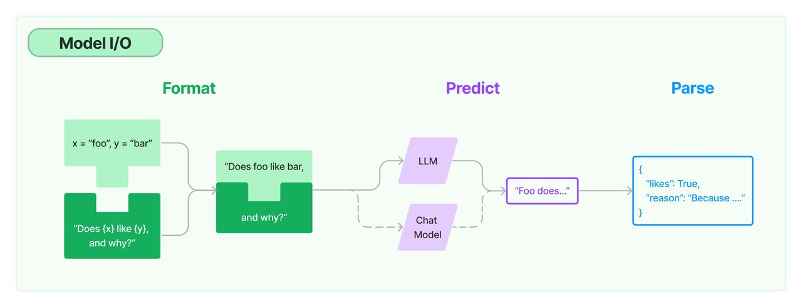

> 很多用户可能对大模型使用的不熟练,那么我们给了他模版他只需要填关键字就行

#### 1.  提示模板

在LangChain的Model I/O中，提示模板是其组成之一,语言模型的提示是用户提供的一组指令或输入，用于指导模型的响应，帮助模型理解上下文并生成相关且连贯的基于语言的输出，例如回答问题、完成句子或参与某项活动、对话

PromptTemplates 是LangChain中的一个概念，通过接收原始用户输入，并返回一个准备好传递给语言模型的信息（即提示词 prompt）

通俗点说，prompt template 是一个模板化的字符串，可以用来生成特定的提示（prompts）。你可以将变量插入到模板中，从而创建出不同的提示。这对于重复生成相似格式的提示非常有用，尤其是在自动化任务中

##### 1.1  LangChain提示模板特点

1. 清晰易懂的提示: 提高提示文本的可读性，使其更易于理解，尤其是在处理复杂或涉及多个变量的情况下。
2. 增强可重用性: 使用模板，可以在多个地方重复使用，简化代码，无需重复构建提示字符串。
3. 简化维护: 使用模板后，如果需要更改提示内容，只需修改模板，无需逐个查找所有用到该提示的地方。
4. 智能处理变量: 模板可以自动处理变量的插入，无需手动拼接字符串。
5. 参数化生成: 模板可以根据不同的参数生成不同的提示，有助于个性化文本生成。

##### 1.2 类型

1. LLM提示模板 PromptTemplate：常用的String提示模板
2. 聊天提示模板 ChatPromptTemplate： 常用的Chat提示模板，用于组合各种角色的消息模板，传入聊天模型。消息模板包括：ChatMessagePromptTemplate、HumanMessagePromptTemplate、AIlMessagePromptTemplate、SystemMessagePromptTemplate等
3. 样本提示模板 FewShotPromptTemplate：通过示例来教模型如何回答
4. 部分格式化提示模板：提示模板传入所需值的子集，以创建仅期望剩余值子集的新提示模板。
5. 管道提示模板 PipelinePrompt： 用于把几个提示组合在一起使用。
6. 自定义模板：允许基于其他模板类来定制自己的提示模板。

- 使用的模块

```
from langchain.prompts.prompt import PromptTemplate
from langchain.prompts import FewShotPromptTemplate
from langchain.prompts.pipeline import PipelinePromptTemplate
from langchain.prompts import ChatPromptTemplate
from langchain.prompts import (
    ChatMessagePromptTemplate,
    SystemMessagePromptTemplate,
    AIMessagePromptTemplate,
    HumanMessagePromptTemplate,
)
```

##### 1.3 String提示模板

```
# 导入LangChain中的OpenAI模型接口
from langchain_openai import ChatOpenAI
# 导入LangChain中的提示模板
from langchain.prompts import PromptTemplate
import os
from dotenv import load_dotenv

load_dotenv()

# 创建模型实例
model = ChatOpenAI(api_key=os.getenv("api_key"),
                   base_url="https://dashscope.aliyuncs.com/compatible-mode/v1",
                   model='qwen-plus')

prompt = PromptTemplate(
    template="您是一位专业的程序员。\n对于信息 {text} 进行简短描述"
)

# 输入提示
input = prompt.format(text="大模型langchain")

# 得到模型的输出
output = model.invoke(input)
# output = model.invoke("您是一位专业的程序员。对于信息 langchain 进行简短描述")

# 打印输出内容
print(output.content)
```

##### 1.4 **聊天提示模板** 

- PromptTemplate创建字符串提示的模板。默认情况下，使用Python的str.format语法进行模板化。而ChatPromptTemplate是创建聊天消息列表的提示模板。
- 创建一个ChatPromptTemplate提示模板，模板的不同之处是它们有对应的角色。

```
from langchain.prompts.chat import ChatPromptTemplate
# 导入LangChain中的ChatOpenAI模型接口
from langchain_openai import ChatOpenAI
import os
from dotenv import load_dotenv

load_dotenv()

template = "你是一个数学家，你可以计算任何算式"
# template = "你是一个翻译专家,擅长将 {input_language} 语言翻译成 {output_language}语言."
human_template = "{text}"

chat_prompt = ChatPromptTemplate.from_messages([
    ("system", template),
    ("human", human_template),
])
# print(chat_prompt)


# 创建模型实例
model = ChatOpenAI(api_key=os.getenv("api_key"),
                   base_url="https://dashscope.aliyuncs.com/compatible-mode/v1",
                   model='qwen-plus')
# 输入提示
messages = chat_prompt.format_messages(text="我今年18岁，我的舅舅今年38岁，我的爷爷今年72岁，我和舅舅一共多少岁了？")
# print(messages)
# messages = chat_prompt.format_messages(input_language="英文", output_language="中文", text="I love Large Language Model.")
print(messages)
# 得到模型的输出
output = model.invoke(messages)
# 打印输出内容
print(output.content)

```

- LangChain提供不同类型的MessagePromptTemplate.最常用的是AIMessagePromptTemplate、 SystemMessagePromptTemplate和HumanMessagePromptTemplate，分别创建人工智能消息、系统消息和人工消息。 

```
# 导入聊天消息类模板
from langchain.prompts import (
    ChatPromptTemplate,
    SystemMessagePromptTemplate,
    HumanMessagePromptTemplate,
)
from langchain_openai import ChatOpenAI
import os
from dotenv import load_dotenv

load_dotenv()

# 系统模板的构建
system_template = "你是一个翻译专家,擅长将 {input_language} 语言翻译成 {output_language}语言."
system_message_prompt = SystemMessagePromptTemplate.from_template(system_template)

# 用户模版的构建
human_template = "{text}"
human_message_prompt = HumanMessagePromptTemplate.from_template(human_template)

# 组装成最终模版
prompt_template = ChatPromptTemplate.from_messages([system_message_prompt, human_message_prompt])

# 格式化提示消息生成提示
prompt = prompt_template.format_prompt(input_language="英文", output_language="中文",
                                       text="I love Large Language Model.").to_messages()
# 打印模版
print("prompt:", prompt)

# 创建模型实例
model = ChatOpenAI(api_key=os.getenv("DASHSCOPE_API_KEY"),
                   base_url="https://dashscope.aliyuncs.com/compatible-mode/v1",
                   model='qwen-plus')
# 得到模型的输出
result = model.invoke(prompt)
# 打印输出内容
print("result:", result.content)
```

##### 1.5 少量样板提示

基于LLM模型与聊天模型，可分别使用`FewShotPromptTemplate`或`FewShotChatMessagePromptTemplate`，两者使用基本一致

创建示例集：创建一些提示样本，每个示例都是一个字典，其中键是输入变量，值是输入变量的值

```
# 创建示例
examples = [
    {"input": "2+2", "output": "4", "description": "加法运算"},
    {"input": "5-2", "output": "3", "description": "减法运算"},
]
```

- 创建提示模板 

```
# 创建提示模板，配置一个提示模板，将一个示例格式化为字符串
prompt_template = "你是一个数学专家,算式： {input} 值： {output} 使用： {description} "

# 这是一个提示模板，用于设置每个示例的格式
prompt_sample = PromptTemplate.from_template(prompt_template)
```

- 创建FewShotPromptTemplate对象 

```
prompt = FewShotPromptTemplate(
    examples=examples,
    example_prompt=prompt_sample,
    suffix="你是一个数学专家,算式: {input}  值: {output} ",
    input_variables=["input", "output"]
)
print(prompt.format(input="2*5", output="10"))  # 你是一个数学专家,算式: 2*5  值:
```

- 初始化大模型，然后调用 

```
# 创建提示模板，配置一个提示模板，将一个示例格式化为字符串
import os

from dotenv import load_dotenv
from langchain_core.prompts import PromptTemplate, FewShotPromptTemplate
import langchain_openai
load_dotenv()
# 创建示例
examples = [
    {"input": "2+2", "output": "4", "description": "加法运算"},
    {"input": "5-2", "output": "3", "description": "减法运算"},
]
prompt_template = "你是一个数学专家,算式： {input} 值： {output} 使用： {description} "

# 这是一个提示模板，用于设置每个示例的格式
prompt_sample = PromptTemplate.from_template(prompt_template)

prompt = FewShotPromptTemplate(
    examples=examples,
    example_prompt=prompt_sample,
    # 告诉大模型要按照这个格式输出description
    suffix="""你是一个数学专家,请计算： {input} 值： {output} """,
    input_variables=["input", "output"],
)
# print(prompt.format(input="2*5", output="10"))  # 你是一个数学专家,算式: 2*5  值:
#
# print(prompt_sample)
print('-' * 50)

llm = langchain_openai.ChatOpenAI(api_key=os.getenv("api_key"),
                                  base_url=os.getenv("base_url"),
                                  model_name='qwen-plus')
result = llm.invoke(prompt.format(input="2*5", output="10"))
print(result.content)  # 使用: 乘法运算

```


#### 2. Model 模型

LangChain支持的模型有三大类 

- 1.大语言模型（LLM） ，也叫Text Model，这些模型将文本字符串作为输入，并返回文本字符串作为输出。
- 2.聊天模型（Chat Model），主要代表Open AI的ChatGPT系列模型。这些模型通常由语言模型支持，但它们的API更加结构化。具体来说，这些模型将聊天消息列表作为输入，并返回聊天消息。
- 3.文本嵌入模型（Embedding Model），这些模型将文本作为输入并返回浮点数列表，也就是Embedding。

聊天模型通常由大语言模型支持，但专门调整为对话场景。重要的是，它们的提供商API使用不同于纯文本模型的接口。输入被处理为聊天消息列表，输出为AI生成的消息。

##### 2.1 大语言模型LLM

LangChain的核心组件是大型语言模型（LLM），它提供一个标准接口以字符串作为输入并返回字符串的形式与多个不同的LLM进行交互。这一接口旨在为诸如OpenAI、Hugging Face等多家LLM供应商提供标准化的对接方法。

文本补全-千问不支持

```
from langchain_community.llms import Tongyi
from dotenv import load_dotenv
import os

load_dotenv()


# LLM纯文本补全模型
llm = Tongyi(api_key=os.getenv("DASHSCOPE_API_KEY"),
                 base_url="https://dashscope.aliyuncs.com/compatible-mode/v1",
                 model='qwen-plus')

text = "我的真的好想（帮我补全这个文本）"
res = llm.invoke(text)
print(res)
```

##### 2.2 聊天模型

聊天模型是LangChain的核心组件，使用聊天消息作为输入并返回聊天消息作为输出。

LangChain有一些内置的消息类型

- SystemMessage:用于启动 AI 行为，通常作为输入消息序列中的第一个传递。
- HumanMessage:表示来自与聊天模型交互的人的消息。
- AIMessage:表示来自聊天模型的消息。这可以是文本，也可以是调用工具的请求。

```
from langchain_community.chat_models import ChatTongyi
from langchain_core.messages import HumanMessage, SystemMessage
from dotenv import load_dotenv
import os

load_dotenv()

human_text = "你好啊"
system_text = "你是一个强大的助手，你的名字叫0713"
# 聊天模型
chat_model = ChatTongyi(
    api_key=os.getenv("DASHSCOPE_API_KEY"),
    base_url="https://dashscope.aliyuncs.com/compatible-mode/v1",
    model="qwen-plus",  # 此处以qwen-plus为例，您可按需更换模型名称。模型列表：https://help.aliyun.com/zh/model-studio/getting-started/models
)

messages = [HumanMessage(content=human_text)]
# 聊天模型支持多个消息作为输入
# messages = [SystemMessage(content=system_text), HumanMessage(content=human_text)]

res = chat_model.invoke(messages)
print(res)
```

##### 2.3 文本嵌入模型

Embedding类是一个用于与嵌入进行交互的类。有许多嵌入提供商（OpenAI、Cohere、Hugging Face等)- 这个类旨在为所有这些提供商提供一个标准接口。 

```


import os

from langchain_community.embeddings import DashScopeEmbeddings
from dotenv import load_dotenv

load_dotenv()
# 初始化 DashScopeEmbeddings实例
embeddings = DashScopeEmbeddings(dashscope_api_key=os.getenv("api_key"), model='text-embedding-v3')


# 获取文本嵌入向量
text = '大模型'

# 嵌入文档 把文档内容转换为向量 他支持多个文档列表形式
doc_res = embeddings.embed_documents([text])
print(doc_res)

# 嵌入查询  把问题嵌入向量  一般都是一个问题
res = embeddings.embed_query(text)
print(res)

```

- **调用HuggingFaceBgeEmbeddings** 
  - 国内的镜像地址：https://hf-mirror.com/ 
  - 魔塔： https://www.modelscope.cn/models/maidalun/bce-embedding-base_v1

```
# 安装模块
pip install sentence_transformers
```

- 下载modelscope Embedding的模型 

```
from modelscope import snapshot_download
# maidalun/bce-embedding-base_v1 模型名字   cache_dir：下载位置
# model_dir = snapshot_download('maidalun/bce-embedding-base_v1', cache_dir="D:\大模型\RAG_Project")
```

```
# langchain_huggingface 加载huggingface模型
from langchain_huggingface import HuggingFaceEmbeddings

# 创建嵌入模型
model_name = r'D:\LLM\Local_model\BAAI\bge-large-zh-v1___5'

# 生成的嵌入向量将被标准化, 有助于向量比较
encode_kwargs = {'normalize_embeddings': True}

embeddings = HuggingFaceEmbeddings(
    model_name=model_name,
    encode_kwargs=encode_kwargs
)
text = "大模型"
query_result = embeddings.embed_query(text)
print(query_result[:5])

```

- 通过Hugging Face官方包的加持，开发小伙伴们通过简单的api调用就能在langchain中轻松使用Hugging Face上各类流行的开源大语言模型以及各类AI工具 
- 访问：HuggingFace(`https://huggingface.co/settings/tokens`)，在个人设置中心，创建一个API Token  

```
import os

from langchain_huggingface import HuggingFaceEndpoint, ChatHuggingFace
from dotenv import load_dotenv
load_dotenv()

ENDPOINT_URL = "Qwen/Qwen3-8B"
# ENDPOINT_URL = "deepseek-ai/DeepSeek-R1"
HF_TOKEN = os.getenv('HF_TOKEN')

llm = HuggingFaceEndpoint(
    endpoint_url=ENDPOINT_URL,
    # max_new_tokens=30,  限制生成的最大 token 数量为 30 个
    typical_p=0.95,     # 控制输出文本的多样性，避免生成太过常见或太过罕见的 tokens
    temperature=0.01,
    repetition_penalty=1.03,    # 对重复出现的 tokens 施加惩罚，避免生成重复的内容
    huggingfacehub_api_token=HF_TOKEN
)
# 生成key时需要把权限都点上
chat_model = ChatHuggingFace(llm=llm)
resp = chat_model.invoke("解释 prompt 是什么？")
print(resp)
```

##### 2.4 输出解析器

输出解析器负责获取 LLM 的输出并将其转换为更合适的格式。借助LangChain的输出解析器重构程序，使模型能够生成结构化回应，并可以直接解析这些回应

LangChain有许多不同类型的输出解析器

- CSV解析器:CommaSeparatedListOutputParser,模型的输出以逗号分隔，以列表形式返回输出
- JSON解析器:JsonOutputParser,确保输出符合特定JSON对象格式。
- XML解析器:XMLOutputParser,允许以流行的XML格式从LLM获取结果

```
from langchain_core.prompts import ChatPromptTemplate
from langchain_openai import ChatOpenAI
# 创建解析器
from langchain_core.output_parsers import JsonOutputParser, StrOutputParser, XMLOutputParser
from langchain.chains import LLMChain  # 新增：导入 LLMChain 用于非 LCEL 链式调用
from dotenv import load_dotenv
import os

load_dotenv()

# 初始化语言模型
model = ChatOpenAI(
    api_key=os.getenv("DASHSCOPE_API_KEY"),
    base_url="https://dashscope.aliyuncs.com/compatible-mode/v1",
    model="qwen-plus",
)

# output_parser = StrOutputParser()
# output_parser = JsonOutputParser()
xml_parser = XMLOutputParser()

# 提示模板
prompt = ChatPromptTemplate.from_messages([
    ("system", "你是一个专业的程序员"),
    ("user", "{input}")
])

# 使用 LLMChain 构建链（非 LCEL 方式）
chain = LLMChain(
    llm=model,
    prompt=prompt,
    output_parser=xml_parser  # 指定输出解析器
)

res = chain.invoke({"input": "langchain是什么? 使用xml格式输出"})
# res = chain.invoke({"input": "langchain是什么? 问题用question 回答用ans 返回一个JSON格式"})
# res = chain.invoke({"input": "大模型中的langchain是什么?"})
print(res)
```


### 三. Langchain数据检索

在前面课程中我们已经讲了大模型存在的缺陷：数据不实时，缺少垂直领域数据和私域数据等。解决这些缺陷的主要方法是通过检索增强生成（RAG）。首先检索外部数据，然后在执行生成步骤时将其传递给LLM。 

LangChain为RAG应用程序提供了从简单到复杂的所有构建块，本文要学习的数据检索（Retrieval）模块包括与检索步骤相关的所有内容，例如数据的获取、切分、向量化、向量存储、向量检索等模块（见下图）。

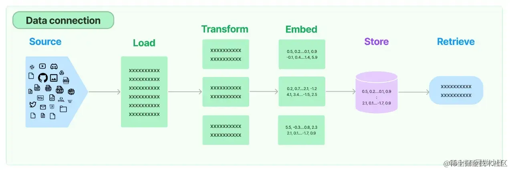

#### 1. Document loaders 文档加载模块

LangChain封装了一系列类型的文档加载模块，例如PDF、CSV、HTML、JSON、Markdown、File Directory等。下面以PDF文件夹在为例看一下用法，其它类型的文档加载的用法都类似。 

##### 1.1 加载本地文件

- LangChain加载PDF文件使用的是pypdf，先安装： 

```
python
复制代码
pip install pypdf
```

- 加载代码示例： 

```
from langchain_community.document_loaders import PyPDFLoader

loader = PyPDFLoader(r"D:\python_project\AI_object\RAG备课\day02\财务管理文档.pdf")
pages = loader.load_and_split()

print(f"第0页：\n{pages[0]}")  ## 也可通过 pages[0].page_content只获取本页内容
```

- `langchain`加载Word文件 

```
pip install unstructured
# 官网:https://docs.unstructured.io/welcome
# 下载时需要开科学上网不然会报错File is not a zip file
# 如果报错开科学上网之后
# import nltk
# nltk.download('punkt')
# nltk.download('averaged_perceptron_tagger')
# 把nltk 重新加载
pip install python-doc
pip install python-docx
```

```python
# from langchain_community.document_loaders import PyPDFLoader
#
# loader = PyPDFLoader(r"D:\python_project\AI_object\RAG备课\day02\财务管理文档.pdf")
# pages = loader.load_and_split()
#
# print(f"第0页：\n{pages[0]}")  ## 也可通过 pages[0].page_content只获取本页内容


from langchain_community.document_loaders import UnstructuredWordDocumentLoader

# 指定要加载的Word文档路径
loader = UnstructuredWordDocumentLoader(r"D:\python_project\AI_object\RAG备课\day02\人事管理流程.docx")
print(loader)

# 加载文档并分割成段落或元素
documents = loader.load()
print(documents)
# 输出加载的内容
for doc in documents:
    print(doc.page_content)

# 需要科学上网需要下载一个包 punkt_tab 
```

##### 1.2 加载在线PDF文件 

- LangChain也能加载在线的PDF文件。 
- 在开始之前，你可能需要安装以下的Python包： 

```
pip install -i https://pypi.tuna.tsinghua.edu.cn/simple unstructured
pip install -i https://pypi.tuna.tsinghua.edu.cn/simple pdf2image
pip install -i https://pypi.tuna.tsinghua.edu.cn/simple opencv-python
pip install -i https://pypi.tuna.tsinghua.edu.cn/simple unstructured-inference
pip install -i https://pypi.tuna.tsinghua.edu.cn/simple pikepdf
```

- 代码示例： 

```python
from langchain_community.document_loaders import PyPDFLoader

loader = PyPDFLoader("https://arxiv.org/pdf/2302.03803.pdf")
data = loader.load()
print(f"第0页：\n{data[0].page_content}")  # 也可通过 pages[0].page_content只获取本页内容
# 需要注意科学上网
```

#### 2.  文档切分模块

- LangChain提供了许多不同类型的文本切分器，具体见下表： 

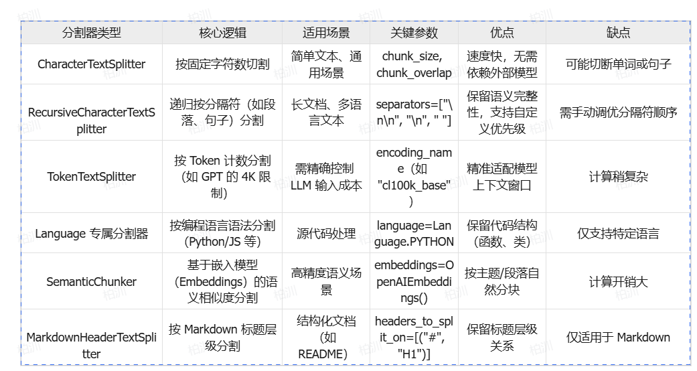

这里以Recursive为例展示用法。RecursiveCharacterTextSplitter是LangChain对这种文档切分方式的封装，里面的几个重点参数：

- chunk_size：每个切块的token数量
- chunk_overlap：相邻两个切块之间重复的token数量

```


from langchain_community.document_loaders import PyPDFLoader
from langchain.text_splitter import RecursiveCharacterTextSplitter

loader = PyPDFLoader("财务管理文档.pdf")
pages = loader.load_and_split()
# print(f"第0页：\n{pages[0].page_content}")
# print(pages)

text_splitter = RecursiveCharacterTextSplitter(
    chunk_size=200,
    chunk_overlap=100,
    length_function=len,
)
# [pages[1].page_content]
# print([page.page_content for page in pages if pages])
paragraphs = text_splitter.create_documents([page.page_content.replace('\n', '').replace(' ', '') for page in pages if pages])
print(paragraphs)
for para in paragraphs:
    print(para.page_content)
    print('-------', len(para.page_content))

```

- 以上示例程序将chunk_overlap设置为100，看下运行效果，可以看到上一个chunk和下一个chunk会有一部分的信息重合，**这样做的原因是尽可能地保证两个chunk之间的上下文关系**：

  这里提供了一个可视化展示文本如何分割的工具，感兴趣的可以看下。

- 工具网址：http://chunkviz.up.railway.app/


#### 3. 文本向量化模型封装 

- LangChain对一些文本向量化模型的接口做了封装，例如OpenAI, Cohere, Hugging Face等。 向量化模型的封装提供了两种接口，一种针对文档的向量化`embed_documents`，一种针对句子的向量化`embed_query`。 
- 示例代码： 
  - 文档的向量化`embed_documents`，接收的参数是字符串数组

```
from langchain_community.embeddings import DashScopeEmbeddings
import os
from dotenv import load_dotenv
load_dotenv()

embeddings_model = DashScopeEmbeddings(dashscope_api_key=os.getenv('api_key'))
embeddings = embeddings_model.embed_documents(
    [
        "Hi there!",
        "Oh, hello!",
        "What's your name?",
        "My friends call me World",
        "Hello World!"
    ]
)
print(len(embeddings), len(embeddings[0]), len(embeddings[1]))
##运行结果 (5, 1536)
```

- 句子的向量化`embed_query`，接收的参数是字符串

```
from langchain_community.embeddings import DashScopeEmbeddings
import os
from dotenv import load_dotenv
load_dotenv()

embeddings_model = DashScopeEmbeddings(dashscope_api_key=os.getenv('api_key'))

embedded_query = embeddings_model.embed_query("What was the name mentioned in the conversation?")
print(embedded_query[:5])
```

#### 4.  向量存储 

- 将文本向量化之后，下一步就是进行向量的存储。 这部分包含两块：一是向量的存储。二是向量的查询。
- 官方提供了三种开源、免费的可用于本地机器的向量数据库示例（chroma、FAISS、 Lance）。因为我在之前RAG的文章中用的chroma数据库，所以这里还是以这个数据库为例。

```
import os

from langchain_huggingface.embeddings import HuggingFaceEmbeddings
from langchain_community.vectorstores import Chroma
from langchain_community.document_loaders import PyPDFLoader
from langchain.text_splitter import RecursiveCharacterTextSplitter
from dotenv import load_dotenv

load_dotenv()
# 读取文件
loader = PyPDFLoader("财务管理文档.pdf")
pages = loader.load_and_split()

text_splitter = RecursiveCharacterTextSplitter(
    chunk_size=200,
    chunk_overlap=100,
    length_function=len,
    add_start_index=True,
)

# 将数据进行切割成块
paragraphs = text_splitter.create_documents([page.page_content for page in pages if pages])
print(paragraphs)
# 创建嵌入模型
model_name = r'D:\LLM\Local_model\BAAI\bge-large-zh-v1___5'
embeddings = HuggingFaceEmbeddings(model_name=model_name)
# 创建chroma数据库，并将文本数据个向量化的数据存入
db = Chroma.from_documents(paragraphs, embeddings, persist_directory="chroma_db")  # 一行代码搞定

# 在数据库中进行搜索
query = "会计核算基础规范"
docs = db.similarity_search(query)  # 一行代码搞定
for doc in docs:
    print(f"{doc}\n-------\n")
```

#### 5. Retrievers 检索器

- 检索器是在给定非结构化查询的情况下返回相关文本的接口。它比Vector stores更通用。检索器不需要能够存储文档，只需要返回（或检索）文档即可。Vector stores可以用作检索器的主干，但也有其他类型的检索器。**检索器接受字符串查询作为输入，并返回文档列表作为输出**。 
- 检索器（Retrievers） 是一个用于从文档集合中检索最相关文档或信息片段的关键组件。它们通常与向量存储（Vector Stores）结合使用，通过计算查询向量与存储中的文档向量之间的相似度来实现高效的语义搜索。简单来说，检索器帮助你找到与特定查询最相关的文档。 
- LangChain检索器提供的检索类型如下： 

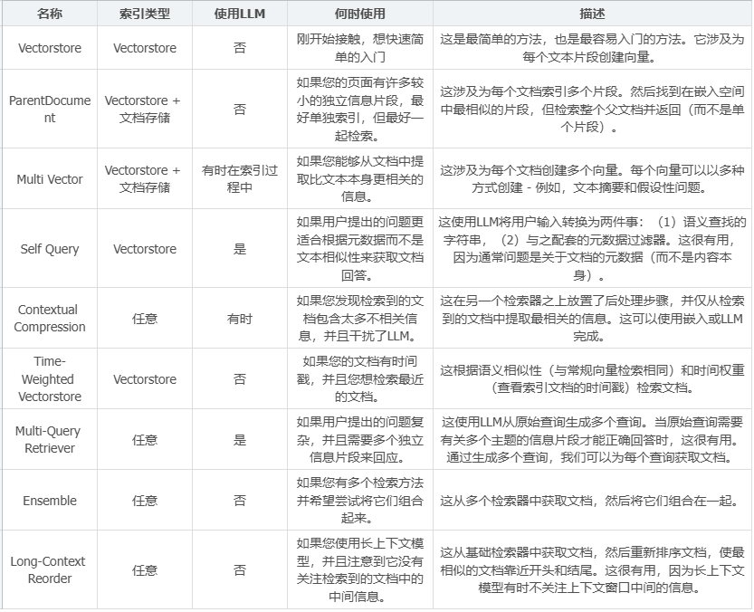

```
import os
from langchain_huggingface.embeddings import HuggingFaceEmbeddings
from langchain_chroma import Chroma
from dotenv import load_dotenv

# 加载环境变量
load_dotenv()

# 创建嵌入模型
model_name = r"D:\LLM\Local_model\BAAI\bge-large-zh-v1___5"

embeddings = HuggingFaceEmbeddings(model_name=model_name)


# 加载现有 Chroma 数据库
persist_directory = "./chroma_db"

db = Chroma(
    persist_directory=persist_directory,
    embedding_function=embeddings
)
print(f"成功加载 Chroma 数据库从 {persist_directory}")

# 实例化检索器
retriever = db.as_retriever(search_kwargs={"k": 4})  # 设置返回文档数量

# 获取问题相关文档
query = "会计核算基础规范"

docs = retriever.invoke(query)
for i, doc in enumerate(docs, 1):
    print(f"结果 {i}:\n{doc.page_content}")

```


### 四. Langchain之Chain链

- 为开发更复杂的应用程序，需要使用Chain来链接LangChain中的各个组件和功能，包括模型之间的链接以及模型与其他组件之间的链接
- 链在内部把一系列的功能进行封装，而链的外部则又可以组合串联。 链其实可以被视为LangChain中的一种基本功能单元。
- API地址：https://python.langchain.com/api_reference/langchain/chains.html 

#### 1. 链的基本使用

- LLMChain是最基础也是最常见的链。LLMChain结合了语言模型推理功能，并添加了PromptTemplate和Output Parser等功能，将模型输入输出整合在一个链中操作。
- 它利用提示模板格式化输入，将格式化后的字符串传递给LLM模型，并返回LLM的输出。这样使得整个处理过程更加高效和便捷。

##### 1.1 未使用Chain

```
# 导入LangChain中的提示模板
from langchain_core.prompts import PromptTemplate
# 导入LangChain中的OpenAI模型接口
from langchain_openai import ChatOpenAI
from dotenv import load_dotenv

load_dotenv()
import os

# 原始字符串模板
template = "桌上有{number}个苹果，四个桃子和 3 本书，一共有几个水果?"

# 创建LangChain模板
prompt_temp = PromptTemplate.from_template(template)

# 根据模板创建提示
prompt = prompt_temp.format(number=2)

model = ChatOpenAI(api_key=os.getenv("api_key"),
                   base_url="https://dashscope.aliyuncs.com/compatible-mode/v1",
                   model='qwen-plus',
                   temperature=0)
# 传入提示，调用模型返回结果
result = model.invoke(prompt)
print(result)
```

##### 1.2 **使用Chain** 

```
from langchain.chains.llm import LLMChain
from langchain_core.prompts import PromptTemplate
from langchain_openai import ChatOpenAI
import os
from dotenv import load_dotenv

load_dotenv()

# 原始字符串模板
template = "桌上有{number}个苹果，四个桃子和 3 本书，一共有几个水果?"

# 创建模型实例
llm = ChatOpenAI(api_key=os.getenv("api_key"),
                 base_url="https://dashscope.aliyuncs.com/compatible-mode/v1",
                 model='qwen-max',
                 temperature=0)

# 创建LLMChain
llm_chain = LLMChain(
    llm=llm,
    prompt=PromptTemplate.from_template(template)
)

# 调用LLMChain，返回结果
result = llm_chain.invoke({"number": 2})
print(type(result))
print(result['text'])
```

##### 1.3 **使用表达式语言 (LCEL)** 

- LangChain Expression Language 是一种以声明式方法，轻松地将链或组件组合在一起的机制。通过利用管道操作符，构建的任何链将自动具有完整的同步、异步和流式支持。
- LangChain 表达式语言（LangChain Expression Language，简称 LCEL）是一种专为链组件（Chain）编排设计的声明式语法，其核心价值在于以统一的方式实现从简单到复杂的 AI 应用构建。从设计之初，LCEL 就致力于消除原型开发与生产部署间的鸿沟 —— 无论是基础的 "提示词 + LLM" 单链结构，还是包含 100 + 步骤的复杂工作流，均可通过同一套语法实现，无需修改代码逻辑。
- python实现管道调用

```

from pipe import select

numbers = [1,2,3]
aa = list(numbers | select(lambda x: x*2))
print(aa)

```


```
class Chain():
    def __init__(self, value):
        self.value = value


    def __or__(self, other):
        # 调用 | 运算符  触发的魔法方法
        return other(self.value)

def prompt(text):
    return "请求回答问题:{}".format(text)

aa = Chain('人工智能是什么?')

res = aa | prompt
print(res)

```


- 普通调用 

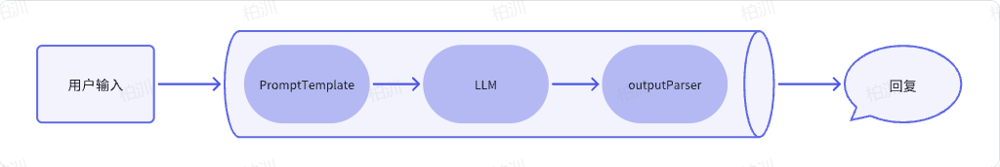

```
from dotenv import load_dotenv
from langchain_openai import ChatOpenAI
from langchain_core.output_parsers import StrOutputParser
from langchain_core.prompts import ChatPromptTemplate
import os

load_dotenv()

# 创建提示词
prompt = ChatPromptTemplate.from_template("tell me a short joke about {topic}")

# 创建llm模型
model = ChatOpenAI(api_key=os.getenv("api_key"),
                   base_url="https://dashscope.aliyuncs.com/compatible-mode/v1",
                   model="qwen-plus")
# 创建输出解释器
output_parser = StrOutputParser()
# 使用chain链在一起
chain = prompt | model | output_parser
print(chain.invoke({"topic": "ice cream"}))

```

- 语言表达式语言(LCEL) 采用声明式[方法](https://en.wikipedia.org/wiki/Declarative_programming)从现有的 Runnable构建新的[Runnable](https://python.langchain.com/docs/concepts/runnables/)。 


#### 2. Runnable是什么？

- Runnable 接口是 `LangChain 0.2` 版本后推出的核心抽象层，旨在通过函数式编程模型统一各类 AI 组件的交互方式。它将语言模型（LLM）、链（Chain）、工具调用、数据处理等操作抽象为可组合的 "可运行单元"（Runnable），允许开发者以类似流水线（Pipeline）的方式编排复杂逻辑，而无需关注底层实现细节。 

##### 2.1 核心特性

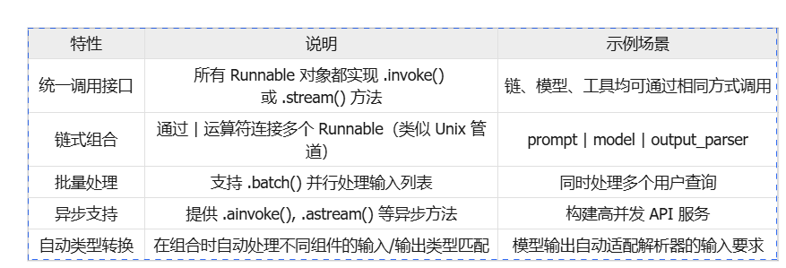

##### 2.2  主要实现类

- `LangChain` 中几乎所有核心组件都实现了 `Runnable` 接口 

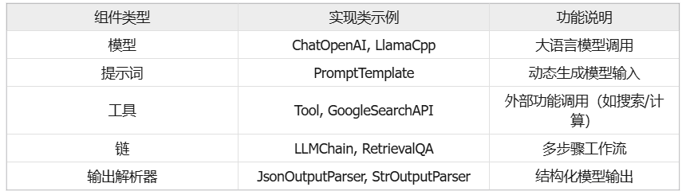

- https://python.langchain.com/api_reference/core/runnables/langchain_core.runnables.base.Runnable.html#langchain_core.runnables.base.Runnable可以在这个网站中查询所有Runnable对应的方法 

##### 2.3 案例  

```
from langchain_openai import ChatOpenAI
from langchain.schema import SystemMessage
from langchain.prompts import ChatPromptTemplate
from langchain_core.output_parsers import JsonOutputParser
from langchain_core.vectorstores import InMemoryVectorStore
from langchain.schema.runnable import RunnableMap, RunnableBranch, RunnableLambda
from langchain_community.tools.tavily_search import TavilySearchResults
from langchain_huggingface import HuggingFaceEmbeddings
from dotenv import load_dotenv
import os

load_dotenv()


class TravelQASystem:
    def __init__(self, openai_api_key, serpapi_api_key, embed_path):
        """初始化旅游问答系统核心组件"""

        # 初始化语言模型
        self.llm = ChatOpenAI(api_key=openai_api_key,
                              base_url="https://dashscope.aliyuncs.com/compatible-mode/v1",
                              model="qwen-plus")

        # 初始化搜索工具
        self.search = TavilySearchResults(tavily_api_key=serpapi_api_key)

        # 初始化嵌入模型
        self.embeddings = HuggingFaceEmbeddings(model_name=embed_path)

        # 构建景点知识库
        self.attraction_data = [
            "故宫：北京地标，明清皇宫，开放时间8:30-17:00",
            "颐和园：皇家园林，昆明湖、长廊等景点",
            "八达岭长城：距离市区70公里，建议游览3-4小时"
        ]

        # 使用内存型向量存储类
        self.vector_store = InMemoryVectorStore.from_texts(
            self.attraction_data, self.embeddings, k=1
        )

    def setup_runnable_pipeline(self):
        """定义Runnable流程管道"""
        # 3.1 问题解析模块：识别地点与查询类型
        parse_prompt = ChatPromptTemplate.from_messages([
            SystemMessage(content="你是旅游助手，需从用户问题中提取地点和查询类型（天气/景点介绍/行程规划）"),
            ("user", """问题：{user_question}请以JSON格式返回：{{"location": "地点", "type": "查询类型"}}""")
        ])
        parse_module = parse_prompt | self.llm | JsonOutputParser()  # Output JSON string

        # 3.2 并行数据获取：天气查询+景点信息检索
        weather_query = RunnableLambda(
            lambda x: self.search.invoke(f"{x['location']} 今日天气")
        )
        attraction_retrieval = (lambda x: x["location"]) | self.vector_store.as_retriever() | (
            lambda x: x[0].page_content)
        # RunnableMap：并行执行天气查询和景点检索
        data_acquisition = RunnableMap({
            "weather": weather_query,
            "attraction": attraction_retrieval,
            "location": (lambda x: x["location"])
        })

        # 3.3 回答生成模块：整合信息并格式化
        generate_prompt = ChatPromptTemplate.from_messages([
            SystemMessage(content="你是专业旅游顾问，需结合景点信息和天气生成建议"),
            ("user", """地点：{location}
                景点信息：{attraction}
                天气情况：{weather}
                请生成1条行程建议，包含注意事项（如天气相关准备）""")
        ])
        generate_module = generate_prompt | self.llm | (lambda x: x.content.strip())

        """
        RunnableBranch实现
        RunnableBranch(
            (lambda x: 条件1, 执行的代码),
            (lambda x: 条件2, 执行的代码2),
            lambda x: {"location": x["location"], "attraction": attraction_retrieval.invoke(x)}
        )
        
        """
        # 3.4 全流程串联
        self.travel_qa_pipeline = (
            # 阶段1：解析问题
                parse_module
                | (lambda x: {"location": x["location"], "type": x["type"]})
                # 阶段2：并行获取数据（仅当查询类型为天气或行程时触发）
                # RunnableBranch：根据查询类型选择数据获取路径
                | RunnableBranch(
            (lambda x: "天气" in x["type"], data_acquisition),
            lambda x: {"location": x["location"], "attraction": attraction_retrieval.invoke(x)}
        )
                # 阶段3：生成回答
                | generate_module
        )

    def process_user_question(self, user_question):
        """处理用户提问并返回回答"""
        input_data = {"user_question": user_question}
        # try:
        response = self.travel_qa_pipeline.invoke(input_data)
        return response


# 示例用法
if __name__ == "__main__":
    # 替换为实际API密钥
    OPENAI_API_KEY = os.getenv("DASHSCOPE_API_KEY")
    # https://www.tavily.com/
    SERPAPI_API_KEY = os.getenv("TAVILY_API_KEY")
    embed_path = r"D:\LLM\Local_model\BAAI\bge-large-zh-v1___5"

    # 初始化系统
    travel_qa = TravelQASystem(OPENAI_API_KEY, SERPAPI_API_KEY, embed_path)
    travel_qa.setup_runnable_pipeline()

    # 测试1：查询天气与景点建议
    question1 = "今天故宫的天气怎么样?"
    answer1 = travel_qa.process_user_question(question1)
    print(f"User Question: {question1}\nAI Answer: {answer1}\n")

```


#### 3. 链的调用方式

- **通过invoke方法** 

```
from langchain_core.prompts import PromptTemplate
from langchain_openai import ChatOpenAI
from dotenv import load_dotenv
import os

load_dotenv()

# 原始字符串模板
template = "桌上有{number}个苹果，四个桃子和 3 本书，一共有几个水果?"
prompt = PromptTemplate.from_template(template)

# 创建模型实例
llm = ChatOpenAI(api_key=os.getenv("api_key"),
                 base_url="https://dashscope.aliyuncs.com/compatible-mode/v1",
                 model='qwen-plus',
                 temperature=0)

# 创建Chain
chain = prompt | llm

# 调用Chain，返回结果
result = chain.invoke({"number": "3"})
print(result)
```

- **通过batch方法(原apply方法)**:batch方法允许输入列表运行链，一次处理多个输入。 

```
from langchain.chains.llm import LLMChain
from langchain_core.prompts import PromptTemplate
from langchain_openai import ChatOpenAI
from dotenv import load_dotenv
import os

load_dotenv()


# 创建模型实例
template = PromptTemplate(
    input_variables=["role", "fruit"],
    template="{role}喜欢吃{fruit}?",
)

# 创建LLM
llm = ChatOpenAI(api_key=os.getenv("api_key"),
                 base_url="https://dashscope.aliyuncs.com/compatible-mode/v1",
                 model='qwen-plus',
                 temperature=0)

# 创建LLMChain     0.1.17 开始被标记为弃用，并计划在未来的 1.0 版本中移除
# llm_chain = LLMChain(llm=llm, prompt=template)
llm_chain = template | llm

# 输入列表
input_list = [
    {"role": "猪八戒", "fruit": "人参果"}, {"role": "孙悟空", "fruit": "仙桃"}
]

# 调用LLMChain，返回结果
result = llm_chain.batch(input_list)
print(result[0].content)
print(result[1].content)
```

- **LLMMathChain：数学链** 
  - LLMMathChain将用户问题转换为数学问题，然后将数学问题转换为可以使用 Python 的 numexpr 库执行的表达式。使用运行此代码的输出来回答问题 

```
# 使用LLMMathChain，需要安装numexpr库
pip install numexpr
```

```
from langchain_openai import ChatOpenAI
from langchain.chains import LLMMathChain
from dotenv import load_dotenv
import os

load_dotenv()
# 创建模型对象
llm = ChatOpenAI(
    api_key=os.getenv("api_key"),
    base_url="https://dashscope.aliyuncs.com/compatible-mode/v1",
    model='qwen-plus',
)

# 创建数学链
# llm_math = LLMMathChain.from_llm(llm)

# 执行链
res = llm_math.invoke("5 ** 3 + 100 / 2的结果是多少？")
print(res)

```

- **create_sql_query_chain：SQL查询链** 
  - create_sql_query_chain是创建生成SQL查询的链，用于将自然语言转换成数据库的SQL查询 (了解)

```
# 这里使用MySQL数据库，需要安装pymysql
pip install pymysql
```

```
from langchain_community.utilities import SQLDatabase

# 连接 MySQL 数据库
db_user = "root"
db_password = "root"
db_host = "127.0.0.1"
db_port = "3306"
db_name = "spiders"
db = SQLDatabase.from_uri(f"mysql+pymysql://{db_user}:{db_password}@{db_host}:{db_port}/{db_name}")

print("哪种数据库：", db.dialect)
print("获取数据表：", db.get_usable_table_names())
# 执行查询
res = db.run("SELECT count(*) FROM ali;")
print("查询结果：", res)
```

```
from langchain_community.utilities import SQLDatabase
from langchain_openai import ChatOpenAI
from langchain.chains import create_sql_query_chain
from dotenv import load_dotenv
import os

load_dotenv()
# 连接 sqlite 数据库
# db = SQLDatabase.from_uri("sqlite:///demo.db")

# 连接 MySQL 数据库
db_user = "root"
db_password = "root"
db_host = "127.0.0.1"
db_port = "3306"
db_name = "spiders"
db = SQLDatabase.from_uri(f"mysql+pymysql://{db_user}:{db_password}@{db_host}:{db_port}/{db_name}")


# 加上大模型
# 创建模型对象
llm = ChatOpenAI(api_key=os.getenv("api_key"),
                 base_url="https://dashscope.aliyuncs.com/compatible-mode/v1",
                 model='qwen-plus'
                 )

chain = create_sql_query_chain(llm=llm, db=db)
# 限制使用的表
response = chain.invoke({"question": "有哪些城市招聘的岗位最多？", "table_names_to_use": ["ali"]})
# 去除 SQLQuery
print(response[10:])
print("查询结果：", db.run(response[10:]))

```


### 五. Agent代理

在LangChain框架中，Agents是一种利用大型语言模型（Large Language Models，简称LLMs）来执行任务和做出决策的系统

在 LangChain 的世界里，Agent 是一个智能代理，它的任务是听取你的需求（用户输入）和分析当前的情境（应用场景），然后从它的工具箱（一系列可用工具）中选择最合适的工具来执行操作

- 使用工具（Tool）：LangChain中的Agents可以使用一系列的工具（Tools）实现，这些工具可以是API调用、数据库查询、文件处理等，Agents通过这些工具来执行特定的功能。
- 推理引擎（Reasoning Engine）：Agents使用语言模型作为推理引擎，以确定在给定情境下应该采取哪些行动，以及这些行动的执行顺序。
- 可追溯性（Traceability）：LangChain的Agents操作是可追溯的，这意味着可以记录和审查Agents执行的所有步骤，这对于调试和理解代理的行为非常有用。
- 自定义（Customizability）：开发者可以根据需要自定义Agents的行为，包括创建新的工具、定义新的Agents类型或修改现有的Agents。
- 交互式（Interactivity）：Agents可以与用户进行交互，响应用户的查询，并根据用户的输入采取行动。
- 记忆能力（Memory）：LangChain的Agents可以被赋予记忆能力，这意味着它们可以记住先前的交互和状态，从而在后续的决策中使用这些信息。
- 执行器（Agent Executor）：LangChain提供了Agent Executor，这是一个用来运行代理并执行其决策的工具，负责协调代理的决策和实际的工具执行。

Agent代理的核心思想是使用语言模型来选择要采取的一系列动作。在链中，动作序列是硬编码的。

在代理中，语言模型用作推理引擎来确定要采取哪些动作以及按什么顺序进行。

因此，在LangChain中，Agent代理就是使用语言模型作为推理引擎，让模型自主判断、调用工具和决定下一步行动。

Agent代理像是一个多功能接口，能够使用多种工具，并根据用户输入决定调用哪些工具，同时能够将一个工具的输出数据作为另一个工具的输入数据。

#### 1. Agent的基本使用

##### 1.1 Tavily在线搜索

- 构建一个具有两种工具的代理：一种用于在线查找，另一种用于查找加载到索引中的特定数据。
- 在LangChain中有一个内置的工具，可以方便地使用Tavily搜索引擎作为工具。
- 访问Tavily（用于在线搜索）注册账号并登录，获取API 密钥  
-   TAVILY_API_KEY申请：https://tavily.com/ 

```
# 加载所需的库
import os
from langchain_community.tools.tavily_search import TavilySearchResults
from dotenv import load_dotenv
load_dotenv()

# 查询 Tavily 搜索 API 并返回 json 的工具
search = TavilySearchResults(tavily_api_key=os.getenv("tavily_key"))
# 执行查询
res = search.invoke("目前市场上苹果手机16的售价是多少？")
print(res)
```

- **创建检索器** 
  - 根据上述查询结果中的某个URL中，获取一些数据创建一个检索器。 

```
# 加载所需的库
import os

from langchain_community.tools.tavily_search import TavilySearchResults
from langchain_community.document_loaders import WebBaseLoader
from langchain_community.vectorstores import FAISS
from langchain_community.embeddings import DashScopeEmbeddings
from langchain_text_splitters import RecursiveCharacterTextSplitter
from dotenv import load_dotenv

load_dotenv()

# 查询 Tavily 搜索 API 并返回 json 的工具
# search = TavilySearchResults()
# # 执行查询
# res = search.invoke("目前市场上苹果手机16的售价是多少？")
# print(res)


# 创建索引器根据上述查询的结果

# 加载HTML内容为一个文档对象
loader = WebBaseLoader("https://news.qq.com/rain/a/20240920A07Y5Y00")
# 读取文档
docs = loader.load()
# print(docs)

# 分割文档
documents = RecursiveCharacterTextSplitter(chunk_size=1000, chunk_overlap=200).split_documents(docs)

# 向量化
vector = FAISS.from_documents(documents, DashScopeEmbeddings(dashscope_api_key=os.getenv('api_key')))

# 创建检索器
retriever = vector.as_retriever()

# 测试检索结果
print(retriever.get_relevant_documents("目前市场上苹果手机16的售价是多少？"))
```

- **得到工具列表** 

```
from langchain.tools.retriever import create_retriever_tool
# 创建一个工具来检索文档
retriever_tool = create_retriever_tool(
    retriever,
    "iPhone_price_search",
    "搜索有关 iPhone 16 的价格信息。对于iPhone 16的任何问题，您必须使用此工具！",
)

# 创建将在下游使用的工具列表
tools = [search, retriever_tool]
```

- 对接大模型
- 创建Agent,这里使用LangChain中一个叫OpenAI functions的代理，然后得到一个AgentExecutor代理执行器 

```
# 加载所需的库
import os

from langchain import hub
from langchain_community.tools.tavily_search import TavilySearchResults
from langchain_community.document_loaders import WebBaseLoader
from langchain_community.vectorstores import FAISS
from langchain_community.embeddings import DashScopeEmbeddings
from langchain_openai import ChatOpenAI
from langchain_text_splitters import RecursiveCharacterTextSplitter
from dotenv import load_dotenv
from langchain.tools.retriever import create_retriever_tool
load_dotenv()

# 查询 Tavily 搜索 API 并返回 json 的工具
search = TavilySearchResults(tavily_api_key=os.getenv("tavily_key"))
# # 执行查询
# res = search.invoke("目前市场上苹果手机16的售价是多少？")
# print(res)


# 创建索引器根据上述查询的结果

# 加载HTML内容为一个文档对象
loader = WebBaseLoader("https://news.qq.com/rain/a/20240920A07Y5Y00")
# 读取文档
docs = loader.load()
# print(docs)

# 分割文档
documents = RecursiveCharacterTextSplitter(chunk_size=1000, chunk_overlap=200).split_documents(docs)

# 向量化
vector = FAISS.from_documents(documents, DashScopeEmbeddings(dashscope_api_key=os.getenv('api_key')))

# 创建检索器
retriever = vector.as_retriever()

# 测试检索结果
# print(retriever.get_relevant_documents("目前市场上苹果手机16的售价是多少？"))


# 创建一个工具来检索文档
retriever_tool = create_retriever_tool(
    retriever,
    "iPhone_price_search",
    "搜索有关 iPhone 16 的价格信息。对于iPhone 16的任何问题，您必须使用此工具！",
)

# 创建将在下游使用的工具列表
tools = [search, retriever_tool]

# 初始化大模型
llm = ChatOpenAI(api_key=os.getenv("api_key"),
                 base_url="https://dashscope.aliyuncs.com/compatible-mode/v1",
                 model='qwen-plus', temperature=0)


# https://smith.langchain.com/hub
# 获取要使用的提示
prompt = hub.pull("hwchase17/openai-functions-agent")
# 打印Prompt
# print(prompt)

# 使用OpenAI functions代理
from langchain.agents import create_openai_functions_agent

# 构建OpenAI函数代理：使用 LLM、提示模板和工具来初始化代理
agent = create_openai_functions_agent(llm, tools, prompt)

from langchain.agents import AgentExecutor
# 将代理与AgentExecutor工具结合起来
agent_executor = AgentExecutor(agent=agent, tools=tools, verbose=True)
# 执行代理 进行对比
# agent_executor.invoke({"input": "目前市场上苹果手机16的各个型号的售价是多少？如果我在此基础上加价5%卖出，应该如何定价?"})
agent_executor.invoke({"input": "美国2024年谁胜出了总统的选举?"})

```

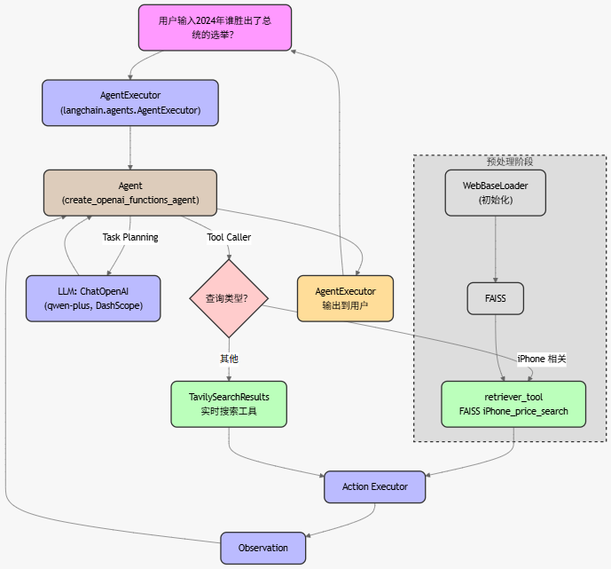


#### 2. OpenAI Functions Agent

- 在`LangChain`中，`create_openai_functions_agent`是一个便捷的函数，用于创建能够与`OpenAI`提供的函数交互的代理。这使得开发人员可以创建智能应用程序，通过代理与用户进行更自然、更有效的对话。 

##### 2.1 **应用示例** 

```

from langchain.agents import create_openai_functions_agent, AgentExecutor
from langchain_community.tools.tavily_search import TavilySearchResults
from langchain_core.prompts import ChatPromptTemplate, MessagesPlaceholder
from langchain_openai import ChatOpenAI
from langchain_core.tools import Tool
import os
from dotenv import load_dotenv

load_dotenv()


# 定义查询订单状态的函数
def query_order_status(order_id):
    if order_id == "1024":
        return "订单 1024 的状态是：已发货，预计送达时间是 3-5 个工作日。"
    else:
        return f"未找到订单 {order_id} 的信息，请检查订单号是否正确。"


# 定义退款政策说明函数
def company_refund_policy(company_name):
    print(company_name)
    if company_name == "tom公司":
        return "tom公司的退款政策是：在购买后7天内可以申请全额退款，需提供购买凭证。"
    else:
        print('输入有误')


# 查询年龄
def get_age(name):
    if name == "tom":
        print(name)
        return "我的年龄是56岁！"
    else:
        print('输入有误')


# 初始化工具
tools = [
    TavilySearchResults(max_results=1, tavily_api_key=os.getenv("tavily_key")),
    Tool(
        name="queryOrderStatus",
        func=query_order_status,
        description="根据订单ID查询订单状态",
        args={"order_id": "订单的ID"}
    ),
    Tool(
        name="companyRefundPolicy",
        func=company_refund_policy,
        description="查询某某公司退款政策详细内容",
        args={"company_name": "公司名称"}
    ),
    Tool(
        name="getAge",
        func=get_age,
        description="查询tom年龄大小",
        args={"name": "查询tom年龄大小"}
    ),
]

# 获取使用的提示
prompt = ChatPromptTemplate.from_messages([
    ("system",
        "你是一个客服助手，使用工具回答问题。传递给工具的内容必须是准确的json数据不结尾的括号多加一个,如果是字符串数据必须和输入的保持一致要完整,不是篡改**重要规则**, "
    ),
    # 用户输入变量
    ("user", "{input}"),
    # 关键点：添加代理中间步骤占位符
    MessagesPlaceholder(variable_name="agent_scratchpad")
])
# print(prompt)
# 选择将驱动代理的LLM
llm = ChatOpenAI(api_key=os.getenv("api_key"),
                 base_url="https://dashscope.aliyuncs.com/compatible-mode/v1",
                 model='qwen-plus')

# 构建OpenAI函数代理
agent = create_openai_functions_agent(llm, tools, prompt)

# 通过传入代理和工具创建代理执行器
agent_executor = AgentExecutor(agent=agent, tools=tools, handle_parsing_errors=True, verbose=True)

# 定义一些测试询问
queries = [
    "请问订单1024的状态是什么？",
    "请问tom公司退款政策是什么？",
    "2024年谁胜出了美国总统的选举"
]

# 运行代理并输出结果
for input in queries:
    response = agent_executor.invoke({"input": input})
    print(f"客户提问：{input}")
    print(f"代理回答：{response}\n")

# response = agent_executor.invoke({"input": "2024年谁胜出了美国总统的选举"})
# print(f"代理回答：{response}\n")

```


### 六. LangChain之Tools工具

#### 1. 工具Tools

工具是代理、链或LLM可以用来与世界互动的接口。它们结合了几个要素

- 工具的名称
- 工具的描述
- 该工具输入的JSON模式
- 要调用的函数
- 是否应将工具结果直接返回给用户

LangChain通过提供统一框架集成功能的具体实现。在框架内，每个功能被封装成一个工具，具有自己的输入输出及处理方法。代理接收任务后，通过大模型推理选择适合的工具处理任务。一旦选定，LangChain将任务输入传递给该工具，工具处理输入生成输出。输出经过大模型推理，可用于其他工具的输入或作为最终结果返回给用户。

Langchain地址：https://python.langchain.com/api_reference/community/tools.html

##### 1.1 工具的初步认识

```

from langchain_community.tools.tavily_search import TavilySearchResults
from dotenv import load_dotenv
import os

load_dotenv()

# 初始化工具 可以根据需要进行配置
tool = TavilySearchResults(top_k_results=1, doc_content_chars_max=100)

# 工具默认名称
print("name:", tool.name)
# 工具默认的描述
print("description:", tool.description)
# 输入内容 默认JSON模式
print("args:", tool.args)
# 是否直接返回工具的输出。
print("return_direct:", tool.return_direct)

# 可以用字典输入来调用这个工具
print(tool.run({"query": "langchain"}))
# 使用单个字符串输入来调用该工具。
print(tool.run("langchain"))
# 需要科学上网
```

##### 1.2 **自定义工具** 

- 在LangChain中，自定义工具有多种方法 
- **@tool装饰器** 
- @tool装饰器是定义自定义工具的最简单方法。装饰器默认使用函数名称作为工具名称，但可以通过传递字符串作为第一个参数来覆盖此设置。此外，装饰器将使用函数的文档字符串作为工具的描述 - 因此必须提供文档字符串。 

```

from langchain.tools import tool

@tool
def add_number(a: int, b: int) -> int:
    """add two numbers."""
    return a + b


print(add_number.name)
print(add_number.description)
print(add_number.args)

res = add_number.run({"a": 10, "b": 20})
print(res)

```


### 七. LangChain之Memory

- 大多数的 LLM 应用程序都会有一个会话接口，允许我们和 LLM 进行多轮的对话，并有一定的上下文记忆能力。但实际上，模型本身是不会记忆任何上下文的，只能依靠用户本身的输入去产生输出。而实现这个记忆功能，就需要额外的模块去保存我们和模型对话的上下文信息，然后在下一次请求时，把所有的历史信息都输入给模型，让模型输出最终结果。

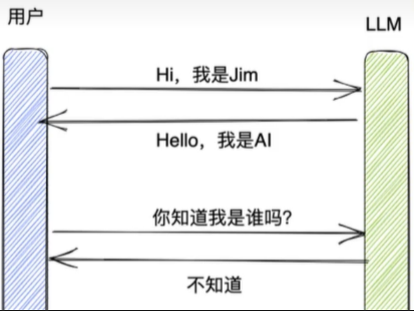

```
from dotenv import load_dotenv
from langchain_openai import ChatOpenAI
import os
load_dotenv()

llm = ChatOpenAI(api_key=os.getenv("api_key"),
                 base_url=os.getenv("base_url"),
                 model_name="qwen-plus")

# 直接提供问题，并调用llm
response = llm.invoke("你好我是柏汌")
# print(response)
# print("=" * 50)
print(response.content)

response = llm.invoke("我是谁?")

print(response.content)

```

- 而在 LangChain 中，提供这个功能的模块就称为 Memory，用于存储用户和模型交互的历史信息。
- 记忆系统需要支持两种基本操作：读取和写入。
  - 在接收到初始用户输入之后但在执行核心逻辑之前，链将从其内存系统中读取并增强用户输入。
  - 在执行核心逻辑之后但在返回答案之前，链会将当前运行的输入和输出写入内存，以便在将来的运行中引用它们。 

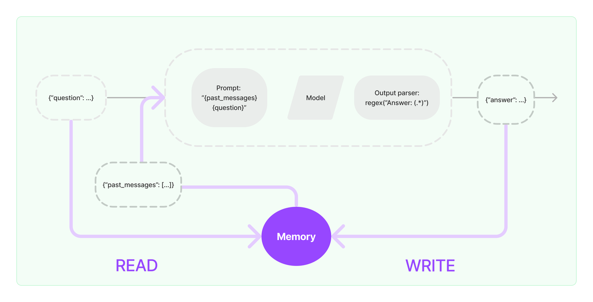

- 对该图的解释: 

  1、输入问题: ({"question": ...})

  2、读取历史消息: 从Memory中READ历史消息（{"past_messages": [...]}）

  3、构建提示（Prompt): 读取到的历史消息和当前问题会被合并，构建一个新的Prompt

  4、模型处理: 构建好的提示会被传递给语言模型进行处理。语言模型根据提示生成一个输出。

  5、解析输出: 输出解析器通过正则表达式 regex("Answer: (.*)")来解析,返回一个回答（{"answer": ...}）给用户

  6、得到回复并写入Memory: 新生成的回答会与当前的问题一起写入Memory，更新对话历史。Memory会存储最新的对话内容，为后续的对话提供上下文支持。

#### 1. Chat Messages

- Chat Messages: 最基础的记忆管理方法,是用于管理和存储对话历史的具体实现。它们通常用于构建对话系统，帮助系统保持对话的连续性和上下文。这些消息通常包含了对话的每一轮，包括用户的输入和系统的响应。 

```

from langchain_community.chat_message_histories import ChatMessageHistory

history = ChatMessageHistory()
history.add_user_message("hi!")
history.add_user_message("你好")
history.add_ai_message("whats up?")
print(history.messages)

```


#### 2. `RunnableWithMessageHistory` 

- `RunnableWithMessageHistory` 包装另一个 Runnable 并为其管理聊天消息历史记录；它负责读取和更新聊天消息历史记录。 

##### 2.1 **本地内存存储** 

- 可以将聊天记录进行本地存储

```
import json
from langchain_core.runnables.history import RunnableWithMessageHistory
from langchain_community.chat_message_histories import ChatMessageHistory
from langchain_core.prompts import ChatPromptTemplate, MessagesPlaceholder
from langchain_openai import ChatOpenAI
from langchain.schema import messages_from_dict, messages_to_dict
from dotenv import load_dotenv
import os

# 加载环境变量（需要包含API_KEY）
load_dotenv()

# 初始化大语言模型（通义千问）
llm = ChatOpenAI(
    api_key=os.getenv("api_key"),  # 从环境变量读取API密钥
    base_url="https://dashscope.aliyuncs.com/compatible-mode/v1",  # 阿里云兼容端点
    model="qwen-turbo"  # 使用qwen-turbo模型
)

# 创建对话提示模板
prompt = ChatPromptTemplate.from_messages([
    # 系统角色设定
    ("system", "你是一个友好的助手"),
    # 历史消息占位符（变量名必须与链配置中的history_messages_key一致）
    MessagesPlaceholder(variable_name="history"),
    # 用户输入占位符
    ("user", "{input}")
])

# 构建基础对话链（组合提示模板和语言模型）
base_chain = prompt | llm

# 全局会话存储字典（Key: session_id, Value: ChatMessageHistory实例）
store = {}


def get_session_history(session_id):
    """获取或创建会话历史存储对象
    Args:
        session_id: 会话唯一标识（用于多会话隔离）
    Returns:
        对应会话的聊天历史记录对象
    """
    if session_id not in store:
        store[session_id] = ChatMessageHistory()  # 初始化空历史记录
    return store[session_id]


# 创建支持历史记录的对话链
conversation = RunnableWithMessageHistory(
    base_chain,  # 基础对话链
    get_session_history=get_session_history,  # 历史记录获取方法
    input_messages_key="input",  # 输入文本的键名
    history_messages_key="history"  # 历史记录的键名（需与提示模板中的变量名一致）
)


def save_memory(filepath, session_id):
    """保存指定会话的历史记录到文件
    Args:
        filepath: 文件保存路径（建议使用.json扩展名）
        session_id: 要保存的会话ID（默认"default"）
    """
    history = get_session_history(session_id)
    # 将消息对象列表转换为字典格式
    dicts = messages_to_dict(history.messages)
    # 写入JSON文件（UTF-8编码）
    with open(filepath, "w", encoding='utf-8') as f:
        json.dump(dicts, f, ensure_ascii=False)


def load_memory(filepath, session_id):
    """从文件加载历史记录到指定会话
    Args:
        filepath: 历史记录文件路径
        session_id: 要加载到的会话ID（默认"default"）
    """
    with open(filepath, "r", encoding='utf-8') as f:
        dicts = json.load(f)
    # 将字典转换回消息对象列表
    messages = messages_from_dict(dicts)
    # 更新全局存储中的会话历史
    store[session_id] = ChatMessageHistory(messages=messages)


def legacy_predict(input_text: str, session_id: str = "default") -> str:
    """模拟旧版predict方法的调用接口
    Args:
        input_text: 用户输入文本
        session_id: 会话ID（默认"default"）
    Returns:
        AI生成的回复文本
    """
    return conversation.invoke(
        {"input": input_text},  # 输入参数
        # 配置参数（必须包含session_id来关联历史记录）
        config={"configurable": {"session_id": session_id}}
    ).content


if __name__ == "__main__":
    # 使用默认会话ID
    SESSION_ID = "default"

    # 模拟连续对话（4轮）
    legacy_predict("你好", SESSION_ID)  # 问候
    legacy_predict("你是谁,我是柏汌", SESSION_ID)  # 身份确认
    legacy_predict("你的背后实现原理是什么", SESSION_ID)  # 技术原理询问

    # 查询对话历史（第4轮）
    last_response = legacy_predict('截止到现在我们聊了什么?', SESSION_ID)
    print("最后一次回答:", last_response)

    # 持久化保存对话历史（JSON格式）
    save_memory("./memory_new.json", SESSION_ID)

    # 模拟重新加载历史记录（清空当前会话后重新加载）
    load_memory("./memory_new.json", SESSION_ID)

    # 验证历史恢复效果（第5轮）
    reload_response = legacy_predict("我回来了，我们之前都聊了一些什么?", SESSION_ID)
    print("\n恢复后的回答:", reload_response)
```


### 八. `LangSmith`使用

#### 1. 什么是 `LangSmith`？

`LangSmith` 是一个用于构建、调试和监控大型语言模型 (LLM) 应用的平台，由 LangChain 团队开发。它帮助开发者跟踪 LLM 的调用、性能和输出，优化提示词（Prompt）设计，并管理数据集和评估。

**主要功能:**

- **跟踪（Tracing）**：记录 LLM 调用、输入输出和元数据。
- **调试（Debugging）**：分析模型行为，识别问题。
- **数据集管理**：创建和维护测试数据集。
- **评估（Evaluation）**：运行测试用例，评估模型性能。
- **监控（Monitoring）**：实时监控生产环境中的 LLM 应用。

#### 2. 配置 API 密钥

1. 注册 `LangSmith` 账号。
   - https://smith.langchain.com/
2. 在 `LangSmith` 仪表板中获取 API 密钥。

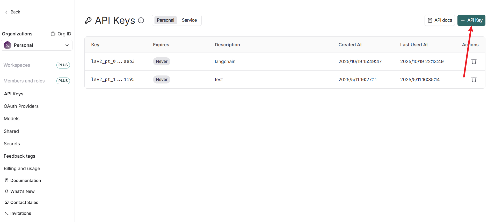

3. 设置环境变量：

```
LANGSMITH_API_KEY = 'Langsmith-key'
LANGCHAIN_TRACING_V2="true"
LANGCHAIN_PROJECT="在Langsmith存储的名称"
LANGCHAIN_ENDPOINT="https://api.smith.langchain.com" # 任务发布站点
```

4. 执行代码不需要有任何的改动,会自动把执行的内容上传到`Langsmith`进行管理,在平台把任务已树结构展示项目的内容,展示项目的耗时,加载的提示词内容等等  

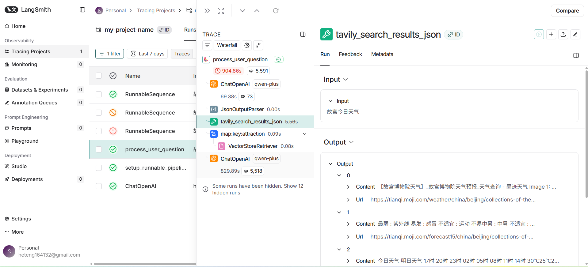

```
from langchain.prompts import PromptTemplate
from langchain_openai import ChatOpenAI
from dotenv import load_dotenv
load_dotenv()

import os


# 定义小红书文案提示词
prompt = PromptTemplate.from_template("""
你是一位小红书内容创作者，擅长撰写简洁、吸引人的种草文案。目标是创作100-150字的小红书风格文案，面向18-35岁用户，激发兴趣和互动。

**输入**：
- 产品/主题：{product}
- 核心特点：{features}
- 目标情绪：{emotion}
- 目标行动：{action}

**要求**：
1. 风格：亲切、口语化，带小幽默或生活场景，融入“种草”“安利”等流行词。
2. 结构：吸睛开头（问题/场景），中间突出特点，结尾引导互动（提问/号召）。
3. 使用1-2个emoji，保持自然。
4. 标题：10字以内。

**输出**：
标题:
文案正文:分2-3段，每段2-3句，结尾带互动引导
""")

llm = ChatOpenAI(
    api_key=os.getenv("DASHSCOPE_API_KEY"),
    base_url=os.getenv("DASHSCOPE_BASE_URL"),
    model='qwen-plus'
)

# 创建 LangChain 链
chain = prompt | llm

# 输入示例
input_data = {
    "product": "无线耳机",
    "features": "音质清晰、佩戴舒适、续航长",
    "emotion": "科技感、轻松",
    "action": "分享体验"
}
response = chain.invoke(input_data)
# 输出生成的小红书文案
print(response.content)

```


#### 3. 提示词优化

- `Langsmith` 提供了提示词优化和导出提示词模版,可以用`Langsmith` 优化自己的提示词得到满意的输出,在将提示词导出使用

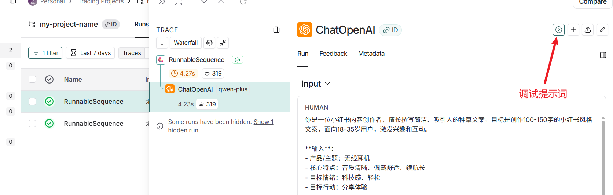

- 使用`Langsmith`生成提示词

```
from langchain.prompts import PromptTemplate
from langchain_openai import ChatOpenAI
from dotenv import load_dotenv
load_dotenv()
from langsmith import Client

import os

client = Client(api_key=os.getenv("LANGSMITH_API_KEY"))
prompt = client.pull_prompt("test")

print(prompt)
llm = ChatOpenAI(
    api_key=os.getenv("DASHSCOPE_API_KEY"),
    base_url=os.getenv("DASHSCOPE_BASE_URL"),
    model='qwen-plus'
)

# 创建 LangChain 链
chain = prompt | llm

# 输入示例
input_data = {
    "product": "无线耳机",
    "features": "音质清晰、佩戴舒适、续航长",
    "emotion": "科技感、轻松",
    "action": "分享体验"
}

response = chain.invoke(input_data)

# 输出生成的小红书文案
print(response.content)

```

