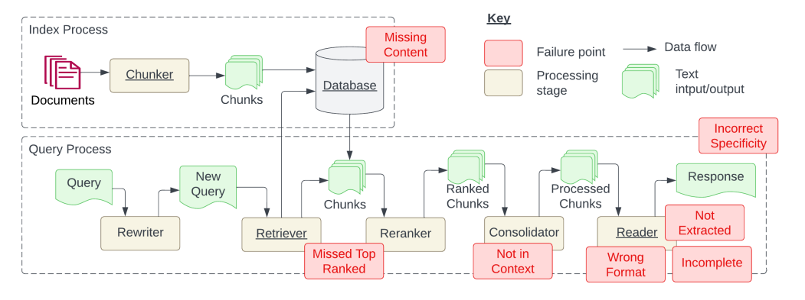
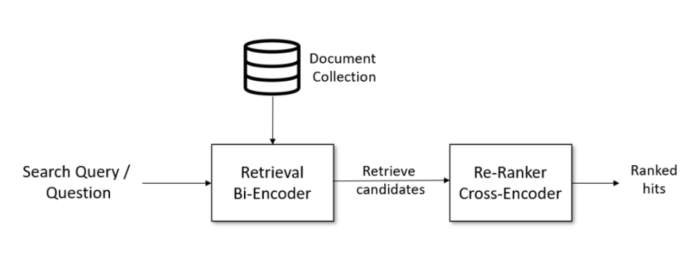
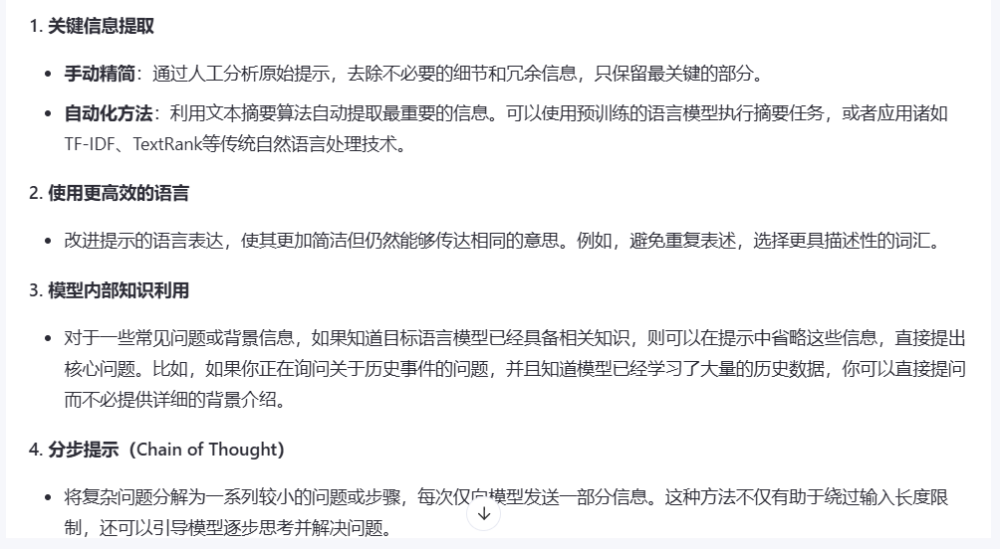
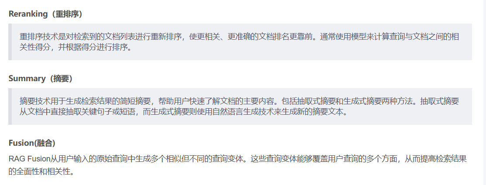
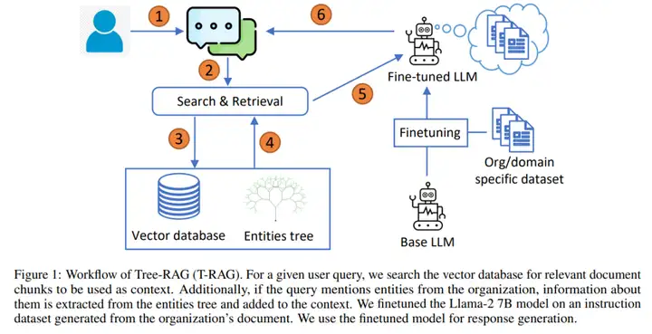
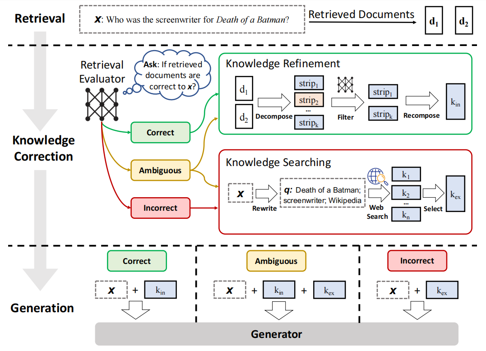
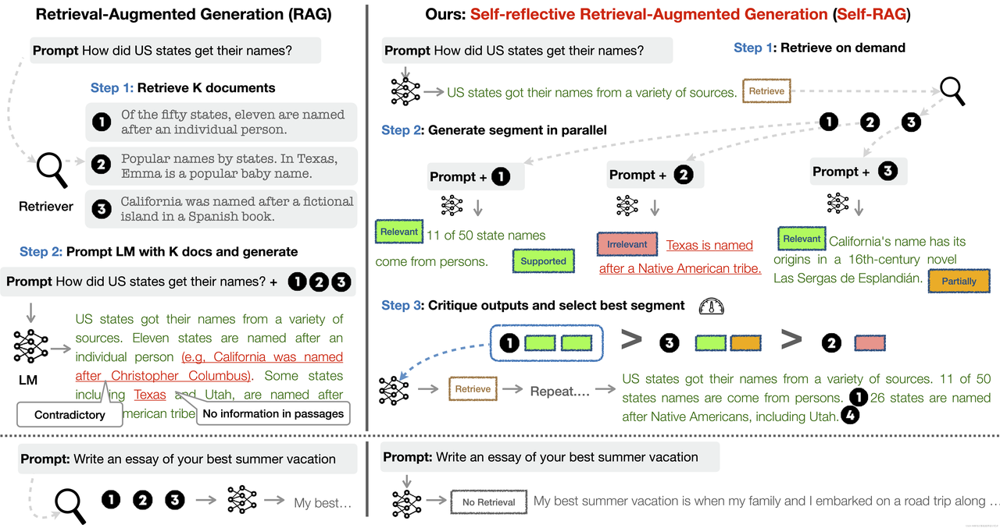
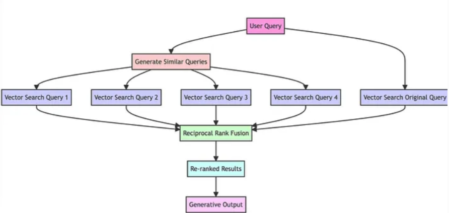
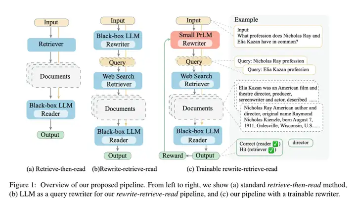
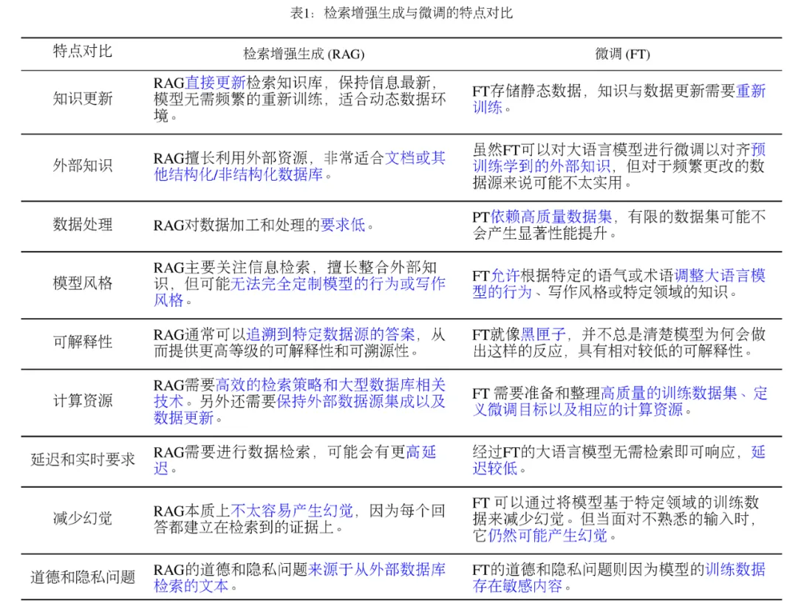

## RAG进阶 

**学习目标:**

1. 了解 RAG存在的问题
2. 熟悉 RAG优化的点
3. 熟悉 Advanced RAG的实现方式
4. 熟悉 Advanced RAG的各个变体
5. 了解 RAG和微调的差异


### 一. RAG存在的问题

#### 1. RAG流程回顾

- **RAG具体实现流程回顾**：加载文件 => 读取文本 => 文本分割 =>文本向量化 =>问句向量化 =>在文本向量中匹配出与问句向量最相似的 top k 个 =>匹配出的文本作为上下文和问题一起添加到 prompt 中 =>提交给 LLM 生成回答 

#### 2. RAG痛点分析

**RAG痛点问题分析论文** 

- 论文:《Seven Failure Points When Engineering a Retrieval Augmented Generation System》
- 地址：<https://arxiv.org/pdf/2401.05856>

##### 2.1 具体痛点问题总结

> 基本RAG流程可以分为两大块：**文本向量化构建索引的过程（Index Process）** 和 **检索增强问答的过程（Query Process）**。
>
> failure point:故障点                   Data flow:数据流 
>
> processing stage: 处理阶段      Text input/output: 文本输入/输出



Index Process（文本向量化构建索引的过程）: 

- 加载过程:输入原始文档 --> 文档分割 --> 向量处理存入数据库

- **MIssing Content(内容缺失):** 原本的文本中就没有问题的答案 
- **文档加载准确性和效率：** 比如pdf文件的加载，如何提取其中的有用文字信息和图片信息等
- **文档切分的粒度：** 文本切分的大小和位置会影响后面检索出来的上下文完整性和与大模型交互的token数量，怎么控制好文档切分的度，是个难题。

Query Process（检索增强回答的过程中）: 

- 查询过程: 用户提交问题 --> 查询重写器对问题进行重新表述 --> 检索器去数据库检索相关内容 --> 对检索的块进行重排生成列表 --> 合并整理列表中的块 --> 读取合并之后的块 --> 生成响应返回给用户

- **Missed Top Ranked:** 错过排名靠前的文档
- **Not in Context:**  提取上下文与答案无关
- **Wrong Format(格式错误):** 例如需要Json，给了字符串
- **Incomplete(答案不完整):** 答案只回答了问题的一部分
- **Not Extracted(未提取到答案:)** 提取的上下文中有答案，但大模型没有提取出来
- **Incorrect Specificity:** 答案不够具体或过于具体


### 二. RAG优化

#### 1. 内容缺失

准备的外挂文本中没有回答问题所需的知识。这时候，RAG可能会提供一个自己编造的答案。

- **增加相应知识库**：将相应的知识文本加入到向量知识库中。
- **数据清洗与增强**：输入垃圾，那也必定输出垃圾。如果你的源数据质量低劣，比如包含互相冲突的信息，那不管你的 RAG 工作构建得多么好，它都不可能用你输入的垃圾神奇地输出高质量结果。这个解决方案不仅适用于这个痛点，任何RAG工作流程想要获得优良表现，都必须先清洁数据。
- **更好的Prompt设计**：通过Prompts，让大模型在找不到答案的情况下，输出“根据当前知识库，无法回答该问题”(不让他胡乱回答)等提示。这样的提示，就能鼓励模型承认自己的局限，并更透明地向用户传达它的不确定。虽然不能保证 100% 准确度，但在清洁数据之后，精心设计 prompt 是最好的做法之一。

#### 2. 文档加载准确性和效率 

- **优化文档读取器：**一般知识库中的文档格式都不尽相同，HTML、PDF、MarkDown、TXT、CSV等。每种格式文档都有其都有的数据组织方式。怎么在读取这些数据时将干扰项去除（如一些特殊符号等），同时还保留原文本之间的关联关系（如csv文件保留其原有的表格结构），是主要的优化方向。  目前针对这方面的探索为：针对每一类文档，涉及一个专门的读取器。如LangChain中提供的WebBaseLoader专门用来加载HTML文本等。 网址:<https://python.langchain.com/v0.1/docs/modules/data_connection/document_loaders/>
- **数据清洗与增强：**输入垃圾，那也必定输出垃圾。如果你的源数据质量低劣，比如包含互相冲突的信息，那不管你的 RAG 工作构建得多么好，它都不可能用你输入的垃圾神奇地输出高质量结果。这个解决方案不仅适用于这个痛点，任何RAG工作流程想要获得优良表现，都必须先清洁数据。

#### 3. 文档切分的粒度 

粒度太大可能导致检索到的文本包含太多不相关的信息，降低检索准确性，粒度太小可能导致信息不全面，导致答案的片面性。问题的答案可能跨越两个甚至多个片段

- **固定长度的分块**：直接设定块中的字数，每个文本块有多少字。
- **内容重叠分块**：在固定大小分块的基础上，为了保持文本块之间语义上下文的连贯性，在分块时，保持文本块之间有一定的内容重叠。
- **基于结构的分块**：基于结构的分块方法利用文档的固有结构，如HTML或Markdown中的标题和段落，以保持内容的逻辑性和完整性。
- **基于递归的分块**：重复的利用分块规则不断细分文本块。在langchain中会先通过段落换行符（\n\n）进行分割。然后，检查这些块的大小。如果大小不超过一定阈值，则该块被保留。对于大小超过标准的块，使用单换行符（\n）再次分割。以此类推，不断根据块大小更新更小的分块规则（如空格，句号）。
- **分块大小的选择**：
  - 不同的嵌入模型有其最佳输入大小。比如Openai的text-embedding-ada-002的模型在256 或 512大小的块上效果更好。
  - 文档的类型和用户查询的长度及复杂性也是决定分块大小的重要因素。处理长篇文章或书籍时，较大的分块有助于保留更多的上下文和主题连贯性；而对于社交媒体帖子，较小的分块可能更适合捕捉每个帖子的精确语义。如果用户的查询通常是简短和具体的，较小的分块可能更为合适；相反，如果查询较为复杂，可能需要更大的分块。

#### 4. 错过排名靠前的文档

**外挂知识库中存在回 答问题所需的知识，但是可能这个知识块与问题的向量相似度排名并不是靠前的，导致无法召回该知识块传给大模型，导致大模型始终无法得到正确的答案。** 

- **增加召回数量**

增加召回的 topK 数量，也就是说，例如原来召回前3个知识块，修改为召回前5个知识块。不推荐此种方法，因为知识块多了，不光会增加token消耗，也会增加大模型回答问题的干扰。

- **重排（Reranking）**

该方法的步骤是，首先检索出 topN 个知识块（N > K，过召回），然后再对这 topN 个知识块进行重排序，取重排序后的 K 个知识块当作上下文。重排是利用另一个排序模型或排序策略，对知识块和问题之间进行关系计算与排序。



#### 5. 提取上下文与答案无关 

**内容缺失** 或 **错过排名靠前的文档** 的具体体现 

#### 6. 格式错误 

- **Prompt调优**

优化Prompt逐渐让大模型返回正确的格式。

- **Pydantic方法**

使用Pydantic进行结果格式验证，例如使用LangChain中的PydanticOutputParser类来校验输出格式。

通过 Pydantic，你可以轻松地创建数据模型，这些模型不仅能够验证输入的数据是否符合预期格式，还能自动转换数据类型（如将字符串转换为日期时间对象）。Pydantic 特别适合处理 JSON 数据、环境变量配置等场景。

参考:https://python.langchain.com/v0.2/docs/how_to/extraction_parse/#using-pydanticoutputparser

#### 7. 答案不完整 

**将问题分开提问** 

- 一方面引导用户精简问题，一次只提问一个问题。 另一方面，针对用户的问题进行内部拆分处理，拆分成数个子问题，等子问题答案都找到后，再总结起来回复给用户 

#### 8. 未提取到答案 

**提示压缩技术**

- 在处理大型语言模型（LLMs）时，提示压缩技术变得尤为重要，尤其是当你面对输入长度限制或希望提高效率和减少成本的时候。提示压缩旨在减少提示的大小，同时尽可能保持其表达的信息量和意图不变。



- 网址:https://python.langchain.com/v0.2/docs/how_to/contextual_compression/#adding-contextual-compression-with-an-llmchainextractor 

#### 9. 答案太具体或太笼统 

**幻觉问题 暂无好的方案解决**


### 三. Advanced RAG前沿Paper解读


#### 1. 检索过程

基于朴素RAG，高级RAG主要通过预检索策略和后检索策略来提升检索质量。(可以更好的解决RAG的痛点) 

##### 1.1 预检索过程

​     高级RAG着重优化了索引结构和查询的方式。优化索引旨在提高被索引内容的质量，包括增强数据颗粒度、优化索引结构、添加元数据、对齐优化和混合检索等策略。查询优化的目标则是明确用户的原始问题，使其更适合检索任务，使用了**查询重写、查询转换、查询扩展**等技术。 

1. 查询重写（Query Rewriting）：
   目标：在不改变查询意图的情况下，重新表述查询使其更清晰、更适用于检索系统。
   常用技术：

   - 使用大语言模型（LLM）进行重写：将原始查询输入LLM，要求其生成一个或多个保留原意的改进版本。

   示例提示词：

   - "请将以下用户查询改写成更清晰、更完整的句子，同时保持原意不变。用户查询：{query}"

2. 查询转换（Query Transformation）：
   目标：通过结构化的转换操作改变查询形式，使其更适合检索。
   常用技术：

   - 关键词提取：从查询中提取关键名词和动词，忽略停用词和修饰词。
   - 分步查询（Step-back Prompting）：将复杂查询分解为多个子问题，然后分别检索，最后再组合答案（这通常需要多步检索）。
   - 子问题分解：将复杂问题分解成若干个简单的子问题，每个子问题单独检索，然后将所有检索结果合并提供给生成模型。

3. 查询扩展（Query Expansion）：
   目标：在原始查询的基础上增加相关的术语或上下文，以提供更丰富的检索信息。
   常用技术：

   - 使用LLM进行扩展：直接让LLM生成与原始查询相关的扩展词或短语。
   - 多查询扩展（Multi-Query Generation）：使用LLM生成多个与原始查询相关的不同表述的查询，然后分别检索，最后合并检索结果。

##### 1.2 **后检索过程** 

对于由问题检索得到的一系列上下文，后检索策略关注如何优化它们与查询问题的集成。这一过程主要包括**重新排序和压缩上下文**。重新排列检索到的信息，将最相关的内容予以定位标记，这种策略已经在LlamaIndex2、LangChain等框架中得以实施。直接将所有相关文档输入到大型语言模型（LLMs）可能导致信息过载，为了缓解这一点，后检索工作集中选择必要的信息，强调关键部分，并限制了了相应的上下文长度。 



#### 2. Advanced RAG变体

它们在基础 RAG 的框架上，通过不同的技术路径和侧重点解决了特定场景下的问题 

| 方法                      | 核心优化方向      | 关键技术亮点                       |
| ------------------------- | ----------------- | ---------------------------------- |
| **T-RAG**                 | 任务/时间敏感检索 | 分阶段检索、时效性优先             |
| **CRAG**                  | 检索质量动态修正  | 置信度评估 + 重检索/人工干预       |
| **Self-RAG**              | 生成过程自我反思  | LLM自我评估输出质量并触发检索      |
| **GraphRAG**              | 知识图谱增强检索  | 基于图结构的上下文推理             |
| **RAG-Fusion**            | 多查询扩展检索    | 生成多个相关查询，合并结果         |
| **Rewrite-Retrieve-Read** | 查询重写优化      | 先重写问题再检索（提升检索适配性） |

##### 2.1 T-RAG



- 论文地址：https://arxiv.org/pdf/2402.07483 
- 目标：开发一个可以安全、高效地回答私有企业文档问题的大型语言模型（LLM）应用程序，主要考虑数据安全性、有限的计算资源以及需要健壮的应用程序来正确响应查询。 
- 方法：应用程序结合了检索增强生成（RAG）和微调的开源 LLM，将其称之为 Tree-RAG（T-RAG）。T-RAG 使用树结构来表示组织内的实体层次结构，用于生成文本描述，以增强对组织层次结构内的实体进行查询时的上下文。 

**思路分析:** 

1. 用户提出一个查询。

2. 系统进行搜索和检索，从向量数据库中查找相关的文档块，作为上下文使用。

3. 如果查询涉及到组织中的实体，从实体树中提取相关信息并添加到上下文中。

   1. **示例** 

      - 问题：*“比较OpenAI的GPT-4和Google的PaLM 2的技术差异”* 

      - 实体树结构：

        ```
        Root: 模型对比  
        ├─ OpenAI  
        │  └─ GPT-4  
        │     ├─ 训练数据量  
        │     └─ 多模态能力  
        ├─ Google  
        │  └─ PaLM 2  
        │     ├─ 能耗效率  
        │     └─ 多语言支持  
        └─ 对比维度  
           ├─ 参数量  
           └─ 应用场景
           
        # 1. 任务拆解：将复杂问题分解为实体关联的子任务
        # 2. 精准检索：针对每个实体分支生成特定检索查询，减少噪声。
        
        ```

4. 系统通过精调的LLM（如Llama-2 7B模型）生成响应。

5. 为了实现精调，使用组织或领域特定的数据集对基础LLM进行微调。

6. 最后，生成的响应返回给用户。


##### 2.2 CRAG

可矫正的检索增强生成 



论文地址：https://arxiv.org/pdf/2401.15884 

**思路分析:** 

1. **Retrieval 阶段：** retriever 先根据 user query 检索到相关的 docs 
2. **Knowledge Correction 阶段：** 这里引入了一个轻量级的 Retrieval Evaluator 来评估检索到的 docs 与 user query 之间的相关性分数，并根据这个相关性分数，触发三种 action —— Correct、Incorrect 和 Ambiguous： 
   - Correct：表示检索到的 doc 是有一定相关性的，但尽管一个 doc 被认为是相关的，该 doc 其中仍会存在噪音信息，因此需要进一步地 refine，所以这里将 docs 做 de-compose 得到多个 knowledge strips，然后从中过滤出有用的 strip 并 re-compose，得到矫正后的 doc。
   - Incorrect：表示可以认为所检索到的 docs 对 query 没有帮助，因此需要寻找新的知识源，这里引入 web searcher 来从 Internet 上进行检索，并从中选出有用的知识，得到矫正后的 doc。
   - Ambiguous：表示 retrieval evaluator 也没有信心说 docs 是否与 query 有关了，这个时候会同时做 Correct 和 Incorrect 时的动作，从而提高系统的鲁棒性(异常之后的处理)和可靠性。
3. **Generation 阶段：** 将矫正后的 doc 与 user query 进行拼接，交给 LLM Generator 来完成问题的回答。 

##### 2.3 self-RAG 

可自我反思的检索增强生成 



论文地址：https://arxiv.org/pdf/2310.11511

参考： https://selfrag.github.io/

**思路分析:** 

1. **Retrieve on demand（按需检索）** 
   - 首先生成一个初步回答，比如“美国各州的名字来源多种多样。”并根据回答中的需要检索文档。 
2. **Generate segment in parallel（并行生成段落）** 
   - 并行生成（Parallel Generation）：使用初步响应加上按需检索到的文档，系统并行生成多个响应段落，每个段落基于不同的文档和提示。
   - 评估生成段落（Evaluate Segments）：系统对每个生成的段落进行评估，判断其相关性和支持度。
3. **Critique outputs and select best segment（评估输出并选择最佳段落）** 
   - 评估输出（Critique Outputs）：系统对生成的段落进行批判性评估，选择最优的段落作为最终响应的一部分。
   - 重复检索和生成（Repeat if necessary）：如果评估发现生成的段落仍不够准确，系统可以重复检索和生成过程，不断优化最终的响应。
   - 生成最终响应（Generate Final Response）：最终的响应由多个最佳段落组合而成，确保响应的准确性和完整性。

##### 2.4 RAG-Fusion



项目地址：https://github.com/Raudaschl/rag-fusion

参考：https://mp.weixin.qq.com/s/hxukMEeMzTEOVqd1P1fQLQ

**思路分析:** 

1. 通过LLM将用户的查询翻译成相似但不同的查询。 
2. 对原始查询及其生成的类似查询进行向量搜索，实现多个查询生成。 
3. 使用RRF结合和精炼所有查询结果。 
4. 选择新查询的所有顶部结果，为LLM提供足够的材料，以考虑所有查询和重排的结果列表来创建输出响应。 

##### 2.5 Rewrite-Retrieve-Read RAG



论文地址：https://arxiv.org/pdf/2305.14283

**思路分析:**

1. Retrieve-then-read 方法 
   - 输入（Input）：用户提出查询。
   - 检索器（Retriever）：系统从数据库中检索相关文档。
   - 文档读取器（Black-box LLM Reader）：使用大型语言模型（LLM）读取检索到的文档并生成响应。
   - 输出（Output）：提供给用户的最终响应。
2. Rewrite-retrieve-read 方法 
   - 输入（Input）：用户提出查询。 
   - 重写器（LLM Rewriter）：使用LLM对原始查询进行重写，以优化检索效果。 
   -  检索器（Web Search Retriever）：系统基于重写后的查询从数据库中检索相关文档。 
   - 文档读取器（Black-box LLM Reader）：使用LLM读取检索到的文档并生成响应。 
   - 输出（Output）：提供给用户的最终响应。 
3. Trainable rewrite-retrieve-read 方法 
   -   输入（Input）：用户提出查询。 
   - 小型可训练重写器（Small PrLM Rewriter）：使用一个小型、可训练的预训练语言模型（PrLM）对原始查询进行重写。 
   - 检索器（Web Search Retriever）：系统基于重写后的查询从数据库中检索相关文档。 
   - 文档读取器（Black-box LLM Reader）：使用LLM读取检索到的文档并生成响应。 
   - 奖励机制（Reward）：基于生成响应的质量，对重写器进行反馈和训练，以不断优化查询重写过程。 
   -  输出（Output）：提供给用户的最终响应。 

#### 3.RAG与微调特点比对 

- **RAG** 是“外挂知识库”，**动态灵活**但依赖检索质量。
- **微调** 是“重塑模型”，**精准可控**但需静态数据支撑。
- **最佳实践**：根据任务特性（实时性、领域深度、数据条件）选择或组合两者。

