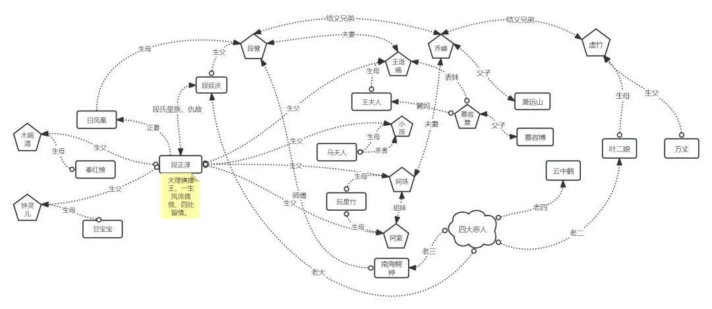
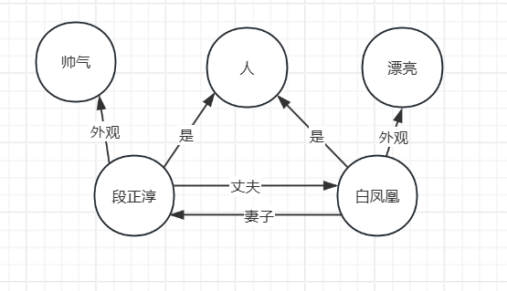
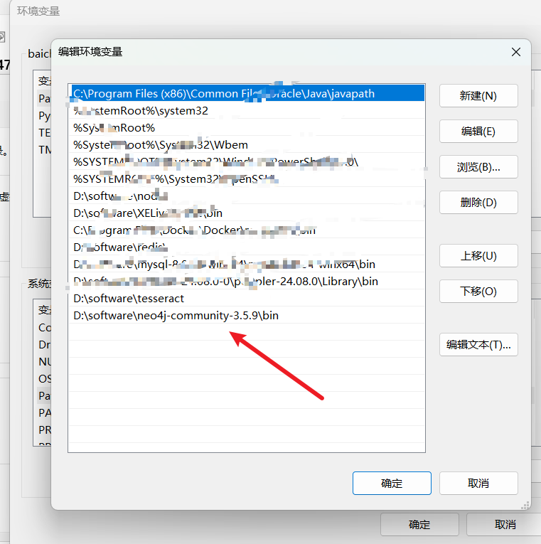
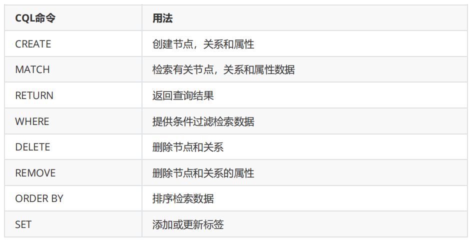

## GRAPH RAG

**学习目标:**

### 一. 知识图谱概述 

#### 1.**技术简介** 

- 发展历史:知识图谱的概念最早可以追溯到语义网和链接数据的概念。早期的语义网关注于如何使网络上的数据更加机器可读，而链接数据则强调了数据之间的关联。知识图谱的出现是对这些理念的进一步发展和实践应用，它通过更加高效的数据结构和技术，使得知识的表示、存储和检索更加高效和智能。 

- 2012 年 5 月 17 日，Google 正式提出了知识图谱（Knowledge Graph）的概念，其初衷是为了优化搜索引擎返回的结果，改善用户的搜索质量以及搜索体验。当前的人工智能技术其实可以简单地划分为感知智能（主要是图像、视频、语音、文字等识别）和认知智能（涉及知识推理、因果分析等），知识图谱技术就是认知智能领域中的主要技术，是人工智能技术的组成部分，其强大的语义处理和互联组织能力，为智能化信息应用提供了基础。
  

- 知识图谱基本概念:https://blog.csdn.net/kevinjin2011/article/details/124686668

#### 2. **核心概念**

- 知识图谱（Knowledge Graphs）。知识图谱是现实世界实体及其关系的结构化表示，主要由两个基本元素组成：
- **节点（Nodes）：**表示单个实体，如人物、地点、物体或概念。
- **边（Edges）：**表示节点之间的关系，定义了实体间的连接方式。

#### 3. 图谱分类

##### 1. LPG

- 全称(Labeled Property Graph), 这是一种常见的图数据模型，用于表示知识图谱的结构。它允许节点和边带有标签和属性，从而更灵活地存储复杂的关系和实体信息, Neo4j 公司是 LPG 的主要倡导者和实现者，他们在 2010 年代通过开源工具（如 Neo4j 图数据库）将 LPG 应用于大规模知识图谱构建中 

- **数据模型** 
  - 节点: 表示实体或者概念,如段正淳,白凤凰
  - 边:表示实体之间的关系, 如妻子,丈夫
  - 标签: 实体的分类, 如人
  - 属性: 实体的特征, 如多金,漂亮

##### 2. RDF

- 全称(Resource Description Framework), 是由 万维网联盟（W3C） 提出的，用于表示和交换 Web 上的结构化数据和元数据 
- RDF 由 节点 和 边 组成，节点可以表示 实体 或 属性 ，而边则表示了 实体与实体之间的关系 以及 实体与属性之间的关系 。

- 数据模型:

  - **三元组** ： 基本数据单元，形式为 `(主语, 谓语, 宾语)` 
  - 节点: 表示实体,概念,或者属性
  - 边: 表示实体之间的关系

**场景:**

**LPG**：适合企业内部、性能敏感、复杂关系建模的场景，灵活且查询高效。

**RDF**：适合语义推理、标准化和跨系统共享的场景，强调语义一致性和互操作性。

### 二. 构建知识图谱流程

#### 1. **知识定义与本体构建**

- **核心目标**：设计图谱的“模式”或“骨架”，解决“描述什么”的问题。这是所有后续工作的蓝图，至关重要。 
- **主要工作**： 
  - **领域需求分析**：明确图谱要支撑的业务场景（如智能搜索、推荐、风控、问答等）。
  - **概念化**：识别核心**实体类型**（如`人物`、`公司`、`产品`）、**属性**（如`人物`的`姓名`、`出生日期`）和**关系**（如`就职于`、`出生于`）。
  - **形式化**：使用本体语言（如OWL、RDFS）或属性图模型，将概念和关系正式定义成本体（Ontology），规定层级、约束和推理规则。

#### 2.  **知识获取与抽取**

- **核心目标**：从多源数据中提取出具体的“血肉”信息，即实例数据。 
- **主要工作**： 
  - **多源数据获取**：连接和处理各类数据源，包括： 
    - **结构化数据**：数据库（MySQL等）、CSV。
    - **半结构化数据**：JSON、XML、网页表格。
    - **非结构化数据**：纯文本（新闻、报告、文档）。
  - **信息抽取 (IE)**：
    - **实体抽取**：使用NLP技术（如NER命名实体识别）从文本中识别出实体提及项（Entity Mention）。
    - **关系抽取**：判断并抽取出实体对之间的关系。
    - **属性抽取**：提取实体的属性值。
-  **输出**：原始的“(实体-关系-实体)”**三元组**和“(实体-属性-属性值)”**三元组**。 
- **实现**:  NLP识别  

#### 3. **知识融合与对齐**

- **核心目标**：解决数据冲突和歧义，将来自不同数据源的知识整合成统一、一致、干净的整体。 
- **主要工作**： 
  - **实体链接**：将文本中抽取的实体提及项（如“苹果”）链接到知识库中正确的实体对象（`苹果公司`，而不是水果`苹果`）。
  - **实体消歧**：区分同名不同实的实体（如“迈克尔·乔丹”是科学家还是篮球明星？）。
  - **共指消解**：认定不同提及项（如“乔布斯”、“史蒂夫·乔布斯”、“他”）指向同一实体。

#### 4. **知识存储与存储**

- **核心目标**：将处理好的三元组数据存储到合适的数据库中，以支持高效查询和推理。 
- **存储方案选择**： 
  - **原生图数据库**：如 **Neo4j** (属性图模型)、**Nebula Graph**。擅长处理复杂关系查询，直观易用。
  - **RDF图数据库**：如 **Apache Jena**、**Virtuoso**。遵循W3C标准，支持SPARQL查询和逻辑推理。

#### 5. **知识应用与推理** 

- **核心目标**：使用知识图谱创造价值，并利用推理发现隐藏知识。 
- **主要工作**： 
  - **图谱查询**：使用**SPARQL**（用于RDF）或**Cypher**（用于Neo4j）等查询语言进行复杂查询。 
  - **知识推理**：基于预定义的规则，推理出隐含的关系和事实，丰富图谱内容。 

### 三. 图数据库

#### 1. 什么是图数据库 

- 随着社交、电商、金融、零售、物联网等行业的快速发展，现实社会织起了了一张庞大而复杂的关系 

  网，传统数据库很难处理关系运算。大数据行业需要处理的数据之间的关系随数据量呈几何级数增长， 

  急需一种支持海量复杂数据关系运算的数据库，图数据库应运而生。

- 图数据库是基于图论实现的一种NoSQL数据库，其数据存储结构和数据查询方式都是以图论为基础的， 

  图数据库主要用于存储更多的连接数据

#### 2. 图数据库选择

| 数据库名称         | 数据模型                | 查询语言                 | 核心优势                                              | 适用场景                                       | 许可协议              |
| ------------------ | ----------------------- | ------------------------ | ----------------------------------------------------- | ---------------------------------------------- | --------------------- |
| **Neo4j**          | 属性图                  | **Cypher**               | 生态最成熟、易用性最佳、ACID事务、原生图处理          | 推荐系统、欺诈检测、知识图谱、主数据管理       | 开源社区版 / 商业付费 |
| **Nebula Graph**   | 属性图                  | **nGQL**                 | **原生分布式**、**水平扩展**、高性能、中文社区活跃    | **超大规模图**、社交网络、金融风控、互联网应用 | 开源                  |
| **JanusGraph**     | 属性图                  | **Gremlin**              | 高度灵活、与大数据生态（HBase/Cassandra/ES）集成性好  | 需要与现有大数据平台集成的复杂企业应用         | 开源                  |
| **TigerGraph**     | 属性图                  | **GSQL**                 | 高性能、**深度链接分析**、内置并行图计算引擎          | 实时反欺诈、复杂多跳查询、实时推荐             | 商业付费              |
| **Amazon Neptune** | **双引擎** (属性图/RDF) | **Gremlin** / **SPARQL** | **全托管服务**、高可用、与AWS生态无缝集成、双模型支持 | 希望快速上手、避免运维的AWS用户                | 商业付费 (按用量计费) |
| **Apache Jena**    | RDF                     | **SPARQL**               | 语义Web标准支持、支持**推理**、Java生态成熟           | 学术研究、语义网项目、需要逻辑推理的场景       | 开源                  |

 

#### 3. Neo4j使用 

##### 1. 下载

- 国内源地址：https://we-yun.com/doc/neo4j/
- 官网: https://neo4j.com/
- 操作文档地址: https://neo4j.com/docs/operations-manual/3.5/

**注意**: java8的版本 只能使用3版本neo4j,  java11 才能安装4版本以上

**课上配置:** java11, neo4j 4.4.9

##### 2. 安装

- 下载文件解压缩到自己的文件目录
- 配置自己的bin目录到环境变量  

- 终端命令

  - install-service | uninstall-service | update-service ： 安装/卸载/更新 neo4j 服务 a
  - start/stop/restart/status: 启动/停止/重启/状态 
  - console: 直接启动 neo4j 服务器 

- 在浏览器中访问http://localhost:7474 

  - 使用用户名neo4j和默认密码neo4j进行连接，然后会提示更改密码 

  - Neo4j Browser是开发人员用来探索Neo4j数据库、执行Cypher查询并以表格或图形形式查看结果的工 

    具。

  - **注意:** 浏览器不能设置中文编码不然会报错

  

#### 4. Neo4j - CQL使用 

##### 1. Neo4j - CQL简介 

- Neo4j的Cypher语言是为处理图形数据而构建的，CQL代表Cypher查询语言。像`mysql`数据库具有查询语言SQL，Neo4j具有CQL作为查询语言。 

- 它是Neo4j图形数据库的查询语言。 
- 它是一种声明性模式匹配语言 
- 它遵循SQL语法。 
- 它的语法是非常简单且人性化、可读的格式

链接报错

Could not use APOC procedures. Please ensure the APOC plugin is installed in Neo4j and that 'apoc.meta.data()' is allowed in Neo4j configuration 

https://github.com/neo4j-contrib/neo4j-apoc-procedures/releases  找到对应版本的apoc

### 四. GRAPH RAG

#### 1. 简介

- 论文: https://arxiv.org/pdf/2404.16130
- 文档地址: https://microsoft.github.io/graphrag/
- 项目地址: https://github.com/microsoft/graphrag?tab=readme-ov-file

neoapi  https://github.com/songquanpeng/one-api?tab=readme-ov-file#%E4%BD%BF%E7%94%A8%E6%96%B9%E6%B3%95

graphrag init --root ./ragtest

 graphrag prompt-tune --config ./settings.yaml --root ./ --no-discover-entity-types --language Chinese --output ./prompts

graphrag index --root ./