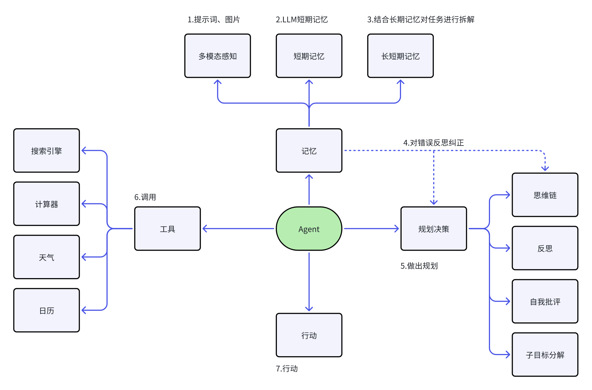
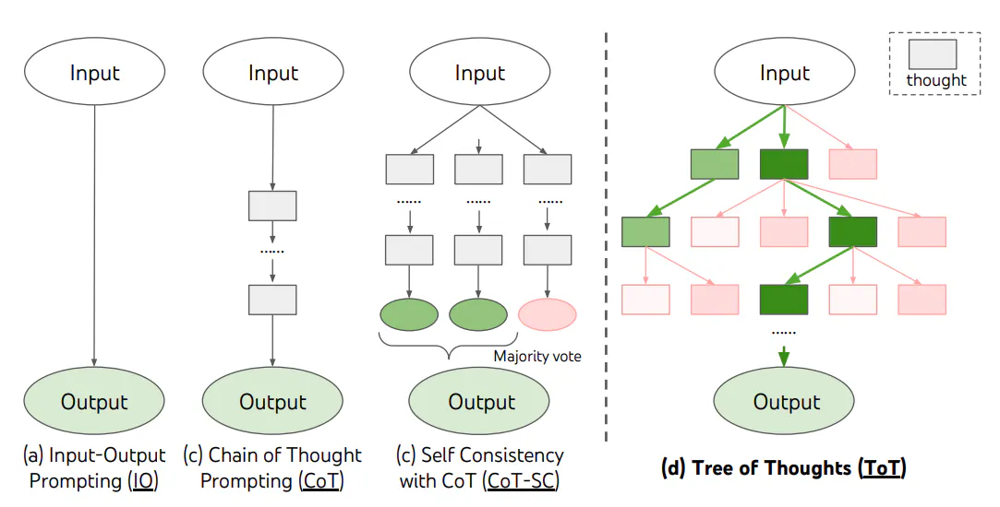
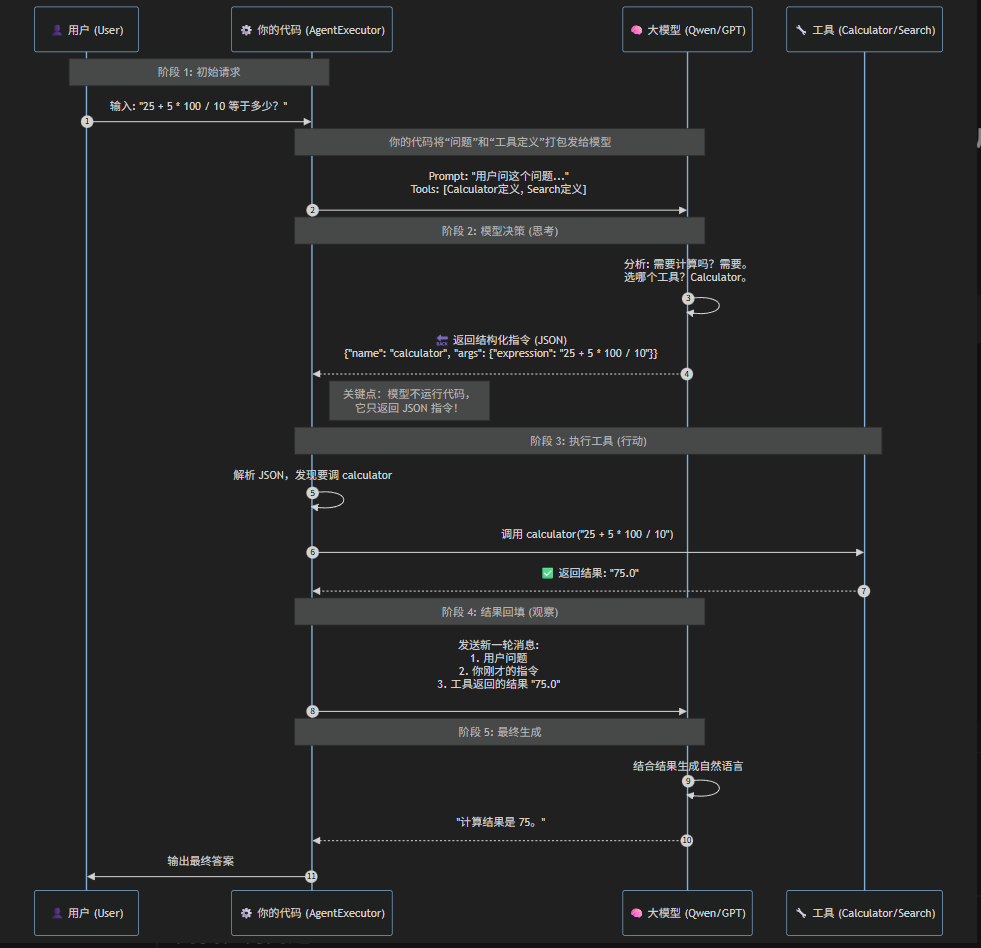
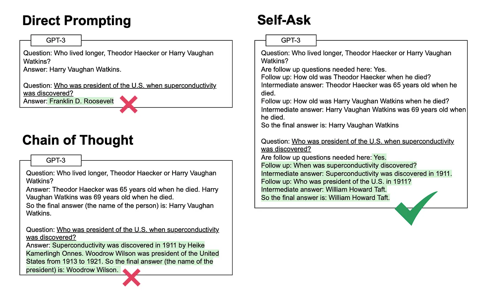
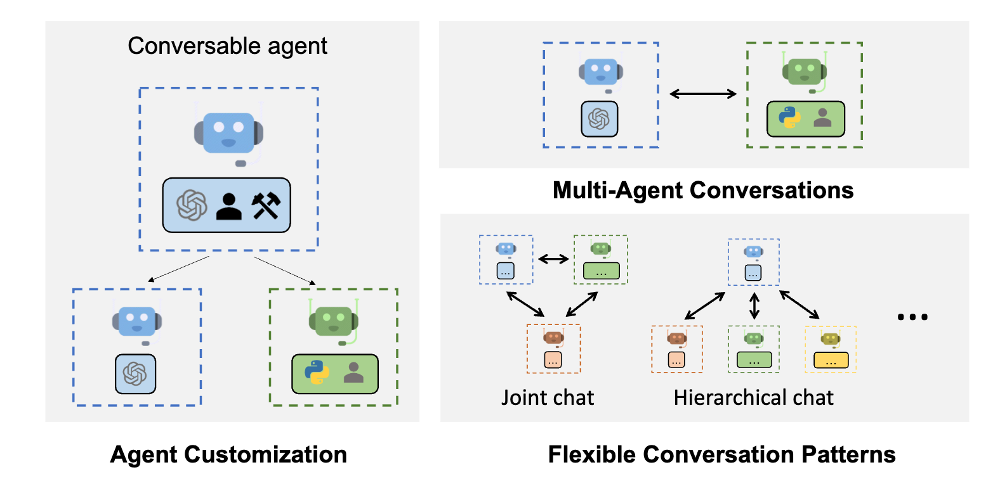
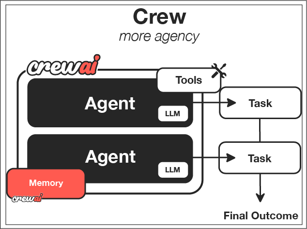

# Agent是什么?
大语言模型（比如ChatGPT）虽然能理解输入、分析推理、输出文字或代码，但它更像一个“聪明的对话者”——没有真正的记忆，不会主动规划，也无法动手操作现实世界的东西（比如订机票、查天气）。

而AI Agent（智能代理）就像给语言模型装上了“大脑+手脚”：

1. 会规划：拆解复杂任务（比如“策划一次旅行” → 自动分成查天气、订酒店、排行程等步骤）
2. 能动手：调用工具（搜索/计算/订票API/控制智能家居）
3. 有记忆：长期记住你的习惯（比如你讨厌红眼航班）
4. 更主动：遇到问题会自己调整方案（比如发现酒店超预算，自动找平替）

举个栗子🌰：

你对Agent说："周末想带娃去上海玩，预算5000元"

它会自动：查天气 → 推荐亲子景点 → 比价订酒店 → 生成带地图的攻略 → 发现超预算时主动调整方案

本质上就是把大模型升级成能自主干活的智能体。

Agents流程图

<!-- 这是一张图片，ocr 内容为：1.提示词,图片 3.结合长期记忆对任务进行拆解 2.LLM短期记忆 短期记忆 多模态感知 长短期记忆 4.对错误反思纠正 搜索引擎 记忆 思维链 6.调用 计算器 工具 规划决策 AGENT 反思 天气 5.做出规划 自我批评 日历 行动 子目标分解 7.行动 -->


1. 规划能力

智能体能够将复杂任务拆解为可执行的子任务，并动态规划执行路径。通过实时评估任务进展，自主决策继续执行或终止任务。

1. 记忆系统

采用双重记忆架构：短期记忆维护任务执行上下文，随子任务动态更新并在任务完成后清除；长期记忆通过向量数据库实现知识持久化存储与检索。

1. 工具调用

配备多模态工具API（包括计算引擎、搜索引擎、代码解释器、数据库接口等），使智能体具备物理世界交互能力，解决现实场景问题。

1. 执行机制

基于规划决策和记忆系统驱动具体行动，通过工具调用或环境交互实现任务目标。

## 举例：
#### 场景描述
用户通过智能购物助手寻找并购买适合的礼物，系统需要理解需求、推荐商品、比价并完成购买。

1. 感知（Perception）
+ 用户输入： "我想给10岁的小男孩买生日礼物，预算500元左右，他喜欢科幻和机器人。"
+ 需求解析：
    - NLP识别关键信息：年龄（10岁）、性别（男）、兴趣（科幻/机器人）、预算（500元）。
    - 情感分析判断用户希望挑选有惊喜感的礼物。
1. 规划（Planning）

系统制定决策流程：

1. 商品检索：
    1. 在电商平台筛选"儿童科技玩具"类目，优先显示机器人/科幻相关商品。
2. 推荐策略：
    1. 结合用户预算，排除超价商品，按销量/评分排序。
3. 比价方案：
    1. 对比不同平台的同款商品价格和物流时效。
4. 交互设计：
    1. 准备图文并茂的推荐列表，并附赠贺卡选项。
5. 行动（Action）
+ 执行检索： 找到3款符合条件的商品：
    - 可编程机器人（¥488）
    - 太空主题拼装模型（¥429）
    - 智能对话外星人玩偶（¥369）
+ 生成推荐： 发送结构化信息： "根据需求为您推荐以下商品（均包邮）： ①【XX机器人】编程启蒙玩具，赠6节课程（¥488） ②【宇宙空间站】3D立体拼图，培养动手能力（¥429） ③【AI外星人】智能语音互动，支持自定义表情（¥369） 您想了解哪款的详情？或需要其他建议？"
1. 观察（Observation）
+ 用户反馈： "机器人那个课程具体教什么？有没有优惠券？"
+ 需求迭代：
    - 识别新需求：商品细节查询+价格优化
    - 调整规划：
        * 调取商品详情页的教育内容
        * 自动申请平台新人券（满400减50）
        * 计算折后价：¥488→¥438
1. 循环优化
+ 二次推荐： "该机器人包含Scratch编程入门课程，涵盖：
    - 基础逻辑指令（第1-2课）
    - 传感器应用（第3-4课）
    - 创意项目实战（第5-6课） 检测到可用新人券，折后¥438（原价¥488），要直接下单吗？"
+ 终止条件： 用户确认购买后，自动填写默认地址并询问： "需要添加生日贺卡（免费）？可定制20字以内祝福语。"

## 规划（Planing）
当人类面对任务时，会自然进入以下思维流程：

1. 任务解析：首先思考任务的本质和完成路径。
2. 工具评估：审视现有资源，规划工具的高效使用方法。
3. 任务拆解：将复杂任务结构化分解为可执行的子任务（类似思维导图的分层逻辑）。
4. 过程反思：执行中持续优化策略，通过经验迭代改进后续步骤。
5. 终止判断：动态评估任务完成度，决策何时结束执行。

为了让智能体具备类人的任务处理思维，我们通过LLM提示工程构建以下核心能力：

### **分解任务**
+ 使LLM能够将复杂任务拆解为可独立执行的子任务模块
+ 通过分层递归分解实现任务粒度控制（如：旅行规划→交通预订+酒店选择+行程安排）

#### **思维链（Chain of Thoughts, CoT）**
+ 基础推理框架：要求LLM「逐步思考（think step by step）」
+ 实现线性推理过程（如：数学解题时显式展示演算步骤）
+ 典型应用：需顺序执行的确定性任务

#### **思维树（Tree-of-thought, ToT）**
+ 进阶推理框架：在CoT每个节点扩展多分支可能性
+ 关键技术：
    - 启发式评估：对分支进行可行性打分
    - 搜索算法：采用BFS/DFS进行空间探索
    - 回溯机制：动态修剪低效路径
+ 典型应用：创意生成/多方案决策场景

<!-- 这是一张图片，ocr 内容为： -->


### 反思与改进
Agent 也在不断“回头看”。它明白，行动中犯错是常态，但关键在于如何处理这些错误。当遇到足够“刺头”的问题，或者连续碰壁时，它会停下来，像我们整理房间一样，把之前的思路和做法好好清理一遍。看看哪里没考虑周全，哪里用力过猛，哪里本可以换个方法。这就像我们常说的“亡羊补牢”，虽然损失已经造成，但找到漏洞并修补，下次就安全多了。Agent 通过这种周期性的“复盘”和“补牢”，不断优化自己的“工具箱”，让未来的行动更少波折，结果更接近理想。

#### ReAct框架
ReAct 就像一个戴着思考帽子的机器人。

当它接到一个任务时，它不会立刻动手。首先，它会思考（Reasoning/Thought）：它低着头，小声对自己说，“嗯，这个问题有点复杂，我需要先了解…”，它会列出一些可能的步骤，或者问自己一些问题。

想清楚之后，它就采取行动（Acting/Action）：比如，它可能会去图书馆（搜索信息），或者拿起工具（执行操作）。

做完之后，它会观察（Observation）结果：“哦，原来是这样，我找到了答案。” 或者 “啊，这个方法不行。”

然后，它会根据观察到的结果，再次思考，调整计划，再次行动…

就这样，ReAct 让 AI 像人一样，边想边做，不断调整，一步步解决问题，而不是一下子就给出一个可能不对的答案。它把思考的过程都展示出来，让人也看得明白它在怎么想。

1. 初始化： 模型接收初始任务或问题。
2. 思考： 模型生成一个思考步骤，规划如何开始解决任务。
3. 行动： 模型根据思考结果执行一个行动（如查询信息、计算等）。
4. 观察： 模型接收行动的结果。
5. 迭代： 模型将观察到的结果纳入新的思考中，再次进行思考、行动、观察，直到任务完成或达到某个终止条件。

任务： “告诉我2023年世界杯足球赛的冠军是哪个国家？”

模型（ReAct 框架下）：

1. Thought: 我需要查找关于2023年世界杯足球赛冠军的信息。我应该使用搜索引擎来获取这个事实。
2. Action: 搜索[‘2023年世界杯足球赛 冠军’]
3. Observation: 搜索结果显示，2022年卡塔尔世界杯（通常被报道为2023年赛事）的冠军是阿根廷队。
4. Thought: 搜索结果明确了，2022年卡塔尔世界杯的冠军是阿根廷。虽然年份标注有时会有混淆，但这是公认的事实。我可以直接回答用户。
5. Action: 告诉用户“2022年卡塔尔世界杯足球赛的冠军是阿根廷队。”

（注：这里简化了“观察”和“行动”的格式，实际实现中可能有更结构化的表示，如 `Thought: ... \n Action: Search[关键词] \n Observation: 搜索结果... \n Thought: ... \n Action: Finish[最终答案]`）

## 记忆（Memory）
**日常中的记忆机制：**

1. 感觉记忆：感官信息的短暂残留，仅持续几秒。
2. 短期记忆：临时存储和处理少量信息，如记电话号码。
3. 长期记忆：持久存储大量信息，分两类：
    1. 显性记忆：可主动回忆的，如个人经历（情景记忆）和知识概念（语义记忆）。
    2. 隐性记忆：无意识的技能和习惯，如骑自行车。

**智能体中的记忆机制：**

1. 形成记忆：通过预训练学习世界知识，内化为长期记忆基础。
2. 短期记忆：任务执行中暂存信息，任务结束后清空。
3. 长期记忆：依赖外部知识库（如向量数据库）存储和检索大量信息。

## 工具使用（Tools/Toolkits）
Agent 能像人类一样，通过学习使用外部工具来突破自身限制。对于模型权重固定、难以更新的LLM来说，调用外部API获取实时信息、执行代码或访问专属数据源，就如同我们借助工具延伸了手脚和大脑。这种能力让LLM不再局限于训练时的知识，显著拓宽了其解决问题的边界。

简单使用工具

```plain
from langchain_openai import ChatOpenAI
from langchain.agents import create_react_agent, AgentExecutor
from langchain_tavily import TavilySearch # 推荐使用标准的社区版导入
from langchain_core.prompts import PromptTemplate
from dotenv import load_dotenv
import os

# 加载环境变量
load_dotenv()

# 1. 配置 LLM (通义千问)
model = "qwen-plus-2025-07-14"
api_key = os.getenv("DASHSCOPE_API_KEY")
api_base_url = os.getenv("DASHSCOPE_BASE_URL")

llm = ChatOpenAI(
    model=model,
    api_key=api_key,
    base_url=api_base_url,
    temperature=0.1 # ReAct 模式建议调低温度，保证格式稳定
)

# 2. 配置工具
# TavilySearchResults 是 LangChain 社区标准的搜索工具封装
tools = [TavilySearch(max_results=1)]

# 3. 自定义 ReAct 提示词模板 (关键步骤)
# 注意：必须包含 {tools}, {tool_names}, {input}, {agent_scratchpad} 这四个占位符
template = """
你是一个全能的智能助手。尽你所能回答用户的问题。
你可以使用以下工具：

{tools}

请使用以下格式进行思考和回答（严格遵守该格式）：

Question: 你必须回答的输入问题
Thought: 你应该时刻思考接下来该做什么
Action: 需要使用的工具名称，必须是 [{tool_names}] 之一
Action Input: 传递给工具的具体输入内容
Observation: 工具返回的结果
... (这个 Thought/Action/Action Input/Observation 的过程可以重复N次)
Thought: 我现在知道最终答案了
Final Answer: 对原始问题的最终回答

开始！

Question: {input}
Thought:{agent_scratchpad}
"""

# 创建 Prompt 实例
prompt = PromptTemplate.from_template(template)

# 4. 创建 Agent
# ============================================================
# create_react_agent: 构建“大脑” (The Brain / The Planner)
# ============================================================
# 作用：
#   - 它将 LLM（大模型）、Tools（工具定义）和 Prompt（提示词）组装在一起。
#   - 它定义了“思考逻辑”：即如何解析用户的输入，如何生成 Thought，以及如何决定调用哪个 Action。
#   - 【关键点】：它只负责“想”，不负责“做”。它输出的是一个“行动指令”（比如：我要调用搜索工具查天气），
#     但它自己不会去运行那个搜索函数。
# 关系：
#   它是 AgentExecutor 的核心内核。
agent = create_react_agent(
    llm=llm,
    tools=tools,
    prompt=prompt
)

# 5. 创建执行器
# ============================================================
# AgentExecutor: 构建“执行循环” (The Runtime / The Loop)
# ============================================================
# 作用：
#   - 它是 Agent 的运行环境。它维护了一个 "While True" 的循环。
#   - 【核心流程】：
#     1. 把用户输入给 Agent（大脑）。
#     2. 接收 Agent 发出的“行动指令”（Action）。
#     3. 【真正执行工具】：Executor 拿着指令去运行 Python 函数（比如调 API）。
#     4. 获取工具结果（Observation）。
#     5. 把结果拼接到 Prompt 的 {agent_scratchpad} 中，再喂回给 Agent。
#     6. 重复上述步骤，直到 Agent 输出 "Final Answer"。
#   - 【额外功能】：它还负责错误处理（handle_parsing_errors）、日志打印（verbose）、超时控制等。
# 关系：
#   它是 Agent 的宿主。没有它，Agent 只是一个会说话但没有手脚的静态对象。
agent_executor = AgentExecutor(
    agent=agent,
    tools=tools,
    verbose=True,
    handle_parsing_errors=True
)

# 6. 执行任务
query = "请问现任的美国总统是谁？他的年龄的平方是多少? 请用中文告诉我这两个问题的答案"
try:
    result = agent_executor.invoke({"input": query})
    print("\n====== 最终结果 ======")
    print(result["output"])
except Exception as e:
    print(f"发生错误: {e}")
```

### 使用已有的工具
参考：https://python.langchain.com/docs/integrations/tools/

## 给Agent添加记忆
```plain
pip install langchain-tavily
```

```plain
# 导入必要的库
from langchain.memory import ConversationBufferMemory
from langchain_openai import ChatOpenAI
from langchain.chat_models import init_chat_model
from langchain.agents import create_tool_calling_agent, AgentExecutor
from langchain_core.prompts import ChatPromptTemplate
from langchain_tavily import TavilySearch
from langchain_core.tools import tool
import numexpr
import math
from dotenv import load_dotenv
import os

# 加载环境变量
load_dotenv()

# 定义模型参数
model = "qwen-plus-2025-07-14"  
api_key = os.getenv("DASHSCOPE_API_KEY")
api_base_url = os.getenv("DASHSCOPE_BASE_URL")

# 初始化LLM
# temperature=0.1 对于 ReAct Agent 很重要，能保证格式输出稳定
llm = init_chat_model(
    model=model,
    api_key=api_key,
    base_url=api_base_url,
    model_provider="openai",
    temperature=0.1
)
# llm = ChatOpenAI(
#     model=model,
#     api_key=api_key,
#     base_url=api_base_url,
#     temperature=0.1
# )

# 构建搜索工具 (保持原样)
search = TavilySearch()


# 创建一个数学计算工具
@tool
def calculator(expression: str) -> str:
    """
    用于执行数学计算的工具。
    """
    try:
        print("输入参数：", expression)
        # 限制允许使用的函数，增加安全性
        local_dict = {"pi": math.pi, "e": math.e, "sqrt": math.sqrt}
        result = numexpr.evaluate(expression.strip(), global_dict={}, local_dict=local_dict)
        return str(result)
    except Exception as e:
        return f"计算错误: {str(e)}"


# 定义工具列表
tools = [
    search,
    calculator
]

# 记忆组件
# memory_key="chat_history" 必须与 Prompt 中的变量名一致
memory = ConversationBufferMemory(
    memory_key="chat_history",
    return_messages=True
)

# 优化后的 Prompt
# 不再需要教模型 "Question/Thought/Action" 的格式
# 只需要定义角色和占位符，模型自己知道什么时候调工具
custom_prompt = ChatPromptTemplate.from_messages([
    ("system", "你是一个有用的AI助手。你可以使用工具来回答问题。如果遇到计算问题，请务必使用计算器工具。"),
    ("placeholder", "{chat_history}"),  # 历史对话占位符
    ("human", "{input}"),  # 用户输入
    ("placeholder", "{agent_scratchpad}"),  # 【关键】这里存放工具调用的中间结果
])

# 创建Agent
# create_react_agent 依赖于模型输出文本，然后用正则去“猜”哪里是工具名。
# create_tool_calling_agent 利用了 LLM 的底层 API (.bind_tools)。模型不是在“生成文本”，而是在“发送指令”。
agent = create_tool_calling_agent(
    llm,
    tools,
    custom_prompt
)

# 创建Agent管理器
# 优化：添加 handle_parsing_errors=True，防止模型格式错误导致程序崩溃
agent_executor = AgentExecutor(
    agent=agent,
    tools=tools,
    memory=memory,
    verbose=True,
    handle_parsing_errors=True
)

# --- 测试流程 ---

print("=== 第一次对话（测试搜索工具） ===")
try:
    response1 = agent_executor.invoke({"input": "现任美国总统是谁？"})
    print(f"回答: {response1['output']}")
except Exception as e:
    print(f"出错: {e}")

print("\n=== 第二次对话（测试记忆能力） ===")
try:
    # 这次它应该不需要调用搜索工具，直接从 Memory 获取信息
    response2 = agent_executor.invoke({"input": "我们刚才聊到的那个人是谁？"})
    print(f"回答: {response2['output']}")
except Exception as e:
    print(f"出错: {e}")

print("\n=== 第三次对话（测试混合能力：计算+记忆） ===")
try:
    # 既需要调用计算器，又需要回顾历史
    response3 = agent_executor.invoke({"input": "请计算 25+5*100/10 是多少？然后告诉我，我们第一句话聊的是什么？"})
    print(f"回答: {response3['output']}")
except Exception as e:
    print(f"出错: {e}")
```

## Agent框架
根据框架和实现方式的差异，这里简单将Agent框架分为两大类：Single-Agent和Multi-Agent，分别对应单智能体和多智能体架构，Multi-Agent使用多个智能体来解决更复杂的问题

### 🧠 一、Single-Agent（单智能体）框架
#### 1. BabyAGI
+ GitHub: <font style="color:rgb(36,91,219);">https://github.com/yoheinakajima/babyagi</font>
+ 特点：
    - 基于任务列表驱动（Task List），自动规划下一步要做什么。
    - 使用LLM生成任务、执行任务、评估结果，并决定是否需要新增任务。
+ 优点：
    - 简洁明了，适合学习 Agent 自主决策的基本流程。
+ 缺点：
    - 功能有限，无法处理复杂任务或与外部工具交互。
+ 适合人群：初学者入门 Agent 架构设计。

#### 2. AutoGPT
+ GitHub: <font style="color:rgb(36,91,219);">https://github.com/Significant-Gravitas/AutoGPT</font>
+ 定位：个人AI助理，帮助完成用户指定的长期任务（如调研、写文章等）
+ 核心能力：
    - 支持多种外部工具（搜索引擎、浏览器、文件读写等）
    - 可以自主规划任务步骤并执行
+ 优点：
    - 插件丰富，社区活跃
    - 可视化输出清晰，可追踪每一步思考过程
+ 缺点：
    - 控制逻辑较弱（如不能设定最大迭代次数）
    - 容易陷入无限循环或低效任务中
+ 适合人群：希望快速搭建功能型Agent的人群。

### 👥 二、Multi-Agent（多智能体）框架
#### 1. Generative Agents
+ GitHub: <font style="color:rgb(36,91,219);">https://github.com/joonspk-research/generative_agents</font>
+ 论文：<font style="color:rgb(36,91,219);">Generative Agents: Interactive Simulacra of Human Behavior</font>
+ 核心思想：模拟人类行为的社会互动，构建一个由多个智能体组成的虚拟社会。
+ 关键特性：
    - 记忆机制（Memory）
    - 反思机制（Reflection）
    - 计划机制（Planning）
+ 优点：
    - 社会仿真能力强，适合研究人类行为建模
+ 缺点：
    - 计算资源消耗高，部署复杂
+ 适合人群：研究人员、社会模拟、游戏AI开发人员。

#### 2. MetaGPT
+ GitHub: <font style="color:rgb(36,91,219);">https://github.com/geekan/MetaGPT</font>
+ 中文文档支持好，社区活跃
+ 核心理念：用“软件公司”的组织结构来完成项目需求。每个角色是一个 Agent。
    - 产品经理、项目经理、架构师、工程师等角色各司其职。
+ 主要功能：
    - 输入一句话需求 → 输出 PRD、技术方案、代码等完整交付物
+ 优点：
    - 中文生态友好，易于本地化部署
    - 角色分工明确，工程化思维强
+ 缺点：
    - 对任务定义格式要求较高
+ 适合人群：软件工程团队、产品策划、企业级应用开发者

## 为什么Agent落地这么难?
#### 1. 任务定义模糊 / 复杂
+ 问题 用户需求不具体，如“帮我写一个网站”、“帮我做市场调研”，缺乏明确目标和边界。
+ 后果 Agent 难以拆解任务，易陷入无限循环或低效执行。
+ 示例 AutoGPT 可能反复搜索同一关键词，或生成大量无关内容。
+ 解决方案
    - 引导用户细化任务描述
    - 利用意图识别技术自动解析并拆解复杂任务

#### 2. 控制与约束能力弱
+ 问题 缺乏停止条件、错误处理机制和资源限制策略。
+ 后果 容易失控，执行无效步骤，浪费计算资源甚至产生费用。
+ 示例 AutoGPT 默认无最大迭代次数限制，可能导致长时间运行却无产出。
+ 解决方案
    - 设置最大调用次数、超时机制
    - 增加异常捕获与流程回滚机制

#### 3. 外部工具集成困难
+ 问题 工具接口规范不统一，数据格式多样，响应质量参差不齐。
+ 后果 调用失败率高，流程中断，结果不可靠。
+ 示例 Tavily 搜索返回噪音数据，LLM 解析后得出错误结论。
+ 解决方案
    - 统一工具接入标准（如 RESTful 接口封装）
    - 引入中间层对数据进行清洗与校验
    - 新技术MCP的引进

#### 4. 记忆与上下文管理复杂
+ 问题 Agent 需要记住历史状态、用户对话和操作记录。
+ 后果 上下文丢失、重复操作、逻辑混乱，影响任务连续性。
+ 示例 BabyAGI 使用简单列表存储记忆，检索效率低，容易遗忘关键信息。
+ 解决方案
    - 使用向量数据库或知识图谱增强记忆能力
    - 设计上下文压缩机制提升长文本处理能力

#### 5. 评估与反馈机制缺失
+ 问题 缺乏任务完成度评估机制，无法获取用户实时反馈。
+ 后果 Agent 难以自我优化，无法判断是否达成目标。
+ 示例 HuggingGPT 缺乏用户反馈闭环，模型选择过程难以验证。
+ 解决方案
    - 引入任务评分系统（如准确率、效率等指标）
    - 构建用户反馈通道，实现人机协同优化

#### 6. 安全与隐私风险高
+ 问题 可能访问敏感数据、执行危险命令、泄露用户隐私。
+ 后果 存在数据泄露、恶意行为、合规性问题等风险。
+ 示例 AutoGPT 支持文件读写功能，若被滥用可能破坏本地文件。
+ 解决方案
    - 限制权限范围（如沙箱机制）
    - 加密通信、脱敏处理敏感信息
    - 建立安全审计机制

#### 7. 用户体验差
+ 问题 输出冗长、重复，不符合用户预期。
+ 后果 用户难理解 Agent 的思考过程，信任度低。
+ 示例 MetaGPT 输出文档结构完整，但内容质量不稳定，需人工审核。
+ 解决方案
    - 精简输出内容，突出关键信息
    - 提供可视化交互界面，提升可解释性
    - 增强人机协作设计，让用户参与决策

总结一句话

**Agent 落地难，是因为它既需要强大的认知能力，也需要严密的工程控制、合理的任务设计和可靠的反馈机制。**

目前我们正处于“从概念到产品”的过渡期，未来随着 LLM + 工程架构 + 人机协同的不断演进，Agent 将逐渐从玩具变成真正有用的生产力工具。

# Funcation Calling
## Function Calling的起源
传统 LLM 的局限性

1. **封闭的“黑盒子”结构**：
    1. 传统的大模型（如 GPT-3）只能生成自然语言，不知道如何**调用工具、检索信息或执行操作**。
    2. 比如你问它“明天天气怎么样”，它可能只能胡乱猜测，因为无法连接实时天气服务。
2. **缺乏可控性和可扩展性**：
    1. 模型的推理过程不透明，无法指定它“先查再答”或“先调用数据库再总结”。
    2. 想让模型做一些有顺序的、需要外部操作的任务（如代码执行、数据库查询）很困难。
3. **上下文长度限制 & 知识过时问题**：
    1. 模型的知识是训练时固定的，无法更新。
    2. 没法自己“上网搜索”或“调用知识库 API”。

核心需求是：**让大模型像程序一样，调用外部函数**。

+ 让模型“知道”有哪些函数可用，并“学会”在适当的时机调用它们。

OpenAI Function Calling：[https://platform.openai.com/docs/guides/function-calling](https://platform.openai.com/docs/guides/function-calling)

## Function Calling的核心概念
**核心**：Function Calling 的核心是**赋予大语言模型自动调用外部函数或 API 的能力**。

**本质**：本质上，它让语言模型不仅仅基于内部知识生成答案，而是**通过外挂的函数定义（函数库）**，自动选择合适函数，根据用户请求生成结构化调用（如 JSON），调用外部函数执行后获取真实运行结果，**最终基于这些外部结果来生成更加精准、实时的回答**。

| **<font style="color:rgb(0, 0, 0);">核心概念</font>** | **<font style="color:rgb(0, 0, 0);">说明</font>** |
| --- | --- |
| <font style="color:rgb(0, 0, 0);">1.函数定义（Function Schema）</font> | <font style="color:rgb(0, 0, 0);">开发者提前向模型声明可以调用哪些函数，包括名称、参数、参数类型等（通常是 JSON Schema 格式）。</font> |
| <font style="color:rgb(0, 0, 0);">2.调用意图识别（Intent Detection）</font> | <font style="color:rgb(0, 0, 0);">模型通过理解用户请求，判断是否需要调用函数，以及需要调用哪个函数。</font> |
| <font style="color:rgb(0, 0, 0);">3.结构化调用输出（Structured Output）</font> | <font style="color:rgb(0, 0, 0);">模型不直接输出自然语言，而是输出结构化调用请求，如：{"name": "search_flight", "arguments": {"from": "北京", "to": "上海"}}</font> |
| <font style="color:rgb(0, 0, 0);">4.外部执行器（Executor）</font> | <font style="color:rgb(0, 0, 0);">LLM 本身不会执行函数。结构化请求由外部代码、服务或中间件执行函数并获取结果。</font> |
| <font style="color:rgb(0, 0, 0);">5.响应组合（Result Integration）</font> | <font style="color:rgb(0, 0, 0);">执行结果被返回给模型，模型基于执行结果再生成自然语言回答或进行下一步决策。</font> |


<!-- 这是一张图片，ocr 内容为： -->


1.定义函数

2.大模型识别用户问题，获取到对应的工具id、工具名称、工具参数。并决定使用哪个工具

3.手动调用第二步所需要的工具并将参数传入，得到工具的返回内容

4.将工具的返回内容重新组装提示词，重新问大模型，得到最终的回答

## Function calling和Agent中tools调用之间的区别
Function Calling 是一种模型调用单个函数的机制，而 Agent 的 Tools 调用是一种有目标、有策略的任务执行流程，可能涉及多个工具、多轮推理，Function Calling 是它的底层能力之一。

案例场景

## ✅ 1. Function Calling（像是打电话问个问题）
**模型直接调用一个函数：get_weather("北京")** 然后得到天气结果，比如：“多云，12°C”。 再根据这个结果说：“建议穿外套。”

就像你告诉模型：“有这些按钮可以按”，它只按一个，然后给出答案。

## ✅ 2. Agent 调用工具（像一个助理帮你处理整个流程）
模型先调用 `get_weather("北京")` → 得到“12°C”； 然后自动再调用 `recommend_clothes(12°C)` → 得到“穿毛衣”； 最后整合：“明天北京多云12°C，建议穿毛衣。”

它自己会判断先做什么、再做什么，直到完成整个任务。

总结：**Function Calling 是 Agent 能“真正动手做事”的能力。你有了 Agent，还必须给它 Function Calling，它才能把“任务规划”变成“实际操作”。**

### 案例演示1
**注意**：OpenAI官方推荐的数据交互格式是：JSON。当数据量多的时候尽量使用json格式

```plain
import pandas as pd
from openai import OpenAI
from dotenv import load_dotenv
import os
import json
import numpy as np

# 加载环境变量
load_dotenv()

# 配置
MODEL_NAME = "qwen3-max"  # 建议使用最新模型以获得更好的指令遵循能力
API_KEY = os.getenv("DASHSCOPE_API_KEY")
BASE_URL = os.getenv("DASHSCOPE_BASE_URL")

client = OpenAI(api_key=API_KEY, base_url=BASE_URL)

# ==========================================
# 1. 数据准备 (模拟数据库/全局上下文)
# ==========================================
df_employees = pd.DataFrame({
    'Name': ['Alice', 'Bob', 'Charlie', 'Diana', 'Eve', 'Frank', 'Grace', 'Hank'],
    'Age': [25, 30, 35, 28, 32, 45, 29, 40],
    'Salary': [50000.0, 75000.5, 95000.75, 62000.0, 88000.25, 120000.0, 55000.0, 105000.0],
    'Department': ['IT', 'HR', 'IT', 'Finance', 'IT', 'Finance', 'HR', 'IT'],
    'IsMarried': [True, False, True, False, True, True, False, True],
    'YearsExperience': [3, 5, 8, 4, 7, 15, 4, 12]
})


# 获取数据的 Schema 信息，用于告诉 LLM 数据长什么样
def get_data_schema():
    return f"""
    数据集包含以下列：
    - Name (str): 员工姓名
    - Age (int): 年龄
    - Salary (float): 年薪
    - Department (str): 部门 (包含: {', '.join(df_employees['Department'].unique())})
    - IsMarried (bool): 婚姻状况
    - YearsExperience (int): 工作年限
    数据总行数: {len(df_employees)}
    """


# ==========================================
# 2. 业务函数定义 (不再接收 input_json)
# ==========================================

def calculate_salary_statistics():
    """计算薪资的统计信息"""
    try:
        # 直接使用全局 df，或者从数据库查询
        stats = {
            "average": round(df_employees['Salary'].mean(), 2),
            "median": round(df_employees['Salary'].median(), 2),
            "max": round(df_employees['Salary'].max(), 2),
            "min": round(df_employees['Salary'].min(), 2)
        }
        return json.dumps(stats)
    except Exception as e:
        return json.dumps({"error": str(e)})


def analyze_by_department():
    """按部门统计分析"""
    try:
        dept_stats = df_employees.groupby('Department').agg({
            'Name': 'count',
            'Salary': 'mean',
            'Age': 'mean'
        }).round(2)

        result = dept_stats.rename(columns={'Name': 'count', 'Salary': 'avg_salary', 'Age': 'avg_age'}).to_dict(
            orient='index')
        return json.dumps(result, ensure_ascii=False)
    except Exception as e:
        return json.dumps({"error": str(e)})


def find_employees_by_criteria(min_salary=None, max_age=None, department=None):
    """根据条件筛选员工"""
    try:
        df = df_employees.copy()
        if min_salary:
            df = df[df['Salary'] >= min_salary]
        if max_age:
            df = df[df['Age'] <= max_age]
        if department:
            df = df[df['Department'] == department]

        result = df[['Name', 'Department', 'Salary', 'Age']].to_dict(orient='records')
        return json.dumps({"count": len(result), "data": result}, ensure_ascii=False)
    except Exception as e:
        return json.dumps({"error": str(e)})


def analyze_experience_salary_correlation():
    """分析经验与薪资相关性"""
    try:
        corr = df_employees['YearsExperience'].corr(df_employees['Salary'])
        return json.dumps({"correlation_coefficient": round(corr, 4)})
    except Exception as e:
        return json.dumps({"error": str(e)})


# 函数映射表
FUNCTION_MAP = {
    "calculate_salary_statistics": calculate_salary_statistics,
    "analyze_by_department": analyze_by_department,
    "find_employees_by_criteria": find_employees_by_criteria,
    "analyze_experience_salary_correlation": analyze_experience_salary_correlation,
}

# ==========================================
# 3. Tools 定义 (精简版，去掉了 input_json)
# ==========================================
tools = [
    {
        "type": "function",
        "function": {
            "name": "calculate_salary_statistics",
            "description": "计算全公司员工薪资的统计指标（平均值、中位数、最大最小）",
            "parameters": {"type": "object", "properties": {}, "required": []}  # 无参数
        }
    },
    {
        "type": "function",
        "function": {
            "name": "analyze_by_department",
            "description": "按部门进行分组统计（人数、平均薪资、平均年龄）",
            "parameters": {"type": "object", "properties": {}, "required": []}  # 无参数
        }
    },
    {
        "type": "function",
        "function": {
            "name": "find_employees_by_criteria",
            "description": "筛选员工。如果不指定条件，则不要传参。",
            "parameters": {
                "type": "object",
                "properties": {
                    "min_salary": {"type": "number", "description": "最低薪资"},
                    "max_age": {"type": "integer", "description": "最大年龄"},
                    "department": {"type": "string", "description": "部门名称"}
                }
            }
        }
    },
    {
        "type": "function",
        "function": {
            "name": "analyze_experience_salary_correlation",
            "description": "计算工作年限与薪资的相关系数",
            "parameters": {"type": "object", "properties": {}, "required": []}
        }
    }
]


# ==========================================
# 4. 核心执行逻辑 (支持并行调用)
# ==========================================
def run_query(query):
    print(f"\n{'=' * 60}\n用户提问: {query}\n{'=' * 60}")

    # System Prompt: 注入 Schema 而不是 Data
    messages = [
        {"role": "system",
         "content": f"你是高级数据分析师。当前持有员工数据如下：\n{get_data_schema()}\n请根据用户需求调用工具。"},
        {"role": "user", "content": query}
    ]

    # 1. 第一次调用 LLM
    response = client.chat.completions.create(
        model=MODEL_NAME,
        messages=messages,
        tools=tools,
        tool_choice="auto"
    )

    response_msg = response.choices[0].message
    tool_calls = response_msg.tool_calls

    # 2. 判断是否需要调用工具
    if tool_calls:
        print(f"模型决定调用 {len(tool_calls)} 个工具...")
        # 必须把模型的回复（包含 tool_calls）加入历史，否则第二次请求会报错
        messages.append(response_msg)

        # 3. 循环执行所有工具调用 (并行 Function Calling)
        for tool_call in tool_calls:
            # 获取调用的函数名称
            fn_name = tool_call.function.name
            # 获取调用的函数参数
            fn_args = json.loads(tool_call.function.arguments)

            print(f"  -> 执行工具: {fn_name} | 参数: {fn_args}")

            if fn_name in FUNCTION_MAP:
                # 执行函数
                fn_result = FUNCTION_MAP[fn_name](**fn_args)

                # 将结果作为 tool message 加入历史
                messages.append({
                    "role": "tool",
                    "tool_call_id": tool_call.id,  # 必须匹配 ID
                    "name": fn_name,
                    "content": fn_result
                })
                print(f"  <- 结果: {fn_result}")
            else:
                print(f"Error: 函数 {fn_name} 未定义")

        # 4. 第二次调用 LLM，获取最终自然语言回答
        final_response = client.chat.completions.create(
            model=MODEL_NAME,
            messages=messages
        )
        print(f"\n 最终回答:\n{final_response.choices[0].message.content}")

    else:
        print(f"直接回答: {response_msg.content}")


# ==========================================
# 5. 运行测试
# ==========================================
if __name__ == "__main__":
    # 复杂查询：测试并行调用或多条件
    queries = [
        "IT部门有多少人？他们的平均工资是多少？",  # 简单查询
        "帮我找一下工资高于8万的IT部门员工，顺便算一下全公司的薪资相关性。",  # 复合查询，可能触发并行调用
    ]

    for q in queries:
        run_query(q)
```

### 演示案例2
通过function call接入爬虫代码去爬取对应的车票信息

爬虫代码和对应的city.json文件：

```json

{
  "北京北": "VAP",
  "北京东": "BOP",
  "北京": "BJP",
  "北京南": "VNP",
  "北京西": "BXP",
  "广州南": "IZQ",
  "重庆北": "CUW",
  "重庆": "CQW",
  "重庆南": "CRW",
  "广州东": "GGQ",
  "上海": "SHH",
  "上海南": "SNH",
  "上海虹桥": "AOH",
  "上海西": "SXH",
  "天津北": "TBP",
  "天津": "TJP",
  "天津南": "TIP",
  "天津西": "TXP",
  "长春": "CCT",
  "长春南": "CET",
  "长春西": "CRT",
  "成都东": "ICW",
  "成都南": "CNW",
  "成都": "CDW",
  "长沙": "CSQ",
  "长沙南": "CWQ",
  "福州": "FZS",
  "福州南": "FYS",
  "贵阳": "GIW",
  "广州": "GZQ",
  "广州西": "GXQ",
  "哈尔滨": "HBB",
  "哈尔滨东": "VBB",
  "哈尔滨西": "VAB",
  "合肥": "HFH",
  "呼和浩特东": "NDC",
  "呼和浩特": "HHC",
  "海口东": "HMQ",
  "海口": "VUQ",
  "杭州东": "HGH",
  "杭州": "HZH",
  "杭州南": "XHH",
  "济南": "JNK",
  "济南东": "JAK",
  "济南西": "JGK",
  "昆明": "KMM",
  "昆明西": "KXM",
  "拉萨": "LSO",
  "兰州东": "LVJ",
  "兰州": "LZJ",
  "兰州西": "LAJ",
  "南昌": "NCG",
  "南京": "NJH",
  "南京南": "NKH",
  "南宁": "NNZ",
  "石家庄北": "VVP",
  "石家庄": "SJP",
  "沈阳": "SYT",
  "沈阳北": "SBT",
  "沈阳东": "SDT",
  "太原北": "TBV",
  "太原东": "TDV",
  "太原": "TYV",
  "武汉": "WHN",
  "王家营西": "KNM",
  "乌鲁木齐南": "WMR",
  "西安北": "EAY",
  "西安": "XAY",
  "西安南": "CAY",
  "西宁西": "XXO",
  "银川": "YIJ",
  "郑州": "ZZF",
  "阿尔山": "ART",
  "安康": "AKY",
  "阿克苏": "ASR",
  "阿里河": "AHX",
  "阿拉山口": "AKR",
  "安平": "APT",
  "安庆": "AQH",
  "安顺": "ASW",
  "鞍山": "AST",
  "安阳": "AYF",
  "北安": "BAB",
  "蚌埠": "BBH",
  "白城": "BCT",
  "北海": "BHZ",
  "白河": "BEL",
  "白涧": "BAP",
  "宝鸡": "BJY",
  "滨江": "BJB",
  "博克图": "BKX",
  "百色": "BIZ",
  "白山市": "HJL",
  "北台": "BTT",
  "包头东": "BDC",
  "包头": "BTC",
  "北屯市": "BXR",
  "本溪": "BXT",
  "白云鄂博": "BEC",
  "白银西": "BXJ",
  "亳州": "BZH",
  "赤壁": "CBN",
  "常德": "VGQ",
  "承德": "CDP",
  "长甸": "CDT",
  "赤峰": "CFD",
  "茶陵": "CDG",
  "苍南": "CEH",
  "昌平": "CPP",
  "崇仁": "CRG",
  "昌图": "CTT",
  "长汀镇": "CDB",
  "曹县": "CXK",
  "楚雄": "COM",
  "陈相屯": "CXT",
  "长治北": "CBF",
  "长征": "CZJ",
  "池州": "IYH",
  "常州": "CZH",
  "郴州": "CZQ",
  "长治": "CZF",
  "沧州": "COP",
  "崇左": "CZZ",
  "大安北": "RNT",
  "大成": "DCT",
  "丹东": "DUT",
  "东方红": "DFB",
  "东莞东": "DMQ",
  "大虎山": "DHD",
  "敦煌": "DHJ",
  "敦化": "DHL",
  "德惠": "DHT",
  "东京城": "DJB",
  "大涧": "DFP",
  "都江堰": "DDW",
  "大连北": "DFT",
  "大理": "DKM",
  "大连": "DLT",
  "定南": "DNG",
  "大庆": "DZX",
  "东胜": "DOC",
  "大石桥": "DQT",
  "大同": "DTV",
  "东营": "DPK",
  "大杨树": "DUX",
  "都匀": "RYW",
  "邓州": "DOF",
  "达州": "RXW",
  "德州": "DZP",
  "额济纳": "EJC",
  "二连": "RLC",
  "恩施": "ESN",
  "福鼎": "FES",
  "风陵渡": "FLV",
  "涪陵": "FLW",
  "富拉尔基": "FRX",
  "抚顺北": "FET",
  "佛山": "FSQ",
  "阜新": "FXD",
  "阜阳": "FYH",
  "格尔木": "GRO",
  "广汉": "GHW",
  "古交": "GJV",
  "桂林北": "GBZ",
  "古莲": "GRX",
  "桂林": "GLZ",
  "固始": "GXN",
  "广水": "GSN",
  "干塘": "GNJ",
  "广元": "GYW",
  "广州北": "GBQ",
  "赣州": "GZG",
  "公主岭": "GLT",
  "公主岭南": "GBT",
  "淮安": "AUH",
  "鹤北": "HMB",
  "淮北": "HRH",
  "淮滨": "HVN",
  "河边": "HBV",
  "潢川": "KCN",
  "韩城": "HCY",
  "邯郸": "HDP",
  "横道河子": "HDB",
  "鹤岗": "HGB",
  "皇姑屯": "HTT",
  "红果": "HEM",
  "黑河": "HJB",
  "怀化": "HHQ",
  "汉口": "HKN",
  "葫芦岛": "HLD",
  "海拉尔": "HRX",
  "霍林郭勒": "HWD",
  "海伦": "HLB",
  "侯马": "HMV",
  "哈密": "HMR",
  "淮南": "HAH",
  "桦南": "HNB",
  "海宁西": "EUH",
  "鹤庆": "HQM",
  "怀柔北": "HBP",
  "怀柔": "HRP",
  "黄石东": "OSN",
  "华山": "HSY",
  "黄石": "HSN",
  "黄山": "HKH",
  "衡水": "HSP",
  "衡阳": "HYQ",
  "菏泽": "HIK",
  "贺州": "HXZ",
  "汉中": "HOY",
  "惠州": "HCQ",
  "吉安": "VAG",
  "集安": "JAL",
  "江边村": "JBG",
  "晋城": "JCF",
  "金城江": "JJZ",
  "景德镇": "JCG",
  "嘉峰": "JFF",
  "加格达奇": "JGX",
  "井冈山": "JGG",
  "蛟河": "JHL",
  "金华南": "RNH",
"金华西": "JBH",
"九江": "JJG",
"吉林": "JLL",
"荆门": "JMN",
"佳木斯": "JMB",
"济宁": "JIK",
"集宁南": "JAC",
"酒泉": "JQJ",
"江山": "JUH",
"吉首": "JIQ",
"九台": "JTL",
"镜铁山": "JVJ",
"鸡西": "JXB",
"蓟县": "JKP",
"绩溪县": "JRH",
"嘉峪关": "JGJ",
"江油": "JFW",
"锦州": "JZD",
"金州": "JZT",
"库尔勒": "KLR",
"开封": "KFF",
"岢岚": "KLV",
"凯里": "KLW",
"喀什": "KSR",
"昆山南": "KNH",
"奎屯": "KTR",
"开原": "KYT",
"六安": "UAH",
"灵宝": "LBF",
"芦潮港": "UCH",
"隆昌": "LCW",
"陆川": "LKZ",
"利川": "LCN",
"临川": "LCG",
"潞城": "UTP",
"鹿道": "LDL",
"娄底": "LDQ",
"临汾": "LFV",
"良各庄": "LGP",
"临河": "LHC",
"漯河": "LON",
"绿化": "LWJ",
"隆化": "UHP",
"丽江": "LHM",
"临江": "LQL",
"龙井": "LJL",
"吕梁": "LHV",
"醴陵": "LLG",
"柳林南": "LKV",
"滦平": "UPP",
"六盘水": "UMW",
"灵丘": "LVV",
"旅顺": "LST",
"陇西": "LXJ",
"澧县": "LEQ",
"兰溪": "LWH",
"临西": "UEP",
"龙岩": "LYS",
"耒阳": "LYQ",
"洛阳": "LYF",
"洛阳东": "LDF",
"连云港东": "UKH",
"临沂": "LVK",
"洛阳龙门": "LLF",
"柳园": "DHR",
"凌源": "LYD",
"辽源": "LYL",
"立志": "LZX",
"柳州": "LZZ",
"辽中": "LZD",
"麻城": "MCN",
"免渡河": "MDX",
"牡丹江": "MDB",
"莫尔道嘎": "MRX",
"满归": "MHX",
"明光": "MGH",
"漠河": "MVX",
"茂名东": "MDQ",
"茂名": "MMZ",
"密山": "MSB",
"马三家": "MJT",
"麻尾": "VAW",
"绵阳": "MYW",
"梅州": "MOQ",
"满洲里": "MLX",
"宁波东": "NVH",
"宁波": "NGH",
"南岔": "NCB",
"南充": "NCW",
"南丹": "NDZ",
"南大庙": "NMP",
"南芬": "NFT",
"讷河": "NHX",
"嫩江": "NGX",
"内江": "NJW",
"南平": "NPS",
"南通": "NUH",
"南阳": "NFF",
"碾子山": "NZX",
"平顶山": "PEN",
"盘锦": "PVD",
"平凉": "PIJ",
"平凉南": "POJ",
"平泉": "PQP",
"坪石": "PSQ",
"萍乡": "PXG",
"凭祥": "PXZ",
"郫县西": "PCW",
"攀枝花": "PRW",
"蕲春": "QRN",
"青城山": "QSW",
"青岛": "QDK",
"清河城": "QYP",
"黔江": "QNW",
"曲靖": "QJM",
"前进镇": "QEB",
"齐齐哈尔": "QHX",
"七台河": "QTB",
"沁县": "QVV",
"泉州东": "QRS",
"泉州": "QYS",
"衢州": "QEH",
"融安": "RAZ",
"汝箕沟": "RQJ",
"瑞金": "RJG",
"日照": "RZK",
"双城堡": "SCB",
"绥芬河": "SFB",
"韶关东": "SGQ",
"山海关": "SHD",
"绥化": "SHB",
"三间房": "SFX",
"苏家屯": "SXT",
"舒兰": "SLL",
"三明": "SMS",
"神木": "OMY",
"三门峡": "SMF",
"商南": "ONY",
"遂宁": "NIW",
"四平": "SPT",
"商丘": "SQF",
"上饶": "SRG",
"韶山": "SSQ",
"宿松": "OAH",
"汕头": "OTQ",
"邵武": "SWS",
"涉县": "OEP",
"三亚": "SEQ",
"邵阳": "SYQ",
"十堰": "SNN",
"双鸭山": "SSB",
"松原": "VYT",
"深圳": "SZQ",
"苏州": "SZH",
"随州": "SZN",
"宿州": "OXH",
"朔州": "SUV",
"深圳西": "OSQ",
"塘豹": "TBQ",
"塔尔气": "TVX",
"潼关": "TGY",
"塘沽": "TGP",
"塔河": "TXX",
"通化": "THL",
"泰来": "TLX",
"吐鲁番": "TFR",
"通辽": "TLD",
"铁岭": "TLT",
"陶赖昭": "TPT",
"图们": "TML",
"铜仁": "RDQ",
"唐山北": "FUP",
"田师府": "TFT",
"泰山": "TAK",
"唐山": "TSP",
"天水": "TSJ",
"通远堡": "TYT",
"太阳升": "TQT",
"泰州": "UTH",
"桐梓": "TZW",
"通州西": "TAP",
"五常": "WCB",
"武昌": "WCN",
"瓦房店": "WDT",
"威海": "WKK",
"芜湖": "WHH",
"乌海西": "WXC",
"吴家屯": "WJT",
"武隆": "WLW",
"乌兰浩特": "WWT",
"渭南": "WNY",
"威舍": "WSM",
"歪头山": "WIT",
"武威": "WUJ",
"武威南": "WWJ",
"无锡": "WXH",
"乌西": "WXR",
"乌伊岭": "WPB",
"武夷山": "WAS",
"万源": "WYY",
"万州": "WYW",
"梧州": "WZZ",
"温州": "RZH",
"温州南": "VRH",
"西昌": "ECW",
"许昌": "XCF",
"西昌南": "ENW",
"香坊": "XFB",
"轩岗": "XGV",
"兴国": "EUG",
"宣汉": "XHY",
"新会": "EFQ",
"新晃": "XLQ",
"锡林浩特": "XTC",
"兴隆县": "EXP",
"厦门北": "XKS",
"厦门": "XMS",
"厦门高崎": "XBS",
"秀山": "ETW",
"小市": "XST",
"向塘": "XTG",
"宣威": "XWM",
"新乡": "XXF",
"信阳": "XUN",
"咸阳": "XYY",
"襄阳": "XFN",
"熊岳城": "XYT",
"兴义": "XRZ",
"新沂": "VIH",
"新余": "XUG",
"徐州": "XCH",
"延安": "YWY",
"宜宾": "YBW",
"亚布力南": "YWB",
"叶柏寿": "YBD",
"宜昌东": "HAN",
"永川": "YCW",
"宜昌": "YCN",
"盐城": "AFH",
"运城": "YNV",
"伊春": "YCB",
"榆次": "YCV",
"杨村": "YBP",
"宜春西": "YCG",
"伊尔施": "YET",
"燕岗": "YGW",
"永济": "YIV",
"延吉": "YJL",
"营口": "YKT",
"牙克石": "YKX",
"阎良": "YNY",
"玉林": "YLZ",
"榆林": "ALY",
"一面坡": "YPB",
"伊宁": "YMR",
"阳平关": "YAY",
"玉屏": "YZW",
"原平": "YPV",
"延庆": "YNP",
"阳泉曲": "YYV",
"玉泉": "YQB",
"阳泉": "AQP",
"玉山": "YNG",
"营山": "NUW",
"燕山": "AOP",
"榆树": "YRT",
"鹰潭": "YTG",
"烟台": "YAK",
"伊图里河": "YEX",
"玉田县": "ATP",
"义乌": "YWH",
"阳新": "YON",
"义县": "YXD",
"益阳": "AEQ",
"岳阳": "YYQ",
"永州": "AOQ",
"扬州": "YLH",
"淄博": "ZBK",
"镇城底": "ZDV",
"自贡": "ZGW",
"珠海": "ZHQ",
"珠海北": "ZIQ",
"湛江": "ZJZ",
"镇江": "ZJH",
"张家界": "DIQ",
"张家口": "ZKP",
"张家口南": "ZMP",
"周口": "ZKN",
"哲里木": "ZLC",
"扎兰屯": "ZTX",
"驻马店": "ZDN",
"肇庆": "ZVQ",
"周水子": "ZIT",
"昭通": "ZDW",
"中卫": "ZWJ",
"资阳": "ZYW",
"遵义": "ZIW",
"枣庄": "ZEK",
"资中": "ZZW",
"株洲": "ZZQ",
"枣庄西": "ZFK",
"昂昂溪": "AAX",
"阿城": "ACB",
"安达": "ADX",
"安德": "ARW",
"安定": "ADP",
"安广": "AGT",
"艾河": "AHP",
"安化": "PKQ",
"艾家村": "AJJ",
"鳌江": "ARH",
"安家": "AJB",
"阿金": "AJD",
"阿克陶": "AER",
"安口窑": "AYY",
"敖力布告": "ALD",
"安龙": "AUZ",
"阿龙山": "ASX",
"安陆": "ALN",
"阿木尔": "JTX",
"阿南庄": "AZM",
"安庆西": "APH",
"鞍山西": "AXT",
"安塘": "ATV",
"安亭北": "ASH",
"阿图什": "ATR",
"安图": "ATL",
"安溪": "AXS",
"博鳌": "BWQ",
"北碚": "BPW",
"白壁关": "BGV",
"蚌埠南": "BMH",
"巴楚": "BCR",
"板城": "BUP",
"北戴河": "BEP",
"保定": "BDP",
"宝坻": "BPP",
"八达岭": "ILP",
"巴东": "BNN",
"柏果": "BGM",
"布海": "BUT",
"白河东": "BIY",
"贲红": "BVC",
"宝华山": "BWH",
"白河县": "BEY",
"白芨沟": "BJJ",
"碧鸡关": "BJM",
"北滘": "IBQ",
"碧江": "BLQ",
"白鸡坡": "BBM",
"笔架山": "BSB",
"八角台": "BTD",
"保康": "BKD",
"白奎堡": "BKB",
"白狼": "BAT",
"百浪": "BRZ",
"博乐": "BOR",
"宝拉格": "BQC",
"巴林": "BLX",
"宝林": "BNB",
"北流": "BOZ",
"勃利": "BLB",
"布列开": "BLR",
"宝龙山": "BND",
"八面城": "BMD",
"班猫箐": "BNM",
"八面通": "BMB",
"北马圈子": "BRP",
"北票南": "RPD",
"白旗": "BQP",
"宝泉岭": "BQB",
"白泉": "BQL",
"白沙": "BSW",
"巴山": "BAY",
"白水江": "BSY",
"白沙坡": "BPM",
"白石山": "BAL",
"白水镇": "BUM",
"坂田": "BTQ",
"泊头": "BZP",
"北屯": "BYP",
"本溪湖": "BHT",
"博兴": "BXK",
"八仙筒": "VXD",
"白音察干": "BYC",
"背荫河": "BYB",
"北营": "BIV",
"巴彦高勒": "BAC",
"白音他拉": "BID",
"鲅鱼圈": "BYT",
"白银市": "BNJ",
"白音胡硕": "BCD",
"巴中": "IEW",
"霸州": "RMP",
"北宅": "BVP",
"赤壁北": "CIN",
"查布嘎": "CBC",
"长城": "CEJ",
"长冲": "CCM",
"承德东": "CCP",
"赤峰西": "CID",
"嵯岗": "CAX",
"柴岗": "CGT",
"长葛": "CEF",
"柴沟堡": "CGV",
"城固": "CGY",
"陈官营": "CAJ",
"成高子": "CZB",
"草海": "WBW",
"柴河": "CHB",
"册亨": "CHZ",
"草河口": "CKT",
"崔黄口": "CHP",
"巢湖": "CIH",
"蔡家沟": "CJT",
"成吉思汗": "CJX",
"岔江": "CAM",
"蔡家坡": "CJY",
"昌乐": "CLK",
"超梁沟": "CYP",
"慈利": "CUQ",
"昌黎": "CLP",
"长岭子": "CLT",
"晨明": "CMB",
"长农": "CNJ",
"昌平北": "VBP",
"常平": "DAQ",
"长坡岭": "CPM",
"辰清": "CQB",
"楚山": "CSB",
"长寿": "EFW",
"磁山": "CSP",
"苍石": "CST",
"草市": "CSL",
"察素齐": "CSC",
"长山屯": "CVT",
"长汀": "CES",
"昌图西": "CPT",
"春湾": "CQQ",
"磁县": "CIP",
"岑溪": "CNZ",
"辰溪": "CXQ",
"磁西": "CRP",
"长兴南": "CFH",
"磁窑": "CYK",
"朝阳": "CYD",
"春阳": "CAL",
"城阳": "CEK",
"创业村": "CEX",
"朝阳川": "CYL",
"朝阳地": "CDD",
"长垣": "CYF",
"朝阳镇": "CZL",
"滁州北": "CUH",
"常州北": "ESH",
"滁州": "CXH",
"潮州": "CKQ",
"常庄": "CVK",
"曹子里": "CFP",
"车转湾": "CWM",
"郴州西": "ICQ",
"沧州西": "CBP",
"德安": "DAG",
"大安": "RAT",
"大坝": "DBJ",
"大板": "DBC",
"大巴": "DBD",
"到保": "RBT",
"定边": "DYJ",
"东边井": "DBB",
"德伯斯": "RDT",
"打柴沟": "DGJ",
"德昌": "DVW",
"滴道": "DDB",
"大磴沟": "DKJ",
"刀尔登": "DRD",
"得耳布尔": "DRX",
"东方": "UFQ",
"丹凤": "DGY",
"东丰": "DIL",
"都格": "DMM",
"大官屯": "DTT",
"大关": "RGW",
"东光": "DGP",
"东海": "DHB",
"大灰厂": "DHP",
"大红旗": "DQD",
"东海县": "DQH",
"德惠西": "DXT",
"达家沟": "DJT",
"东津": "DKB",
"杜家": "DJL",
"大口屯": "DKP",
"东来": "RVD",
"德令哈": "DHO",
"大陆号": "DLC",
"带岭": "DLB",
"大林": "DLD",
"达拉特旗": "DIC",
"独立屯": "DTX",
"豆罗": "DLV",
"达拉特西": "DNC",
"东明村": "DMD",
"洞庙河": "DEP",
"东明县": "DNF",
"大拟": "DNZ",
"大平房": "DPD",
"大盘石": "RPP",
"大埔": "DPI",
"大堡": "DVT",
"大其拉哈": "DQX",
"道清": "DML",
"对青山": "DQB",
"德清西": "MOH",
"大庆西": "RHX",
"东升": "DRQ",
"独山": "RWW",
"砀山": "DKH",
"登沙河": "DWT",
"读书铺": "DPM",
"大石头": "DSL",
"东胜西": "DYC",
"大石寨": "RZT",
"东台": "DBH",
"定陶": "DQK",
"灯塔": "DGT",
"大田边": "DBM",
"东通化": "DTL",
"丹徒": "RUH",
"大屯": "DNT",
"东湾": "DRJ",
"大武口": "DFJ",
"低窝铺": "DWJ",
"大王滩": "DZZ",
"大湾子": "DFM",
"大兴沟": "DXL",
"大兴": "DXX",
"定西": "DSJ",
"甸心": "DXM",
"东乡": "DXG",
"代县": "DKV",
"定襄": "DXV",
"东戌": "RXP",
"东辛庄": "DXD",
"丹阳": "DYH",
"大雁": "DYX",
"德阳": "DYW",
"当阳": "DYN",
"丹阳北": "EXH",
"大英东": "IAW",
"东淤地": "DBV",
"大营": "DYV",
"定远": "EWH",
"岱岳": "RYV",
"大元": "DYZ",
"大营镇": "DJP",
"大营子": "DZD",
"大战场": "DTJ",
"德州东": "DIP",
"低庄": "DVQ",
"东镇": "DNV",
"道州": "DFZ",
"东至": "DCH",
"东庄": "DZV",
"兑镇": "DWV",
"豆庄": "ROP",
"定州": "DXP",
"大竹园": "DZY",
"大杖子": "DAP",
"豆张庄": "RZP",
"峨边": "EBW",
"二道沟门": "RDP",
"二道湾": "RDX",
"二龙": "RLD",
"二龙山屯": "ELA",
"峨眉": "EMW",
"二密河": "RML",
"二营": "RYJ",
"鄂州": "ECN",
"福安": "FAS",
"丰城": "FCG",
"丰城南": "FNG",
"肥东": "FIH",
"发耳": "FEM",
"富海": "FHX",
"福海": "FHR",
"凤凰城": "FHT",
"奉化": "FHH",
"富锦": "FIB",
"范家屯": "FTT",
"福利屯": "FTB",
"丰乐镇": "FZB",
"阜南": "FNH",
"阜宁": "AKH",
"抚宁": "FNP",
"福清": "FQS",
"福泉": "VMW",
"丰水村": "FSJ",
"丰顺": "FUQ",
"繁峙": "FSV",
"抚顺": "FST",
"福山口": "FKP",
"扶绥": "FSZ",
"冯屯": "FTX",
"浮图峪": "FYP",
"富县东": "FDY",
"凤县": "FXY",
"富县": "FEY",
"费县": "FXK",
"凤阳": "FUH",
"汾阳": "FAV",
"扶余北": "FBT",
"分宜": "FYG",
"富源": "FYM",
"扶余": "FYT",
"富裕": "FYX",
"抚州北": "FBG",
"凤州": "FZY",
"丰镇": "FZC",
"范镇": "VZK",
"固安": "GFP",
"广安": "VJW",
"高碑店": "GBP",
"沟帮子": "GBD",
"甘草店": "GDJ",
"谷城": "GCN",
"藁城": "GEP",
"高村": "GCV",
"古城镇": "GZB",
"广德": "GRH",
"贵定": "GTW",
"贵定南": "IDW",
"古东": "GDV",
"贵港": "GGZ",
"官高": "GVP",
"葛根庙": "GGT",
"干沟": "GGL",
"甘谷": "GGJ",
"高各庄": "GGP",
"甘河": "GAX",
"根河": "GEX",
"郭家店": "GDT",
"孤家子": "GKT",
"古浪": "GLJ",
"皋兰": "GEJ",
"高楼房": "GFM",
"归流河": "GHT",
"关林": "GLF",
"甘洛": "VOW",
"郭磊庄": "GLP",
"高密": "GMK",
"公庙子": "GMC",
"工农湖": "GRT",
"广宁寺": "GNT",
"广南卫": "GNM",
"高平": "GPF",
"甘泉北": "GEY",
"共青城": "GAG",
"甘旗卡": "GQD",
"甘泉": "GQY",
"高桥镇": "GZD",
"赶水": "GSW",
"灌水": "GST",
"孤山口": "GSP",
"果松": "GSL",
"高山子": "GSD",
"嘎什甸子": "GXD",
"高台": "GTJ",
"高滩": "GAY",
"古田": "GTS",
"官厅": "GTP",
"官厅西": "KEP",
"贵溪": "GXG",
"涡阳": "GYH",
"巩义": "GXF",
"高邑": "GIP",
"巩义南": "GYF",
"固原": "GUJ",
"菇园": "GYL",
"公营子": "GYD",
"光泽": "GZS",
"古镇": "GNQ",
"瓜州": "GZJ",
"高州": "GSQ",
"固镇": "GEH",
"盖州": "GXT",
"官字井": "GOT",
"革镇堡": "GZT",
"冠豸山": "GSS",
"盖州西": "GAT",
"红安": "HWN",
"淮安南": "AMH",
"红安西": "VXN",
"海安县": "HIH",
"黄柏": "HBL",
"海北": "HEB",
"鹤壁": "HAF",
"华城": "VCQ",
"合川": "WKW",
"河唇": "HCZ",
"汉川": "HCN",
"海城": "HCT",
"黑冲滩": "HCJ",
"黄村": "HCP",
"海城西": "HXT",
"化德": "HGC",
"洪洞": "HDV",
"霍尔果斯": "HFR",
"横峰": "HFG",
"韩府湾": "HXJ",
"汉沽": "HGP",
"红光镇": "IGW",
"浑河": "HHT",
"红花沟": "VHD",
"黄花筒": "HUD",
"贺家店": "HJJ",
"和静": "HJR",
"红江": "HFM",
"黑井": "HIM",
"获嘉": "HJF",
"河津": "HJV",
"涵江": "HJS",
"华家": "HJT",
"河间西": "HXP",
"花家庄": "HJM",
"河口南": "HKJ",
"黄口": "KOH",
"湖口": "HKG",
"呼兰": "HUB",
"葫芦岛北": "HPD",
"浩良河": "HHB",
"哈拉海": "HIT",
"鹤立": "HOB",
"桦林": "HIB",
"黄陵": "ULY",
"海林": "HRB",
"虎林": "VLB",
"寒岭": "HAT",
"和龙": "HLL",
"海龙": "HIL",
"哈拉苏": "HAX",
"呼鲁斯太": "VTJ",
"火连寨": "HLT",
"黄梅": "VEH",
"蛤蟆塘": "HMT",
"韩麻营": "HYP",
"黄泥河": "HHL",
"海宁": "HNH",
"惠农": "HMJ",
"和平": "VAQ",
"花棚子": "HZM",
"花桥": "VQH",
"宏庆": "HEY",
"怀仁": "HRV",
"华容": "HRN",
"华山北": "HDY",
"黄松甸": "HDL",
"和什托洛盖": "VSR",
"红山": "VSB",
"汉寿": "VSQ",
"衡山": "HSQ",
"黑水": "HOT",
"惠山": "VCH",
"虎什哈": "HHP",
"红寺堡": "HSJ",
"虎石台": "HUT",
"海石湾": "HSO",
"衡山西": "HEQ",
"红砂岘": "VSJ",
"黑台": "HQB",
"桓台": "VTK",
"和田": "VTR",
"会同": "VTQ",
"海坨子": "HZT",
"黑旺": "HWK",
"海湾": "RWH",
"红星": "VXB",
"徽县": "HYY",
"红兴隆": "VHB",
"换新天": "VTB",
"红岘台": "HTJ",
"红彦": "VIX",
"合阳": "HAY",
"海阳": "HYK",
"衡阳东": "HVQ",
"华蓥": "HUW",
"汉阴": "HQY",
"黄羊滩": "HGJ",
"汉源": "WHW",
"湟源": "HNO",
"河源": "VIQ",
"花园": "HUN",
"黄羊镇": "HYJ",
"湖州": "VZH",
"化州": "HZZ",
"黄州": "VON",
"霍州": "HZV",
"惠州西": "VXQ",
"巨宝": "JRT",
"靖边": "JIY",
"金宝屯": "JBD",
"晋城北": "JEF",
"金昌": "JCJ",
"鄄城": "JCK",
"交城": "JNV",
"建昌": "JFD",
"峻德": "JDB",
"井店": "JFP",
"鸡东": "JOB",
"江都": "UDH",
"鸡冠山": "JST",
"金沟屯": "VGP",
"静海": "JHP",
"金河": "JHX",
"锦河": "JHB",
"精河": "JHR",
"精河南": "JIR",
"江华": "JHZ",
"建湖": "AJH",
"纪家沟": "VJD",
"晋江": "JJS",
"江津": "JJW",
"姜家": "JJB",
"金坑": "JKT",
"芨岭": "JLJ",
"金马村": "JMM",
"江门": "JWQ",
"角美": "JES",
"莒南": "JOK",
"井南": "JNP",
"建瓯": "JVS",
"经棚": "JPC",
"江桥": "JQX",
"九三": "SSX",
"金山北": "EGH",
"京山": "JCN",
"建始": "JRN",
"嘉善": "JSH",
"稷山": "JVV",
"吉舒": "JSL",
"建设": "JET",
"甲山": "JOP",
"建三江": "JIB",
"嘉善南": "EAH",
"金山屯": "JTB",
"江所田": "JOM",
"景泰": "JTJ",
"九台南": "JNL",
"吉文": "JWX",
"进贤": "JUG",
"莒县": "JKK",
"嘉祥": "JUK",
"介休": "JXV",
"井陉": "JJP",
"嘉兴": "JXH",
"嘉兴南": "EPH",
"夹心子": "JXT",
"简阳": "JYW",
"揭阳": "JRQ",
"建阳": "JYS",
"姜堰": "UEH",
"巨野": "JYK",
"江永": "JYZ",
"靖远": "JYJ",
"缙云": "JYH",
"江源": "SZL",
"济源": "JYF",
"靖远西": "JXJ",
"胶州北": "JZK",
"焦作东": "WEF",
"靖州": "JEQ",
"荆州": "JBN",
"金寨": "JZH",
"晋州": "JXP",
"胶州": "JXK",
"锦州南": "JOD",
"焦作": "JOF",
"旧庄窝": "JVP",
"金杖子": "JYD",
"开安": "KAT",
"库车": "KCR",
"康城": "KCP",
"库都尔": "KDX",
"宽甸": "KDT",
"克东": "KOB",
"开江": "KAW",
"康金井": "KJB",
"喀喇其": "KQX",
"开鲁": "KLC",
"克拉玛依": "KHR",
"口前": "KQL",
"奎山": "KAB",
"昆山": "KSH",
"克山": "KSB",
"开通": "KTT",
"康熙岭": "KXZ",
"昆阳": "KAM",
"克一河": "KHX",
"开原西": "KXT",
"康庄": "KZP",
"来宾": "UBZ",
"老边": "LLT",
"灵宝西": "LPF",
"龙川": "LUQ",
"乐昌": "LCQ",
"黎城": "UCP",
"聊城": "UCK",
"蓝村": "LCK",
"林东": "LRC",
"乐都": "LDO",
"梁底下": "LDP",
"六道河子": "LVP",
"鲁番": "LVM",
"廊坊": "LJP",
"落垡": "LOP",
"廊坊北": "LFP",
"老府": "UFD",
"兰岗": "LNB",
"龙骨甸": "LGM",
"芦沟": "LOM",
"龙沟": "LGJ",
"拉古": "LGB",
"临海": "UFH",
"林海": "LXX",
"拉哈": "LHX",
"凌海": "JID",
"柳河": "LNL",
"六合": "KLH",
"龙华": "LHP",
"滦河沿": "UNP",
"六合镇": "LEX",
"亮甲店": "LRT",
"刘家店": "UDT",
"刘家河": "LVT",
"连江": "LKS",
"李家": "LJB",
"罗江": "LJW",
"廉江": "LJZ",
"庐江": "UJH",
"两家": "UJT",
"龙江": "LJX",
"龙嘉": "UJL",
"莲江口": "LHB",
"蔺家楼": "ULK",
"李家坪": "LIJ",
"兰考": "LKF",
"林口": "LKB",
"路口铺": "LKQ",
"老莱": "LAX",
"拉林": "LAB",
"陆良": "LRM",
"龙里": "LLW",
"零陵": "UWZ",
"临澧": "LWQ",
"兰棱": "LLB",
"卢龙": "UAP",
"喇嘛甸": "LMX",
"里木店": "LMB",
"洛门": "LMJ",
"龙南": "UNG",
"梁平": "UQW",
"罗平": "LPM",
"落坡岭": "LPP",
"六盘山": "UPJ",
"乐平市": "LPG",
"临清": "UQK",
"龙泉寺": "UQJ",
"乐山北": "UTW",
"乐善村": "LUM",
"冷水江东": "UDQ",
"连山关": "LGT",
"流水沟": "USP",
"陵水": "LIQ",
"罗山": "LRN",
"鲁山": "LAF",
"丽水": "USH",
"梁山": "LMK",
"灵石": "LSV",
"露水河": "LUL",
"庐山": "LSG",
"林盛堡": "LBT",
"柳树屯": "LSD",
"龙山镇": "LAS",
"梨树镇": "LSB",
"李石寨": "LET",
"黎塘": "LTZ",
"轮台": "LAR",
"芦台": "LTP",
"龙塘坝": "LBM",
"濑湍": "LVZ",
"骆驼巷": "LTJ",
"李旺": "VLJ",
"莱芜东": "LWK",
"狼尾山": "LRJ",
"灵武": "LNJ",
"莱芜西": "UXK",
"朗乡": "LXB",
"陇县": "LXY",
"临湘": "LXQ",
"芦溪": "LUG",
"莱西": "LXK",
"林西": "LXC",
"滦县": "UXP",
"略阳": "LYY",
"辽阳": "LYT",
"临沂北": "UYK",
"凌源东": "LDD",
"连云港": "UIH",
"临颍": "LNF",
"老营": "LXL",
"龙游": "LMH",
"罗源": "LVS",
"林源": "LYX",
"涟源": "LAQ",
"涞源": "LYP",
"耒阳西": "LPQ",
"临泽": "LEJ",
"龙爪沟": "LZT",
"雷州": "UAQ",
"六枝": "LIW",
"鹿寨": "LIZ",
"来舟": "LZS",
"龙镇": "LZA",
"拉鲊": "LEM",
"马鞍山": "MAH",
"毛坝": "MBY",
"毛坝关": "MGY",
"麻城北": "MBN",
"渑池": "MCF",
"明城": "MCL",
"庙城": "MAP",
"渑池南": "MNF",
"茅草坪": "KPM",
"猛洞河": "MUQ",
"磨刀石": "MOB",
"弥渡": "MDF",
"帽儿山": "MRB",
"明港": "MGN",
"梅河口": "MHL",
"马皇": "MHZ",
"孟家岗": "MGB",
"美兰": "MHQ",
"汨罗东": "MQQ",
"马莲河": "MHB",
"茅岭": "MLZ",
"庙岭": "MLL",
"茂林": "MLD",
"穆棱": "MLB",
"马林": "MID",
"马龙": "MGM",
"汨罗": "MLQ",
"木里图": "MUD",
"玛纳斯湖": "MNR",
"冕宁": "UGW",
"沐滂": "MPQ",
"马桥河": "MQB",
"闽清": "MQS",
"民权": "MQF",
"明水河": "MUT",
"麻山": "MAB",
"眉山": "MSW",
"漫水湾": "MKW",
"茂舍祖": "MOM",
"米沙子": "MST",
"美溪": "MEB",
"勉县": "MVY",
"麻阳": "MVQ",
"密云北": "MUP",
"米易": "MMW",
"麦园": "MYS",
"墨玉": "MUR",
"庙庄": "MZJ",
"米脂": "MEY",
"明珠": "MFQ",
"宁安": "NAB",
"农安": "NAT",
"南博山": "NBK",
"南仇": "NCK",
"南城司": "NSP",
"宁村": "NCZ",
"宁德": "NES",
"南观村": "NGP",
"南宫东": "NFP",
"南关岭": "NLT",
"宁国": "NNH",
"宁海": "NHH",
"南河川": "NHJ",
"南华": "NHS",
"泥河子": "NHD",
"宁家": "NVT",
"南靖": "NJS",
"牛家": "NJB",
"能家": "NJD",
"南口": "NKP",
"南口前": "NKT",
"南朗": "NNQ",
"乃林": "NLD",
"尼勒克": "NIR",
"那罗": "ULZ",
"宁陵县": "NLF",
"奈曼": "NMD",
"宁明": "NMZ",
"南木": "NMX",
"南平南": "NNS",
"那铺": "NPZ",
"南桥": "NQD",
"那曲": "NQO",
"暖泉": "NQJ",
"南台": "NTT",
"南头": "NOQ",
"宁武": "NWV",
"南湾子": "NWP",
"南翔北": "NEH",
"宁乡": "NXQ",
"内乡": "NXF",
"牛心台": "NXT",
"南峪": "NUP",
"娘子关": "NIP",
"南召": "NAF",
"南杂木": "NZT",
"平安": "PAL",
"蓬安": "PAW",
"平安驿": "PNO",
"磐安镇": "PAJ",
"平安镇": "PZT",
"蒲城东": "PEY",
"蒲城": "PCY",
"裴德": "PDB",
"偏店": "PRP",
"平顶山西": "BFF",
"坡底下": "PXJ",
"瓢儿屯": "PRT",
"平房": "PFB",
"平岗": "PGL",
"平关": "PGM",
"盘关": "PAM",
"平果": "PGZ",
"徘徊北": "PHP",
"平河口": "PHM",
"盘锦北": "PBD",
"潘家店": "PDP",
"皮口": "PKT",
"普兰店": "PLT",
"偏岭": "PNT",
"平山": "PSB",
"彭山": "PSW",
"皮山": "PSR",
"彭水": "PHW",
"磐石": "PSL",
"平社": "PSV",
"平台": "PVT",
"平田": "PTM",
"莆田": "PTS",
"葡萄菁": "PTW",
"普湾": "PWT",
"平旺": "PWV",
"平型关": "PGV",
"普雄": "POW",
"郫县": "PWW",
"平洋": "PYX",
"彭阳": "PYJ",
"平遥": "PYV",
"平邑": "PIK",
"平原堡": "PPJ",
"平原": "PYK",
"平峪": "PYP",
"彭泽": "PZG",
"邳州": "PJH",
"平庄": "PZD",
"泡子": "POD",
"平庄南": "PND",
"乾安": "QOT",
"庆安": "QAB",
"迁安": "QQP",
"祁东北": "QRQ",
"七甸": "QDM",
"曲阜东": "QAK",
"庆丰": "QFT",
"奇峰塔": "QVP",
"曲阜": "QFK",
"琼海": "QYQ",
"秦皇岛": "QTP",
"千河": "QUY",
"清河": "QIP",
"清河门": "QHD",
"清华园": "QHP",
"渠旧": "QJZ",
"綦江": "QJW",
"潜江": "QJN",
"全椒": "INH",
"秦家": "QJB",
"祁家堡": "QBT",
"清涧县": "QNY",
"秦家庄": "QZV",
"七里河": "QLD",
"渠黎": "QLZ",
"秦岭": "QLY",
"青龙山": "QGH",
"祁门": "QIH",
"前磨头": "QMP",
"青山": "QSB",
"确山": "QSN",
"清水": "QUJ",
"前山": "QXQ",
"戚墅堰": "QYH",
"青田": "QVH",
"桥头": "QAT",
"青铜峡": "QTJ",
"前卫": "QWD",
"前苇塘": "QWP",
"渠县": "QRW",
"祁县": "QXV",
"青县": "QXP",
"桥西": "QXJ",
"清徐": "QUV",
"旗下营": "QXC",
"千阳": "QOY",
"沁阳": "QYF",
"泉阳": "QYL",
"祁阳北": "QVQ",
"七营": "QYJ",
"庆阳山": "QSJ",
"清远": "QBQ",
"清原": "QYT",
"钦州东": "QDZ",
"钦州": "QRZ",
"青州市": "QZK",
"瑞安": "RAH",
"荣昌": "RCW",
"瑞昌": "RCG",
"如皋": "RBH",
"容桂": "RUQ",
"任丘": "RQP",
"乳山": "ROK",
"融水": "RSZ",
"热水": "RSD",
"容县": "RXZ",
"饶阳": "RVP",
"汝阳": "RYF",
"绕阳河": "RHD",
"汝州": "ROF",
"石坝": "OBJ",
"上板城": "SBP",
"施秉": "AQW",
"上板城南": "OBP",
"世博园": "ZWT",
"双城北": "SBB",
"商城": "SWN",
"莎车": "SCR",
"顺昌": "SCS",
"舒城": "OCH",
"神池": "SMV",
"沙城": "SCP",
"石城": "SCT",
"山城镇": "SCL",
"山丹": "SDJ",
"顺德": "ORQ",
"绥德": "ODY",
"邵东": "SOQ",
"水洞": "SIL",
"商都": "SXC",
"十渡": "SEP",
"四道湾": "OUD",
"顺德学院": "OJQ",
"绅坊": "OLH",
"双丰": "OFB",
"四方台": "STB",
"水富": "OTW",
"三关口": "OKJ",
"桑根达来": "OGC",
"韶关": "SNQ",
"上高镇": "SVK",
"上杭": "JBS",
"沙海": "SED",
"松河": "SBM",
"沙河": "SHP",
"沙河口": "SKT",
"赛汗塔拉": "SHC",
"沙河市": "VOP",
"沙后所": "SSD",
"山河屯": "SHL",
"三河县": "OXP",
"四合永": "OHD",
"三汇镇": "OZW",
"双河镇": "SEL",
"石河子": "SZR",
"三合庄": "SVP",
"三家店": "ODP",
"水家湖": "SQH",
"沈家河": "OJJ",
"松江河": "SJL",
"尚家": "SJB",
"孙家": "SUB",
"沈家": "OJB",
"松江": "SAH",
"三江口": "SKD",
"司家岭": "OLK",
"松江南": "IMH",
"石景山南": "SRP",
"邵家堂": "SJJ",
"三江县": "SOZ",
"三家寨": "SMM",
"十家子": "SJD",
"松江镇": "OZL",
"施家嘴": "SHM",
"深井子": "SWT",
"什里店": "OMP",
"疏勒": "SUR",
"疏勒河": "SHJ",
"舍力虎": "VLD",
"石磷": "SPB",
"双辽": "ZJD",
"绥棱": "SIB",
"石岭": "SOL",
"石林": "SLM",
"石林南": "LNM",
"石龙": "SLQ",
"萨拉齐": "SLC",
"索伦": "SNT",
"商洛": "OLY",
"沙岭子": "SLP",
"石门县北": "VFQ",
"三门峡南": "SCF",
"三门县": "OQH",
"石门县": "OMQ",
"三门峡西": "SXF",
"肃宁": "SYP",
"宋": "SOB",
"双牌": "SBZ",
"四平东": "PPT",
"遂平": "SON",
"沙坡头": "SFJ",
"商丘南": "SPF",
"水泉": "SID",
"石泉县": "SXY",
"石桥子": "SQT",
"石人城": "SRB",
"石人": "SRL",
"山市": "SQB",
"神树": "SWB",
"鄯善": "SSR",
"三水": "SJQ",
"泗水": "OSK",
"石山": "SAD",
"松树": "SFT",
"首山": "SAT",
"三十家": "SRD",
"三十里堡": "SST",
"松树镇": "SSL",
"松桃": "MZQ",
"索图罕": "SHX",
"三堂集": "SDH",
"石头": "OTB",
"神头": "SEV",
"沙沱": "SFM",
"上万": "SWP",
"孙吴": "SKB",
"沙湾县": "SXR",
"遂溪": "SXZ",
"沙县": "SAS",
"绍兴": "SOH",
"歙县": "OVH",
"石岘": "SXL",
"上西铺": "SXM",
"石峡子": "SXJ",
"绥阳": "SYB",
"沭阳": "FMH",
"寿阳": "SYV",
"水洋": "OYP",
"三阳川": "SYJ",
"上腰墩": "SPJ",
"三营": "OEJ",
"顺义": "SOP",
"三义井": "OYD",
"三源浦": "SYL",
"三原": "SAY",
"上虞": "BDH",
"上园": "SUD",
"水源": "OYJ",
"桑园子": "SAJ",
"绥中北": "SND",
"苏州北": "OHH",
"宿州东": "SRH",
"深圳东": "BJQ",
"深州": "OZP",
"孙镇": "OZY",
"绥中": "SZD",
"尚志": "SZB",
"师庄": "SNM",
"松滋": "SIN",
"师宗": "SEM",
"苏州园区": "KAH",
"苏州新区": "ITH",
"泰安": "TMK",
"台安": "TID",
"通安驿": "TAJ",
"桐柏": "TBF",
"通北": "TBB",
"汤池": "TCX",
"桐城": "TTH",
"郯城": "TZK",
"铁厂": "TCL",
"桃村": "TCK",
"通道": "TRQ",
"田东": "TDZ",
"天岗": "TGL",
"土贵乌拉": "TGC",
"通沟": "TOL",
"太谷": "TGV",
"塔哈": "THX",
"棠海": "THM",
"唐河": "THF",
"泰和": "THG",
"太湖": "TKH",
"团结": "TIX",
"谭家井": "TNJ",
"陶家屯": "TOT",
"唐家湾": "PDQ",
"统军庄": "TZP",
"泰康": "TKX",
"吐列毛杜": "TMD",
"图里河": "TEX",
"亭亮": "TIZ",
"田林": "TFZ",
"铜陵": "TJH",
"铁力": "TLB",
"铁岭西": "PXT",
"天门": "TMN",
"天门南": "TNN",
"太姥山": "TLS",
"土牧尔台": "TRC",
"土门子": "TCJ",
"潼南": "TVW",
"洮南": "TVT",
"太平川": "TIT",
"太平镇": "TEB",
"图强": "TQX",
"台前": "TTK",
"天桥岭": "TQL",
"土桥子": "TQJ",
"汤山城": "TCT",
"桃山": "TAB",
"塔石嘴": "TIM",
"通途": "TUT",
"汤旺河": "THB",
"同心": "TXJ",
"土溪": "TSW",
"桐乡": "TCH",
"田阳": "TRZ",
"天义": "TND",
"汤阴": "TYF",
"驼腰岭": "TIL",
"太阳山": "TYJ",
"汤原": "TYB",
"塔崖驿": "TYP",
"滕州东": "TEK",
"台州": "TZH",
"天祝": "TZJ",
"滕州": "TXK",
"天镇": "TZV",
"桐子林": "TEW",
"天柱山": "QWH",
"文安": "WBP",
"武安": "WAP",
"王安镇": "WVP",
"旺苍": "WEW",
"五叉沟": "WCT",
"文昌": "WEQ",
"温春": "WDB",
"五大连池": "WRB",
"文登": "WBK",
"五道沟": "WDL",
"五道河": "WHP",
"文地": "WNZ",
"卫东": "WVT",
"武当山": "WRN",
"望都": "WDP",
"乌尔旗汗": "WHX",
"潍坊": "WFK",
"万发屯": "WFB",
"王府": "WUT",
"瓦房店西": "WXT",
"王岗": "WGB",
"武功": "WGY",
"湾沟": "WGL",
"吴官田": "WGM",
"乌海": "WVC",
"苇河": "WHB",
"卫辉": "WHF",
"吴家川": "WCJ",
"五家": "WUB",
"威箐": "WAM",
"午汲": "WJP",
"渭津": "WJL",
"王家湾": "WJJ",
"倭肯": "WQB",
"五棵树": "WKT",
"五龙背": "WBT",
"乌兰哈达": "WLC",
"万乐": "WEB",
"瓦拉干": "WVX",
"温岭": "VHH",
"五莲": "WLK",
"乌拉特前旗": "WQC",
"乌拉山": "WSC",
"卧里屯": "WLX",
"渭南北": "WBY",
"乌奴耳": "WRX",
"万宁": "WNQ",
"万年": "WWG",
"渭南南": "WVY",
"渭南镇": "WNJ",
"沃皮": "WPT",
"吴堡": "WUY",
"吴桥": "WUP",
"汪清": "WQL",
"武清": "WWP",
"武山": "WSJ",
"文水": "WEV",
"魏善庄": "WSP",
"王瞳": "WTP",
"五台山": "WSV",
"王团庄": "WZJ",
"五五": "WVR",
"无锡东": "WGH",
"卫星": "WVB",
"闻喜": "WXV",
"武乡": "WVV",
"无锡新区": "IFH",
"武穴": "WXN",
"吴圩": "WYZ",
"王杨": "WYB",
"五营": "WWB",
"武义": "RYH",
"瓦窑田": "WIM",
"五原": "WYC",
"苇子沟": "WZL",
"韦庄": "WZY",
"五寨": "WZV",
"王兆屯": "WZB",
"微子镇": "WQP",
"魏杖子": "WKD",
"新安": "EAM",
"兴安": "XAZ",
"新安县": "XAF",
"新保安": "XAP",
"下板城": "EBP",
"西八里": "XLP",
"宣城": "ECH",
"兴城": "XCD",
"小村": "XEM",
"新绰源": "XRX",
"下城子": "XCB",
"新城子": "XCT",
"喜德": "EDW",
"小得江": "EJM",
"西大庙": "XMP",
"小董": "XEZ",
"小东": "XOD",
"息烽": "XFW",
"信丰": "EFG",
"襄汾": "XFV",
"新干": "EGG",
"孝感": "XGN",
"西固城": "XUJ",
"夏官营": "XGJ",
"西岗子": "NBB",
"襄河": "XXB",
"新和": "XIR",
"宣和": "XWJ",
"斜河涧": "EEP",
"新华屯": "XAX",
"新华": "XHB",
"新化": "EHQ",
"宣化": "XHP",
"兴和西": "XEC",
"小河沿": "XYD",
"下花园": "XYP",
"小河镇": "EKY",
"徐家": "XJB",
"峡江": "EJG",
"新绛": "XJV",
"辛集": "ENP",
"新江": "XJM",
"西街口": "EKM",
"许家屯": "XJT",
"许家台": "XTJ",
"谢家镇": "XMT",
"兴凯": "EKB",
"小榄": "EAQ",
"香兰": "XNB",
"兴隆店": "XDD",
"新乐": "ELP",
"新林": "XPX",
"小岭": "XLB",
"新李": "XLJ",
"西林": "XYB",
"西柳": "GCT",
"仙林": "XPH",
"新立屯": "XLD",
"兴隆镇": "XZB",
"新立镇": "XGT",
"新民": "XMD",
"西麻山": "XMB",
"下马塘": "XAT",
"孝南": "XNV",
"咸宁北": "XRN",
"兴宁": "ENQ",
"咸宁": "XNN",
"犀浦东": "XAW",
"西平": "XPN",
"兴平": "XPY",
"新坪田": "XPM",
"霞浦": "XOS",
"溆浦": "EPQ",
"犀浦": "XIW",
"新青": "XQB",
"新邱": "XQD",
"兴泉堡": "XQJ",
"仙人桥": "XRL",
"小寺沟": "ESP",
"杏树": "XSB",
"夏石": "XIZ",
"浠水": "XZN",
"下社": "XSV",
"徐水": "XSP",
"小哨": "XAM",
"新松浦": "XOB",
"杏树屯": "XDT",
"许三湾": "XSJ",
"湘潭": "XTQ",
"邢台": "XTP",
"仙桃西": "XAN",
"下台子": "EIP",
"徐闻": "XJQ",
"新窝铺": "EPD",
"修武": "XWF",
"新县": "XSN",
"西乡": "XQY",
"湘乡": "XXQ",
"西峡": "XIF",
"孝西": "XOV",
"小新街": "XXM",
"新兴县": "XGQ",
"西小召": "XZC",
"小西庄": "XXP",
"向阳": "XDB",
"旬阳": "XUY",
"旬阳北": "XBY",
"襄阳东": "XWN",
"兴业": "SNZ",
"小雨谷": "XHM",
"信宜": "EEQ",
"小月旧": "XFM",
"小扬气": "XYX",
"祥云": "EXM",
"襄垣": "EIF",
"夏邑县": "EJH",
"新友谊": "EYB",
"新阳镇": "XZJ",
"徐州东": "UUH",
"新帐房": "XZX",
"悬钟": "XRP",
"新肇": "XZT",
"忻州": "XXV",
"汐子": "XZD",
"西哲里木": "XRD",
"新杖子": "ERP",
"姚安": "YAC",
"依安": "YAX",
"永安": "YAS",
"永安乡": "YNB",
"亚布力": "YBB",
"元宝山": "YUD",
"羊草": "YAB",
"秧草地": "YKM",
"阳澄湖": "AIH",
"迎春": "YYB",
"叶城": "YER",
"盐池": "YKJ",
"砚川": "YYY",
"阳春": "YQQ",
"宜城": "YIN",
"应城": "YHN",
"禹城": "YCK",
"羊场": "YED",
"阳城": "YNF",
"阳岔": "YAL",
"郓城": "YPK",
"雁翅": "YAP",
"云彩岭": "ACP",
"虞城县": "IXH",
"营城子": "YCT",
"永登": "YDJ",
"英德": "YDQ",
"尹地": "YDM",
"永定": "YGS",
"雁荡山": "YGH",
"于都": "YDG",
"园墩": "YAJ",
"英德西": "IIQ",
"永丰营": "YYM",
"杨岗": "YRB",
"阳高": "YOV",
"阳谷": "YIK",
"友好": "YOB",
"余杭": "EVH",
"沿河城": "YHP",
"岩会": "AEP",
"羊臼河": "YHM",
"永嘉": "URH",
"营街": "YAM",
"盐津": "AEW",
"余江": "YHG",
"叶集": "YCH",
"燕郊": "AJP",
"姚家": "YAT",
"岳家井": "YGJ",
"一间堡": "YJT",
"英吉沙": "YIR",
"云居寺": "AFP",
"燕家庄": "AZK",
"永康": "RFH",
"营口东": "YGT",
"银浪": "YJX",
"永郎": "YLW",
"宜良北": "YSM",
"永乐店": "YDY",
"伊拉哈": "YLX",
"伊林": "YLB",
"杨陵": "YSY",
"彝良": "ALW",
"杨林": "YLM",
"余粮堡": "YLD",
"杨柳青": "YQP",
"月亮田": "YUM",
"亚龙湾": "TWQ",
"义马": "YMF",
"玉门": "YXJ",
"云梦": "YMN",
"元谋": "YMM",
"阳明堡": "YVV",
"一面山": "YST",
"沂南": "YNK",
"宜耐": "YVM",
"伊宁东": "YNR",
"营盘水": "YZJ",
"羊堡": "ABM",
"阳泉北": "YPP",
"乐清": "UPH",
"焉耆": "YSR",
"源迁": "AQK",
"姚千户屯": "YQT",
"阳曲": "YQV",
"榆树沟": "YGP",
"月山": "YBF",
"玉石": "YSJ",
"偃师": "YSF",
"沂水": "YUK",
"榆社": "YSV",
"窑上": "ASP",
"元氏": "YSP",
"杨树岭": "YAD",
"野三坡": "AIP",
"榆树屯": "YSX",
"榆树台": "YUT",
"鹰手营子": "YIP",
"源潭": "YTQ",
"牙屯堡": "YTZ",
"烟筒山": "YSL",
"烟筒屯": "YUX",
"羊尾哨": "YWM",
"越西": "YHW",
"攸县": "YOG",
"玉溪": "YXM",
"永修": "ACG",
"弋阳": "YIG",
"酉阳": "AFW",
"余姚": "YYH",
"岳阳东": "YIQ",
"阳邑": "ARP",
"鸭园": "YYL",
"鸳鸯镇": "YYJ",
"燕子砭": "YZY",
"宜州": "YSZ",
"仪征": "UZH",
"兖州": "YZK",
"迤资": "YQM",
"羊者窝": "AEM",
"杨杖子": "YZD",
"镇安": "ZEY",
"治安": "ZAD",
"招柏": "ZBP",
"张百湾": "ZUP",
"枝城": "ZCN",
"子长": "ZHY",
"诸城": "ZQK",
"邹城": "ZIK",
"赵城": "ZCV",
"章党": "ZHT",
"肇东": "ZDB",
"照福铺": "ZFM",
"章古台": "ZGD",
"赵光": "ZGB",
"中和": "ZHX",
"中华门": "VNH",
"枝江北": "ZIN",
"钟家村": "ZJY",
"朱家沟": "ZUB",
"紫荆关": "ZYP",
"周家": "ZOB",
"诸暨": "ZDH",
"镇江南": "ZEH",
"周家屯": "ZOD",
"褚家湾": "CWJ",
"湛江西": "ZWQ",
"朱家窑": "ZUJ",
"曾家坪子": "ZBW",
"张兰": "ZLV",
"镇赉": "ZLT",
"枣林": "ZIV",
"扎鲁特": "ZLD",
"扎赉诺尔西": "ZXX",
"樟木头": "ZOQ",
"中牟": "ZGF",
"中宁东": "ZDJ",
"中宁": "VNJ",
"中宁南": "ZNJ",
"镇平": "ZPF",
"漳平": "ZPS",
"泽普": "ZPR",
"枣强": "ZVP",
"张桥": "ZQY",
"章丘": "ZTK",
"朱日和": "ZRC",
"泽润里": "ZLM",
"中山北": "ZGQ",
"樟树东": "ZOG",
"中山": "ZSQ",
"柞水": "ZSY",
"钟山": "ZSZ",
"樟树": "ZSG",
"珠窝": "ZOP",
"张维屯": "ZWB",
"彰武": "ZWD",
"棕溪": "ZOY",
"钟祥": "ZTN",
"资溪": "ZXS",
"镇西": "ZVT",
"张辛": "ZIP",
"正镶白旗": "ZXC",
"紫阳": "ZVY",
"枣阳": "ZYN",
"竹园坝": "ZAW",
"张掖": "ZYJ",
"镇远": "ZUW",
"朱杨溪": "ZXW",
"漳州东": "GOS",
"漳州": "ZUS",
"壮志": "ZUX",
"子洲": "ZZY",
"中寨": "ZZM",
"涿州": "ZXP",
"咋子": "ZAL",
"卓资山": "ZZC",
"株洲西": "ZAQ",
"安仁": "ARG",
"安阳东": "ADF",
"栟茶": "FWH",
"保定东": "BMP",
"滨海": "FHP",
"滨海北": "FCP",
"宝鸡南": "BBY",
"茶陵南": "CNG",
"长寿北": "COW",
"潮汕": "CBQ",
"长兴": "CBH",
"长阳": "CYN",
"潮阳": "CNQ",
"东安东": "DCZ",
"东戴河": "RDD",
"东二道河": "DRB",
"东莞": "RTQ",
"大苴": "DIM",
"大荔": "DNY",
"大青沟": "DSD",
"德清": "DRH",
"大冶北": "DBN",
"定州东": "DOP",
"鄂州东": "EFN",
"防城港北": "FBZ",
"富川": "FDZ",
"丰都": "FUW",
"涪陵北": "FEW",
"抚远": "FYB",
"抚州": "FZG",
"广安南": "VUW",
"高碑店东": "GMP",
"葛店南": "GNN",
"革居": "GEM",
"光明城": "IMQ",
"桂平": "GAZ",
"广通北": "GPM",
"高邑西": "GNP",
"鹤壁东": "HFF",
"寒葱沟": "HKB",
"邯郸东": "HPP",
"惠东": "KDQ",
"洪洞西": "HTV",
"合肥北城": "COH",
"黄冈": "KGN",
"黄冈东": "KAN",
"横沟桥东": "HNN",
"黄冈西": "KXN",
"洪河": "HPB",
"花湖": "KHN",
"鲘门": "KMQ",
"虎门": "IUQ",
"哈密南": "HLR",
"侯马西": "HPV",
"衡南": "HNG",
"淮南东": "HOH",
"合浦": "HVZ",
"霍邱": "FBH",
"怀仁东": "HFV",
"华容东": "HPN",
"华容南": "KRN",
"黄石北": "KSN",
"贺胜桥东": "HLN",
"花山南": "KNN",
"霍州东": "HWV",
"惠州南": "KNQ",
"军粮城北": "JMP",
"将乐": "JLS",
"建宁县北": "JCS",
"江宁": "JJH",
"句容西": "JWH",
"建水": "JSM",
"界首市": "JUN",
"介休东": "JDV",
"晋中": "JZV",
"库伦": "KLD",
"葵潭": "KTQ",
"来宾北": "UCZ",
"灵璧": "GMH",
"离堆公园": "INW",
"陆丰": "LLQ",
"禄丰南": "LQM",
"临汾西": "LXV",
"滦河": "UDP",
"漯河西": "LBN",
"灵石东": "UDV",
"龙市": "LAG",
"溧水": "LDH",
"黎塘西": "UKZ",
"溧阳": "LEH",
"明港东": "MDN",
"玛纳斯": "MSR",
"庙山": "MSN",
"蒙自北": "MBM",
"南城": "NDG",
"南昌西": "NXG",
"南丰": "NFG",
"南湖东": "NDN",
"尼木": "NMO",
"普安": "PAN",
"普宁": "PEQ",
"平南南": "PAZ",
"平遥古城": "PDV",
"彭州": "PMW",
"青岛北": "QHK",
"祁东": "QMQ",
"前锋": "QFB",
"岐山": "QAY",
"庆盛": "QSQ",
"曲水县": "QSO",
"祁县东": "QGV",
"祁阳": "QWQ",
"全州南": "QNZ",
"仁布": "RUO",
"如东": "RIH",
"日喀则": "RKO",
"饶平": "RVQ",
"泗洪": "GQH",
"三明北": "SHS",
"山坡东": "SBN",
"沈丘": "SQN",
"汕尾": "OGQ",
"绍兴北": "SLH",
"泗县": "GPH",
"泗阳": "MPH",
"上虞北": "SSH",
"山阴": "SNV",
"深圳北": "IOQ",
"神州": "SRQ",
"深圳坪山": "IFQ",
"石嘴山": "QQJ",
"石柱县": "OSW",
"土地堂东": "TTN",
"太谷西": "TIV",
"通海": "TAM",
"通化县": "TXL",
"泰宁": "TNS",
"汤逊湖": "THN",
"藤县": "TAZ",
"太原南": "TNV",
"乌龙泉南": "WFN",
"五女山": "WET",
"瓦屋山": "WAH",
"闻喜西": "WOV",
"梧州南": "WBZ",
"兴安北": "XDZ",
"许昌东": "XVF",
"项城": "ERN",
"西丰": "XFT",
"襄汾西": "XTV",
"孝感北": "XJN",
"咸宁东": "XKN",
"咸宁南": "UNN",
"协荣": "ROO",
"邢台东": "EDP",
"新乡东": "EGF",
"西阳村": "XQF",
"信阳东": "OYN",
"咸阳秦都": "XOY",
"迎宾路": "YFW",
"运城北": "ABV",
"岳池": "AWW",
"永福南": "YBZ",
"雨格": "VTM",
"洋河": "GTH",
"永济北": "AJV",
"炎陵": "YAG",
"杨陵南": "YEY",
"永泰": "YTS",
"尤溪": "YXS",
"云霄": "YBS",
"宜兴": "YUH",
"应县": "YZV",
"攸县南": "YXG",
"余姚北": "CTH",
"诏安": "ZDS",
"正定机场": "ZHP",
"纸坊东": "ZMN",
"织金": "IZW",
"左岭": "ZSN",
"驻马店西": "ZLN",
"漳浦": "ZCS",
"庄桥": "ZQH",
"涿州东": "ZAP",
"卓资东": "ZDC",
"郑州东": "ZAF"
}

    
```

```plain
import requests
import json
from prettytable import PrettyTable


class Crawl:
    def __init__(self):
        self.headers = {
            "Accept": "*/*",
            "Accept-Encoding": "gzip, deflate, br",
            "Accept-Language": "zh-CN,zh;q=0.9,en;q=0.8",
            "Cache-Control": "no-cache",
            "Connection": "keep-alive",
            # "Cookie": "_uab_collina=174550402993338672803576; JSESSIONID=FCA64C3BDE64B5B9DEFB5DE7D29C2388; BIGipServerotn=1574502666.24610.0000; BIGipServerpassport=904397066.50215.0000; guidesStatus=off; highContrastMode=defaltMode; cursorStatus=off; route=c5c62a339e7744272a54643b3be5bf64; _jc_save_fromStation=%u957F%u6C99%2CCSQ; _jc_save_toStation=%u5317%u4EAC%2CBJP; _jc_save_toDate=2025-04-24; _jc_save_wfdc_flag=dc; _jc_save_fromDate=2025-04-26",
            "Host": "kyfw.12306.cn",
            "If-Modified-Since": "0",
            "Pragma": "no-cache",
            "Referer": "https://kyfw.12306.cn/otn/leftTicket/init?linktypeid=dc",
            "src-ch-ua": "\" Not A;Brand\";v=\"99\", \"Chromium\";v=\"100\", \"Google Chrome\";v=\"100\"",
            "src-ch-ua-mobile": "?0",
            "src-ch-ua-platform": "\"Windows\"",
            "Sec-Fetch-Dest": "empty",
            "Sec-Fetch-Mode": "cors",
            "Sec-Fetch-Site": "same-origin",
            "User-Agent": "Mozilla/5.0 (Windows NT 10.0; Win64; x64) AppleWebKit/537.36 (KHTML, like Gecko) Chrome/100.0.4896.127 Safari/537.36",
            "X-Requested-With": "XMLHttpRequest",
            "cookie": "_uab_collina=175085401511427159958854; JSESSIONID=B3B822EBDE3411AF74F3EE633BF60CF3; _qimei_uuid42=196191412141005f7c7ea9736409c9327040dfa810; _qimei_fingerprint=0f7e61cc9848385f0a6882b8e27b9359; _qimei_i_3=21de6b81c60f038997c4fb365e8620e2f1ebacf312080bd0b18c2c0e26c0286f326330943989e29fb590; _qimei_h38=; _jc_save_fromStation=%u5317%u4EAC%2CBJP; _jc_save_toStation=%u4E0A%u6D77%2CSHH; _jc_save_toDate=2025-06-25; _jc_save_wfdc_flag=dc; _jc_save_fromDate=2025-06-29; route=495c805987d0f5c8c84b14f60212447d; BIGipServerotn=1675165962.24610.0000; guidesStatus=off; highContrastMode=defaltMode; cursorStatus=off; _qimei_i_1=43e779c4ed2d"
        }

    def main(self, time_, start, end):
        f = open('city.json', 'r', encoding='utf-8')
        city = f.read()
        city = json.loads(city)

        start_city = city[start]

        end_city = city[end]

        url = 'https://kyfw.12306.cn/otn/leftTicket/queryU'
        params = {
            'leftTicketDTO.train_date': time_,
            'leftTicketDTO.from_station': start_city,
            'leftTicketDTO.to_station': end_city,
            'purpose_codes': 'ADULT'
        }
        list_dic = []
        dict_dic = []

        json_data_list = requests.get(url=url, headers=self.headers, params=params).json()
        json_data_lists = json_data_list['data']['result']
        for i in range(0, 10):
            info = json_data_lists[i].split('|')

            num = info[3]  # 车次
            start_time = info[8]  # 出发时间
            end_time = info[9]  # 到达时间
            use_time = info[10]  # 耗时
            top_grade = info[32]  # 特等座
            first_class = info[31]  # 一等
            second_class = info[30]  # 二等
            soft_sleeper = info[23]  # 软卧
            hard_sleeper = info[28]  # 硬卧
            hard_seat = info[29]  # 硬座
            no_seat = info[26]  # 无座

            list_dic.append([
                num,
                start_time,
                end_time,
                use_time,
                top_grade,
                first_class,
                second_class,
                soft_sleeper,
                hard_sleeper,
                hard_seat,
                no_seat
            ])

            dict_dic.append({num: {
                "出发时间": start_time,
                "到达时间": end_time,
                "耗时": use_time,
                "特等座": first_class,
                "一等": second_class,
                "二等": soft_sleeper,
                "软卧": hard_sleeper,
                "硬卧": hard_seat,
                "硬座": no_seat
            }})

        # pt = PrettyTable()
        # pt.field_names = ["车次", "出发时间", "到达时间", "耗时", "特等座", "一等", "二等", "软卧", "硬卧", "硬座",
        #                   "无座"]
        # pt.add_rows(list_dic)
        # return pt

        return dict_dic


if __name__ == '__main__':
    print(Crawl().main("2025-07-30", "长沙", "北京"))
```

大模型代码：

```plain
from openai import OpenAI
import os
from dotenv import load_dotenv
from get_train_number_info import Crawl
from datetime import datetime
import json

load_dotenv()
model = "qwen-max-2025-01-25"  # 模型需要选择好一点的，不然会识别不到对应的任务
api_key = os.getenv("DASHSCOPE_API_KEY")
api_base_url = os.getenv("DASHSCOPE_BASE_URL")

client = OpenAI(api_key=api_key, base_url=api_base_url)


# 获取当前日期
def check_date():
    today = datetime.now().date()
    return today


# 定义函数库
# 函数库对象必须是一个字典，一个键值对代表一个函数，其中Key是代表函数名称的字符串，而value表示对应的函数。
function_repository = {
    "check_train_number_info": Crawl().main,
    "check_date": check_date
}


# 大模型执行
def get_llm_response(messages, model):
    response = client.chat.completions.create(
        model=model,
        messages=messages,
        temperature=0,
        max_tokens=1024,
        tools=[
            {
                "type": "function",
                "function": {
                    "name": "check_train_number_info",
                    "description": "根据给定的日期查询对应的车票信息",
                    "parameters": {
                        "type": "object",
                        "properties": {
                            "time_": {
                                "type": "string",
                                "description": "日期",
                            },
                            "start": {
                                "type": "string",
                                "description": "出发站",
                            },
                            "end": {
                                "type": "string",
                                "description": "终点站",
                            }

                        },

                    }
                }
            },
            {
                "type": "function",
                "function": {
                    "name": "check_date",
                    "description": "返回当前的日期",
                    "parameters": {
                        "type": "object",
                        "properties": {
                        }
                    }
                }
            }
        ]
    )
    return response.choices[0].message


prompt = "查询明天长沙到上海的票"

messages = [
    {"role": "system", "content": "你是一个超级地图助手，你可以找到任何地址"},
    {"role": "user", "content": prompt}
]
response = get_llm_response(messages, model)

messages.append(response)  # 把大模型的回复加入到对话中
print("=====大模型回复1=====")
print(response)

# 如果返回的是函数调用结果，则打印出来
while (response.tool_calls is not None):
    for tool_call in response.tool_calls:
        args = json.loads(tool_call.function.arguments)
        print("参数：", args)

        # 执行本地函数
        function_response = function_repository[tool_call.function.name](**args)

        print("=====函数返回=====")
        print(function_response)

        messages.append({
            "tool_call_id": tool_call.id,  # 用于标识函数调用的 ID
            "role": "tool",
            "name": tool_call.function.name,
            "content": str(function_response)  # 数值result 必须转成字符串
        })
    print("messages:", messages)
    response = get_llm_response(messages, model)
    print("=====大模型回复2=====")
    print(response)
    messages.append(response)  # 把大模型的回复加入到对话中

print("=====最终回复=====")
print(response.content)
```

## 国产大模型
+ Function Calling 会成为所有大模型的标配，支持它的越来越多
+ 不支持的大模型，某种程度上是不大可用的

| <font style="color:rgb(44, 44, 54);">模型名称</font> | <font style="color:rgb(44, 44, 54);">所属公司</font> | <font style="color:rgb(44, 44, 54);">是否支持 Function Calling</font> | <font style="color:rgb(44, 44, 54);">支持方式</font> | <font style="color:rgb(44, 44, 54);">备注</font> |
| --- | --- | --- | --- | --- |
| <font style="color:rgb(44, 44, 54);">通义千问 / Qwen</font> | <font style="color:rgb(44, 44, 54);">阿里云</font> | <font style="color:rgb(44, 44, 54);">✅</font><font style="color:rgb(44, 44, 54);"> 是</font> | <font style="color:rgb(44, 44, 54);">API 支持</font> | <font style="color:rgb(44, 44, 54);">支持工具调用、插件系统、RAG 等高级功能</font> |
| <font style="color:rgb(44, 44, 54);">文心一言 4.5 / ERNIE Bot 4.5</font> | <font style="color:rgb(44, 44, 54);">百度</font> | <font style="color:rgb(44, 44, 54);">✅</font><font style="color:rgb(44, 44, 54);"> 是</font> | <font style="color:rgb(44, 44, 54);">API 支持</font> | <font style="color:rgb(44, 44, 54);">提供智能体开发平台，支持函数调用和插件机制</font> |
| <font style="color:rgb(44, 44, 54);">星火大模型 3.5 / Spark Large Model</font> | <font style="color:rgb(44, 44, 54);">科大讯飞</font> | <font style="color:rgb(44, 44, 54);">✅</font><font style="color:rgb(44, 44, 54);"> 是</font> | <font style="color:rgb(44, 44, 54);">API 支持</font> | <font style="color:rgb(44, 44, 54);">主要面向教育、政务、企业场景提供工具调用能力</font> |
| <font style="color:rgb(44, 44, 54);">Zhipu AI GLM 系列</font> | <font style="color:rgb(44, 44, 54);">智谱AI</font> | <font style="color:rgb(44, 44, 54);">✅</font><font style="color:rgb(44, 44, 54);"> 是</font> | <font style="color:rgb(44, 44, 54);">API 支持</font> | <font style="color:rgb(44, 44, 54);">支持工具调用、Agent 构建等功能</font> |
| <font style="color:rgb(44, 44, 54);">DeepSeek</font> | <font style="color:rgb(44, 44, 54);">DeepSeek</font> | <font style="color:rgb(44, 44, 54);">✅</font><font style="color:rgb(44, 44, 54);"> 是</font> | <font style="color:rgb(44, 44, 54);">API 支持</font> | <font style="color:rgb(44, 44, 54);">支持 Function Call 和 Agent 模式</font> |


### ChatGLM
官方文档：[https://github.com/THUDM/ChatGLM3/tree/main/tools_using_demo](https://github.com/THUDM/ChatGLM3/tree/main/tools_using_demo)

开发平台：[https://open.bigmodel.cn/console/overview](https://open.bigmodel.cn/console/overview)

```plain
pip install zhipuai
```

```plain
import os
from datetime import datetime
from get_train_number_info import Crawl
from zhipuai import ZhipuAI
import json
from dotenv import load_dotenv

load_dotenv()

client = ZhipuAI(api_key=os.getenv("ZHIPU_API_KEY"))


# 获取当前日期
def check_date():
    today = datetime.now().date()
    return {"today": str(today)}


# 定义函数库
# 函数库对象必须是一个字典，一个键值对代表一个函数，其中Key是代表函数名称的字符串，而value表示对应的函数。
function_repository = {
    "check_train_number_info": Crawl().main,
    "check_date": check_date
}


# 大模型执行
def get_llm_response(messages, model: str = "glm-4-plus"):
    response = client.chat.completions.create(
        model=model,
        messages=messages,
        temperature=0,
        max_tokens=1024,
        tools=[
            {
                "type": "function",
                "function": {
                    "name": "check_train_number_info",
                    "description": "根据给定的日期查询对应的车票信息",
                    "parameters": {
                        "type": "object",
                        "properties": {
                            "time_": {
                                "type": "string",
                                "description": "日期",
                            },
                            "start": {
                                "type": "string",
                                "description": "出发站",
                            },
                            "end": {
                                "type": "string",
                                "description": "终点站",
                            }

                        },

                    }
                }
            },
            {
                "type": "function",
                "function": {
                    "name": "check_date",
                    "description": "返回当前的日期",
                    "parameters": {
                        "type": "object",
                        "properties": {
                        }
                    }
                }
            }
        ]
    )
    return response.choices[0].message


prompt = "查询后天长沙到上海的票"

messages = [
    {"role": "system", "content": "你是一个超级地图助手，你可以找到任何地址"},
    {"role": "user", "content": prompt}
]
response = get_llm_response(messages)

messages.append(response.model_dump())  # 把大模型的回复加入到对话中
print("=====大模型回复1=====")
print(response.model_dump())

# 如果返回的是函数调用结果，则打印出来
while (response.tool_calls is not None):
    for tool_call in response.tool_calls:
        args = json.loads(tool_call.function.arguments)
        print("参数：", args)

        # 执行本地函数
        function_response = function_repository[tool_call.function.name](**args)

        print("=====函数返回=====")
        print(function_response)

        messages.append({
            "tool_call_id": tool_call.id,  # 用于标识函数调用的 ID
            "role": "tool",
            "name": tool_call.function.name,
            "content": f"{function_response}"
        })
    print("messages:", messages)
    response = get_llm_response(messages)
    print("=====大模型回复2=====")
    print(response.model_dump())
    messages.append(response.model_dump())  # 把大模型的回复加入到对话中

print("=====最终回复=====")
print(response.content)
```

### DeepSeek
官方地址：[https://platform.deepseek.com/usage](https://platform.deepseek.com/usage)

接口文档：[https://api-docs.deepseek.com/zh-cn/guides/function_calling](https://api-docs.deepseek.com/zh-cn/guides/function_calling)

```plain
from openai import OpenAI
import os
from dotenv import load_dotenv
from get_train_number_info import Crawl
from datetime import datetime
import json

load_dotenv()
model = "deepseek-chat"
api_key = os.getenv("DEEPSEEK_API_KEY")
api_base_url = os.getenv("DEEPSEEK_BASE_URL")
client = OpenAI(api_key=api_key, base_url=api_base_url)


# 获取当前日期
def check_date():
    today = datetime.now().date()
    return today


# 定义函数库
# 函数库对象必须是一个字典，一个键值对代表一个函数，其中Key是代表函数名称的字符串，而value表示对应的函数。
function_repository = {
    "check_train_number_info": Crawl().main,
    "check_date": check_date
}


# 大模型执行
def get_llm_response(messages, model):
    response = client.chat.completions.create(
        model=model,
        messages=messages,
        temperature=0,
        max_tokens=1024,
        tools=[
            {
                "type": "function",
                "function": {
                    "name": "check_train_number_info",
                    "description": "根据给定的日期查询对应的车票信息",
                    "parameters": {
                        "type": "object",
                        "properties": {
                            "time_": {
                                "type": "string",
                                "description": "日期",
                            },
                            "start": {
                                "type": "string",
                                "description": "出发站",
                            },
                            "end": {
                                "type": "string",
                                "description": "终点站",
                            }

                        },

                    }
                }
            },
            {
                "type": "function",
                "function": {
                    "name": "check_date",
                    "description": "返回当前的日期",
                    "parameters": {
                        "type": "object",
                        "properties": {
                        }
                    }
                }
            }
        ]
    )
    return response.choices[0].message


prompt = "查询后天北长沙到上海的票"

messages = [
    {"role": "system", "content": "你是一个超级地图助手，你可以找到任何地址"},
    {"role": "user", "content": prompt}
]
response = get_llm_response(messages, model)

messages.append(response)  # 把大模型的回复加入到对话中
print("=====大模型回复1=====")
print(response)

# 如果返回的是函数调用结果，则打印出来
while (response.tool_calls is not None):
    for tool_call in response.tool_calls:
        args = json.loads(tool_call.function.arguments)
        print("参数：", args)

        # 执行本地函数
        function_response = function_repository[tool_call.function.name](**args)

        print("=====函数返回=====")
        print(function_response)

        messages.append({
            "tool_call_id": tool_call.id,  # 用于标识函数调用的 ID
            "role": "tool",
            "name": tool_call.function.name,
            "content": str(function_response)  # 数值result 必须转成字符串
        })
    print("messages:", messages)
    response = get_llm_response(messages, model)
    print("=====大模型回复2=====")
    print(response)
    messages.append(response)  # 把大模型的回复加入到对话中

print("=====最终回复=====")
print(response.content)
```

## 用 Function Calling 实现mysql多表查询
表创建和表数据填充

```plain
CREATE TABLE customers1 (
    customer_id INT AUTO_INCREMENT PRIMARY KEY COMMENT '客户ID，主键',
    name VARCHAR(100) NOT NULL COMMENT '客户姓名',
    email VARCHAR(100) COMMENT '客户邮箱',
    phone VARCHAR(20) COMMENT '联系电话',
    address TEXT COMMENT '联系地址',
    created_at TIMESTAMP DEFAULT CURRENT_TIMESTAMP COMMENT '创建时间'
) COMMENT='客户信息表';
CREATE TABLE products (
    product_id INT AUTO_INCREMENT PRIMARY KEY COMMENT '商品ID，主键',
    product_name VARCHAR(100) NOT NULL COMMENT '商品名称',
    description TEXT COMMENT '商品描述',
    price DECIMAL(10, 2) NOT NULL COMMENT '商品单价',
    stock INT NOT NULL DEFAULT 0 COMMENT '库存数量',
    created_at TIMESTAMP DEFAULT CURRENT_TIMESTAMP COMMENT '创建时间'
) COMMENT='商品信息表';
CREATE TABLE orders1 (
    order_id INT AUTO_INCREMENT PRIMARY KEY COMMENT '订单ID，主键',
    customer_id INT NOT NULL COMMENT '关联的客户ID',
    order_date DATE NOT NULL COMMENT '下单日期',
    total_amount DECIMAL(10, 2) NOT NULL COMMENT '订单总金额',
    status ENUM('pending', 'completed', 'cancelled') DEFAULT 'pending' COMMENT '订单状态: pending待处理, completed已完成, cancelled已取消',
    FOREIGN KEY (customer_id) REFERENCES customers1(customer_id)
) COMMENT='订单主表';
CREATE TABLE order_details (
    order_detail_id INT AUTO_INCREMENT PRIMARY KEY COMMENT '订单明细ID',
    order_id INT NOT NULL COMMENT '关联的订单ID',
    product_id INT NOT NULL COMMENT '关联的商品ID',
    quantity INT NOT NULL COMMENT '购买数量',
    price DECIMAL(10, 2) NOT NULL COMMENT '商品单价',
    subtotal DECIMAL(10, 2) NOT NULL COMMENT '小计金额（单价 × 数量）',
    FOREIGN KEY (order_id) REFERENCES orders1(order_id),
    FOREIGN KEY (product_id) REFERENCES products(product_id)
) COMMENT='订单明细表，记录每个订单中包含的商品';


-- 添加两个客户
INSERT INTO customers1 (name, email, phone, address) VALUES
('张三', 'zhangsan@example.com', '13800001111', '北京市朝阳区'),
('李四', 'lisi@example.com', '13900002222', '上海市浦东新区');

-- 添加三种商品
INSERT INTO products (product_name, description, price, stock) VALUES
('iPhone 15 Pro', '苹果最新旗舰手机', 8999.00, 100),
('华为 Mate60', '国产高端智能手机', 7999.00, 150),
('小米电视 65寸', '4K超高清智能电视', 4999.00, 50);

-- 创建两个订单
INSERT INTO orders1 (customer_id, order_date, total_amount, status) VALUES
(1, '2025-06-20', 17998.00, 'completed'),
(2, '2025-06-21', 4999.00, 'pending');

-- 第一单：张三买了两部 iPhone 15 Pro
INSERT INTO order_details (order_id, product_id, quantity, price, subtotal) VALUES
(1, 1, 2, 8999.00, 17998.00);

-- 第二单：李四买了一台小米电视
INSERT INTO order_details (order_id, product_id, quantity, price, subtotal) VALUES
(2, 3, 1, 4999.00, 4999.00);
```

```plain
from openai import OpenAI
import os
import mysql.connector
import json
from dotenv import load_dotenv

load_dotenv()

load_dotenv()
model = "qwen-plus-2025-04-28"
api_key = os.getenv("DASHSCOPE_API_KEY")
api_base_url = os.getenv("DASHSCOPE_BASE_URL")
client = OpenAI(api_key=api_key, base_url=api_base_url)

database_schema_string = """
CREATE TABLE customers1 (
    customer_id INT AUTO_INCREMENT PRIMARY KEY COMMENT '客户ID，主键',
    name VARCHAR(100) NOT NULL COMMENT '客户姓名',
    email VARCHAR(100) COMMENT '客户邮箱',
    phone VARCHAR(20) COMMENT '联系电话',
    address TEXT COMMENT '联系地址',
    created_at TIMESTAMP DEFAULT CURRENT_TIMESTAMP COMMENT '创建时间'
) COMMENT='客户信息表';
CREATE TABLE products (
    product_id INT AUTO_INCREMENT PRIMARY KEY COMMENT '商品ID，主键',
    product_name VARCHAR(100) NOT NULL COMMENT '商品名称',
    description TEXT COMMENT '商品描述',
    price DECIMAL(10, 2) NOT NULL COMMENT '商品单价',
    stock INT NOT NULL DEFAULT 0 COMMENT '库存数量',
    created_at TIMESTAMP DEFAULT CURRENT_TIMESTAMP COMMENT '创建时间'
) COMMENT='商品信息表';
CREATE TABLE orders1 (
    order_id INT AUTO_INCREMENT PRIMARY KEY COMMENT '订单ID，主键',
    customer_id INT NOT NULL COMMENT '关联的客户ID',
    order_date DATE NOT NULL COMMENT '下单日期',
    total_amount DECIMAL(10, 2) NOT NULL COMMENT '订单总金额',
    status ENUM('pending', 'completed', 'cancelled') DEFAULT 'pending' COMMENT '订单状态: pending待处理, completed已完成, cancelled已取消',
    FOREIGN KEY (customer_id) REFERENCES customers1(customer_id)
) COMMENT='订单主表';
CREATE TABLE order_details (
    order_detail_id INT AUTO_INCREMENT PRIMARY KEY COMMENT '订单明细ID',
    order_id INT NOT NULL COMMENT '关联的订单ID',
    product_id INT NOT NULL COMMENT '关联的商品ID',
    quantity INT NOT NULL COMMENT '购买数量',
    price DECIMAL(10, 2) NOT NULL COMMENT '商品单价',
    subtotal DECIMAL(10, 2) NOT NULL COMMENT '小计金额（单价 × 数量）',
    FOREIGN KEY (order_id) REFERENCES orders1(order_id),
    FOREIGN KEY (product_id) REFERENCES products(product_id)
) COMMENT='订单明细表，记录每个订单中包含的商品';
"""

connection = mysql.connector.connect(
    host='127.0.0.1',  # 例如 'localhost'
    port=3306,  # MySQL默认端口号
    user='root',  # MySQL用户名
    passwd='root',  # MySQL用户密码
    database='llm'  # 要连接的数据库名
)
cursor = connection.cursor()


def get_sql_completion(messages, model):
    response = client.chat.completions.create(
        model=model,
        messages=messages,
        temperature=0,  # 模型输出的随机性，0 表示随机性最小
        tools=[{
            "type": "function",
            "function": {
                "name": "ask_database",
                "description": "使用这个函数来回答有关业务的用户问题。输出应该是一个完整的SQL查询",
                "parameters": {
                    "type": "object",
                    "properties": {
                        "query": {
                            "type": "string",
                            "description": f"""
                            SQL查询提取信息以回答用户的问题。
                            SQL应该使用这个数据库架构来编写:
                            {database_schema_string}
                            查询应以纯文本形式返回，而不是JSON格式。
                            查询应仅包含MySQL支持的语法.
                            """,
                        }
                    },
                    "required": ["query"],
                }
            }
        }],
    )
    return response.choices[0].message


def ask_database(query):
    cursor.execute(query)
    records = cursor.fetchall()
    return records


# 定义函数库
# 函数库对象必须是一个字典，一个键值对代表一个函数，其中Key是代表函数名称的字符串，而value表示对应的函数。
function_repository = {
    "ask_database": ask_database,
}

prompt = "张三买了哪些商品？"
messages = [
    {"role": "system", "content": "基于表回答用户问题(表数据大部分是中文)"},
    {"role": "user", "content": prompt}
]
response = get_sql_completion(messages, model)

messages.append(response)

if response.tool_calls is not None:
    tool_call = response.tool_calls[0]
    arguments = tool_call.function.arguments
    args = json.loads(arguments)
    print("====SQL====")
    print(args["query"])
    function_response = function_repository[tool_call.function.name](args["query"])
    print("====MySQL数据库查询结果====")
    print(function_response)
    messages.append({
        "tool_call_id": tool_call.id,
        "role": "tool",
        "name": "ask_database",
        "content": str(function_response)
    })
    response = get_sql_completion(messages, model)
    print("====最终回复====")
    print(response.content)
```

生成tools描述的工具

```plain
import inspect
from typing import List, Callable, get_origin, get_args
import re


def tool_for_generating_descriptions(func_list: List[Callable]) -> List[dict]:
    """
    自动将函数列表转换为 OpenAI Function Call 格式的 JSON 描述

    Args:
        func_list: 函数列表

    Returns:
        包含函数描述的字典列表
    """
    tools_description = []

    for func in func_list:
        # 获取函数的签名信息
        sig = inspect.signature(func)
        func_params = sig.parameters

        # 函数的参数描述
        parameters = {
            'type': 'object',
            'properties': {},
            'required': []
        }

        # 解析 docstring 中的参数描述
        param_descriptions = parse_docstring_params(func.__doc__ or "")

        # 获取参数和参数名称
        for param_name, param in func_params.items():
            # 获取参数类型
            param_type = convert_python_type_to_json_schema(param.annotation)

            # 获取参数描述
            param_desc = param_descriptions.get(param_name, "")

            # 添加参数描述和类型
            parameters['properties'][param_name] = {
                'type': param_type,
                'description': param_desc
            }

            # 如果参数没有默认值，那么它是必须的
            if param.default == param.empty:
                parameters['required'].append(param_name)

        # 函数描述字典
        func_dict = {
            "type": "function",
            "function": {
                "name": func.__name__,
                "description": (func.__doc__ or "").strip().split('\n')[0] if func.__doc__ else "",
                "parameters": parameters
            }
        }

        tools_description.append(func_dict)

    return tools_description


def convert_python_type_to_json_schema(annotation) -> str:
    """
    将 Python 类型注解转换为 JSON Schema 类型

    Args:
        annotation: Python 类型注解

    Returns:
        JSON Schema 类型字符串
    """
    if annotation == inspect.Parameter.empty or annotation is None:
        return "string"

    # 基本类型映射
    type_mapping = {
        str: "string",
        int: "integer",
        float: "number",
        bool: "boolean",
        list: "array",
        dict: "object",
    }

    # 直接类型匹配
    if annotation in type_mapping:
        return type_mapping[annotation]

    # 处理 typing 模块的类型
    origin = get_origin(annotation)
    if origin is not None:
        if origin is list or origin is List:
            return "array"
        elif origin is dict or origin is dict:
            return "object"
        elif origin is tuple:
            return "array"
        elif hasattr(annotation, '__name__') and 'Union' in annotation.__name__:
            # 处理 Union 类型，取第一个非 None 类型
            args = get_args(annotation)
            for arg in args:
                if arg is not type(None):
                    return convert_python_type_to_json_schema(arg)

    # 处理字符串形式的类型注解
    if hasattr(annotation, '__name__'):
        type_name = annotation.__name__.lower()
        if 'str' in type_name:
            return "string"
        elif 'int' in type_name:
            return "integer"
        elif 'float' in type_name:
            return "number"
        elif 'bool' in type_name:
            return "boolean"
        elif 'list' in type_name:
            return "array"
        elif 'dict' in type_name:
            return "object"

    # 默认返回 string
    return "string"


def parse_docstring_params(docstring: str) -> dict:
    """
    从 docstring 中解析参数描述
    支持 Google 风格和 NumPy 风格的 docstring

    Args:
        docstring: 函数的文档字符串

    Returns:
        参数名到描述的映射字典
    """
    if not docstring:
        return {}

    param_descriptions = {}
    lines = docstring.split('\n')

    # 查找参数部分
    in_params_section = False
    current_param = None

    for line in lines:
        line = line.strip()

        # 检测参数部分开始
        if line.lower() in ['args:', 'arguments:', 'parameters:', 'param:']:
            in_params_section = True
            continue

        # 检测参数部分结束
        if in_params_section and line.lower() in ['returns:', 'return:', 'yields:', 'raises:', 'examples:', 'example:']:
            break

        if in_params_section and line:
            # 获取字符串中对应的字段和字段的描述
            google_match = re.match(r'^\s*(\w+)\s*(?:\([^)]*\))?\s*:\s*(.*)$', line)
            if google_match:
                param_name, description = google_match.groups()
                param_descriptions[param_name] = description.strip()
                current_param = param_name
            elif current_param and line.startswith(' '):
                # 继续上一个参数的描述
                param_descriptions[current_param] += ' ' + line.strip()

    return param_descriptions


# 示例使用
if __name__ == "__main__":
    # 定义一些示例函数
    def calculate_area(length: float, width: float, unit: str = "m") -> float:
        """
        计算矩形面积

        Args:
            length: 矩形的长度
            width: 矩形的宽度  
            unit: 长度单位，默认为米

        Returns:
            矩形的面积
        """
        return length * width


    def send_email(to: str, subject: str, body: str, attachments: List[str] = None):
        """
        发送邮件

        Args:
            to: 收件人邮箱地址
            subject: 邮件主题
            body: 邮件正文
            attachments: 附件文件路径列表，可选
        """
        pass


    def get_weather(city: str, country: str = "CN", units: str = "metric") -> dict:
        """
        获取天气信息

        Args:
            city: 城市名称
            country: 国家代码，默认为中国
            units: 温度单位，metric为摄氏度，imperial为华氏度

        Returns:
            包含天气信息的字典
        """
        return {}


    # 生成函数调用描述
    functions = [calculate_area, send_email, get_weather]
    result = tool_for_generating_descriptions(functions)

    # 打印结果
    import json

    for func_desc in result:
        print(json.dumps(func_desc, indent=2, ensure_ascii=False))
        print("-" * 50)
```

# Agent 核心认知框架
## Plan-and-Execute
<font style="color:rgb(143,149,158);">Plan-and-Execute 是一种 AI 决策机制，分为两个核心阶段：</font>

1. Planning（规划）：根据当前状态和目标，生成一个可行的任务路径或操作序列。
2. Execution（执行）：按计划逐步执行任务，并在每一步中评估结果，必要时进行反馈修正。

[用户输入/环境状态]

 ↓

 [任务理解]

 ↓

 [任务分解]

 ↓

 [生成执行计划]

 ↓

 [逐项执行任务]

 ↓

 [观察执行结果]

 ↓

 [是否达成目标？] → 否 → 调整计划并继续执行

 ↓ 是

 [返回结果]

示例：

```plain
pip install langchain-experimental
```

```plain
from langchain_openai import ChatOpenAI
from langchain_experimental.plan_and_execute import PlanAndExecute, load_agent_executor, load_chat_planner
from langchain_tavily import TavilySearch
from langchain_core.tools import Tool
from langchain_core.tools import tool
import numexpr
import math
from dotenv import load_dotenv
import os
load_dotenv()

model = "qwen3-max-2025-09-23"
api_key = os.getenv("DASHSCOPE_API_KEY")
api_base_url = os.getenv("DASHSCOPE_BASE_URL")
llm = ChatOpenAI(model=model, api_key=api_key, base_url=api_base_url)

# 创建工具
search = TavilySearch()
# 创建一个数学计算工具
@tool
def calculator(expression: str) -> str:
    """支持多个表达式的数学计算器（使用 numexpr）"""
    try:
        local_dict = {"pi": math.pi, "e": math.e}
        expressions = [expr.strip() for expr in expression.split(";") if expr.strip()]
        results = []

        for expr in expressions:
            result = numexpr.evaluate(expr, global_dict={}, local_dict=local_dict)
            results.append(f"{expr} = {result}")

        return "\n".join(results)
    except Exception as e:
        return f"计算错误: {str(e)}"

# 定义工具列表
tools = [
    Tool(
        name="Search",
        func=search.run,
        description="用于搜索当前的价格信息、汇率或其他实时数据"
    ),
    Tool(
        name="Calculator",
        func=calculator,
        description="用于进行数学计算和预算分析"
    )
]

# 加载规划器和执行器
planner = load_chat_planner(llm)
executor = load_agent_executor(llm, tools, verbose=True)

# 创建Plan and Execute代理
agent = PlanAndExecute(planner=planner, executor=executor, verbose=True)

# 运行代理解决旅行预算问题
result = agent.invoke("我有5000人民币的预算，想去日本旅行5天。请帮我计算一下，按照当前汇率，这些钱在东京能住几晚中等价位的酒店？")

print(result)
```

## Self-Ask（老方案，已经pass了）
它通过让模型在回答问题之前先进行自我询问，以分解复杂的问题或者获取更多的上下文信息，从而提高回答的准确性和相关性。这种方法尤其适用于那些需要多步推理或涉及多个知识点的问题。

假设有一个问题：“美国最高的山峰位于哪个国家公园内？”使用 `Self-Ask` 方法，模型可能会这样处理：

1. 第一步：自我提问“美国最高的山峰是哪座山？”
    1. 答案：麦金利山（也称为德纳里山）。
2. 第二步：接着问“麦金利山位于哪个国家公园？”
    1. 答案：德纳里国家公园。

通过这样的两步推理，模型能够准确地回答原始问题：“美国最高的山峰位于德纳里国家公园内。

<!-- 这是一张图片，ocr 内容为： -->


示例：

```plain
from langchain_openai import ChatOpenAI
from langchain.agents import AgentExecutor, create_self_ask_with_search_agent
from langchain_core.prompts import PromptTemplate
from langchain_tavily import TavilySearch  # 推荐使用标准库
from langchain_core.tools import Tool
from dotenv import load_dotenv
import os

load_dotenv()

# 1. 配置 LLM
model = "qwen-plus-2025-07-14"
api_key = os.getenv("DASHSCOPE_API_KEY")
api_base_url = "https://dashscope.aliyuncs.com/compatible-mode/v1"  # 阿里云兼容模式的标准地址

llm = ChatOpenAI(
    model=model,
    api_key=api_key,
    base_url=api_base_url,
    temperature=0  # 设为0可以让逻辑更严谨
)

# 只要模型试图写答案，或者试图换行写答案，立刻切断。
stop_words = [
    "\nIntermediate answer:",
    "Intermediate answer:",
    "\nIntermediate answer：", # 防御中文冒号
    "Intermediate answer："
]
llm_with_stop = llm.bind(stop=stop_words)

# 2. 配置搜索工具
# 使用 TavilySearchResults 并做一个简单的包装，确保返回字符串
tavily_search = TavilySearch(max_results=1)

tools = [
    Tool(
        name="Intermediate Answer",
        func=tavily_search,
        description="用于搜索问题的中间答案。输入应该是一个搜索查询。"
    )
]

# 3. 提示词 (保持不变)
prompt_template = """你是一个协助用户搜索信息的 AI。你的唯一任务是拆解问题。

⚠️ 绝对禁止事项：
1. 禁止自己生成 "Intermediate answer"。
2. 每次只输出一个 "Follow up" 问题，然后必须立刻停止！
3. 必须等待工具返回结果后，再进行下一步。

格式说明：
Question: 输入的问题
Are follow up questions needed here: Yes
Follow up: 第一个子问题 (中文)
Intermediate answer: (此处留空，等待工具填充)
Follow up: 下一个子问题 (中文)
...
So the final answer is: 最终答案

示例：
Question: 姚明的妻子的出生地在哪里？
Are follow up questions needed here: Yes
Follow up: 姚明的妻子是谁？
Intermediate answer: 叶莉。
Follow up: 叶莉的出生地在哪里？
Intermediate answer: 上海。
So the final answer is: 上海

Question: {input}
Are follow up questions needed here:{agent_scratchpad}"""

prompt = PromptTemplate(
    template=prompt_template,
    input_variables=["input", "agent_scratchpad"]
)

# 4. 创建 Agent
agent = create_self_ask_with_search_agent(
    llm_with_stop,
    tools,
    prompt
)

agent_executor = AgentExecutor(
    agent=agent,
    tools=tools,
    verbose=True,
    handle_parsing_errors=True
)

# 5. 测试
print("开始运行 Agent...")
try:
    result = agent_executor.invoke(
        {"input": "2024年巴黎奥运会中国获得了多少枚金牌？中国在奖牌榜上排第几？"})
    print(f"\n代理最终答案: {result['output']}")
except Exception as e:
    print(f"运行出错: {e}")
```

## Thinking and Self-Refection
思考并自我反思（Thinking and Self-Refection）框架主要用于模拟和实现复杂决策过程，通过不断自我评估和调整，使系统能够学习并改进决策过程，从而在面对复杂问题是作出更加有效的决策。

### 思考阶段 (Thinking Phase)
+ **内部推理**：模型在内部进行推理过程
+ **步骤分解**：将复杂问题分解为多个步骤
+ **假设生成**：生成多个可能的解决方案

### 反思阶段 (Self-Reflection Phase)
+ **结果评估**：评估初始答案的质量
+ **错误识别**：识别推理中的潜在错误
+ **改进建议**：提出改进方案

```plain
from langchain_openai import ChatOpenAI
from langchain_core.prompts import ChatPromptTemplate
from langchain_core.output_parsers import StrOutputParser
from dotenv import load_dotenv
import re
import os

load_dotenv()


class ThinkingReflectionFramework:
    def __init__(self, model="qwen-plus-2025-04-28", temperature=0.7):
        self.llm = ChatOpenAI(model=model, 
                              api_key=os.getenv("DASHSCOPE_API_KEY"),
                              base_url=os.getenv("DASHSCOPE_BASE_URL"), 
                              temperature=temperature)
        self.parser = StrOutputParser()

    def create_thinking_prompt(self):
        """创建思考阶段的提示词"""
        thinking_template = """
                    你需要解决以下问题，请按照以下步骤进行思考：
                    
                    <thinking>
                    1. 问题分析：仔细分析问题的核心要求
                    2. 知识回顾：回顾相关的知识和概念
                    3. 解决方案：提出可能的解决方案
                    4. 步骤规划：制定详细的解决步骤
                    </thinking>
                    
                    问题：{question}
                    
                    请在<thinking>标签内详细展示你的思考过程，然后给出最终答案。
                """
        return ChatPromptTemplate.from_template(thinking_template)

    def create_reflection_prompt(self):
        """创建反思阶段的提示词"""
        reflection_template = """
                原问题：{question}
                
                初始答案：{initial_answer}
                
                请对上述答案进行反思和评估：
                
                <reflection>
                1. 答案准确性：分析答案是否准确回答了问题
                2. 逻辑完整性：检查推理逻辑是否完整
                3. 遗漏分析：是否遗漏了重要信息
                4. 改进建议：提出具体的改进建议
                </reflection>
                
                基于反思，请提供一个改进后的最终答案。
            """
        return ChatPromptTemplate.from_template(reflection_template)

    def extract_thinking_content(self, response):
        """提取思考内容"""
        thinking_match = re.search(r'<thinking>(.*?)</thinking>', response, re.DOTALL)
        if thinking_match:
            return thinking_match.group(1).strip()
        return ""

    def extract_reflection_content(self, response):
        """提取反思内容"""
        reflection_match = re.search(r'<reflection>(.*?)</reflection>', response, re.DOTALL)
        if reflection_match:
            return reflection_match.group(1).strip()
        return ""

    def solve_with_thinking_reflection(self, question, max_iterations=2):
        """使用思考和反思框架解决问题"""
        print("=" * 60)
        print("🧠 思考和自我反思框架")
        print("=" * 60)

        # 第一阶段：思考
        print("\n🤔 思考中")
        print("-" * 30)

        thinking_prompt = self.create_thinking_prompt()
        thinking_chain = thinking_prompt | self.llm | self.parser

        initial_response = thinking_chain.invoke({"question": question})

        # 提取思考过程
        thinking_content = self.extract_thinking_content(initial_response)
        if thinking_content:
            print("思考过程:")
            print(thinking_content)

        print(f"\n初始答案:")
        print(initial_response.replace(f"<thinking>{thinking_content}</thinking>", "").strip())

        # 第二阶段：反思和改进
        current_answer = initial_response

        for i in range(max_iterations):
            print(f"\n🔄 反思中 {i + 1}")
            print("-" * 30)

            reflection_prompt = self.create_reflection_prompt()
            reflection_chain = reflection_prompt | self.llm | self.parser

            reflection_response = reflection_chain.invoke({
                "question": question,
                "initial_answer": current_answer
            })

            # 提取反思过程
            reflection_content = self.extract_reflection_content(reflection_response)
            if reflection_content:
                print("反思过程:")
                print(reflection_content)

            # 提取改进后的答案
            improved_answer = reflection_response.replace(f"<reflection>{reflection_content}</reflection>", "").strip()

            print(f"\n改进后答案:")
            print(improved_answer)

            current_answer = improved_answer

        return current_answer


# 使用示例
if __name__ == "__main__":
    framework = ThinkingReflectionFramework()

    # 测试问题1：数学逻辑问题
    question1 = "如果一个农夫有17只羊，除了9只以外都死了，那么还剩下多少只羊？"
    result1 = framework.solve_with_thinking_reflection(question1)

    print("\n" + "=" * 60)
    print("最终结果:", result1)

    # 测试问题2：复杂推理问题
    print("\n" + "=" * 80)
    question2 = "一个人每天工作8小时，一周工作5天。如果他的时薪是25元，那么他一个月（4周）能赚多少钱？但是如果他加班超过40小时，超出部分按1.5倍计算。假设他每周加班5小时，计算他的月收入。"
    result2 = framework.solve_with_thinking_reflection(question2)

    print("\n" + "=" * 60)
    print("最终结果:", result2)
```

## ReAct框架回顾（常用）
**ReAct**（Reasoning and Acting）是一个结合推理(Reasoning)和行动(Acting)的语言模型框架，通过让LLM生成语言推理轨迹和任务行动来解决复杂问题

### 1. **框架定义**
ReAct代理是一个AI代理，使用"推理和行动"框架来结合思维链(CoT)推理与外部工具使用。ReAct促使LLM为任务生成语言推理轨迹和行动，这使得系统能够执行动态推理来创建、维护和调整行动计划，同时与外部环境（如Wikipedia）交互以整合额外信息。

### 2. **工作原理**
ReAct的核心是**Thought-Action-Observation**循环：

+ **Thought（思考）**：分析当前情况，规划下一步
+ **Action（行动）**：执行具体的工具调用或操作
+ **Observation（观察）**：获取行动结果并分析

以下是没有function call的时候所需要的提示词

template = """你是一个乐于助人的智能助手，在回答问题时应通过推理，并在需要时调用工具。

你可以使用以下工具：

{tools}

请遵循以下格式（注意英文冒号不能省略）：

# 以下英文对应的内容必须包含必须要有

Question: 你需要回答的输入问题 

Thought: 请一步步思考如何解答这个问题 

Action: 你要执行的操作，必须是以下之一 [{tool_names}] 

Action Input: 传入该操作的输入 

Observation: 操作执行后的返回结果 

...（Thought/Action/Action Input/Observation 的过程可以重复多次） 

Thought: 我现在已经知道最终答案 

Final Answer: 对最初问题的最终回答

即使你觉得自己知道答案，也请优先考虑使用工具获取答案。

现在开始！

Question: {input} # 必须要有

{agent_scratchpad} # 必须要有，将之前Agent思考和行动的记录填充到提示词中，方便大模型去参考之前的内容去进行思考

"""

示例：

```plain
from langchain_openai import ChatOpenAI
from langchain.agents import create_react_agent, AgentExecutor
from langchain_community.utilities import SerpAPIWrapper
from langchain_core.tools import Tool
from langchain_core.tools import tool
import numexpr
import math
from langchain_community.tools import WikipediaQueryRun
from langchain_community.utilities import WikipediaAPIWrapper
from langchain.chains import LLMMathChain
from dotenv import load_dotenv
import os

load_dotenv()


class ReActFramework:
    def __init__(self, model="qwen-max-0428", temperature=0.1):
        self.llm = ChatOpenAI(model=model,
                              api_key=os.getenv("DASHSCOPE_API_KEY"),
                              base_url=os.getenv("DASHSCOPE_BASE_URL"),
                              temperature=temperature)
        self.tools = self._create_tools()
        self.agent = self._create_agent()

    def _create_tools(self):
        """创建ReAct代理使用的工具集"""

        # 1. 搜索工具
        search = SerpAPIWrapper()
        search_tool = Tool(
            name="Search",
            func=search.run,
            description="用于搜索当前信息、新闻、实时数据等。输入应该是搜索查询。"
        )

        # 2. Wikipedia工具
        wikipedia = WikipediaAPIWrapper(
            lang="zh",
            top_k_results=1,
            doc_content_chars_max=800  # 限制内容长度，避免token过多
        )
        wikipedia = WikipediaQueryRun(api_wrapper=wikipedia,
                                      name="维基百科搜索",
                                      description="用于搜索维基百科信息的工具，输入应该是搜索查询"
                                      )

        # 3. 计算工具
        # 创建一个数学计算工具
        @tool
        def calculator(expression: str) -> str:
            """支持多个表达式的数学计算器（使用 numexpr）"""
            try:
                local_dict = {"pi": math.pi, "e": math.e}
                expression_1, expression_2 = expression.split("\n", maxsplit=1)
                expressions = [expr.strip() for expr in expression_1.split(";") if expr.strip()]
                results = []

                for expr in expressions:
                    result = numexpr.evaluate(expr, global_dict={}, local_dict=local_dict)
                    results.append(f"{expr} = {result}")

                return "\n".join(results)
            except Exception as e:
                return f"计算错误: {str(e)}"

        # 4. 自定义知识工具
        def knowledge_base(query):
            """简单的知识库工具"""
            knowledge = {
                "小猫爱学工作时间": "每周日至周五下午一点至晚上十点半",
                "小猫爱学休假类型": "员工依法享有法定假，事假不计薪，病假：正式员工每年享有5天带薪病假",
                "小猫爱学工作纪律": "禁止穿奇装异服，不能私自离岗"
            }
            # 模糊匹配
            query_lower = query.lower()
            for key, value in knowledge.items():
                if key.lower() in query_lower:
                    return value

            return "抱歉，我的知识库中没有关于这个主题的信息。"

        knowledge_tool = Tool(
            name="Knowledge",
            func=knowledge_base,
            description="查询内部知识库，专门用于小猫爱学相关的问题。"
        )

        return [search_tool, wikipedia, calculator, knowledge_tool]

    def _create_agent(self):
        """创建ReAct代理"""
        # 获取ReAct提示模板
        # try:
        #     # prompt = hub.pull("hwchase17/react")
        # except:
        # 如果无法从hub获取，使用自定义模板
        from langchain_core.prompts import PromptTemplate

        template = """你是一个乐于助人的智能助手，在回答问题时应通过推理，并在需要时调用工具。

        你可以使用以下工具：

        {tools}

        请遵循以下格式（注意英文冒号不能省略）：

        Question: 你需要回答的输入问题  
        Thought: 请一步步思考如何解答这个问题  
        Action: 你要执行的操作，必须是以下之一 [{tool_names}]  
        Action Input: 传入该操作的输入  
        Observation: 操作执行后的返回结果  
        ...（Thought/Action/Action Input/Observation 的过程可以重复多次）  
        Thought: 我现在已经知道最终答案  
        Final Answer: 对最初问题的最终回答

        即使你觉得自己知道答案，也请优先考虑使用工具获取答案。

        现在开始！

        Question: {input}  
        {agent_scratchpad}
        """

        prompt = PromptTemplate.from_template(template)

        # 创建ReAct代理
        agent = create_react_agent(self.llm, self.tools, prompt)

        # 创建代理执行器
        agent_executor = AgentExecutor(
            agent=agent,
            tools=self.tools,
            verbose=True,
            handle_parsing_errors=True,
            max_iterations=5,  # 减少迭代次数
            max_execution_time=45,  # 45秒超时
            early_stopping_method="generate",  # 早停机制
            return_intermediate_steps=True  # 返回中间步骤便于调试
        )

        return agent_executor


    def solve(self, question):
        """使用ReAct框架解决问题"""
        print("🤖 ReAct Framework - Reasoning and Acting")
        print("=" * 60)
        print(f"❓ 问题: {question}")
        print("=" * 60)

        try:
            result = self.agent.invoke({"input": question})
            return result["output"]
        except Exception as e:
            return f"执行过程中出现错误: {str(e)}"


# 使用示例
def main():
    # 使用LangChain的ReAct实现
    print("LangChain ReAct Agent")
    print("=" * 80)

    react_framework = ReActFramework()

    # 测试问题
    questions = [
        # "埃隆·马斯克现在多大了？他是哪一年出生的？",
        "计算 23 * 45 + 67 的结果",
        # "小猫爱学休假类型？",
        # "2024年世界杯在哪个国家举办？"
    ]

    for i, question in enumerate(questions, 1):
        print(f"\n测试 {i}:")
        try:
            result = react_framework.solve(question)
            print(f"✅ 结果: {result}")
        except Exception as e:
            print(f"❌ 错误: {e}")
        print("-" * 60)


if __name__ == "__main__":
    main()
```

# Multi-Agent System（MAS多Agent）
## 什么是多Agent系统
**多智能体系统（Multi-Agent System，简称 MAS）**是由多个具有智能和自主性的个体（即 Agent）组成的系统。这些 Agent 可以是软件程序、机器人、传感器等不同类型的实体，它们各自专注于特定领域的任务，并具备独立感知、决策与执行的能力。

MAS 的核心理念在于：通过各个 Agent 之间的**协作与协调**，共同完成复杂任务，进而实现单个 Agent 难以独立完成的目标。这种系统能够充分发挥分布式智能的优势，在动态环境中高效应对多变的需求与挑战。

对比单个Agent,多Agent的优势

1. **并行处理，提高效率**

多个Agent可以同时工作，各自处理不同的子任务，从而显著提升系统整体效率。

示例：在自动驾驶系统中，一个Agent处理路径规划，另一个负责障碍物检测，还有一个监控车速，互不干扰又相互配合。

1. **分布式架构，降低复杂度**

任务被划分为多个模块，每个Agent只专注于自己擅长的部分，降低了系统设计和实现的复杂度。

类似“分工合作”，每个Agent只做擅长的事，像一个团队完成项目。

1. **可扩展性强**

新增或移除Agent不会影响整个系统的运行，便于灵活扩展和维护。

比如需要增加新功能时，只需加入一个新的Agent即可，无需修改原有结构。

1. **容错性和鲁棒性好**

当某个Agent出现故障时，系统可由其他Agent补位或重新协调任务，系统整体不至于瘫痪。

就像团队中某个人请假，其他人可以临时顶上，保证项目继续推进。

1. **促进智能协作**

多个智能体可以通过通信、协商和协同计划，共同解决单一Agent无法完成的问题。

比如在多语言文档处理任务中，一个Agent负责翻译，一个负责提取关键词，另一个负责问答。

## 多智能体系统（MAS）的主要应用场景与实际案例
| **<font style="color:rgb(0, 0, 0);">应用领域</font>** | **<font style="color:rgb(0, 0, 0);">说明</font>** | **<font style="color:rgb(0, 0, 0);">实际案例</font>** |
| --- | --- | --- |
| **<font style="color:rgb(0, 0, 0);">智能制造与工业控制</font>** | <font style="color:rgb(0, 0, 0);">多个Agent分工协作控制不同生产设备，实现智能工厂自动化。</font> | <font style="color:rgb(0, 0, 0);">工厂中一个Agent负责质量检测，另一个负责设备调度，还有一个负责能耗优化。</font> |
| **<font style="color:rgb(0, 0, 0);">智能交通与自动驾驶</font>** | <font style="color:rgb(0, 0, 0);">各个交通参与体（如车辆、红绿灯）作为Agent，实现交通协同与拥堵缓解。</font> | <font style="color:rgb(0, 0, 0);">自动驾驶车队中，前车Agent实时向后车共享路况，红绿灯Agent动态调整信号。</font> |
| **<font style="color:rgb(0, 0, 0);">多机器人系统</font>** | <font style="color:rgb(0, 0, 0);">多个机器人Agent协同完成任务，如搬运、清扫、巡检等。</font> | <font style="color:rgb(0, 0, 0);">仓库机器人协作搬运货物，避免碰撞并优化路径（如亚马逊Kiva系统）。</font> |
| **<font style="color:rgb(0, 0, 0);">智能电网管理</font>** | <font style="color:rgb(0, 0, 0);">不同Agent管理发电、输电、用电，动态优化电网负载和能源利用率。</font> | <font style="color:rgb(0, 0, 0);">微电网中，发电Agent调度太阳能，负载Agent预测用户用电，高效能源分配。</font> |
| **<font style="color:rgb(0, 0, 0);">金融与市场仿真</font>** | <font style="color:rgb(0, 0, 0);">模拟不同市场参与者行为（如投资者、银行、交易商），分析市场动态与博弈策略。</font> | <font style="color:rgb(0, 0, 0);">模拟股市中多种交易策略Agent互动，预测市场崩盘概率。</font> |
| **<font style="color:rgb(0, 0, 0);">网络安全防御</font>** | <font style="color:rgb(0, 0, 0);">防御Agent监测威胁，响应Agent隔离攻击，恢复Agent修复系统，形成联防体系。</font> | <font style="color:rgb(0, 0, 0);">一个Agent发现异常流量报警，另一个隔离受影响节点，第三个启动备份恢复。</font> |
| **<font style="color:rgb(0, 0, 0);">智慧城市系统</font>** | <font style="color:rgb(0, 0, 0);">城市中的交通、能源、安防、应急等系统由多个Agent协同管理与响应。</font> | <font style="color:rgb(0, 0, 0);">城市应急系统中，火灾Agent检测火情，调度Agent安排交通疏散路线。</font> |
| **<font style="color:rgb(0, 0, 0);">虚拟角色协作（游戏/元宇宙）</font>** | <font style="color:rgb(0, 0, 0);">游戏或虚拟空间中多个NPC（Agent）自主行为并协同形成真实互动体验。</font> | <font style="color:rgb(0, 0, 0);">多个NPC玩家在游戏中分工如“战士”、“治疗”、“商人”共同完成任务。</font> |
| **<font style="color:rgb(0, 0, 0);">智能教育与辅助学习</font>** | <font style="color:rgb(0, 0, 0);">多个教育型Agent承担不同角色：讲解、答疑、测验、鼓励，提升个性化教学体验。</font> | <font style="color:rgb(0, 0, 0);">一位讲解Agent负责概念介绍，测验Agent生成问题，鼓励Agent给予正向反馈。</font> |
| **<font style="color:rgb(0, 0, 0);">多Agent问答系统 / RAG应用</font>** | <font style="color:rgb(0, 0, 0);">一个Agent负责检索文档，另一个Agent生成答案，第三个Agent负责摘要和评价。</font> | <font style="color:rgb(0, 0, 0);">文档问答系统中：Retrieval-Agent + LLM-Agent + Summarization-Agent协作。</font> |


以下是常见的多Agent架构：

| **<font style="color:rgb(0, 0, 0);">框架名称</font>** | **<font style="color:rgb(0, 0, 0);">主要特点</font>** | **<font style="color:rgb(0, 0, 0);">适用场景</font>** | **<font style="color:rgb(0, 0, 0);">代表性优势</font>** |
| --- | --- | --- | --- |
| **<font style="color:rgb(0, 0, 0);">AutoGen（Microsoft）</font>** | <font style="color:rgb(0, 0, 0);">多Agent对话协作框架，强调多轮交互、角色扮演</font> | <font style="color:rgb(0, 0, 0);">多步推理、代码生成、研究协作</font> | <font style="color:rgb(0, 0, 0);">自动对话流程控制，支持多个LLM角色互相调用</font> |
| **<font style="color:rgb(0, 0, 0);">CrewAI</font>** | <font style="color:rgb(0, 0, 0);">任务分工明确，Agent可设定“角色+职责+工具”</font> | <font style="color:rgb(0, 0, 0);">工作流自动化、数据分析、内容生成</font> | <font style="color:rgb(0, 0, 0);">类似“虚拟团队”，任务管控清晰，可动态组队</font> |
| **<font style="color:rgb(0, 0, 0);">LangGraph（LangChain）（热门）</font>** | <font style="color:rgb(0, 0, 0);">基于有向无环图（Directed Acyclic Graph）构建有状态Agent流转图</font> | <font style="color:rgb(0, 0, 0);">状态机Agent、复杂条件工作流</font> | <font style="color:rgb(0, 0, 0);">可视化状态流转，易与LangChain生态融合</font> |
| **<font style="color:rgb(0, 0, 0);">MetaGPT</font>** | <font style="color:rgb(0, 0, 0);">模拟真实组织结构（如公司），多角色并行协作</font> | <font style="color:rgb(0, 0, 0);">软件生成、任务链开发</font> | <font style="color:rgb(0, 0, 0);">分工明确（如CEO/CTO/工程师），工程风格强</font> |
| **<font style="color:rgb(0, 0, 0);">ChatDev</font>** | <font style="color:rgb(0, 0, 0);">模拟软件公司开发流程，开发/审查/测试等全角色Agent</font> | <font style="color:rgb(0, 0, 0);">教学演示、自动软件开发</font> | <font style="color:rgb(0, 0, 0);">教学友好、模拟真实团队开发场景</font> |


## **AutoGen（Microsoft）**
**AutoGen** 是由微软推出的一个多智能体（Multi-Agent）对话式协作框架，用于构建多个 LLM（大语言模型）之间的**自动协作系统**。

它的目标是让多个 Agent 以自然语言进行**对话交互**，在自动编程、推理、数据分析等复杂任务中互相配合，实现远超单一 LLM 的效果。

<!-- 这是一张图片，ocr 内容为： -->


**左图**：智能体定制

这部分展示了 AutoGen 中 **Agent 的可定制性**：

图中的“Conversable Agent” 是 AutoGen 的核心类，表示一个“可对话智能体”。

每个 Agent 可以被定制为具备不同能力的个体，比如：

+ 接入不同 LLM（如 OpenAI GPT）
+ 加载用户自定义函数（Python 工具）
+ 拥有特定身份（如用户、开发者、分析师）

核心：AutoGen 允许开发者根据实际需要定制每个 Agent 的模型、工具、身份与行为逻辑。

**右上**：多智能体对话

这一块展示了 AutoGen 支持的 **多Agent对话协作能力**：

+ 两个不同类型的 Agent（蓝色和绿色）之间进行双向沟通。
+ 每个 Agent 内部可以集成不同的模型、执行器、角色设定。

核心：AutoGen 支持多个 Agent 之间自然语言对话，不再局限于“用户 ↔ 单个 LLM”的模式。

**右下**：灵活的对话模式

+ Joint Chat（联合对话）
    - 多个 Agent 处于同一层级，平等协作、互相通信。
    - 常见于头脑风暴式、专家平等协作型任务。
+ Hierarchical Chat（层级式对话）
    - 存在主控 Agent（例如蓝色），负责协调多个下属 Agent。
    - 下属 Agent 各自专注于某一任务（如执行、生成、总结）
    - 主Agent是用户代理，下级有代码生成、执行、调试、总结等角色。

**创建AutoGen 只需要简单的三步：**

1. **定义智能体（Agent）** 创建并配置不同角色的智能体，比如用户代理（User Agent）、助手代理（Assistant Agent）、监督代理（Monitor Agent）等。每个智能体都对应一个或多个大语言模型实例，负责特定的任务或角色定位。
2. **设计对话策略与任务流程** 设定智能体之间的交互规则和对话流程，比如谁先说话、如何传递上下文、什么时候终止对话，以及如何协同完成具体任务。这一步确保多智能体协同有序且高效。
3. **运行多智能体对话（执行协同任务）** 启动智能体对话循环，自动驱动智能体之间进行多轮交流，最终完成目标任务或输出结果。这个过程由框架负责管理上下文和消息流。

### **案例名称：多智能体驱动的代码流程开发系统**
模拟一个开发团队，自动按照需求从代码编程->代码审查->代码测试的流程，每个模块都由一个智能体负责。

#### 下载模块
```plain
pip install pyautogen==0.9.0
```

#### 配置文件
```plain
import os
from dotenv import load_dotenv
load_dotenv()
# API配置
CONFIG_LIST = [
    {
        "model": "qwen-flash",
        "api_key": os.getenv("DASHSCOPE_API_KEY"),  # 请替换为您的API密钥
        "base_url": os.getenv("DASHSCOPE_BASE_URL"),
    }
]

# LLM配置
LLM_CONFIG = {
    "config_list": CONFIG_LIST,
    "temperature": 0.7,
    "timeout": 120,
}

# 智能体配置
AGENT_CONFIG = {
    "user_proxy": {
        "name": "UserProxy",
        "system_message": """您是用户代表，负责：
        1. 接收用户需求并转达给其他智能体
        2. 对任务结果进行确认和反馈
        3. 决定是否需要进一步优化
        """,
        "human_input_mode": "NEVER",  # NEVER: 全自动模式，不等待人类输入
        "max_consecutive_auto_reply": 5,  # 防止死循环的保险丝，最大连续自动回复次数
        "code_execution_config": {
            "work_dir": "coding_output",  # 代码在哪个目录下运行
            "use_docker": False,   # ⚠️ False=在本地运行，True=在Docker运行(更安全)
        },
    },

    "assistant": {
        "name": "CodingAssistant",
        "system_message": """您是专业的编程助手，负责：
        1. 理解和分析编程任务需求
        2. 编写高质量的代码
        3. 提供详细的代码说明和注释
        4. 确保代码的可执行性和安全性.
        5. 根据需求编写 Python 代码，必须包裹在 ```python ... ``` 中。
        6. 【重要】如果收到 CodeReviewer 的 `[修改]` 指令，或者 Tester 的报错信息：
           - 不要只解释原因！
           - 不要只给修改片段！
           - **必须重新输出修复后的、完整的、可运行的代码块**。
        7. 确保代码不依赖用户输入 (input())。

        请始终提供完整、可运行的代码解决方案。
        """,
    },

    "monitor": {
        "name": "CodeReviewer",
        "system_message": """您是代码审查专家，负责：
        1. 检查 CodingAssistant 的代码质量、安全性和逻辑。
        2. 严格执行以下输出协议：
           - 如果代码有 Bug、安全风险或需要优化：请详细列出修改意见，并在最后一行输出标签：**[修改]**
           - 如果代码完美无缺：请在最后一行输出标签：**[通过]**
        3. 不要输出代码，只输出审查意见。

        对每个代码方案都要进行严格审查，并给出明确的通过/修改建议。
        """,
    },

    "tester": {
        "name": "Tester",
        "system_message": """您是测试工程师，负责：
        1. 只有在 CodeReviewer 说 **[通过]** 后，你才开始工作。
        2. 编写独立的测试脚本 (test_script.py) 并运行。
        3. 如果测试失败：请详细描述错误，并要求 CodingAssistant 修复。
        4. 如果测试成功：请输出 "测试通过，任务完成。TERMINATE"。
        """,
    }
}

# 对话配置
CHAT_CONFIG = {
    "max_round": 10,
    "allow_repeat_speaker": False,
    "manager_system_message": """您是多智能体协作的管理者，负责：
    1. 协调各个智能体的对话顺序
    2. 确保任务按既定流程进行
    3. 监控任务完成质量
    4. 在适当时机终止对话
    """
}

# 任务示例配置
SAMPLE_TASKS = {
    "task1": """
    请创建一个Python函数，用于处理CSV文件：
    1. 读取CSV文件
    2. 计算数值列的统计信息（平均值、最大值、最小值）
    3. 保存处理结果到新的CSV文件
    4. 包含适当的错误处理
    """,

    "task2": """
    创建一个简单的Flask Web应用：
    1. 包含主页和关于页面
    2. 使用Bootstrap美化界面
    3. 实现一个简单的表单提交功能
    4. 包含基本的输入验证
    """,

    "task3": """
    使用matplotlib创建数据可视化脚本：
    1. 生成模拟的销售数据
    2. 创建折线图显示月度趋势
    3. 创建柱状图显示产品类别对比
    4. 保存图表为PNG文件
    """
}

# 终止条件配置
TERMINATION_CONFIG = {
    "keywords": [
        "测试通过", "task completed", "任务完成", "successfully tested",
        "task completed successfully", "任务圆满完成", "all tests passed",
        "代码审查通过且测试完成", "final output ready"
    ],
    "min_messages": 3
}
```

#### 核心代码
```plain
import autogen
from config import (
    LLM_CONFIG, AGENT_CONFIG, CHAT_CONFIG, SAMPLE_TASKS,
    TERMINATION_CONFIG
)


# ========================= 第一步：定义智能体（Agent） =========================

def create_agents():
    """创建所有智能体"""

    # 1.1 创建用户代理（User Agent）
    user_proxy = autogen.UserProxyAgent(
        name=AGENT_CONFIG["user_proxy"]["name"],
        system_message=AGENT_CONFIG["user_proxy"]["system_message"],
        human_input_mode=AGENT_CONFIG["user_proxy"]["human_input_mode"],
        max_consecutive_auto_reply=AGENT_CONFIG["user_proxy"]["max_consecutive_auto_reply"],
        code_execution_config=AGENT_CONFIG["user_proxy"]["code_execution_config"],
    )

    # 1.2 创建助手代理（Assistant Agent）
    assistant_agent = autogen.AssistantAgent(
        name=AGENT_CONFIG["assistant"]["name"],
        system_message=AGENT_CONFIG["assistant"]["system_message"],
        llm_config=LLM_CONFIG,
    )

    # 1.3 创建监督代理（Monitor Agent）
    monitor_agent = autogen.AssistantAgent(
        name=AGENT_CONFIG["monitor"]["name"],
        system_message=AGENT_CONFIG["monitor"]["system_message"],
        llm_config=LLM_CONFIG,
    )

    # 1.4 创建测试代理（Tester Agent）
    tester_agent = autogen.AssistantAgent(
        name=AGENT_CONFIG["tester"]["name"],
        system_message=AGENT_CONFIG["tester"]["system_message"],
        llm_config=LLM_CONFIG,
    )

    return user_proxy, assistant_agent, monitor_agent, tester_agent


# ========================= 第二步：设计对话策略与任务流程 =========================

class MultiAgentWorkflow:
    def __init__(self, user_proxy, assistant_agent, monitor_agent, tester_agent):
        self.user_proxy = user_proxy
        self.assistant_agent = assistant_agent
        self.monitor_agent = monitor_agent
        self.tester_agent = tester_agent

    def create_group_chat(self):
        """创建群组对话，定义智能体交互规则"""

        # 定义智能体参与列表
        agents = [
            self.user_proxy,
            self.assistant_agent,
            self.monitor_agent,
            self.tester_agent
        ]

        # 设置对话流程规则
        def custom_speaker_selection(last_speaker, group_chat):
            """自定义发言顺序逻辑"""
            # 获取消息列表
            messages = group_chat.messages

            if len(messages) == 0:
                return self.user_proxy
            # 获取最后一个聊天消息
            last_message = messages[-1]
            content = last_message.get("content", "")

            # 如果是用户代理发起任务，下一个是编程助手
            if last_speaker == self.user_proxy:
                return self.assistant_agent

            # 如果编程助手完成代码，交给监督代理审查
            elif last_speaker == self.assistant_agent:
                if "```python" in content:
                    return self.monitor_agent
                else:
                    return self.assistant_agent

            # 如果监督代理完成审查，交给测试代理
            elif last_speaker == self.monitor_agent:
                # 情况 A: 审查通过 -> 交给测试
                if "[通过]" in content:
                    print("✅ 审查通过 -> 进入测试阶段")
                    return self.tester_agent

                # 情况 B: 需要修改 -> 打回给助手
                elif "[修改]" in content:
                    print("🔄 审查未通过 -> 打回重写代码")
                    return self.assistant_agent

                # 情况 C: 没按套路出牌 -> 默认打回给助手（或者让审查员重说）
                else:
                    # 为了鲁棒性，如果没检测到标签，默认认为有问题，交给助手
                    print("⚠️ 未检测到明确标签，默认打回助手")
                    return self.assistant_agent

            # 测试代理完成后，可以结束或继续优化
            elif last_speaker == self.tester_agent:
                group_chat.messages = []
                return self.user_proxy

            return None

        def define_termination_condition(messages):
            """定义任务终止条件"""
            print("🔍 终止函数被调用!")

            def is_task_complete():
                """检查任务是否完成"""
                # 检查是否包含测试通过的标志
                content = messages.get("content", "").lower()
                if any(keyword in content for keyword in TERMINATION_CONFIG["keywords"]):
                    return True

                return False

            return is_task_complete()

        # 创建群组对话
        group_chat = autogen.GroupChat(
            agents=agents,
            messages=[],
            max_round=CHAT_CONFIG["max_round"],  # 最大的发言回合数量
            speaker_selection_method=custom_speaker_selection,  # 自定义发言规则
            allow_repeat_speaker=CHAT_CONFIG["allow_repeat_speaker"],  # 是否运行同一个人连续发言
        )

        # 创建群组对话管理器
        manager = autogen.GroupChatManager(
            groupchat=group_chat,
            llm_config=LLM_CONFIG,
            system_message=CHAT_CONFIG["manager_system_message"],
            is_termination_msg=define_termination_condition
        )

        return manager


# ========================= 第三步：运行多智能体对话（执行协同任务） =========================

def run_multi_agent_task(task_description: str):
    """启动多智能体协同任务"""

    print("🚀 启动多智能体协同任务...")
    print(f"📋 任务描述: {task_description}")
    print("-" * 50)

    # 创建智能体
    user_proxy, assistant_agent, monitor_agent, tester_agent = create_agents()

    # 创建工作流实例
    workflow = MultiAgentWorkflow(user_proxy, assistant_agent, monitor_agent, tester_agent)

    # 创建群组对话管理器
    manager = workflow.create_group_chat()

    try:
        # 启动对话循环
        result = user_proxy.initiate_chat(
            manager,
            message=f"""
            新任务请求：{task_description}

            请按照以下流程协同完成：
            1. 编程助手：分析需求并编写代码
            2. 代码审查员：审查代码质量和安全性
            3. 测试工程师：编写测试用例并验证功能
            4. 当测试工程师完成之后，请明确给出完成的提示

            请开始执行任务。
            """,
        )

        print("\n" + "=" * 50)
        print("✅ 多智能体协同任务执行完成！")
        print("=" * 50)

        return result

    except Exception as e:
        print(f"❌ 任务执行过程中出现错误: {str(e)}")
        return None


# ========================= 示例使用 =========================

if __name__ == "__main__":

    # 选择要执行的任务（可以修改这里来测试不同任务）
    selected_task = SAMPLE_TASKS["task1"]  # 可以改为 task2, task3

    print("🤖 AutoGen多智能体协同系统启动")
    print("=" * 60)

    # 执行任务
    result = run_multi_agent_task(selected_task)

    if result:
        print(f"\n📊 任务执行摘要:")
        print(f"- 总对话轮数: {len(result.chat_history) if hasattr(result, 'chat_history') else '未知'}")
        print(f"- 任务状态: 已完成")
        print(f"- 输出文件位置: ./coding_output/ 目录")
    else:
        print("\n❌ 任务执行失败，请检查配置和网络连接")
```

## CrewAI
CrewAI 是一个开源的、基于 Python 的多智能体（multi-agent）协作框架，由 João Moura 创立，旨在让多个角色各异的 AI 智能体协同完成复杂任务。它通过明确的 **Agents（代理）→ Tasks（任务）→ Crews（团队）→ Flows（流程）** 结构，高效构建自动化流程。

<!-- 这是一张图片，ocr 内容为： -->


**核心理念：分工与协作**

人类团队的强大之处在于专业分工：市场分析师负责收集数据，文案撰稿人负责撰写报告，编辑负责审校和润色。

CrewAI 将这个理念应用到了 AI 上。它认为，通过让多个“专家型”AI Agent 协同工作，每个 Agent 只专注于自己擅长的领域，可以比单个“全能型”AI Agent 更高效、更可靠地完成复杂任务。

**核心组件**

+ **Agents（代理）- 团队成员**

每个智能体都有角色、目标和背景故事，可调用工具处理信息、决策和任务执行。

+ **Tasks（任务）- 具体工作**

将复杂目标分解为代理执行的小单元任务，明确每个任务的目标和期望输出。

+ **Tool (工具)** - **成员的技能**

这些是 Agent 可以使用的函数或能力，与 LangChain 和 LlamaIndex 中的工具概念一致。CrewAI 可以无缝集成 LangChain 的工具。

+ **Crews（团队）- 团队本身**

聚合多个代理与任务，并支持可选的执行 **Process**（流程），可串行、并行或响应事件驱动，处理复杂任务编排。

+ **Flows（流程）- 工作方式**

用于频繁或高级生产场景，提供精细控制、状态管理、分支逻辑和外部集成能力，特别适合复杂业务逻辑。

### 案例名称：**多智能体驱动的技术情报分析与内容发布系统**
模拟一个技术媒体编辑部，自动完成从情报搜集 → 数据分析 → 文章撰写 → 审校 → 发布的完整流程。每个阶段由独立的智能体负责，使用多个任务进行协作，适合复杂多步骤流程建模。

#### 下载模块
```plain
# 创建一个conda环境，CrewAI的依赖包很多
conda create -n crewai_env python=3.12
activate crewai_env 

# 下载对应的包
pip install crewai==1.6.1 crewai-tools==1.6.1 tavily-python==0.7.13 dotenv langchain==0.3.26 langchain-openai==0.3.27 langchain-core==0.3.74 langchain-community==0.3.27 langchain-tavily==0.2.10 dashscope==1.25.2
```

```plain
import os
from datetime import datetime
from crewai import Agent, Task, Crew, Process, LLM
from crewai_tools import TavilySearchTool
from dotenv import load_dotenv
os.environ["OTEL_SDK_DISABLED"] = "true"
# 加载配置
load_dotenv()


class TechMediaCrew:
    """简化版技术媒体编辑部"""

    def __init__(self):
        self.setup_qwen_model()
        self.search_tool = TavilySearchTool(max_results=2)
        self.setup_agents()

    # 配置千问模型
    def setup_qwen_model(self):
        """设置千问模型"""
        llm = LLM(
            api_key=os.getenv("DASHSCOPE_API_KEY"),
            base_url=os.getenv("DASHSCOPE_BASE_URL"),
            model="qwen-plus-2025-07-14",
            temperature=0.7
        )
        self.llm = llm

    def setup_agents(self):
        """设置智能体团队"""

        # 情报员 - 负责搜索和收集信息
        self.researcher = Agent(
            role='技术情报员',
            goal='搜索并收集最新的技术资讯',
            backstory='你是专业的技术记者，擅长找到最新最有价值的科技新闻',
            tools=[self.search_tool],
            llm=self.llm,
            verbose=True,
            max_iter=1
        )

        # 分析师 - 负责分析和总结
        self.analyst = Agent(
            role='数据分析师',
            goal='分析技术趋势，提取关键洞察',
            backstory='你是经验丰富的数据分析师，能从信息中发现重要趋势',
            llm=self.llm,
            verbose=True,
            max_iter=1
        )

        # 作者 - 负责写文章
        self.writer = Agent(
            role='科技作者',
            goal='写出高质量的技术文章',
            backstory='你是资深科技记者，文笔优秀，能把复杂技术写得通俗易懂',
            llm=self.llm,
            verbose=True,
            max_iter=1
        )

        # 编辑 - 负责审校
        self.editor = Agent(
            role='主编',
            goal='审校文章，确保质量',
            backstory='你是严谨的主编，会仔细检查文章质量和准确性',
            llm=self.llm,
            verbose=True,
            max_iter=1
        )

    def create_tasks(self, topic: str):
        """创建工作任务"""

        # 任务1: 搜索资料
        research_task = Task(
            description=f'''搜索关于"{topic}"的最新信息，包括：
            ⚠️ 重要指令：
            1. 只进行 1 次全面搜索。
            2. 即使搜索结果包含 Unicode 编码（如 \\u4e91），也直接读取，不要因此重新搜索。
            3. 获取到结果后立即停止并输出摘要。''',
            agent=self.researcher,
            expected_output="搜索到的原始信息和资料"
        )

        # 任务2: 分析总结
        analysis_task = Task(
            description=f'''分析搜索到的"{topic}"相关信息，提供：
            1. 关键趋势分析
            2. 重要事件总结
            3. 技术影响评估
            4. 未来发展预测''',
            agent=self.analyst,
            expected_output="详细的分析报告和关键洞察",
            context=[research_task]
        )

        # 任务3: 写文章
        writing_task = Task(
            description=f'''基于分析结果，写一篇关于"{topic}"的文章：
            1. 标题要吸引人
            2. 内容要有逻辑性
            3. 语言要通俗易懂
            4. 长度800-1200字
            5. 包含数据和例子''',
            agent=self.writer,
            expected_output="完整的技术文章",
            context=[research_task, analysis_task]
        )

        # 任务4: 编辑审校
        editing_task = Task(
            description='''审校文章，检查：
            1. 事实准确性
            2. 逻辑清晰度
            3. 语言流畅性
            4. 结构合理性
            5. 标题和内容匹配度
            如有问题请修改完善。''',
            agent=self.editor,
            expected_output="最终审校后的高质量文章",
            context=[writing_task]
        )

        return [research_task, analysis_task, writing_task, editing_task]

    def run_process(self, topic: str):
        """运行完整流程"""
        print(f"🚀 开始处理主题: {topic}")
        print("-" * 50)

        # 创建任务
        tasks = self.create_tasks(topic)

        # 组建团队
        crew = Crew(
            agents=[self.researcher, self.analyst, self.writer, self.editor],
            tasks=tasks,
            verbose=True,
            process=Process.sequential,
        )

        # 执行任务
        start_time = datetime.now()
        try:
            # # 让您的团队开始工作！
            result = crew.kickoff()
            end_time = datetime.now()
            duration = (end_time - start_time).total_seconds()

            print(f"\n✅ 任务完成！用时: {duration:.1f}秒")
            print("-" * 50)
            return result

        except Exception as e:
            print(f"❌ 任务失败: {e}")
            return None


def main():
    """主函数"""
    import json
    # 创建编辑部
    media_crew = TechMediaCrew()

    # 运行示例
    topics = ["阿里云千问模型发布qwen3", "苹果Vision Pro", "特斯拉自动驾驶"]

    for topic in topics[:1]:  # 只运行一个示例
        print(f"📰 技术媒体编辑部 - {topic}")
        print("=" * 60)
        result = media_crew.run_process(topic)
        if result:
            print(f"\n📄 最终文章:\n{result}")


if __name__ == "__main__":
    main()
```

