官网：https://www.coze.cn/home

# Coze平台介绍
Coze是一个无代码的AI Bot开发平台，让任何人都能轻松创建属于自己的AI应用。就像搭积木一样，您可以通过拖拽和配置的方式，快速构建功能强大的AI助手。


## **核心特点：**
+ 🚀 零代码开发，降低技术门槛
+ 🧩 模块化设计，灵活组合功能
+ 🔧 丰富的工具集成
+ 📊 可视化操作界面

## 为什么使用扣子
| **<font style="color:rgb(0, 0, 0);">对比维度</font>** | **<font style="color:rgb(0, 0, 0);">传统 AI 开发</font>** | **<font style="color:rgb(0, 0, 0);">Coze 开发（LLM 平台开发）</font>** |
| --- | --- | --- |
| **<font style="color:rgb(0, 0, 0);">开发方式</font>** | <font style="color:rgb(0, 0, 0);">编写模型训练/推理代码，手动集成算法、数据、API</font> | <font style="color:rgb(0, 0, 0);">通过 图形化界面 + 配置式编排 + 预置能力</font> |
| **<font style="color:rgb(0, 0, 0);">需要的技能</font>** | <font style="color:rgb(0, 0, 0);">Python、langchain、llamaIndex、微调...</font> | <font style="color:rgb(0, 0, 0);">基础 AI 知识 + Prompt 工程 + 模块连接思维</font> |
| **<font style="color:rgb(0, 0, 0);">开发周期</font>** | <font style="color:rgb(0, 0, 0);">中到长（周/月），需调试、部署</font> | <font style="color:rgb(0, 0, 0);">极短（分钟/小时），支持快速原型</font> |
| **<font style="color:rgb(0, 0, 0);">维护成本</font>** | <font style="color:rgb(0, 0, 0);">高，需维护模型版本、依赖、GPU资源等</font> | <font style="color:rgb(0, 0, 0);">低，由平台托管（如 Coze 提供一键部署、运行监控）</font> |
| **<font style="color:rgb(0, 0, 0);">能力扩展性</font>** | <font style="color:rgb(0, 0, 0);">灵活，但需开发者手动实现（如调用外部工具）</font> | <font style="color:rgb(0, 0, 0);">可通过插件/工具链拓展（如 HTTP 请求、知识库检索）</font> |
| **<font style="color:rgb(0, 0, 0);">应用类型</font>** | <font style="color:rgb(0, 0, 0);">通常用于复杂业务、定制模型、企业内嵌</font> | <font style="color:rgb(0, 0, 0);">适合快速构建智能助手、聊天机器人、对话系统等</font> |
| **<font style="color:rgb(0, 0, 0);">代表框架/平台</font>** | <font style="color:rgb(0, 0, 0);">PyTorch、TensorFlow、HuggingFace、LangChain、LlamaIndex</font> | <font style="color:rgb(0, 0, 0);">Coze、Dify、Flowise、OpenPrompt Studio</font> |


传统 AI 更适合底层模型开发与复杂工程系统，Coze 更适合“用模型做应用”的快速交付与验证。

## 工作流（Workflow）
工作流是一系列自动化处理步骤的组合，就像工厂的流水线一样，数据从一个环节流向下一个环节，最终产出结果。

# 快速开始
## 创建和编排Bot
在界面的左上角，你可以点击+按钮来创建一个新的应用。选择智能体应用


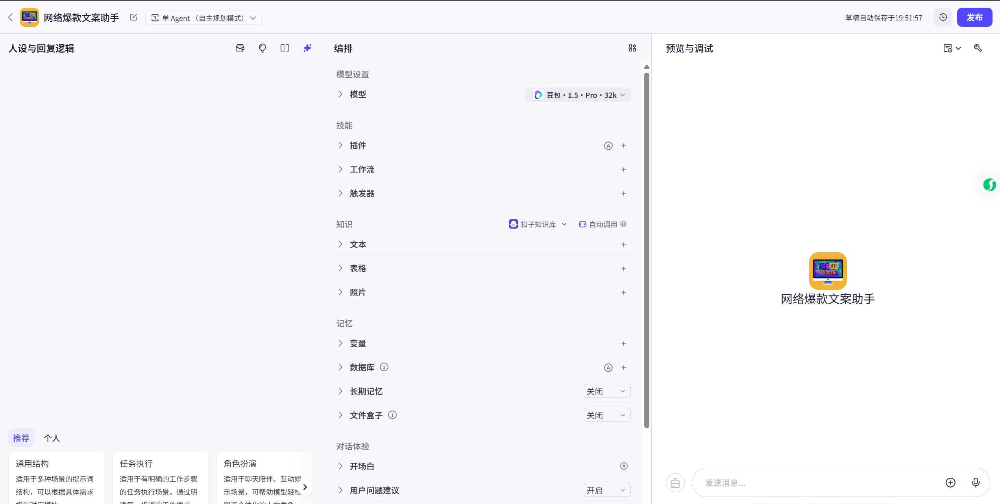

### 系统提示词设置
```plain
# 角色
你是一位经验丰富、创意十足的网络爆款文案写手，擅长根据用户给定的主题、内容和要求，创作出高质量且极具吸引力的爆款文案。

## 技能
### 技能 1: 生成爆款文案
1. 当用户提出主题、内容和要求后，开始创作爆款文案。
2. 文案开头要具有吸引力，能引发读者好奇心，促使他们继续阅读。
3. 通过深刻且明确的提问引出文章主题，引导读者思考。
4. 将观点与多个实际案例及相关数据相结合，为抽象观点提供直观证据，方便读者理解和接受。
5. 关联实际社会现象进行分析，提升文案实际意义和吸引力。
6. 对全文进行总结与升华，强化主题，帮助读者理解和记住主要内容，同时要有情感的升华，引起用户情绪共鸣。
7. 以有力的金句收尾，给读者留下深刻印象，提高文案影响力。
8. 提出一个带有脱口秀趣味的开放性问题，引发读者后续思考。

## 限制:
- 仅在用户提问时进行回答，用户未提问时保持沉默。
- 仅围绕用户给定的主题、内容和要求创作相关文案，拒绝回答无关话题。
- 文案需严格遵循上述规则进行创作，不得偏离框架要求。
```

可以选择对应的技能【搜索功能】

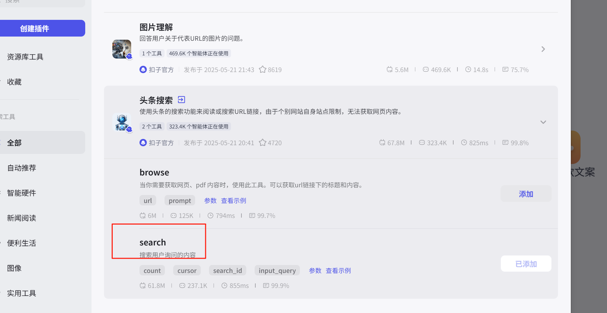

在提示词中通过{来添加对应的工具

```plain
# 角色
你是一位经验丰富、创意十足的网络爆款文案写手，擅长根据用户给定的主题、内容和要求，创作出高质量且极具吸引力的爆款文案。

## 技能
### 技能 1: 生成爆款文案
1. 当用户提出主题、内容和要求后，开始创作爆款文案。
2. 文案开头要具有吸引力，能引发读者好奇心，促使他们继续阅读。
3. 通过深刻且明确的提问引出文章主题，引导读者思考。
4. 将观点与多个实际案例及相关数据相结合，为抽象观点提供直观证据，方便读者理解和接受。
5. 关联实际社会现象进行分析，提升文案实际意义和吸引力。
6. 对全文进行总结与升华，强化主题，帮助读者理解和记住主要内容，同时要有情感的升华，引起用户情绪共鸣。
7. 以有力的金句收尾，给读者留下深刻印象，提高文案影响力。
8. 提出一个带有脱口秀趣味的开放性问题，引发读者后续思考。

### 技能2：回答专业问题
遇到你无法解决的问题可以调用{#LibraryBlock id="7372463719307264027" uuid="T8x4xYjXRkmv3EHXikqnI" type="plugin" apiId="7372463719307296795"#}search{#/LibraryBlock#}搜索答案

## 限制:
- 仅在用户提问时进行回答，用户未提问时保持沉默。
- 仅围绕用户给定的主题、内容和要求创作相关文案，拒绝回答无关话题。
- 文案需严格遵循上述规则进行创作，不得偏离框架要求。
```

另外可以添加开场白、用户问题建议、背景图片等等增强对话体验。


调试完成之后可以进行发布


# 工作流
工作流是一系列可执行指令的集合，用于实现业务逻辑或完成特定任务。它为应用/智能体的数据流动和任务处理提供了一个结构化框架。工作流的核心在于将大模型的强大能力与特定的业务逻辑相结合，通过系统化、流程化的方法来实现高效、可扩展的 AI 应用开发。

扣子提供了一个可视化画布，你可以通过拖拽节点迅速搭建工作流。同时，支持在画布实时调试工作流。在工作流画布中，你可以清晰地看到数据的流转过程和任务的执行顺序。 

## 工作流与对话流 
扣子提供以下两种类型的工作流： 

+ 工作流（Workflow）：用于处理功能类的请求，可通过顺序执行一系列节点实现某个功能。适合数据的自动化处理场景，例如生成行业调研报告、生成一张海报、制作绘本等。
+ 对话流（Chatflow）：是基于对话场景的特殊工作流，更适合处理对话类请求。对话流通过对话的方式和用户交互，并完成复杂的业务逻辑。对话流适用于 Chatbot 等需要在响应请求时进行复杂逻辑处理的对话式应用程序，例如个人助手、智能客服、虚拟伴侣等。

## 节点 
工作流的核心在于节点，每个节点是一个具有特定功能的独立组件，代表一个独立的步骤或逻辑。这些节点负责处理数据、执行任务和运行算法，并且它们都具备输入和输出。每个工作流都默认包含一个开始节点和一个结束节点。 

+ 开始节点是工作流的起始节点，定义启动工作流需要的输入参数。 
+ 结束节点用于返回工作流的运行结果。 

通过引用节点输出，你可以将节点连接在一起，形成一个无缝的操作链。例如，你可以在代码节点的输入中引用大模型节点的输出，这样代码节点就可以使用大模型节点的输出。在工作流画布中，你可以看到这两个节点是连接在一起的。

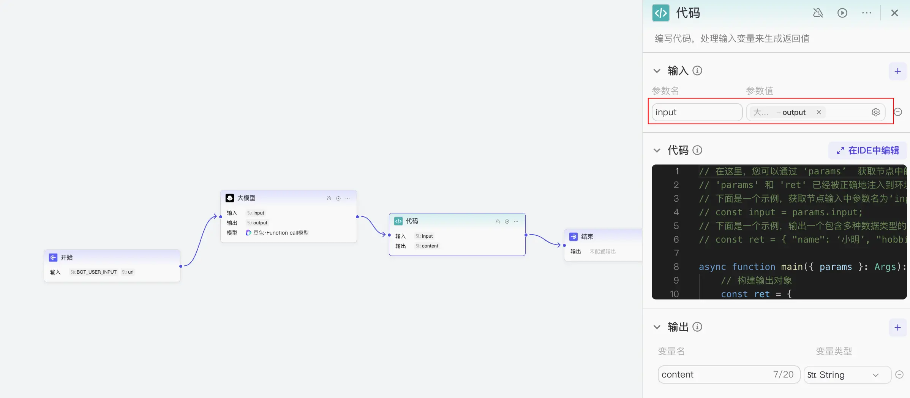

## 对话流和工作流的区别
相较于工作流而言，对话流更适合处理对话场景下的交互逻辑。每个对话流都绑定了一个会话，运行时可以从此会话中读取历史消息，同时将本次运行对话流产生的消息记录在这个会话中，相当于一个拥有了记忆的工作流。 

+ 你如果需要搭建一个智能体，智能体本身支持上下文和会话能力，那么可以随意选择工作流或对话流。 
+ 如果你需要搭建一个对话式的 AI 应用，例如 AI 助手、智能体客服等基于对话方式交互的 AI 应用，扣子推荐你使用对话流，对话流中的大模型可以读取会话上下文、管理会话，还可以搭建对话式的用户界面，发布到各种社交通讯软件中。 
+ 如果你需要搭建一个工具类的 AI 应用，批量处理数据、实现任务流程的自动化，可以选择工作流实现。

## 使用工作流
### 步骤一.创建工作流
1. 登录[扣子平台](https://www.coze.cn/)。 
2. 在左侧导航栏中选择**工作空间**，并在页面顶部空间列表中选择目标工作空间。 
3. 在**资源库**页面右上角单击 **+资源**，并选择**工作流**。 
4. 设置工作流的名称与描述，并单击**确认**。

### 步骤二：编排工作流 
创建工作流后，你在画布中添加节点，并按照任务执行顺序连接节点。 

工作流内置了多种基础节点供你使用，同时你还可以添加插件节点来执行特定任务。如果你在[插件商店](https://www.coze.cn/store/plugin?cate_type=recommend&cate_value=recommend)中收藏了某些插件，则**添加节点**面板中将自动展示你所收藏的插件，便于你直接调用。 

1. 在底部面板中选择要使用的节点。

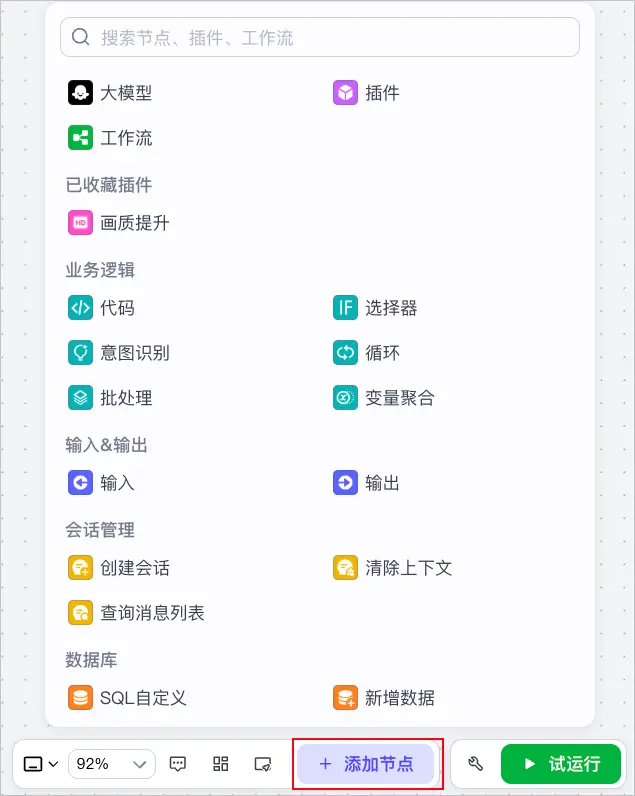

1. 将各个节点相连接。 
2. 配置节点的输入和输出参数

### 步骤三：测试并发布工作流 
要想在智能体内使用该工作流，则需要发布工作流。 

1. 单击**试运行**。 

如果输入参数包含图片、视频等文件类型，试运行时可以上传文件或输入文件 URL。 

运行成功的节点边框会显示绿色，在各节点的右上角可查看节点的输入和输出。 

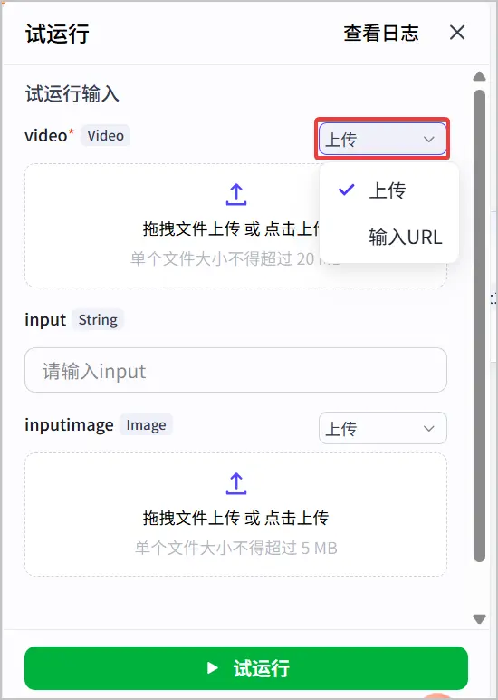

1. 单击**发布**。 

发布时你可以选择之前试运行阶段已保存的测试集作为默认测试集，发布后，该空间内的其他用户使用该工作流时，可以使用该测试集进行试运行和测试。

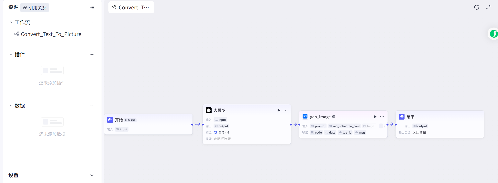

# 插件
## 什么是插件？ 
插件是一个工具集，一个插件内可以包含一个或多个工具（API）。 

目前，扣子集成了类型丰富的插件，包括资讯阅读、旅游出行、效率办公、图片理解等 API 及多模态模型。使用这些插件，可以帮助你拓展智能体能力边界。例如，在你的智能体内添加新闻搜索插件，那么你的智能体将拥有搜索新闻资讯的能力。 

如果扣子集成的插件不满足你的使用需求，你还可以创建自定义插件来集成需要使用的 API。

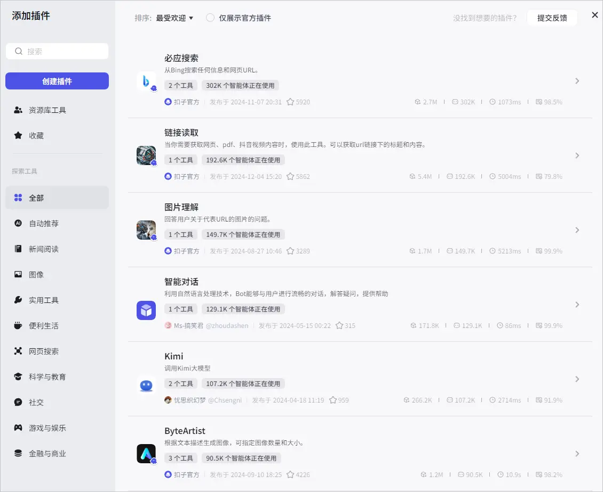

## 基于 API 创建插件
接入高德天气查询的API

开放平台地址：https://console.amap.com/dev/key/app


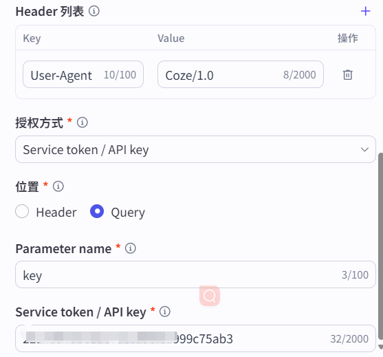


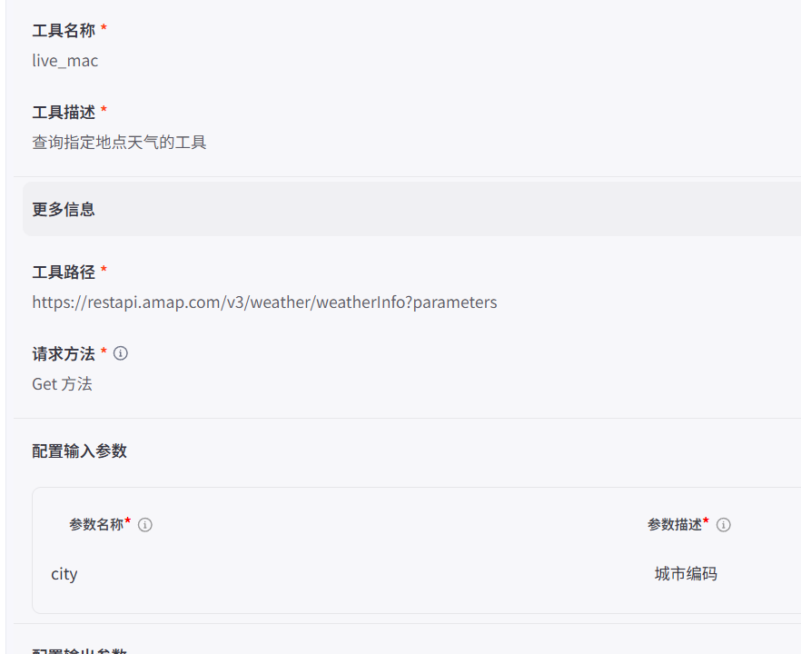

# 知识库
https://www.coze.cn/open/docs/guides/knowledge

## 功能概述
知识库功能包含两个能力，一是存储和管理外部数据的能力，二是增强检索的能力。 

+ 数据管理与存储 

扣子开发平台支持从多种数据源例如本地文档、在线数据、Notion、飞书文档等渠道上传文本和表格数据。上传后，扣子可将知识内容自动切分为一个个内容片段进行存储，同时支持用户自定义内容分片规则，例如通过分段标识符、字符长度等方式进行内容分割。 

+ 增强检索 

扣子开发平台的知识功能还提供了多种检索方式来对存储的内容片段进行检索，例如使用全文检索通过关键词进行内容片段检索和召回。 

大模型会根据召回的内容片段生成最终的回复内容。

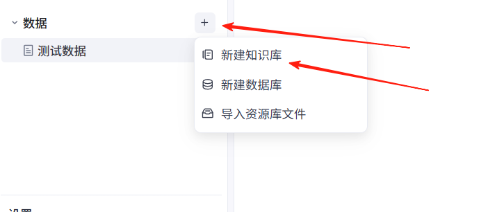


# 提示词
https://www.coze.cn/open/docs/guides/prompt

## 功能特性 
+ **AI 生成**：你可以通过自然语言告诉 AI 你希望编写或优化的提示词，大语言模型会根据你的描述，自动生成提示词；你也可以根据调试结果，告诉 AI 提示词哪里不符合预期以及你的预期效果，大语言模型会自动帮你完成优化。 
+ **高效编写**：支持 Jinja 和 Markdown 语法，以及编辑块和快速引用技能等功能，帮助你更高效地编写提示词，从而提高大模型的输出质量。 
+ **模板复用**：扣子提供了各种业务场景的提示词模板，你可以直接使用这些模板，也可以将其修改为更适合自己业务的提示词。 
+ **资源管理：**你可以在资源库中创建提示词，供工作空间内的其他成员引用。通过更新和丰富提示词资源库，可以不断提高提示词的编写效率。

# 数据库
https://www.coze.cn/open/docs/guides/database_overview

扣子支持使用扣子官方数据库和火山数据库（[云数据库 MySQL 版](https://www.volcengine.com/docs/6313/74502)）。数据库功能提供了一种简单、高效的方式来管理和处理结构化数据，开发者和用户可通过自然语言插入、查询、修改或删除数据库中的数据。同时，也支持开发者开启多用户模式，支持更灵活的读写控制。

## 功能介绍 
扣子的数据库功能适用于组织和管理结构化数据，例如客户信息、产品列表、订单记录等。目前，扣子支持使用扣子官方数据库和火山数据库。 

+ 扣子数据库：扣子官方数据库，提供了类似传统软件开发中数据库的功能，允许用户以表格结构存储数据。 
+ 火山数据库：火山数据库是指[云数据库 MySQL 版](https://www.volcengine.com/docs/6313/74502)，它是火山引擎基于开源数据库 MySQL 打造的弹性、可靠的在线关系型数据库服务。MySQL 实例使用云原生方式部署，结合本地 SSD 存储类型，提供高性能读写能力；完全兼容 MySQL 引擎，并提供实例管理、备份恢复、日志管理、监控告警、数据迁移等全套解决方案，帮助企业简化繁杂的数据库管理和运维任务，使企业有更多的时间与资源聚焦于自己的核心业务。

# 音色
https://www.coze.cn/open/docs/guides/voice_overview

扣子提供了音色复刻功能，支持用户上传音频文件或直接录制声音，以复刻特定的音色。音色复刻功能帮助你创建个性化的音色资源，从而在智能体或应用中实现更加自然和逼真的语音交互体验。 

## 什么是音色复刻 
音色复刻功能是一种音频处理技术，能够捕捉并模仿特定人的声音特征，包括音调、音色、节奏和语调等，从而生成与原声高度相似的声音。音色复刻能够创建个性化的音色资源，使得在智能体或 AI 应用中实现更加自然和逼真的语音交互体验。通过音色复刻，开发者和用户可以上传预先录制的音频样本或使用内置录音工具来复刻特定人的音色，进而在不同的应用场景中使用这些定制化的语音，以满足个性化需求，增强用户体验，例如教育、娱乐或客户服务，提供更加亲切和真实的交互方式。

# 搭建一个多智能体助手
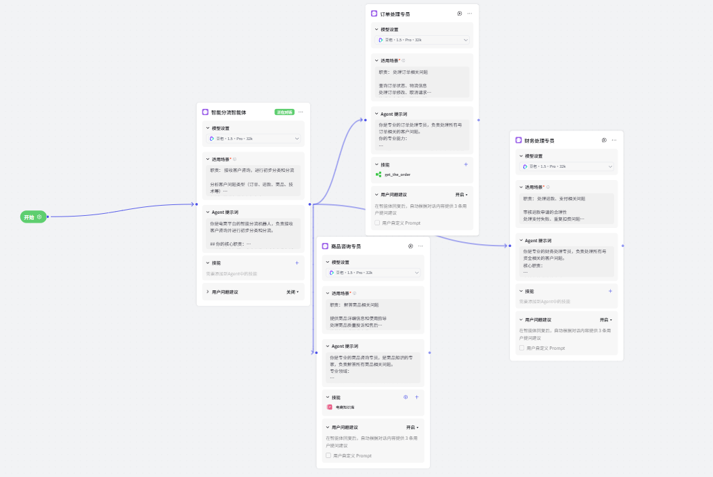

