## 1.安装docker应用
进入docker官网:https://www.docker.com/ 选择适合自己版本的docker应用下载。

<!-- 这是一张图片，ocr 内容为： -->
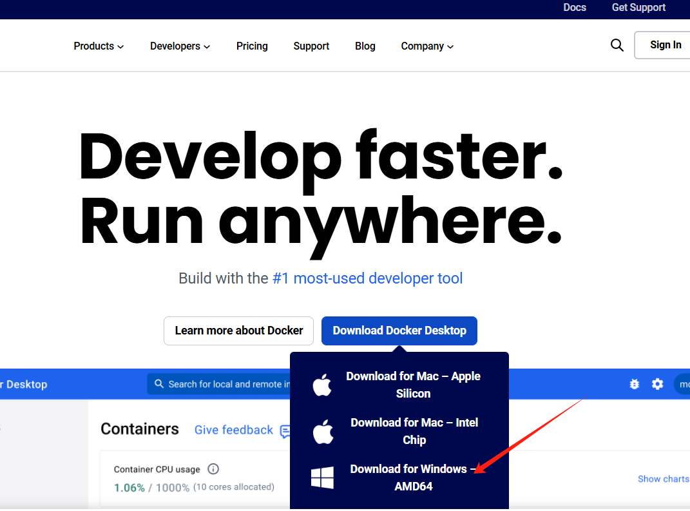

安装完成之后就可以直接看到桌面上docker应用了

## 2.安装git应用（可选）
进入git官网中：https://git-scm.com/ ，选择自己电脑对应的版本下载

<!-- 这是一张图片，ocr 内容为： -->
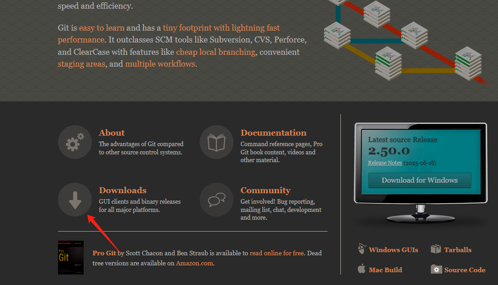

<!-- 这是一张图片，ocr 内容为： -->
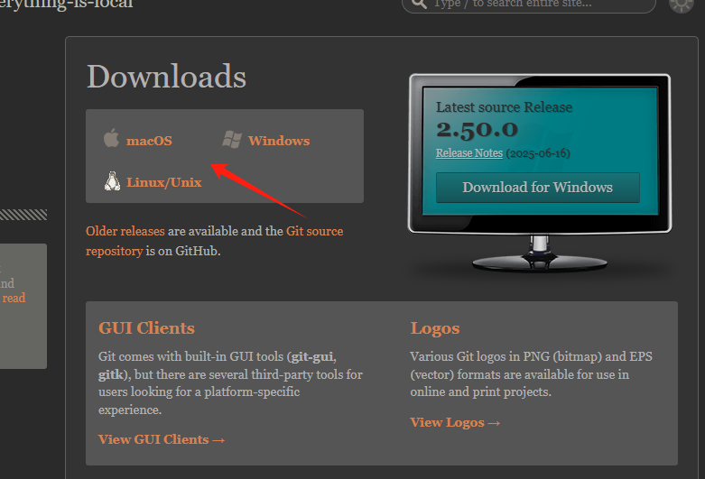

## 3.克隆Dify代码仓库
输入：https://github.com/langgenius/dify进入github中找到dify对应的仓库

<!-- 这是一张图片，ocr 内容为： -->
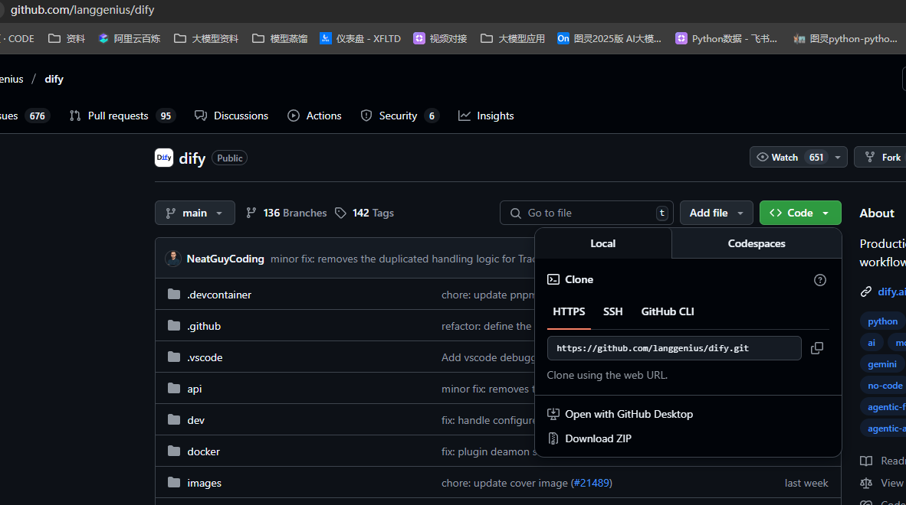

在文件管理器中创建一个空的文件夹

<!-- 这是一张图片，ocr 内容为： -->
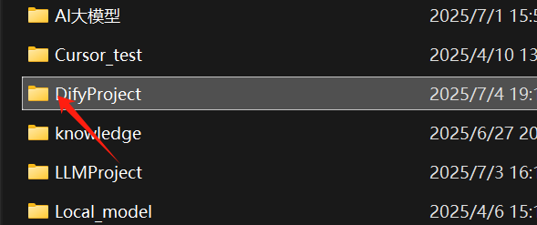

进入该文件后，右键空白地方选择鼠标选中的地方会打开一个git命令窗口

<!-- 这是一张图片，ocr 内容为： -->
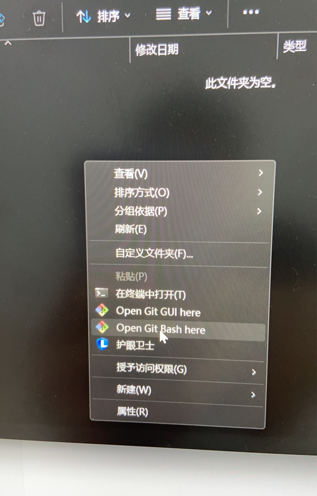

<!-- 这是一张图片，ocr 内容为： -->
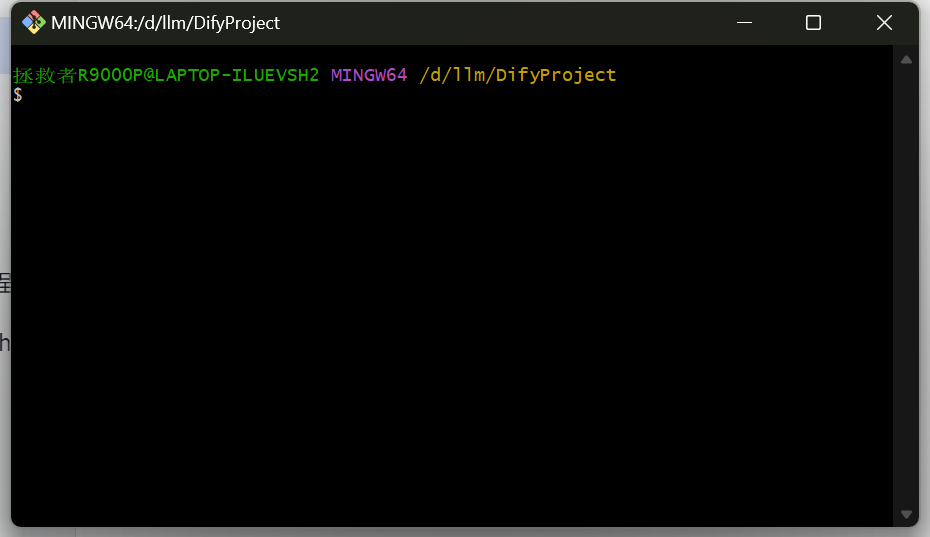

输入以下命令进行dify项目拉取，等待完成

```plain
git clone https://github.com/langgenius/dify.git
```

<!-- 这是一张图片，ocr 内容为： -->
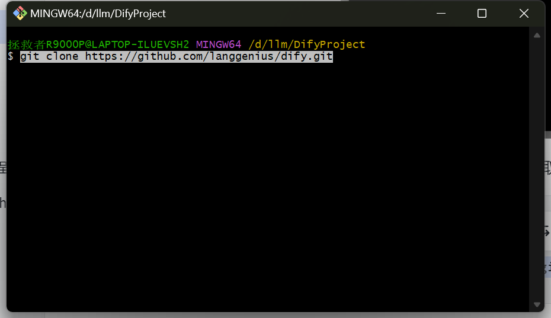

**如果git下载的比较慢，可以直接下载zip文件。**

打开文件夹管理器，进入dify源码的目录

```plain
cd dify/docker
```

复制配置文件，手动将.env.example复制一份成.env文件

<!-- 这是一张图片，ocr 内容为： -->
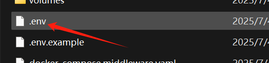

接下来打开cmd命令行，进入dify/docker文件夹中，输入下面命令加载项目到docker中

```plain
docker-compose up -d
```

<!-- 这是一张图片，ocr 内容为： -->
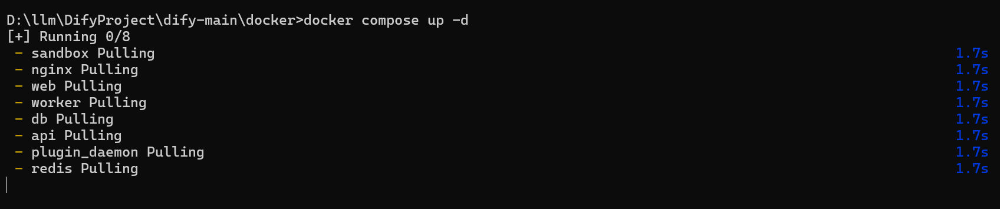

完成后，会在docker中启动

<!-- 这是一张图片，ocr 内容为： -->
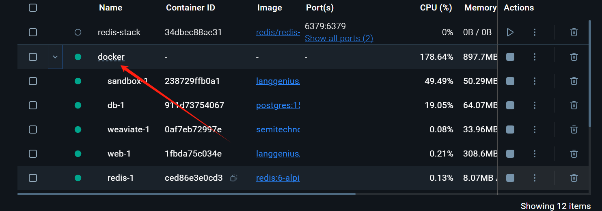

## 4.初始化dify设置
打开http://localhost/install 网址设置管理员账号，会让你输入对应的邮箱、用户名和密码

接下来登录账户即可，至此dify已经本地部署完毕。

<!-- 这是一张图片，ocr 内容为： -->
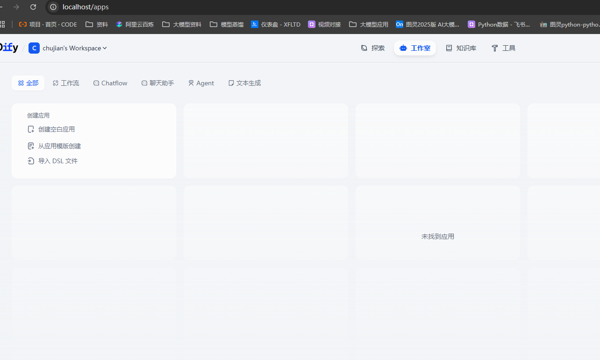

## 5.配置对应的大模型
点击设置，选择模型供应商

<!-- 这是一张图片，ocr 内容为： -->
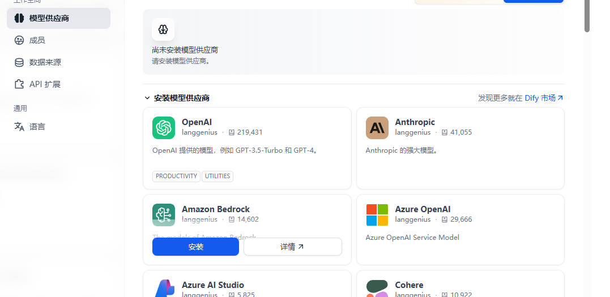

可以配置目前大部分的模型厂家，也可以部署自己本地ollama部署的模型，只需要选择对应的厂商安装即可。

设置对应大模型厂商的key

<!-- 这是一张图片，ocr 内容为： -->
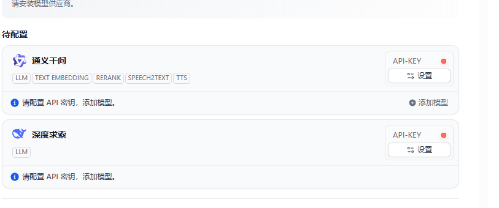

设置本地embedding模型，使用的是ollama本地部署的模型

<!-- 这是一张图片，ocr 内容为： -->
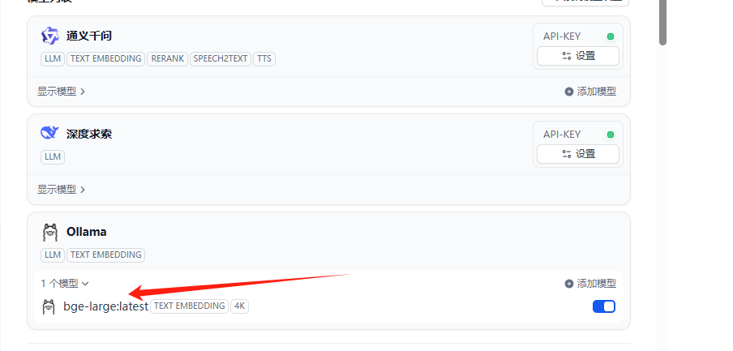

