# LlamaIndex介绍
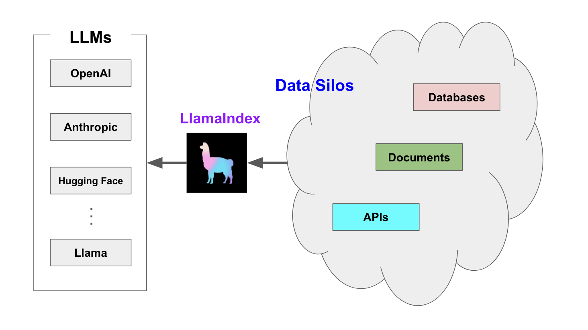

** 一句话解释**

**LlamaIndex 是一个用于构建 LLM 知识库问答（RAG）系统的框架，它让你可以把文档、数据库、网页等数据接入大模型，实现智能问答**。

## LlamaIndex和LangChain
**LlamaIndex**的核心目标是数据检索增强（RAG），专注于从大量的非结构化数据（如文档、网页等）中提取信息并提供自然语言查询的能力，帮助开发者轻松地将大型数据集转化为可以用自然语言查询的知识库，让LLM更好地理解你的数据和快速找到你要的数据。（LlamaIndex更适合构建企业级知识库）

**LangChain**的核心目标chain和工作流（Agent），设计用于构建基于语言模型的应用程序。它不仅限于处理文本数据或提供查询功能，还支持创建复杂的对话代理（Chatbots）、自动化任务执行（Agents）、以及与其他服务集成等，让LLM更好地执行复杂任务。（LangChain更适合多工具协作的Agent）

**功能对比：**

| **<font style="color:rgb(0, 0, 0);">功能</font>** | **<font style="color:rgb(0, 0, 0);">LlamaIndex</font>** | **<font style="color:rgb(0, 0, 0);">LangChain</font>** |
| --- | --- | --- |
| <font style="color:rgb(0, 0, 0);">文档加载</font> | <font style="color:rgb(0, 0, 0);">✅</font><font style="color:rgb(0, 0, 0);"> 强（支持多格式、结构化数据）</font> | <font style="color:rgb(0, 0, 0);">⚠️</font><font style="color:rgb(0, 0, 0);"> 基础功能，依赖其他库</font> |
| <font style="color:rgb(0, 0, 0);">向量索引</font> | <font style="color:rgb(0, 0, 0);">✅</font><font style="color:rgb(0, 0, 0);"> 多种索引类型</font> | <font style="color:rgb(0, 0, 0);">⚠️</font><font style="color:rgb(0, 0, 0);"> 需手动配合 FAISS/Chroma</font> |
| <font style="color:rgb(0, 0, 0);">问答引擎</font> | <font style="color:rgb(0, 0, 0);">✅</font><font style="color:rgb(0, 0, 0);"> 内置多种查询引擎</font> | <font style="color:rgb(0, 0, 0);">⚠️</font><font style="color:rgb(0, 0, 0);"> 通常通过 RetrievalQA 链实现</font> |
| <font style="color:rgb(0, 0, 0);">多步骤 Agent</font> | <font style="color:rgb(0, 0, 0);">❌</font><font style="color:rgb(0, 0, 0);"> 不擅长</font> | <font style="color:rgb(0, 0, 0);">✅</font><font style="color:rgb(0, 0, 0);"> 核心能力</font> |
| <font style="color:rgb(0, 0, 0);">工具调用 / Function Calling</font> | <font style="color:rgb(0, 0, 0);">❌</font> | <font style="color:rgb(0, 0, 0);">✅</font><font style="color:rgb(0, 0, 0);"> 支持 function call、ReAct 等 Agent 模式</font> |
| <font style="color:rgb(0, 0, 0);">多智能体协作</font> | <font style="color:rgb(0, 0, 0);">❌</font> | <font style="color:rgb(0, 0, 0);">✅</font><font style="color:rgb(0, 0, 0);"> 可配合 CrewAI / AutoGen</font> |
| <font style="color:rgb(0, 0, 0);">工作流链设计</font> | <font style="color:rgb(0, 0, 0);">⚠️</font><font style="color:rgb(0, 0, 0);"> 支持简单流</font> | <font style="color:rgb(0, 0, 0);">✅</font><font style="color:rgb(0, 0, 0);"> 支持复杂逻辑分支、控制流</font> |
| <font style="color:rgb(0, 0, 0);">RAG 支持</font> | <font style="color:rgb(0, 0, 0);">✅</font><font style="color:rgb(0, 0, 0);"> RAG 强者</font> | <font style="color:rgb(0, 0, 0);">✅</font><font style="color:rgb(0, 0, 0);"> 可实现，但需组合链</font> |


**总结：**

如果你要让大模型“读懂”你的文档，用 **LlamaIndex**； 如果你要让大模型“像人一样做事 + 查文档 + 查天气 + 计算”，用 **LangChain**。

# RAG 中的重要概念
## 装载阶段
**节点和文档**：A`Document`是包含任何数据源的容器，例如 PDF 文件、API 输出或从数据库中检索的数据。A`Node`是 LlamaIndex 中的数据最小单元，代表数据源的一个“数据块”`Document`。节点具有元数据，用于关联它们所在的文档以及其他节点。

**连接器**：数据连接器（通常称为`Reader`）将来自不同数据源和数据格式的数据导入到`Documents`和`Nodes`。

## 索引阶段
**索引**：导入数据后，LlamaIndex 会帮助您将数据建立索引，使其结构易于检索。这通常涉及生成索引，`vector embeddings`这些索引存储在一个名为“索引库”的专用数据库中`vector store`。索引还可以存储各种关于数据的元数据。

**嵌入**：LLM 生成称为嵌入的数值数据表示`embeddings`。在筛选数据相关性时，LlamaIndex 会将查询转换为嵌入，而您的向量存储将找到与查询的嵌入在数值上相似的数据。

## 查询阶段
**检索器**：检索器定义了如何根据查询从索引中高效地检索相关上下文。检索策略是决定检索数据的相关性和效率的关键。

**路由器**：路由器决定使用哪个检索器从知识库中检索相关上下文。更具体地说，路由器类`RouterRetriever` 负责选择一个或多个候选检索器来执行查询。它们使用选择器，根据每个候选检索器的元数据和查询语句来选择最佳选项。

**节点后处理器**：节点后处理器接收一组检索到的节点，并对其应用转换、过滤或重新排序逻辑。

**响应合成器**：响应合成器使用用户查询和一组给定的检索文本块，从 LLM 生成响应。

# Llamaindex快速入门
```plain
pip install llama-index==0.12.47 # 核心
pip install llama-index-embeddings-huggingface==0.5.3 # 使用本地的embedding模型
pip install llama-index-llms-dashscope==0.3.2 # 使用千问的模型
```

```python
from llama_index.core import VectorStoreIndex, SimpleDirectoryReader
from llama_index.core import Settings
from llama_index.embeddings.huggingface import HuggingFaceEmbedding
from llama_index.llms.dashscope import DashScope
from llama_index.llms.ollama import Ollama
from dotenv import load_dotenv
import os

load_dotenv()
model = "qwen-plus-2025-01-25"
api_key = os.getenv("DASHSCOPE_API_KEY")
api_base_url = os.getenv("DASHSCOPE_BASE_URL")

llm = DashScope(model_name=model, api_key=api_key,
                api_base=api_base_url, is_chat_model=True,
                max_tokens=1000)
# llm = Ollama(base_url="http://localhost:11434", model="deepseek-r1:1.5b",
#              request_timeout=60.0)
# response = llm.complete("你好")
# print(response)

# 实现简单的RAG流程
# Settings是llamaindex中做核心配置的类，可以设置默认大模型、默认嵌入模型、默认分词器。。。。
# LlamaIndex默认使用的大模型被替换为百炼
Settings.llm = DashScope(model=model, api_key=api_key, api_base=api_base_url)
# 加载本地的嵌入模型
Settings.embed_model = HuggingFaceEmbedding(model_name="D:\\llm\\Local_model\\BAAI\\bge-large-zh-v1___5")

# # 从文件目录加载文件,自动选择对应的文档加载器
documents = SimpleDirectoryReader(input_files=["data/公司规章制度.txt"]).load_data()
# # 从文档创建索引
index = VectorStoreIndex.from_documents(documents)

# # 将索引转换为查询引擎
query_engine = index.as_query_engine()
response = query_engine.query("公司的上下班时间？")
print(response)
```

## 什么是代理？
“代理”是一种自动化推理和决策引擎。它接收用户输入/查询，并能够做出内部决策来执行该查询，从而返回正确的结果。代理的关键组件包括但不限于：

+ 将复杂的问题分解成更小的问题
+ 选择要使用的外部工具 + 提出调用该工具的参数
+ 规划一系列任务
+ 将之前完成的任务存储在记忆模块中

LlamaIndex 提供了一个全面的框架，用于构建具有不同复杂程度的代理系统：

+ **如果您想快速构建代理**：使用我们预先构建的代理和工具架构来快速设置代理系统。
+ **如果您想完全控制您的代理系统：使用我们的**工作流从头开始构建和部署自定义代理工作流。

```python
import asyncio
from llama_index.core.agent.workflow import ReActAgent, FunctionAgent
from llama_index.llms.deepseek import DeepSeek
import os
from dotenv import load_dotenv
'''
QWEN模型对llama index中的agent支持不好，所以采用DeepSeek
'''
# 加载 API 配置
load_dotenv()

api_key = os.getenv("DEEPSEEK_API_KEY")
api_base_url = os.getenv("DEEPSEEK_BASE_URL")

# 选择模型
model = "deepseek-chat"
llm = DeepSeek(model=model, api_key=api_key, api_base_url=api_base_url, temperature=0.1)


# 定义一个简单的计算器工具
def multiply(a: float, b: float) -> float:
    """两个数相乘并返回乘积"""
    return a * b


def add(a: float, b: float) -> float:
    """将两个数相加并返回和"""
    return a + b


workflow = FunctionAgent(
    tools=[multiply, add],
    llm=llm,
    system_prompt="你是一个可以使用工具执行基本数学运算的代理。请用中文回答",
)


# 将函数封装成 LlamaIndex 的工具
# 创建一个代理工作流，将计算器工具传入
# workflow = ReActAgent(
#     tools=[multiply, add],
#     llm=llm,
#     verbose=True
# )


async def main():
    response = await workflow.run(user_msg="请计算20+(2*4)?")
    print("=== 最终响应 ===")
    print(response)

    # 运行代理
    # from llama_index.core.agent.workflow import AgentStream
    #
    # handler = workflow.run("请用中文计算：：20+(2*4)?", )
    #
    # async for ev in handler.stream_events():
    #     if isinstance(ev, AgentStream):
    #         print(f"{ev.delta}", end="", flush=True)
    #
    # response = await handler
    # print(response)

# 运行代理
if __name__ == "__main__":
    asyncio.run(main())
```

## 工作流是什么？
工作流（Workflow）是任务或操作步骤的有序流程，它定义了任务之间的执行顺序、逻辑判断、工具调用和数据流动方式。

应用程序被划分为多个部分，称为“步骤”，这些部分由事件触发，并且步骤本身会发出事件，进而触发后续步骤。通过组合步骤和事件，您可以创建任意复杂的流程，这些流程封装了逻辑，使您的应用程序更易于维护和理解。步骤可以是任何形式，从一行代码到复杂的代理。它们可以具有任意的输入和输出，并通过事件进行传递。

### 核心概念
| **<font style="color:rgb(0, 0, 0);">组成</font>** | **<font style="color:rgb(0, 0, 0);">解释</font>** |
| --- | --- |
| <font style="color:rgb(0, 0, 0);">📌</font><font style="color:rgb(0, 0, 0);"> 节点（Step）</font> | <font style="color:rgb(0, 0, 0);">每一个处理动作，如加载文件、提问、调用模型</font> |
| <font style="color:rgb(0, 0, 0);">🔁</font><font style="color:rgb(0, 0, 0);"> 条件（Condition）</font> | <font style="color:rgb(0, 0, 0);">判断分支，如“是否是数学问题？”</font> |
| <font style="color:rgb(0, 0, 0);">🧠</font><font style="color:rgb(0, 0, 0);"> 工具（Tool）</font> | <font style="color:rgb(0, 0, 0);">外部 API、数据库、大模型调用</font> |
| <font style="color:rgb(0, 0, 0);">🔀</font><font style="color:rgb(0, 0, 0);"> 控制流</font> | <font style="color:rgb(0, 0, 0);">顺序执行 / 条件跳转 / 并行执行</font> |
| <font style="color:rgb(0, 0, 0);">🪜</font><font style="color:rgb(0, 0, 0);"> 状态管理</font> | <font style="color:rgb(0, 0, 0);">每一步的数据如何传给下一步（如上下文、变量）</font> |


### 常见类型
+ 顺序工作流：线性执行，如“申请→审批→执行”。
+ 并行工作流：多个步骤同时进行，如多部门会签。
+ 状态驱动工作流：根据当前状态触发下一步，如订单状态从“待付款”变为“已发货”。
+ 事件驱动工作流：由外部事件触发，如“用户提交表单后启动流程”。

### 实际应用场景
1. 审批流程：请假、报销、合同签署。
2. 生产制造：从订单到交付的环节跟踪。
3. IT运维：故障自动上报、分派、解决。
4. 客户服务：投诉工单的流转与处理。

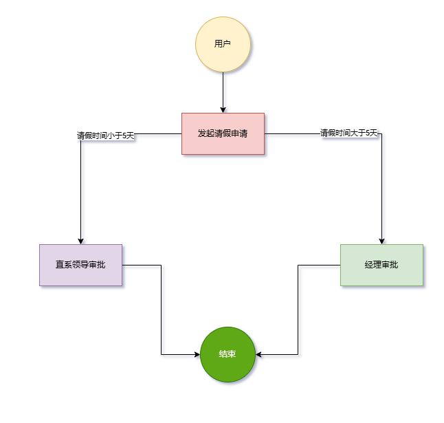

```python
from llama_index.core.workflow import (
    StartEvent,
    StopEvent,
    Workflow,
    step,
)


class MyWorkflow(Workflow):
    @step
    async def my_step(self, ev: StartEvent) -> StopEvent:
        return StopEvent(result="Hello, world!")


async def main():
    w = MyWorkflow(timeout=10, verbose=False)
    # await关键字：用于等待异步操作完成，只能在async函数内使用。
    result = await w.run()
    print(result)


if __name__ == "__main__":
    import asyncio

    asyncio.run(main())
```

工作流的一大特色是内置的可视化工具，我们已经安装好了。让我们来可视化一下刚刚创建的简单

```plain
需要下载模块
pip install llama-index-utils-workflow
```

```plain
from llama_index.utils.workflow import draw_all_possible_flows

draw_all_possible_flows(MyWorkflow, filename="basic_workflow.html")
```

这将在当前目录中创建一个名为 的文件`basic_workflow.html`。在浏览器中打开它，即可看到工作流程的交互式可视化表示。它看起来应该像这样：

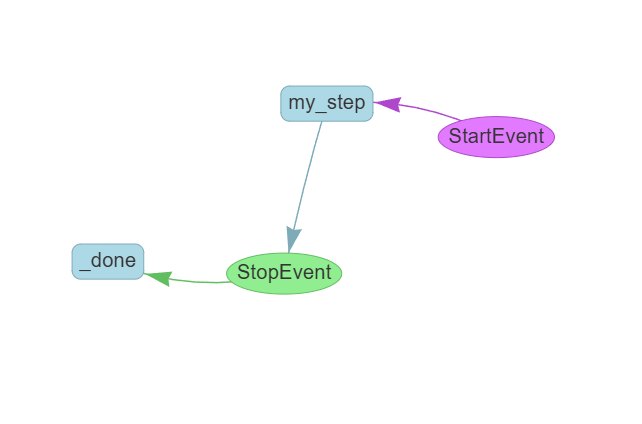

# LlamaIndex基本概念
LLM 是在海量数据上进行训练的，但它们并非基于**你的**数据进行训练。检索增强生成 (RAG) 通过将你的数据添加到 LLM 已有的数据中来解决此问题。你会经常看到对 RAG 的引用。查询引擎、聊天引擎和代理通常使用 RAG 来完成其任务。

在 RAG 中，您的数据会被加载并准备用于查询或“索引”。用户查询会根据索引进行操作，索引会将您的数据过滤到最相关的上下文。之后，该上下文和您的查询将连同提示一起发送到 LLM，LLM 会给出答复。

即使您正在构建的是聊天机器人或代理，您也需要了解将数据导入应用程序的 RAG 技术。

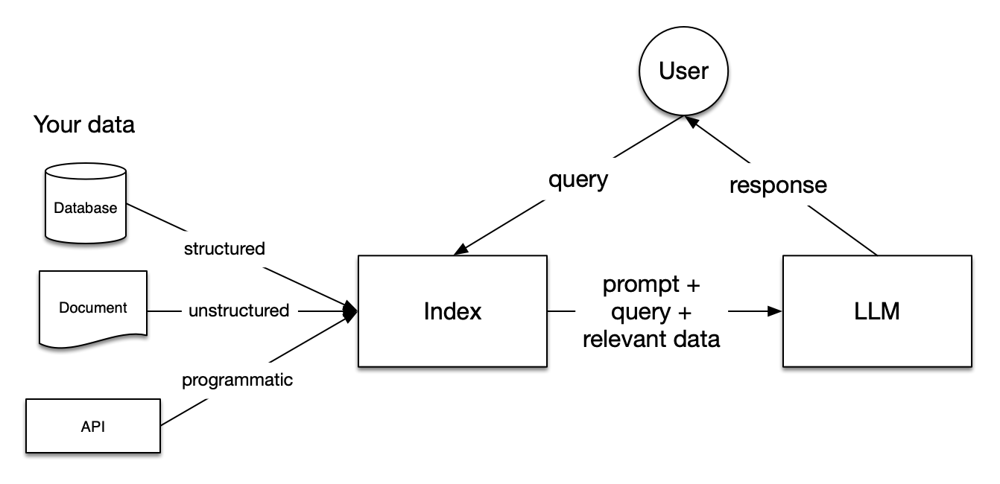

**RAG 内的阶段:**

RAG 包含五个关键阶段，它们也将成为您构建的大多数大型应用程序的一部分。它们是：

+ **加载**：指的是将数据从其所在位置（无论是文本文件、PDF、其他网站、数据库还是 API）加载到您的工作流程中。LlamaHub[提供](https://llamahub.ai/)数百种连接器供您选择。
+ **索引**：这意味着创建一个允许查询数据的数据结构。对于法学硕士 (LLM) 来说，这几乎总是意味着创建`vector embeddings`数据含义的数值表示，以及许多其他元数据策略，以便于准确查找上下文相关的数据。
+ **存储**：一旦您的数据被索引，您几乎总是希望存储您的索引以及其他元数据，以避免重新索引它。
+ **查询**：对于任何给定的索引策略，您可以通过多种方式利用 LLM 和 LlamaIndex 数据结构进行查询，包括子查询、多步骤查询和混合策略。
+ **评估**：任何流程中的关键步骤是检查其相对于其他策略的有效性，或检查何时进行更改。评估可以客观衡量您对查询的响应的准确性、可靠性和速度。


**结论：**我们可以使用LlamaIndex帮助我们更轻松地处理、索引和查询大量的非结构化数据（如文档、网页内容、电子邮件等），并通过自然语言处理技术来提供智能查询和检索功能

## 提示
提示prompt是赋予 LLM 表达能力的基本输入。LlamaIndex 使用提示来构建索引、执行插入、在查询过程中执行遍历，并合成最终答案。

在构建代理工作流时，创建和管理提示是开发流程的关键部分。LlamaIndex 提供了一种灵活而强大的方法来管理提示，并以多种方式使用它们。

+ `RichPromptTemplate`- 最新样式，用于使用变量和逻辑构建 jinja 样式的提示
+ `PromptTemplate`- 使用单个 f 字符串构建提示的旧式简单模板
+ `ChatPromptTemplate`- 使用消息和 f 字符串构建聊天提示的旧式简单模板

### `RichPromptTemplate`
通过利用 Jinja 语法，您可以构建包含变量、逻辑、解析对象等的提示模板。

```python
from llama_index.core.prompts import RichPromptTemplate

context_str = """
    DeepSeek，全称杭州深度求索人工智能基础技术研究有限公司 [40]。DeepSeek是一家创新型科技公司 [3]，成立于2023年7月17日 [40]，使用数据蒸馏技术 [41]，得到更为精练、有用的数据 [41]。
    由知名私募巨头幻方量化孕育而生 [3]，专注于开发先进的大语言模型（LLM）和相关技术 [40]。注册地址 [6]：浙江省杭州市拱墅区环城北路169号汇金国际大厦西1幢1201室 [6]。法定代表人为裴湉 [6]，
    经营范围包括技术服务、技术开发、软件开发等 [6]。
"""
question = 'deepseek成立于哪一年？'
template = RichPromptTemplate(
    """我们在下面提供了上下文信息
    ---------------------
    {{ context_str }}
    ---------------------
    有了这些信息，请回答问题: {{ query_str }}
    """
)

# 格式化为字符串
prompt_str = template.format(context_str=context_str, query_str=question)
print(prompt_str)
# 格式化聊天消息列表
messages = template.format_messages(context_str=context_str, query_str=question)
print(messages)
```

Jinja 提示和 f 字符串之间的主要区别在于变量现在有双括号`{{ }}`而不是单括号`{ }`

```python
from llama_index.core.prompts import RichPromptTemplate

template = RichPromptTemplate(
    """

给定一个列表，包含图片和文本, 请尽你所能回答这个问题.




这是一些文本: {{ text }}
这是一张图片:
{{ image_path | image }}


"""
)

messages = template.format_messages(
    images_and_texts=[
        ("page_1.jpg", "文件的第一页数据"),
        ("page_2.jpg", "文件的第二页数据"),
    ]
)
print(messages)
```

在此示例中，您可以看到几个特征：

+ 该``块用于将消息格式化为聊天消息并设置角色
+ 循环``用于迭代`images_and_texts`传入的列表
+ 该`{{ image_path | image }}`语法用于将图像路径格式化为图像内容块。此处，`|`用于对变量应用“过滤器”，以帮助将其识别为图像。

### 使用`f-string`提示模板
定义自定义提示就像创建格式字符串一样简单

```python
from llama_index.core import PromptTemplate

#
context_str = """
    DeepSeek，全称杭州深度求索人工智能基础技术研究有限公司 [40]。DeepSeek是一家创新型科技公司 [3]，成立于2023年7月17日 [40]，使用数据蒸馏技术 [41]，得到更为精练、有用的数据 [41]。
    由知名私募巨头幻方量化孕育而生 [3]，专注于开发先进的大语言模型（LLM）和相关技术 [40]。注册地址 [6]：浙江省杭州市拱墅区环城北路169号汇金国际大厦西1幢1201室 [6]。法定代表人为裴湉 [6]，
    经营范围包括技术服务、技术开发、软件开发等 [6]。
"""
question = 'deepseek成立于哪一年？'
template = (
    "我们在下面提供了上下文信息"
    "---------------------"
    "{context_str}"
    " ---------------------"
    " 请根据上下文，回答问题: {query_str}"
)
qa_template = PromptTemplate(template)

# 将提示格式设置为字符串
prompt = qa_template.format(context_str=context_str, query_str=question)
print(prompt)
# 将提示格式设置为聊天消息列表。
messages = qa_template.format_messages(context_str=context_str, query_str=question)
print(messages)


from llama_index.core import ChatPromptTemplate
from llama_index.core.llms import ChatMessage, MessageRole
# 从聊天消息中定义模板
message_templates = [
    ChatMessage(content="你是一个智能助手.", role=MessageRole.SYSTEM),
    ChatMessage(
        content="帮我生成一个关于{topic}的故事",
        role=MessageRole.USER,
    ),
]
chat_template = ChatPromptTemplate(message_templates=message_templates)

# 格式化为聊天消息列表
messages = chat_template.format_messages(topic="狮子")
print(messages)
# 格式化为字符串
prompt = chat_template.format(topic="老虎")
print(prompt)
```

### 高级提示功能
`RichPromptTemplate`和`PromptTemplate`都有以下高级功能

#### 函数映射
传入函数作为模板变量而不是固定值。这是相当先进和强大的；允许您进行动态的少量提示等。

```python
from llama_index.core.prompts import RichPromptTemplate
import re

qa_prompt_tmpl_str = """
上下文信息如下。
--------------------- 
{{ context_str }} 
---------------------
给定上下文信息而不是先验知识，回答查询。
查询：{{ query_str }}
答案：
"""


def hide_sensitive_info(text):
    """隐藏文本中的敏感信息"""
    # 隐藏姓名（假设格式为 "姓名：XXX"）
    text = re.sub(r'姓名：[^\n\r]+', '姓名：[已隐藏]', text)

    # 隐藏身份证号码（15位或18位数字）
    text = re.sub(r'身份证：\d{15}(\d{2}[0-9Xx])?', '身份证：[已隐藏]', text)

    # 也可以隐藏其他格式的身份证
    text = re.sub(r'身份证[：:]\s*\d+[0-9Xx]*', '身份证：[已隐藏]', text)

    return text


def format_context_fn(**kwargs):
    # 用项目符号格式化上下文
    context_str = kwargs["context_str"]
    # 隐藏敏感信息
    context_str = hide_sensitive_info(context_str)

    # 用项目符号格式化上下文
    context_list = context_str.split("\n\n")
    context_list = [c.strip() for c in context_list if c.strip()]  # 修复原代码的bug

    fmtted_context = "\n\n".join([f"- {c}" for c in context_list])
    return fmtted_context


prompt_tmpl = RichPromptTemplate(
    qa_prompt_tmpl_str, function_mappings={"context_str": format_context_fn}
)

context_str = """\
姓名：初见

身份证：123456798123456

这项工作中，我们开发并发布了 Llama 2，这是一组经过预训练和微调的大型语言模型 (LLM)，其规模从 70 亿到 700 亿个参数不等。

我们经过微调的 LLM 称为 Llama 2-Chat，针对对话用例进行了优化。

在我们测试的大多数基准测试中，我们的模型都优于开源聊天模型，并且根据我们对有用性和安全性的人工评估，它们可能是闭源模型的合适替代品。
"""

fmt_prompt = prompt_tmpl.format(
    context_str=context_str, query_str="llama2有多少参数？"
)
print(fmt_prompt)
```

#### 部分格式化
部分格式化（`partial_format`）允许您部分格式化提示，填写一些变量，同时将其他变量留待以后填写。

这是一个很好的便利功能，因此您不必一直维护所有必需的提示变量`format`，您可以在它们进入时进行部分格式化。

```python
from llama_index.core.prompts import RichPromptTemplate

qa_prompt_tmpl_str = """\
上下文信息如下。
---------------------
{{ context_str }}
---------------------
给定上下文信息而不是先验知识，回答查询。
请以 {{ tone_name }} 的格式写出答案
查询: {{ query_str }}
答案: 
"""
# 可以将目前已有的变量内容先填充到提示词模板中，没有的变量可以稍后在进行填充（和langchain的区别就是可以先进行一部分的变量填充）
prompt_tmpl = RichPromptTemplate(qa_prompt_tmpl_str)

partial_prompt_tmpl = prompt_tmpl.partial_format(tone_name="莎士比亚")
print(partial_prompt_tmpl)
print("*" * 80)
fmt_prompt = partial_prompt_tmpl.format(
    context_str="在这项工作中，我们开发并发布了 Llama 2，这是一组经过预训练和微调的大型语言模型 (LLM)，其规模从 70 亿到 700 亿个参数不等",
    query_str="llama 2 有多少个参数", )
print(fmt_prompt)
print("*" * 80)
# 格式化为聊天消息列表
fmt_prompt = partial_prompt_tmpl.format_messages(
    context_str="在这项工作中，我们开发并发布了 Llama 2，这是一组经过预训练和微调的大型语言模型 (LLM)，其规模从 70 亿到 700 亿个参数",
    query_str="llama 2 有多少个参数",
)
print(fmt_prompt)
```

#### 动态小样本示例
使用函数映射，您还可以根据其他提示变量动态注入少量样本。

下面是一个使用向量存储根据查询动态注入少量文本到 SQL 示例的示例。

```python
from llama_index.core import Settings, VectorStoreIndex
from llama_index.core.schema import TextNode
from llama_index.embeddings.huggingface import HuggingFaceEmbedding
from llama_index.core.prompts import RichPromptTemplate
from llama_index.llms.dashscope import DashScope
from dotenv import load_dotenv
import os

load_dotenv()
model = "qwen-plus-2025-09-11"
api_key = os.getenv("DASHSCOPE_API_KEY")
api_base_url = os.getenv("DASHSCOPE_BASE_URL")

# LlamaIndex默认使用的大模型被替换为百炼
Settings.llm = DashScope(model_name=model, api_key=api_key, api_base=api_base_url, is_chat_model=True)
# 加载本地的嵌入模型
Settings.embed_model = HuggingFaceEmbedding(model_name="D:\\llm\\Local_model\\BAAI\\bge-large-zh-v1___5")

text_to_sql_prompt_tmpl_str = """\
你是一个故事生成专家
下面是一些例子：

示例：
{{ examples }}


现在轮到你了.
问题: {{ query_str }}
答案: 
"""
# 添加几个文档
example_nodes = [
    TextNode(
        text="Query: 请生成一个小红帽的故事，输出20字符\n小红帽去看奶奶，遇到大灰狼，被骗了，最后猎人救了她们。"
    ),
    TextNode(
        text="Query: 请生成一个白雪公主的故事，输出20字符\n白雪公主被后妈害，七矮人救她，王子吻醒了她。"
    ),
]
# 创建索引
index = VectorStoreIndex(nodes=example_nodes)

# 创建检索器
retriever = index.as_retriever(similarity_top_k=1)


def get_examples_fn(**kwargs):
    query = kwargs["query_str"]
    # 将用户的问题获取到之后，通过检索器从索引中去查询对应的示例
    examples = retriever.retrieve(query)
    return "\n\n".join(node.text for node in examples)


# 使用函数映射到提示模板中，会使用检索器找寻对应的样例填充到提示模板里的examples中
prompt_tmpl = RichPromptTemplate(
    text_to_sql_prompt_tmpl_str,
    function_mappings={"examples": get_examples_fn},
)
# 组装问题到提示词中
prompt = prompt_tmpl.format(
    query_str="请生成一个黑猫警长的故事"
)
print("prompt=>", prompt)
# 使用大模型进行回答
response = Settings.llm.complete(prompt)
print("response=>", response.text)
```

## 加载
在选择的 LLM 能够处理您的数据之前，您需要加载它。LlamaIndex 是通过数据连接器来实现的`Reader`。数据连接器从不同的数据源提取数据，并将数据格式化为`Document`对象。对象`Document`是数据（目前是文本，未来将包括图像和音频）及其元数据的集合。

### 文档和节点
Document 和 Node 对象是 Llama Index 中的核心。

文档**(Document)**是包含任何数据源（例如 PDF、API 输出或从数据库检索的数据）的通用容器。它们可以手动构建，也可以通过我们的数据加载器自动创建。默认情况下，文档会存储文本以及其他一些属性。其中一些属性如下所示。

+ `metadata`- 可以附加到文本的注释词典。
+ `relationships`- 包含与其他文档/节点的关系的字典。

#### 定义文档
文档可以通过数据加载器自动创建， 也可以手动构建。

默认情况下，我们所有的[数据加载器](https://docs.llamaindex.ai/en/stable/module_guides/loading/connector/)（包括 LlamaHub 上提供的加载器）都通过该`load_data`函数返回对象。

```plain
from llama_index.core import SimpleDirectoryReader

documents = SimpleDirectoryReader("./data").load_data()
```

手动构建文档

```plain
from llama_index.core import Document
from llama_index.core import SimpleDirectoryReader
from pathlib import Path

text_list = ["text1", "text2"]
# 创建文档对象，并添加元数据
documents = [Document(text=t, metadata={"filename": "文件名称", "category": "类别"}) for t in text_list]
print(documents)


# 自动设置元数据
def filename_fn(filename: str):
    return {
        "file_name": filename,
        "category": Path(filename).suffix,
    }


documents = SimpleDirectoryReader(input_dir="../data", file_metadata=filename_fn).load_data()
print(documents)
```

#### 定义节点
节点**(Node)**表示源文档 (Document) 的“块”，可以是文本块、图像块或其他。与文档类似，节点包含元数据以及与其他节点的关系信息。

节点是 LlamaIndex 中的一等公民。您可以选择直接定义节点及其所有属性。也可以选择通过我们的`NodeParser`类将源文档“解析”为节点。默认情况下，每个从文档派生的节点都会从该文档继承相同的元数据（例如，文档中记录的“file_name”会传播到每个节点）。

```plain
from llama_index.core.node_parser import SentenceSplitter
from llama_index.core import SimpleDirectoryReader

# 加载文件
documents = SimpleDirectoryReader("./data").load_data()
# 进行切片
parser = SentenceSplitter()
# 将文档解析成节点
nodes = parser.get_nodes_from_documents(documents)
print(nodes)
```

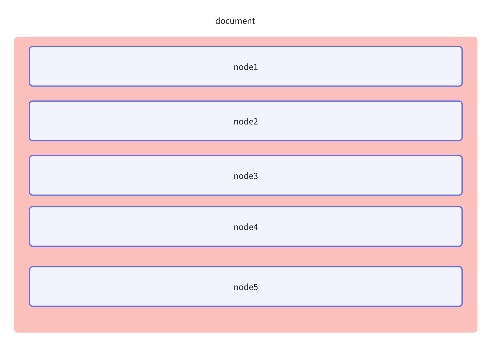

手动构建节点

```python
from llama_index.core.schema import TextNode, NodeRelationship, RelatedNodeInfo

def link_bidirectional(a: TextNode, b: TextNode, a_note: str, b_note: str):
    a.relationships[NodeRelationship.NEXT] = RelatedNodeInfo(
        node_id=b.node_id, metadata={"desc": a_note}
    )
    b.relationships[NodeRelationship.PREVIOUS] = RelatedNodeInfo(
        node_id=a.node_id, metadata={"desc": b_note}
    )

node1 = TextNode(text="deepseek", id_="1")
node2 = TextNode(text="chatgpt", id_="2")

link_bidirectional(node1, node2, a_note="这是节点2", b_note="这是节点1")

nodes = [node1, node2]
print(nodes)
```

#### 元数据提取
可以使用 LLM 通过Metadata Extractor模块自动提取元数据

元数据提取器模块包括以下“特征提取器”：

+ `SummaryExtractor`- 自动提取一组节点的摘要
+ `QuestionsAnsweredExtractor`- 提取每个节点可以回答的一组问题
+ `TitleExtractor`- 提取每个节点上下文的标题
+ `EntityExtractor`- 提取每个节点内容中提到的实体（即地点、人物、事物的名称）

```python
from llama_index.core.extractors import (
    TitleExtractor,
    QuestionsAnsweredExtractor,
)
from llama_index.core.node_parser import TokenTextSplitter
from llama_index.core import SimpleDirectoryReader
from llama_index.core import Settings
from llama_index.embeddings.huggingface import HuggingFaceEmbedding
from llama_index.llms.dashscope import DashScope
from llama_index.core.ingestion import IngestionPipeline  # 创建摄取管道
from dotenv import load_dotenv
import os
import asyncio

load_dotenv()
model = "qwen3-max"
api_key = os.getenv("DASHSCOPE_API_KEY")
api_base_url = os.getenv("DASHSCOPE_BASE_URL")

# LlamaIndex默认使用的大模型被替换为百炼
Settings.llm = DashScope(model_name=model, api_key=api_key, api_base=api_base_url, is_chat_model=True)
# 加载本地的嵌入模型
Settings.embed_model = HuggingFaceEmbedding(model_name="D:\\llm\\Local_model\\BAAI\\bge-large-zh-v1___5")

documents = SimpleDirectoryReader(input_files=["../data/小说.txt"]).load_data()

# 分割文本设置
text_splitter = TokenTextSplitter(
    separator=" ", chunk_size=512, chunk_overlap=128
)
# 为每一个节点生成问题-默认的提示词是英文，手动添加提示词
question_prompt_template = """
以下是参考内容：
{context_str}

请根据上述上下文信息，生成 {num_questions} 个该内容能够具体回答的问题，这些问题的答案最好是该内容独有的，不容易在其他地方找到。

你也可以参考上下文中可能提供的更高层次的总结信息，结合这些总结，尽可能生成更优质、更具有针对性的问题。请用中文输出！
"""
# 进行标题的提取
title_extractor = TitleExtractor(nodes=5, node_template="请为以下文档生成一个简洁的标题: {context_str}",
                                 num_workers=5)
# 进行问题的提取
qa_extractor = QuestionsAnsweredExtractor(questions=3, prompt_template=question_prompt_template, num_workers=5)

async def main():
    # # 获取节点  截取前三个节点进行测试
    # nodes = text_splitter.get_nodes_from_documents(documents)[:3]
    # # 异步等待结果, 根据所有的节点提取的标题生成一个整体标题，get_title_candidates()可以给所有node生成标题
    # titles = await title_extractor.aextract(nodes)
    # qas = await qa_extractor.aextract(nodes)
    #
    # # 将生成的标题和问题回填到节点中
    # for node, t, q in zip(nodes, titles, qas):
    #     node.metadata.update(t)  # 把 document_title 加入 metadata
    #     node.metadata.update(q)  # 把 questions 加入 metadata
    # # 输出内容
    # for node in nodes:
    #     print(node.metadata)

    # 官方建议使用摄取管道进行元数据提取
    # 将原始数据转换为可用于查询的结构化格式
    pipeline = IngestionPipeline(
        transformations=[text_splitter, title_extractor, qa_extractor]
    )
    # 开始执行将原始数据转换为可索引的文档格式
    nodes = pipeline.run(
        documents=documents,
        in_place=True,
        show_progress=True,
    )
    print(nodes)


if __name__ == '__main__':
    asyncio.run(main())
```

### 目录读取器
`SimpleDirectoryReader` 是 LlamaIndex 提供的一个数据加载器类，用于从指定的文件目录中读取文档。

在实际场景中，可能会希望使用对应文档所对应的读取器，[LlamaHub](https://llamahub.ai/)提供了众多的读取器，可以按需选择。

但这`SimpleDirectoryReader`是一个很好的入门方法。

**支持的文件类型：**

默认情况下，`SimpleDirectoryReader`它会尝试读取找到的所有文件，并将其全部视为文本。除了纯文本外，它还明确支持以下文件类型，这些类型会根据文件扩展名自动检测：

+ .csv - 逗号分隔值
+ .docx-Microsoft Word
+ .epub - EPUB 电子书格式
+ .hwp - 韩文文字处理器
+ .ipynb-Jupyter笔记本
+ .jpeg、.jpg - JPEG 图像
+ .mbox——MBOX 电子邮件存档
+ .md - Markdown
+ .mp3、.mp4 - 音频和视频
+ .pdf - 便携式文档格式
+ .png - 便携式网络图形
+ .ppt、.pptm、.pptx - Microsoft PowerPoint

会发现没有JSON格式的读取器，这时候就去[LlamaHub](https://llamahub.ai/)，搜索JSON格式的读取器。

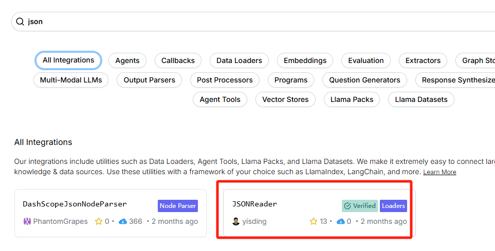

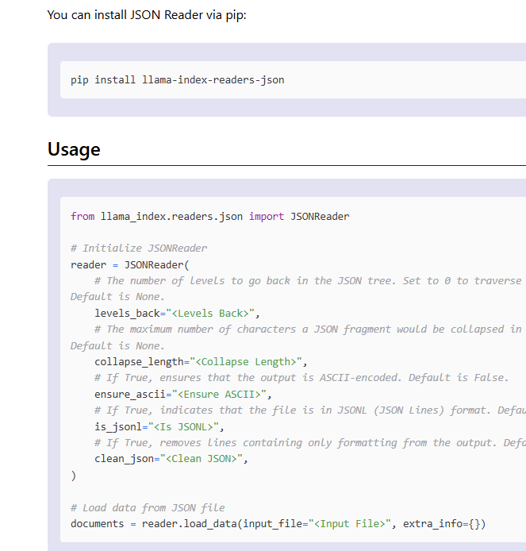

最简单就是传递一个目录，`SimpleDirectoryReader`会读取目录下所有支持的文件

```python
from llama_index.core import SimpleDirectoryReader


# 使用目录加载器读取文件（PDF文件会按照页面进行分割）
reader = SimpleDirectoryReader(input_dir="../data")
# 读取文档
documents = reader.load_data()
print(documents)
```

如果目录有多个文件需要加载，可以使用并行的方式进行加载文档。注意：Windows电脑需要再主函数中运行代码，不然会报错。

```plain
from llama_index.core import SimpleDirectoryReader


def main():
    # 使用目录加载器读取文件（PDF文件会按照页面进行分割）
    reader = SimpleDirectoryReader(input_dir="../data")
    # 读取文档
    # documents = reader.load_data()
    # 如果文件比较多可以使用并行处理文档，注意：windows需要在主函数中运行
    documents = reader.load_data(num_workers=2)
    print(documents)


if __name__ == '__main__':
    main()
```

默认情况下只会你读取最顶层的文件目录，也就是目录中的子目录里面的文件是不会默认读取的。如果要读取子目录下的文件需设置`recursive=True`

```python
from llama_index.core import SimpleDirectoryReader

def main():
    # 使用目录加载器读取文件（PDF文件会按照页面进行分割）
    reader = SimpleDirectoryReader(input_dir="../data", recursive=True)
    # 读取文档
    # documents = reader.load_data()
    # 如果文件比较多可以使用并行处理文档，注意：windows需要在主函数中运行
    documents = reader.load_data(num_workers=2)
    print(documents)


if __name__ == '__main__':
    main()
```

在文件加载的时候可以对其迭代

```python
from llama_index.core import SimpleDirectoryReader


def main():
    # 使用目录加载器读取文件（PDF文件会按照页面进行分割）
    reader = SimpleDirectoryReader(input_dir="./data", recursive=True)
    # 读取文档
    # documents = reader.load_data()
    # 如果文件比较多可以使用并行处理文档，注意：windows需要在主函数中运行
    # documents = reader.load_data(num_workers=2)
    # print(documents)
    all_docs = []
    for docs in reader.iter_data():
        # 有100个文件，读取1个文件的时候花费的时候1分钟，文件读取完成之后在进行向量化，花费30秒  1分30秒
        # 使用iter_data可以一边进行文件的读取一边进行向量化
        # 可对文档进行操作
        print(docs)
        print('-'*100)
        # 分割
        
        # 嵌入
        
        # 存入向量数据库中
    #     all_docs.extend(docs)
    # print(all_docs)


if __name__ == '__main__':
    main()
```

限制加载的文件

```plain
# 可以指定具体文件进行加载
from llama_index.core import SimpleDirectoryReader

# 使用目录加载器读取文件（PDF文件会按照页面进行分割）input_files-传入文件列表进行读取文件
reader = SimpleDirectoryReader(input_files=["../data/deepseek介绍.txt"])
# 读取文档
documents = reader.load_data()
print(documents)


# 可以指定要排除的文件列表
reader = SimpleDirectoryReader(input_dir="../data", exclude=["deepseek介绍.txt", ])
# 读取文档
documents = reader.load_data()
print(documents)


# 使用扩展名来确定要加载哪些文件
reader = SimpleDirectoryReader(
    input_dir="../data", recursive=True, required_exts=[".pdf"]
)
# 读取文档
documents = reader.load_data()
print(documents)
```

### 数据连接器
数据连接器（又名`Reader`）将来自不同数据源和数据格式的数据提取为简单的`Document`表示形式（文本和简单元数据）

https://llamahub.ai/?tab=all

这个网址就是一个开源的存储库，里面就包含加载器。

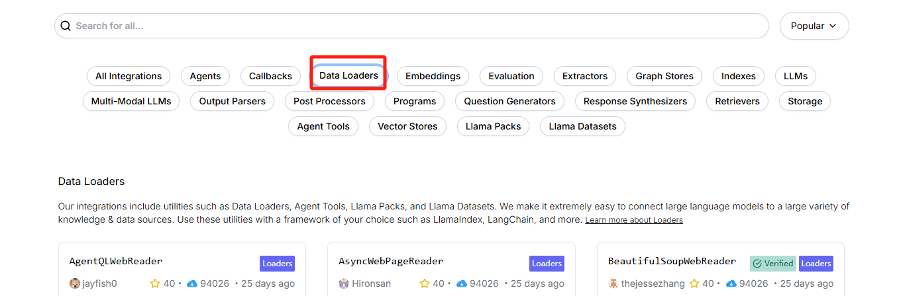

可以直接点击按照文档进行使用

比如使用JSON加载器

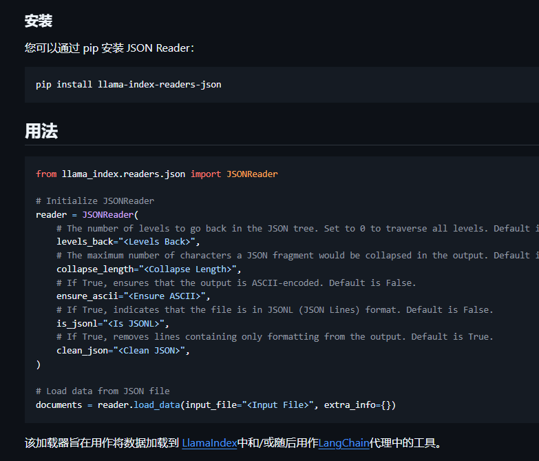

```plain
from llama_index.readers.json import JSONReader
from llama_index.core.node_parser import JSONNodeParser, SentenceSplitter

reader = JSONReader()

documents = reader.load_data(input_file="../data/request.json")
print(documents)
# 如果想使用JSONNodeParser，需要设置 JSONReader(clean_json=False)
# print(JSONNodeParser().get_nodes_from_documents(documents))
s = SentenceSplitter(chunk_size=10, chunk_overlap=5)
print(s.get_nodes_from_documents(documents))
```

https://docs.llamaindex.ai/en/stable/module_guides/loading/connector/modules/ 在这可以看到不同加载器对应的相关示例

### 节点解析器/文本分割器
节点解析器的核心功能是**将加载进来的 **`**Document**`** 对象（代表原始数据源，如一个文本文件、PDF 等）分解成一系列更小、更易于处理的 带有结构化信息的**`**Node**`** 对象（也称为“文本块”或 "Chunks"）（也就是RAG中的切片步骤）**

**为什么需要节点解析器？**

1. **LLM 上下文窗口限制:** 大型语言模型（LLM）通常有输入长度限制（即上下文窗口大小）。你无法将一个非常大的文档（比如一本几百页的书）一次性全部输入给 LLM。通过将文档分割成小的 `Node`，你可以在后续的检索阶段只找出与用户查询最相关的几个 `Node`，并将它们作为上下文提供给 LLM。(**问题加上大模型的输出算作一次上下文大小**)
2. **提高检索效率和相关性:** 将信息分解成更小的、语义集中的单元（`Node`），可以使得向量嵌入（Embeddings）更精确地捕捉每个单元的含义。在检索时，这有助于更准确地找到与查询匹配的信息片段，而不是返回包含大量无关信息的大块文本。
3. **精细化处理:** 每个 `Node` 可以包含独立的元数据（Metadata），并且可以建立与其他 `Node` 的关系（例如，上一个节点、下一个节点、父节点等），这为更复杂的检索策略（如分层检索）提供了基础。

#### 基于文件的节点解析器
**简单的文件节点解析器：**

```python
from llama_index.core.node_parser import SimpleFileNodeParser
from llama_index.readers.file import FlatReader
from pathlib import Path

# 读取文件
md_docs = FlatReader().load_data(Path("../data/小说.txt"))

# 创建节点解析器，根据后缀名选择对应的解析器
parser = SimpleFileNodeParser()
# 将文档解析成节点
nodes = parser.get_nodes_from_documents(md_docs)
print(nodes)
```

**HTML节点解析器：**会解析原始HTML文件中的标签（p，span...）

注意：LlamaIndex 的一些 `Reader`（数据连接器），尤其是那些专门为网页设计的（如 `BeautifulSoupWebReader`, `TrafilaturaReader`），在加载数据的阶段**就已经进行了 HTML 解析和内容提取**。它们可能配置为只提取主要的文章内容，并去除 HTML 标签，直接生成包含干净文本的 `Document` 对象。

```xml
from llama_index.core.node_parser import HTMLNodeParser
from llama_index.readers.file import FlatReader
from pathlib import Path

# 读取文件
html_docs= FlatReader().load_data(Path("../data/index.html"))
# 使用 HTMLNodeParser，指定根据哪些标签创建节点
# 需要安装 pip install beautifulsoup4
parser = HTMLNodeParser(tags=["p", "h1", "li"])  # 只提取 p, h1, li 标签的内容作为节点
nodes = parser.get_nodes_from_documents(html_docs)
print(nodes)
```

JSON节点解析器：解析原始的JSON

```javascript
from llama_index.core.node_parser import JSONNodeParser
from llama_index.readers.file import FlatReader
from pathlib import Path

# 读取文件
json_docs = FlatReader().load_data(Path("../data/request.json"))

# 构建JSON节点解析器
parser = JSONNodeParser()
# 生成节点
nodes = parser.get_nodes_from_documents(json_docs)
print(nodes)
```

Markdown节点解析器：解析原始的markdown文档

```python
from llama_index.core.node_parser import MarkdownNodeParser
from llama_index.readers.file import FlatReader
from pathlib import Path

# 读取文件
md_docs = FlatReader().load_data(Path("../data/test.md"))
parser = MarkdownNodeParser()
nodes = parser.get_nodes_from_documents(md_docs)
print(nodes)
```

#### 文本分割器
将长文本拆分为更小的、连续的片段（如段落、固定长度的块），确保分割后的内容保持语义完整性，避免信息碎片化。

**代码分割器：**是专门用于处理源代码文件的工具，旨在将代码按逻辑结构（如函数、类、代码块）智能分割，同时保留语法完整性和上下文关联。

https://github.com/grantjenks/py-tree-sitter-languages#license通过这个地址可以看到支持的编程语言。

```python
from llama_index.core.node_parser import CodeSplitter
from llama_index.core import SimpleDirectoryReader

# 读取文件
documents = SimpleDirectoryReader(input_files=['../data/demo.py']).load_data()
# 初始化代码分割器
splitter = CodeSplitter(
    language="python",
    chunk_lines=50,  # 每块行数
    chunk_lines_overlap=10,  # 重叠的数量
    max_chars=300,  # 块最大的数量
)
# 将文档转换成节点
nodes = splitter.get_nodes_from_documents(documents)
for node in nodes:
    print(f"Type: {node.metadata}\nText: {node.text}\n{'='*50}")
```

**LangchainNodeParser：**`LangchainNodeParser` 是一个桥接工具，允许直接使用 LangChain 的文本分割器（Text Splitter）来生成 LlamaIndex 的节点（Node）。

```python
from langchain.text_splitter import RecursiveCharacterTextSplitter
from llama_index.core.node_parser import LangchainNodeParser
from llama_index.core import SimpleDirectoryReader

# 读取文件
documents = SimpleDirectoryReader(input_files=['../data/小说.txt']).load_data()

# 包装LangChain中的递归切割文本
parser = LangchainNodeParser(RecursiveCharacterTextSplitter(chunk_size=1000, chunk_overlap=50))
nodes = parser.get_nodes_from_documents(documents)
print(nodes)
```

**句子分割器(重点)：**专门用于将文本按自然语言句子边界拆分的工具，适用于需要保留完整语义单元的 NLP 任务（对中文的符号支持不好，最好是在进行切割的时候先把所有的中文符号替换成英文的符号）

```python
from llama_index.core import SimpleDirectoryReader
from llama_index.core.node_parser import SentenceSplitter

# 初始化分割器
splitter = SentenceSplitter(
    chunk_size=100,  # 分割长度
    chunk_overlap=20,  # 重叠长度
    paragraph_separator="\n\n",  # 段落分割符
    separator="，"  # 句子分割符
)
# 读取文件
documents = SimpleDirectoryReader(input_files=['../data/小说.txt']).load_data()

# 分割文段
nodes = splitter.get_nodes_from_documents(documents)
for node in nodes:
    print(node.text)
```

**句子窗口节点解析器：**

句子窗口节点解析器（Sentence Window Node Parser） 是一种高级文本处理工具，专为提升上下文感知的检索效果而设计。其核心思想是将文本分割为独立的句子节点，同时为每个节点附加周边上下文窗口，形成“中心句子+上下文”的结构化数据单元。

```python
from llama_index.core.node_parser import SentenceWindowNodeParser
from llama_index.core import Document

# 示例文档
document = Document(text="这是第一个句子. 这是第二个句子. 这是第三个句子. 这是第四个句子. ")

# 创建句子窗口节点解析器
node_parser = SentenceWindowNodeParser(
    window_size=1,  # 窗口大小，即每个节点包含的句子数量
    window_metadata_key="window", # 对应的上下文的key
    original_text_metadata_key="original_text"  # 原有node的key
)

# 从文档中获取节点
nodes = node_parser.get_nodes_from_documents([document])
# 打印生成的节点
for node in nodes:
    print(node.text, node.metadata, "\n\n")
```

**语义分割节点解析器：**

语义分割器并非使用**固定的**块大小对文本进行分块，而是利用嵌入相似性自适应地选择句子之间的断点。这确保了“块”包含语义上相互关联的句子。

```python
from llama_index.core import SimpleDirectoryReader
from llama_index.core.node_parser import SemanticSplitterNodeParser
from llama_index.embeddings.huggingface import HuggingFaceEmbedding


documents = SimpleDirectoryReader(input_files=['../data/小说.txt']).load_data()

embed_model = HuggingFaceEmbedding(model_name="D:\\llm\\Local_model\\BAAI\\bge-large-zh-v1___5")
splitter = SemanticSplitterNodeParser(
    buffer_size=1, breakpoint_percentile_threshold=95, embed_model=embed_model
)

nodes = splitter.get_nodes_from_documents(documents)
# 打印生成的节点
for node in nodes:
    print(node.text, node.metadata, "------")
```

**TokenTextSplitter：是按照token数量进行分割**

```python
from llama_index.core.node_parser import TokenTextSplitter
from llama_index.core import SimpleDirectoryReader
# 读取文档
documents = SimpleDirectoryReader(input_files=['../data/小说.txt']).load_data()

splitter = TokenTextSplitter(
    chunk_size=1024,
    chunk_overlap=20,
    separator=" ",
)
nodes = splitter.get_nodes_from_documents(documents)

print(nodes)
```

#### 层次节点解析器：
这种节点解析器将节点划分为层次结构，从而从单一输入中产生不同块大小的多个层次结构。每个节点都包含对其父节点的引用。（通过node_id进行父子之间的关联）能够保留文档逻辑结构的场景

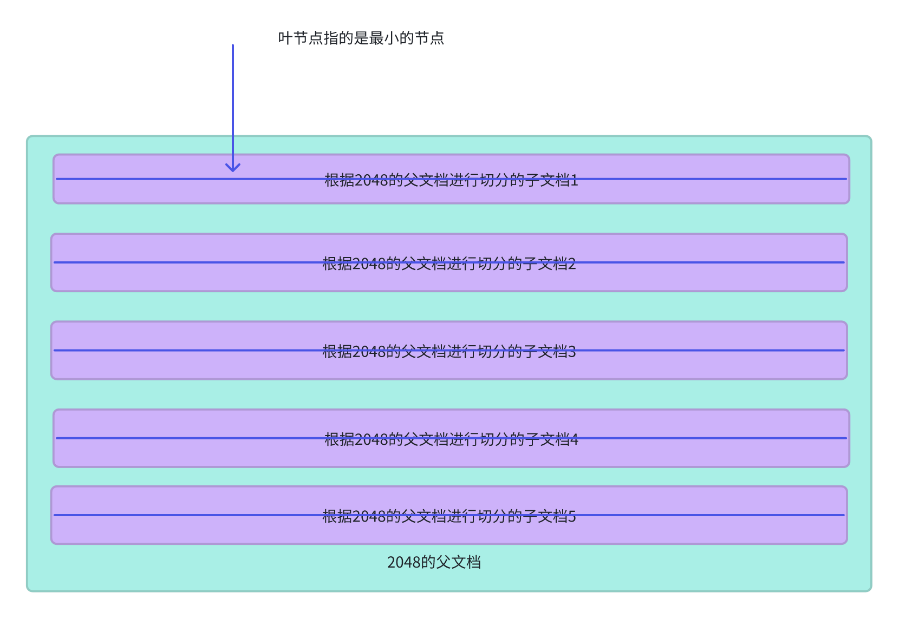

```plain
from llama_index.core.node_parser import HierarchicalNodeParser
from llama_index.core.retrievers import AutoMergingRetriever
from llama_index.core import SimpleDirectoryReader, StorageContext, VectorStoreIndex, Settings
from llama_index.embeddings.huggingface import HuggingFaceEmbedding

# 读取数据
documents = SimpleDirectoryReader(input_files=['../data/公司规章制度.txt']).load_data()

# 进行层次节点解析器 chunk_sizes=每层目标Token数（从粗到细）
node_parser = HierarchicalNodeParser.from_defaults(
    chunk_sizes=[2048, 512, 128]
)
# 文档转换成节点
nodes = node_parser.get_nodes_from_documents(documents)
# for node in nodes:
#     print(f"ID: {node.node_id}, Text: {node.text}")
#     if node.parent_node:
#         print(f"Parent: {node.parent_node.node_id}")

# 详细案例（会根据子节点合并父节点）
Settings.embed_model = HuggingFaceEmbedding(model_name=r"D:\\llm\\Local_model\\BAAI\\bge-large-zh-v1___5")
# 获取叶节点（最细粒度）没有子节点：
from llama_index.core.node_parser import get_leaf_nodes
leaf_nodes = get_leaf_nodes(nodes)
# print(leaf_nodes)

# 3. 构建存储上下文：包括所有节点
from llama_index.core.storage.docstore import SimpleDocumentStore

# 创建文档存储
docstore = SimpleDocumentStore()
# 添加文档
docstore.add_documents(nodes)
# 创建需要存储的上下文
storage_context = StorageContext.from_defaults(docstore=docstore)

# 4. 构建基础向量检索索引：仅对叶节点构建
base_index = VectorStoreIndex(
    leaf_nodes,
    storage_context=storage_context,
)
base_retriever = base_index.as_retriever(similarity_top_k=6)

# 5. 构建 AutoMergingRetriever
retriever = AutoMergingRetriever(
    vector_retriever=base_retriever,
    storage_context=storage_context,
    verbose=True,  # 显示合并日志
)

# 6. 查询
query_str = "公司形象有哪几条？"
nodes_returned = retriever.retrieve(query_str)
print(f"Retrieved {len(nodes_returned)} nodes:")
for node in nodes_returned:
    print("---")
    print(node.get_content())

base_nodes_returned = base_retriever.retrieve(query_str)
print(f"Retrieved {len(base_nodes_returned)} nodes:")
for node in base_nodes_returned:
    print("---")
    print(node.get_content())
```

### 摄取管道
`IngestionPipeline` 是 LlamaIndex 提供的 自动化文档处理流水线，将数据加载、清洗、分割、嵌入、存储等步骤封装为可配置的模块化流程，专为 RAG（检索增强生成）系统设计。

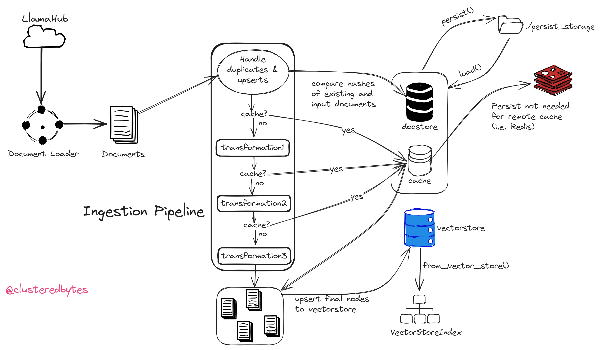

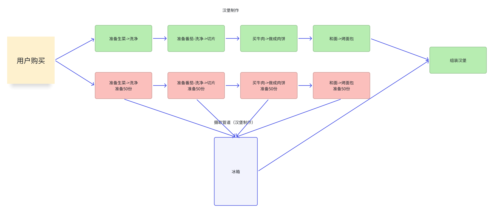

可以使用的变化包括：

1. 文本分割器（TextSplitter）
2. 节点解析器（NodeParser）
3. 元数据提取器（MetadataExtractor）
4. 任何嵌入模型（Any embedding model）

#### 基础使用
```python
from llama_index.core.node_parser import SimpleNodeParser
from llama_index.core.text_splitter import TokenTextSplitter
from llama_index.core.ingestion import IngestionPipeline
from llama_index.embeddings.huggingface import HuggingFaceEmbedding
from llama_index.readers.json import JSONReader

# 定义数据连接器去读取数据
reader = JSONReader()
documents = reader.load_data(input_file="../data/request.json")
# 定义本地化的向量化
# 加载本地的嵌入模型
embed_model = HuggingFaceEmbedding(model_name="D:\\llm\\Local_model\\BAAI\\bge-large-zh-v1___5")
# 定义文本分割器
text_splitter = TokenTextSplitter(chunk_size=200, chunk_overlap=20)

# 创建数据摄入管道
pipeline = IngestionPipeline(
    transformations=[text_splitter, embed_model]
)

# 执行管道
nodes = pipeline.run(documents=documents)

# 打印处理后的节点
for node in nodes:
    print(node, "-------", "\n\n")
```

#### 向量数据库
```plain
pip install llama-index-vector-stores-chroma
```

在运行管道的时候，可以选择将生成的节点自动插入向量数据库中

```python
from llama_index.core.node_parser import SimpleNodeParser
from llama_index.core.text_splitter import TokenTextSplitter
from llama_index.core.ingestion import IngestionPipeline
from llama_index.embeddings.huggingface import HuggingFaceEmbedding
from llama_index.core import SimpleDirectoryReader
from llama_index.vector_stores.chroma import ChromaVectorStore
from llama_index.core import VectorStoreIndex
from llama_index.core import Settings
import chromadb
from llama_index.llms.dashscope import DashScope
from dotenv import load_dotenv
import os

load_dotenv()
model = "qwen-turbo"
api_key = os.getenv("DASHSCOPE_API_KEY")
api_base_url = os.getenv("DASHSCOPE_BASE_URL")

# LlamaIndex默认使用的大模型被替换为百炼
Settings.llm = DashScope(model_name=model, api_key=api_key, api_base=api_base_url, is_chat_model=True)

# 加载本地的嵌入模型
embed_model = HuggingFaceEmbedding(model_name="D:\\llm\\Local_model\\BAAI\\bge-large-zh-v1___5")
# 设置默认的向量模型为本地模型
Settings.embed_model = embed_model

# 定义数据连接器去读取数据
documents = SimpleDirectoryReader(input_files=["../data/小说.txt"]).load_data()
# 定义本地化的向量化
chroma_client = chromadb.EphemeralClient()
chroma_collection = chroma_client.create_collection("quickstart")
# 创建Chroma向量数据库对象
vector_store = ChromaVectorStore(chroma_collection=chroma_collection)

# 定义文本分割器
text_splitter = TokenTextSplitter(chunk_size=200, chunk_overlap=20)

# 创建数据摄入管道
pipeline = IngestionPipeline(
    transformations=[text_splitter, embed_model], vector_store=vector_store
)

# 执行管道
nodes = pipeline.run(documents=documents)

# 打印处理后的节点
# for node in nodes:
#     print(node, "-------", "\n\n")

# 创建索引对象
index = VectorStoreIndex.from_vector_store(vector_store)
# 创建检索器
retriever = index.as_retriever()
print(retriever.retrieve("    萧薰儿的斗气是多少？"))
```

#### 本地缓存
使用本地缓存存储对应的数据

```python
from llama_index.core.node_parser import SimpleNodeParser
from llama_index.core.text_splitter import TokenTextSplitter
from llama_index.core.ingestion import IngestionPipeline
from llama_index.embeddings.huggingface import HuggingFaceEmbedding
from llama_index.core import SimpleDirectoryReader
from llama_index.vector_stores.chroma import ChromaVectorStore
from llama_index.core import VectorStoreIndex
from llama_index.core import Settings, Document
import chromadb
from llama_index.llms.dashscope import DashScope
from dotenv import load_dotenv
import time
import os

load_dotenv()
model = "qwen3-max"
api_key = os.getenv("DASHSCOPE_API_KEY")
api_base_url = os.getenv("DASHSCOPE_BASE_URL")

# LlamaIndex默认使用的大模型被替换为百炼
Settings.llm = DashScope(model_name=model, api_key=api_key, api_base=api_base_url, is_chat_model=True)

# 加载本地的嵌入模型
embed_model = HuggingFaceEmbedding(model_name="D:\\llm\\Local_model\\BAAI\\bge-large-zh-v1___5")
# 设置默认的向量模型为本地模型
Settings.embed_model = embed_model

# 定义数据连接器去读取数据
documents = SimpleDirectoryReader(input_files=["../data/小说.txt"]).load_data()
# 定义本地化的向量化
chroma_client = chromadb.EphemeralClient()
chroma_collection = chroma_client.create_collection("quickstart")
# 创建Chroma向量数据库对象
vector_store = ChromaVectorStore(chroma_collection=chroma_collection)

# 定义文本分割器
text_splitter = TokenTextSplitter(chunk_size=200, chunk_overlap=20)

# 创建数据摄入管道
pipeline = IngestionPipeline(
    transformations=[text_splitter, embed_model], vector_store=vector_store
)
# 开始时间
start = time.time()
# 执行管道
pipeline.run(documents=documents)
# 统计文档加载的时间
time2 = time.time() - start
print(f"第一次处理文档，耗时: {time2:.2f}秒")

# 将这个管道持久化到本地
pipeline.persist("./pipeline_storage")

# 加载和恢复状态
new_pipeline = IngestionPipeline(
    transformations=[text_splitter, embed_model], vector_store=vector_store
)
# 从缓存中读取持久化管道数据
new_pipeline.load("./pipeline_storage")
# 开始时间
new_start = time.time()
# 由于缓存的存在会立即执行
new_pipeline.run(documents=documents)
# 统计文档加载的时间
new_time2 = time.time() - new_start
print(f"缓存命中，跳过了重复处理，耗时: {new_time2:.2f}秒")


# 创建索引对象
index = VectorStoreIndex.from_vector_store(vector_store)
# 创建检索器
retriever = index.as_retriever()
print(retriever.retrieve("萧薰儿的斗气是多少？"))
```

#### Redis缓存
1.首先下载docker

打开docker官网：https://www.docker.com/，选择合适自己版本的安装包下载


进入docker桌面端之后，在上方的搜索栏中输入redis-stack，选择下方图所对应的版本

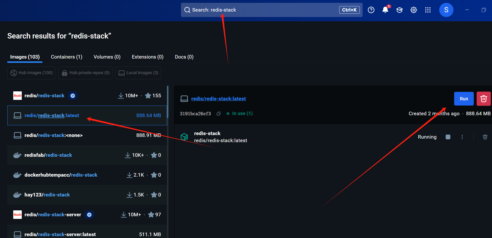

或者使用docker命令进行下载

```plain
# 需要下载 Redis-stack，需要在命令行中执行下面命令
docker run -d --name redis-stack -p 6379:6379 -p 8001:8001 redis/redis-stack:latest
# 在docker中进入redis命令
docker exec -it redis-stack redis-cli
# 清除所有redis缓存
FLUSHALL
```

```plain
pip install llama_index.storage.kvstore.redis
```

可以使用远程存储来用于缓存管道

+ `RedisCache`
+ `MongoDBCache`
+ `FirestoreCache`

使用Redis来存储

```plain
# from llama_index.core.node_parser import SentenceSplitter
# from llama_index.core.extractors import TitleExtractor
# from llama_index.core.ingestion import IngestionPipeline, IngestionCache
# from llama_index.storage.kvstore.redis import RedisKVStore as RedisCache
# from llama_index.core import SimpleDirectoryReader
# from llama_index.embeddings.huggingface import HuggingFaceEmbedding
# from llama_index.llms.dashscope import DashScope
# from dotenv import load_dotenv
# import redis
# import os
#
# load_dotenv()
# model = "qwen3-max"
# api_key = os.getenv("DASHSCOPE_API_KEY")
# api_base_url = os.getenv("DASHSCOPE_BASE_URL")
#
# # LlamaIndex默认使用的大模型被替换为百炼
# Settings.llm = DashScope(model=model, api_key=api_key, api_base=api_base_url, is_chat_model=True)
#
# # 加载本地的嵌入模型
# embed_model = HuggingFaceEmbedding(model_name="D:\\llm\\Local_model\\BAAI\\bge-large-zh-v1___5")
# # 设置默认的向量模型为本地模型
# Settings.embed_model = embed_model
#
# # 定义数据连接器去读取数据
# documents = SimpleDirectoryReader(input_files=["../data/小说.txt"]).load_data()
#
# ingest_cache = IngestionCache(
#     cache=RedisCache.from_redis_client(redis.Redis(
#         host="127.0.0.1",
#         port=6379,
#         decode_responses=True,
#         charset="utf-8",
#         encoding="utf-8"
#     )),
#     collection="my_test_cache",
# )
#
# pipeline = IngestionPipeline(
#     transformations=[
#         SentenceSplitter(chunk_size=250, chunk_overlap=50),
#         TitleExtractor(),
#         embed_model,
#     ],
#     cache=ingest_cache,
# )
#
# # 直接将数据摄取到向量数据库
# pipeline.run(documents=documents)
#
# # 加载和恢复状态
# new_pipeline = IngestionPipeline(
#     transformations=[
#         SentenceSplitter(chunk_size=250, chunk_overlap=50),
#         TitleExtractor(),
#         embed_model,
#     ],
#     cache=ingest_cache,
# )
#
# # 由于缓存的存在会立即执行
# nodes = new_pipeline.run(documents=documents)
#
# print(nodes)
# for node in nodes:
#     print(node, "\n\n")


print("----------------------直接查询 Redis 数据库----------------------")
import redis

redis_client = redis.Redis(host='127.0.0.1', port=6379, decode_responses=True, charset="utf-8")

# 查看所有 keys
all_keys = redis_client.keys("*doc:95b63a3f-ac9f-487d-a450-38823febad0e*")
print(f"Redis 中的所有相关 keys: {len(all_keys)} 个")

# 查看前几个 key 的内容
for key in all_keys[:3]:
    value = redis_client.hgetall(key)
    print(f"Key: {key}")
    for k, v in value.items():
        # 将存储的内容进行转义
        print(f"Value: {v.encode('utf-8').decode('unicode_escape')}")
    print("-" * 30)
```

#### 文档管理
将 `docstore` 连接到摄取管道将启用文档管理

原理：存储doc_id对应文档哈希值，如果检测到重复的 `doc_id`，并且哈希值已更改，则会重新处理并更新文档。如果检测到重复的 `doc_id`，并且哈希值未更改，则跳过该节点。

注意：

如果我们不连接向量存储，我们只能检查和跳过重复的输入。

如果连接了向量存储，我们还可以处理更新

```python
from llama_index.core import SimpleDirectoryReader
from llama_index.embeddings.huggingface import HuggingFaceEmbedding
from llama_index.core.ingestion import IngestionPipeline
from llama_index.core.storage.docstore import SimpleDocumentStore
from llama_index.core.node_parser import SentenceSplitter

# 读取指定文档
documents = SimpleDirectoryReader("../data1", filename_as_id=True).load_data()
# 创建摄取管道
pipeline = IngestionPipeline(
    transformations=[
        SentenceSplitter(),
        HuggingFaceEmbedding(model_name="D:\\llm\\Local_model\\BAAI\\bge-large-zh-v1___5"),
    ],
    # 添加文档管理
    docstore=SimpleDocumentStore(),
)
# 执行管道
nodes = pipeline.run(documents=documents)

print(f"Ingested {len(nodes)} Nodes")

# 存储本地缓存
pipeline.persist("./pipeline_storage")
# 在加载文件之前，创建一个新的文件
with open('../data1/t4.txt', 'w', encoding='utf-8') as f:
    f.write("这是测试文件3")

# 加载文件
documents1 = SimpleDirectoryReader("../data1", filename_as_id=True).load_data()

# 创建新的摄取管道
pipeline1 = IngestionPipeline(
    transformations=[
        SentenceSplitter(),  # 句子拆分器
        HuggingFaceEmbedding(model_name="D:\\llm\\Local_model\\BAAI\\bge-large-zh-v1___5"),  # Hugging Face嵌入模型
    ])
# 恢复管道
pipeline1.load("./pipeline_storage")

nodes = pipeline1.run(documents=documents1)

print(f"Ingested {len(nodes)} Nodes")
```

最后使用Redis作为向量存储和缓存、文档存储

```plain
pip install llama-index-storage-docstore-redis
pip install llama-index-vector-stores-redis
pip install llama-index-embeddings-huggingface
```

```python
from llama_index.core import SimpleDirectoryReader, Settings
from llama_index.embeddings.huggingface import HuggingFaceEmbedding
from llama_index.core.ingestion import (
    DocstoreStrategy,
    IngestionPipeline,
    IngestionCache, )
from llama_index.storage.kvstore.redis import RedisKVStore as RedisCache
from llama_index.storage.docstore.redis import RedisDocumentStore
from llama_index.core.node_parser import SentenceSplitter
from llama_index.vector_stores.redis import RedisVectorStore
from llama_index.core import VectorStoreIndex
from redisvl.schema import IndexSchema
from llama_index.llms.dashscope import DashScope
from dotenv import load_dotenv
import os

load_dotenv()
model = "qwen-turbo"
api_key = os.getenv("DASHSCOPE_API_KEY")
api_base_url = os.getenv("DASHSCOPE_BASE_URL")

# LlamaIndex默认使用的大模型被替换为百炼
Settings.llm = DashScope(model_name=model, api_key=api_key, api_base=api_base_url, is_chat_model=True)

# 加载本地的嵌入模型
embed_model = HuggingFaceEmbedding(model_name="D:\\llm\\Local_model\\BAAI\\bge-large-zh-v1___5")
# 设置默认的向量模型为本地模型
Settings.embed_model = embed_model

# 创建测试数据，先创建文件夹test_redis_data
with open('../test_redis_data/测试1.txt', 'w', encoding='utf-8') as f:
    f.write("这是第一个测试文件：测试1")
with open('../test_redis_data/test二.txt', 'w', encoding='utf-8') as f:
    f.write("这是第二个测试文件：测试二")
# 加载文档
documents = SimpleDirectoryReader("../test_redis_data", filename_as_id=True).load_data()
# 设置向量存储的规则
custom_schema = IndexSchema.from_dict(
    {
        "index": {"name": "redis_vector_store", "prefix": "doc"},
        # 自定义被索引的字段
        "fields": [
            # llamaIndex的必填字段
            {"type": "tag", "name": "id"},
            {"type": "tag", "name": "doc_id"},
            {"type": "text", "name": "text"},
            {
                "type": "vector",
                "name": "vector",
                "attrs": {
                    "dims": 1024,  # 向量维度
                    "algorithm": "hnsw",  # 算法
                    "distance_metric": "cosine",  # 相似度计算：余弦
                },
            },
        ],
    }
)
# 创建管道
pipeline = IngestionPipeline(
    transformations=[
        SentenceSplitter(),
        embed_model,
    ],
    # 设置文档管理
    docstore=RedisDocumentStore.from_host_and_port(
        "localhost", 6379, namespace="document_store"
    ),
    # 设置向量存储
    vector_store=RedisVectorStore(
        schema=custom_schema,
        redis_url="redis://localhost:6379",
    ),
    # 设置缓存
    cache=IngestionCache(
        cache=RedisCache.from_host_and_port("localhost", 6379),
        collection="redis_cache",
    ),
    # 设置文档的删除更新策略
    docstore_strategy=DocstoreStrategy.UPSERTS
)
# 执行管道
nodes = pipeline.run(documents=documents)
print(f"Ingested {len(nodes)} Nodes")

# 创建索引
index = VectorStoreIndex.from_vector_store(
    pipeline.vector_store, embed_model=embed_model
)

print(
    index.as_query_engine(similarity_top_k=10).query(
        "你看到了哪几个文件?"
    )
)
```

## 索引
`索引` 是一种数据结构，允许我们快速检索用户查询的相关内容。对于 LlamaIndex 来说，它是检索增强生成（RAG）用例的核心基础。

在高层次上，`索引` 是从文档构建的。它们用于构建查询引擎和聊天引擎，从而实现对数据的问答和聊天功能。

在底层，`索引` 将数据存储在`节点`对象中（代表原始文档的块），并公开了一个检索器接口，支持额外的配置和自动化。

目前最常见的索引是`VectorStoreIndex`；

### 向量存储索引
把文本变成“数学向量”，通过**计算相似度**快速找到相关内容，就像用“语义搜索引擎”代替“Ctrl+F关键词搜索”。

#### 将数据加载至索引中
基本用法：使用 Vector Store 的最简单方法是使用 `from_documents` 加载一组文档并从中构建索引。

```plain
from llama_index.core import VectorStoreIndex, SimpleDirectoryReader, Settings
from llama_index.embeddings.huggingface import HuggingFaceEmbedding
from llama_index.llms.dashscope import DashScope
from dotenv import load_dotenv
import os

load_dotenv()
model = "qwen-turbo"
api_key = os.getenv("DASHSCOPE_API_KEY")
api_base_url = os.getenv("DASHSCOPE_BASE_URL")

# LlamaIndex默认使用的大模型被替换为百炼
Settings.llm = DashScope(model_name=model, api_key=api_key, api_base=api_base_url, is_chat_model=True)

# 加载本地的嵌入模型
embed_model = HuggingFaceEmbedding(model_name="D:\\llm\\Local_model\\BAAI\\bge-large-zh-v1___5")
# 设置默认的向量模型为本地模型
Settings.embed_model = embed_model

# 加载文档并构建索引
documents = SimpleDirectoryReader(
    input_files=["../../data/deepseek介绍.txt"]
).load_data()

# 当使用 from_documents 时，您的文档将被分成块，并解析为Node 对象，这些对象是文本字符串的轻量级抽象，用于跟踪元数据和关系。
index = VectorStoreIndex.from_documents(documents, show_progress=True)
print(index.as_retriever().retrieve("deepseek的公司收益？"))
```

默认情况下，`VectorStoreIndex` 将以 2048 个节点一批生成并插入向量。如果您受到内存限制（或者内存有剩余），您可以通过传递 `insert_batch_size=2048` 和您期望的批量大小来修改此设置。

当您插入到远程托管的向量数据库时，这一点尤其有帮助。

使用摄入管道创建节点索引：

如果希望更多地控制文档的索引方式，建议使用摄入管道。这允许自定义节点的分块、元数据和嵌入。

```python
from llama_index.core.node_parser import SentenceSplitter
from llama_index.core.extractors import TitleExtractor
from llama_index.core.ingestion import IngestionPipeline
from llama_index.core import VectorStoreIndex, SimpleDirectoryReader, Settings
from llama_index.embeddings.huggingface import HuggingFaceEmbedding
from llama_index.llms.dashscope import DashScope
from dotenv import load_dotenv
import os

load_dotenv()
model = "qwen-turbo"
api_key = os.getenv("DASHSCOPE_API_KEY")
api_base_url = os.getenv("DASHSCOPE_BASE_URL")

# LlamaIndex默认使用的大模型被替换为百炼
Settings.llm = DashScope(model_name=model, api_key=api_key, api_base=api_base_url, is_chat_model=True)

# 加载本地的嵌入模型
embed_model = HuggingFaceEmbedding(model_name="D:\\llm\\Local_model\\BAAI\\bge-large-zh-v1___5")
# 设置默认的向量模型为本地模型
Settings.embed_model = embed_model

# 加载文档并构建索引
documents = SimpleDirectoryReader(
    input_files=["../../data/deepseek介绍.txt"]
).load_data()

# 使用转换创建管道
pipeline = IngestionPipeline(
    transformations=[
        SentenceSplitter(chunk_size=250, chunk_overlap=50),
        TitleExtractor(),
        embed_model,
    ]
)

# 运行管道
nodes = pipeline.run(documents=documents)

# 当使用 from_documents 时，您的文档将被分成块，并解析为Node 对象，这些对象是文本字符串的轻量级抽象，用于跟踪元数据和关系。
index = VectorStoreIndex(nodes, show_progress=True)
print(index.as_retriever().retrieve("deepseek的公司收益？"))
```

#### 存储向量索引
LlamaIndex 支持[数十种向量存储](https://www.aidoczh.com/llamaindex/module_guides/storing/vector_stores/)。您可以通过传递 `StorageContext` 来指定要使用的向量存储，然后在其中指定 `vector_store` 参数，就像在以下使用 chroma 的示例中一样：

```plain
pip install llama-index-vector-stores-chroma
```

```python
from llama_index.vector_stores.chroma import ChromaVectorStore
from llama_index.core.node_parser import SentenceSplitter
from llama_index.core.extractors import TitleExtractor
from llama_index.core.ingestion import IngestionPipeline
from llama_index.core import VectorStoreIndex, SimpleDirectoryReader, Settings, StorageContext
import chromadb
from llama_index.embeddings.huggingface import HuggingFaceEmbedding
from llama_index.llms.dashscope import DashScope
from dotenv import load_dotenv
import os

load_dotenv()
model = "qwen3-max"
api_key = os.getenv("DASHSCOPE_API_KEY")
api_base_url = os.getenv("DASHSCOPE_BASE_URL")

# LlamaIndex默认使用的大模型被替换为百炼
Settings.llm = DashScope(model=model, api_key=api_key, api_base=api_base_url, is_chat_model=True)

# 加载本地的嵌入模型
embed_model = HuggingFaceEmbedding(model_name=r"D:\\llm\\Local_model\\BAAI\\bge-large-zh-v1___5")
# 设置默认的向量模型为本地模型
Settings.embed_model = embed_model

# 定义本地化的向量化
chroma_client = chromadb.PersistentClient()
chroma_collection = chroma_client.get_or_create_collection("quickstart")
# 创建Chroma向量数据库对象
vector_store = ChromaVectorStore(chroma_collection=chroma_collection)

# 构建向量存储并自定义存储上下文
storage_context = StorageContext.from_defaults(
    vector_store=vector_store
)
# 加载文档并构建索引
documents = SimpleDirectoryReader(
    input_files=["../../data/deepseek介绍.txt"]
).load_data()

# 使用转换创建管道
pipeline = IngestionPipeline(
    transformations=[
        SentenceSplitter(chunk_size=250, chunk_overlap=50),
        TitleExtractor(),
        embed_model
    ],
    vector_store=vector_store,
)

# 运行管道
nodes = pipeline.run(documents=documents)
# 使用向量索引去进行存储
# index = VectorStoreIndex.from_documents(documents, show_progress=True, storage_context=storage_context)
# 可以使用摄取管道的方式去将向量存储和加载
index = VectorStoreIndex.from_vector_store(vector_store)
print(index.as_retriever().retrieve("deepseek的公司收益？"))
```

### 属性图索引
属性图索引(Property Graph Index)是一种基于图结构的高级索引技术，它将文档内容表示为具有属性的节点和边的图形结构。

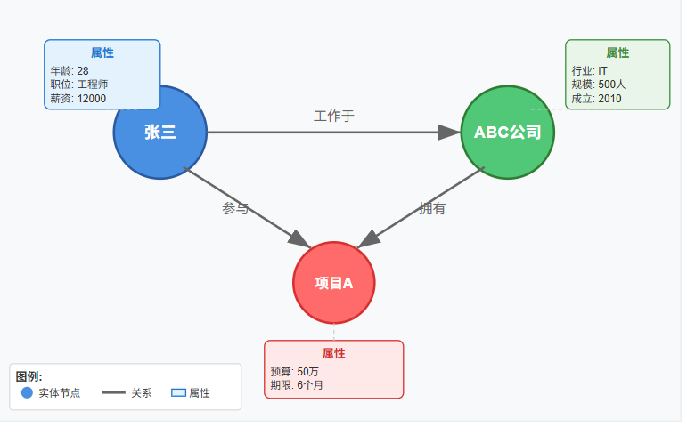

#### **基本概念：**
**属性图索引**将传统的文档检索转换为图数据库的形式：

+ **节点(Nodes)**: 就是图中的“实体”或“对象”，可以是人、事、物、地点、概念等
+ **边(Edges)**: 连接两个节点之间的线，表示它们之间的关系
+ **属性(Properties)**: 给节点或边加上一些“描述性信息”，也就是“特点”或“细节”。

#### 工作原理
属性图索引的构建过程包括：

+ **实体抽取**: 使用NLP技术从文档中识别命名实体（人名、地名、组织等）
+ **关系提取**: 分析实体之间的语义关系，如"工作于"、"位于"、"属于"等
+ **图构建**: 将实体作为节点，关系作为边，构建属性图
+ **索引优化**: 为图结构创建高效的查询索引

#### 提取器
简单使用：

```plain
from llama_index.core import PropertyGraphIndex
from llama_index.core import SimpleDirectoryReader
from LlamaIndex.加载模型 import get_llm

llm, embed_model = get_llm()

# 加载文档并构建索引
documents = SimpleDirectoryReader(
    input_files=["../../data/小说.txt"]
).load_data()

# 创建属性图
index = PropertyGraphIndex.from_documents(
    documents,
)

# 使用
retriever = index.as_retriever(
    include_text=True,  # 包括与匹配路径的源块
    similarity_top_k=2,  # 向量 kg 节点检索的前 k 个
)
nodes = retriever.retrieve("萧炎的斗之力是多少？")
print(nodes)
query_engine = index.as_query_engine(
    include_text=False,  # 包括与匹配路径的源块
    similarity_top_k=3,  # 向量 kg 节点检索的前 k 个
)
response = query_engine.query("萧炎的斗之力是多少？")
print("-" * 20)
print(response)
```

属性图索引提供了几种从数据中提取知识图谱的方法

1. `SimpleLLMPathExtractor`提取器（默认）

使用LLM提取简短语句和解析格式为（实体1，关系，实体2；三元组）

```plain
from typing import List

from llama_index.core.indices.property_graph import SimpleLLMPathExtractor
from llama_index.core import PropertyGraphIndex
from llama_index.core import SimpleDirectoryReader
from LlamaIndex.加载模型 import get_llm

llm, embed_model = get_llm()

# 加载文档并构建索引
documents = SimpleDirectoryReader(
    input_files=["../../data/小说.txt"]
).load_data()

# 创建提取规则
kg_extractor = SimpleLLMPathExtractor(
     llm=llm,
     max_paths_per_chunk=10,  # 控制从每个文档块(chunk)中最多提取多少条路径
     num_workers=4,  # 并行数量
)

print("kg_extractor->", kg_extractor)

# 创建属性图
index = PropertyGraphIndex.from_documents(
    documents,
    # 更新之后的使用
    kg_extractors=[kg_extractor],
    show_progress=True  # 显示提取进度
)
# 查看结果
response = index.property_graph_store.get_triplets(entity_names=["萧炎"])
print("response->", response)
```

自定义提示和用于解析路径的函数

```plain
from typing import List

from llama_index.core.indices.property_graph import SimpleLLMPathExtractor
from llama_index.core import PropertyGraphIndex
from llama_index.core import SimpleDirectoryReader
from LlamaIndex.加载模型 import get_llm

llm, embed_model = get_llm()

# 加载文档并构建索引
documents = SimpleDirectoryReader(
    input_files=["../../data/小说.txt"]
).load_data()

prompt = """从以下文本中提取实体和它们之间的关系。
            请按照以下格式输出，每行一个关系：
            实体1|关系|实体2
        
            文本: {text}
        
            提取的关系:
        """


def parse_function(llm_output: str) -> List[List[str]]:
    """
    基础解析函数 - 解析简单的三元组格式
    输入: "实体1|关系|实体2" 格式的文本
    输出: [["实体1", "关系", "实体2"], ...] 格式的列表
    """
    paths = []
    lines = llm_output.strip().split('\n')

    for line in lines:
        line = line.strip()
        if not line or line.startswith('#'):
            continue

        # 分割实体和关系
        parts = line.split('|')
        if len(parts) == 3:
            entity1, relation, entity2 = [part.strip() for part in parts]
            if entity1 and relation and entity2:
                paths.append([entity1, relation, entity2])

    return paths


kg_extractor = SimpleLLMPathExtractor(
    llm=llm,
    extract_prompt=prompt,
    parse_fn=parse_function,
)

print("kg_extractor->", kg_extractor)

# 创建属性图
index = PropertyGraphIndex.from_documents(
    documents,
    kg_extractors=[kg_extractor],
    show_progress=True  # 显示提取进度
)
# 查看结果
response = index.property_graph_store.get_triplets(entity_names=["萧炎"])
print("response->", response)
```

1. `ImplicitPathExtractor`提取器（默认）

使用每个 llama-index 节点对象上的 `node.relationships` 属性提取对应的关系。

由于它仅解析已存在于 llama-index 节点对象上的属性，因此此提取器无需运行 LLM 或嵌入模型。

会提取节点关系中的【上一个、下一个、父节点、子节点、原文档】

```plain
from llama_index.core.indices.property_graph import ImplicitPathExtractor
from llama_index.core import SimpleDirectoryReader
from llama_index.core.node_parser import SentenceSplitter

from LlamaIndex.加载模型 import get_llm

llm, embed_model = get_llm()

# 加载文档并构建索引
documents = SimpleDirectoryReader(
    input_files=["../../data/小说.txt"]
).load_data()

s = SentenceSplitter()
nodes = s.get_nodes_from_documents(documents)


kg_extractor = ImplicitPathExtractor()

extracted_nodes = kg_extractor(nodes)
for node in extracted_nodes:
    print("节点文本：", node.text)
    print("提取的关系：", node.metadata.get("relations", []))
```

1. `SchemaLLMPathExtractor` 提取器

 在schema中定义允许的实体类型、关系类型以及它们之间的联系。LLM将只抽取符合此schema的图数据。

qwen模型对应提取实体关系效果不好，所以使用deepseek

```plain
def get_deepseek_llm(model: str = "deepseek-chat"):
    api_key = os.getenv("DEEPSEEK_API_KEY")
    api_base_url = os.getenv("DEEPSEEK_BASE_URL")

    # LlamaIndex默认使用的大模型被替换为百炼
    llm = DeepSeek(model=model, api_key=api_key, api_base=api_base_url, is_chat_model=True)
    Settings.llm = llm

    # 加载本地的嵌入模型
    embed_model = HuggingFaceEmbedding(model_name=r"D:\llm\Local_model\BAAI\bge-small-zh-v1___5",
                                       device=device, embed_batch_size=2)
    # 设置默认的向量模型为本地模型
    Settings.embed_model = embed_model

    return llm, embed_model
```

```plain
from llama_index.core.indices.property_graph import SchemaLLMPathExtractor
from llama_index.core.indices.property_graph import LLMSynonymRetriever
from llama_index.core import PromptTemplate
from llama_index.core import PropertyGraphIndex
from llama_index.core import Document
from typing import Literal
from LlamaIndex.加载模型 import get_deepseek_llm

llm, embed_model = get_deepseek_llm()
# 定义提取模式
doc = [
    Document(
        text="张伟是北京大学的教授，研究方向是人工智能。他是李娜的博士导师，李娜现在在阿里巴巴达摩院从事自然语言处理相关的工作。王强是李娜的同事，"
             "他们一起参与了一个关于大模型推理的项目。"),
    Document(
        text="张伟教授发表了多篇关于深度学习的论文，他的研究团队包括3名博士生和5名硕士生。张伟教授在北京大学人工智能学院任教，专注于计算机视觉研究。"
    ),
    Document(
        text="李娜在阿里巴巴的项目涉及多模态AI，她和王强共同负责模型优化部分。李娜从北京大学获得了人工智能专业的博士学位。"
    ),
    Document(
        text="北京大学人工智能学院与阿里巴巴达摩院建立了合作关系，共同推进AI技术发展。双方在深度学习和自然语言处理领域开展深度合作。"
    ),
    Document(
        text="王强之前在腾讯工作，后来跳槽到阿里巴巴，专注于大模型推理加速技术。王强拥有清华大学计算机科学硕士学位。"
    ),
    Document(
        text="张伟教授的研究领域还包括计算机视觉和强化学习，他指导的学生分布在各大科技公司。他领导的AI实验室在国际会议上发表了超过50篇论文。",
    )
]

# 定义提取模式
entities = Literal["Person", "Location", "Organization", "Product", "Event"]
relations = Literal[
    "SUPPLIER_OF",
    "COMPETITOR",
    "PARTNERSHIP",
    "ACQUISITION",
    "WORKS_AT",
    "SUBSIDIARY",
    "BOARD_MEMBER",
    "CEO",
    "PROVIDES",
    "HAS_EVENT",
    "IN_LOCATION",
]
# 定义更详细的图谱模式
schema = {
    "Person": ["WORKS_AT", "BOARD_MEMBER", "CEO", "HAS_EVENT"],
    "Organization": [
        "SUPPLIER_OF",
        "COMPETITOR",
        "PARTNERSHIP",
        "ACQUISITION",
        "WORKS_AT",
        "SUBSIDIARY",
        "BOARD_MEMBER",
        "CEO",
        "PROVIDES",
        "HAS_EVENT",
        "IN_LOCATION",
    ],
    "Product": ["PROVIDES"],
    "Event": ["HAS_EVENT", "IN_LOCATION"],
    "Location": ["HAPPENED_AT", "IN_LOCATION"],
}
zh_extract_prompt_str = """
你是一个专业的知识图谱提取助手。你的任务是从给定的文本中提取结构化的三元组（主体-关系-客体）。

### 严格约束条件 (Schema)
1. **允许的实体类型**: {allowed_entity_types}
2. **允许的关系类型**: {allowed_relation_types}

### 关键规则 (必须严格遵守)
- **禁止造词**：提取出的 `type` 必须严格完全匹配上述列表中的英文单词。
- **自动归类**：如果文本中出现了列表之外的具体概念，请将其归类为列表中最接近的父类。
    - 例如：如果允许列表只有 "Organization"，但文本提到 "University" 或 "Company"，你必须输出 "Organization"。
- **关系归一化**：如果文本中的动词不在列表中，请映射为含义最接近的允许关系。
    - 例如：如果允许列表只有 "work_in"，但文本提到 "works at" 或 "employed by"，你必须输出 "work_in"。
- **格式要求**：仅输出标准的 JSON 格式，不要包含任何解释性文字。

### 示例 (Few-Shot)
文本: "张伟在北京大学任教。"
允许实体: ["Person", "Organization"]
允许关系: ["work_in"]
思考过程: "北京大学"是大学，属于 "Organization"。"任教"意味着在某处工作，映射为 "work_in"。
输出: {{ "triplets": [ {{ "subject": {{ "name": "张伟", "type": "Person" }}, "relation": {{ "type": "work_in" }}, "object": {{ "name": "北京大学", "type": "Organization" }} }} ] }}

### 开始任务
文本: {text}
输出:
"""

# 创建基于模式的提取器
kg_extractor = SchemaLLMPathExtractor(
    extract_prompt=PromptTemplate(zh_extract_prompt_str),
    llm=llm,
    possible_entities=entities,
    possible_relations=relations,
    kg_validation_schema=schema,
    strict=False,  # 如果为 false，将允许超出模式范围的三元组
    num_workers=4,  # 并行处理
)

# 创建属性图
index = PropertyGraphIndex.from_documents(
    doc,
    llm=llm,
    embed_model=embed_model,
    kg_extractors=[kg_extractor],
    show_progress=True  # 显示提取进度
)
# print(index.property_graph_store.get_triplets(["张伟"]))
```

#### 检索和查询
属性图可以通过多种方式查询，以检索节点和路径。在 LlamaIndex 中，我们可以同时组合多种节点检索方法！

1. `LLMSynonymRetriever`检索器

用于**改进查询语义匹配能力**的检索组件，它通过大语言模型（LLM）生成原始查询的同义改写（synonym queries），从而提升召回质量。

```plain
from llama_index.core.indices.property_graph import SchemaLLMPathExtractor
from llama_index.core.indices.property_graph import LLMSynonymRetriever
from llama_index.core import PromptTemplate
from llama_index.core import PropertyGraphIndex
from llama_index.core import Document
from typing import Literal
from LlamaIndex.加载模型 import get_deepseek_llm

llm, embed_model = get_deepseek_llm()
# 定义提取模式
doc = [
    Document(
        text="张伟是北京大学的教授，研究方向是人工智能。他是李娜的博士导师，李娜现在在阿里巴巴达摩院从事自然语言处理相关的工作。王强是李娜的同事，"
             "他们一起参与了一个关于大模型推理的项目。"),
    Document(
        text="张伟教授发表了多篇关于深度学习的论文，他的研究团队包括3名博士生和5名硕士生。张伟教授在北京大学人工智能学院任教，专注于计算机视觉研究。"
    ),
    Document(
        text="李娜在阿里巴巴的项目涉及多模态AI，她和王强共同负责模型优化部分。李娜从北京大学获得了人工智能专业的博士学位。"
    ),
    Document(
        text="北京大学人工智能学院与阿里巴巴达摩院建立了合作关系，共同推进AI技术发展。双方在深度学习和自然语言处理领域开展深度合作。"
    ),
    Document(
        text="王强之前在腾讯工作，后来跳槽到阿里巴巴，专注于大模型推理加速技术。王强拥有清华大学计算机科学硕士学位。"
    ),
    Document(
        text="张伟教授的研究领域还包括计算机视觉和强化学习，他指导的学生分布在各大科技公司。他领导的AI实验室在国际会议上发表了超过50篇论文。",
    )
]

# 定义提取模式
entities = Literal["Person", "Location", "Organization", "Product", "Event"]
relations = Literal[
    "SUPPLIER_OF",
    "COMPETITOR",
    "PARTNERSHIP",
    "ACQUISITION",
    "WORKS_AT",
    "SUBSIDIARY",
    "BOARD_MEMBER",
    "CEO",
    "PROVIDES",
    "HAS_EVENT",
    "IN_LOCATION",
]
# 定义更详细的图谱模式
schema = {
    "Person": ["WORKS_AT", "BOARD_MEMBER", "CEO", "HAS_EVENT"],
    "Organization": [
        "SUPPLIER_OF",
        "COMPETITOR",
        "PARTNERSHIP",
        "ACQUISITION",
        "WORKS_AT",
        "SUBSIDIARY",
        "BOARD_MEMBER",
        "CEO",
        "PROVIDES",
        "HAS_EVENT",
        "IN_LOCATION",
    ],
    "Product": ["PROVIDES"],
    "Event": ["HAS_EVENT", "IN_LOCATION"],
    "Location": ["HAPPENED_AT", "IN_LOCATION"],
}
zh_extract_prompt_str = """
你是一个专业的知识图谱提取助手。你的任务是从给定的文本中提取结构化的三元组（主体-关系-客体）。

### 严格约束条件 (Schema)
1. **允许的实体类型**: {allowed_entity_types}
2. **允许的关系类型**: {allowed_relation_types}

### 关键规则 (必须严格遵守)
- **禁止造词**：提取出的 `type` 必须严格完全匹配上述列表中的英文单词。
- **自动归类**：如果文本中出现了列表之外的具体概念，请将其归类为列表中最接近的父类。
    - 例如：如果允许列表只有 "Organization"，但文本提到 "University" 或 "Company"，你必须输出 "Organization"。
- **关系归一化**：如果文本中的动词不在列表中，请映射为含义最接近的允许关系。
    - 例如：如果允许列表只有 "work_in"，但文本提到 "works at" 或 "employed by"，你必须输出 "work_in"。
- **格式要求**：仅输出标准的 JSON 格式，不要包含任何解释性文字。

### 示例 (Few-Shot)
文本: "张伟在北京大学任教。"
允许实体: ["Person", "Organization"]
允许关系: ["work_in"]
思考过程: "北京大学"是大学，属于 "Organization"。"任教"意味着在某处工作，映射为 "work_in"。
输出: {{ "triplets": [ {{ "subject": {{ "name": "张伟", "type": "Person" }}, "relation": {{ "type": "work_in" }}, "object": {{ "name": "北京大学", "type": "Organization" }} }} ] }}

### 开始任务
文本: {text}
输出:
"""

# 创建基于模式的提取器
kg_extractor = SchemaLLMPathExtractor(
    extract_prompt=PromptTemplate(zh_extract_prompt_str),
    llm=llm,
    possible_entities=entities,
    possible_relations=relations,
    kg_validation_schema=schema,
    strict=False,  # 如果为 false，将允许超出模式范围的三元组
    num_workers=4,  # 并行处理
)

# 创建属性图
index = PropertyGraphIndex.from_documents(
    doc,
    llm=llm,
    embed_model=embed_model,
    kg_extractors=[kg_extractor],
    show_progress=True  # 显示提取进度
)
# print(index.property_graph_store.get_triplets(["张伟"]))

synonym_retriever = LLMSynonymRetriever(
    index.property_graph_store,
    # 包括检索路径的源块文本
    include_text=False,
    llm=llm,
    embed_model=embed_model,
    max_keywords=10,  # 要生成的同义词的数量
    # 节点检索后要遵循的关系深度
    path_depth=1,
)

retriever = index.as_retriever(sub_retrievers=[synonym_retriever])
print(retriever.retrieve("王强？"))
```

1. `VectorContextRetriever`检索器

根据它们的向量相似性检索节点，然后获取与这些节点连接的路径。

```plain
from llama_index.core.indices.property_graph import SchemaLLMPathExtractor
from llama_index.core.indices.property_graph import VectorContextRetriever
from llama_index.core import PromptTemplate
from llama_index.core.vector_stores import SimpleVectorStore
from llama_index.core import PropertyGraphIndex
from llama_index.core import Document
from typing import Literal
from LlamaIndex.加载模型 import get_deepseek_llm

llm, embed_model = get_deepseek_llm()

# 创建简单的内存向量存储
vec_store = SimpleVectorStore()
# 定义提取模式
doc = [
    Document(
        text="张伟是北京大学的教授，研究方向是人工智能。他是李娜的博士导师，李娜现在在阿里巴巴达摩院从事自然语言处理相关的工作。王强是李娜的同事，"
             "他们一起参与了一个关于大模型推理的项目。"),
    Document(
        text="张伟教授发表了多篇关于深度学习的论文，他的研究团队包括3名博士生和5名硕士生。张伟教授在北京大学人工智能学院任教，专注于计算机视觉研究。"
    ),
    Document(
        text="李娜在阿里巴巴的项目涉及多模态AI，她和王强共同负责模型优化部分。李娜从北京大学获得了人工智能专业的博士学位。"
    ),
    Document(
        text="北京大学人工智能学院与阿里巴巴达摩院建立了合作关系，共同推进AI技术发展。双方在深度学习和自然语言处理领域开展深度合作。"
    ),
    Document(
        text="王强之前在腾讯工作，后来跳槽到阿里巴巴，专注于大模型推理加速技术。王强拥有清华大学计算机科学硕士学位。"
    ),
    Document(
        text="张伟教授的研究领域还包括计算机视觉和强化学习，他指导的学生分布在各大科技公司。他领导的AI实验室在国际会议上发表了超过50篇论文。",
    )
]

# 定义提取模式
entities = Literal["Person", "Location", "Organization", "Product", "Event"]
relations = Literal[
    "SUPPLIER_OF",
    "COMPETITOR",
    "PARTNERSHIP",
    "ACQUISITION",
    "WORKS_AT",
    "SUBSIDIARY",
    "BOARD_MEMBER",
    "CEO",
    "PROVIDES",
    "HAS_EVENT",
    "IN_LOCATION",
]
# 定义更详细的图谱模式
schema = {
    "Person": ["WORKS_AT", "BOARD_MEMBER", "CEO", "HAS_EVENT"],
    "Organization": [
        "SUPPLIER_OF",
        "COMPETITOR",
        "PARTNERSHIP",
        "ACQUISITION",
        "WORKS_AT",
        "SUBSIDIARY",
        "BOARD_MEMBER",
        "CEO",
        "PROVIDES",
        "HAS_EVENT",
        "IN_LOCATION",
    ],
    "Product": ["PROVIDES"],
    "Event": ["HAS_EVENT", "IN_LOCATION"],
    "Location": ["HAPPENED_AT", "IN_LOCATION"],
}
zh_extract_prompt_str = """
你是一个专业的知识图谱提取助手。你的任务是从给定的文本中提取结构化的三元组（主体-关系-客体）。

### 严格约束条件 (Schema)
1. **允许的实体类型**: {allowed_entity_types}
2. **允许的关系类型**: {allowed_relation_types}

### 关键规则 (必须严格遵守)
- **禁止造词**：提取出的 `type` 必须严格完全匹配上述列表中的英文单词。
- **自动归类**：如果文本中出现了列表之外的具体概念，请将其归类为列表中最接近的父类。
    - 例如：如果允许列表只有 "Organization"，但文本提到 "University" 或 "Company"，你必须输出 "Organization"。
- **关系归一化**：如果文本中的动词不在列表中，请映射为含义最接近的允许关系。
    - 例如：如果允许列表只有 "work_in"，但文本提到 "works at" 或 "employed by"，你必须输出 "work_in"。
- **格式要求**：仅输出标准的 JSON 格式，不要包含任何解释性文字。

### 示例 (Few-Shot)
文本: "张伟在北京大学任教。"
允许实体: ["Person", "Organization"]
允许关系: ["work_in"]
思考过程: "北京大学"是大学，属于 "Organization"。"任教"意味着在某处工作，映射为 "work_in"。
输出: {{ "triplets": [ {{ "subject": {{ "name": "张伟", "type": "Person" }}, "relation": {{ "type": "work_in" }}, "object": {{ "name": "北京大学", "type": "Organization" }} }} ] }}

### 开始任务
文本: {text}
输出:
"""

# 创建基于模式的提取器
kg_extractor = SchemaLLMPathExtractor(
    extract_prompt=PromptTemplate(zh_extract_prompt_str),
    llm=llm,
    possible_entities=entities,
    possible_relations=relations,
    kg_validation_schema=schema,
    strict=False,  # 如果为 false，将允许超出模式范围的三元组
    num_workers=4,  # 并行处理
)

# 创建属性图
index = PropertyGraphIndex.from_documents(
    doc,
    llm=llm,
    embed_model=embed_model,
    kg_extractors=[kg_extractor],
    show_progress=True  # 显示提取进度
)
vector_retriever = VectorContextRetriever(
    index.property_graph_store,
    llm=llm,
    embed_model=embed_model,
    vector_store=vec_store,
    # 包括检索路径的源块文本
    include_text=False,
    # 要获取的节点数量
    similarity_top_k=2,
    # 节点检索后要遵循的关系深度
    path_depth=1,
)

retriever = index.as_retriever(sub_retrievers=[vector_retriever])
print(retriever.retrieve("张伟"))
```

### 路由索引
#### 为什么需要路由索引？
在实际应用中，我们经常面临以下挑战：

1. **多领域数据**：一个系统可能包含技术文档、用户手册、FAQ等不同类型的内容
2. **查询类型多样**：用户可能需要快速查找、深度分析或总结归纳
3. **性能要求**：不同查询需要不同的处理速度和精度平衡

#### 什么是路由索引？
路由索引（Router Index）是LlamaIndex中的一个核心概念，它充当"智能调度器"的角色，能够根据用户查询的内容和意图，自动选择最合适的索引或数据源进行处理。

**核心特点：**

+ 智能路由：基于查询内容自动选择处理策略
+ 多数据源整合：统一管理多个不同类型的数据集
+ 性能优化：将合适的查询路由到最优的处理引擎

```plain
用户查询 → 路由器分析 → 选择最佳索引 → 执行查询 → 返回结果
```

**关键组件：**

+ **选择器（Selector）**：分析查询并做出路由决策
+ **工具集（Tools）**：包装各种查询引擎的工具
+ **路由引擎（Router Engine）**：协调整个路由过程

#### 选择器类型
**LLMSingleSelector**

+ 使用大语言模型分析查询
+ 选择单一最佳索引
+ 适用于互斥的数据源

**LLMMultiSelector**

+ 可以选择多个索引
+ 合并多个结果
+ 适用于需要综合多方面信息的查询

**PydanticSingleSelector**

+ 基于结构化数据模型
+ 更稳定的选择逻辑
+ 适用于规则明确的路由场景

```plain
from llama_index.core.query_engine import RouterQueryEngine
from llama_index.core import VectorStoreIndex, SimpleDirectoryReader
from llama_index.core.selectors import LLMSingleSelector
from llama_index.core.tools import QueryEngineTool, ToolMetadata
from LlamaIndex.加载模型 import get_llm

# 加载模型
llm, embed_model = get_llm()


class EnterpriseKnowledgeBase:
    def __init__(self):
        self.router_engine = None
        self.setup_indexes()

    def setup_indexes(self):
        """设置各种索引"""
        # 1. 加载不同类型的文档
        # 技术文档
        tech_docs = SimpleDirectoryReader(input_files=["../../data/java_basics_manual.md"]).load_data()
        # 产品文档
        product_docs = SimpleDirectoryReader(
            input_files=["../../data/subdirectories/DeepSeek15天指导手册——从入门到精通.pdf"]).load_data()

        # 2. 创建向量索引
        tech_index = VectorStoreIndex.from_documents(tech_docs)
        product_index = VectorStoreIndex.from_documents(product_docs)

        # 3. 配置查询引擎
        tech_engine = tech_index.as_query_engine(
            similarity_top_k=3,
            response_mode="compact"
        )
        product_engine = product_index.as_query_engine(
            similarity_top_k=5,
            response_mode="tree_summarize"
        )

        # 4. 创建工具集
        query_tools = [
            QueryEngineTool(
                query_engine=tech_engine,
                metadata=ToolMetadata(
                    name="technical_docs",
                    description=(
                        "java基础技术文档库，包含基本语法、数据类型和变量、运算符、"
                        "控制结构、面向对象。适合回答编程、架构、异常处理等"
                    )
                )
            ),
            QueryEngineTool(
                query_engine=product_engine,
                metadata=ToolMetadata(
                    name="product_manual",
                    description=(
                        "包含对应deepseek的简单使用，基础对话篇"
                        "新⼿必学的10个魔法指令、效率⻜跃篇、场景实战篇等"
                    )
                )
            )
        ]

        # 5. 创建路由查询引擎
        self.router_engine = RouterQueryEngine(
            selector=LLMSingleSelector.from_defaults(),
            query_engine_tools=query_tools,
            verbose=True  # 开启详细日志
        )

    def query(self, question: str):
        """执行查询"""
        if not self.router_engine:
            raise ValueError("知识库未初始化")

        print(f"查询问题: {question}")
        print("-" * 50)

        response = self.router_engine.query(question)

        print(f"回答: {response}")
        print("=" * 50)

        return response


# 使用示例
def main():
    # 初始化知识库
    kb = EnterpriseKnowledgeBase()

    # 测试不同类型的查询
    test_queries = [
        "java的循环语句有哪些",
        "Java的特点？",
        "deepseek中的有效提问的五个⻩⾦法则？",
    ]

    for query in test_queries:
        kb.query(query)
        print()


if __name__ == "__main__":
    main()
```

### 文件管理
大多数的索引结构都允许进行插入、删除、更新和刷新操作

#### 插入
在初始化索引后，您可以将新文档“插入”到任何索引数据结构中。该文档将被拆分为节点并注入到索引中。

插入背后的机制取决于索引结构。例如，对于摘要索引，将新文档作为列表中的额外节点插入。对于向量存储索引，将新文档（和嵌入）插入到底层的文档/嵌入存储中。

```plain
from llama_index.core import SummaryIndex, Document
from LlamaIndex.加载模型 import get_llm

get_llm()

# 准备示例文档数据
documents = [
    Document(text="""
    人工智能（AI）是计算机科学的一个分支，致力于创建能够执行通常需要人类智能的任务的智能机器。
    AI 包括机器学习、深度学习、自然语言处理等多个子领域。
    机器学习是 AI 的核心技术之一，通过算法让计算机从数据中学习模式。
    """),

    Document(text
    ="""
    深度学习是机器学习的一个子集，使用人工神经网络来模拟人脑的工作方式。
    深度学习在图像识别、语音识别和自然语言处理方面取得了突破性进展。
    卷积神经网络（CNN）特别适合处理图像数据，循环神经网络（RNN）适合处理序列数据。
    """),

    Document(text="""
    自然语言处理（NLP）是 AI 的一个重要分支，专注于让计算机理解和生成人类语言。
    NLP 的应用包括机器翻译、情感分析、文本摘要和问答系统。
    现代 NLP 系统大多基于 Transformer 架构，如 GPT 和 BERT 模型。
    """)
]
# 创建 SummaryIndex
summary_index = SummaryIndex.from_documents(documents)

# 4. 执行查询
print("\n=== 执行查询 ===")

# 查询 1: 总体概述
print("查询 1: 什么是人工智能？")
response1 = summary_index.as_query_engine().query("什么是人工智能，包括哪些主要技术？")
print(f"回答: {response1}")

print("\n" + "="*50 + "\n")

# 查询 2: 特定技术
print("查询 2: 深度学习的应用领域")
response2 = summary_index.as_query_engine().query("深度学习在哪些领域有应用？")
print(f"回答: {response2}")

print("\n" + "="*50 + "\n")

# 查询 3: 技术对比
print("查询 3: 不同 AI 技术的关系")
response3 = summary_index.as_query_engine().query("机器学习、深度学习和自然语言处理之间的关系是什么？")
print(f"回答: {response3}")

# 查看索引结构信息
print("\n=== 索引结构信息 ===")
print(f"文档数量: {len(summary_index.docstore.docs)}")
print(f"节点数量: {len(summary_index.index_struct.nodes)}")


print("\n=== 添加新文档 ===")
new_doc = Document(text="""
计算机视觉是人工智能的另一个重要分支，致力于让计算机能够识别和理解图像和视频。
计算机视觉的应用包括人脸识别、物体检测、图像分类和自动驾驶。
现代计算机视觉系统主要基于深度学习技术，特别是卷积神经网络。
""")

summary_index.insert(new_doc)
print("新文档已添加到索引")
print(f"更新后的文档数量: {len(summary_index.docstore.docs)}")

# 查询新添加的内容
print("\n查询新内容:")
response_new = summary_index.as_query_engine().query("计算机视觉有哪些应用？")
print(f"回答: {response_new}")
```

#### 删除
根据文档id去删除文档

```plain
from llama_index.core import SummaryIndex, Document

index = SummaryIndex([])
text_chunks = ["文档1", "文档2", "文档3"]

doc_chunks = []
for i, text in enumerate(text_chunks):
    doc = Document(text=text, id_=f"doc_id_{i}")
    doc_chunks.append(doc)

# 插入
for doc_chunk in doc_chunks:
    index.insert(doc_chunk)
# 删除
index.delete_ref_doc("doc_id_0", delete_from_docstore=True)
print(index.docstore.docs)
```

#### 更新
根据文档id去更新文档（先删除对应id的文档，再去新增一个文档）

```plain
from llama_index.core import SummaryIndex, Document

index = SummaryIndex([])
text_chunks = ["文档1", "文档2", "文档3"]

doc_chunks = []
for i, text in enumerate(text_chunks):
    doc = Document(text=text, id_=f"doc_id_{i}")
    doc_chunks.append(doc)

# 插入
for doc_chunk in doc_chunks:
    index.insert(doc_chunk)

print("更新前", index.docstore.docs)

# 更新
update_doc = Document(text="这是文档1", id_="doc_id_0")
index.update_ref_doc(update_doc)
print("更新后", index.docstore.docs)
```

#### 刷新
`refresh()` 函数将仅更新具有相同文档 `id_` 但文本内容不同的文档。任何根本不在索引中的文档也将被插入。

```plain
from llama_index.core import SummaryIndex, Document

index = SummaryIndex([])
text_chunks = ["文档1", "文档2", "文档3"]

doc_chunks = []
for i, text in enumerate(text_chunks):
    doc = Document(text=text, id_=f"doc_id_{i}")
    doc_chunks.append(doc)

# 插入
for doc_chunk in doc_chunks:
    index.insert(doc_chunk)

print("更新前", index.docstore.docs)

# 刷新
# 修改第一个文档的内容
doc_chunks[0] = Document(text="全新的文档1内容", id_="doc_id_0")
# 新增一个新的文档
doc_chunks.append(Document(text="这是一个新增的文档哦", id_="doc_id_3"))

# 开始更新
ref_doc = index.refresh_ref_docs(doc_chunks)
print(ref_doc)
print("更新后", index.docstore.docs)
```

### 元数据提取
在许多情况下，特别是对于长篇文档，一段文本可能缺乏必要的上下文来消除与其他类似文本的歧义。

为了解决这个问题，我们使用LLM（Large Language Models）来提取与文档相关的某些上下文信息，以更好地帮助检索和语言模型消除外观相似的段落。

```plain
from llama_index.core.node_parser import SentenceSplitter
from llama_index.core.extractors import (
    SummaryExtractor,
    QuestionsAnsweredExtractor,
    TitleExtractor,
    KeywordExtractor,
)
from llama_index.core.ingestion import IngestionPipeline
from llama_index.core import SimpleDirectoryReader
from LlamaIndex.加载模型 import get_llm

llm, embed_model = get_llm()

# 定义数据连接器去读取数据
documents = SimpleDirectoryReader(input_files=["../../data/小说.txt"]).load_data()

# 创建管道中转换组件
transformations = [
    SentenceSplitter(),
    TitleExtractor(nodes=5),
    QuestionsAnsweredExtractor(questions=3),
    SummaryExtractor(summaries=["prev", "self"]),
    KeywordExtractor(keywords=10)
]
# 创建摄取管道
pipeline = IngestionPipeline(transformations=transformations)

nodes = pipeline.run(documents=documents)

print(nodes)
```

## 存储
LlamaIndex 提供了多种存储功能，用于持久化保存索引、文档、嵌入向量和检索结果，以便后续复用而无需重新计算。

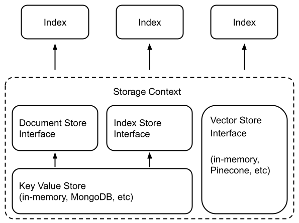

+ **文档存储**：存储摄取的文档（即`Node`对象）的位置，
+ **索引存储**：存储索引元数据的地方，
+ **向量存储**：存储嵌入向量的地方。
+ **属性图存储**：存储知识图的地方（即`PropertyGraphIndex`）。
+ **聊天存储**：存储和组织聊天信息的地方。

文档/索引存储依赖于通用的键值存储抽象，下面将详细介绍。

### 向量存储
```plain
# import
from llama_index.core import VectorStoreIndex, SimpleDirectoryReader
from llama_index.vector_stores.chroma import ChromaVectorStore
from llama_index.core.vector_stores import SimpleVectorStore
from llama_index.core import StorageContext, load_index_from_storage
from AI大模型Agent开发.加载模型 import get_llm
import chromadb

# 加载大模型和嵌入模型
llm, embed_model = get_llm()

# 加载文档
documents = SimpleDirectoryReader(input_files=["./data/小说.txt"]).load_data()

print("---------------使用chroma进行存储向量--------------------")
# 创建客户端和新的集合
# chroma_client = chromadb.EphemeralClient()  # 创建一个内存对象
chroma_client = chromadb.PersistentClient("./chroma_db")  # 创建一个本地存储的对象
# # get_or_create_collection当没有quickstart连接对象的时候会创建一个新的连接对象
# chroma_collection = chroma_client.get_or_create_collection("quickstart")
#
# # 设置ChromaVectorStore并加载数据
# vector_store = ChromaVectorStore(chroma_collection=chroma_collection)
# # 创建一个存储容器
# storage_context = StorageContext.from_defaults(vector_store=vector_store)
#
# # 创建向量索引
# index = VectorStoreIndex.from_documents(
#     documents, storage_context=storage_context, embed_model=embed_model
# )
# print(chroma_collection.count())
# # 查询数据
# query_engine = index.as_query_engine()
# response = query_engine.query("古河是谁？")
# print(response)
print("---------------使用chroma获取存储向量--------------------")
# chroma_collection_new = chroma_client.get_collection("quickstart")
# vector_store_new = ChromaVectorStore(chroma_collection=chroma_collection_new)
# storage_context_new= StorageContext.from_defaults(vector_store=vector_store_new)
# # 加载索引（只恢复索引结构，不重新写入）
# index_new = VectorStoreIndex.from_vector_store(
#     vector_store=vector_store_new,
#     storage_context=storage_context_new,
#     embed_model=embed_model  # 必须与原来用的一致
# )
#
# # 可以开始查询
# query_engine_new = index_new.as_query_engine()
# response = query_engine_new.query("萧炎的妹妹是谁？")
# print(response)
#
print("-------------------使用最基础的内存向量进行本地存储----------------------")
# 创建一个最基础的内存向量
vector_store = SimpleVectorStore()
# 创建一个存储容器
storage_context = StorageContext.from_defaults(vector_store=vector_store)

# 创建向量索引
index = VectorStoreIndex.from_documents(
    documents, storage_context=storage_context, embed_model=embed_model
)
# 查询数据
query_engine = index.as_query_engine()
response = query_engine.query("古河是谁？")
print(response)

# 将数据存储到本地
storage_context.persist("./storage")

# 从本地加载已存储的向量数据
storage_context_new = StorageContext.from_defaults(persist_dir="./storage")
# 通过load_index_from_storage去加载本地保存的index
new_index = load_index_from_storage(storage_context_new)
new_query_engine = new_index.as_query_engine()
new_response = new_query_engine.query("谁要和萧炎退婚")
print(new_response)
```

### 文档存储
文档存储包含摄取的文档块，我们称之为`Node`对象。

#### **简单文档存储**
默认情况下，对象`SimpleDocumentStore`存储`Node`在内存中。可以通过分别调用`docstore.persist()` 和（`SimpleDocumentStore.from_persist_path(...)`磁盘加载将它们持久化到磁盘。

```plain
from llama_index.core import SimpleDirectoryReader
from llama_index.core.node_parser import SentenceSplitter
from llama_index.core.storage.docstore import SimpleDocumentStore
from llama_index.core import StorageContext, load_index_from_storage
from llama_index.core import SummaryIndex
from LlamaIndex.加载模型 import get_llm

# 加载大模型和嵌入模型
llm, embed_model = get_llm()

# 加载文档
documents = SimpleDirectoryReader(input_files=["../data/小说.txt"]).load_data()
# 解析成节点
nodes = SentenceSplitter().get_nodes_from_documents(documents)
# 创建简单文档存储，并把节点传入
doc_store = SimpleDocumentStore()
doc_store.add_documents(nodes)

# 创建一个存储容器
storage_context = StorageContext.from_defaults(docstore=doc_store)

# 将文件进行本地存储
storage_context.persist("./documents")

# 从本地加载已存储的向量数据
new_storage_context = StorageContext.from_defaults(persist_dir="./documents")
print(new_storage_context.docstore.docs)
```

#### **Redis 文档存储**
它在摄取`Node`对象时保存数据。保存的是hash格式

```plain
# 下载模块
pip install llama-index-vector-stores-redis==0.5.0
pip install llama-index-storage-docstore-redis==0.3.0
pip install llama-index-storage-index-store-redis==0.4.0
```

```plain
from llama_index.core import SimpleDirectoryReader, VectorStoreIndex
from llama_index.storage.docstore.redis import RedisDocumentStore
from llama_index.core import StorageContext
from LlamaIndex.加载模型 import get_llm

# 加载大模型和嵌入模型
llm, embed_model = get_llm()

# 加载文档
documents = SimpleDirectoryReader(input_files=["../data/小说.txt"]).load_data()
# 创建简单文档存储，并把节点传入
print(documents)
doc_store = RedisDocumentStore.from_host_and_port(
    host="127.0.0.1", port=6379, namespace="llama_index"
)
# 添加文档到redis中
doc_store.add_documents(documents)
print(f"已存储文档: {doc_store.docs}")

# 创建存储的上下文
storage_context = StorageContext.from_defaults(
    docstore=doc_store)

print(len(storage_context.docstore.docs))

print("----------------------直接查询 Redis 数据库----------------------")
import redis

redis_client = redis.Redis(host='127.0.0.1', port=6379, decode_responses=True)

# 查看所有 keys
all_keys = redis_client.keys("*llama_index*")
print(f"Redis 中的所有相关 keys: {len(all_keys)} 个")

# 查看前几个 key 的内容
for key in all_keys[:3]:
    value = redis_client.hgetall(key)
    print(f"Key: {key}")
    print(f"Value: {value}...")
    print("-" * 30)
```

### 索引存储
#### 简单索引存储
```plain
from llama_index.core import SimpleDirectoryReader
from llama_index.core.node_parser import SentenceSplitter
from llama_index.core import StorageContext, load_index_from_storage
from llama_index.core import VectorStoreIndex
from LlamaIndex.加载模型 import get_llm

# 加载大模型和嵌入模型
llm, embed_model = get_llm()

# 加载文档
documents = SimpleDirectoryReader(input_files=["../data/小说.txt"]).load_data()
# 创建索引
index = VectorStoreIndex.from_documents(documents)
print(index.as_query_engine().query("古河是谁"))

# 将索引存储在本地
index.storage_context.persist("./vector_store_index")

# 从本地加载已存储的索引数据
new_storage_context = StorageContext.from_defaults(persist_dir="./vector_store_index")
new_index = load_index_from_storage(new_storage_context)
print(new_index.as_query_engine().query("古河是谁"))
```

#### redis索引存储
前提：需要在docker中开启redis-stack

```plain
from llama_index.core import SimpleDirectoryReader
from llama_index.core.node_parser import SentenceSplitter
from llama_index.core import StorageContext, load_index_from_storage
from llama_index.storage.index_store.redis import RedisIndexStore
from llama_index.storage.docstore.redis import RedisDocumentStore
from llama_index.vector_stores.redis import RedisVectorStore
from llama_index.core import VectorStoreIndex
from redisvl.schema import IndexSchema
from util import load_model

# 加载大模型和嵌入模型
llm, embed_model = load_model.get_llm()

# 设置向量存储的规则
custom_schema = IndexSchema.from_dict(
    {
        "index": {"name": "redis_vector_store", "prefix": "doc"},
        # 自定义被索引的字段
        "fields": [
            # llamaIndex的必填字段
            {"type": "tag", "name": "id"},
            {"type": "tag", "name": "doc_id"},
            {"type": "text", "name": "text"},
            {
                "type": "vector",
                "name": "vector",
                "attrs": {
                    "dims": 1024,  # 向量维度， 这个维度需要和嵌入模型的维度一致，如果不一致会出现错误
                    "algorithm": "hnsw",  # 算法
                    "distance_metric": "cosine",  # 相似度计算：余弦
                },
            },
        ],
    }
)

# 创建文档存储
doc_store = RedisDocumentStore.from_host_and_port(
    host="127.0.0.1", port=6379, namespace="novel_docs"
)


def create_and_store_index():
    """创建并存储索引的完整流程"""

    # 重新加载文档（确保数据新鲜）
    documents = SimpleDirectoryReader(input_files=["data/小说.txt"]).load_data()
    nodes = SentenceSplitter().get_nodes_from_documents(documents)
    # 需要手动将文档添加到redis中
    doc_store.add_documents(documents)
    # 创建存储组件
    storage_context = StorageContext.from_defaults(
        index_store=RedisIndexStore.from_host_and_port(
            host="127.0.0.1", port=6379, namespace="novel_index"
        ),
        docstore=doc_store,
        vector_store=RedisVectorStore(
            schema=custom_schema,
            redis_url="redis://127.0.0.1:6379"
        )
    )

    # 创建索引，当进行创建索引的时候，会自动将文档、索引、向量存到redis中
    index = VectorStoreIndex(nodes, storage_context=storage_context)
    print(f"✅ 索引创建并存储完成，ID: {index.index_id}")
    # 测试查询
    response = index.as_query_engine().query("萧炎的戒指是谁给他的")
    print(f"✅ 加载成功！查询结果: {response}")

    return index.index_id


def load_and_query_index(index_id=None):
    """加载并查询索引"""
    """
        一般做企业中的RAG，索引会只有一个
    """
    # 创建相同配置的存储上下文，加载对应的数据，命名空间一定要一致
    storage_context = StorageContext.from_defaults(
        index_store=RedisIndexStore.from_host_and_port(
            host="127.0.0.1", port=6379, namespace="novel_index"
        ),
        docstore=doc_store,
        vector_store=RedisVectorStore(
            schema=custom_schema,
            redis_url="redis://localhost:6379"
        )
    )

    try:
        # 加载索引
        if index_id:
            loaded_index = load_index_from_storage(storage_context, index_id=index_id)
        else:
            # 多个索引对应会报错
            loaded_index = load_index_from_storage(storage_context)

        # 测试查询
        response = loaded_index.as_query_engine().query("是谁要被退婚？")
        print(f"✅ 加载成功！查询结果: {response}")

        return loaded_index

    except Exception as e:
        print(f"❌ 加载失败: {e}")
        return None


# 1. 创建和存储
stored_index_id = create_and_store_index()

# 2. 加载和查询
loaded_index = load_and_query_index(stored_index_id)

if loaded_index:
    print("🎉 完整流程成功！")
else:
    print("❌ 流程失败")
```

### 键值存储
文档存储和索引存储的底层是使用的键值存储。（本质上是一个 Python 字典的包装）

```plain
from llama_index.core.storage.kvstore import SimpleKVStore

# 准备一些示例文档数据
documents = {
    "doc_1": {
        "content": "Python是一种高级编程语言，以其简洁的语法和强大的功能而闻名。",
        "source": "python_intro.txt",
        "category": "programming",
        "author": "张三"
    },
    "doc_2": {
        "content": "机器学习是人工智能的一个重要分支，通过算法让计算机从数据中学习。",
        "source": "ml_basics.txt",
        "category": "AI",
        "author": "李四"
    },
    "doc_3": {
        "content": "数据科学结合了统计学、计算机科学和领域专业知识来从数据中提取洞察。",
        "source": "data_science.txt",
        "category": "data",
        "author": "王五"
    }
}
# 初始化 SimpleKVStore
kvstore = SimpleKVStore()  # 实际上是 dict 封装
# 将数据手动存入SimpleKVStore
for doc_id, doc in documents.items():
    kvstore.put(doc_id, doc)
# 本地化持久保存
kvstore.persist("./KV_data")

# 从本地加载数据
new_kv_store = SimpleKVStore.from_persist_path("./KV_data")
# 获取所有数据
print(new_kv_store.get_all())
```

## 查询
在 LlamaIndex 中，查询是用户与存储数据进行交互的方式，它包含：

1. **查询输入** - 用户的自然语言问题
2. **查询处理** - 系统如何理解和处理问题
3. **查询响应** - 系统返回的答案和相关信息

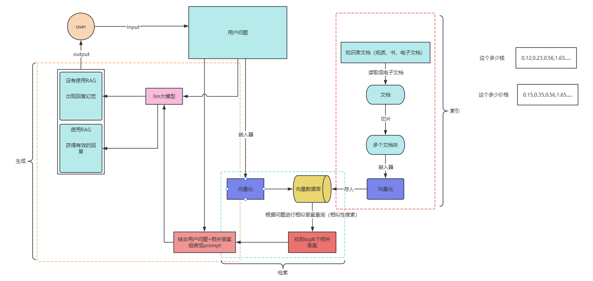

### 查询引擎
查询引擎是一个通用接口，允许你对数据提问。查询引擎接收自然语言查询，并返回丰富的响应。它通常（但不总是）通过检索器构建在一个或多个索引之上。你可以组合多个查询引擎来实现更高级的功能

#### 查询引擎的工作流程
查询引擎的典型工作流程包括：

1. **接收查询** - 接受自然语言问题
2. **检索相关内容** - 从索引中检索相关文档/节点
3. **合成响应** - 使用 LLM 基于检索到的内容生成答案
4. **返回结果** - 提供结构化的响应对象

#### 基础使用
```plain
# import
from llama_index.core import VectorStoreIndex, SimpleDirectoryReader
from LlamaIndex.加载模型 import get_llm

# 加载大模型和嵌入模型
llm, embed_model = get_llm()

# 加载文档
documents = SimpleDirectoryReader(input_files=["../data/小说.txt"]).load_data()
# 创建索引对象
index = VectorStoreIndex.from_documents(documents)

# 查询引擎用来提问
res = index.as_query_engine().query("萧炎的爸爸叫什么名字？")
print(res)
```

#### 配置查询引擎
```plain
# import
from llama_index.core import VectorStoreIndex, SimpleDirectoryReader
from LlamaIndex.加载模型 import get_llm

# 加载大模型和嵌入模型
llm, embed_model = get_llm()

# # 加载文档
documents = SimpleDirectoryReader(input_files=["../data/小说.txt"]).load_data()
# # 创建索引对象
index = VectorStoreIndex.from_documents(documents)
#
# # 查询引擎用来提问
res = index.as_query_engine(streaming=True).query("萧炎，斗之力？")
print(res)

# 流式输出
res.print_response_stream()
""" 
    虽然通过以下代码对易用性进行了优化，但它并未公开全部的可配置性。
        query_engine = index.as_query_engine(
            response_mode="tree_summarize",
            verbose=True,
        )
    如果需要更精细的控制，可以使用低级组合 API。具体来说，你需要显式地构造一个QueryEngine对象，而不是调用index.as_query_engine(...)
)
"""
print("================显式构造QueryEngine=====================")
# from llama_index.core import VectorStoreIndex, get_response_synthesizer
# from llama_index.core.query_engine import RetrieverQueryEngine
# from llama_index.core.response_synthesizers.type import ResponseMode
#
# # 创建索引
# index = VectorStoreIndex.from_documents(documents)
# # 创建检索器
# retriever = index.as_retriever(
#     similarity_top_k=2,
# )
#
# # 配置响应合成器
# response_synthesizer = get_response_synthesizer(
#     response_mode=ResponseMode.TREE_SUMMARIZE,
#     streaming=True
# )
#
# # 组装查询引擎
# query_engine = RetrieverQueryEngine(
#     retriever=retriever,
#     response_synthesizer=response_synthesizer
# )
#
# # 提问
# response = query_engine.query("萧炎的妹妹叫什么名字?")
# # 普通输出
# # print(response)
#
# # 流式输出
# response.print_response_stream()
```

#### 自定义查询引擎
```plain
from llama_index.core.query_engine import CustomQueryEngine
from llama_index.core import VectorStoreIndex, SimpleDirectoryReader, get_response_synthesizer
from llama_index.core.retrievers import BaseRetriever
from llama_index.core.response_synthesizers import BaseSynthesizer
from llama_index.core.response_synthesizers.type import ResponseMode
from llama_index.core import PromptTemplate
from llama_index.llms.dashscope import DashScope
from LlamaIndex.加载模型 import get_llm

# 加载大模型和嵌入模型
llm, embed_model = get_llm()

# 加载文档
documents = SimpleDirectoryReader(input_files=["../data/小说.txt"]).load_data()
# 创建索引和检索器
index = VectorStoreIndex.from_documents(documents)
retriever = index.as_retriever()

# 创建提示词模板
qa_prompt = PromptTemplate(
    "下面是上下文信息\n"
    "---------------------\n"
    "{context_str}\n"
    "---------------------\n"
    "请根据给定的上下文来回答问题 "
    "请回答这个问题\n"
    "Query: {query_str}\n"
    "Answer: "
)


class RAGStringQueryEngine(CustomQueryEngine):
    """RAG字符串查询引擎"""

    retriever: BaseRetriever
    response_synthesizer: BaseSynthesizer
    llm: DashScope
    qa_prompt: PromptTemplate

    def custom_query(self, query_str: str):
        nodes = self.retriever.retrieve(query_str)

        context_str = "\n\n".join([n.node.get_content() for n in nodes])
        print("查询到的上下文->", context_str)
        response = self.llm.complete(
            qa_prompt.format(context_str=context_str, query_str=query_str)
        )

        return str(response)


# 配置响应合成器
synthesizer = get_response_synthesizer(
    response_mode=ResponseMode.TREE_SUMMARIZE,
    streaming=True
)

# 使用自定义查询引擎
query_engine = RAGStringQueryEngine(
    retriever=retriever,
    response_synthesizer=synthesizer,
    llm=llm,
    qa_prompt=qa_prompt,
)

res = query_engine.query("萧炎的戒指是谁送给他的？")
print(res)
```

### 聊天引擎
在 **LlamaIndex** 中，所谓的 **聊天引擎（Chat Engine）** 是用来支持多轮对话的模块，是对传统 `QueryEngine` 的增强版本。

📌 简单说： `**ChatEngine**`** = 支持上下文记忆的 QueryEngine，用于多轮聊天场景**

#### 🧠 背景对比：QueryEngine vs ChatEngine
| **<font style="color:rgb(0, 0, 0);">特性</font>** | **<font style="color:rgb(0, 0, 0);">QueryEngine</font>** | **<font style="color:rgb(0, 0, 0);">ChatEngine</font>** |
| --- | --- | --- |
| <font style="color:rgb(0, 0, 0);">输入类型</font> | <font style="color:rgb(0, 0, 0);">单轮问题（字符串）</font> | <font style="color:rgb(0, 0, 0);">多轮对话（chat history + 新问题）</font> |
| <font style="color:rgb(0, 0, 0);">是否保留上下文</font> | <font style="color:rgb(0, 0, 0);">否（默认每次是新问题）</font> | <font style="color:rgb(0, 0, 0);">是（可存储对话上下文）</font> |
| <font style="color:rgb(0, 0, 0);">使用场景</font> | <font style="color:rgb(0, 0, 0);">检索问答、摘要</font> | <font style="color:rgb(0, 0, 0);">多轮聊天、智能助手</font> |
| <font style="color:rgb(0, 0, 0);">方法接口</font> | <font style="color:rgb(0, 0, 0);">.query(query_str)</font> | <font style="color:rgb(0, 0, 0);">.chat(message: str)</font> |


指定chat_model来访问不同的聊天引擎。

| **<font style="color:rgb(0, 0, 0);">模式名称</font>** | **<font style="color:rgb(0, 0, 0);">说明</font>** | **<font style="color:rgb(0, 0, 0);">是否调用索引</font>** | **<font style="color:rgb(0, 0, 0);">是否重写问题</font>** | **<font style="color:rgb(0, 0, 0);">是否插入上下文</font>** | **<font style="color:rgb(0, 0, 0);">是否用工具/函数</font>** |
| --- | --- | --- | --- | --- | --- |
| <font style="color:rgb(0, 0, 0);">best</font> | <font style="color:rgb(0, 0, 0);">自动根据 LLM 能力选择 ReAct 或 OpenAI 函数代理。适用于支持函数调用的 GPT 模型。</font> | <font style="color:rgb(0, 0, 0);">✅</font> | <font style="color:rgb(0, 0, 0);">✅</font> | <font style="color:rgb(0, 0, 0);">✅</font> | <font style="color:rgb(0, 0, 0);">✅</font><font style="color:rgb(0, 0, 0);">（自动选择）</font> |
| <font style="color:rgb(0, 0, 0);">condense_question</font> | <font style="color:rgb(0, 0, 0);">把多轮对话压缩成单个查询句，再传入 QueryEngine 处理。</font> | <font style="color:rgb(0, 0, 0);">✅</font> | <font style="color:rgb(0, 0, 0);">✅</font> | <font style="color:rgb(0, 0, 0);">❌</font> | <font style="color:rgb(0, 0, 0);">❌</font> |
| <font style="color:rgb(0, 0, 0);">context</font> | <font style="color:rgb(0, 0, 0);">直接用当前消息检索索引内容，将上下文插入到系统提示中，模拟“带文档”的对话。</font> | <font style="color:rgb(0, 0, 0);">✅</font> | <font style="color:rgb(0, 0, 0);">❌</font> | <font style="color:rgb(0, 0, 0);">✅</font> | <font style="color:rgb(0, 0, 0);">❌</font> |
| <font style="color:rgb(0, 0, 0);">condense_plus_context</font> | <font style="color:rgb(0, 0, 0);">同时压缩问题并检索索引，将检索结果嵌入系统提示中，更强大的信息对齐方式。</font> | <font style="color:rgb(0, 0, 0);">✅</font> | <font style="color:rgb(0, 0, 0);">✅</font> | <font style="color:rgb(0, 0, 0);">✅</font> | <font style="color:rgb(0, 0, 0);">❌</font> |
| <font style="color:rgb(0, 0, 0);">simple</font> | <font style="color:rgb(0, 0, 0);">不访问索引，直接与 LLM 聊天，适用于纯闲聊或测试。</font> | <font style="color:rgb(0, 0, 0);">❌</font> | <font style="color:rgb(0, 0, 0);">❌</font> | <font style="color:rgb(0, 0, 0);">❌</font> | <font style="color:rgb(0, 0, 0);">❌</font> |
| <font style="color:rgb(0, 0, 0);">react</font> | <font style="color:rgb(0, 0, 0);">强制使用 ReAct 代理，基于工具链执行任务。适用于需要多步推理和插件调用的 LLM。</font> | <font style="color:rgb(0, 0, 0);">✅</font><font style="color:rgb(0, 0, 0);">（通过工具）</font> | <font style="color:rgb(0, 0, 0);">✅</font> | <font style="color:rgb(0, 0, 0);">✅</font> | <font style="color:rgb(0, 0, 0);">✅</font><font style="color:rgb(0, 0, 0);">（ReAct）</font> |
| <font style="color:rgb(0, 0, 0);">openai</font> | <font style="color:rgb(0, 0, 0);">强制使用 OpenAI 函数调用代理，依赖 gpt-3.5-turbo / gpt-4 的函数调用 API。</font> | <font style="color:rgb(0, 0, 0);">✅</font><font style="color:rgb(0, 0, 0);">（通过工具）</font> | <font style="color:rgb(0, 0, 0);">✅</font> | <font style="color:rgb(0, 0, 0);">✅</font> | <font style="color:rgb(0, 0, 0);">✅</font><font style="color:rgb(0, 0, 0);">（OpenAI）</font> |


#### 什么是重写问题？
🧩 **将用户的提问，连同对话历史，总结为一个自包含的“单轮查询”，再传给查询引擎（QueryEngine）处理。**

```plain
聊天记录：
    用户: 那份财报的主要内容是什么？
    助手: 这份财报介绍了2024年Q1的收入和支出情况。
    用户: 那净利润是多少？

重写问题：
👉 自动生成一个更完整的问题：“根据2024年Q1财报，请告诉我净利润是多少？”
```

`SimpleChatEngine`不使用知识库，而所有其他的都使用知识库上的查询引擎（一般是从索引中构建聊天引擎）

#### 简单使用：
```plain
from llama_index.core.chat_engine import SimpleChatEngine
from LlamaIndex.加载模型 import get_llm

# 加载大模型和嵌入模型
llm, embed_model = get_llm()


chat_engine = SimpleChatEngine.from_defaults(llm=llm)
# 创建聊天引擎
response = chat_engine.chat("我今天吃了火锅，心情很不错。")
print(response)

res = chat_engine.chat("我今天吃了什么？")
print(res)
```

#### 配置聊天引擎
```plain
from llama_index.core.chat_engine import SimpleChatEngine
from llama_index.core import VectorStoreIndex, SimpleDirectoryReader
from llama_index.core.node_parser import SentenceSplitter
from LlamaIndex.加载模型 import get_llm

# 加载大模型和嵌入模型
llm, embed_model = get_llm()

print("-----------基础使用-----------")
# chat_engine = SimpleChatEngine.from_defaults(llm=llm)
# 创建聊天引擎
# response = chat_engine.chat("我今天吃了火锅，心情很不错。")
# print(response)
#
# res = chat_engine.chat("我今天吃了什么？")
# print(res)

print("-----------使用索引构建-高级API------------")
# # 加载文档
documents = SimpleDirectoryReader(input_files=["../data/小说.txt"]).load_data()
splitter = SentenceSplitter(
    chunk_size=200,
    chunk_overlap=100,
    separator="-----",  # 拼接句子的分隔符
    paragraph_separator="\n\n"  # 拼接段落的分隔符

)
# # 创建索引和检索器
index = VectorStoreIndex.from_documents(documents, transformations=[splitter])
# # 创建聊天引擎
chat_engine = index.as_chat_engine(similarity_top_k=10, chat_mode="condense_plus_context", verbose=True)
print(chat_engine.chat("萧炎斗之力是多少段？"))
# # 第二次对话
print(chat_engine.chat("萧薰儿的斗之力是多少？比他高多少？"))  # 萧薰儿的斗之力段位是多少？与萧炎（三段）相比相差多少段？


print("==============低级API-手动构造Chat Engine,能够达到更精细的定制=================")
# from llama_index.core import PromptTemplate
# from llama_index.core.memory import ChatMemoryBuffer
# from llama_index.core.llms import ChatMessage, MessageRole
# from llama_index.core.chat_engine import CondenseQuestionChatEngine
#
# custom_prompt = PromptTemplate(
#     """\
#     根据以下人类与助手之间的对话记录，以及人类提出的后续问题，\
#     请将该后续问题改写为一个完整的、自包含的问题，使其能够在没有对话上下文的情况下也能被准确理解。
#
#     <对话历史>
#     {chat_history}
#
#     <后续问题>
#     {question}
#
#     <完整问题>
#     """
# )
# chat_history = ChatMemoryBuffer.from_defaults(token_limit=1500)
# # 构建历史消息
# custom_chat_history = [
#     ChatMessage(
#         role=MessageRole.USER,
#         content="萧炎斗之力是多少段？",
#     ),
#     ChatMessage(role=MessageRole.ASSISTANT,
#                 content="根据文档中的信息，萧炎的斗之力是三段。这在第一章中明确提到：“斗之力，三段！”并且还描述了他在测验魔石碑上看到这个结果时的情景。"),
# ]
#
# query_engine = index.as_query_engine(similarity_top_k=10)
# chat_engine = CondenseQuestionChatEngine.from_defaults(
#     query_engine=query_engine,
#     condense_question_prompt=custom_prompt,
#     chat_history=custom_chat_history,
#     verbose=True,
# )
# # 普通输出
# print(chat_engine.chat("萧薰儿的斗之力是多少？比他高多少？"))
#
# # 流式输出
# streaming_response = chat_engine.stream_chat("萧薰儿的斗之力是多少？比他高多少？？")
# for token in streaming_response.response_gen:
#     print(token, end="")
#
# print(custom_chat_history)
```

### 检索器
用于从构建好的索引中根据用户问题提取相关信息节点，辅助 LLM 进行问答。

常见的检索器：

| **<font style="color:rgb(0, 0, 0);">Retriever 类型</font>** | **<font style="color:rgb(0, 0, 0);">类名</font>** | **<font style="color:rgb(0, 0, 0);">特点描述</font>** |
| --- | --- | --- |
| <font style="color:rgb(0, 0, 0);">✅</font><font style="color:rgb(0, 0, 0);"> 向量检索（默认）</font> | <font style="color:rgb(0, 0, 0);">VectorIndexRetriever</font> | <font style="color:rgb(0, 0, 0);">基于 embedding 的相似度匹配，适合语义理解类问题</font> |
| <font style="color:rgb(0, 0, 0);">✅</font><font style="color:rgb(0, 0, 0);"> BM25 检索</font> | <font style="color:rgb(0, 0, 0);">BM25Retriever</font> | <font style="color:rgb(0, 0, 0);">基于关键词的传统稀疏检索算法，适合关键词精确匹配</font> |
| <font style="color:rgb(0, 0, 0);">✅</font><font style="color:rgb(0, 0, 0);">混合检索</font> | <font style="color:rgb(0, 0, 0);">QueryFusionRetriever</font> | <font style="color:rgb(0, 0, 0);">多次查询结果融合，如多视角、多模板查询融合（适合复杂问题）</font> |
| <font style="color:rgb(0, 0, 0);">✅</font><font style="color:rgb(0, 0, 0);"> 多源检索</font> | <font style="color:rgb(0, 0, 0);">RouterRetriever</font> | <font style="color:rgb(0, 0, 0);">根据 query 动态选择多个 Retriever（比如某些问题用 BM25，某些用 Vector）</font> |
| <font style="color:rgb(0, 0, 0);">✅</font><font style="color:rgb(0, 0, 0);"> 自定义检索</font> | <font style="color:rgb(0, 0, 0);">自定义继承 BaseRetriever</font> | <font style="color:rgb(0, 0, 0);">可以实现过滤、打分、排序、聚合等任意逻辑</font> |
| <font style="color:rgb(0, 0, 0);">✅</font><font style="color:rgb(0, 0, 0);"> SQL 检索</font> | <font style="color:rgb(0, 0, 0);">SQLRetriever</font> | <font style="color:rgb(0, 0, 0);">从结构化数据库中基于 SQL 查询</font> |
| <font style="color:rgb(0, 0, 0);">✅</font><font style="color:rgb(0, 0, 0);"> Pydantic 检索</font> | <font style="color:rgb(0, 0, 0);">PydanticRetriever</font> | <font style="color:rgb(0, 0, 0);">从结构化 JSON 数据中抽取特定字段</font> |
| <font style="color:rgb(0, 0, 0);">✅</font><font style="color:rgb(0, 0, 0);"> 服务型向量检索</font> | <font style="color:rgb(0, 0, 0);">PineconeRetriever, WeaviateRetriever, RedisRetriever 等</font> | <font style="color:rgb(0, 0, 0);">与外部向量数据库对接进行检索</font> |


#### 自定义检索器
使用“AND”和“OR”条件将关键字查找检索与向量检索结合起来。

```plain
from llama_index.core import SimpleDirectoryReader
from llama_index.core.node_parser import SentenceSplitter
from llama_index.core import QueryBundle
from llama_index.core.schema import NodeWithScore
from llama_index.core import get_response_synthesizer
from llama_index.core.query_engine import RetrieverQueryEngine
from llama_index.core import SimpleKeywordTableIndex, VectorStoreIndex
from llama_index.core import StorageContext
from llama_index.core.retrievers import (
    BaseRetriever,
    VectorIndexRetriever,
    KeywordTableSimpleRetriever,
)

from typing import List
from LlamaIndex.加载模型 import get_llm

# 加载大模型和嵌入模型
llm, embed_model = get_llm()

# 加载文档
documents = SimpleDirectoryReader(input_files=["../data/小说.txt"]).load_data()
# 初始化节点解析器
splitter = SentenceSplitter(chunk_size=512)
nodes = splitter.get_nodes_from_documents(documents)


class CustomRetriever(BaseRetriever):
    """执行语义搜索和简单关键字搜索的自定义检索器。"""

    def __init__(
            self,
            vector_retriever: VectorIndexRetriever,
            keyword_retriever: KeywordTableSimpleRetriever,
            mode: str = "AND",
    ) -> None:
        """Init params."""

        self._vector_retriever = vector_retriever
        self._keyword_retriever = keyword_retriever
        if mode not in ("AND", "OR"):
            raise ValueError("Invalid mode.")
        self._mode = mode
        super().__init__()

    def _retrieve(self, query_bundle: QueryBundle) -> List[NodeWithScore]:
        """Retrieve nodes given query."""

        vector_nodes = self._vector_retriever.retrieve(query_bundle)
        keyword_nodes = self._keyword_retriever.retrieve(query_bundle)

        vector_ids = {n.node.node_id for n in vector_nodes}
        keyword_ids = {n.node.node_id for n in keyword_nodes}

        combined_dict = {n.node.node_id: n for n in vector_nodes}
        combined_dict.update({n.node.node_id: n for n in keyword_nodes})

        if self._mode == "AND":
            # 获取两个检索器交集的数据
            retrieve_ids = vector_ids.intersection(keyword_ids)
        else:
            # 获取两个检索器并集的数据
            retrieve_ids = vector_ids.union(keyword_ids)

        retrieve_nodes = [combined_dict[rid] for rid in retrieve_ids]
        return retrieve_nodes


# 初始化上下文存储器
storage_context = StorageContext.from_defaults()
storage_context.docstore.add_documents(nodes)

# 创建对应的索引
vector_index = VectorStoreIndex(nodes, storage_context=storage_context)
# 简单关键词索引，适合结构化数据或者短文本查询
keyword_index = SimpleKeywordTableIndex(nodes, storage_context=storage_context)

# 定义自定义检索器
vector_retriever = VectorIndexRetriever(index=vector_index, similarity_top_k=2)
keyword_retriever = KeywordTableSimpleRetriever(index=keyword_index)
# 使用自己创建的检索器类
custom_retriever = CustomRetriever(vector_retriever, keyword_retriever)

# 定义响应合成器
response_synthesizer = get_response_synthesizer()

# 加载查询引擎
custom_query_engine = RetrieverQueryEngine(
    retriever=custom_retriever,
    response_synthesizer=response_synthesizer,
)

response = custom_query_engine.query("斗之气：九段！级别：高级！是谁")
print(response)
```

#### BM25检索器
`BM25Retriever` 是 LlamaIndex 中基于传统信息检索算法 **BM25** 的关键词匹配型检索器。它不依赖 embedding 向量，而是使用关键词之间的词频和文档频率进行相关性计算。

下载模块：

```plain
pip install llama-index-retrievers-bm25==0.5.2
```

```plain
from llama_index.core import SimpleDirectoryReader
from llama_index.core.node_parser import SentenceSplitter
from llama_index.retrievers.bm25 import BM25Retriever
from LlamaIndex.加载模型 import get_llm

# 加载大模型和嵌入模型
llm, embed_model = get_llm()

# 加载文档
documents = SimpleDirectoryReader(input_files=["../data/小说.txt"]).load_data()
# 初始化节点解析器
splitter = SentenceSplitter(chunk_size=512)
nodes = splitter.get_nodes_from_documents(documents)

# 我们可以传入索引、docstore或节点列表来创建检索器
bm25_retriever = BM25Retriever.from_defaults(
    nodes=nodes,
    similarity_top_k=2
)
# 使用关键字bm25检索
res = bm25_retriever.retrieve("萧炎")
print([r.node.text for r in res])
```

#### BM25+Chroma进行混合检索
这种组合用于实现 **同时具备关键词精确匹配和语义理解能力的文档检索系统**，可以提升在复杂问答或知识库场景下的命中率和准确性。

```plain
from llama_index.core import VectorStoreIndex, StorageContext
from llama_index.core.storage.docstore import SimpleDocumentStore
from llama_index.vector_stores.chroma import ChromaVectorStore
from llama_index.retrievers.bm25 import BM25Retriever
from llama_index.core.retrievers import QueryFusionRetriever
from llama_index.core.query_engine import RetrieverQueryEngine
import chromadb
from llama_index.core import SimpleDirectoryReader
from llama_index.core.node_parser import SentenceSplitter
from LlamaIndex.加载模型 import get_llm

# 加载大模型和嵌入模型
llm, embed_model = get_llm()

# 加载文档
documents = SimpleDirectoryReader(input_files=["../data/小说.txt"]).load_data()
# 初始化节点解析器
splitter = SentenceSplitter(chunk_size=512)
nodes = splitter.get_nodes_from_documents(documents)
# 创建文档存储器
docstore = SimpleDocumentStore()
docstore.add_documents(nodes)

# 创建chroma连接对象
db = chromadb.PersistentClient(path="./chroma_db")
chroma_collection = db.get_or_create_collection("dense_vectors")
vector_store = ChromaVectorStore(chroma_collection=chroma_collection)

# 创建上下文存储器
storage_context = StorageContext.from_defaults(
    docstore=docstore, vector_store=vector_store
)
# 创建向量索引
index = VectorStoreIndex(nodes=nodes, storage_context=storage_context)
# 创建混合检索器
retriever = QueryFusionRetriever(
    [
        index.as_retriever(similarity_top_k=2),
        BM25Retriever.from_defaults(
            docstore=index.docstore, similarity_top_k=2
        ),
    ],
    num_queries=1,
    use_async=True,
)

nodes = retriever.retrieve("纳兰嫣然在哪个宗门修炼？")
for node in nodes:
    print(node)

# 创建检索查询引擎
# query_engine = RetrieverQueryEngine(retriever)
# print(query_engine.query("纳兰嫣然在哪个宗门修炼？"))
```

#### 互惠重排序融合检索器
重排序：

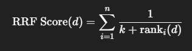

`n` 是检索器的数量，`d`某个文档

`k` 是平滑常数（通常是 60，防止排名靠前得分太高）

`ranki(d)`第 i 个检索器中，文档 的排名（从 1 开始）

排名越靠前，得分越高（因为分母更小）

| **<font style="color:rgb(0, 0, 0);">Document</font>** | **<font style="color:rgb(0, 0, 0);">Rank in A（Vector）</font>** | **<font style="color:rgb(0, 0, 0);">Rank in B（ BM25）</font>** |
| --- | --- | --- |
| <font style="color:rgb(0, 0, 0);">doc1</font> | <font style="color:rgb(0, 0, 0);">1</font> | <font style="color:rgb(0, 0, 0);">2</font> |
| <font style="color:rgb(0, 0, 0);">doc2</font> | <font style="color:rgb(0, 0, 0);">2</font> | <font style="color:rgb(0, 0, 0);">1</font> |
| <font style="color:rgb(0, 0, 0);">doc3</font> | <font style="color:rgb(0, 0, 0);">3</font> | <font style="color:rgb(0, 0, 0);">4</font> |
| <font style="color:rgb(0, 0, 0);">doc4</font> | <font style="color:rgb(0, 0, 0);">4</font> | <font style="color:rgb(0, 0, 0);">5</font> |
| <font style="color:rgb(0, 0, 0);">doc5</font> | <font style="color:rgb(0, 0, 0);">5</font> | <font style="color:rgb(0, 0, 0);">3</font> |


计算出来的分数

| **<font style="color:rgb(0, 0, 0);">Document</font>** | **<font style="color:rgb(0, 0, 0);">RRF Score (approx)</font>** |
| --- | --- |
| <font style="color:rgb(0, 0, 0);">doc1</font> | <font style="color:rgb(0, 0, 0);">1/61 + 1/62 ≈ 0.03252</font> |
| <font style="color:rgb(0, 0, 0);">doc2</font> | <font style="color:rgb(0, 0, 0);">1/62 + 1/61 ≈ 0.03252</font> |
| <font style="color:rgb(0, 0, 0);">doc5</font> | <font style="color:rgb(0, 0, 0);">1/65 + 1/63 ≈ 0.03080</font> |
| <font style="color:rgb(0, 0, 0);">doc3</font> | <font style="color:rgb(0, 0, 0);">1/63 + 1/64 ≈ 0.03100</font> |
| <font style="color:rgb(0, 0, 0);">doc4</font> | <font style="color:rgb(0, 0, 0);">1/64 + 1/65 ≈ 0.03056</font> |


为什么有用？

1. 它不会因为一个文档在某个检索器中排名靠后就被忽略。
2. 如果一个文档在多个检索器中都有不错排名，即使都不是第一，它也可能会最终排得更前。
3. 它避免了单一排序的不稳定性，是非常稳健的融合方法。

```plain
from llama_index.core import VectorStoreIndex, StorageContext
from llama_index.core.storage.docstore import SimpleDocumentStore
from llama_index.vector_stores.chroma import ChromaVectorStore
from llama_index.retrievers.bm25 import BM25Retriever
from llama_index.core.retrievers import QueryFusionRetriever
from llama_index.core.retrievers.fusion_retriever import FUSION_MODES
from llama_index.core.query_engine import RetrieverQueryEngine
import chromadb
from llama_index.core import SimpleDirectoryReader
from llama_index.core.node_parser import SentenceSplitter
from LlamaIndex.加载模型 import get_llm

# 加载大模型和嵌入模型
llm, embed_model = get_llm()

# 加载文档
documents = SimpleDirectoryReader(input_files=["../data/小说.txt"]).load_data()
# 初始化节点解析器
splitter = SentenceSplitter(chunk_size=512)
nodes = splitter.get_nodes_from_documents(documents)
# 创建文档存储器
docstore = SimpleDocumentStore()
docstore.add_documents(nodes)

# 创建chroma连接对象
db = chromadb.PersistentClient(path="./chroma_db")
chroma_collection = db.get_or_create_collection("dense_vectors")
vector_store = ChromaVectorStore(chroma_collection=chroma_collection)

# 创建上下文存储器
storage_context = StorageContext.from_defaults(
    docstore=docstore, vector_store=vector_store
)
# 创建向量索引
index = VectorStoreIndex(nodes=nodes, storage_context=storage_context)
# 创建混合检索器
retriever = QueryFusionRetriever(
    [
        index.as_retriever(similarity_top_k=2),
        BM25Retriever.from_defaults(
            docstore=index.docstore, similarity_top_k=2
        ),
    ],
    mode=FUSION_MODES.RECIPROCAL_RANK,
    # 根据问题生成的问题数量，设置为1就是禁用
    num_queries=4,
    similarity_top_k=2,
    use_async=True,
)

nodes_with_scores = retriever.retrieve("纳兰嫣然在哪个宗门修炼？")
for node in nodes_with_scores:
    print(f"Score: {node.score:.2f} - {node.text}...\n-----\n")

# 创建检索查询引擎
query_engine = RetrieverQueryEngine(retriever)
print(query_engine.query("纳兰嫣然在哪个宗门修炼？"))
```

### 节点后处理器
**节点后处理器（Node Postprocessors）** 是一个非常关键的模块，用于在文档被检索出来之后、被 LLM 使用之前，对这些文档节点（Node）做进一步筛选、排序、精细加工。

节点后的所有处理模块：https://docs.llamaindex.ai/en/stable/module_guides/querying/node_postprocessors/node_postprocessors/

#### 简单使用：
```plain
from llama_index.core.postprocessor import SimilarityPostprocessor
from llama_index.core.postprocessor import SentenceTransformerRerank
from llama_index.core.data_structs import Node
from llama_index.core.schema import NodeWithScore
from datetime import datetime, timedelta
from llama_index.core import VectorStoreIndex, Document
from llama_index.core.query_engine import RetrieverQueryEngine
from llama_index.core.postprocessor import TimeWeightedPostprocessor
from llama_index.core import SimpleDirectoryReader
from LlamaIndex.加载模型 import get_llm

# 加载大模型和嵌入模型
llm, embed_model = get_llm()

nodes = [
    NodeWithScore(node=Node(text="张三的爱车是小丽"), score=0.5),
    NodeWithScore(node=Node(text="张三的女朋友是晓丽"), score=0.8),
]

# 基于相似度的后处理器：过滤相似度得分低于0.75
processor = SimilarityPostprocessor(similarity_cutoff=0.75)
# 过滤节点
filtered_nodes = processor.postprocess_nodes(nodes)
print(filtered_nodes)

# 使用本地的重排序模型进行重排
reranker = SentenceTransformerRerank(model=r"D:\llm\Local_model\BAAI\bge-reranker-large", top_n=2)
print(reranker.postprocess_nodes(nodes, query_str="张三的女朋友是谁？"))

print("------------与检索到的文档一起使用-------------------------")
# 加载文档
documents = SimpleDirectoryReader(input_files=["../data/小说.txt"]).load_data()
# 创建向量索引
index = VectorStoreIndex.from_documents(documents)
# 进行向量检索出相似的文档
response_nodes = index.as_retriever(similarity_top_k=5).retrieve("萧炎的妹妹是谁？")
# 基于相似度的后处理器：过滤相似度得分低于0.5
processor = SimilarityPostprocessor(similarity_cutoff=0.52)
print(processor.postprocess_nodes(response_nodes))

print("------------使用查询引擎----------------")
# 1. 构造带时间戳的文档数据
now = datetime.now()
documents = [
    Document(
        text="我们的退货政策是：在30天内可退货。",
        metadata={"created_at": now - timedelta(days=40)}  # 较早
    ),
    Document(
        text="我们最近更新了退货政策，现在是15天内可退货。",
        metadata={"created_at": now - timedelta(days=10)}  # 比较新
    ),
    Document(
        text="退货政策是，目前可以20天内可退货",
        metadata={"created_at": now - timedelta(days=1)}  # 最新
    )
]

# 2. 构建索引和向量检索器
index = VectorStoreIndex.from_documents(documents)
retriever = index.as_retriever(similarity_top_k=5)

# 3. 创建 TimeWeightedPostprocessor
#  TimeWeightedPostprocessor 是 LlamaIndex 中的一个后处理器，用于根据文档节点的 时间戳（timestamp）进行加权排序或过滤，以优先考虑更新更近、时间更相关的内容。
# 本质还是会先按照语义搜索，尽管你有一个最新的文档，但是如果他的内容和问题相差太大也是和最终检索的文档排序有影响的
time_postprocessor = TimeWeightedPostprocessor(
    time_decay=0.5,  # 控制文档的“新旧信息”衰减速度。值越大，越快忽略旧的内容。
    top_k=3  # 最多返回3条
)

# 4. 构建 QueryEngine
query_engine = RetrieverQueryEngine.from_args(
    retriever=retriever,
    node_postprocessors=[time_postprocessor]
)

# 5. 用户提问
query = "你们现在的退货政策是怎样的？"
response = query_engine.query(query)

print("📌 回答：", response)

for node in response.source_nodes:
    print(node.text)
    print("score:", node.score)
    print("created_at:", node.metadata.get("created_at"))
```

### 响应合成器
**它负责把多个检索到的文档片段（chunks），整理加工，组织语言，生成用户能读懂的一段自然语言回答。**

换句话说，它是 **文档片段到回答的“写作器”**。

响应合成器的主要类型：

| **<font style="color:rgb(0, 0, 0);">模式名</font>** | **<font style="color:rgb(0, 0, 0);">类名 / 参数值</font>** | **<font style="color:rgb(0, 0, 0);">特点与用途</font>** |
| --- | --- | --- |
| <font style="color:rgb(0, 0, 0);">"compact"</font> | <font style="color:rgb(0, 0, 0);">紧凑模式（默认）</font> | **<font style="color:rgb(0, 0, 0);">最大化填充上下文。将文本块拼接填满窗口；若超出，则自动分批并迭代完善答案（不会丢弃数据）。</font>** |
| <font style="color:rgb(0, 0, 0);">"refine"</font> | <font style="color:rgb(0, 0, 0);">精炼模式</font> | <font style="color:rgb(0, 0, 0);">多轮精炼：逐个 chunk 阅读、不断 refine 上一轮答案（适合长文档摘要）</font> |
| <font style="color:rgb(0, 0, 0);">"tree_summarize"</font> | <font style="color:rgb(0, 0, 0);">树结构摘要器</font> | <font style="color:rgb(0, 0, 0);">多层次摘要，先分组 -> 局部总结 -> 汇总（适合多文档总结）</font> |
| <font style="color:rgb(0, 0, 0);">"accumulate"</font> | <font style="color:rgb(0, 0, 0);">顺序回答并拼接</font> | <font style="color:rgb(0, 0, 0);">每段内容都回答一遍，然后组合起来（更偏向枚举场景）</font> |
| <font style="color:rgb(0, 0, 0);">"no_text"</font> | <font style="color:rgb(0, 0, 0);">跳过合成器</font> | <font style="color:rgb(0, 0, 0);">不调用 LLM，直接返回检索的原始文本内容（适合调试或纯检索）</font> |
| <font style="color:rgb(0, 0, 0);">"compact_accumulate"</font> | <font style="color:rgb(0, 0, 0);">紧凑+精炼模式</font> | <font style="color:rgb(0, 0, 0);">结合两种模式的优点</font> |
| <font style="color:rgb(0, 0, 0);">"generation"</font> | <font style="color:rgb(0, 0, 0);">生成模式</font> | <font style="color:rgb(0, 0, 0);">忽略上下文，只使用LLM来生成响应</font> |


#### 简单使用`get_response_synthesizer`：
```plain
from llama_index.core import VectorStoreIndex, Document
from llama_index.core.response_synthesizers import get_response_synthesizer
from llama_index.core.response_synthesizers.type import ResponseMode
from llama_index.core import PromptTemplate
from llama_index.core.query_engine import RetrieverQueryEngine
from LlamaIndex.加载模型 import get_llm

# 加载大模型和嵌入模型
llm, embed_model = get_llm()

# 定义自定义的提示模板
qa_prompt_tmpl = PromptTemplate(
    """你是一个专业的问答助手，请根据以下提供的多个参考信息，整合出一个准确、简洁且清晰的答案：

    参考信息如下：
    ---------------------
    {context_str}
    ---------------------
    
    请根据上述信息回答用户提出的问题。如果参考信息中没有明确提到，请明确说明“在提供的信息中没有找到相关答案”，不要编造内容。
    
    用户问题: {query_str}
    
    你的回答："""
)

summary_prompt_template = PromptTemplate("""你是一名专业的内容总结助手，请根据以下信息生成简洁、准确的摘要。

上下文内容：
---------------------
{context_str}
---------------------

请将上述内容总结为关键要点，并保留其中的重要事实信息。
""")

documents = [
    Document(
        text="最初我们的会员制度只有两个等级：普通会员和高级会员。"
    ),
    Document(
        text="随后我们引入了一个新的等级——白金会员，介于高级与钻石之间。"
    ),
    Document(
        text="最近更新：我们取消了高级会员，所有高级用户将自动升级为白金会员。"
    )
]

# 2. 构建索引和向量检索器
index = VectorStoreIndex.from_documents(documents)
retriever = index.as_retriever(similarity_top_k=5)

# 3. 配置响应合成器
synthesizer = get_response_synthesizer(
    response_mode=ResponseMode.COMPACT,
    streaming=True,
    # 如果想使用自定义的提示模板，
    text_qa_template=qa_prompt_tmpl,
    summary_template=summary_prompt_template,
)
response = synthesizer.synthesize(query="请总结会员等级制度的演变过程。", nodes=retriever.retrieve("请总结会员等级制度的演变过程。"))
print(response)
# 4. 配置查询引擎
query_engine = RetrieverQueryEngine.from_args(
    retriever=retriever,
    response_synthesizer=synthesizer
)
response = query_engine.query("请总结会员等级制度的演变过程。")
print(response)
```

# 工作流
## llamaIndex中RAG工作流结构
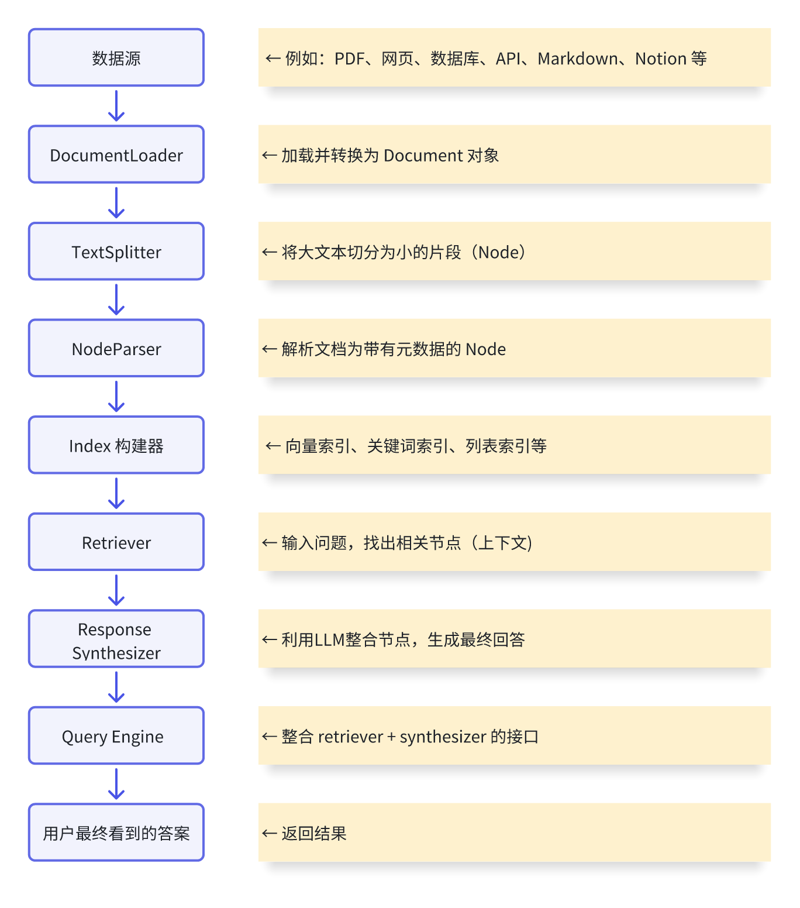

## @step
@step装饰器将普通的异步函数转换为工作流中的一个节点。

每个被@step装饰的函数代表工作流中的一个处理阶段，可以接收特定类型的事件作为输入，并产生新的事件作为输出。

### **工作原理**
当你在函数上使用`@step`装饰器时，LlamaIndex会自动：

+ 将该函数注册为工作流的一个步骤
+ 根据函数的输入参数类型决定何时触发这个步骤
+ 管理事件在不同步骤之间的传递
+ 处理异步执行和错误管理

## 入门示例
```plain
from llama_index.core.workflow import (
    Event,
    StartEvent,
    StopEvent,
    Workflow,
    step,
)
from LlamaIndex.加载模型 import get_llm


class JokeEvent(Event):
    """
        定义工作流事件:事件是用户定义的 pydantic 对象。您可以控制其属性和任何其他辅助方法。
    """
    joke: str


class JokeFlow(Workflow):
    """
        设置工作流类：工作流通过子类继承Workflow

    """
    def __init__(self, llm, **kwargs):
        super().__init__(**kwargs)
        self.llm = llm

    @step
    async def generate_joke(self, ev: StartEvent) -> JokeEvent:
        """
            工作流入口
            StartEvent：表示向何处发送初始工作流输入
                它可以保存任意属性。这里，我们使用 访问了主题 ev.topic，如果不存在该属性，则会引发错误。
                您也可以使用ev.get("topic")来处理属性可能不存在的情况，而不会引发错误。
        """
        topic = ev.topic

        prompt = f"帮我生成一个关于 {topic}的小故事，字数在100字左右."
        response = await self.llm.acomplete(prompt)
        return JokeEvent(joke=str(response))

    @step
    async def critique_joke(self, ev: JokeEvent) -> StopEvent:
        """
            工作流出口点:当工作流遇到了StopEvent他会立刻停止并返回内容
        """
        joke = ev.joke

        prompt = f"对下面的故事进行全面的分析: {joke}"
        response = await self.llm.acomplete(prompt)
        return StopEvent(result=str(response))


async def main():
    # 加载大模型和嵌入模型
    llm, embed_model = get_llm()
    w = JokeFlow(llm, timeout=60, verbose=False)
    result = await w.run(topic="小红帽")
    print(str(result))


import asyncio
# 因为w.run是异步的，所以我们需要使用异步的形式去启动程序
asyncio.run(main())
```

## 绘制工作流
```plain
# 导入对应模块
from llama_index.utils.workflow import (
    draw_all_possible_flows,
    draw_most_recent_execution,
)
```

```plain
from llama_index.core.workflow import (
    Event,
    StartEvent,
    StopEvent,
    Workflow,
    step,
)
from llama_index.utils.workflow import (
    draw_all_possible_flows,
    draw_most_recent_execution,
)
from LlamaIndex.加载模型 import get_llm


class JokeEvent(Event):
    """
        定义工作流事件:事件是用户定义的 pydantic 对象。您可以控制其属性和任何其他辅助方法。
    """
    joke: str


class JokeFlow(Workflow):
    """
        设置工作流类：工作流通过子类继承Workflow

    """

    def __init__(self, llm, **kwargs):
        super().__init__(**kwargs)
        self.llm = llm

    @step
    async def generate_joke(self, ev: StartEvent) -> JokeEvent:
        """
            工作流入口
            StartEvent：表示向何处发送初始工作流输入
                它可以保存任意属性。这里，我们使用 访问了主题 ev.topic，如果不存在该属性，则会引发错误。
                您也可以使用ev.get("topic")来处理属性可能不存在的情况，而不会引发错误。
        """
        topic = ev.topic

        prompt = f"帮我生成一个关于 {topic}的小故事，字数在100字左右."
        response = await self.llm.acomplete(prompt)
        return JokeEvent(joke=str(response))

    @step
    async def critique_joke(self, ev: JokeEvent) -> StopEvent:
        """
            工作流出口点:当工作流遇到了StopEvent他会立刻停止并返回内容
        """
        joke = ev.joke

        prompt = f"对下面的故事进行全面的分析: {joke}"
        response = await self.llm.acomplete(prompt)
        return StopEvent(result=str(response))


async def main():
    # 加载大模型和嵌入模型
    llm, embed_model = get_llm()
    w = JokeFlow(llm, timeout=60, verbose=False)
    result = await w.run(topic="小红帽")
    print(str(result))
    # 绘制工作流方法1：展示当前 工作流 中所有可能的执行路径（包括条件分支）
    draw_all_possible_flows(JokeFlow, filename="joke_flow_all.html")
    # 绘制工作流方法2：展示最近一次 工作流 执行时的实际路径（只包含这次走过的步骤）
    draw_most_recent_execution(w, filename="joke_flow_all.html")


import asyncio

# 因为w.run是异步的，所以我们需要使用异步的形式去启动程序
asyncio.run(main())
```

## 使用全局上下文/状态
`Context` 是LlamaIndex工作流提供的**内置上下文管理器**，这是处理全局状态的官方推荐方式。

Context提供了一个在工作流步骤之间共享数据的标准机制，可以存储和访问全局状态，而不需要通过事件传递或类属性。

```plain
from llama_index.core.workflow import (
    Event,
    StartEvent,
    StopEvent,
    Workflow,
    step,
    Context
)
from llama_index.utils.workflow import (
    draw_all_possible_flows,
    draw_most_recent_execution,
)
from LlamaIndex.加载模型 import get_llm


class JokeEvent(Event):
    """
        定义工作流事件:事件是用户定义的 pydantic 对象。您可以控制其属性和任何其他辅助方法。
    """
    joke: str


class JokeFlow(Workflow):
    """
        设置工作流类：工作流通过子类继承Workflow

    """

    def __init__(self, llm, **kwargs):
        super().__init__(**kwargs)
        self.llm = llm

    @step
    async def generate_joke(self, ctx: Context, ev: StartEvent) -> JokeEvent:
        """
            工作流入口
            StartEvent：表示向何处发送初始工作流输入
                它可以保存任意属性。这里，我们使用 访问了主题 ev.topic，如果不存在该属性，则会引发错误。
                您也可以使用ev.get("topic")来处理属性可能不存在的情况，而不会引发错误。
        """
        topic = ev.topic

        prompt = f"帮我生成一个关于 {topic}的小故事，字数在100字左右."
        response = await self.llm.acomplete(prompt)
        # 存储一个k-v形式的数据
        await ctx.store.set("response", response)
        return JokeEvent(joke=str(response))

    @step
    async def critique_joke(self, ctx: Context, ev: JokeEvent) -> StopEvent:
        """
            工作流出口点:当工作流遇到了StopEvent他会立刻停止并返回内容
        """
        joke = ev.joke
        # 获取对应的值
        print(await ctx.store.get("response"))
        prompt = f"对下面的故事进行全面的分析: {joke}"
        response = await self.llm.acomplete(prompt)
        return StopEvent(result=str(response))


async def main():
    # 加载大模型和嵌入模型
    llm, embed_model = get_llm()
    w = JokeFlow(llm, timeout=60, verbose=False)
    result = await w.run(topic="小红帽")
    print(str(result))
    # 绘制工作流方法1：展示当前 工作流 中所有可能的执行路径（包括条件分支）
    draw_all_possible_flows(JokeFlow, filename="joke_flow_all.html")
    # 绘制工作流方法2：展示最近一次 工作流 执行时的实际路径（只包含这次走过的步骤）
    # draw_most_recent_execution(w, filename="joke_flow_all.html")


import asyncio

# 因为w.run是异步的，所以我们需要使用异步的形式去启动程序
asyncio.run(main())
```

## 等待多个事件
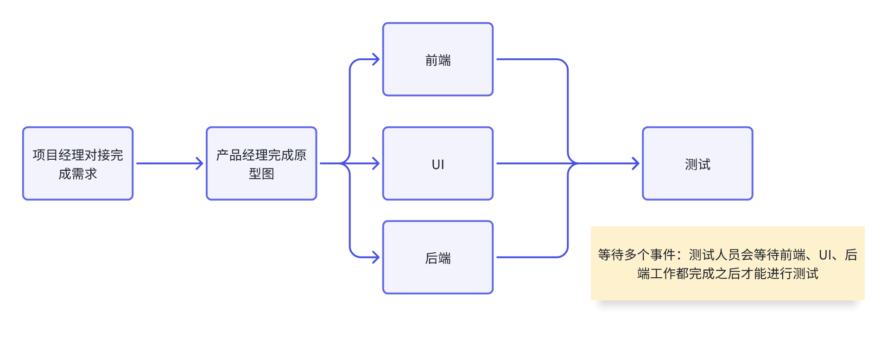

上下文不仅仅保存数据，它还提供缓冲和等待多个事件的实用程序。

假设工作流的流程是：

1.用户输入查询

2.检索相关文档

3.处理查询出来的文档（需要等待检索器检索出文档）

3.响应合成器生成结果

```plain
from llama_index.core import VectorStoreIndex, SimpleDirectoryReader
from llama_index.retrievers.bm25 import BM25Retriever
from llama_index.core.node_parser import SentenceSplitter
from llama_index.core.indices.vector_store.retrievers import VectorIndexRetriever
from llama_index.core.workflow import (
    Context,
    Event,
    Workflow,
    StartEvent,
    StopEvent,
    step,
)
from llama_index.core.postprocessor import SimilarityPostprocessor
from llama_index.core.schema import NodeWithScore, QueryBundle
from llama_index.core.response_synthesizers import get_response_synthesizer
from typing import List
import asyncio
from LlamaIndex.加载模型 import get_llm


# 定义工作流中的事件类型
class QueryEvent(Event):
    """查询事件"""
    query: str


class VectorRetrievalEvent(Event):
    """向量检索事件"""
    nodes: List[NodeWithScore]
    query: str


class BM25RetrievalEvent(Event):
    """关键词检索事件"""
    nodes: List[NodeWithScore]
    query: str


class CombinedRetrievalEvent(Event):
    """合并检索结果事件"""
    vector_nodes: List[NodeWithScore]
    bm25_nodes: List[NodeWithScore]
    query: str


class PostProcessEvent(Event):
    """后处理事件"""
    processed_nodes: List[NodeWithScore]
    query: str


class RAGWorkflow(Workflow):
    """RAG工作流类"""

    def __init__(self, retriever: VectorIndexRetriever, bm25_retriever: BM25Retriever):
        super().__init__()
        self.retriever = retriever
        self.bm25_retriever = bm25_retriever
        self.postprocessor = SimilarityPostprocessor(similarity_cutoff=0.5)
        self.response_synthesizer = get_response_synthesizer()

    @step
    async def query_step(self, ctx: Context, ev: StartEvent) -> QueryEvent:
        """步骤1: 处理用户查询"""
        query = ev.query
        print(f"🔍 接收查询: {query}")
        processed_query = query.strip()
        return QueryEvent(query=processed_query)

    @step
    async def vector_retrieval_step(self, ctx: Context, ev: QueryEvent) -> VectorRetrievalEvent:
        """步骤2: vector向量数据库检索相关文档"""
        print(f"📚 vector开始检索相关文档...")

        query_bundle = QueryBundle(query_str=ev.query)
        retrieved_nodes = await self.retriever.aretrieve(query_bundle)

        print(f"✅ vector检索到 {len(retrieved_nodes)} 个相关文档片段")
        return VectorRetrievalEvent(nodes=retrieved_nodes, query=ev.query)

    @step
    async def bm25_retrieval_step(self, ctx: Context, ev: QueryEvent) -> BM25RetrievalEvent:
        """步骤2: bm25检索相关文档"""
        print(f"📚 bm25开始检索相关文档...")

        query_bundle = QueryBundle(query_str=ev.query)
        retrieved_nodes = await self.bm25_retriever.aretrieve(query_bundle)

        print(f"✅ bm25检索到 {len(retrieved_nodes)} 个相关文档片段")
        return BM25RetrievalEvent(nodes=retrieved_nodes, query=ev.query)

    @step
    async def combine_results_step(
            self,
            ctx: Context,
            ev: VectorRetrievalEvent | BM25RetrievalEvent
    ) -> CombinedRetrievalEvent:
        """步骤3: 收集并合并两个检索结果"""
        print(f"🔧 开始收集检索结果...")

        # 使用 collect_events 收集两种类型的事件
        events = ctx.collect_events(ev, [VectorRetrievalEvent, BM25RetrievalEvent])

        if not events or len(events) < 2:
            print(f"⚠️ 只收集到 {len(events) if events else 0} 个事件，等待更多...")
            # 如果没有收集到足够的事件，返回 None 让工作流继续等待
            return None

        print(f"✅ 已收集到 {len(events)} 个检索事件")

        # 分离不同类型的检索结果
        vector_nodes = []
        bm25_nodes = []
        query = ""

        for event in events:
            if isinstance(event, VectorRetrievalEvent):
                vector_nodes = event.nodes
                query = event.query
                print(f"  - Vector检索: {len(event.nodes)} 个节点")
            elif isinstance(event, BM25RetrievalEvent):
                bm25_nodes = event.nodes
                query = event.query
                print(f"  - BM25检索: {len(event.nodes)} 个节点")

        return CombinedRetrievalEvent(
            vector_nodes=vector_nodes,
            bm25_nodes=bm25_nodes,
            query=query
        )

    @step
    async def postprocess_step(self, ctx: Context, ev: CombinedRetrievalEvent) -> PostProcessEvent:
        """步骤4: 对合并的检索结果进行后处理"""
        print(f"🔄 开始后处理检索结果...")

        # 合并所有检索结果
        all_nodes = []
        all_nodes.extend(ev.vector_nodes)
        all_nodes.extend(ev.bm25_nodes)

        if not all_nodes:
            print("⚠️  没有找到任何检索结果")
            return PostProcessEvent(processed_nodes=[], query=ev.query)

        print(f"🔄 开始后处理 {len(all_nodes)} 个文档片段...")
        print(f"  - Vector节点: {len(ev.vector_nodes)} 个")
        print(f"  - BM25节点: {len(ev.bm25_nodes)} 个")

        # 创建查询束用于后处理
        query_bundle = QueryBundle(query_str=ev.query)

        # 执行后处理（去重、过滤、重排序等）
        processed_nodes = self.postprocessor.postprocess_nodes(
            nodes=all_nodes, query_bundle=query_bundle
        )

        print(f"✅ 后处理完成，保留 {len(processed_nodes)} 个高质量文档片段")

        # 打印每个节点的相似度分数
        for i, node in enumerate(processed_nodes[:3]):
            score = node.score if node.score else 0
            print(f"  - 文档片段 {i + 1}: 相似度 {score:.3f}")

        return PostProcessEvent(processed_nodes=processed_nodes, query=ev.query)

    @step
    async def synthesis_step(self, ctx: Context, ev: PostProcessEvent) -> StopEvent:
        """步骤5: 基于检索到的上下文生成最终答案"""
        print(f"🤖 开始生成答案...")

        if not ev.processed_nodes:
            return StopEvent(result={
                "response": "抱歉，没有找到相关信息来回答您的问题。",
                "source_nodes": []
            })

        # 创建查询束
        query_bundle = QueryBundle(query_str=ev.query)

        # 使用响应合成器生成答案
        response = await self.response_synthesizer.asynthesize(
            query=query_bundle,
            nodes=ev.processed_nodes
        )

        print(f"✅ 答案生成完成")

        return StopEvent(result={
            "response": str(response),
            "source_nodes": ev.processed_nodes,
            "metadata": {
                "num_sources": len(ev.processed_nodes),
                "query": ev.query
            }
        })


# 使用示例
async def main():
    """主函数示例"""
    print("📖 正在构建向量索引...")

    get_llm()

    documents = SimpleDirectoryReader(input_files=["../data/小说.txt"]).load_data()
    splitter = SentenceSplitter(chunk_size=512)
    nodes = splitter.get_nodes_from_documents(documents)

    index = VectorStoreIndex(nodes)
    retriever = VectorIndexRetriever(index, similarity_top_k=5)
    bm25_retriever = BM25Retriever.from_defaults(
        nodes=nodes,
        similarity_top_k=3
    )

    print("✅ 向量索引构建完成")

    workflow = RAGWorkflow(retriever=retriever, bm25_retriever=bm25_retriever)

    test_queries = [
        "萧炎的爸爸是谁？",
        "萧炎的妹妹是谁？"
    ]

    for query in test_queries:
        print(f"\n{'=' * 50}")
        print(f"🎯 测试查询: {query}")
        print(f"{'=' * 50}")

        result = await workflow.run(query=query)

        print(f"\n📝 生成的答案:")
        print(f"{result['response']}")
        print(f"\n📊 元数据:")
        print(f"- 使用了 {result['metadata']['num_sources']} 个文档片段")
        print(f"- 原始查询: {result['metadata']['query']}")


if __name__ == "__main__":
    asyncio.run(main())
```

## 流媒体事件（流式输出）
工作流可能很复杂——它们旨在处理复杂的、分支的、并发的逻辑——这意味着它们可能需要一些时间才能完全执行。为了给用户提供良好的体验，您可能希望通过在事件发生时流式传输来指示进度。工作流对象内置了对此的支持`Context`

```plain
from llama_index.core.workflow import (
    StartEvent,
    StopEvent,
    Workflow,
    step,
    Event,
    Context,
)
from llama_index.core import VectorStoreIndex, SimpleDirectoryReader
from llama_index.retrievers.bm25 import BM25Retriever
from llama_index.core.node_parser import SentenceSplitter
from llama_index.core.indices.vector_store.retrievers import VectorIndexRetriever
from llama_index.core.postprocessor import SimilarityPostprocessor
from llama_index.core.schema import NodeWithScore, QueryBundle
from llama_index.core.response_synthesizers import get_response_synthesizer
from llama_index.core.response_synthesizers.type import ResponseMode
from typing import List
import asyncio
from LlamaIndex.加载模型 import get_llm


# 定义工作流事件
class QueryProcessedEvent(Event):
    """查询处理完成事件"""
    query: str


class VectorRetrievalEvent(Event):
    """向量检索完成事件"""
    nodes: List[NodeWithScore]
    query: str


class BM25RetrievalEvent(Event):
    """BM25检索完成事件"""
    nodes: List[NodeWithScore]
    query: str


class RetrievalCompletedEvent(Event):
    """所有检索完成事件"""
    all_nodes: List[NodeWithScore]
    query: str


class PostProcessedEvent(Event):
    """后处理完成事件"""
    processed_nodes: List[NodeWithScore]
    query: str


class ProgressEvent(Event):
    """进度事件 - 用于流式输出"""
    msg: str
    step: str = ""
    metadata: dict = None


class StreamingRAGWorkflow(Workflow):
    """使用get_response_synthesizer的流式RAG工作流"""

    def __init__(self, retriever: VectorIndexRetriever, bm25_retriever: BM25Retriever, **kwargs):
        super().__init__(**kwargs)
        self.retriever = retriever
        self.bm25_retriever = bm25_retriever
        self.postprocessor = SimilarityPostprocessor(similarity_cutoff=0.5)

        # 使用get_response_synthesizer创建支持流式输出的响应合成器
        self.response_synthesizer = get_response_synthesizer(
            response_mode=ResponseMode.COMPACT,  # 使用紧凑模式
            streaming=True,  # 启用流式输出
            use_async=True  # 启用异步
        )

    @step
    async def process_query(self, ctx: Context, ev: StartEvent) -> QueryProcessedEvent:
        """步骤1: 处理用户查询"""
        query = ev.query
        ctx.write_event_to_stream(ProgressEvent(
            msg=f"🔍 开始处理查询: {query}\n",
            step="query_processing"
        ))

        processed_query = query.strip()

        ctx.write_event_to_stream(ProgressEvent(
            msg="✅ 查询处理完成，开始并行检索...\n",
            step="query_processing"
        ))

        return QueryProcessedEvent(query=processed_query)

    @step
    async def vector_retrieval(self, ctx: Context, ev: QueryProcessedEvent) -> VectorRetrievalEvent:
        """步骤2a: 向量检索"""
        ctx.write_event_to_stream(ProgressEvent(
            msg="📚 正在进行向量检索...\n",
            step="vector_retrieval"
        ))

        query_bundle = QueryBundle(query_str=ev.query)
        retrieved_nodes = await self.retriever.aretrieve(query_bundle)

        ctx.write_event_to_stream(ProgressEvent(
            msg=f"✅ 向量检索完成，找到 {len(retrieved_nodes)} 个相关文档\n",
            step="vector_retrieval",
            metadata={"count": len(retrieved_nodes)}
        ))

        return VectorRetrievalEvent(nodes=retrieved_nodes, query=ev.query)

    @step
    async def bm25_retrieval(self, ctx: Context, ev: QueryProcessedEvent) -> BM25RetrievalEvent:
        """步骤2b: BM25检索"""
        ctx.write_event_to_stream(ProgressEvent(
            msg="🔎 正在进行关键词检索...\n",
            step="bm25_retrieval"
        ))

        query_bundle = QueryBundle(query_str=ev.query)
        retrieved_nodes = await self.bm25_retriever.aretrieve(query_bundle)

        ctx.write_event_to_stream(ProgressEvent(
            msg=f"✅ 关键词检索完成，找到 {len(retrieved_nodes)} 个相关文档\n",
            step="bm25_retrieval",
            metadata={"count": len(retrieved_nodes)}
        ))

        return BM25RetrievalEvent(nodes=retrieved_nodes, query=ev.query)

    @step
    async def combine_retrievals(
            self,
            ctx: Context,
            ev: VectorRetrievalEvent | BM25RetrievalEvent
    ) -> RetrievalCompletedEvent:
        """步骤3: 合并检索结果"""
        ctx.write_event_to_stream(ProgressEvent(
            msg="🔧 正在收集检索结果...\n",
            step="combining_results"
        ))

        # 收集两种检索事件
        events = ctx.collect_events(ev, [VectorRetrievalEvent, BM25RetrievalEvent])

        if not events or len(events) < 2:
            # 还没收集到所有事件，继续等待
            return None

        ctx.write_event_to_stream(ProgressEvent(
            msg=f"✅ 已收集到 {len(events)} 个检索结果，开始合并...\n",
            step="combining_results"
        ))

        # 合并所有检索结果
        all_nodes = []
        query = ""
        vector_count = 0
        bm25_count = 0

        for event in events:
            if isinstance(event, VectorRetrievalEvent):
                all_nodes.extend(event.nodes)
                vector_count = len(event.nodes)
                query = event.query
            elif isinstance(event, BM25RetrievalEvent):
                all_nodes.extend(event.nodes)
                bm25_count = len(event.nodes)
                query = event.query

        ctx.write_event_to_stream(ProgressEvent(
            msg=f"📋 合并完成: 向量检索 {vector_count} 个 + 关键词检索 {bm25_count} 个 = 总共 {len(all_nodes)} 个文档\n",
            step="combining_results",
            metadata={"vector_count": vector_count, "bm25_count": bm25_count, "total": len(all_nodes)}
        ))

        return RetrievalCompletedEvent(all_nodes=all_nodes, query=query)

    @step
    async def post_process(self, ctx: Context, ev: RetrievalCompletedEvent) -> PostProcessedEvent:
        """步骤4: 后处理检索结果"""
        ctx.write_event_to_stream(ProgressEvent(
            msg="🔄 正在优化和过滤检索结果...\n",
            step="postprocessing"
        ))

        if not ev.all_nodes:
            ctx.write_event_to_stream(ProgressEvent(
                msg="⚠️ 没有找到相关文档，无法生成答案\n",
                step="postprocessing"
            ))
            return PostProcessedEvent(processed_nodes=[], query=ev.query)

        # 创建查询束用于后处理
        query_bundle = QueryBundle(query_str=ev.query)

        # 执行后处理
        processed_nodes = self.postprocessor.postprocess_nodes(
            nodes=ev.all_nodes, query_bundle=query_bundle
        )

        ctx.write_event_to_stream(ProgressEvent(
            msg=f"✅ 文档优化完成，从 {len(ev.all_nodes)} 个文档中选出 {len(processed_nodes)} 个最相关的\n",
            step="postprocessing",
            metadata={"original_count": len(ev.all_nodes), "filtered_count": len(processed_nodes)}
        ))

        # 显示文档片段预览
        if processed_nodes:
            ctx.write_event_to_stream(ProgressEvent(
                msg="📋 最相关的文档片段:\n",
                step="postprocessing"
            ))

            for i, node in enumerate(processed_nodes[:3]):
                score = node.score if node.score else 0
                preview = node.text[:80] + "..." if len(node.text) > 80 else node.text
                ctx.write_event_to_stream(ProgressEvent(
                    msg=f"  {i + 1}. [相似度: {score:.3f}] {preview}\n",
                    step="postprocessing"
                ))

        return PostProcessedEvent(processed_nodes=processed_nodes, query=ev.query)

    @step
    async def synthesize_response(self, ctx: Context, ev: PostProcessedEvent) -> StopEvent:
        """步骤5: 使用response_synthesizer进行流式生成"""
        if not ev.processed_nodes:
            ctx.write_event_to_stream(ProgressEvent(
                msg="❌ 抱歉，没有找到相关信息来回答您的问题。\n",
                step="synthesis"
            ))
            return StopEvent(result={
                "response": "抱歉，没有找到相关信息来回答您的问题。",
                "source_nodes": [],
                "metadata": {"query": ev.query}
            })

        ctx.write_event_to_stream(ProgressEvent(
            msg="🤖 正在基于相关文档生成答案...\n\n",
            step="synthesis"
        ))

        # 创建查询束
        query_bundle = QueryBundle(query_str=ev.query)

        try:
            # 使用response_synthesizer进行异步流式合成
            streaming_response = await self.response_synthesizer.asynthesize(
                query=query_bundle,
                nodes=ev.processed_nodes
            )

            full_response = ""

            # 方法1: 如果响应对象有response_gen属性（流式生成器）
            if hasattr(streaming_response, 'response_gen') and streaming_response.response_gen:
                try:
                    async for chunk in streaming_response.response_gen:
                        chunk_text = str(chunk)
                        full_response += chunk_text

                        # 将每个块写入流
                        ctx.write_event_to_stream(ProgressEvent(
                            msg=chunk_text,
                            step="synthesis"
                        ))

                        # 添加小延迟以获得更好的流式效果
                        await asyncio.sleep(0.02)

                except Exception as e:
                    print(f"流式生成出错: {e}")
                    # 如果流式生成失败，使用完整响应
                    full_response = str(streaming_response)
                    ctx.write_event_to_stream(ProgressEvent(
                        msg=full_response,
                        step="synthesis"
                    ))

            # 方法2: 如果没有流式生成器，但有async_response_gen
            elif hasattr(streaming_response, 'async_response_gen') and streaming_response.async_response_gen:
                try:
                    async for chunk in streaming_response.async_response_gen():
                        chunk_text = str(chunk)
                        full_response += chunk_text

                        ctx.write_event_to_stream(ProgressEvent(
                            msg=chunk_text,
                            step="synthesis"
                        ))

                        await asyncio.sleep(0.02)

                except Exception as e:
                    print(f"异步流式生成出错: {e}")
                    full_response = str(streaming_response)
                    ctx.write_event_to_stream(ProgressEvent(
                        msg=full_response,
                        step="synthesis"
                    ))

            # 方法3: 如果都没有，则分块输出完整响应
            else:
                full_response = str(streaming_response)

                # 将完整响应分块进行流式输出
                chunk_size = 50  # 每块字符数
                for i in range(0, len(full_response), chunk_size):
                    chunk = full_response[i:i + chunk_size]
                    ctx.write_event_to_stream(ProgressEvent(
                        msg=chunk,
                        step="synthesis"
                    ))
                    await asyncio.sleep(0.1)

        except Exception as e:
            error_msg = f"❌ 生成答案时出错: {str(e)}\n"
            ctx.write_event_to_stream(ProgressEvent(
                msg=error_msg,
                step="synthesis"
            ))
            return StopEvent(result={
                "response": "抱歉，生成答案时出现错误。",
                "source_nodes": ev.processed_nodes,
                "metadata": {"query": ev.query, "error": str(e)}
            })

        ctx.write_event_to_stream(ProgressEvent(
            msg=f"\n\n✅ 答案生成完成！使用了 {len(ev.processed_nodes)} 个文档片段。\n",
            step="synthesis"
        ))

        return StopEvent(result={
            "response": full_response,
            "source_nodes": ev.processed_nodes,
            "metadata": {
                "num_sources": len(ev.processed_nodes),
                "query": ev.query
            }
        })


# 使用示例
async def main():
    """主函数示例"""
    print("📖 正在构建向量索引...")

    # 初始化LLM
    get_llm()

    # 加载文档并构建索引
    documents = SimpleDirectoryReader(input_files=["../data/小说.txt"]).load_data()
    splitter = SentenceSplitter(chunk_size=512)
    nodes = splitter.get_nodes_from_documents(documents)

    index = VectorStoreIndex(nodes)
    retriever = VectorIndexRetriever(index, similarity_top_k=5)
    bm25_retriever = BM25Retriever.from_defaults(
        nodes=nodes,
        similarity_top_k=3
    )

    print("✅ 向量索引构建完成\n")

    # 创建工作流
    workflow = StreamingRAGWorkflow(
        retriever=retriever,
        bm25_retriever=bm25_retriever,
        timeout=120,  # 增加超时时间
        verbose=True
    )

    # 测试查询
    test_queries = [
        "萧炎的爸爸是谁？",
        "萧炎有什么特殊能力？"
    ]

    for query in test_queries:
        print(f"{'=' * 70}")
        print(f"🎯 测试查询: {query}")
        print(f"{'=' * 70}")

        # 启动工作流
        handler = workflow.run(query=query)

        # 处理流式事件
        async for ev in handler.stream_events():
            if isinstance(ev, ProgressEvent):
                print(ev.
                      msg, end='', flush=True)

        # 获取最终结果
        final_result = await handler

        print(f"\n📊 工作流执行完成:")
        print(f"- 使用了 {final_result['metadata']['num_sources']} 个文档片段")
        print(f"- 原始查询: {final_result['metadata']['query']}")
        print(f"- 响应长度: {len(final_result['response'])} 字符")
        print("\n")


if __name__ == "__main__":
    # 运行主示例
    asyncio.run(main())
```

## 人机交互
实现人机交互的最简单方法是在工作流期间使用`InputRequiredEvent`和事件。`HumanResponseEvent`

```plain
from llama_index.core.workflow import InputRequiredEvent, HumanResponseEvent
from llama_index.core.workflow import step, StopEvent, StartEvent, Workflow
import asyncio


class HumanInTheLoopWorkflow(Workflow):
    @step
    async def step1(self, ev: StartEvent) -> InputRequiredEvent:
        # 提示用户输入预算信息
        return InputRequiredEvent(prefix="请问你的预算是多少？ ")

    @step
    async def step2(self, ev: HumanResponseEvent) -> StopEvent:
        # 在这接收到人类输入的内容，进行处理
        res = ev.response

        return StopEvent(result=f"根据你的预算：{res}，即将为你生成一个规划")


async def main():
    handler = HumanInTheLoopWorkflow().run()

    # 获取一个工作流处理器，就是一个异步生成器，通过迭代这个生成器，可以实时的捕获工作流的执行状态
    async for event in handler.stream_events():
        # 如果获取的是InputRequiredEvent对象，那么就可以让人类进行输入
        if isinstance(event, InputRequiredEvent):
            # 获取人类的问题
            response = input(event.prefix)
            handler.ctx.send_event(HumanResponseEvent(response=response))

    final_result = await handler
    print(final_result)


if __name__ == "__main__":
    # 运行示例
    asyncio.run(main())
```

## 循环和分支
```plain
from llama_index.core.workflow import (
    StartEvent,
    StopEvent,
    Workflow,
    step,
    Event,
)
import random
from llama_index.utils.workflow import draw_all_possible_flows


class FirstEvent(Event):
    first_output: str


class SecondEvent(Event):
    second_output: str


class LoopEvent(Event):
    loop_output: str


class MyWorkflow(Workflow):
    @step
    async def step_one(self, ev: StartEvent | LoopEvent) -> FirstEvent | LoopEvent:
        if random.randint(0, 1) == 0:
            print("坏事发生了")
            return LoopEvent(loop_output="回到第一步")
        else:
            print("今天发生了什么好事")
            return FirstEvent(first_output="第一步完成")

    @step
    async def step_two(self, ev: FirstEvent) -> SecondEvent:
        print(ev.first_output)
        return SecondEvent(second_output="第二步完成")

    @step
    async def step_three(self, ev: SecondEvent) -> StopEvent:
        print(ev.second_output)
        return StopEvent(result="完成流程")


async def main() -> None:
    w = MyWorkflow(timeout=10, verbose=True)
    result = await w.run(first_input="启动工作流")
    print(result)
    draw_all_possible_flows(MyWorkflow, "loop_work_flow.html")


if __name__ == '__main__':
    import asyncio

    asyncio.run(main())
```

```plain
from llama_index.core.workflow import (
    StartEvent,
    StopEvent,
    Workflow,
    step,
    Event,
)
import random
from llama_index.utils.workflow import draw_all_possible_flows


class BranchA1Event(Event):
    payload: str


class BranchA2Event(Event):
    payload: str


class BranchB1Event(Event):
    payload: str


class BranchB2Event(Event):
    payload: str


class BranchWorkflow(Workflow):
    @step
    async def start(self, ev: StartEvent) -> BranchA1Event | BranchB1Event:
        if random.randint(0, 1) == 0:
            print("跳转到分支A")
            return BranchA1Event(payload="分支A")
        else:
            print("跳转到分支B")
            return BranchB1Event(payload="分支B")

    @step
    async def step_a1(self, ev: BranchA1Event) -> BranchA2Event:
        print(ev.payload)
        return BranchA2Event(payload=ev.payload)

    @step
    async def step_b1(self, ev: BranchB1Event) -> BranchB2Event:
        print(ev.payload)
        return BranchB2Event(payload=ev.payload)

    @step
    async def step_a2(self, ev: BranchA2Event) -> StopEvent:
        print(ev.payload)
        return StopEvent(result="分支A执行完毕")

    @step
    async def step_b2(self, ev: BranchB2Event) -> StopEvent:
        print(ev.payload)
        return StopEvent(result="分支B执行完毕")


async def main() -> None:
    w = BranchWorkflow(timeout=10, verbose=True)
    result = await w.run(first_input="启动工作流")
    print(result)
    draw_all_possible_flows(BranchWorkflow, "branch_work_flow.html")


if __name__ == '__main__':
    import asyncio

    asyncio.run(main())
```

## 部署工作流
LlamaDeploy（原名`llama-agents`）是一个异步优先的框架，用于部署、扩展和生产化基于[工作流llama_index](https://docs.llamaindex.ai/en/stable/understanding/workflows/)的代理多服务系统。使用 LlamaDeploy，您可以构建任意数量的工作流`llama_index`，然后将它们作为服务运行，并通过 HTTP API 通过用户界面或系统中的其他服务部分访问。

简单来说：LlamaDeploy 是一个分布式的、基于微服务架构的部署平台，它允许开发者轻松地将复杂的 AI 工作流转换为可扩展的生产级服务。它的核心目标是简化从开发到生产的部署过程，让 AI 应用能够稳定地运行在生产环境中。

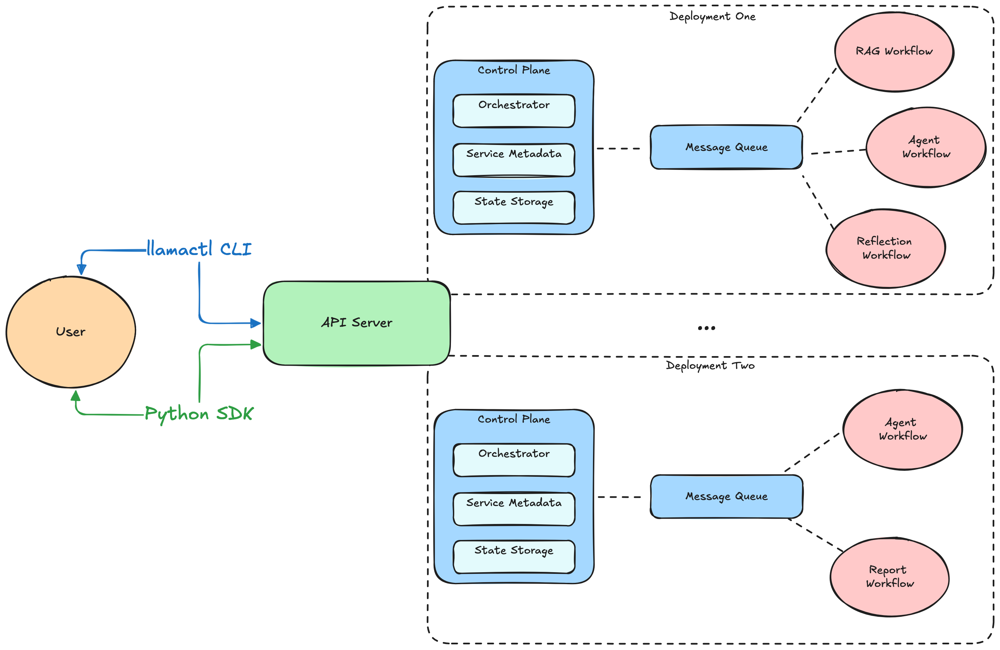

```plain
pip install llama_deploy==0.9.0
```

### 简单案例
1. 下载好模块之后，在本地添加一个src文件夹和一个workflow.py文件

workflow.py

```plain
import asyncio
from llama_index.core.workflow import Workflow, StartEvent, StopEvent, step


class EchoWorkflow(Workflow):
    """一个虚拟的工作流，只有一个步骤发送回给定的输入。"""

    @step()
    async def run_step(self, ev: StartEvent) -> StopEvent:
        message = str(ev.get("message", ""))
        return StopEvent(result=f"Message received: {message}")


# `echo_workflow` 会被LlamaDeploy导入
echo_workflow = EchoWorkflow()


async def main():
    print(await echo_workflow.run(message="Hello!"))


# 让这个脚本可以在shell中运行，这样我们就可以测试工作流的执行了
if __name__ == "__main__":
    asyncio.run(main())
```

先在命令行输入``python src/workflow.py``测试一下能不能本地运行

1. 接下来在创建一个deployment.yaml的文件来存放配置信息

```plain
name: QuickStart

control-plane:
  port: 8000

default-service: echo_workflow

services:
  echo_workflow:
    name: Echo Workflow
    # 我们告诉LlamaDeploy在哪里查找我们的工作流
    source:
      # 在本例中，我们指示LlamaDeploy查找本地文件系统
      type: local
      # 相对于此部署配置文件查找代码的路径。这假定在与配置文件相同的目录中有一个 src 文件夹，其中包含我们之前创建的 workflow.py 文件。
      name: ./src
    # 这里假设文件workflow.py包含一个名为“echo_workflow”的变量，其中包含我们的工作流实例
    path: src/workflow:echo_workflow
```

1. 先在本地启动一个API服务

```plain
python -m llama_deploy.apiserver
```

1. 在使用以下命令来将自己的工作流部署

```plain
llamactl deploy deployment.yml
```

1. 使用``llamactl``命令来调用我们的工作流

```plain
llamactl run --deployment QuickStart --arg message 'Hello from my shell!'
```

### RAG工作流案例
注意，需要先安装git

```plain
1.第一步创建一个空的文件夹，使用cmd命令跳转到新文件夹中

2.llamactl init或（llamactl init --name project-name --template basic）使用该命令创建基础的配置
    会生成对应的文件
        hello-deploy/
        ├── deployment.yml         
        ├── src/ # 这个文件需要手动创建
        │   └── workflow.py       
        └── ui/

3.再到文件夹中创建一个src文件夹，创建一个workflow.py 文件来存放RAG工作流

4.打开一个cmd窗口执行创建服务命令：python -m llama_deploy.apiserver

5.打开一个新的cmd创建执行（注意要到对应的文件夹里面）：llamactl deploy deployment.yml

6.使用python中的requests去通过http的方式调用对应的工作流

7.打开一个新的cmd窗口进行测试：llamactl run --deployment rag-deploy --arg file_path "D:\llm\LLMProject\LlamaIndex\data\小说.txt" --arg query "萧炎的爸爸是谁？"
```

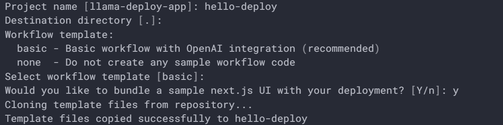

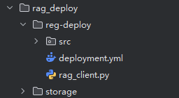

对应代码和配置

deployment.yml

```plain
# Deployment configuration for llama-deploy
#
# This file defines your deployment setup including:
# - Control plane configuration
# - Message queue settings
# - Services (workflows and UI components)
#
# For more information, see: https://github.com/run-llama/llama-deploy

name: rag-deploy

# The default service to use when no service is specified
default_service: example_workflow

# Service definitions
# Each service represents a workflow or component in your system
services:
  example_workflow:
    name: Example Workflow
    source:
      type: local
      location: src
      sync_policy: null
    import_path: src/workflow:workflow
    env:
      DASHSCOPE_API_KEY: sk-3ebd0a52a40541c2af7e592087c02e5f
      DASHSCOPE_BASE_URL: https://dashscope.aliyuncs.com/compatible-mode/v1
```

workflow.py

```plain
from llama_index.core import VectorStoreIndex, SimpleDirectoryReader, Settings, StorageContext, load_index_from_storage
from llama_index.core.workflow import (
    Context,
    Workflow,
    StartEvent,
    StopEvent,
    step,
    Event
)
from pathlib import Path

from llama_index.core.schema import NodeWithScore
from typing import List
from llama_index.embeddings.huggingface import HuggingFaceEmbedding
from llama_index.llms.dashscope import DashScope
from dotenv import load_dotenv
import os

load_dotenv()
# 配置全局设置
api_key = os.getenv("DASHSCOPE_API_KEY")
api_base_url = os.getenv("DASHSCOPE_BASE_URL")
model = "qwen-plus-2025-01-25"
Settings.llm = DashScope(model=model, api_key=api_key, api_base=api_base_url, is_chat_model=True, timeout=60)
Settings.embed_model = HuggingFaceEmbedding(model_name="D:\\llm\\Local_model\\BAAI\\bge-large-zh-v1___5")


class QueryEvent(Event):
    """查询事件"""
    query: str


class RetrievalEvent(Event):
    """检索事件"""
    nodes: List[NodeWithScore]
    query: str


class RAGWorkflow(Workflow):
    """RAG 工作流"""

    def __init__(self, **kwargs):
        super().__init__(**kwargs)

    def _check_existing_index(self, file_path: str) -> bool:
        """检查是否已存在索引"""
        persist_path = Path("./storage")
        if not persist_path.exists():
            return False

        # 检查索引文件是否存在
        required_files = ["docstore.json", "index_store.json", "vector_store.json"]
        if not all((persist_path / file).exists() for file in required_files):
            return False

        # 可选：检查文件修改时间，如果源文件更新则重建索引
        try:
            source_mtime = os.path.getmtime(file_path)
            index_mtime = os.path.getmtime(persist_path / "docstore.json")
            if source_mtime > index_mtime:
                print("源文件已更新，需要重建索引")
                return False
        except OSError:
            return False

        return True

    def _load_existing_index(self):
        """加载已存在的索引"""
        storage_context = StorageContext.from_defaults(persist_dir="./storage")
        return load_index_from_storage(storage_context)

    @step
    async def load_documents(self, ctx: Context, ev: StartEvent) -> QueryEvent:
        """步骤1: 加载文档并构建索引"""
        file_path = ev.get("file_path", "D:\llm\LLMProject\LlamaIndex\data\小说.txt")
        query = ev.get("query", "")
        print(f"加载文档: {file_path}")

        # 1. 检查是否已存在索引（避免重复构建）
        if self._check_existing_index(file_path):
            print("发现已存在的索引，直接加载...")
            index = self._load_existing_index()
            await ctx.store.set("index", index)
            print("索引加载完成")
            return QueryEvent(query=query)

        # 加载文档
        documents = SimpleDirectoryReader(input_files=[file_path]).load_data()

        # 构建向量索引
        index = VectorStoreIndex.from_documents(documents)

        # 存储到上下文中
        await ctx.store.set("index", index)

        print(f"加载 {len(documents)} 文档到索引中")

        # 返回查询事件，这里可以根据需要设置默认查询
        return QueryEvent(query=query)

    @step
    async def retrieve_documents(self, ctx: Context, ev: QueryEvent) -> RetrievalEvent:
        """步骤2: 检索相关文档"""
        if not ev.query:
            return StopEvent(result="请输入问题")

        print(f"检索要查询的文档: {ev.query}")

        # 从上下文获取索引
        index = await ctx.store.get("index")
        if not index:
            return StopEvent(result="没有找到索引。请先载入文件.")

        # 创建检索器
        retriever = index.as_retriever(similarity_top_k=5)

        # 检索相关节点
        try:
            nodes = await retriever.aretrieve(ev.query)
        except Exception as e:
            return StopEvent(result=f"检索出错: {e}")

        print(f"检索到 {len(nodes)} 个文档")

        return RetrievalEvent(query=ev.query, nodes=nodes)

    @step
    async def generate_response(self, ctx: Context, ev: RetrievalEvent) -> StopEvent:
        """步骤3: 生成回答"""
        print(f"根据问题响应答案: {ev.query}")

        # 从上下文获取索引
        index = await ctx.store.get("index")

        # 创建查询引擎
        query_engine = index.as_query_engine()

        # 生成回答
        try:
            response = await query_engine.aquery(ev.query)
        except Exception as e:
            return StopEvent(result=f"生成回答出错: {e}")
        print(response)
        return StopEvent(result=str(response))


# `echo_workflow` 会被LlamaDeploy导入
workflow = RAGWorkflow()


async def main():
    print(await workflow.run(file_path="../../../../data/小说.txt", query="萧炎的爸爸是谁？"))


# 让这个脚本可以在shell中运行，这样我们就可以测试工作流的执行了
if __name__ == "__main__":
    import asyncio
    asyncio.run(main())
```

调用服务代码

```plain
import requests
import json

def call_workflow_http():
    # 调用部署的工作流
    url = "http://localhost:4501/deployments/rag-deploy/tasks/run"
    # 将参数编码为JSON字符串
    input_data = {
        "file_path": r"D:\\llm\\LLMProject\\LlamaIndex\\data\\小说.txt",
        "query": "萧炎的爸爸是谁"
    }

    payload = {
        "input": json.dumps(input_data, ensure_ascii=False)
    }

    response = requests.post(url, json=payload)
    result = response.json()
    print(result)


if __name__ == '__main__':
    call_workflow_http()
```

# 评估
评估是对基于检索增强生成模型（RAG）的性能进行评估和全面分析的过程。也就是去判断RAG他的能力怎么样。RAG有检索和生成的两种能力，用于对话系统和问答等任务中。

任何RAG系统的有效性和性能都严重依赖于这两个核心组件：**检索器和生成器**。检索器必须高效地识别和检索最相关的文档，而生成器应该使用检索到的信息生成连贯、相关和准确的响应。在部署之前，对这些组件进行严格评估对于确保RAG模型的最佳性能和可靠性至关重要。

LlamaIndex 提供关键模块来评估生成结果的质量。还提供关键模块来评估检索质量。

## **评估指标**
**上下文相关性：**这个组件评估RAG系统的检索部分。它评估从大型数据集中准确检索到的文档。这里使用的度量指标包括精确度、召回率、MRR和MAP。

**忠实度（基于响应）：**这个组件属于响应评估。它检查生成的响应是否准确无误，并且基于检索到的文档。通过人工评估、自动事实检查工具和一致性检查等方法来评估忠实度。

**答案相关性：**这也是响应评估的一部分。它衡量生成的响应对用户的查询提供了多少有用的信息。使用的度量指标包括BLEU、ROUGE、METEOR和基于嵌入的评估。数据库中相关文档的总数之比

**精确度：**精确度衡量了检索到的文档的准确性。它是检索到的相关文档数量与检索到的文档总数之比。

**召回率：**召回率衡量了检索到的文档的覆盖率。它是检索到的相关文档数量与数据库中相关文档的总数之比。

**响应评估**的**忠实度**和**答案相关性**

```plain
from llama_index.core.evaluation import FaithfulnessEvaluator, RelevancyEvaluator
from llama_index.core import VectorStoreIndex, SimpleDirectoryReader
from LlamaIndex.加载模型 import get_llm

# 加载大模型和嵌入模型
llm, embed_model = get_llm()

# 加载文档
# 加载文档和构建索引
documents = SimpleDirectoryReader(input_files=["../data/小说.txt"]).load_data()
index = VectorStoreIndex.from_documents(documents)

# 方法1：使用同一个查询引擎（推荐）
query = "萧炎的爸爸是谁？"

# 创建查询引擎
query_engine = index.as_query_engine()

# 执行查询
response = query_engine.query(query)

# 从响应对象中获取源节点（这些是实际用于生成回答的上下文）
if hasattr(response, 'source_nodes') and response.source_nodes:
    # 使用实际参与回答生成的上下文
    contexts = [node.text for node in response.source_nodes]
else:
    # 如果响应对象没有源节点，则手动检索
    retriever = index.as_retriever()
    retrieved_nodes = retriever.retrieve(query)
    contexts = [node.text for node in retrieved_nodes]


# 初始化评估器
faithfulness_evaluator = FaithfulnessEvaluator(llm=llm)
relevancy_evaluator = RelevancyEvaluator(llm=llm)

print("\n--- 开始评估忠实度 (Relevancy) ---")
faithfulness_result = faithfulness_evaluator.evaluate(
    query=query,
    response=str(response),
    contexts=contexts  # 传入字符串列表
)

print(f"评估结果: {'通过' if faithfulness_result.passing else '未通过'}")
print(f"分数: {faithfulness_result.score}")
print(f"反馈: {faithfulness_result.feedback}")

print("\n--- 开始评估相关性 (Relevancy) ---")
relevancy_result = relevancy_evaluator.evaluate(
    query=query,
    response=str(response),
    contexts=contexts
)

print(f"评估结果: {'通过' if relevancy_result.passing else '未通过'}")
print(f"分数: {relevancy_result.score}")
print(f"反馈: {relevancy_result.feedback}")

# --- 4. 可选：批量评估 ---
print("\n--- 批量评估示例 ---")
queries = ["萧炎的爸爸是谁？", "萧炎的实力如何？"]

for q in queries:
    print(f"\n处理查询: {q}")
    # 创建查询引擎
    query_engine = index.as_query_engine()
    # 执行查询
    resp = query_engine.query(q)

    # 从响应对象中获取源节点（这些是实际用于生成回答的上下文）
    if hasattr(resp, 'source_nodes') and resp.source_nodes:
        # 使用实际参与回答生成的上下文
        ctxs = [node.text for node in resp.source_nodes]
    else:
        # 如果响应对象没有源节点，则手动检索
        retriever = index.as_retriever()
        retrieved_nodes = retriever.retrieve(query)
        ctxs = [node.text for node in retrieved_nodes]

    # 快速评估
    faith_result = faithfulness_evaluator.evaluate(
        query=q, response=str(resp), contexts=ctxs
    )
    rel_result = relevancy_evaluator.evaluate(
        query=q, response=str(resp), contexts=ctxs
    )

    print(f"忠实度: {faith_result.score:.2f}, 相关性: {rel_result.score:.2f}")
```

检索评估

```plain
from llama_index.core.node_parser import SentenceSplitter
from llama_index.core.evaluation import RetrieverEvaluator
from llama_index.core.evaluation import generate_question_context_pairs
from llama_index.core import VectorStoreIndex, SimpleDirectoryReader
from LlamaIndex.加载模型 import get_llm
import asyncio
import pandas as pd

# 加载大模型和嵌入模型
llm, embed_model = get_llm()


async def main():
    def display_results(name, eval_results):
        """显示evaluate的结果"""

        metric_dicts = []
        for eval_result in eval_results:
            metric_dict = eval_result.metric_vals_dict
            metric_dicts.append(metric_dict)

        full_df = pd.DataFrame(metric_dicts)

        columns = {
            "retrievers": [name],
            **{k: [full_df[k].mean()] for k in metrics},
        }

        metric_df = pd.DataFrame(columns)

        return metric_df

    # 加载文档
    documents = SimpleDirectoryReader(input_files=["../data/小说.txt"]).load_data()

    # 将文档解析为节点
    splitter = SentenceSplitter(chunk_size=512, chunk_overlap=20)
    nodes = splitter.get_nodes_from_documents(documents)

    # 传递嵌入模型
    index = VectorStoreIndex(nodes, embed_model=embed_model)
    retriever = index.as_retriever(similarity_top_k=2)

    qa_generate_prompt_tmpl = """
        上下文信息如下：
---------------------
{context_str}
---------------------

根据上述上下文信息，而非先验知识，仅基于以下查询生成问题。

您是一位教师/教授。您的任务是为即将到来的测验/考试准备{num_questions_per_chunk}道题目。题目应该在整个文档范围内具有多样化的性质。请将问题限制在所提供的上下文信息范围内。
    """

    print("正在生成评估数据集...")
    qa_dataset = generate_question_context_pairs(
        nodes, qa_generate_prompt_tmpl=qa_generate_prompt_tmpl, llm=llm, num_questions_per_chunk=2
    )

    # 保存数据集
    qa_dataset.save_json("pg_eval_dataset.json")

    # 平均倒数排名=mrr（最有用的文档排在第几位）， 命中率=hit_rate（检索的文档里，有没有包含正确答案的）， 精确度（检索回来的文档中，有几个是真正有用的）=precision
    metrics = ["hit_rate", "mrr", "precision"]
    # 创建检索器评估
    retriever_evaluator = RetrieverEvaluator.from_metric_names(
        metrics, retriever=retriever
    )
    # 开始评估
    eval_results = await retriever_evaluator.aevaluate_dataset(qa_dataset)
    # 显示结果
    print(display_results("top-1 eval", eval_results))


if __name__ == '__main__':
    asyncio.run(main())
```

## 使用RAGAS来进行评估
生成数据集

```plain
from llama_index.core.node_parser import SentenceSplitter
from llama_index.core import VectorStoreIndex
from datasets import Dataset
import pandas as pd


def generate_question_answer_pairs(llm, text):
    prompt = f"""
                你是一个文档理解助手。请根据以下内容，提出一个清晰的问题，并给出准确的答案。

                内容：
                {text}

                请按以下格式输出：
                Question: ...
                Answer: ...
            """
    response = llm.complete(prompt).text
    try:
        lines = response.strip().split("\n")
        question_line = None
        answer_line = None

        for line in lines:
            if line.startswith("Question:"):
                question_line = line
            elif line.startswith("Answer:"):
                answer_line = line

        if question_line and answer_line:
            question = question_line.replace("Question:", "").strip()
            answer = answer_line.replace("Answer:", "").strip()
            return question, answer
        else:
            return None, None
    except Exception as e:
        print(f"解析问答对时出错: {e}")
        return None, None


def get_ragas_datas(llm, documents):
    # 切分为句子粒度（用于提问）
    parser = SentenceSplitter(chunk_size=200, chunk_overlap=50)
    nodes = parser.get_nodes_from_documents(documents)

    # 构建索引
    index = VectorStoreIndex(nodes)

    # 获取检索器
    retriever = index.as_retriever(similarity_top_k=3)
    query_engine = index.as_query_engine()


    # 构造 RAGAS 数据格式
    ragas_records = []
    successful_count = 0
    failed_count = 0

    for i, node in enumerate(nodes[:3]):  # 可选：限制数量调试
        try:
            context = node.text.strip()

            # 跳过太短的文本
            if len(context) < 50:
                continue

            question, ground_truth = generate_question_answer_pairs(llm, context)

            if not question or not ground_truth:
                failed_count += 1
                print(f"节点 {i} 生成问答对失败")
                continue

            # 检索 top-k 作为 retrieved_context
            retrieved_nodes = retriever.retrieve(question)
            retrieved_contexts = [n.text.strip() for n in retrieved_nodes]

            # 确保数据格式正确
            record = {
                "question": str(question).strip(),
                "answer": str(query_engine.query(question)).strip(),
                "contexts": retrieved_contexts,  # 保持为列表格式
                "ground_truth": str(ground_truth).strip()
            }

            # 验证记录的完整性
            if all(record[key] for key in ["question", "ground_truth", "answer"]) and record["contexts"]:
                ragas_records.append(record)
                successful_count += 1
            else:
                failed_count += 1
                print(f"节点 {i} 数据不完整，跳过")

        except Exception as e:
            failed_count += 1
            print(f"处理节点 {i} 时出错: {e}")
            continue

    print(f"成功生成 {successful_count} 条记录，失败 {failed_count} 条")

    if not ragas_records:
        print("警告：没有生成任何有效记录")
        return None

    # 输出为 DataFrame
    df_ragas = pd.DataFrame(ragas_records)
    eval_dataset = Dataset.from_pandas(df_ragas)

    # 可选：保存到文件
    # df_ragas.to_json("ragas_dataset_llm.json", orient="records", force_ascii=False, indent=2)

    print("成功生成 RAGAS 格式数据（带 LLM 问答对）")
    return eval_dataset
```

评估代码

```plain
from llama_index.embeddings.huggingface import HuggingFaceEmbedding
from llama_index.llms.dashscope import DashScope
from 生成RAGAS数据集 import get_ragas_datas
from dotenv import load_dotenv
import os
from langchain_huggingface import HuggingFaceEmbeddings
from llama_index.core import SimpleDirectoryReader, Settings
from langchain_openai import ChatOpenAI
from ragas import evaluate
from ragas.metrics import (
    answer_relevancy,
    faithfulness,
    context_recall,
    context_precision,
)

load_dotenv()

# 加载大模型和嵌入模型
api_key = os.getenv("DASHSCOPE_API_KEY")
api_base_url = os.getenv("DASHSCOPE_BASE_URL")
"""
LlamaIndex + RAGAS 评估案例
这个例子展示了如何使用LlamaIndex构建RAG系统，并用RAGAS进行评估
"""


class RAGEvaluator:
    def __init__(self):
        # 设置LlamaIndex配置 - 使用Qwen模型
        self.llm = DashScope(model_name="qwen-plus-1127", api_key=api_key, api_base=api_base_url)
        Settings.llm = self.llm

        # 加载本地的嵌入模型
        self.embed_model = HuggingFaceEmbedding(model_name="D:\\llm\\Local_model\\BAAI\\bge-large-zh-v1___5")
        # 设置默认的向量模型为本地模型
        Settings.embed_model = self.embed_model

        # 创建RAGAS适配器
        self.ragas_llm = ChatOpenAI(
            model="qwen-plus-1127",
            api_key=api_key,
            base_url=api_base_url,
            temperature=0.1
        )
        # RAGAS需要langchain格式的嵌入模型
        self.ragas_embeddings = HuggingFaceEmbeddings(
            model_name="D:\\llm\\Local_model\\BAAI\\bge-large-zh-v1___5",
            model_kwargs={'trust_remote_code': True}
        )

    def evaluate_with_ragas(self, eval_dataset):
        """使用RAGAS评估RAG系统"""
        print("开始RAGAS评估...")

        # 定义评估指标
        metrics = [
            answer_relevancy,  # 答案相关性
            faithfulness,  # 忠实度
            context_recall,  # 上下文召回率
            context_precision,  # 上下文精确度
        ]

        # 使用RAGAS评估 - 需要指定LLM和Embeddings
        result = evaluate(
            dataset=eval_dataset,
            metrics=metrics,
            llm=self.ragas_llm,
            embeddings=self.ragas_embeddings,
        )

        return result


def main():
    """主函数"""
    try:
        # 初始化评估器
        evaluator = RAGEvaluator()

        # 加载文档和构建索引
        documents = SimpleDirectoryReader(input_files=["../data/小说.txt"]).load_data()

        eval_dataset = get_ragas_datas(llm=Settings.llm, documents=documents)
        # 显示生成的回答
        print("\n=== 生成的数据 ===")
        print(eval_dataset.to_pandas().head())

        # 使用RAGAS评估
        result = evaluator.evaluate_with_ragas(
            eval_dataset
        )
        results_df = result.to_pandas()
        results_df.to_csv("ragas_evaluation_results.csv", index=False)
        print("\n详细结果已保存到 ragas_evaluation_results.csv")
    except Exception as e:
        print(f"评估过程中出现错误: {str(e)}")


if __name__ == "__main__":
    main()
```

