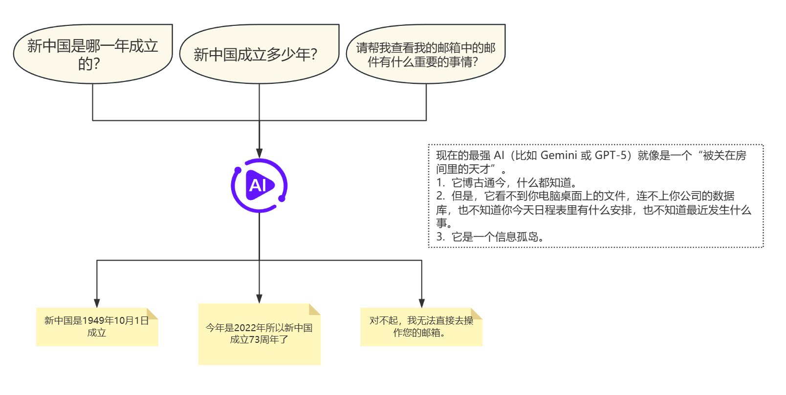
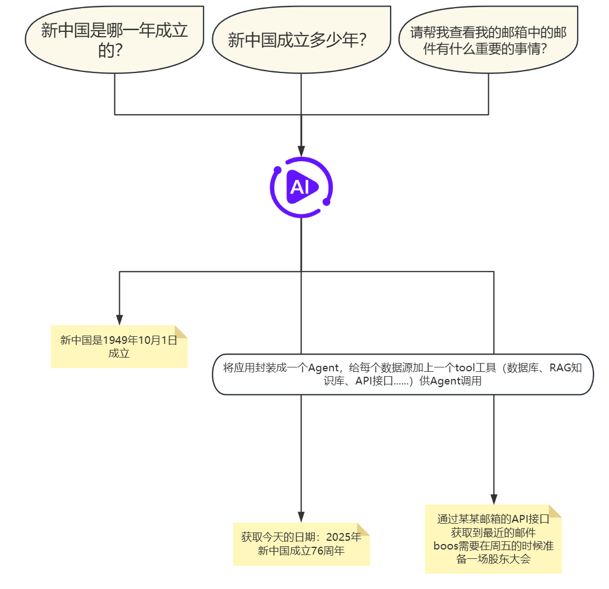
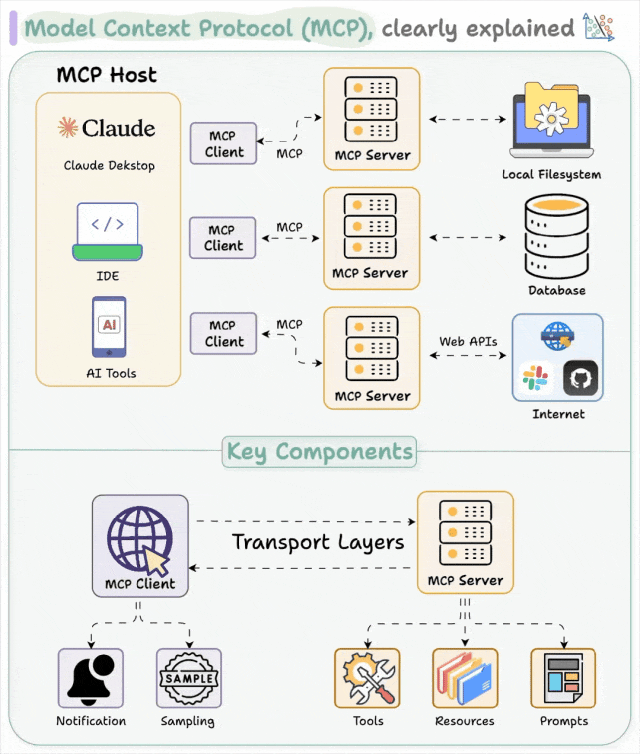
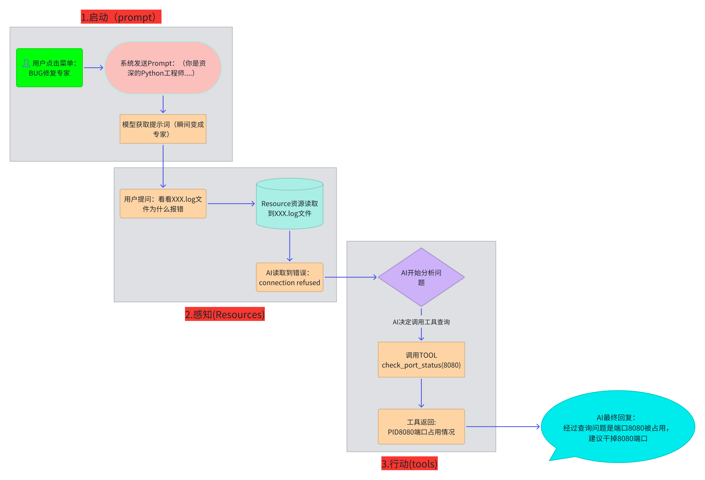
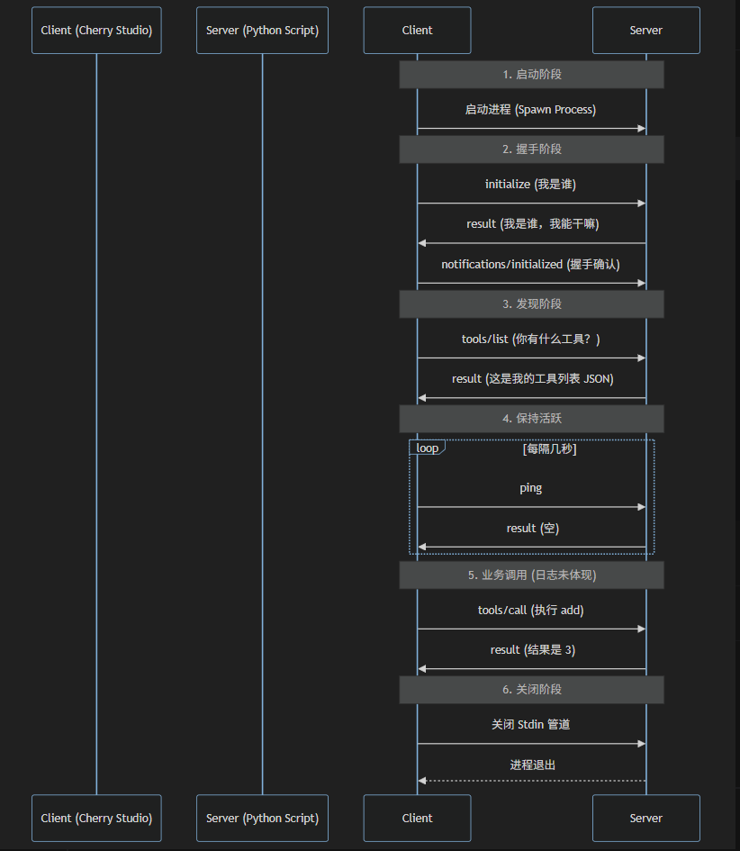
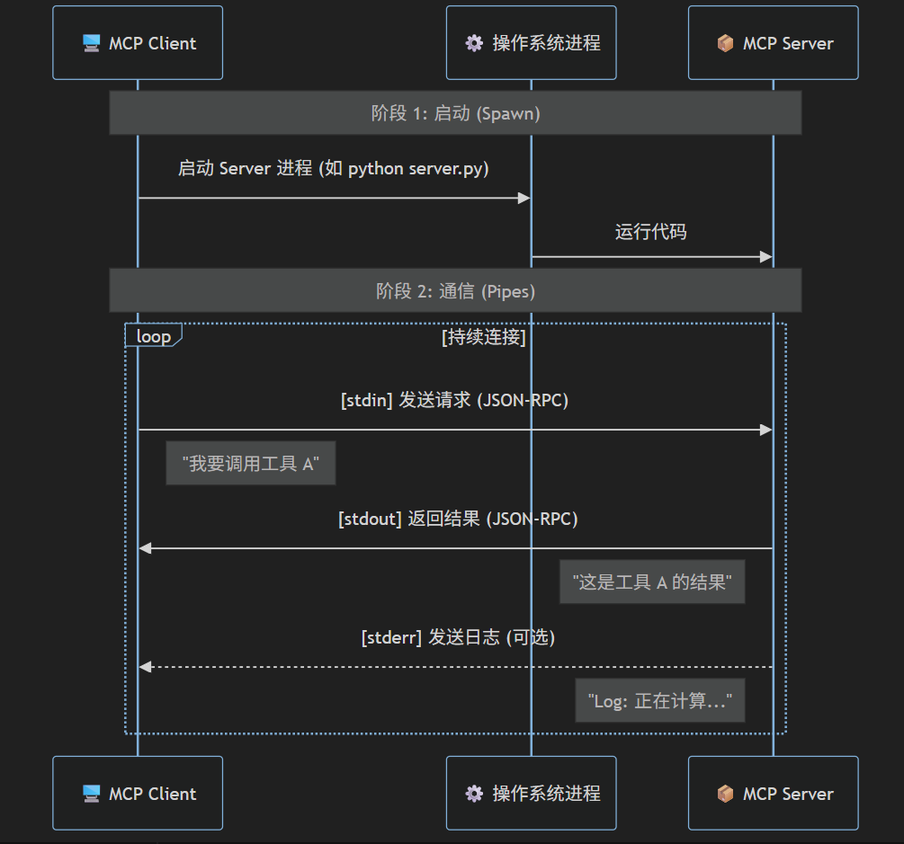
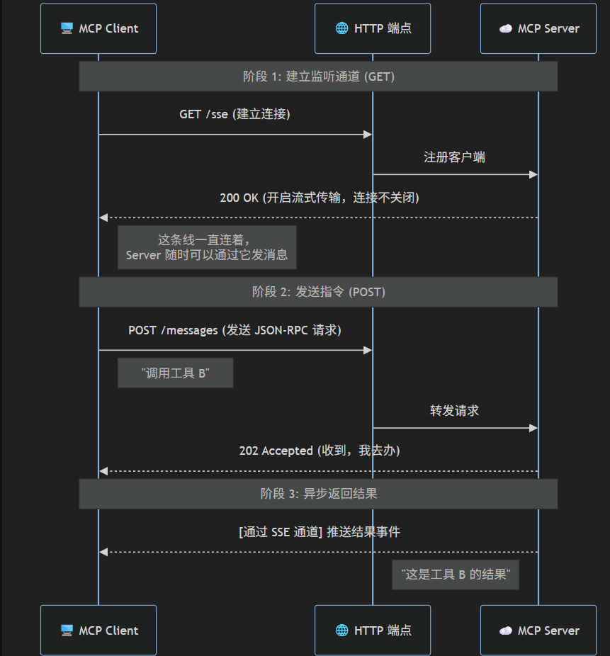
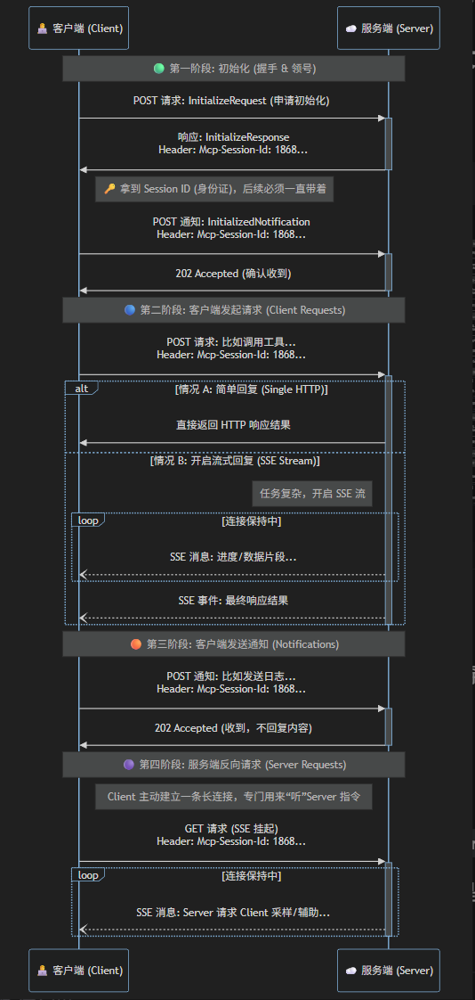

# 什么是模型上下文协议（MCP）？
<!-- 这是一张图片，ocr 内容为： -->


<!-- 这是一张图片，ocr 内容为： -->


**模型上下文协议 (MCP) **是一个标准化的人工智能应用架构框架，它促进了人工智能系统与各种数据源、工具和服务之间的通信。正如 USB-C 为设备提供通用接口以便与多种配件交互一样，MCP 为人工智能应用提供了一种标准化的方式，使其能够连接到不同的工具、数据库和外部服务。

MCP 的核心是客户端-服务器架构，它使 AI 应用能够发现、访问和利用各种功能，而无需进行硬编码集成。这种设计为 AI 应用创建了一个更具可扩展性、可维护性和稳健性的生态系统

# 为什么要使用MCP？
<!-- 这是一张图片，ocr 内容为： -->


但是如果每有一个数据源过来就添加一个工具，前期还能支撑过来，等数据源高达数十上百，就会发现太乱了，东西太多了。而且每个LLM都不一定适配之前写的工具，也不能保证百分百复用。**带来的后果就是不同的大模型需要写不同的tool，工作量太多，太乱。**

<!-- 这是一张图片，ocr 内容为： -->


**所以说MCP 就是 AI 界的 USB 标准：**

+ **电脑** = 大模型（Client，如 Claude Desktop, IDE）。
+ **USB 设备** = 你的数据源（Server，如本地文件、数据库、Slack）。
+ **MCP 协议** = 那个通用的 USB 插口形状和传输规则。

只要你的数据源支持 MCP，任何大模型都能直接“插”上去读取数据，不需要重复造轮子！

# MCP的构成
MCP 采用客户端-服务器架构，其中 MCP 主机（例如Claude Code或cherry stodio、cursor等 AI 应用）与一个或多个 MCP 服务器建立连接。MCP 主机通过为每个 MCP 服务器创建一个 MCP 客户端来实现这一点。每个 MCP 客户端与其对应的 MCP 服务器保持一对一的专用连接。

**MCP架构的关键组成包括：**

+ MCP 主机：用于协调和管理一个或多个 MCP 客户端的 AI 应用程序
+ MCP 客户端：一个维护与 MCP 服务器连接并从 MCP 服务器获取上下文以供 MCP 主机使用的组件。
+ MCP 服务器：一个为 MCP 客户端提供上下文信息的程序

<!-- 这是一张图片，ocr 内容为： -->


**MCP由两层组成：**

+ 数据层：定义了基于 JSON-RPC 的客户端-服务器通信协议，包括生命周期管理和核心元素，如工具、资源、提示和通知。
+ 传输层：定义了客户端和服务器之间进行数据交换的通信机制和通道，包括特定于传输的连接建立、消息帧和授权。

## 核心内容
MCP 协议里有三个最重要的概念，我们称之为“MCP 三剑客”。

<!-- 这是一张图片，ocr 内容为：.启动(PROMPT) 用户点击菜单: 系统发送PROMPT:(你是资 BUG修复专家 深的PYTHON工程师... 模型获取提示词(瞬间变成 专家) 用户提问:看看XXX.LOG文 RESOURCE资源读取 件为什么报错 到XXX.LOG文件 AI开始分析问 AI读取到错误: 题 CONNECTION REFUSED 2.感知(RESOURCES) AI决定调用工具查询 调用TOOL CHECK_PORT_STATUS(8080) AI最终回复: 工具返回: 经过查询问题是端口8080被占用, PID8080端口占用情况 建议干掉8080端口 3.行动(TOOLS) -->


### **资源 (Resources) —— AI 的 档案柜与参考书**
**“AI 不知道你的秘密，除非你把档案给它看。”**

+ **通俗解释：** 实习生脑子里装满了世界历史（训练数据），但他不知道**你公司**昨天卖了多少货，也不知道**你电脑**里那个报错的文件长什么样。
+ **关键点：**
    - 它是**静态的、被动的**。就像你把一份文件放在桌子上让实习生看。
    - 它解决了 AI 的**幻觉**问题——AI 不再瞎编，而是基于你提供的真实文件来回答。
+ **一句话总结：** 它是 AI 的**私有知识库**。

### **工具 (Tools) —— AI 的 办公电脑与电话**
**“光看不练假把式，AI 得能动手。”**

+ **通俗解释：** 实习生看完了档案（Resource），发现数据不对，他得**动手**算一下（调用计算器），或者**打电话**问问气象局明天下不下雨（调用天气 API）。
+ **关键点：**
    - 它是**动态的、主动的**。这不仅仅是获取信息，更是**产生副作用**（比如发邮件、写数据库、执行代码）。
    - 这是 AI 最强大的地方——它打破了对话框的限制，能去外部世界干活了。
+ **一句话总结：** 它是 AI 的**执行义肢**。

### **提示词 (Prompts) —— AI 的 岗位说明书 (SOP)**
**“别让 AI 猜，直接告诉它该扮演谁。”**

+ **通俗解释：** 实习生刚来，你不能只对他说“干活”。你得给他一本员工手册：“你是客服，遇到投诉要道歉；你是程序员，写代码要写注释。”
+ **为什么要把它独立出来？**
    - **为了效率：** 你不想每次都要打几百个字去教 AI 怎么做。
    - **为了标准化：** 团队里每个人点击“代码审查”按钮，AI 的标准都是统一的，不会因为张三问得好、李四问得差，结果就不一样。
+ **一句话总结：** 它是 AI 的**人设开关**。

# MCP Server
MCP Server 是一个轻量级的程序，它的唯一使命就是**暴露能力**。

它通常专注于某个特定的领域（比如“文件操作”、“GitHub 管理”或“数据库查询”）。它不关心是哪个 AI 模型在调用它，也不关心用户是用什么软件（Cursor 还是 Claude Desktop）在操作，它只关心一件事：**“只要你用 MCP 协议发指令，我就帮你执行并返回结果。”**

## 工具
这是 Server 允许 AI 执行的**主动操作**。

+ **通俗理解**：就像你给 AI 装上了“手”。AI 可以通过这些工具去**改变**世界或**计算**结果。
+ **例子**：
    - `calculate_sum()`：帮我算个账。
    - `fetch_weather(city)`：帮我查查北京的天气。
    - `restart_server()`：帮我重启一下服务。
+ **特点**：这是“可执行”的，通常需要 AI 填写参数（比如告诉工具查哪个城市）。**这是最强大的功能。**

## 资源
这是 Server 提供给 AI 的**被动数据**。

+ **通俗理解**：就像图书馆里的书或你电脑里的记事本。AI 只能**读**，不能改。
+ **例子**：
    - 读取一个日志文件 (`system.log`)。
    - 查看数据库里的一张表。
    - 获取当前的屏幕截图。
+ **特点**：这是“只读”的，用来给 AI 提供上下文背景<font style="color:rgb(143,149,158);">。</font>

## 提示词
这是 Server 预先写好的**对话模板**。

+ **通俗理解**：就像是餐厅的点菜菜单。用户不需要每次都绞尽脑汁想怎么问 AI，Server 直接提供一个“最佳提问模板”。
+ **例子**：
    - Server 提供一个名为 `analyze-error` 的模板。
    - 用户在界面上一点这个模板，它就会自动把“请帮我分析以下错误日志，并给出修复建议...”这段话填好，甚至自动附上相关的日志资源。
+ **特点**：帮助用户更高效地使用 AI，让复杂的任务变成“一键执行”。

创建自己的第一个`MCP Server`

```plain
pip install mcp
```

```plain
from mcp.server.fastmcp import FastMCP
from typing import Annotated
from pydantic import Field

# ====================================
# FastMCP 是官方提供的一个高层（High-level）封装框架
# 能够快速的创建MCP Server，他是利用问的字符串和类型提示自动生成配置
# ====================================
# 1. 初始化
mcp = FastMCP("fast-health-calculator")


# 2. 定义工具
# 注意：FastMCP 会自动读取函数参数类型 (a: float, b: float) 生成 Schema
# 也会自动读取文档字符串 ("计算两个数字的和") 作为工具描述

@mcp.tool()
def add(a: float, b: float) -> float:
    """计算两个数字的和"""
    return a + b


@mcp.tool()
def calculate_bmi(weight_kg: float, height_m: float) -> str:
    """
    计算 BMI 指数并返回健康建议。
    Args:
        weight_kg: 体重 (公斤)
        height_m: 身高 (米)
    """
    if height_m <= 0:
        return "错误：身高必须大于 0"

    bmi = weight_kg / (height_m ** 2)
    result = f"BMI 指数: {bmi:.2f}"

    if bmi < 18.5:
        return f"{result} (偏瘦)"
    elif bmi < 24.9:
        return f"{result} (正常)"
    else:
        return f"{result} (偏胖)"


# 模拟一份静态数据
HEALTH_GUIDELINES = """
1. 每天保持 8 小时睡眠。
2. 多吃蔬菜水果，少吃糖。
3. 每周至少运动 150 分钟。
"""


# 定义资源：使用自定义的 URI 协议头 (health://)
@mcp.resource("health://guidelines", mime_type="text/plain")
def get_health_guidelines() -> str:
    """获取通用的健康生活指南"""
    return HEALTH_GUIDELINES


# 定义提示词模板
@mcp.prompt()
def analyze_my_health(
    name: Annotated[str, Field(description="用户的姓名或昵称")],
    weight: Annotated[float, Field(description="体重，单位：公斤 (kg)")],
    height: Annotated[float, Field(description="身高，单位：米 (m)")]
) -> str:
    """创建一个让 AI 分析个人健康状况的提示词"""
    return f"""
    请扮演一位专业的健康顾问。
    用户 {name} 的体重是 {weight}kg，身高是 {height}m。

    请执行以下步骤：
    1. 使用 'calculate_bmi' 工具计算他的 BMI。
    2. 读取 'health://guidelines' 资源，结合指南给出建议。
    """


# ====================================
# 方法2：使用 Low-Level API (底层原理)
# 这是传统写法。你需要手动构建 JSON Schema，手动解析参数，手动分发路由。虽然繁琐，但能让你看清协议底层到底在传什么。
# 为什么需要学习底层写法呢？
# 仅当你需要在运行时动态生成工具（而不是写死函数）或精细控制协议生命周期（如自定义鉴权、复杂订阅）时，才需要底层写法提供的极致控制权。
# ====================================
# import asyncio
# from mcp.server import Server
# from mcp.server.stdio import stdio_server
# import mcp.types as types
#
# # 模拟一份静态数据
# HEALTH_GUIDELINES = """
# 1. 每天保持 8 小时睡眠。
# 2. 多吃蔬菜水果，少吃糖。
# 3. 每周至少运动 150 分钟。
# """
#
# # 1. 初始化服务器
# server = Server("low-level-calculator")
#
#
# # 2. 手动定义工具列表 (Schema)
# # 必须显式写出 JSON 结构，非常容易写错
# @server.list_tools()
# async def handle_list_tools() -> list[types.Tool]:
#     return [
#         types.Tool(
#             name="add",
#             description="计算两个数字的和",
#             inputSchema={
#                 "type": "object",
#                 "properties": {
#                     "a": {"type": "number", "description": "第一个数字"},
#                     "b": {"type": "number", "description": "第二个数字"},
#                 },
#                 "required": ["a", "b"],
#             },
#         ),
#         types.Tool(
#             name="calculate_bmi",
#             description="计算 BMI 指数",
#             inputSchema={
#                 "type": "object",
#                 "properties": {
#                     "weight_kg": {"type": "number", "description": "体重(kg)"},
#                     "height_m": {"type": "number", "description": "身高(m)"},
#                 },
#                 "required": ["weight_kg", "height_m"],
#             },
#         ),
#     ]
#
#
# # 3. 手动处理调用逻辑 (路由)
# @server.call_tool()
# async def handle_call_tool(
#         name: str,
#         arguments: dict | None
# ) -> list[types.TextContent]:
#     if name == "add":
#         # 需要手动从字典中提取参数
#         a = arguments.get("a")
#         b = arguments.get("b")
#         result = a + b
#         return [types.TextContent(type="text", text=str(result))]
#
#     elif name == "calculate_bmi":
#         weight = arguments.get("weight_kg")
#         height = arguments.get("height_m")
#
#         if height <= 0:
#             return [types.TextContent(type="text", text="错误：身高必须大于 0")]
#
#         bmi = weight / (height ** 2)
#         return [types.TextContent(type="text", text=f"BMI: {bmi:.2f}")]
#
#     else:
#         raise ValueError(f"未知工具: {name}")
#
# # 手动定义Resources - 手动处理 URI 路由
# @server.list_resources()
# async def handle_list_resources() -> list[types.Resource]:
#     return [
#         types.Resource(
#             uri="health://guidelines",
#             name="健康指南",
#             description="通用的健康生活建议文本",
#             mimeType="text/plain"
#         )
#     ]
#
# @server.read_resource()
# async def handle_read_resource(uri: str) -> str | bytes:
#     # 必须手动判断 URI 是否匹配
#     if uri == "health://guidelines":
#         return HEALTH_GUIDELINES
#     raise ValueError(f"未找到资源: {uri}")
#
#
# # 手动定义Prompts (提示词模板) - 手动构建消息结构
# @server.list_prompts()
# async def handle_list_prompts() -> list[types.Prompt]:
#     return [
#         types.Prompt(
#             name="analyze_my_health",
#             description="分析用户的健康状况",
#             arguments=[
#                 types.PromptArgument(name="name", description="用户姓名", required=True),
#                 types.PromptArgument(name="weight", description="体重(kg)", required=True),
#                 types.PromptArgument(name="height", description="身高(m)", required=True),
#             ]
#         )
#     ]
#
#
# @server.get_prompt()
# async def handle_get_prompt(name: str, arguments: dict | None) -> types.GetPromptResult:
#     if name == "analyze_my_health":
#         user_name = arguments.get("name")
#         w = arguments.get("weight")
#         h = arguments.get("height")
#
#         # 返回标准的消息结构
#         return types.GetPromptResult(
#             messages=[
#                 types.PromptMessage(
#                     role="user",
#                     content=types.TextContent(
#                         type="text",
#                         text=f"我是 {user_name}，体重{w}，身高{h}。请帮我计算BMI并根据健康指南给出建议。"
#                     )
#                 )
#             ]
#         )
#     raise ValueError(f"未知提示词: {name}")
#
#
# # 4. 启动循环
# async def main():
#     async with stdio_server() as (read, write):
#         await server.run(read, write, server.create_initialization_options())

# 3. 运行
if __name__ == "__main__":
    mcp.run()

    # asyncio.run(main())
```

**MCP的客户端和服务端交互通信通过log查看**

```plain
import sys
import subprocess
import threading
import os
import time

# ================= 配置区域 =================
TARGET_SCRIPT = "first_server.py"

# 1. 确保日志路径绝对正确 (锁定在 log.py 同级目录)
CURRENT_DIR = os.path.dirname(os.path.abspath(__file__))
LOG_FILE = os.path.join(CURRENT_DIR, "mcp_traffic.log")


# ===========================================

def log_message(direction, message):
    """强力日志记录：写文件 + 打印到控制台"""
    timestamp = time.strftime("%H:%M:%S", time.localtime())
    log_line = f"[{timestamp}] {direction}: {message}\n"

    try:
        # 模式 'a' (追加), encoding='utf-8'
        # buffering=1 表示行缓冲，确保每行都写入
        with open(LOG_FILE, "a", encoding="utf-8") as f:
            f.write(log_line)
            f.flush()  # <--- 关键：强制刷入硬盘
            os.fsync(f.fileno())  # <--- 关键：强制操作系统存盘
    except Exception as e:
        # 如果写文件失败，至少打印出来
        sys.stderr.write(f"日志写入失败: {e}\n")


def forward_stream(source, dest, direction):
    try:
        # 记录流已开启
        log_message("SYSTEM", f"开始监听流: {direction}")

        while True:
            # 逐字节读取，防止 readline 卡死
            line = source.readline()
            if not line:
                break

            # 1. 记录日志
            try:
                decoded = line.decode('utf-8').strip()
                if decoded:
                    log_message(direction, decoded)
            except:
                log_message(direction, f"<Binary: {line}>")

            # 2. 转发数据
            dest.write(line)
            dest.flush()  # <--- 关键：立刻转发给对方

    except Exception as e:
        log_message("ERROR", f"流转发异常 ({direction}): {e}")
    finally:
        log_message("SYSTEM", f"流已关闭: {direction}")
        source.close()


def main():
    # 0. 记录启动信息
    log_message("SYSTEM", f"代理脚本启动。日志路径: {LOG_FILE}")

    python_exe = sys.executable
    script_path = os.path.join(CURRENT_DIR, TARGET_SCRIPT)

    log_message("SYSTEM", f"准备启动目标脚本: {script_path}")

    if not os.path.exists(script_path):
        log_message("FATAL", f"找不到文件: {script_path}")
        return

    try:
        # 启动真实的 MCP 服务器进程
        process = subprocess.Popen(
            [python_exe, script_path],
            stdin=subprocess.PIPE,
            stdout=subprocess.PIPE,
            stderr=subprocess.PIPE,
            bufsize=0  # 无缓冲
        )
        log_message("SYSTEM", f"目标进程已启动 PID: {process.pid}")
    except Exception as e:
        log_message("FATAL", f"启动子进程失败: {e}")
        return

    # 启动线程
    t1 = threading.Thread(target=forward_stream, args=(sys.stdin.buffer, process.stdin, "Claude -> Server"))
    t2 = threading.Thread(target=forward_stream, args=(process.stdout, sys.stdout.buffer, "Server -> Claude"))

    def log_stderr():
        for line in iter(process.stderr.readline, b''):
            log_message("Server ERROR", line.decode('utf-8', errors='ignore').strip())

    t3 = threading.Thread(target=log_stderr)

    t1.daemon = True
    t2.daemon = True
    t3.daemon = True

    t1.start()
    t2.start()
    t3.start()

    process.wait()
    log_message("SYSTEM", "目标进程已退出")


if __name__ == "__main__":
    # 初始化日志文件
    with open(LOG_FILE, "w", encoding="utf-8") as f:
        f.write(f"=== 新的会话开始于 {time.strftime('%Y-%m-%d %H:%M:%S')} ===\n")
    main()
```

<!-- 这是一张图片，ocr 内容为： -->


## MCP的传输模式
### 1. Stdio (标准输入输出)
**定位：本地集成的默认标准**

这是 MCP 最基础、最常用的模式，主要用于像 Claude Desktop、Cursor 或 IDE 这样的桌面应用连接本地运行的脚本。

+ **工作原理**：
    - 客户端作为父进程，启动服务器脚本（子进程）。
    - **发送**：客户端将 JSON-RPC 消息写入服务器的 `stdin`（标准输入）。
    - **接收**：服务器将处理结果打印到 `stdout`（标准输出）。
    - **日志**：服务器的调试信息必须打印到 `stderr`（标准错误），否则会破坏通信协议。
+ **生命周期**：
    - 连接与进程绑定。进程结束，连接即断开。
+ **适用场景**：
    - 本地开发。
    - 单机工具（如本地文件操作、本地数据库访问）。

<!-- 这是一张图片，ocr 内容为： -->


---

### 2. HTTP with SSE (Server-Sent Events)
**定位：过渡期的 Web 标准 (Legacy / Deprecated)**

这是为了兼容浏览器限制而设计的早期远程通信方案。它的核心特征是**“双通道、收发分离”**。

+ **工作原理**：
    - **建立会话 (GET /sse)**：
        1. 客户端发起 GET 请求连接 SSE 端点。
        2. 服务器返回一个唯一的 **Session ID**。
        3. 这条连接保持打开，服务器通过它推送（Push）消息给客户端。
    - **发送指令 (POST /messages)**：
        1. 客户端通过独立的 POST 请求发送 JSON-RPC 消息。
        2. **关键点**：必须在 URL 参数或 Body 中带上刚才的 **Session ID**，否则服务器不知道你是谁。
+ **缺点**：
    - **状态管理复杂**：服务器必须维护 Session 状态。
    - **鉴权受限**：SSE (GET) 难以携带复杂的 Auth Header。
    - **连接脆弱**：容易出现“能发不能收”的半连接状态。

<!-- 这是一张图片，ocr 内容为： -->


---

### 3. Streamable HTTP (新一代标准)
**定位：远程服务的终极形态 (Protocol 2024-11-05+)**

这是官方文档推荐用来取代 SSE 的新标准。它利用 HTTP 的流式特性，实现了**“单通道、全双工模拟”**。

+ **工作原理**：
    - **统一入口**：不再区分 SSE 和 Message 端点，通常只有一个统一的 Endpoint（如 `/mcp`）。
    - **消息封装**：
        * 客户端发送 POST 请求，Body 中包含 JSON-RPC 消息。
        * 服务器保持连接不关闭，将响应逐行流式传回。
    - **无状态化**：因为请求和响应在同一个 HTTP 上下文中，服务器不需要维护复杂的 Session ID 映射。
+ **核心优势**：
    - **防火墙友好**：使用标准的 HTTP POST，更容易穿透企业代理。
    - **鉴权灵活**：完全支持标准的 HTTP Header（如 `Authorization: Bearer ...`）。
    - **架构简单**：对于负载均衡器（Load Balancer）和网关更加透明。

<!-- 这是一张图片，ocr 内容为： -->


# MCP Client
**Client（客户端）** 扮演着**指挥官**和**桥梁**的关键角色。简单来说，它是连接“大脑”（大语言模型/LLM）与“手脚”（MCP Server 提供的工具和数据）的中间枢纽。

**Client 的主要工作**就是代表宿主应用（Host）去管理与各种 Server 的连接，并将 Server 的能力“翻译”给大模型听，同时把大模型的指令“传达”给 Server 执行。

## 诱导 / 信息引出
**“通过 UI 界面，协助用户完成复杂的指令。”**

+ **概念：** Server 提供一个任务模板（Prompt），Client 负责将这个模板渲染成用户界面（UI），**引导**用户填入必要的参数，然后将填好的内容交给 AI。
+ **作用：**
    - Server 提供了一个 `git-commit` 的 Prompt。
    - Client 弹出一个窗口问用户：“你想提交什么更改？（参数1）”、“提交信息写什么？（参数2）”。
    - 用户填完后，Client 把这些信息打包发给 LLM。
+ **Client 的职责：**
    - **发现：** 获取 Server 提供了哪些 Prompts。
    - **渲染：** 当用户选择某个 Prompt 时，Client 要能画出对应的输入框或表单。
    - **提交：** 将用户输入的内容（Elicited info）作为上下文发送给 LLM。

## 根 / 资源边界
**“定义 Server 可以访问哪些数据。”**

+ **概念：** Client 需要告诉 Server：“这是我的工作区（Workspace），你只能在这个范围内读取文件。”
+ **作用：** 它是 MCP 的**安全基石**。如果没有 Roots，Server 就无法知道它应该在哪个文件夹下工作，或者可能会越权访问用户隐私。
+ **Client 的职责：** 维护一个允许访问的文件路径列表，并在初始化时同步给 Server。

## 采样 / 借用大脑
**“允许 Server 使用 Client 的 AI 能力。”**

+ **概念：** 这是一个反向操作。通常是 Client 调用 Server，但 Sampling 允许 Server 反过来请求 Client：“请借我用一下你的 LLM，帮我处理这段数据。”
+ **作用：** 赋予了工具**Agentic（代理）** 的能力，让工具不再是死板的代码，而是具备了一定的推理能力（例如：Server 抓取网页后，自己调用 AI 生成摘要）。
+ **Client 的职责：** 接收 Server 的采样请求，转发给 LLM，并将生成的文本返回给 Server。

**通过代码创建MCP Client**

```plain
import asyncio
import sys
from fastmcp import Client

# ==========================================
# 配置部分
# ==========================================
# 这里指定要启动的 Server 脚本路径
SERVER_SCRIPT = "first_server.py"

# 获取当前 python 解释器路径
python_path = sys.executable
client = Client(SERVER_SCRIPT)

async def main():
    async with client:
        await client.ping()
        print("✅ 连接成功！会话已就绪。\n")

        # ==========================================
        # 场景 A: 使用工具 (Tools) - AI 的双手
        # ==========================================
        print("--- 🛠️ 测试工具调用 (Tools) ---")

        # A1. 列出可用工具
        tools = await client.list_tools()
        print(f"发现 {len(tools)} 个工具: {[t.name for t in tools]}")

        # A2. 调用 add 工具
        print("\n>> 调用 add(a=10, b=5.5)...")
        result_add = await client.call_tool("add", arguments={"a": 10, "b": 5.5})
        print(f"计算结果: {result_add.content[0].text}")

        # A3. 调用 calculate_bmi 工具
        print("\n>> 调用 calculate_bmi(weight=70, height=1.75)...")
        result_bmi = await client.call_tool("calculate_bmi", arguments={"weight_kg": 70, "height_m": 1.75})
        print(f"BMI 结果: {result_bmi.content[0].text}")

        # ==========================================
        # 场景 B: 读取资源 (Resources) - AI 的眼睛
        # ==========================================
        print("\n--- 👁️ 测试资源读取 (Resources) ---")

        # B1. 列出可用资源
        resources = await client.list_resources()
        print(f"发现资源: {[r.uri for r in resources]}")

        # B2. 读取具体资源内容
        target_uri = "health://guidelines"
        print(f"\n>> 读取资源内容: {target_uri}")
        try:
            # read_resource 返回的是一个列表，因为一个 URI 可能包含多个数据块
            res_content = await client.read_resource(target_uri)
            text = res_content[0].text
            print(f"资源内容预览:\n{text.strip()}")
        except Exception as e:
            print(f"读取失败: {e}")

        # ==========================================
        # 场景 C: 获取提示词 (Prompts) - AI 的剧本
        # ==========================================
        print("\n--- 📜 测试提示词模板 (Prompts) ---")

        # C1. 列出可用提示词
        prompts = await client.list_prompts()
        print(f"发现提示词: {[p.name for p in prompts]}")

        # C2. 获取填充后的提示词
        prompt_name = "analyze_my_health"
        print(f"\n>> 获取提示词: {prompt_name} (参数: Alice, 60kg, 1.65m)")

        prompt_result = await client.get_prompt(
            prompt_name,
            arguments={"name": "Alice", "weight": "60", "height": "1.65"}
        )

        # 打印生成的剧本内容
        message = prompt_result.messages[0]
        print(f"生成的 Prompt 角色: {message.role}")
        print(f"生成的 Prompt 内容:\n{message.content.text}")

        print("\n✅ 所有测试完成，断开连接。")


if __name__ == "__main__":
    asyncio.run(main())
```

# 实践
放到网盘的课件中

