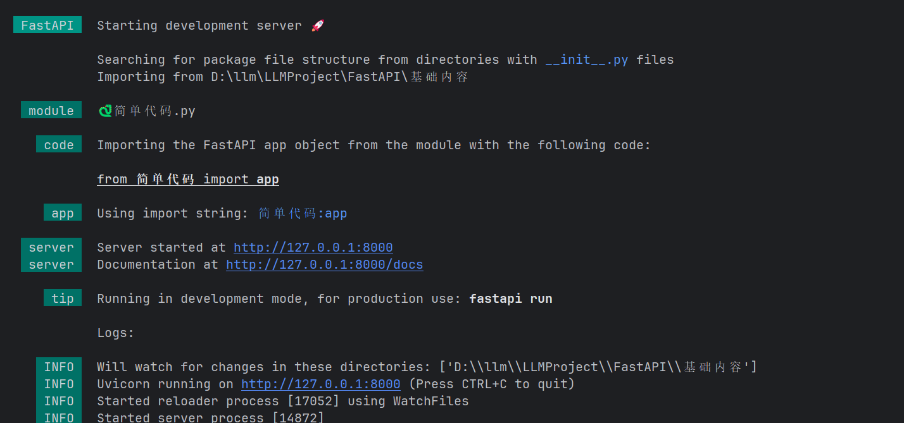
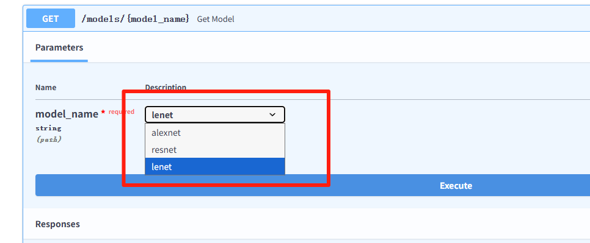
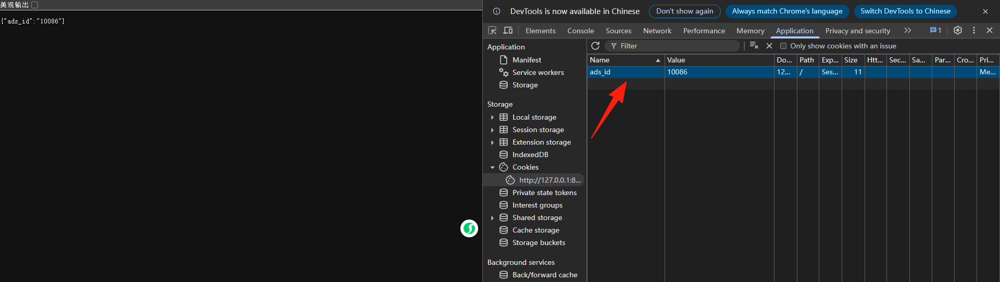
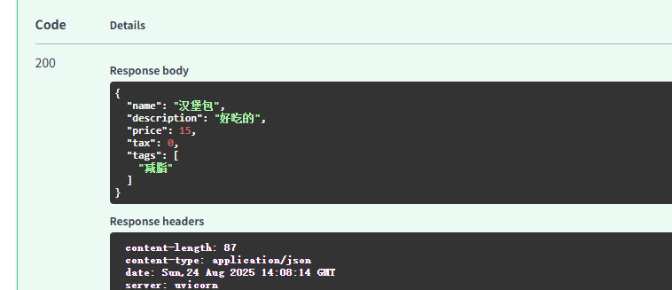
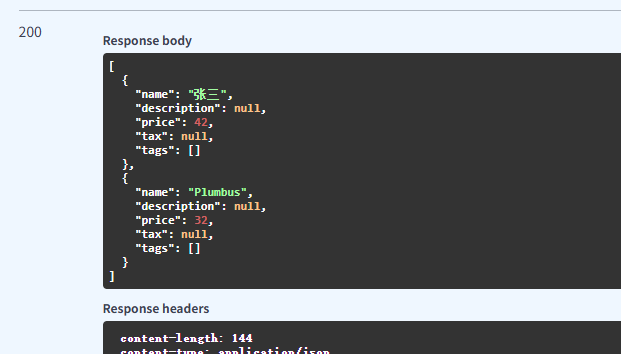
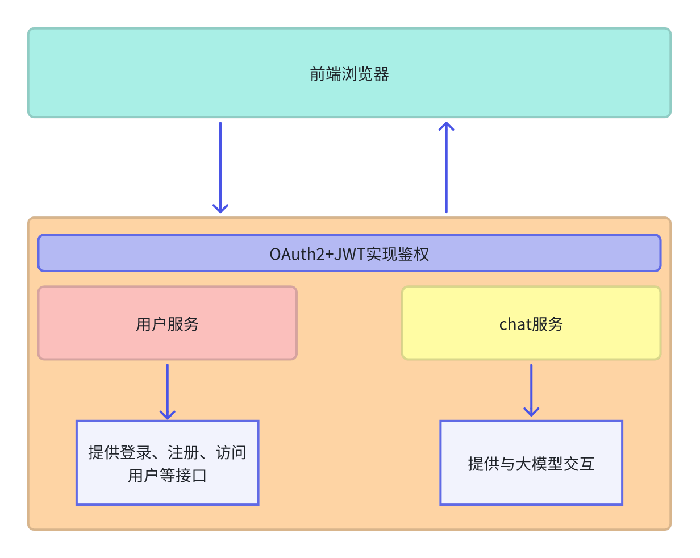

# FastAPI核心定义
**FastAPI** 是一个用于构建 API 的现代、高性能的 Python Web 框架。它专为快速开发而设计，并以其卓越的性能和开发者友好性而闻名。

简单来说，它就是一个工具包，让你能用 Python 非常快速、简单地创建出供其他程序（如前端网页、手机App、其他服务）调用的接口（API）。

## 主要特点
1. **高性能**
    1. 基于 **Starlette**（处理 HTTP 部分）和 **Pydantic**（数据验证与序列化），性能接近 **Node.js / Go**，比大部分 Python Web 框架要快。
    2. 内部使用 **async/await**，支持异步并发。
2. **自动生成 API 文档**
    1. 只要你写好接口定义，FastAPI 会自动生成：
        * **Swagger UI**: `http://127.0.0.1:8000/docs`
        * **ReDoc**: `http://127.0.0.1:8000/redoc` 这对前后端对接特别友好。
3. **类型提示驱动**
    1. 使用 **Python 类型注解**（type hints）就能完成参数验证、请求体校验、响应模型定义。
    2. 不需要额外写很多验证逻辑，Pydantic 会自动完成。
4. **开发效率高**
    1. 简单几行代码就能跑起来。
    2. 对比 Flask / Django，更简洁，更适合写 API 服务。

# Pydantic 模块
Pydantic 是一个用于执行数据验证的 Python 库。

您将数据的“形状”声明为具有属性的类。

每个属性都有一个类型。

然后，您使用一些值创建该类的一个实例，它将验证这些值，将它们转换为适当的类型（如果是这种情况）并为您提供一个包含所有数据的对象。

3.10+的版本

```plain
from datetime import datetime

from pydantic import BaseModel


class User(BaseModel):
    id: int
    name: str = "John Doe"
    signup_ts: datetime | None = None
    friends: list[int] = []


external_data = {
    "id": "123",
    "signup_ts": "2017-06-01 12:22",
    "friends": [1, "2", b"3"],
}
user = User(**external_data)
print(user)
# > User id=123 name='John Doe' signup_ts=datetime.datetime(2017, 6, 1, 12, 22) friends=[1, 2, 3]
print(user.id)
# > 123
```

**注意：FastAPI**全部基于 Pydantic。

## 带有元数据注释的类型提示
Python 还具有一项功能，允许使用 在这些类型提示中放置**额外的元数据**`Annotated`。

```plain
# 3.9+
from typing import Annotated

def say_hello(name: Annotated[str, "this is just metadata"]) -> str:    
    return f"Hello {name}"
```

Python 本身不会对此进行任何处理`Annotated`。对于编辑器和其他工具来说，类型仍然是`str`。

但是您可以使用这个空间为**FastAPI**`Annotated`提供有关您希望应用程序如何运行的附加元数据。

要记住的重要一点是，传递给的**第一个**_**类型参数**_`Annotated`是**实际类型**。其余的只是其他工具的元数据。

## **FastAPI** 中的类型提示
**FastAPI** 利用这些类型提示来做下面几件事。

使用 **FastAPI** 时用类型提示声明参数可以获得：

+ **编辑器支持**。
+ **类型检查**。

...并且 **FastAPI** 还会用这些类型声明来：

+ **定义参数要求**：声明对请求路径参数、查询参数、请求头、请求体、依赖等的要求。
+ **转换数据**：将来自请求的数据转换为需要的类型。
+ **校验数据**： 对于每一个请求：
    - 当数据校验失败时自动生成**错误信息**返回给客户端。
+ 使用 OpenAPI **记录** API：
    - 然后用于自动生成交互式文档的用户界面。

# 并发和 async/await
Python 的现代版本支持通过一种叫**"协程"**——使用 `async` 和 `await` 语法的东西来写**”异步代码“**

## 异步代码
异步代码仅仅意味着编程语言 有办法告诉计算机/程序 在代码中的某个点，程序将不得不等待在某些地方完成一些事情。让我们假设一些事情被称为 "慢文件".

所以，在等待"慢文件"完成的这段时间，计算机可以做一些其他工作。

然后计算机/程序 每次有机会都会回来，因为程序有可能还在等待，或者程序完成了当前所有的工作。而且程序将查看它等待的所有任务中是否有已经完成的，做它必须做的任何事情。

这个"等待其他事情"通常指的是一些相对较慢（与处理器和 RAM 存储器的速度相比）的 I/O 操作，比如说：

+ 通过网络发送来自客户端的数据
+ 客户端接收来自网络中的数据
+ 磁盘中要由系统读取并提供给程序的文件的内容
+ 程序提供给系统的要写入磁盘的内容
+ 一个 API 的远程调用
+ 一个数据库操作，直到完成
+ 一个数据库查询，直到返回结果
+ 等

**<font style="background-color:rgb(255,245,235);">同步代码（排队等）</font>**<font style="background-color:rgb(255,245,235);"> 就像你去餐馆点餐：</font>

+ <font style="background-color:rgb(255,245,235);">你点了菜以后，就在柜台前一直等着。</font>
+ <font style="background-color:rgb(255,245,235);">厨师没做好之前，你什么也干不了，只能发呆。</font>
+ <font style="background-color:rgb(255,245,235);">等菜端上来了，你才能继续下一步。</font>

**<font style="background-color:rgb(255,245,235);">异步代码（点外卖）</font>**<font style="background-color:rgb(255,245,235);"> 就像你用外卖软件点餐：</font>

+ <font style="background-color:rgb(255,245,235);">你下单后，不需要坐在餐馆干等，外卖员在后台送餐。</font>
+ <font style="background-color:rgb(255,245,235);">在等的过程中，你可以去洗澡、打游戏、追剧。</font>
+ <font style="background-color:rgb(255,245,235);">外卖送到了，手机通知你 → 你再去拿外卖吃饭。</font>

官方案例：https://fastapi.tiangolo.com/zh/async/#_5

## `async` 和 `await`
现代版本的 Python 有一种非常直观的方式来定义异步代码。这使它看起来就像正常的"顺序"代码，并在适当的时候"等待"。

当有一个操作需要等待才能给出结果，且支持这个新的 Python 特性时，你可以编写如下代码

```plain
burgers = await get_burgers(2)
```

这里的关键是 `await`。它告诉 Python 它必须等待 ⏸ `get_burgers(2)` 完成它的工作 🕙 ，然后将结果存储在 `burgers` 中。这样，Python 就会知道此时它可以去做其他事情 🔀 ⏯ （比如接收另一个请求）。

要使 `await` 工作，它必须位于支持这种异步机制的函数内。因此，只需使用 `async def` 声明它：

```plain
async def get_burgers(number: int):    
    # 做一些异步的东西来创建汉堡   
    burgers = await get_burgers(2)
    return burgers
```

使用 `async def`，Python 就知道在该函数中，它将遇上 `await`，并且它可以"暂停" ⏸ 执行该函数，直至执行其他操作 🔀 后回来。

### 更多细节
你可能已经注意到，`await` 只能在 `async def` 定义的函数内部使用。

但与此同时，必须"等待"通过 `async def` 定义的函数。因此，带 `async def` 的函数也只能在 `async def` 定义的函数内部调用。

那么，这关于先有鸡还是先有蛋的问题，如何调用第一个 `async` 函数？

如果你使用 **FastAPI**，你不必担心这一点，因为"第一个"函数将是你的路径操作函数，FastAPI 将知道如何做正确的事情。

但如果你想在没有 FastAPI 的情况下使用 `async` / `await`，则可以这样做。

```plain
import asyncio
import time

# 模拟一个“慢任务”——点外卖需要 3 秒
async def order_food(food: str):
    print(f"开始点 {food}...")
    await asyncio.sleep(3)  # 模拟等待送餐
    print(f"{food} 已经送到了！")
    return food

# 异步主函数
async def main():
    start = time.time()

    # 并发执行：两份外卖同时在送
    task1 = asyncio.create_task(order_food("披萨"))
    task2 = asyncio.create_task(order_food("汉堡"))

    print("下单完成，可以先刷会儿抖音...")
    food1 = await task1
    food2 = await task2

    print(f"吃到 {food1} 和 {food2} 了！")
    end = time.time()
    print(f"总共花费 {end - start:.2f} 秒")

# 运行异步程序
if __name__ == "__main__":
    asyncio.run(main())
```

# 基础内容
接下来我们写一个最基础的FsatAPI

```plain
pip install "fastapi[standard]"
```

```plain
from fastapi import FastAPI

app = FastAPI()


@app.get("/")
async def root():
    return {"message": "Hello World"}
```

```plain
使用 fastapi dev 文件名.py 来启动服务
```



```plain
# 使用  http://127.0.0.1:8000 来调用对应的接口
# 使用  http://127.0.0.1:8000/docs 来调用swagger文档
```

<font style="background-color:rgb(255,245,235);">注意：如果碰到无法使用ctrl+c关闭进程，请使用以下命令关闭</font>

<font style="background-color:rgb(255,245,235);">Get-Process -Name python 查询对应python进程</font>

<font style="background-color:rgb(255,245,235);">Stop-Process -Id 53364 -Force 根据id进行kill</font>

<font style="background-color:rgb(255,245,235);">或者使用以下代码进行kill</font>

```plain
import psutil
import os
import signal
import platform


def list_python_processes():
    """列出所有 Python 进程"""
    python_procs = []
    for proc in psutil.process_iter(['pid', 'name', 'cmdline']):
        try:
            if 'python' in proc.info['name'].lower():
                python_procs.append(proc)
        except (psutil.NoSuchProcess, psutil.AccessDenied):
            continue
    return python_procs


def kill_process_by_pid(pid):
    """根据 PID 杀掉进程"""
    try:
        proc = psutil.Process(pid)
        print(f"Killing PID={pid}, Name={proc.name()}, Cmdline={' '.join(proc.cmdline())}")

        if platform.system() == "Windows":
            proc.kill()
        else:
            os.kill(pid, signal.SIGKILL)

        print(f"PID={pid} killed 成功.")
    except psutil.NoSuchProcess:
        print(f"PID={pid} does not exist.")
    except psutil.AccessDenied:
        print(f"没有杀死PID的权限={pid}. 尝试以admin/root身份运行.")
    except Exception as e:
        print(f"杀死PID失败={pid}: {e}")


if __name__ == "__main__":
    # 1. 列出 Python 进程
    procs = list_python_processes()
    if not procs:
        print("没有找到Python进程.")
    else:
        print("Python 进程:")
        for p in procs:
            print(f"PID={p.pid}, Name={p.name()}, Cmdline={' '.join(p.cmdline())}")

        # 2. 用户输入 PID
        try:
            # 建议从后面往前kill
            for _ in range(1000):
                pid = input("Enter PID to kill: ")
                kill_process_by_pid(int(pid))
        except ValueError:
            print("无效的PID。请输入数字PID")
```

## 路径参数
FastAPI 支持使用 Python 字符串格式化语法声明**路径参数**（**变量**）

```plain
@app.get("/items/{item_id}")
async def get_item(item_id): 
    print(item_id)
    return {"message": "Hello World"}
    
# 这段代码把路径参数 item_id 的值传递给路径函数的参数 item_id。

 # item_id: int  使用pydantic语法声明类型为int，如果还是传的字符会直接提示
 # {"detail":[{"type":"int_parsing","loc":["path","item_id"],"msg":"Input should be a valid integer, unable to parse string as an integer","input":"fo"}]}
```

### 顺序很重要
有时，_路径操作_中的路径是写死的。

比如要使用 `/users/me` 获取当前用户的数据。

然后还要使用 `/users/{user_id}`，通过用户 ID 获取指定用户的数据。

由于_路径操作_是按顺序依次运行的，因此，一定要在 `/users/{user_id}` 之前声明 `/users/me`

否则，`/users/{user_id}` 将匹配 `/users/me`，FastAPI 会**认为**正在接收值为 `"me"` 的 `user_id` 参数。

### 预设值
路径操作使用 Python 的 `Enum` 类型接收预设的_路径参数_。

```plain
from enum import Enum

from fastapi import FastAPI


class ModelName(str, Enum):
    alexnet = "alexnet"
    resnet = "resnet"
    lenet = "lenet"


app = FastAPI()


@app.get("/models/{model_name}")
async def get_model(model_name: ModelName):
    if model_name is ModelName.alexnet:
        return {"model_name": model_name, "message": "深度学习"}

    if model_name.value == "lenet":
        return {"model_name": model_name, "message": "所有的图片"}

    return {"model_name": model_name, "message": "残差链接"}
```



## 查询参数（过滤、搜索、分页等）
声明的参数不是路径参数时，路径操作函数会把该参数自动解释为**查询**参数。

```plain
from fastapi import FastAPI

app = FastAPI()

fake_items_db = [{"item_name": "Foo"}, {"item_name": "Bar"}, {"item_name": "Baz"}]


@app.get("/items/")  # 因为参数有默认值
async def read_item(skip: int = 0, limit: int = 10): # 查询0-10条数据
    return fake_items_db[skip : skip + limit]
```

访问：http://127.0.0.1:8000/items/?skip=0&limit=10就能获取对应的数据

**多个路径和查询参数**

定义了一个 **带两个路径参数的路由**

**优势**

+ **更语义化**：路径就像目录层级一样，描述清楚资源归属
    - `/users/123/items/456` → 用户 123 的物品 456
+ **自动验证类型**：FastAPI 会根据函数参数的类型自动转换和校验
    - `user_id: int` → 如果传的不是整数，会直接报 422 错误

```plain
from fastapi import FastAPI
    
app = FastAPI()


@app.get("/users/{user_id}/items/{item_id}")
async def read_user_item(
    user_id: int, item_id: str, q: str | None = None, short: bool = False
):
    item = {"item_id": item_id, "owner_id": user_id}
    if q:
        item.update({"q": q})
    if not short:
        item.update(
            {"description": "这是多路径查询"}
        )
    return item
```


**<font style="color:rgb(216,57,49);">注意：如果要把查询参数设置为必选，就不要声明默认值</font>**

## 请求体
FastAPI 使用**请求体**从客户端（例如浏览器）向 API 发送数据。

**请求体**是客户端发送给 API 的数据。**响应体**是 API 发送给客户端的数据。

API 基本上肯定要发送**响应体**，但是客户端不一定发送**请求体**。

使用 **Pydantic**模型声明**请求体**，能充分利用它的功能和优点。

<font style="background-color:rgb(255,245,235);">说明</font>

<font style="background-color:rgb(255,245,235);">发送数据使用 </font>`<font style="background-color:rgb(255,245,235);">POST</font>`<font style="background-color:rgb(255,245,235);">（最常用）、</font>`<font style="background-color:rgb(255,245,235);">PUT</font>`<font style="background-color:rgb(255,245,235);">、</font>`<font style="background-color:rgb(255,245,235);">DELETE</font>`<font style="background-color:rgb(255,245,235);">、</font>`<font style="background-color:rgb(255,245,235);">PATCH</font>`<font style="background-color:rgb(255,245,235);"> 等操作。</font>

<font style="background-color:rgb(255,245,235);">规范中没有定义使用 </font>`<font style="background-color:rgb(255,245,235);">GET</font>`<font style="background-color:rgb(255,245,235);"> 发送请求体的操作，但不管怎样，FastAPI 也支持这种方式，只不过仅用于非常复杂或极端的用例。</font>

<font style="background-color:rgb(255,245,235);">我们不建议使用 </font>`<font style="background-color:rgb(255,245,235);">GET</font>`<font style="background-color:rgb(255,245,235);">，因此，在 Swagger UI 交互文档中不会显示有关 </font>`<font style="background-color:rgb(255,245,235);">GET</font>`<font style="background-color:rgb(255,245,235);"> 的内容，而且代理协议也不一定支持 </font>`<font style="background-color:rgb(255,245,235);">GET</font>`<font style="background-color:rgb(255,245,235);">。</font>

1.从`pydantic` 中导入 `BaseModel`：

```plain
from fastapi import FastAPI
from pydantic import BaseModel


class Item(BaseModel):
    """
    创建数据模型,把数据模型声明为继承 BaseModel 的类。
    和查询参数一样，如果没有默认值就是必填属性
    """
    name: str
    description: str | None = None
    price: float
    tax: float | None = None

app = FastAPI()


@app.post("/items/")
async def create_item(item: Item):  # 使用与声明路径和查询参数相同的方式声明请求体，把请求体添加至路径操作
    item_dict = item.model_dump()  # 将对象字段转变成字典
    if item.tax is not None:
        price_with_tax = item.price + item.tax
        item_dict.update({"price_with_tax": price_with_tax})
    return item_dict
```

**结论：**

<font style="background-color:rgb(255,245,235);">仅使用 Python 类型声明，</font>**<font style="background-color:rgb(255,245,235);">FastAPI</font>**<font style="background-color:rgb(255,245,235);"> 就可以：</font>

+ <font style="background-color:rgb(255,245,235);">以 JSON 形式读取请求体</font>
+ <font style="background-color:rgb(255,245,235);">（在必要时）把请求体转换为对应的类型</font>
+ <font style="background-color:rgb(255,245,235);">校验数据：</font>
    - <font style="background-color:rgb(255,245,235);">数据无效时返回错误信息，并指出错误数据的确切位置和内容</font>
+ <font style="background-color:rgb(255,245,235);">把接收的数据赋值给参数 </font>`<font style="background-color:rgb(255,245,235);">item</font>`
    - <font style="background-color:rgb(255,245,235);">把函数中请求体参数的类型声明为 </font>`<font style="background-color:rgb(255,245,235);">Item</font>`<font style="background-color:rgb(255,245,235);">，还能获得代码补全等编辑器支持</font>
+ <font style="background-color:rgb(255,245,235);">为模型生成 </font>[<font style="background-color:rgb(255,245,235);">JSON Schema</font>](https://json-schema.org/)<font style="background-color:rgb(255,245,235);">，在项目中所需的位置使用</font>
+ <font style="background-color:rgb(255,245,235);">这些概图是 OpenAPI 概图的部件，用于 API 文档 UI</font>

<font style="background-color:rgb(255,245,235);">tips：</font>

<font style="background-color:rgb(255,245,235);">大家可以去PyCharm插件中按照pydantic，来获得更好的代码补全和类型检查等功能。</font>

## 查询参数和字符串校验
```plain
from fastapi import FastAPI

app = FastAPI()

# 查询参数 q 的类型为 str，默认值为 None，因此它是可选的。
@app.get("/items/")
async def read_items(q: str | None = None):
    results = {"items": [{"item_id": "Foo"}, {"item_id": "Bar"}]}
    if q:
        results.update({"q": q})
    return results
```

即使 `q` 是可选的，但只要提供了该参数，则该参数值**不能超过50个字符的长度**。

```plain
# Union可选多个值，3.10+版本可以直接用 str | None
# Query是在参数q提供的时候做出限制最大长度为50
@app.get("/read/items/")
async def read_items(q: Union[str, None] = Query(title="问题", description="这是一个问题参数", max_length=50)):
    results = {"items": [{"item_id": "Foo"}, {"item_id": "Bar"}]}
    if q:
        results.update({"q": q})
    return results
```

`**min_length**`：最小长度 `**max_length**`：最大长度

`**pattern**`：正则表达式 （在线正则网站：https://www.sojson.com/regex/generate，建议可以让大模型生成）

`**default**`：默认值（当没有默认值的时候，参数就是必选参数）

`**description**`**：**字段描述

`**alias**`**: **取别名

`**deprecated**`：设置true弃用参数

## 路径参数和数值校验
和查询参数差不多，可以使用PATH为路径参数声明相同类型的校验和元数据

```plain
from typing import Annotated

from fastapi import FastAPI, Path, Query

app = FastAPI()


# Annotated给类型加上额外的元数据
@app.get("/items/{item_id}")
async def read_items_mate_data(
        item_id: Annotated[int, Path(title="要获取的项目的ID", le=10)],
        q: Annotated[str | None, Query(description="问题参数")] = None
):
    results = {"item_id": item_id}
    if q:
        results.update({"q": q})
    return results
```

## 查询参数模型
+ `gt`：大于（`g`reater `t`han）
+ `ge`：大于等于（`g`reater than or `e`qual）
+ `lt`：小于（`l`ess `t`han）
+ `le`：小于等于（`l`ess than or `e`qual）

```plain
from typing import Annotated, Literal

from fastapi import FastAPI, Query
from pydantic import BaseModel, Field

app = FastAPI()

class FilterParams(BaseModel):
    """ Pydantic 模型的查询参数，用于通用分页和筛选 """

    # 每页返回的数据条数，默认 100，要求 >0 且 <=100


    limit: int = Field(100, gt=0, le=100)

    # 数据偏移量（分页用），默认 0，要求 >=0
    offset: int = Field(0, ge=0)

    # 排序字段，只允许是 "created_at" 或 "updated_at"，默认 "created_at"
    order_by: Literal["created_at", "updated_at"] = "created_at"

    # 标签过滤，默认空列表，可以传多个标签
    tags: list[str] = []


@app.get("/items/query")
async def query_items(filter_query: Annotated[FilterParams, Query()]):
    return filter_query
```

## 请求体-字段
与在_路径操作函数_中使用 `Query`、`Path` 、`Body` 声明校验与元数据的方式一样，可以使用 Pydantic 的 `Field` 在 Pydantic 模型内部声明校验和元数据。

**导入 **`**Field**`

从 Pydantic 中导入 `Field`

```plain
from typing import Annotated

from fastapi import Body, FastAPI
from pydantic import BaseModel, Field

app = FastAPI()


class Item(BaseModel):
    name: str
    description: str | None = Field(
        default=None, title="项目的描述", max_length=300
    )
    price: float = Field(gt=0, description="价格必须大于零")
    tax: float | None = None


@app.put("/items/{item_id}")
async def update_item(item_id: int, item: Annotated[Item, Body(embed=True)]):
    results = {"item_id": item_id, "item": item}
    return results
```

## 请求体 - 嵌套模型
### List 字段
你可以将一个属性定义为拥有子元素的类型。例如 Python `list`

```plain
from fastapi import FastAPI
from pydantic import BaseModel

app = FastAPI()


class Item(BaseModel):
    name: str
    description: str | None = None
    price: float
    tax: float | None = None
    tags: list = []


@app.put("/items/{item_id}")
async def update_item(item_id: int, item: Item):
    results = {"item_id": item_id, "item": item}
    return results
```

### 具有子类型的 List 字段
```plain
from typing import List, Union

from fastapi import FastAPI
from pydantic import BaseModel

app = FastAPI()


class Item(BaseModel):
    name: str
    description: Union[str, None] = None
    price: float
    tax: Union[float, None] = None
    tags: List[str] = []


@app.put("/items/{item_id}")
async def update_item(item_id: int, item: Item):
    results = {"item_id": item_id, "item": item}
    return results
```

### 嵌套模型
```plain
from fastapi import FastAPI
from pydantic import BaseModel

app = FastAPI()


class Image(BaseModel):
    url: str
    name: str


class Item(BaseModel):
    name: str
    description: str | None = None
    price: float
    tax: float | None = None
    tags: set[str] = set()
    image: Image | None = None


@app.put("/items/{item_id}")
async def update_item(item_id: int, item: Item):
    results = {"item_id": item_id, "item": item}
    return results
```

数据类似这种：

```plain
{
    "name": "Foo",
    "description": "The pretender",
    "price": 42.0,
    "tax": 3.2,
    "tags": ["rock", "metal", "bar"],
    "image": {
        "url": "http://example.com/baz.jpg",
        "name": "The Foo live"
    }
}
```

## Cookie参数
### 什么是Cookie？
**Cookie** 是 **存储在浏览器中的一小段文本数据**，由服务器生成并发送给客户端（浏览器）。 浏览器会在 **后续请求**中自动携带这些 Cookie 发回服务器，从而实现 **状态保持**。

由于 **HTTP 是无状态协议**，服务器无法记住用户是谁，而 Cookie 解决了这个问题。

### Cookie 的作用
1. **身份验证**（记录登录状态，用户免密访问）
2. **个性化设置**（记住用户的语言、主题等偏好）
3. **会话跟踪**（购物车、用户行为跟踪）

导入 `Cookie`

```plain
from typing import Annotated
from fastapi import Cookie, FastAPI

app = FastAPI()

@app.get("/cookies1/")
async def get_cookie(ads_id: Annotated[str | None, Cookie()] = None):
    return {"ads_id": ads_id}
```



http://127.0.0.1:8000/cookies1/

### 带有 Pydantic 模型的 Cookie
```plain
from typing import Annotated

from fastapi import Cookie, FastAPI
from pydantic import BaseModel

app = FastAPI()


class Cookies(BaseModel):
    session_id: str
    name: str | None = None
    email: str | None = None


@app.get("/cookies2/")
async def get_cookie1(cookies: Annotated[Cookies, Cookie()]):
    return cookies
```


### 禁用额外的 Cookie
```plain
# 除了在类中定义的属性，其他属性不能支持，请看下面图片
class Cookies1(BaseModel):
    model_config = {"extra": "forbid"}
    session_id: str
    name: str | None = None
    email: str | None = None

@app.get("/cookies3/")
async def read_items(cookies: Annotated[Cookies1, Cookie()]):
    return cookies
```


## Header 参数
在 Web 请求中，Header 用来传递 **关于请求或客户端的信息**，不属于请求的“正文”部分（Body）

常见请求头：

表格 还在加载中，请等待加载完成后再尝试复制

```plain
from typing import Annotated

from fastapi import FastAPI, Header

app = FastAPI()


@app.get("/items/")
async def read_items(user_agent: Annotated[str | None, Header()] = None):
    return {"User-Agent": user_agent}
```

### 自动转换
FastAPI 会自动处理请求头字段的大小写和格式问题。例如，HTTP 请求头字段通常使用连字符（`-`）分隔，而 Python 中的变量名使用下划线（`_`）。FastAPI 会自动将下划线转换为连字符，以匹配请求头中的字段名。

例如，`user_agent` 参数会自动映射到请求头中的 `User-Agent` 字段。如果您希望禁用这种自动转换，可以在声明 `Header` 时设置 `convert_underscores` 参数为 `False`：

```plain
from fastapi import FastAPI, Header

app = FastAPI()

class HeaderItems(BaseModel):
    name: str
    age: int | None = None

@app.post("/header/")
async def get_items(
        accept: str | None = Header(None),
        strange_header: str | None = Header(default=None, convert_underscores=False),
        header_items: HeaderItems = HeaderItems(name="张三", age=10),
):
    print(header_items)
    return {"strange_header": strange_header, "accept": accept}
    
    
# 使用Pydantic模型的Header参数
class CommonHeaders(BaseModel):
    host: str
    save_data: bool
    if_modified_since: str | None = None
    traceparent: str | None = None
    x_tag: list[str] = []


@app.get("/items/")
async def read_items(headers: Annotated[CommonHeaders, Header()]):
    return headers
```

## 响应模式
限制返回的内容

```plain
from typing import Any

from fastapi import FastAPI
from pydantic import BaseModel

app = FastAPI()


class Item(BaseModel):
    name: str
    description: str | None = None
    price: float
    tax: float | None = None
    tags: list[str] = []


@app.post("/createItem", response_model=Item)
async def create_item(item: Item) -> Any: # 可以返回任意类型，但是会转换成Item，如果格式不对会报错，最好是把返回值改成Item
    return item


@app.get("/readItems/", response_model=list[Item])
async def read_items() -> Any:
    return [
        {"name": "张三", "price": 42.0},
        {"name": "Plumbus", "price": 32.0},
    ]
```





<font style="background-color:rgb(255,245,235);">千万不要存储用户的明文密码。始终存储可以进行验证的</font>**<font style="background-color:rgb(255,245,235);">安全哈希值</font>**<font style="background-color:rgb(255,245,235);">。</font>

```plain
from fastapi import FastAPI
from pydantic import BaseModel, EmailStr

app = FastAPI()

# 用户输入属性
class UserIn(BaseModel):
    username: str
    password: str
    email: EmailStr
    full_name: str | None = None

# 返回属性
class UserOut(BaseModel):
    username: str
    email: EmailStr
    full_name: str | None = None

# 数据库属性
class UserInDB(BaseModel):
    username: str
    hashed_password: str
    email: EmailStr
    full_name: str | None = None

# 将密码进行加密
def fake_password_hasher(raw_password: str):
    return "supersecret" + raw_password

# 将用户信息存储
def fake_save_user(user_in: UserIn):
    hashed_password = fake_password_hasher(user_in.password)
    """
        **user_in.dict():Pydantic 模型支持 .dict() 方法，能返回包含模型数据的字典，
        把字典 user_dict 以 **user_dict 形式传递给函数（或类），Python 会执行解包操作。它会把 user_dict 的键和值作为关键字参数直接传递。
    """
    user_in_db = UserInDB(**user_in.dict(), hashed_password=hashed_password)
    print("用户已保存！")
    return user_in_db


@app.post("/user/", response_model=UserOut)
async def create_user(user_in: UserIn):
    user_saved = fake_save_user(user_in)
    return user_saved
```

**减少重复代码**

**FastAPI** 的核心思想就是减少代码重复。

声明 `UserBase` 模型作为其它模型的基类。然后，用该类衍生出继承其属性（类型声明、验证等）的子类。

```plain
from fastapi import FastAPI
from pydantic import BaseModel, EmailStr

app = FastAPI()


class UserBase(BaseModel):
    username: str
    email: EmailStr
    full_name: str | None = None


class UserIn(UserBase):
    password: str


class UserOut(UserBase):
    pass


class UserInDB(UserBase):
    hashed_password: str


def fake_password_hasher(raw_password: str):
    return "supersecret" + raw_password

# 将用户信息存储
def fake_save_user(user_in: UserIn):
    hashed_password = fake_password_hasher(user_in.password)
    """
        **user_in.dict():Pydantic 模型支持 .dict() 方法，能返回包含模型数据的字典，
        把字典 user_dict 以 **user_dict 形式传递给函数（或类），Python 会执行解包操作。它会把 user_dict 的键和值作为关键字参数直接传递。
    """
    user_in_db = UserInDB(**user_in.dict(), hashed_password=hashed_password)
    print("用户已保存！")
    return user_in_db


@app.post("/user/", response_model=UserOut)
async def create_user(user_in: UserIn):
    user_saved = fake_save_user(user_in)
    return user_saved
```

## HTTP 状态码
+ `100` 及以上的状态码用于返回**信息**。这类状态码很少直接使用。具有这些状态码的响应不能包含响应体
+ `**200**` 及以上的状态码用于表示**成功**。这些状态码是最常用的
    - `200` 是默认状态代码，表示一切**正常**
    - `201` 表示**已创建**，通常在数据库中创建新记录后使用
    - `204` 是一种特殊的例子，表示**无内容**。该响应在没有为客户端返回内容时使用，因此，该响应不能包含响应体
+ `**300**` 及以上的状态码用于**重定向**。具有这些状态码的响应不一定包含响应体，但 `304`**未修改**是个例外，该响应不得包含响应体
+ `**400**` 及以上的状态码用于表示**客户端错误**。这些可能是第二常用的类型
    - `404`，用于**未找到**响应
    - 对于来自客户端的一般错误，可以只使用 `400`
+ `500` 及以上的状态码用于表示服务器端错误。几乎永远不会直接使用这些状态码。应用代码或服务器出现问题时，会自动返回这些状态代码

## 文件上传
安装依赖

```plain
pip install python-multipart # 用于解析 multipart/form-data 请求体，支持文件上传
```

### 基础概念
**什么是表单数据？**

在网页中进行注册、登录、头像、文档等

**两种处理方式：**

+ `bytes`：全部读入内存，适用小文件（如小图标）
+ `UploadFile`：智能内存管理，适用大文件（如视频、文档）

### 上传单个文件
1. 使用 `bytes` 类型

```plain
from fastapi import FastAPI, File

app = FastAPI()

@app.post("/uploadfile/")
async def create_upload_file(file: bytes = File(description="以字节形式读取的文件")):
    return {"file_size": len(file)}
```

**<font style="background-color:rgb(255,245,235);">工作原理：</font>**

1. <font style="background-color:rgb(255,245,235);">用户选择文件</font>
2. <font style="background-color:rgb(255,245,235);">FastAPI把整个文件读入内存</font>
3. <font style="background-color:rgb(255,245,235);">以字节形式传给你的函数</font>

2.使用 `UploadFile` 类型

```plain
from fastapi import FastAPI, UploadFile, File

app = FastAPI()

@app.post("/uploadfile/")
async def create_upload_file(file: UploadFile = File(description="作为UploadFile读取的文件")):
    return {"filename": file.filename, "content_type": file.content_type}
```

**<font style="background-color:rgb(255,245,235);">智能存储</font>**<font style="background-color:rgb(255,245,235);">：小文件放内存，大文件存磁盘</font>

**<font style="background-color:rgb(255,245,235);">丰富信息</font>**<font style="background-color:rgb(255,245,235);">：文件名、类型、大小</font>

**<font style="background-color:rgb(255,245,235);">高效处理</font>**<font style="background-color:rgb(255,245,235);">：不会占满你的内存</font>

### UploadFile 详解
`UploadFile` 的属性如下：

+ `filename`：上传文件名字符串（`str`），例如， `myimage.jpg`；
+ `content_type`：内容类型（MIME 类型 / 媒体类型）字符串（`str`），例如，`image/jpeg`；
+ `file`： `SpooledTemporaryFile`（ [file-like](https://docs.python.org/zh-cn/3/glossary.html#term-file-like-object) 对象）。其实就是 Python文件，可直接传递给其他预期 `file-like` 对象的函数或支持库。

**什么是 **`**SpooledTemporaryFile**`**？**

特点：

+ 文件小的时候，内容会先存储在 **内存**（buffer）里；
+ 当文件变大超过一定阈值时，会自动写入到磁盘上的临时文件。
+ 这样既能提高性能（小文件直接在内存中操作），也能保证大文件不会撑爆内存

```plain
@app.post("/uploadfile/")
async def analyze_file(file: UploadFile):
    return {
        "filename": file.filename,        # 文件名，如 "photo.jpg"
        "content_type": file.content_type, # 文件类型，如 "image/jpeg"
        "size": file.size                  # 文件大小（如果可获取）
    }
```

### 可选文件上传
让文件上传变为可选

```plain
@app.post("/optional-file/")
async def upload_optional_file(file: UploadFile | str = File(default=None)):
    print(file)
    if not file:
        return {"message": "没有上传文件"}
    else:
        return {"filename": file.filename}
```

### 多文件上传
```plain
@app.post("/multiple-files/")
async def upload_multiple_files(files: list[UploadFile]):
    file_info = []
    for file in files:
        file_info.append({
            "filename": file.filename,
            "size": len(await file.read())
        })
        # 记得重置文件指针
        await file.seek(0)
    
    return {"files": file_info}
```

# 基于fastapi+VUE的智能聊天系统


```plain
pip install passlib 
pip install PyJWT 
pip install python-multipart 
pip install uvicorn[standard]
pip install bcrypt==4.3.0
```

服务端代码：

[案例.zip](https://www.yuque.com/attachments/yuque/0/2025/zip/63166249/1764592664865-7301b106-65f8-4180-89cc-9ce85743117c.zip)

1.先下载node.js

[chat-ai-ui-main.zip](https://www.yuque.com/attachments/yuque/0/2025/zip/63166249/1764592741355-ea398747-89fd-4ae0-ad91-744a56ab34d1.zip)

