大模型课程：

1.大模型基础

2.RAG应用开发

3.Agent智能体开发

4.模型微调+实战项目

# 人工智能演进与大模型兴起：从AI1.0到AI2.0的变迁
## 什么是AI?
AI（Artificial Intelligence，人工智能） 是指由计算机系统模拟人类智能的技术，使其能够执行通常需要人类智慧的任务，如学习、推理、决策、感知（视觉、语音）、语言理解等。简单来说，人工智能努力的目标是让计算机像人类一样思考和行动。

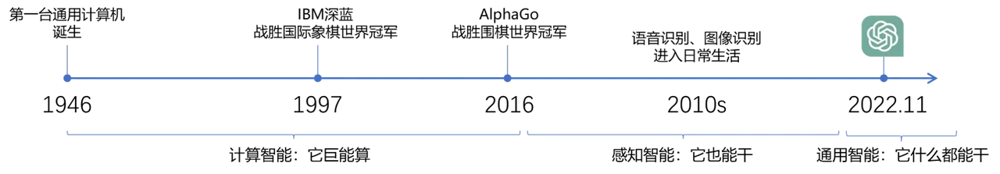

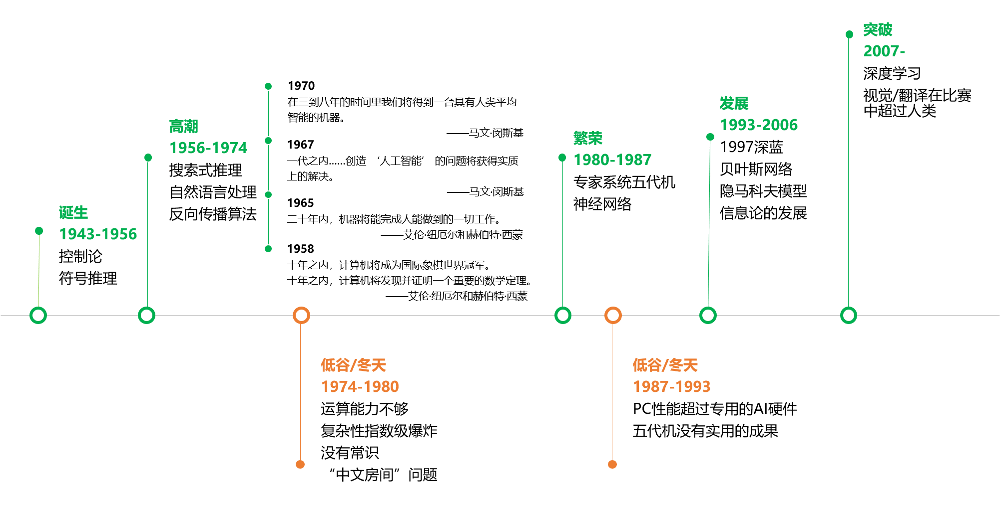

人工智能发展史：1900~2023：https://zhuanlan.zhihu.com/p/703419161

钢铁侠的贾维斯是一个高度智能化的人工智能系统。

https://www.douyin.com/search/%E8%B4%BE%E7%BB%B4%E6%96%AF%E7%B3%BB%E7%BB%9F%E7%89%87%E6%AE%B5?modal_id=7305371817470905612&type=general

## AI的发展历程
### 传统人工智能
**定义：**传统人工智能（Traditional AI） 是基于人工规则和逻辑推理的早期AI技术，依赖专家知识而非数据学习，擅长结构化问题（如专家系统、棋类程序），但泛化能力差，无法处理模糊任务。

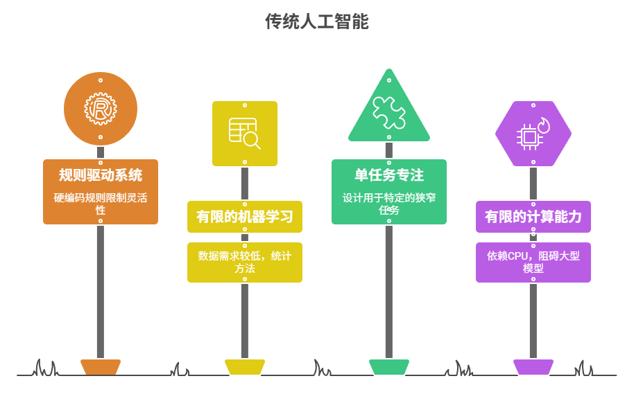

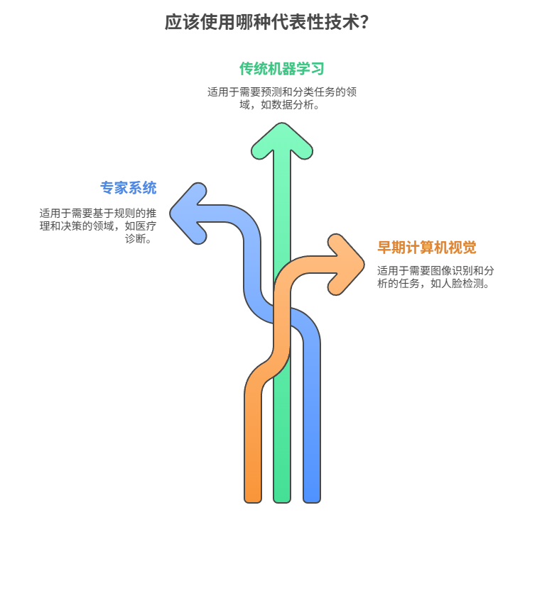

局限性： ❌ 无法适应新场景，泛化能力差。 ❌ 依赖人工特征工程，效率低。

### 新一代人工智能
**定义：**是基于大数据和深度学习的智能技术，通过神经网络自动学习并处理复杂任务（如自然语言理解、图像识别、自主决策）。这一阶段的 AI 能够理解数据的含义并做出智能决策。

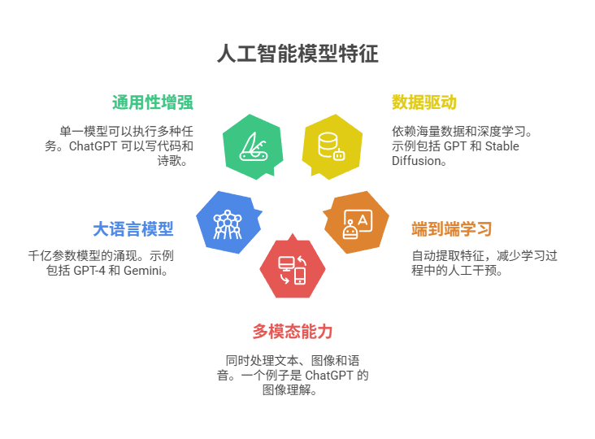

代表技术：

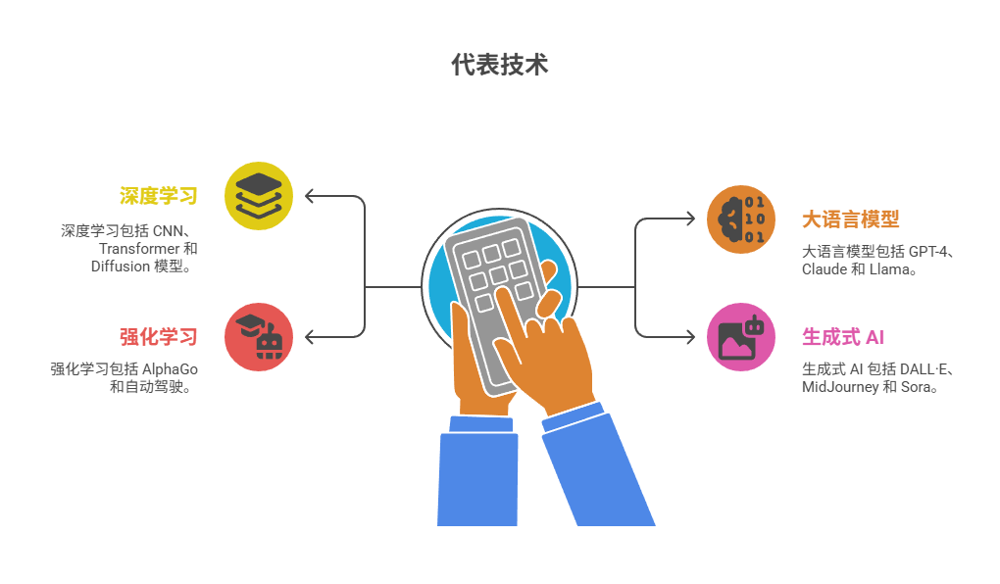

突破性应用： 🚀 自然语言：ChatGPT 实现接近人类的对话。 🚀 计算机视觉：AI 生成逼真图片/视频（如 Sora）。 🚀 跨模态理解：AI 能“看图说话”或“听音辨图”。

# 大语言模型与通用人工智能
## 大模型的定义
大模型（Large Model） 是指参数量巨大（通常达十亿至万亿级）、基于深度学习的超大规模人工智能模型，其核心特征包括：

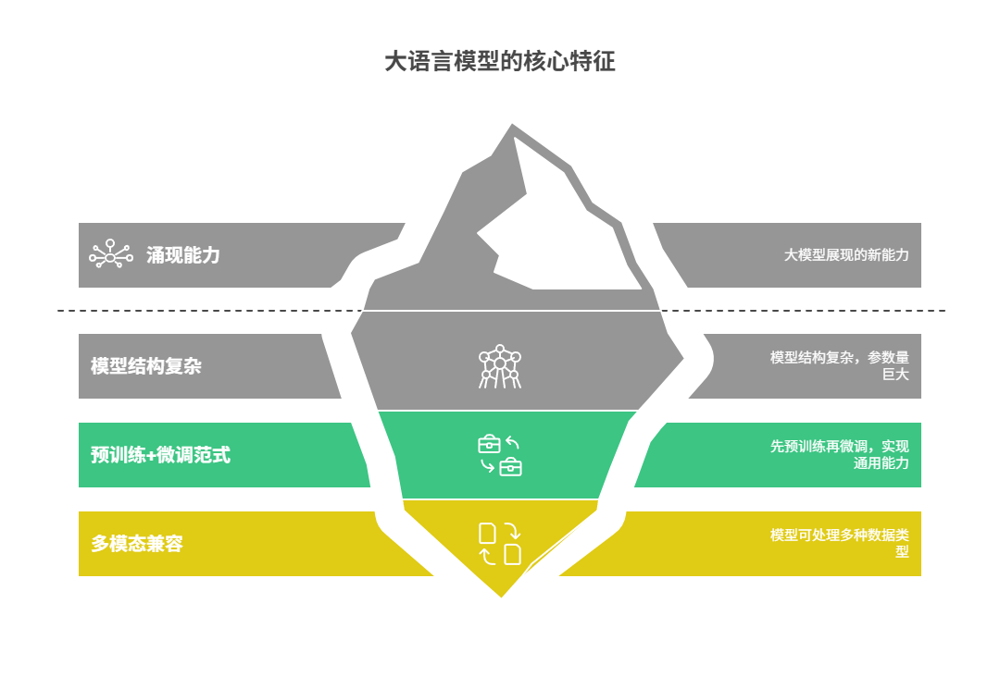

下面是来自OpenCompass的大模型评测榜单，该榜单的性能指标综合了多项评测结果，包括MMLU，C-EVAL，CMMLU等。

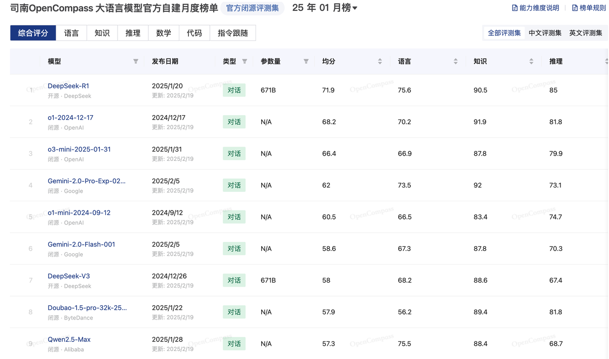

OpenCompass：https://opencompass.org.cn/home

注意点: 对话产品和基座大模型实际上是两个东西。

## 大模型应用和基座大模型
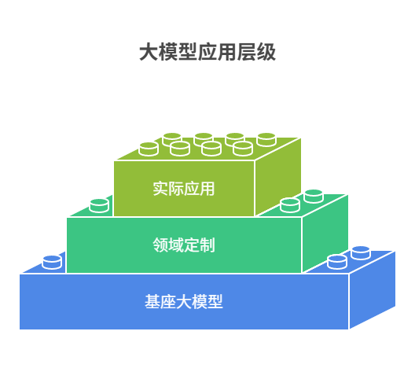

## 通用人工智能的定义
通用人工智能（AGI）指具备人类水平认知能力的智能系统，能够自主理解、学习并解决各类复杂问题，其表现可媲美甚至超越人类。AGI的核心特征包括：

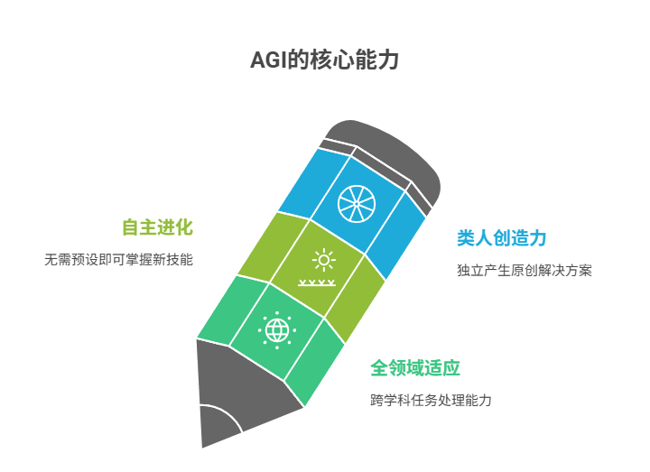

当前技术尚未实现真正的AGI，现有AI仍局限于特定领域（如AlphaGo仅擅长围棋）。AGI被视为人工智能的终极形态，需突破认知架构、因果推理等关键技术瓶颈。

典型对比： ▸ 专用AI（如ChatGPT）：垂直领域专家 ▸ AGI：全能型"数字人类"

## 大模型与通用人工智能的联系
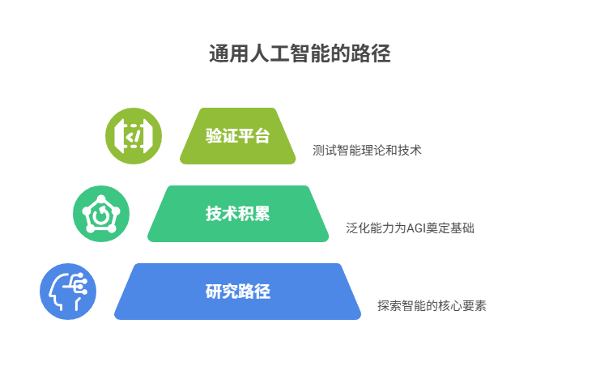

# GPT模型的演进
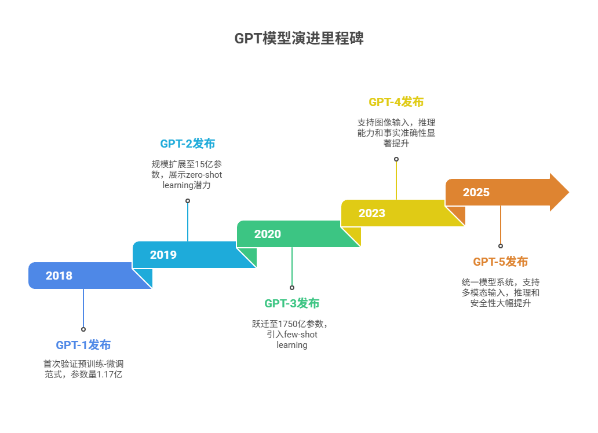

演进趋势：

1. 模型规模指数级增长
2. 训练数据多元化
3. 交互方式从纯文本到多模态
4. 安全控制机制逐步完善

# **国产大模型介绍**
| **模型名称** | **研发机构** | **发布时间** | **参数量** | **核心特点** | **典型应用场景** |
| :---: | :---: | :---: | :---: | :---: | :---: |
| 文心一言 | 百度 | 2023.3 | 2600亿 | - 知识增强千亿大模型   - 支持多模态生成   - 中文理解行业领先 | 企业服务、智能营销、教育 |
| 通义千问 | 阿里云 | 2023.4 | 1800亿 | - 多轮对话优化   - 电商场景专用微调   - 支持代码生成 | 电商客服、金融分析、编程 |
| 星火大模型 | 科大讯飞 | 2023.5 | 1300亿 | - 语音交互专项优化   - 教育领域知识库   - 多方言识别 | 智能硬件、在线教育、医疗 |
| 混元大模型 | 腾讯 | 2023.9 | 2000亿 | - 社交数据强化训练   - 游戏NPC对话生成   - 内容安全过滤 | 社交平台、游戏开发、审核 |
| 紫东太初 | 中科院 | 2021.11 | 1000亿 | - 三模态（图文音）融合   - 科学计算优化   - 完全开源 | 科研分析、工业质检 |
| 书生·浦语 | 商汤科技 | 2023.6 | 1500亿 | - 视觉-语言联合建模   - 城市治理场景优化   - 低算力适配 | 智慧城市、自动驾驶 |
| DeepSeek | 深度求索 | 2025.1 | 6170亿 | - 混合专家架构（16个专家）   - 激活参数仅36B   - 中英双语优化 | 企业知识库、智能客服 |

参考链接：https://github.com/wgwang/awesome-LLMs-In-China

# 大模型驱动产业变革：垂直行业赋能全景分析
## 教育行业
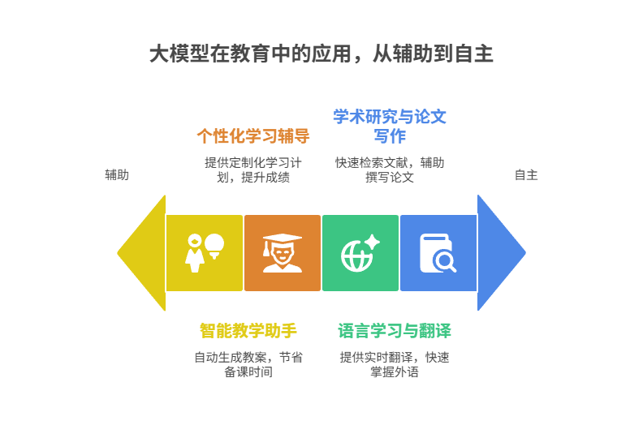

## 金融行业
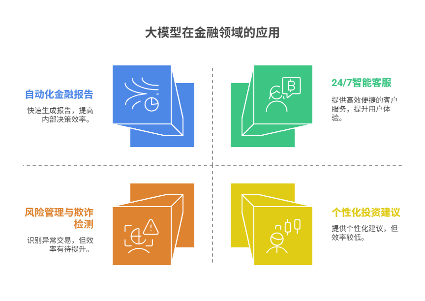

## 制造业
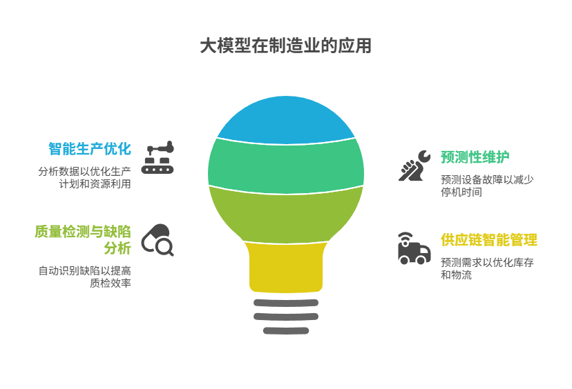

## 零售与电商行业
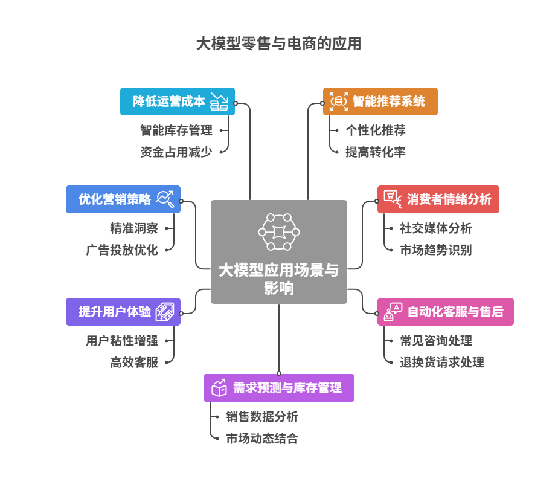

## 未来行业预测
| **行业** | **核心应用场景** | **当前成熟度（2025）** | **2030发展潜力** | **代表企业 / 动向** |
| --- | --- | --- | --- | --- |
| **教育** | 智能助教、个性化学习、题目自动生成、语音陪练 | ★★★★☆ | ★★★★★ | 好未来、网易有道、Duolingo、Sora等 |
| **金融** | 智能客服、投研报告生成、风控审计 | ★★★★☆ | ★★★★★ | 摩根大通、微众银行、百度文心一言 |
| **医疗** | 电子病历摘要、问诊机器人、医学图像分析 | ★★☆☆☆ | ★★★★★ | 联影AI、科大讯飞、Nabla、IBM Watson |
| **法律** | 合同审阅、智能问答、案例匹配 | ★★★☆☆ | ★★★★☆ | 法天使、律图、Harvey（OpenAI支持） |
| **内容创作** | 文案生成、视频脚本、AI配图、多语种翻译 | ★★★★★ | ★★★★☆ | 字节跳动、Midjourney、OpenAI、Canva |
| **制造业** | 故障诊断、流程优化、数字孪生文档自动生成 | ★★☆☆☆ | ★★★★☆ | 西门子、ABB、华为昇腾、百度智能云 |
| **零售电商** | 虚拟导购、商品文案生成、运营分析、多轮互动客服 | ★★★★☆ | ★★★★☆ | 阿里巴巴、京东、Amazon、快手 |
| **政务公共** | 政策问答、办事助手、公文自动生成、知识库搭建 | ★★★☆☆ | ★★★★☆ | 国家信创平台、钉钉、金山办公 |
| **游戏** | 任务生成、剧情编写、NPC智能对话 | ★★★☆☆ | ★★★★☆ | 腾讯、网易、Unity+GPT组合 |
| **交通出行** | 智能客服、出行规划助手、地图语义理解 | ★★☆☆☆ | ★★★☆☆ | 高德地图、百度地图、特斯拉 |

# 大模型生态的扩展方向与风险防线
### **扩展方向:**
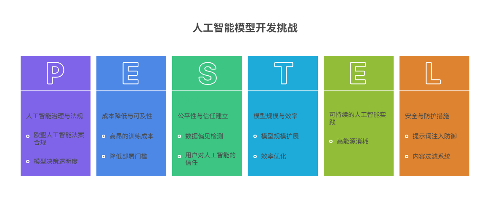

### **风险防线:**
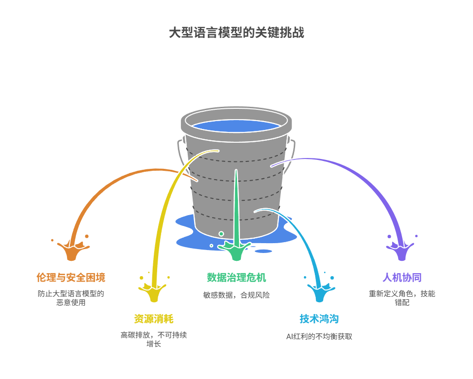

