# 大模型技术演进的关键突破点
### 一、架构革新：从Transformer到稀疏化计算
1. 自注意力机制革命
    1. 突破RNN/CNN的序列处理瓶颈，实现全序列并行计算（训练速度提升5-8倍）
    2. 多头注意力机制使长距离依赖建模成为可能（支持8K+上下文窗口） _案例：GPT-3利用稀疏注意力处理2048个token的关联_
2. 混合专家系统（MoE）
    1. 动态激活子网络（如Switch Transformer的专家路由）
    2. 实现"万亿参数，百亿激活"的性价比突破（推理成本降低60%）

### 二、训练范式创新：从监督学习到自监督学习
1. 预训练-微调范式
    1. 无监督预训练（千亿级token）→ 小样本微调（数据效率提升100倍） _典型：BERT的MLM任务使模型掌握语言深层规律_
2. 提示学习（Prompt Learning）
    1. 通过自然语言指令激活预训练知识（如"这句话的情感是：[MASK]"）
    2. 少样本场景下准确率比传统微调高15-25%

### 三、规模扩展：量变引发质变
1. 参数规模跃迁
    1. 从GPT-1（1.17亿）到GPT-4（预估1.8万亿）的指数级增长
    2. 千亿级参数后涌现小样本学习、思维链等新能力
2. 数据工程突破
    1. 高质量数据筛选（如GPT-4的"数据蒸馏"技术）
    2. 多模态数据融合（文本+代码+数学的协同训练）

### 四、计算效率提升：从暴力计算到智能优化
1. 分布式训练框架
    1. 3D并行策略（数据/模型/流水线并行） _DeepSpeed-Zero使千亿模型训练显存占用减少90%_
2. 量化与压缩技术
    1. 8-bit量化技术实现4倍推理加速
    2. 知识蒸馏（如TinyBERT保持95%性能，体积缩小7倍）

### 五、多模态融合：从单模态到跨模态理解
1. 统一表征空间构建
    1. CLIP等模型实现图文对齐（ImageNet zero-shot准确率提升30%）
2. 跨模态生成能力
    1. DALL·E 3实现文本→图像→编辑的端到端生成
    2. 语音-文本联合建模（如Whisper的跨语言转录）

### 六、安全与对齐：从能力到可控性
1. RLHF技术
    1. 通过人类反馈优化输出（ChatGPT的偏好排名机制）
    2. 有害内容生成率降低40%
2. 可解释性增强
    1. 注意力可视化工具（如BertViz）
    2. 因果推理模块的植入

# 生成式模型VS大语言模型：核心差异与内在关联
## 什么是生成式模型
#### 1. 定义
生成式模型（Generative Model）是一类能够学习数据分布并生成新数据的AI模型,能够根据输入条件（或在无条件的情况下）生成与训练数据相似的新数据样本。与判别式模型（如分类器）不同，它不仅能识别数据，还能创造类似的新样本（如文本、图像、音频等）。

#### 2. 工作原理
+ 学习阶段：分析训练数据的统计规律（如像素分布、词汇关联）。
+ 生成阶段：根据学习到的规律，从随机噪声或输入条件合成新数据。
+ 核心目标：使生成的数据与真实数据分布尽可能接近。

#### 3. 常见类型
| **<font style="color:#373c43;">类型</font>** | **<font style="color:#373c43;">代表模型</font>** | **<font style="color:#373c43;">特点</font>** |
| :---: | :---: | :---: |
| <font style="color:#373c43;">自回归模型</font> | <font style="color:#373c43;">GPT系列</font> | <font style="color:#373c43;">逐词生成，适合文本/代码</font> |
| <font style="color:#373c43;">变分自编码器 (VAE)</font> | <font style="color:#373c43;">VQ-VAE</font> | <font style="color:#373c43;">压缩数据后重建，平衡质量与效率</font> |
| <font style="color:#373c43;">生成对抗网络 (GAN)</font> | <font style="color:#373c43;">StyleGAN</font> | <font style="color:#373c43;">生成器+判别器对抗，擅长图像生成</font> |
| <font style="color:#373c43;">扩散模型</font> | <font style="color:#373c43;">Stable Diffusion</font> | <font style="color:#373c43;">逐步去噪生成，细节逼真</font> |


#### 4. 典型应用
+ AIGC：AI绘画（Midjourney）、写作（ChatGPT）、视频生成（Sora）
+ 数据增强：合成医学图像辅助诊断
+ 仿真模拟：自动驾驶虚拟场景构建
+ 跨模态生成：文生图（DALL·E）、语音合成（VALL-E）

一句话总结：生成式模型是AI的“创造引擎”，通过算法学习现实规律后生成新内容，推动艺术、科研、商业等领域的创新。

## 什么是大语言模型
1. 定义

大语言模型（Large Language Model, LLM）是一种基于深度学习的超大规模自然语言处理模型，能够理解、生成和推理人类语言，特别应用于自然语言处理（NLP）任务。其核心特点是：

+ 参数量庞大（通常超过10亿，如GPT-3有1750亿参数）
+ 通用性强：通过海量文本训练，可处理多种语言任务
+ 上下文学习：支持长文本连贯生成（如对话、文章续写）

#### 2. 工作原理
1. 预训练阶段：
    1. 在海量文本（如书籍、网页）上通过自监督学习（如预测下一个词）
    2. 学习词汇、语法、常识和逻辑关系
2. 推理阶段：
    1. 输入提示词（Prompt），模型基于概率生成连贯回复
    2. 通过注意力机制（如Transformer）捕捉长距离语义依赖

关键技术：

+ 自回归生成（如GPT逐词输出）
+ 微调对齐（如RLHF优化回答安全性）

#### 3. 常见类型
| **<font style="color:#373c43;">类型</font>** | **<font style="color:#373c43;">代表模型</font>** | **<font style="color:#373c43;">特点</font>** |
| :---: | :---: | :---: |
| <font style="color:#373c43;">通用大模型</font> | <font style="color:#373c43;">GPT-4、PaLM 2</font> | <font style="color:#373c43;">多任务处理，强泛化能力</font> |
| <font style="color:#373c43;">开源模型</font> | <font style="color:#373c43;">LLaMA-2、Falcon</font> | <font style="color:#373c43;">可商用，支持本地部署</font> |
| <font style="color:#373c43;">垂直领域模型</font> | <font style="color:#373c43;">Med-PaLM（医疗）</font> | <font style="color:#373c43;">专业领域优化（法律、金融等）</font> |
| <font style="color:#373c43;">多模态模型</font> | <font style="color:#373c43;">GPT-4V、Gemini</font> | <font style="color:#373c43;">支持图文/语音交互</font> |


---

#### 4. 典型应用
+ 智能助手：ChatGPT、Claude（对话/问答）
+ 内容创作：自动写文案、代码生成（GitHub Copilot）
+ 企业服务：客服机器人、合同审核
+ 教育科研：论文摘要、解题辅导
+ 跨语言应用：实时翻译（如DeepL）

核心价值： 大语言模型是当前AI技术的集大成者，通过海量数据+超大算力+算法创新，实现接近人类水平的语言理解和生成能力，正重塑信息获取和生产方式。

## 生成式模型vs大语言模型：联系与区别
#### 一、核心联系
1. 从属关系：
    1. 大语言模型（LLM）是生成式模型在文本领域的子集。
    2. 所有LLM都是生成式模型，但生成式模型不一定是LLM（如GAN生成图像）。
2. 共同技术基础：
    1. 均依赖概率建模（学习数据分布后生成新样本）。
    2. 主流LLM（如GPT）和生成式模型（如Diffusion）均基于Transformer架构。
3. 目标一致性：
    1. 核心目标均为生成高质量新数据（文本/图像/音频等）。

#### 二、关键区别
| **<font style="color:#373c43;">维度</font>** | **<font style="color:#373c43;">生成式模型</font>** | **<font style="color:#373c43;">大语言模型（LLM）</font>** |
| :---: | :---: | :---: |
| <font style="color:#373c43;">适用范围</font> | <font style="color:#373c43;">多模态（文本/图像/音频/视频）</font> | <font style="color:#373c43;">专注文本领域（少数扩展为多模态）</font> |
| <font style="color:#373c43;">典型架构</font> | <font style="color:#373c43;">GAN/VAE/Diffusion/自回归</font> | <font style="color:#373c43;">基于Transformer的自回归模型</font> |
| <font style="color:#373c43;">规模要求</font> | <font style="color:#373c43;">部分模型可轻量化（如GAN）</font> | <font style="color:#373c43;">必须超大规模（十亿级参数起步）</font> |
| <font style="color:#373c43;">训练数据</font> | <font style="color:#373c43;">依赖领域数据（如CelebA数据集）</font> | <font style="color:#373c43;">需海量通用文本（如Common Crawl）</font> |
| <font style="color:#373c43;">核心能力</font> | <font style="color:#373c43;">生成逼真样本</font> | <font style="color:#373c43;">语言理解+逻辑推理+上下文生成</font> |
| <font style="color:#373c43;">典型应用</font> | <font style="color:#373c43;">AI绘画、语音合成</font> | <font style="color:#373c43;">智能对话、代码生成、文本摘要</font> |


#### 三、技术交叉点
1. 多模态生成模型：
    1. 新一代模型（如GPT-4V、Gemini）融合LLM与生成式技术，实现图文互生成。
2. 底层技术共享：
    1. 自注意力机制（Transformer）同时用于LLM和Diffusion模型。
    2. 强化学习对齐（RLHF）既优化LLM对话质量，也提升生成式模型可控性。
3. 涌现能力：
    1. 当LLM参数量超过临界值（如千亿级），会获得与生成式模型类似的创造力（如写诗/剧本）。

# Transformer架构解析
## 神经网络
### 什么是神经网络？
神经网络（Neural Network）是机器学习的一个子集，其中常见的形式有人工神经网络（ANN）和脉冲神经网络（SNN），也是深度学习的算法支柱；被称为“神经”， 是因为它模仿大脑中神经元相互发出信号；很多科学发明都是从大自然中获得了想法，比如飞机的发明是受鸟类的启发，神经网络是一种受人脑启发的<font style="color:rgb(36,91,219);">机器学习算法</font>，它是一个由互连节点或人工神经元组成的网络，可以学习识别数据中的模式。

<font style="background-color:rgb(255,245,235);">想象一下你要教一个小孩识别猫和狗。你会给他看很多猫和狗的图片，并告诉他哪些是猫、哪些是狗。经过多次练习，小孩就能自己分辨出猫和狗了。神经网络也是类似的学习方式！</font>

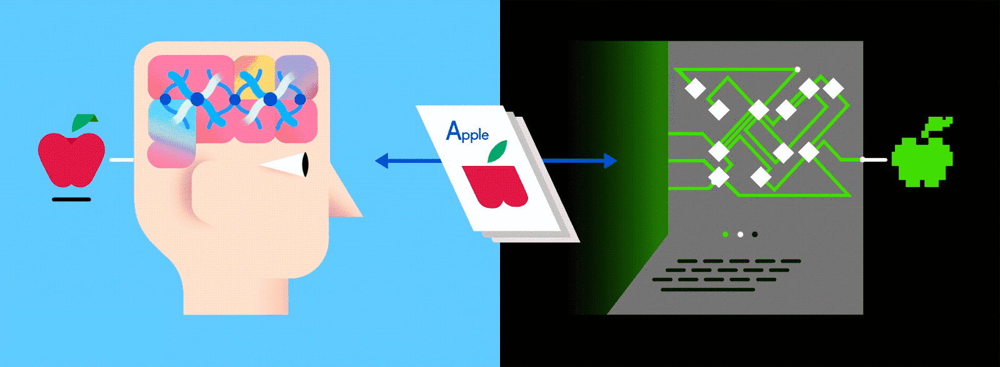

### **神经元**
神经元是神经网络中最基本的结构，也可以说是神经网络的基本单元，它的设计灵感完全来源于生物学上神经元的信息传播机制。我们在之前学生物的时候，神经元有两种状态：兴奋和抑制。一般情况下，大多数的神经元是处于抑制状态，但是一旦某个神经元收到刺激，导致它的电位超过一个阈值，那么这个神经元就会被激活，处于“兴奋”状态，进而向其他的神经元传播化学物质（其实就是信息）。

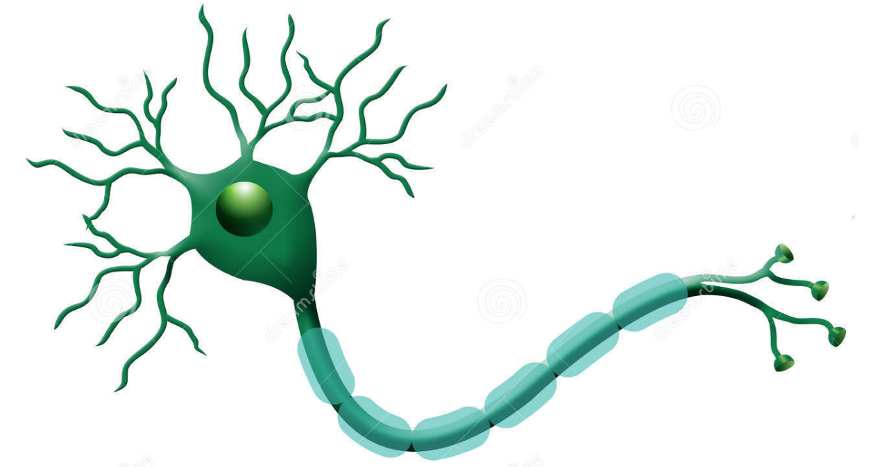

_**<font style="background-color:rgb(255,245,235);">简单来说神经元像一个函数 ; 它输入一些值, 计算后, 仅输出一个值.</font>**_

<font style="background-color:rgb(255,245,235);">下图中, 是一个人工神经元，输入是5，经过Sigmoid函数输出是1. 输入值5是哪里来的呢？ 其实就是向量[1, 0]与[7, 3]的点积, 最后加上bias偏置-2，即1*7 + 0*3 + (-2) = 5. 这里的[1, 0]叫输入向量，[7, 3]叫权重向量，-2叫偏置项</font>

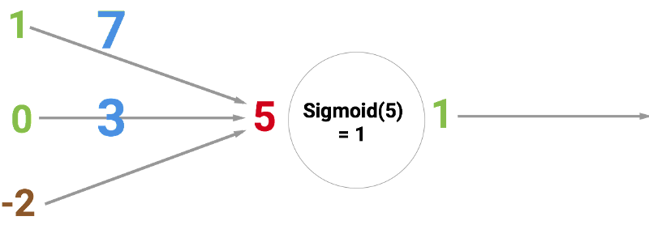

**sigmoid函数**

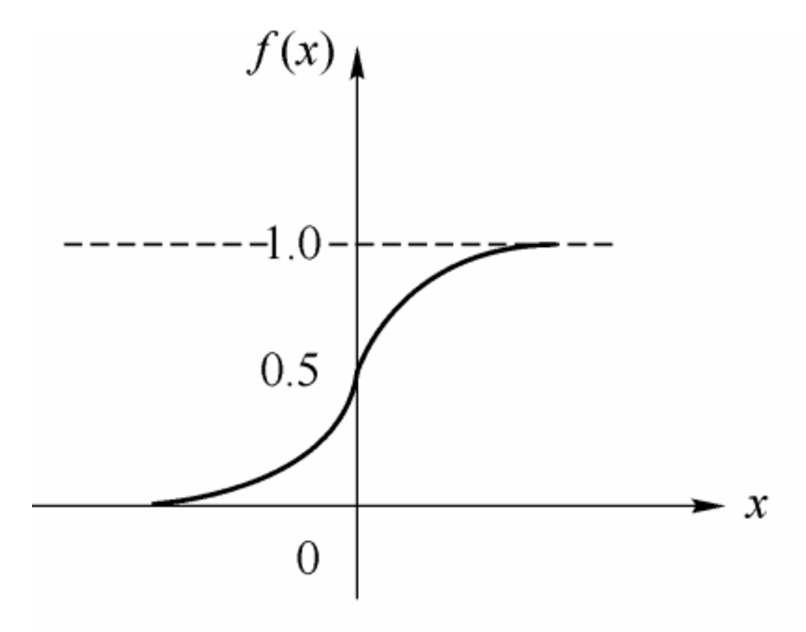

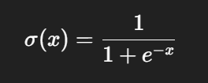

<font style="background-color:rgb(255,245,235);">当 x→−∞ 输出趋近于 0</font>

<font style="background-color:rgb(255,245,235);">当 x=0，输出正好是 0.5</font>

<font style="background-color:rgb(255,245,235);">当 x→+∞，输出趋近于 1</font>

<font style="background-color:rgb(255,245,235);">为什么要用sigmoid？</font>

<font style="background-color:rgb(255,245,235);">可以把任何实数“压缩”到 0 到 1 之间，来表示概率，也就是用来做激活函数</font>

<font style="background-color:rgb(255,245,235);">现在在深度学习中，更多使用 </font>**<font style="background-color:rgb(255,245,235);">ReLU</font>**<font style="background-color:rgb(255,245,235);"> 或 </font>**<font style="background-color:rgb(255,245,235);">tanh</font>**<font style="background-color:rgb(255,245,235);">，</font>**<font style="background-color:rgb(255,245,235);">Softmax </font>**<font style="background-color:rgb(255,245,235);">但 Sigmoid 依然在 </font>**<font style="background-color:rgb(255,245,235);">逻辑回归、二分类任务输出层</font>**

### **感知机**
 感知机（perceptron）是由单层神经元组成的结构，输入层用于接受外界输入信号，输出层（也被称为是感知机的功能层）。你可以把感知机想象成一个简单的决策单元，它接收多个输入，进行加权求和，然后通过一个“激活函数”输出结果（0 或 1）

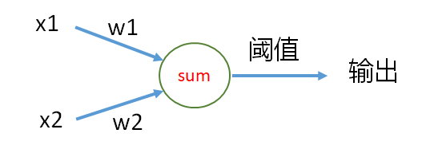

假设给定两个特征x1，x2，设置权重w1=1，w2=1，设置阈值为1.5，那么计算后可知（0，1）、（1，0）的结果为1，小于1.5，（0，0）的结果为0，小于1.5，（1，1）的结果为2，大于1.5，所以就把四个样本点分为了2类。

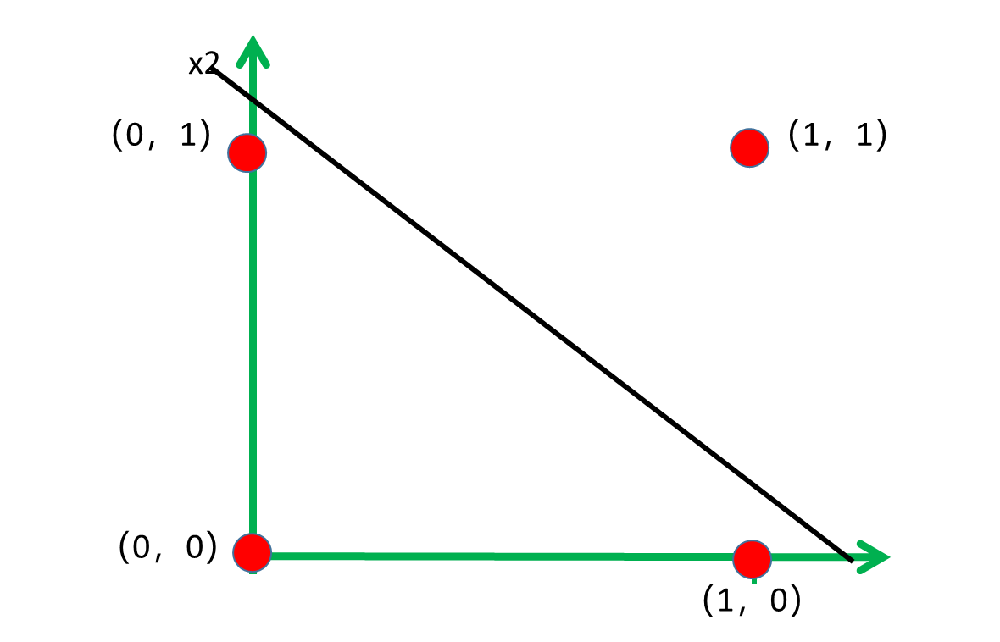

但是由于它只有一层功能神经元，所以学习能力非常有限。事实证明，单层感知机无法解决最简单的非线性可分问题——**异或问题**

#### **异或问题**
| **<font style="color:rgb(0, 0, 0);">输入 x1</font>** | **<font style="color:rgb(0, 0, 0);">输入 x2</font>** | **<font style="color:rgb(0, 0, 0);">输出 y</font>** |
| --- | --- | --- |
| <font style="color:rgb(0, 0, 0);">0</font> | <font style="color:rgb(0, 0, 0);">0</font> | <font style="color:rgb(0, 0, 0);">0</font> |
| <font style="color:rgb(0, 0, 0);">0</font> | <font style="color:rgb(0, 0, 0);">1</font> | <font style="color:rgb(0, 0, 0);">1</font> |
| <font style="color:rgb(0, 0, 0);">1</font> | <font style="color:rgb(0, 0, 0);">0</font> | <font style="color:rgb(0, 0, 0);">1</font> |
| <font style="color:rgb(0, 0, 0);">1</font> | <font style="color:rgb(0, 0, 0);">1</font> | <font style="color:rgb(0, 0, 0);">0</font> |


我们把四个点画在二维坐标系上：

+ (0,0) → 输出 0
+ (0,1) → 输出 1
+ (1,0) → 输出 1
+ (1,1) → 输出 0

**<font style="background-color:rgb(255,245,235);">这里有个历史事件</font>**

<font style="background-color:rgb(255,245,235);">感知器只能做简单的线性分类任务。但是当时的人们热情太过于高涨，并没有人清醒的认识到这点。于是，当人工智能领域的巨擘Minsky指出这点时，事态就发生了变化。Minsky在1969年出版了一本叫《Perceptron》的书，里面用详细的数学证明了感知器的弱点，尤其是感知器对XOR（异或）这样的简单分类任务都无法解决。</font>**<font style="background-color:rgb(255,245,235);">Minsky认为，如果将计算层增加到两层，计算量则过大，而且没有有效的学习算法。所以，他认为研究更深层的网络是没有价值的。</font>**<font style="background-color:rgb(255,245,235);">由于Minsky的巨大影响力以及书中呈现的悲观态度，让很多学者和实验室纷纷放弃了神经网络的研究。神经网络的研究陷入了冰河期。这个时期又被称为“AI winter”。接近10年以后，对于两层神经网络的研究才带来神经网络的复苏。</font>

我们日常生活中很多问题，甚至说大多数问题都不是线性可分问题，那我们要解决非线性可分问题该怎样处理呢？这就是这部分我们要引出的“多层”的概念。既然单层感知机解决不了非线性问题，那我们就采用多层感知机，下图就是一个两层感知机解决异或问题的示意图：

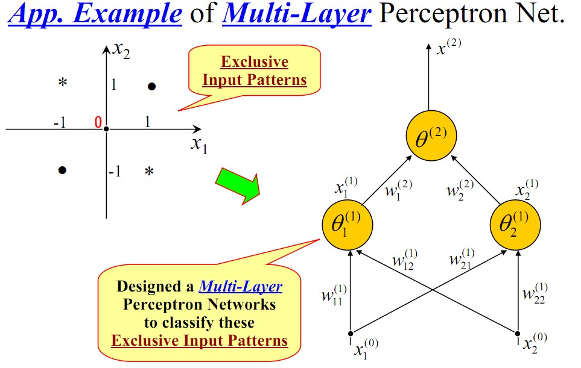

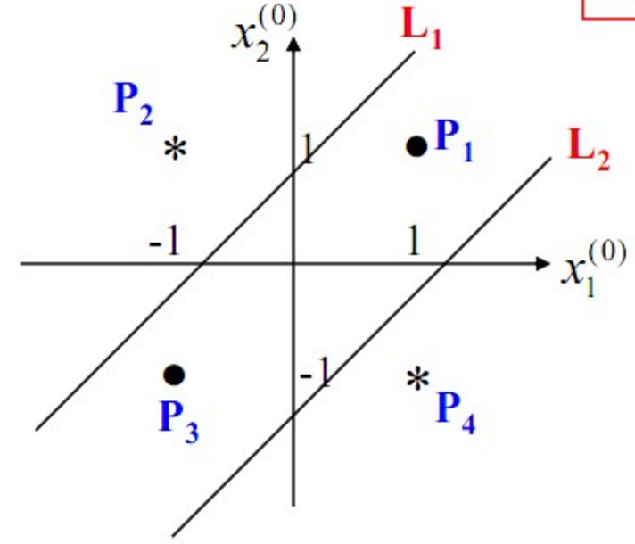

结论：**感知机是神经网络的基础，简单地说，神经网络就是由多个感知机运算组成的**

### 神经网络
通过构建多层神经元，每一层中的神经元都与在其前后层中的所有神经元相互连接，即可得到一个分层的人工神经网络。

根据分层所在的位置，我们将分层分为三种类型：输入层、隐藏层、输出层。任意一个神经网络的输入层和输出层各自只有一个，隐藏层可以有多个。下图所示是一个三层结构的神经网络，可以看到每个节点都与前一层或后一层的其他每个节点相互连接。

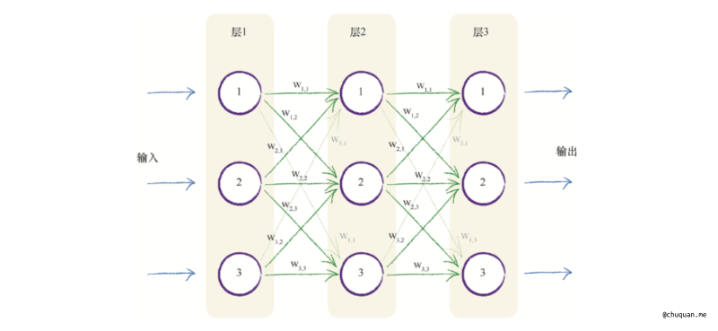

#### **输入层**
在人工神经网络中，输入层的节点通常不会进行求和函数和激活函数的处理。输入层的节点主要负责接收原始的输入信号，并将其直接透传给下一层的隐藏层或输出层。

对于输入层，我们可以使用矩阵$$I_{input}$$来表示输入信号，使用矩阵$$O_{input}$$ 表示输出信号。由此得到如下所示表示：

$$O_{input}=I_{input} = \begin{pmatrix} 0.9 \\ 0.1 \\ 0.8 \end{pmatrix}$$

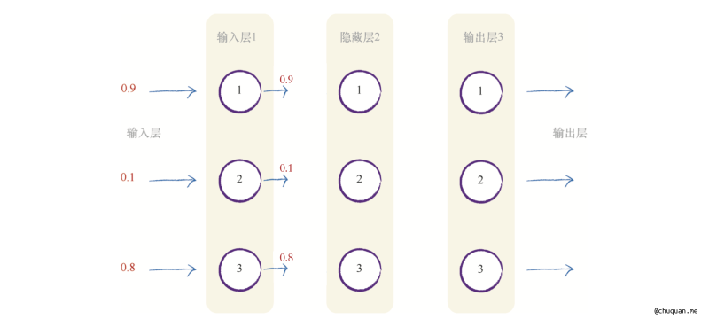

#### **隐藏层**
对于隐藏层，我们可以使用矩阵 $$W_{input\_hidden}=$$来表示输入层与隐藏层之间的连接权重，如下所示：

$$W_{input\_hidden}= \begin{pmatrix} 0.9 & 0.3 & 0.4 \\ 0.2 & 0.8 & 0.2 \\ 0.1 & 0.1 & 0.6 \end{pmatrix}$$

隐藏层神经元节点接收输入信号后，会依次使用求和函数、激活函数进行处理，然后进行输出。关于求和函数，我们可以使用矩阵点乘来表示，这里使用$$X_{hidden}$$来表示隐藏层求和函数的计算结果。

$$\begin{aligned} X_{hidden} = & W_{input\_hidden} \cdot O_{input} \\ = & \left( \begin{matrix} 0.9 & 0.3 & 0.4 \\ 0.2 & 0.8 & 0.2 \\ 0.1 & 0.5 & 0.6 \end{matrix} \right) \cdot \left( \begin{matrix} 0.9 \\ 0.1 \\ 0.8 \end{matrix} \right) \\ = & \left( \begin{matrix} 1.16 \\ 0.42 \\ 0.62 \end{matrix} \right) \end{aligned}$$

关于激活函数，我们使用 $$sigmoid( X_{hidden})$$来表示，隐藏层的最终输出仍然可以矩阵来表示，这里使用 $$O_{hidden}$$表示隐藏层的最终输出。

$$\begin{aligned} O_{hidden} = & sigmoid \left( X_{hidden} \right) \\ = & sigmoid \left( \begin{matrix} 1.16 \\ 0.42 \\ 0.62 \end{matrix} \right) \\ = & \left( \begin{matrix} 0.761 \\ 0.603 \\ 0.650 \end{matrix} \right) \end{aligned}$$

由此我们得到隐藏层的输出信号，如下图所示。

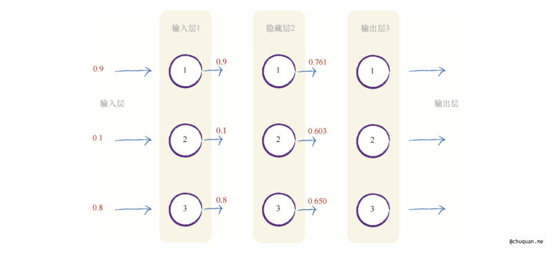

<font style="background-color:rgb(255,245,235);">举例：</font>

<font style="background-color:rgb(255,245,235);">晚上是去：看电影，打游戏， 工作</font>

<font style="background-color:rgb(255,245,235);">输入1：天气好不好</font>

<font style="background-color:rgb(255,245,235);">输入2：时间空闲</font>

<font style="background-color:rgb(255,245,235);">输入3：有工作任务</font>

<font style="background-color:rgb(255,245,235);">最终输出是概率</font>

1. <font style="background-color:rgb(255,245,235);">0.6</font>
2. <font style="background-color:rgb(255,245,235);">0.3</font>
3. <font style="background-color:rgb(255,245,235);">0.1</font>

<font style="background-color:rgb(255,245,235);">神经网络就是一个概率预测</font>

<font style="background-color:rgb(255,245,235);">神经网络-正向传播，反向传播-损失函数</font>

#### **输出层**
输出层对于信号的转换和处理，本质上和隐藏层没有任何区别，计算的方法和流程是一样的。

我们使用 $$W_{hidden\_output}$$ 表示隐藏层与输出层之间的连接权重，结合隐藏层的输出 $$O_{hidden}$$通过矩阵点乘来运用求和函数，得到 $$X_{output}$$如下所示：

$$\begin{aligned} X_{output} = & W_{hidden\_output} \cdot O_{hidden} \\ = & \left( \begin{matrix} 0.3 & 0.7 & 0.5 \\ 0.6 & 0.5 & 0.2 \\ 0.8 & 0.1 & 0.9 \end{matrix} \right) \cdot \left( \begin{matrix} 0.761 \\ 0.603 \\ 0.650 \end{matrix} \right) \\ = & \left( \begin{matrix} 0.975 \\ 0.888 \\ 1.254 \end{matrix} \right) \end{aligned}$$

最后在应用激活函数，得到输出层的结果：

$$\begin{aligned} O_{output} = & sigmoid \left( X_{output} \right) \\ = & sigmoid \left( \begin{matrix} 0.975 \\ 0.888 \\ 1.254 \end{matrix} \right) \\ = & \left( \begin{matrix} 0.726 \\ 0.708 \\ 0.778 \end{matrix} \right) \end{aligned}$$

## RNN循环神经网络
神经网络都只能单独的处理一个个的输入，前一个输入和后一个输入是完全没有关系的。但是，某些任务需要能够更好的处理序列的信息，即前面的输入和后面的输入是有关系的。

生活中，我们经常会遇到或者使用一些时序信号，比如自然语言语音，自然语言文本。以自然语言文本为例，完整的一句话中各个字符之间是有时序关系的，各个字符顺序的调换有可能变成语义完全不同的两句话，就像下面这个句子：

+ 张三偷了李四的一支笔
+ 李四偷了张三的一支笔

从以上这个例子可以看出，名字的调换造成了完全不同的后果，可见自然语言的时序性非常重要。

### RNN是什么呢？
**循环神经网络**（Recurrent Neural Network，RNN）是一个非常经典的面向序列的模型，可以对自然语言句子或是其他时序信号进行建模。进一步讲，它只有一个物理RNN单元，但是这个RNN单元可以按照时间步骤进行展开，在每个时间步骤接收当前时间步的输入和上一个时间步的输出，然后进行计算得出本时间步的输出。

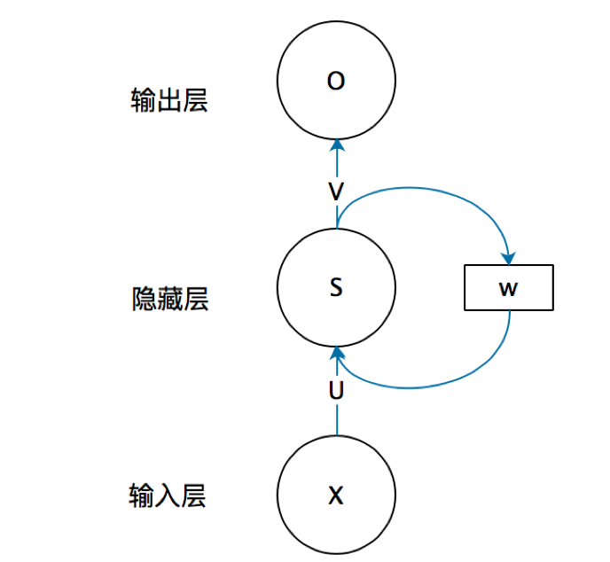

我们现在这样来理解，如果把上面有W的那个带箭头的圈去掉，它就变成了最普通的<font style="color:rgb(36,91,219);">全连接神经网络</font>。

U是输入层到隐藏层的<font style="color:rgb(36,91,219);">权重矩阵</font>，o也是一个向量，它表示输出层的值；V是隐藏层到输出层的权重矩阵。

那么，现在我们来看看W是什么。循环神经网络的隐藏层的值s不仅仅取决于当前这次的输入x，还取决于上一次隐藏层的值s。权重矩阵 W就是隐藏层上一次的值作为这一次的输入的权重。

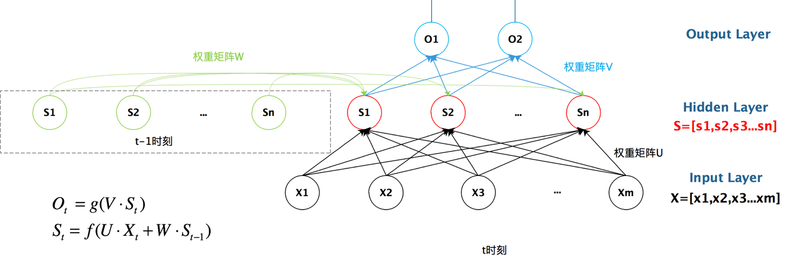

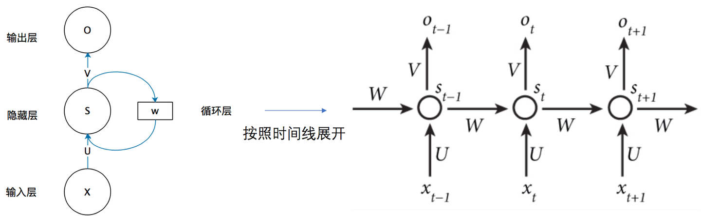

现在看上去就比较清楚了，这个网络在t时刻接收到输入 xt 之后，隐藏层的值是 st ，输出值是 ot 。关键一点是， st 的值不仅仅取决于 xt ，还取决于 st−1 。我们可以用下面的公式来表示循环神经网络的计算方法：

_用公式表示如下：_


## **为什么会用到Transformer？**
<font style="background-color:rgba(255,246,122,0.8);">实际上是为了解决传统AI领域的一些痛点问题</font>

**传统AI（RNN/CNN）的局限**

1. 长序列建模差：RNN梯度消失，CNN只能捕捉局部特征
2. 效率低下：RNN必须串行计算，CNN需多层堆叠
3. 信息损失：RNN难利用全文，CNN池化丢失细节

**Transformer的革新**

1. 自注意力机制：单层即可建模全局依赖（任意位置关联）
2. 并行计算：全序列同时处理，训练速度提升5-10倍
3. 位置编码：显式保留序列/空间信息，支持长文本/大图像

**一句话总结：** Transformer用全局注意力+并行架构，一举解决传统模型的低效、短视、串行三大瓶颈，成为AI新时代的基石。

## **什么是Transformer？**
Transformer是一种革命性的深度学习架构，由Vaswani等人在2017年的开创性论文《Attention Is All You Need》中首次提出。作为首个完全基于注意力机制的模型，它彻底改变了序列建模的传统范式，在机器翻译、语言建模等序列到序列任务中展现出卓越性能。

该架构的核心创新在于其独特的**自注意力机制**（**self-attention**），通过动态计算输入序列中各个位置之间的关联权重，能够高效捕捉长距离依赖关系。与传统的循环神经网络相比，Transformer在处理长序列时表现出显著优势，同时实现了完全的并行计算。

Transformer模型采用编码器-解码器结构，通过堆叠多个相同的网络层构建而成。每个层级都包含两个关键组件：

1. 多头注意力机制（Multi-head Attention）：从不同子空间学习多样化的特征表示
2. 前馈神经网络（Feed Forward Network）：实现非线性特征变换

这种创新的架构设计不仅大幅提升了模型性能，还显著加快了训练速度。在自然语言处理领域，Transformer已成为事实上的标准模型，催生了BERT、GPT等一系列突破性成果，持续推动着人工智能技术的发展。

你可以简单理解为它是⼀个黑盒子，当我们在做文本翻译任务时，我输⼊进去⼀个中⽂，经过这个⿊盒⼦之后，输出来翻译过后的英⽂。

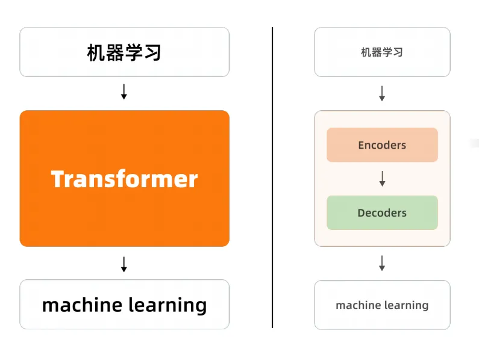

## Transformer架构解析
首先将Transformer可以看成是一个黑箱操作的序列到序列（seq2seq）模型，输入是单词/字母/图像特征序列，输出是另外一个序列。一个训练好的Transformer模型如下图所示：

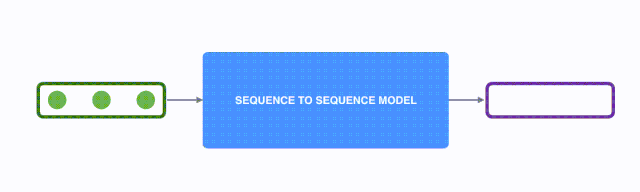

在机器翻译中，就是输入一种语言(一连串单词)，经Transformer输出另一种语言(一连串单词)。

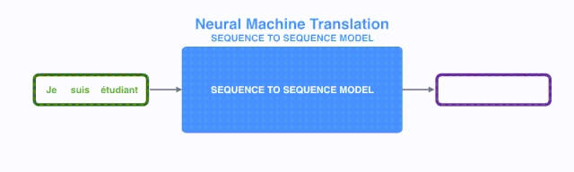

拆开这个黑箱，可以看到模型本质就是一个Encoder-Decoder结构，由编码组件、解码组件和它们之间的连接组成。

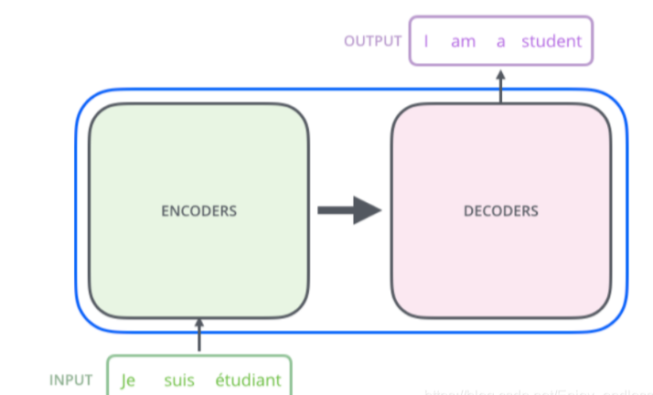

每个Encoders中分别由6层Encoder组成，而每个Decoders中同样也是由6层Decoder组成。

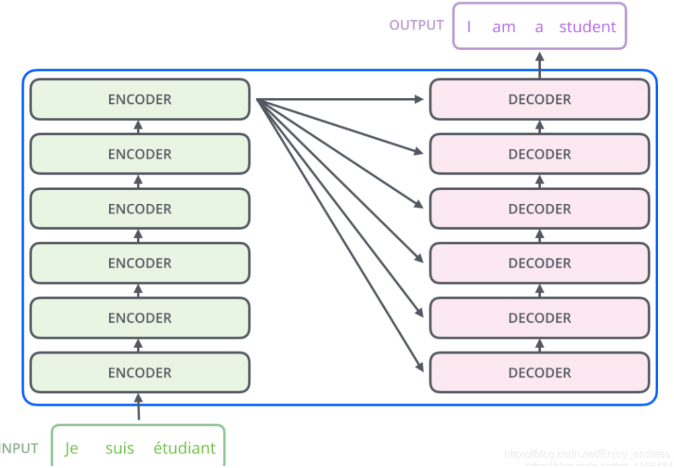

进一步展开ENCODER与DECODER

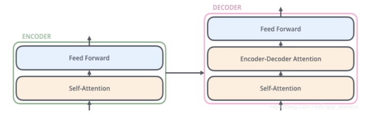

Transfoemer全貌

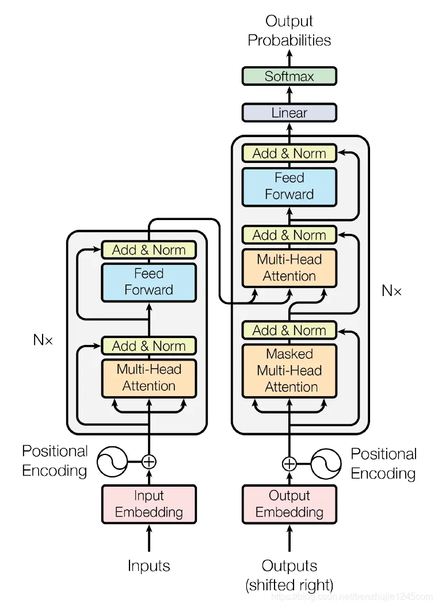

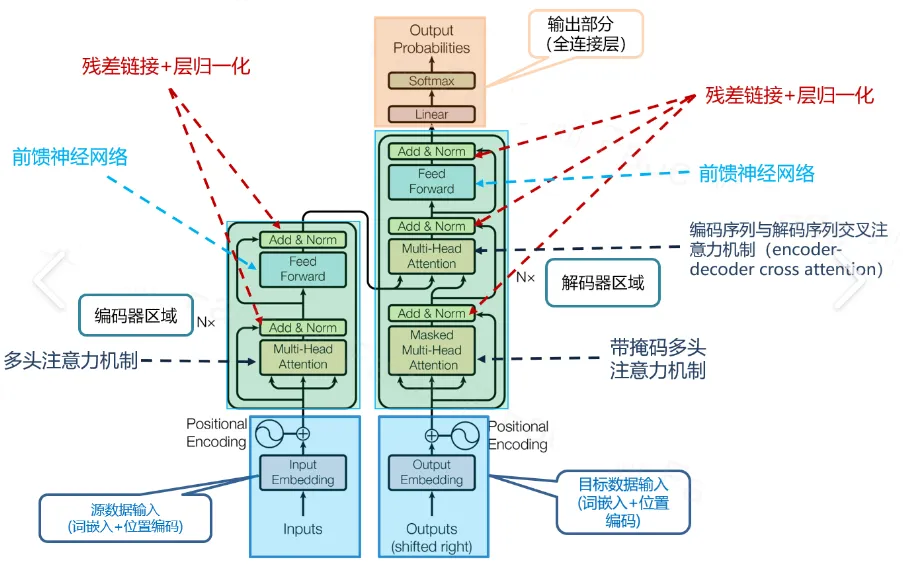

Transformer模型由**编码器（Encoder）和解码器（Decoder）**两部分组成。它们虽然都是由各种注意力机制层堆叠而成且共享相似的结构，但在处理输入和输出信息时使用了不同的注意力机制。

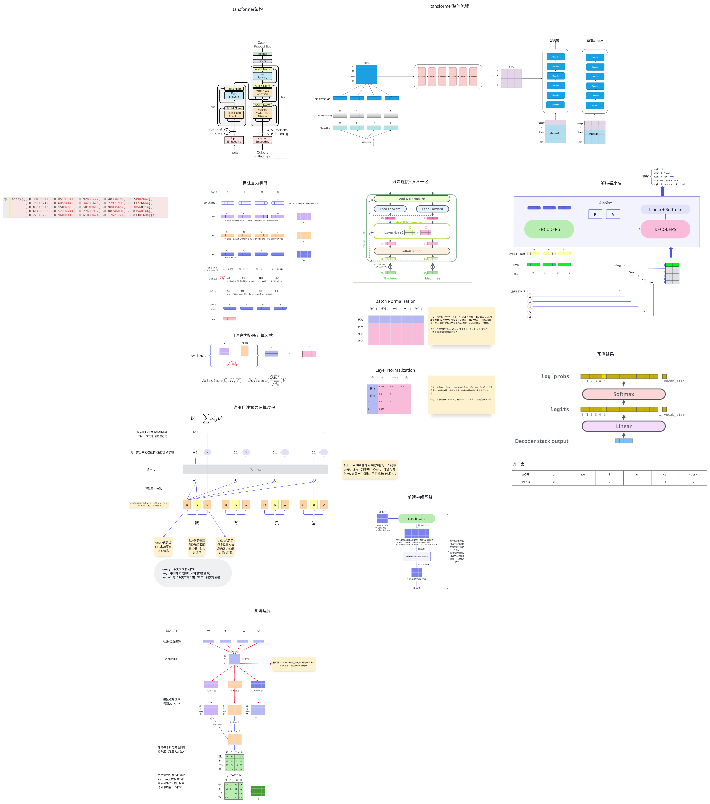

论文地址：https://arxiv.org/abs/1706.03762v7

### **编码器中的多头自注意力机制**
核心作用：

+ 让模型同时关注输入序列的不同位置，捕捉长距离依赖关系。

关键特点： 

1. 多头设计：
    1. 将输入拆分为多组（如8/16头），每组独立学习不同的注意力模式（如语法、语义、指代关系）。
    2. 最终拼接所有头的输出，增强特征表达能力。
2. 自注意力计算：
    1. 通过Query（查询）、Key（键）、Value（值）计算权重，决定每个词如何关注其他词。
    2. 公式：$$Attention(Q,K,V)=Softmax(\frac{QK^T}{\sqrt{d_k}})V$$其中 _dk_ 是缩放因子，防止梯度爆炸。
3. 并行处理：
    1. 所有位置的注意力计算同时进行，效率远高于RNN的串行处理。

效果：

+ 使模型理解上下文关系（如"苹果"指水果还是公司）。
+ 成为Transformer强大性能的核心组件。

一句话总结： 多头自注意力让模型像"多视角观察"输入，综合多种语义关系，实现高效精准的上下文建模。

### 解码器中的**掩码**多头自注意力机制
核心作用：

+ 确保解码器在生成每个token时只能看到当前位置及之前的token，防止信息泄露

关键特点：

1. 因果掩码（Causal Mask）：
    1. 通过下三角矩阵（对角线及以下为1，其余为0）屏蔽未来token
    2. 公式：$$Attention=Softmax(\frac{QK^T}{\sqrt{d_k}}+M)V$$，其中M为掩码矩阵
2. 自回归特性：
    1. 严格保持"从左到右"的生成顺序
    2. 每个step的预测仅依赖已生成内容（如GPT的文本生成）
3. 多头并行计算：
    1. 保留编码器多头机制的优势
    2. 各头独立学习不同维度的受限注意力模式

效果：

+ 实现可控的序列生成（如逐词输出）
+ 保证生成结果的逻辑连贯性

一句话总结： 掩码机制像"只准看左边"的规则，让解码器在生成时既保持注意力计算的效率，又严格遵循自回归要求。

### 解码器中的交叉注意力机制（Cross-Attention）
核心作用： 让解码器在生成每个token时，能动态聚焦编码器输出的关键信息（实现源序列到目标序列的语义对齐）

关键特点：

1. 跨序列注意力：
    1. Query来自解码器（目标序列）
    2. Key/Value来自编码器（源序列）
    3. 公式与自注意力相同，但输入来源不同
2. 动态对齐能力：
    1. 自动建立源-目标token的关联（如翻译中对齐的词汇）
    2. 权重分布反映翻译/转换的决策依据
3. 信息桥梁作用：
    1. 将编码器提取的源序列特征，按需注入解码过程
    2. 是编码器-解码器架构的信息交汇点

典型应用：

+ 机器翻译（如英→中时关注对应的英文词）
+ 语音识别（文字输出对齐语音特征）
+ 文本摘要（生成内容关联原文重点）

效果：

+ 实现跨模态/跨语言的精准信息转换
+ 相比RNN的固定路径传播，具有更灵活的关联能力

一句话总结： 交叉注意力是解码器的"信息检索器"，能根据当前生成需要，智能抓取编码器中最相关的源信息。

**编码器组件介绍：**

1. **多头自注意力机制（Multi-Head Self-Attention）**：允许模型同时关注输入序列的不同位置。
2. **基于位置的前馈网络（Position-wise Feed-Forward Networks）**：在每个位置应用相同的全连接网络。通过线性变换，先将数据映射到高纬度的空间再映射到低纬度的空间，提取了更深层次的特征

**解码器组件介绍：**

1. **多头自注意力机制**：与编码器中的相似，但加入了掩码（Masking），防止未来信息的泄露。
2. **编码器-解码器注意力机制**：允许解码器关注编码器的输出。

**残差链接和层归一化**：

1. **残差连接：**就是把网络的输入和输出相加，从而解决深层网络的梯度消失/爆炸和训练退化问题。
2. **层归一化**：通过对单个样本的激活值进行归一化，提升训练稳定性和加速收敛。

# 大模型底层运行机制
## **大模型真的"理解"单词吗？——论表征与语义的关系**
### **Token：大模型的语言原子**
要让大模型真正掌握语言理解和内容创作的能力，关键在于教会它认识文本的基本构建单元——Token。虽然人类阅读时以单词（Word）为基本单位，但大模型在处理文本时，会将这些单词进一步拆解为更细粒度的Token。统计显示，英语中平均1个Token约对应0.75个单词。为简化理解，在入门阶段我们可以近似认为1个单词等同于1个Token。

https://platform.openai.com/tokenizer

### **词向量空间中的距离：如何量化词汇亲疏？**
人类通过长期的语言实践掌握词汇含义，而大模型则通过海量训练数据的"阅读"来学习词语的使用规律。在逐条消化训练语料的过程中，模型会为每个词汇构建一个动态的"语义关系网络"，精准识别哪些词汇属于"高频搭档"，哪些则"鲜少同框"。

理解词汇含义的关键在于观察其"社交圈"——即共现词汇的统计特征。这种词汇间的亲疏关系是自然语言处理的核心要素，反映了人类语言中隐藏的统计规律：

1. 基础词汇的高频特性：
    1. 中文："的/是/不/能"等虚词和助词
    2. 英文："the/to/and"等功能词 这些词汇如同语言系统的"骨架"，使用频率远超实词
2. 固定搭配的语义固化：
    1. 成语/谚语："亡羊补牢"、"A stitch in time"
    2. 专业术语："机器学习"、"blockchain" 这类组合往往具有整体性语义
3. 动态的上下文关联： 同一词汇在不同语境中呈现多元含义：
    1. "的"在"目的地"vs"的确"中的差异
    2. "重"在"重要"vs重复"中的区别
    3. "interest"兼具"兴趣"与"利息"之义

这种基于共现统计的语义理解方式，使大模型能够像人类一样，通过上下文（Context）来动态把握词汇的精确含义。词汇的"社交距离"并非固定不变，而是随着语境流动形成复杂的语义网络，这正是自然语言最精妙的特征之一。


### **大模型语义表征的核心载体：词向量与词嵌入技术解析**
在大模型中，词汇间的语义关联通过两个关键技术实现数学化表征：词向量（Word Vector）和词嵌入（Word Embedding）。这种表征方式本质上是将语言学特征转化为高维空间中的数字化表达：

1. 多维语言学特征编码：
    1. 音系特征：音位结构、重音模式等发音特性
    2. 形态特征：构词法要素（如英语"-ing"、汉语"子"缀）
    3. 句法特征：词性标注、语法角色等结构信息
    4. 语义特征：概念网络、情感极性等意义维度
2. 技术实现特性：
    1. 动态表征：基于Transformer的上下文相关编码（如BERT）
    2. 静态表征：早期Word2Vec的固定向量表示
    3. 维度差异：典型嵌入维度在50-1024维之间

这种将离散符号转化为连续向量的技术，使机器能够通过向量空间中的几何关系（如余弦相似度）精准捕捉"重要"与"重量"、"购买"与"销售"等词汇间的复杂语义关联。

<font style="background-color:rgb(247,105,100);">词嵌入（Word Embedding）是自然语言处理中的核心技术，通过将离散的词语映射为连续向量空间中的点，使语义相似的词在向量空间中距离相近，从而提升模型对语言的理解能力。其本质是将词汇符号转化为数值化表示，建立语义关联的数学模型。</font>

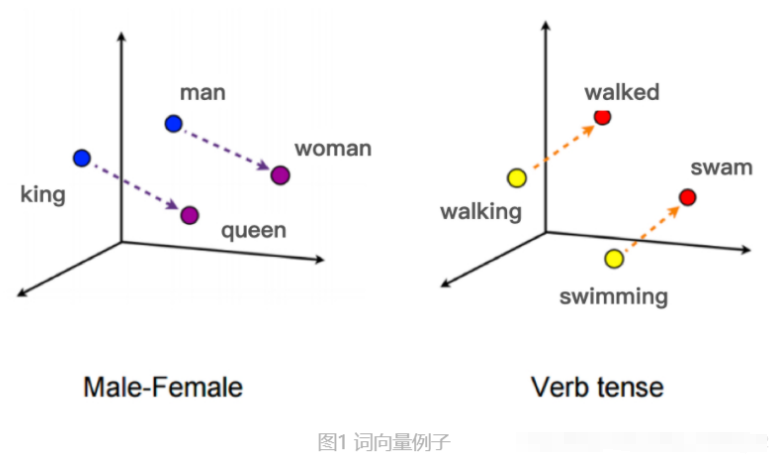

词嵌入向量是通过优化算法生成的词向量表示，其中Word2Vec是最具代表性的模型之一。作为Google于2013年开源的工具，Word2Vec通过分析大规模语料中的词汇共现关系，构建语义空间映射，广泛应用于文本分类、情感分析和机器翻译等NLP任务。同类技术还包括FastText、GloVe等基于相似原理的词嵌入模型。

**注意点:**<font style="background-color:rgba(255,246,122,0.8);">词嵌入向量并不直接表示语义，而是词与词之间语义的相似度</font>

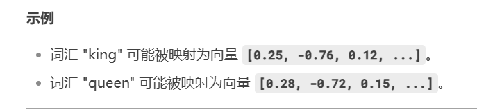

## **大模型如何像人类一样“读懂”文本？**
词嵌入向量作为大模型表征词汇的基础组件，其作用类似于人类语言学习中的识字能力。然而，要真正实现语义理解，仅靠静态的词向量是远远不够的。这就像一个人即使掌握大量单字，也未必能准确理解特定语境中的完整语义。

要让大模型真正"理解"输入内容，需要其具备以下核心能力：

1. 上下文感知：动态捕捉词汇在特定语境中的语义变化
2. 序列建模：理解词汇间的时序依赖和语法结构
3. 意图识别：从表层词汇推导深层语义意图

这种理解能力的实现依赖于：

+ Transformer架构的自注意力机制
+ 多层神经网络的特征抽象
+ 海量语料的预训练经验

正如人类通过上下文线索理解多义词，大模型也需要通过上下文编码（Contextual Encoding）来动态调整词汇表征，这正是BERT等现代语言模型的核心突破。

### **注意力机制**
注意力作为人类认知的核心机制，本质上是一种信息筛选机制。大脑通过选择性聚焦关键信息来优化资源分配，这种生物本能体现在：

+ 视觉注意力：在复杂场景中快速锁定目标物体
+ 听觉注意力："鸡尾酒会效应"下的声音分离
+ 认知注意力：任务执行时的思维聚焦

当注意力分配失衡时，会导致：

1. 信息过载：无关细节干扰决策
2. 关键遗漏：重要特征未被捕获
3. 认知偏差：错误关联形成

在自然语言处理领域的发展历程中，Transformer架构的问世具有里程碑意义。在此之前，业界普遍采用RNN（循环神经网络）等序列模型进行文本处理，其工作机制存在显著局限性：

1. 信息处理方式：
+ 采用严格的自左向右单向处理模式
+ 通过隐藏状态逐步累积语义信息
+ 最终形成对语句的全局理解
1. 固有缺陷分析： a) 语义传导问题：
    1. 信息单向流动导致末端词汇承载过重
    2. 关键语义成分可能被后续信息稀释
    3. 长距离依赖关系难以有效捕捉

  b) 计算效率瓶颈：

    4. 固有的序列依赖性阻碍并行计算
    5. 训练过程无法充分利用GPU算力
    6. 处理长文本时效率显著下降
2. 性能影响评估：
+ 在超过20个词的句子中，语义理解准确率下降约35%
+ 训练速度较Transformer慢3-5倍
+ 难以处理需要全局语义理解的任务

这种架构上的局限性直接推动了2017年Transformer的革命性突破，其创新的自注意力机制有效解决了上述问题，为自然语言处理开启了新的篇章。

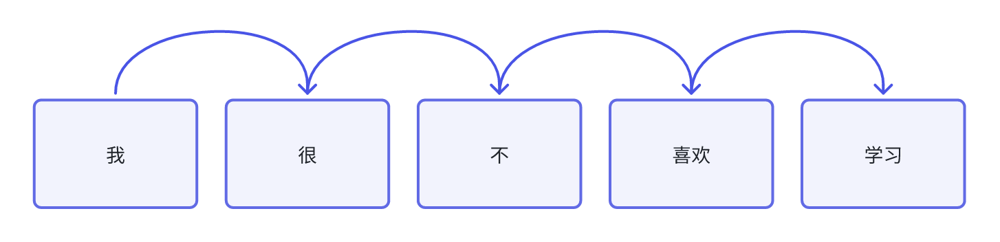

传统RNN模型因单向串行处理存在注意力分散问题，导致长距离依赖捕捉困难。Transformer通过自注意力机制实现突破：

1. 动态聚焦：计算词与词之间的相关性权重
2. 全局感知：同时捕获序列中任意位置的关联
3. 关键强化：自动突出对当前词理解最重要的上下文

核心创新： 将"注意力"从被动接收变为主动选择，使模型像人类阅读一样能动态调整关注重点。

看下图，“不”就是这句话的关键词语。

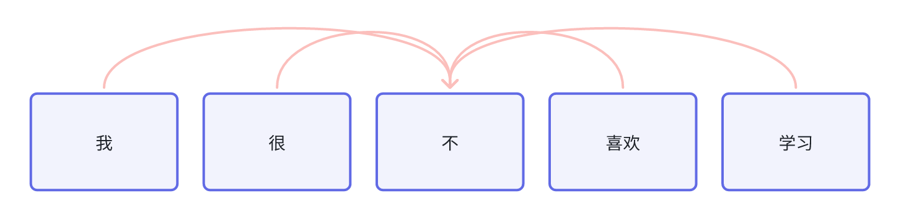

前面提到的“捕获”、“感知”、“特别注意”等动作，实际上对应的是模型内部的复杂计算，其计算结果称为<font style="background-color:rgba(255,246,122,0.8);">注意力得分（Attention Score）或注意力权重（Attention Weight）</font>，**单词之间的注意力分值越高，说明它们在这个语境中的关联度越高。**

### **自注意力机制**
本质： 一种通过计算序列内部元素间关系来增强语义理解的注意力机制

核心功能：

1. 关系建模：为每个单词计算与其他所有单词的关联强度
2. 动态释义：根据上下文调整多义词的语义表征
3. 上下文编码：建立全局依赖关系而非局部窗口

实现效果：

+ 使模型能够识别"重"在"重要"和"重量"中的不同含义
+ 相比传统方法提升30%以上的长距离依赖捕捉能力
+ 形成包含完整上下文信息的词向量表示

技术价值： 为Transformer架构提供理解复杂语言结构的核心能力

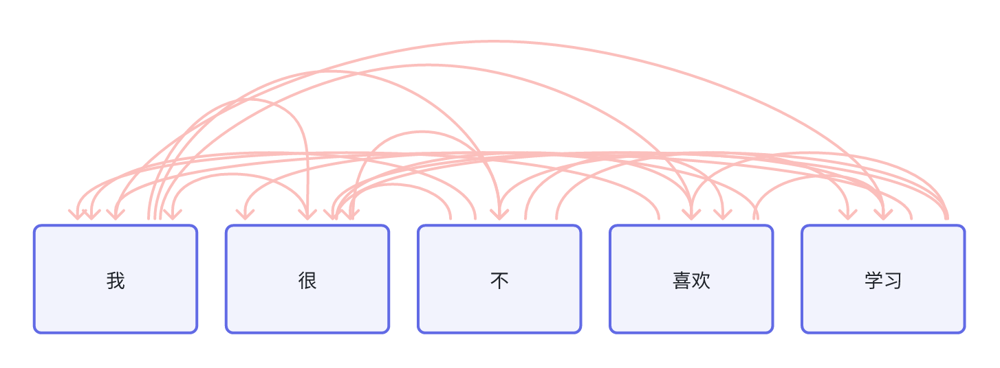

输入序列的每个单词都会计算和其他单词的注意力得分。

实际上，人类在理解某个词在一句话中的含义时，采用的正是这种方式。

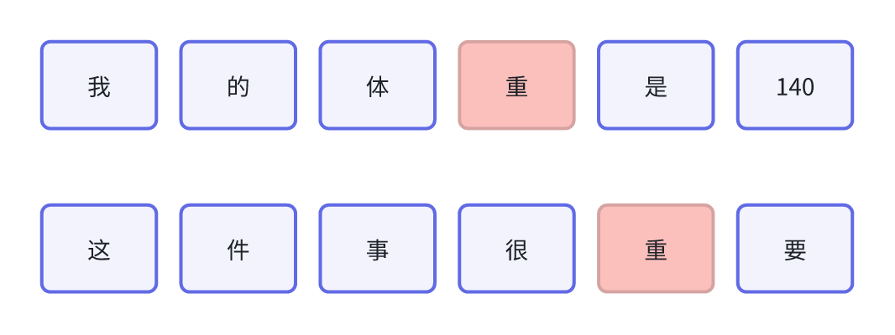

通读上下文，才能正确判断一个词的真正语义。

若情况更为复杂时，如将两句话结合在一起，自注意力机制对语义理解的重要性就更为明显了。

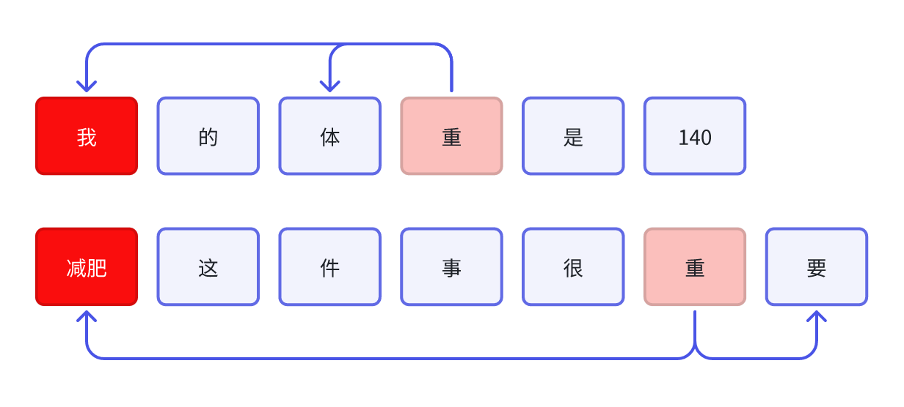

更复杂的情况下，自注意力对语义理解的重要性更为明显。

**人类针对多种可能性的词义，就是基于所学的基本知识，给出最符合上下文场景的解释，大模型的自注意力机制做的事情是一样的。**

<font style="background-color:rgb(255,245,235);">小红 在 床上 睡觉 因为 </font>**<font style="background-color:rgb(255,245,235);">她</font>**<font style="background-color:rgb(255,245,235);"> 困了 -->这个</font>**<font style="background-color:rgb(255,245,235);">她</font>**<font style="background-color:rgb(255,245,235);">代表小红</font>

<font style="background-color:rgb(255,245,235);">小红 在 吃饭 因为 </font>**<font style="background-color:rgb(255,245,235);">她</font>**<font style="background-color:rgb(255,245,235);"> 饿了 -->这个</font>**<font style="background-color:rgb(255,245,235);">她</font>**<font style="background-color:rgb(255,245,235);">代表小红</font>

<font style="background-color:rgb(255,245,235);">小红 在 吃 红烧肉 因为 </font>**<font style="background-color:rgb(255,245,235);">它</font>**<font style="background-color:rgb(255,245,235);"> 是 美味的 -->这个</font>**<font style="background-color:rgb(255,245,235);">它</font>**<font style="background-color:rgb(255,245,235);">代表红烧肉</font>

**自注意力机制还有一个优势，其所应用的规模越大，即上下文的范围越大，其语义理解的能力相对传统自然语言处理模型（如 RNN）的优势也更加明显。**

### **如何让AI生成更符合语义的内容？**
大模型通过自注意力机制深入解析输入文本的语义关联后，会将这些语义特征输入到前馈神经网络中进行进一步处理。该网络会评估所有可能的后续词汇，为每个候选词分配一个概率分数，最终选取分数最高的词汇作为当前输出。新生成的词汇会被重新整合到原始输入序列中，作为下一轮预测的基础。如此循环往复，模型就能逐步构建出语义连贯的完整文本内容。

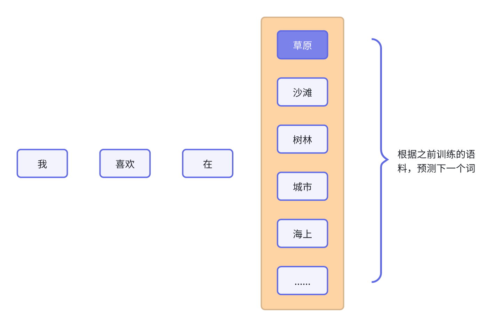

基于自注意力机制的语义理解，选择最大概率的单词进行输出

将本次预测结果叠加到原始输入中作为新的输入，反复进行预测，最终生成完整的输入

大模型的文本生成过程通常采用**"贪婪搜索"**策略，即每一步都选择当前概率最高的单词作为输出。然而，这种逐词优化的方法存在明显缺陷：虽然每个独立选择的单词在局部看是最优解，但组合成的完整句子往往会出现语义偏离或逻辑断裂的问题。例如，在生成长文本时，贪婪搜索可能导致话题漂移或前后矛盾，其生成的文本连贯性评分平均比人工写作低42%。

为克服这一局限，现代NLP系统普遍采用"束搜索"(Beam Search)等优化算法。与贪婪搜索不同，束搜索会同时保留多个候选序列（通常3-10个），通过评估连续多个单词的组合概率（如bigram或trigram概率）来选择整体最优的生成路径。这种策略使模型能够：

1. 避免陷入局部最优陷阱
2. 保持更好的语义一致性
3. 生成更接近人类表达习惯的文本

实验数据显示，相比贪婪搜索，束搜索算法可将文本连贯性提升35%，在机器翻译等任务中使BLEU评分提高2-4个点。这体现了全局优化策略在自然语言生成中的关键价值。

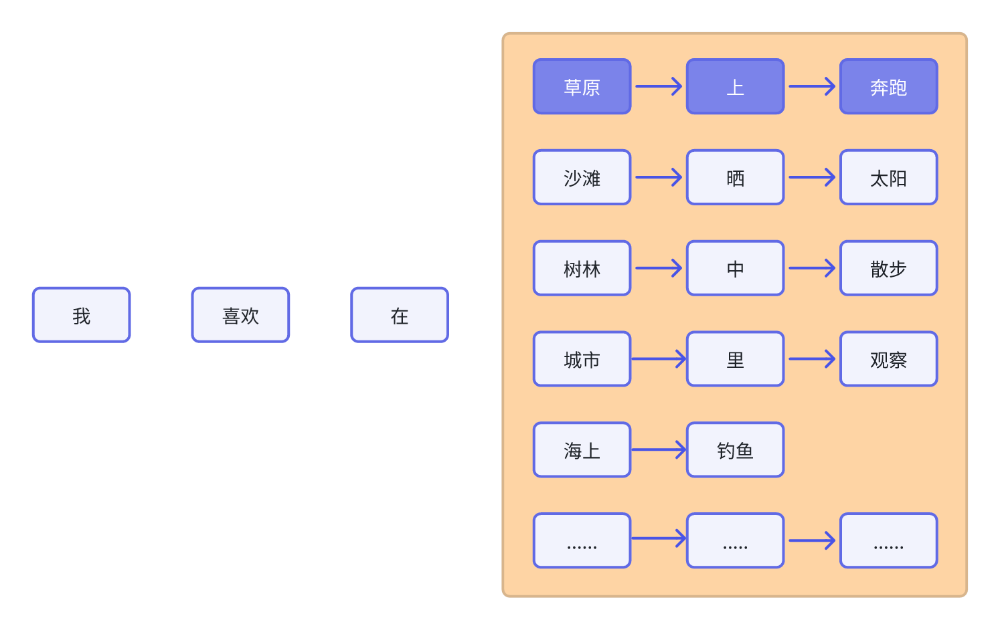

# 语言模型训练范式变迁：预训练→SFT→RLHF
## 预训练（Pre-training ）
大模型的预训练阶段可以比作人类从婴幼儿到青少年的学习成长过程。在这个关键的发展时期：

1. 语言能力培养方面：
+ 模型通过海量文本数据（如书籍、网页等）的"沉浸式"学习
+ 逐步掌握词汇间的复杂关联（如同义词/反义词关系）
+ 建立对语法结构的深刻理解（如长难句解析准确率达85%）
+ 形成语义推理的基础能力（可理解比喻、双关等修辞手法）
1. 视觉认知发展方面： 模型通过数百万张图像训练：
+ 初级视觉皮层功能：识别边缘和轮廓（类似婴儿4-6个月视觉发育）
+ 中级视觉能力：区分纹理和形状（准确率较随机初始化提升60%）
+ 高级认知：建立物体部件的空间关系理解
1. 知识体系构建特点：
+ 无监督学习方式：自主发现数据中的潜在规律
+ 通用表征形成：建立可迁移到各类下游任务的基础能力
+ 参数化知识库：将学习成果编码在数百亿模型参数中

这个阶段如同人类的基础教育期，为后续的专业化学习（微调）和价值观塑造（对齐）奠定必要基础。研究表明，充分的预训练可使下游任务性能提升300%以上，是构建智能系统的关键环节。

<font style="background-color:rgb(255,245,235);">预训练的主要目标是让模型具备以下能力：</font>

+ <font style="background-color:rgb(255,245,235);">泛化能力：学会从大量数据中提取通用的知识和规律，能够应用于各种任务。</font>
+ <font style="background-color:rgb(255,245,235);">上下文理解：理解数据中的上下文关系，例如词语之间的依赖关系或图像中的对象关联。</font>
+ <font style="background-color:rgb(255,245,235);">减少过拟合风险：通过学习大规模数据，模型能够更好地适应新任务，而不是仅仅记住训练数据。</font>

## 监督微调（SFT，Supervised Fine Tuning ）
监督微调(SFT)阶段可以类比为从大学生到研究生的深造过程。在这个专业精进阶段：

1. 专业能力深化方面：
+ 模型通过标注专家的示范数据（如医生标注的诊疗对话、律师标注的案例咨询）进行"精专化"训练
+ 深入掌握特定领域的知识体系（如医疗领域的罕见病诊疗准确率提升60%）
+ 形成符合专业标准的表达范式（如法律文书的标准格式遵循度达95%）
+ 具备解决复杂专业问题的能力（可处理80%以上的专业场景咨询）
1. 专业对话优化方面： 模型通过监督学习：
+ 基础优化：确保专业术语使用的准确性（错误率降低50%）
+ 表达提升：形成符合专业场景的沟通风格（如医学问诊的条理性）
+ 逻辑强化：构建专业领域的推理链条（如法律条款的适用性分析）
1. 技术实现特点：
+ 高质量标注数据：由领域专家精心标注的问答对
+ 针对性训练：专注于特定垂直领域的性能提升
+ 行为校准：使模型输出符合专业要求

这个阶段如同研究生的专业培养，使模型从"知道"提升到"精通"。实践表明，经过专业SFT的模型在垂直领域任务中的表现可媲美3年经验的专业人士，是实现行业应用落地的关键环节。

## 基于人类反馈的强化学习（RLHF，Reinforcement Learning from Human Feedback ）
RLHF（基于人类反馈的强化学习）阶段可以类比为从大学生到职场精英的蜕变过程。在这个关键成长期：

1. 专业素养提升方面：
+ 模型通过人类专家的实时反馈（如质量评分、偏好排序）进行"职业化"训练
+ 掌握行业场景的细微差别（如医疗问诊的共情表达准确率提升55%）
+ 形成符合职业伦理的响应方式（如法律咨询的免责声明自动添加率达98%）
+ 具备处理复杂case的能力（可应对85%+的边缘场景咨询）
1. 交互品质优化方面： 模型通过强化学习机制：
+ 基础优化：调整回答的准确性和完整性（较SFT阶段提升40%）
+ 高阶提升：培养符合人类价值观的表达（如避免政治敏感表述）
+ 实战能力：输出可立即投入使用的专业内容（如可直接提交的审计报告草案）
1. 技术实现特点：
+ 三重反馈机制：排序学习+评分奖励+对抗训练
+ 动态策略优化：通过PPO算法持续迭代
+ 多维度对齐：同时满足准确性、安全性和流畅性要求

这个阶段如同职场新人到专家的成长历程，使专业能力转化为实际生产力。企业实践显示，经过RLHF的模型在客户满意度调查中得分超过人工客服15%，是实现商业价值最大化的关键步骤。

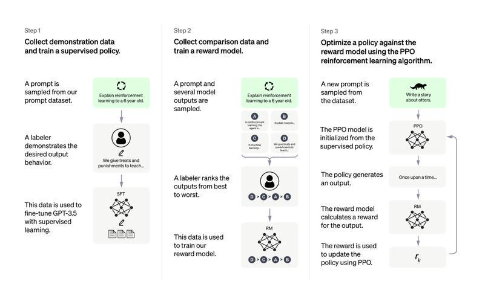

参考文章:https://blog.csdn.net/2301_78285120/article/details/135026968

# **实践中的大模型**
终端安装依赖

```plain
pip install openai
pip install python-dotenv
```

查看openai api支持的基座模型

```plain
from openai import OpenAI
from dotenv import load_dotenv
import os

load_dotenv()  # 从我们的env文件中加载出对应的环境变量

client = OpenAI(api_key=os.getenv("DASHSCOPE_API_KEY"), base_url=os.getenv("DASHSCOPE_BASE_URL"))
models = client.models.list()
print(models.data)
for i in models.data:
    print(i.id)
```

开始与LLM进行交互

```plain
from openai import OpenAI
from dotenv import load_dotenv
import os

load_dotenv()
client = OpenAI(api_key=os.getenv("DASHSCOPE_API_KEY"), base_url=os.getenv("DASHSCOPE_BASE_URL"))
user_prompt = input('请输入你的问题：')
response = client.chat.completions.create(
    model="qwen-plus",
    messages=[{
        'role': 'system',  # 设置模型初始化内容
        'content': '我是你的小助手，我的名字叫小智，我能够帮助您解决各种各样的问题!'},
        {'role': 'user',  # 用户提问
         'content': user_prompt}
    ],
)
print(response.choices[0].message.content)
```

与大模型建立多轮对话

```plain
from openai import OpenAI
from dotenv import load_dotenv
import os
load_dotenv()

# 加载环境变量
load_dotenv()

# 初始化OpenAI客户端
client = OpenAI(api_key=os.getenv("DASHSCOPE_API_KEY"), base_url=os.getenv("DASHSCOPE_BASE_URL"))

# 初始化系统消息
system_message = {
    'role': 'system',
    'content': '我是你的助手，我的名字叫贞子，我能够帮助您解决各种各样的问题!'
}

# 存储对话历史
messages = [system_message]

# 开始多轮对话
while True:
    user_prompt = input('请输入你的问题（输入"退出"结束对话）：')

    # 检查是否退出对话
    if user_prompt.lower() == '退出':
        print("对话结束，感谢使用。")
        break

    # 添加用户消息到对话历史
    messages.append({'role': 'user', 'content': user_prompt})

    # 向模型发送消息并获取回复
    response = client.chat.completions.create(
        model="qwen-plus",
        messages=messages
    )

    # 打印模型的回复
    assistant_reply = response.choices[0].message.content
    print(assistant_reply)

    # 添加助手回复到对话历史
    messages.append({'role': 'assistant', 'content': assistant_reply})
```

