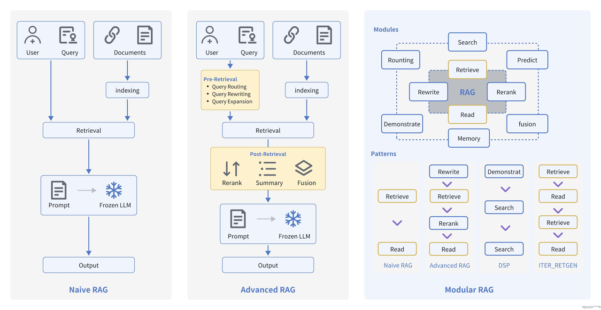
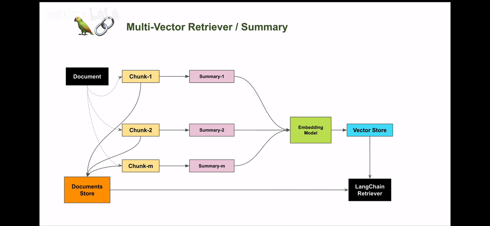
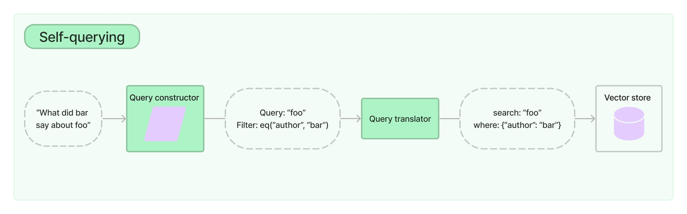
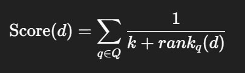

# Advanced RAG概述
Advanced RAG重点聚焦在检索增强，即优化Retrieval阶段。增加了Pre-Retrieval预检索和Post-Retrieval后检索阶段。



**预检索过程**

高级 RAG 主要通过优化索引结构和查询方式来提升检索效果。其中，**索引优化**侧重于提升内容质量，常见策略包括：细化数据颗粒度、改进索引结构、添加元数据、进行语义对齐优化，以及引入混合检索等手段。**查询优化**则致力于使用户问题更适配检索任务，常用方法包括：查询重写、格式转换和语义扩展等技术。

1. **查询重写** 就是把用户的问题用更清楚、更准确的话重新说一遍，方便系统理解和找到答案。 比如把“它是什么？”改成“什么是RAG预检索过程？”
2. **格式转换** 把用户的问题从普通话变成系统更容易处理的格式，比如变成关键词列表或结构化语句。 比如把“找2022年RAG论文”变成“关键词：RAG，年份：2022”。
3. **语义扩展** 在用户的问题里加上相关的同义词或者相关词，帮助找到更多相关的答案。 比如“RAG模型”还会自动加上“检索增强生成”、“文档检索”等相关词。

**后检索过程**

后检索阶段主要聚焦于如何更有效地整合检索到的上下文信息与查询问题，核心操作包括**重新排序**和**压缩上下文**。

+ **重新排序**：对检索结果进行相关性排序，并突出最重要的信息，这一方法已在 LlamaIndex2、LangChain 等框架中得到应用。
+ **压缩上下文**：直接将所有文档输入大型语言模型可能导致信息过载，因此通过筛选必要内容、突出关键部分，并限制上下文长度来减轻模型负担，提升处理效率和效果。

### 重排（重新排序）
就是把检索出来的一堆相关内容，根据和问题的相关程度，从最重要、最贴切的排到最不相关的。

 这样模型先看最关键的信息，效果更好。

### 上下文压缩
因为把所有找到的内容全给模型看，信息太多，模型会“看不过来”。

 上下文压缩就是挑出最关键、最有用的部分，把多余的删掉或浓缩，控制信息量，帮助模型更高效地理解和回答。

## Pre-Retrieval预检索
### 索引优化
#### 摘要索引
#### 痛点分析
在处理海量文档时，如何快速且准确地定位所需信息是一大挑战。对于包含文本、表格等多种内容类型的半结构化数据，传统 RAG 往往难以有效处理：

+ **文本拆分问题**：常规文本切分可能会破坏表格结构，导致检索时的数据丢失或失真。
+ **表格嵌入问题**：将表格直接嵌入向量空间可能降低语义相似度搜索的效果，影响检索准确性。

摘要索引可以在一定程度上缓解这些问题，但仍需对数据结构和检索方式进行优化。



## **流程分析**
1. 文档拆分
    1. 原始 **Document** 会被切分成多个 **Chunk**（Chunk-1、Chunk-2、...、Chunk-m）。
    2. 这些 Chunk 可以是段落、表格片段、代码块等，目的是方便后续的索引和检索。
    3. 切分后的 Chunk 同时会保存到 **Documents Store**（文档存储库）中，用于后续直接读取原文内容。
2. 生成摘要（Summary）
    1. 每个 Chunk 会生成一个对应的 **Summary**（Summary-1、Summary-2、...、Summary-m）。
    2. 这些摘要是对 Chunk 内容的高度概括，便于后续用更简短的文本来做嵌入向量计算，减少向量维度和存储量，也提升检索速度。
    3. 这种方法对处理表格、长段落等结构化或半结构化数据特别有用，因为摘要能保留核心信息而避免结构破坏。
3. 向量化（Embedding Model）
    1. 所有摘要会输入到 **Embedding Model**（嵌入模型）中，转换为向量表示。
    2. 这种向量化是语义检索的关键步骤，允许系统根据意义相似度来匹配内容，而不仅仅依赖关键词。
4. 存储与检索
    1. 生成的向量存储到 **Vector Store**（向量数据库）中。
    2. 检索阶段由 **LangChain Retriever** 完成：

    1. 接收用户查询。

    2.将查询转换为向量，在 Vector Store 中查找相似度最高的摘要向量。

    3.根据匹配的摘要，回溯到 Documents Store 中找到对应的完整原文 Chunk。

    4.返回完整上下文给大语言模型进行生成。

```plain
import os
import uuid
from dotenv import load_dotenv

from langchain.storage import InMemoryStore
from langchain_chroma import Chroma
from langchain_community.document_loaders import UnstructuredWordDocumentLoader, WebBaseLoader
from langchain_text_splitters import RecursiveCharacterTextSplitter
from langchain_openai import ChatOpenAI
from langchain.retrievers import MultiVectorRetriever
from langchain_core.documents import Document
from langchain_core.output_parsers import StrOutputParser
from langchain_core.prompts import ChatPromptTemplate
from langchain_huggingface import HuggingFaceEmbeddings

# 加载环境变量
load_dotenv()


class SimpleMultiVectorRAG:
    """摘要索引RAG系统"""

    def __init__(self, embedding_model_path: str):
        # 初始化模型
        self.llm = ChatOpenAI(
            model="deepseek-chat",
            api_key=os.getenv("DEEPSEEK_API_KEY"),
            base_url=os.getenv("DEEPSEEK_BASE_URL"),
        )

        self.embeddings = HuggingFaceEmbeddings(model_name=embedding_model_path)

        # 初始化存储
        self.vectorstore = Chroma(
            collection_name="summaries",
            embedding_function=self.embeddings
        )
        # 创建内存存储来存储文档
        self.docstore = InMemoryStore()

        # 初始化检索器
        self.retriever = MultiVectorRetriever(
            vectorstore=self.vectorstore,
            docstore=self.docstore,
            id_key="doc_id",
        )

        # 文本分割器
        self.text_splitter = RecursiveCharacterTextSplitter(
            chunk_size=1024,
            chunk_overlap=100
        )

    def load_documents(self, word_path: str = None, web_url: str = None):
        """加载文档"""
        docs = []

        # 加载Word文档
        if word_path and os.path.exists(word_path):
            try:
                loader = UnstructuredWordDocumentLoader(word_path)
                docs.extend(loader.load())
                print(f"加载Word文档成功: {word_path}")
            except Exception as e:
                print(f"加载Word文档失败: {e}")

        # 加载网页
        if web_url:
            try:
                loader = WebBaseLoader(web_url)
                docs.extend(loader.load())
                print(f"加载网页成功: {web_url}")
            except Exception as e:
                print(f"加载网页失败: {e}")

        if not docs:
            raise ValueError("没有成功加载任何文档")

        # 分割文档
        self.docs = self.text_splitter.split_documents(docs)
        print(f"文档分割完成，共 {len(self.docs)} 个块")

        return self

    def build_summaries(self):
        """生成摘要并构建检索系统"""
        print("正在生成文档摘要...")

        # 创建摘要生成链
        summary_chain = (
                {"doc": lambda x: x.page_content}
                | ChatPromptTemplate.from_template("简洁总结以下文档内容:\n\n{doc}")
                | self.llm
                | StrOutputParser()
        )

        # 批量生成摘要
        summaries = summary_chain.batch(self.docs, {"max_concurrency": 10})
        print(f"摘要生成完成，共 {len(summaries)} 个")

        # 生成文档ID
        doc_ids = [str(uuid.uuid4()) for _ in self.docs]

        # 创建摘要文档
        summary_docs = [
            Document(page_content=summary, metadata={"doc_id": doc_ids[i]})
            for i, summary in enumerate(summaries)
        ]

        # 添加到向量存储
        self.retriever.vectorstore.add_documents(summary_docs)

        # 存储原始文档
        self.retriever.docstore.mset(list(zip(doc_ids, self.docs)))

        print("检索系统构建完成")
        return self

    def search(self, query: str, k: int = 3):
        """搜索相关文档"""
        # 搜索摘要
        summary_results = self.vectorstore.similarity_search(query, k=k)
        print(f"找到 {len(summary_results)} 个相关摘要")

        # 获取原始文档
        doc_ids = [doc.metadata["doc_id"] for doc in summary_results]
        original_docs = self.retriever.docstore.mget(doc_ids)

        return {
            "summaries": summary_results,
            "original_docs": [doc for doc in original_docs if doc]
        }

    def answer(self, question: str):
        """回答问题"""
        print(f"问题: {question}")

        # 获取相关文档
        relevant_docs = self.retriever.invoke(question)

        if not relevant_docs:
            return "抱歉，没有找到相关信息。"

        # 格式化文档内容
        context = "\n\n".join([
            f"文档{i + 1}:\n{doc.page_content}"
            for i, doc in enumerate(relevant_docs[:3])
        ])

        # 生成答案
        qa_prompt = ChatPromptTemplate.from_template(
            "根据以下文档内容回答问题:\n\n{context}\n\n问题: {question}\n\n答案:"
        )

        qa_chain = qa_prompt | self.llm | StrOutputParser()
        answer = qa_chain.invoke({
            "context": context,
            "question": question
        })

        return answer


def main():
    """主函数"""
    # 配置
    EMBEDDING_MODEL_PATH = r'D:\\llm\\Local_model\\BAAI\\bge-large-zh-v1___5'
    WORD_FILE = "中华人民共和国刑法.docx"
    WEB_URL = "https://news.pku.edu.cn/mtbdnew/15ac0b3e79244efa88b03a570cbcbcaa.htm"

    try:
        # 初始化摘要索引RAG系统
        rag = SimpleMultiVectorRAG(EMBEDDING_MODEL_PATH)

        # 构建知识库
        rag.load_documents(word_path=WORD_FILE, web_url=WEB_URL).build_summaries()

        # 测试查询
        query = "抢劫10万元，会受到什么处罚？"

        # 搜索测试
        search_results = rag.search(query)
        print(f"\n匹配的摘要:\n{search_results['summaries'][0].page_content}")

        # 问答测试
        answer = rag.answer(query)
        print(f"\n答案:\n{answer}")

    except Exception as e:
        print(f"程序执行失败: {e}")


if __name__ == "__main__":
    main()
```

#### 父子索引（Parent-Child Index）
#### 背景痛点
在 RAG（检索增强生成）中，常见做法是把文档切成小块（chunk）进行向量化，以提升检索精度。但这种方式在实际业务中会遇到几个痛点：

1. **上下文丢失**
    1. 小块虽然能提高匹配精度，但模型回答时缺少原文的完整上下文，容易答非所问。
    2. 例：用户问“LangGraph 如何在对话中切换流程？”，检索到的块只解释了“条件跳转”，却没有包含“上下文保持”部分。
2. **长文片段成本高**
    1. 如果直接向量化长片段，虽然上下文完整，但会降低向量检索精度，而且 Embedding 成本高。
3. **检索粒度不均衡**
    1. 用户的问题可能只涉及文档中的一句话，但为了上下文，不得不把整大段送进 LLM，造成无效 token 消耗。

父子索引通过“分级切片”+“双层索引”解决上述问题：

1. **父节点（Parent）**
    1. 代表较大的文档片段（如 500-1000 token），保留完整语义上下文。
    2. 不直接向量化，而是作为检索结果的上下文载体。
2. **子节点（Child）**
    1. 将父节点再细分为更小的子片段（如 100-200 token），对这些子片段进行向量化。
    2. 用于精准匹配用户查询，提高检索相关性。
3. **检索流程**
    1. 检索阶段：用用户问题向量去匹配**子节点向量**，得到最相关的子片段。
    2. 反向映射：根据子节点找到其所属的父节点。
    3. 上下文提供：将父节点的完整内容送给 LLM，让它回答时具备更完整的语境。

```python
from langchain_community.document_loaders import WebBaseLoader
from langchain_text_splitters import RecursiveCharacterTextSplitter
from langchain_chroma import Chroma
from langchain.retrievers import ParentDocumentRetriever
from langchain_core.stores import InMemoryStore
from langchain_openai.chat_models import ChatOpenAI
from langchain_core.prompts import ChatPromptTemplate
from langchain_core.runnables import RunnableMap, RunnablePassthrough
from langchain_core.output_parsers import StrOutputParser
from langchain_huggingface import HuggingFaceEmbeddings
from dotenv import load_dotenv
import os


class ParentChildRAG:
    def __init__(self, model, api_key, base_url, embedding_model_path):
        """
        初始化 RAG 系统
        """
        self.model_name = model
        self.api_key = api_key
        self.base_url = base_url
        self.embedding_model_path = embedding_model_path

        # 分割器
        self.parent_splitter = RecursiveCharacterTextSplitter(chunk_size=1000)
        self.child_splitter = RecursiveCharacterTextSplitter(chunk_size=400)

        # Embedding 模型
        self.embeddings_model = HuggingFaceEmbeddings(
            model_name=self.embedding_model_path
        )
        # 向量存储 & 父子索引
        self.vectorstore = Chroma(
            collection_name="split_parents", embedding_function=self.embeddings_model
        )
        # 创建内存存储对象
        self.store = InMemoryStore()
        # 创建父子文档检索器
        self.retriever = ParentDocumentRetriever(
            vectorstore=self.vectorstore,  # chroma向量数据库
            docstore=self.store,  # 存储父文档的容器
            child_splitter=self.child_splitter,  # 子文档切割器
            parent_splitter=self.parent_splitter,  # 父文档切割器
            search_kwargs={"k": 1} # 检索子文档的数量
        )

        # LLM
        self.llm = ChatOpenAI(
            model=self.model_name,
            api_key=self.api_key,
            base_url=self.base_url
        )

    def load_web_document(self, url):
        """加载网页文档"""
        loader = WebBaseLoader(url)
        docs = loader.load()
        print(f"文章的长度：{len(docs[0].page_content)}")
        return docs

    def add_documents(self, docs):
        """添加文档到父子索引"""
        self.retriever.add_documents(docs)

    def show_child_documents(self):
        """打印子文档"""
        results = self.vectorstore.get()
        for i, (doc, meta) in enumerate(zip(results["documents"], results["metadatas"])):
            parent_id = meta.get("doc_id", "没有父文档")
            print(f"子文档 {i + 1} 对应父文档 ID: {parent_id}")
            print(f"子文档内容: {doc[:100]}...\n")

    def show_parent_documents(self):
        """打印父文档"""
        for key in self.store.yield_keys():
            parent_doc = self.store.mget([key])[0]
            print(f"父文档 ID: {key}")
            print(parent_doc.page_content[:100])  # 打印前100字符

    def similarity_search(self, query):
        """子文档向量检索"""
        print("------------相似性搜寻------------------------")
        sub_docs = self.vectorstore.similarity_search(query)
        if sub_docs:
            print(sub_docs)
            print(sub_docs[0].page_content)
        return sub_docs

    def retrieve_parents(self, query):
        """父文档检索"""
        print("------------获取相关文档-----------------------")
        retrieved_docs = self.retriever.invoke(query)
        if retrieved_docs:
            print(retrieved_docs[0].page_content)
        return retrieved_docs

    def rag_answer(self, query):
        """RAG 生成答案"""
        template = """请根据下面给出的上下文来回答问题:
        {context}
        问题: {question}
        """
        prompt = ChatPromptTemplate.from_template(template)

        chain = RunnableMap({
            "context": self.retriever,
            "question": RunnablePassthrough()
        }) | prompt | self.llm | StrOutputParser()

        print("------------模型回复------------------------")
        response = chain.invoke(query)
        print(response)
        return response

def main():
    load_dotenv()

    # 配置
    model = "deepseek-chat"
    api_key = os.getenv("DEEPSEEK_API_KEY")
    base_url = os.getenv("DEEPSEEK_BASE_URL")
    embedding_model_path = 'D:\\llm\\Local_model\\BAAI\\bge-large-zh-v1___5'
    url = "https://news.pku.edu.cn/mtbdnew/15ac0b3e79244efa88b03a570cbcbcaa.htm"

    # 初始化
    rag_system = ParentChildRAG(model, api_key, base_url, embedding_model_path)

    # 加载网页并添加到索引
    docs = rag_system.load_web_document(url)
    rag_system.add_documents(docs)

    # 查看子/父文档
    rag_system.show_child_documents()
    rag_system.show_parent_documents()

    # 检索测试
    rag_system.similarity_search("天才AI少女是谁？")
    rag_system.retrieve_parents("天才AI少女是谁？")

    # RAG 回答
    rag_system.rag_answer("天才AI少女是谁？")


if __name__ == "__main__":
    main()
```

#### 假设性问题索引（Hypothetical Question Indexing）
**概念**： 假设性问题索引是一种增强知识库检索的方法。它通过为每个文档块生成与内容强相关的“假设性问题”，将问题向量化存储，从而实现更高精度的语义检索。

**基本思路**：

1. **生成假设性问题**
    1. 对知识库中的每个文档块（chunk），使用 LLM 生成若干（如 3 个）假设性问题。
    2. 这些问题基于文档块的内容和潜在应用场景设计，与块内容高度相关。
2. **向量化存储问题**
    1. 将生成的假设性问题进行向量化嵌入（embedding），形成“问题向量索引”。
    2. 这些问题向量与原文块关联存储，而不是直接存文档向量。
3. **查询时检索**
    1. 用户提出问题时，将问题向量化后与假设性问题向量索引进行匹配检索。
    2. 返回最相关的假设性问题对应的原始文档块。
4. **LLM 回答**
    1. 将检索到的文档块作为上下文，结合用户问题，发送给 LLM 生成最终答案。

**优势**：

+ 提升长文档或复杂文档的检索精度
+ 通过“问题驱动”方式，让 LLM 更快聚焦关键内容
+ 可与 RAG 框架结合，实现更高质量的问答系统

**可扩展**：

+ 每个文档块生成的问题数量、生成策略和向量检索算法可以根据实际需求调整
+ 可以与多模态文档结合，为图像、表格或音视频生成假设性问题

```python
from typing import List, Optional, Dict, Any
from langchain.storage import InMemoryByteStore
from langchain_chroma import Chroma
from langchain_community.document_loaders import TextLoader
from langchain_text_splitters import RecursiveCharacterTextSplitter
from langchain_openai.chat_models import ChatOpenAI
from langchain.retrievers import MultiVectorRetriever
from langchain_core.documents import Document
from langchain_core.output_parsers import StrOutputParser, JsonOutputParser
from langchain_core.prompts import ChatPromptTemplate
from langchain_core.runnables import RunnableMap
from langchain_huggingface import HuggingFaceEmbeddings
from pydantic import BaseModel, Field
import uuid
import os
from dotenv import load_dotenv


class HypotheticalQuestions(BaseModel):
    """生成假设性问题的数据模型"""
    questions: List[str] = Field(..., description="List of questions")


class RAGConfig:
    """RAG系统配置类"""

    def __init__(self,
                 model: str = "qwen-max-2025-01-25",
                 chunk_size: int = 1024,
                 chunk_overlap: int = 100,
                 max_concurrency: int = 5,
                 collection_name: str = "hypo-questions"):
        load_dotenv()

        self.model = model  # 模型名称
        self.api_key = os.getenv("DASHSCOPE_API_KEY")
        self.base_url = os.getenv("DASHSCOPE_BASE_URL")
        self.embedding_model_path = 'D:\\llm\\Local_model\\BAAI\\bge-large-zh-v1___5'
        self.chunk_size = chunk_size  # 切割长度
        self.chunk_overlap = chunk_overlap  # 重复长度
        self.max_concurrency = max_concurrency
        self.collection_name = collection_name
        self.id_key = "doc_id"


class DocumentProcessor:
    """文档处理类"""

    def __init__(self, config: RAGConfig):
        self.config = config
        self.text_splitter = RecursiveCharacterTextSplitter(
            chunk_size=config.chunk_size,
            chunk_overlap=config.chunk_overlap
        )

    def load_documents(self, file_path: str, encoding: str = "utf-8") -> List[Document]:
        """加载并分割文档"""
        loader = TextLoader(file_path, encoding=encoding)
        docs = loader.load()
        return self.text_splitter.split_documents(docs)

    def generate_doc_ids(self, docs: List[Document]) -> List[str]:
        """为文档生成唯一ID"""
        return [str(uuid.uuid4()) for _ in docs]


class QuestionGenerator:
    """假设性问题生成器"""

    def __init__(self, config: RAGConfig):
        self.config = config
        self.llm = ChatOpenAI(
            model=config.model,
            api_key=config.api_key,
            base_url=config.base_url
        )
        self.prompt = ChatPromptTemplate.from_template(
            """请基于以下文档生成3个假设性问题（必须使用JSON格式）:
            {doc}

            要求：
            1. 输出必须为合法JSON格式，包含questions字段
            2. questions字段的值是包含3个问题的数组
            3. 使用中文提问
            示例格式：
            {{
                "questions": ["问题1", "问题2", "问题3"]
            }}"""
        )

        # 创建问题生成链
        self.chain = (
                {"doc": lambda x: x.page_content}
                | self.prompt
                | self.llm.with_structured_output(HypotheticalQuestions)
                | (lambda x: x.questions)
        )

    def generate_questions(self, docs: List[Document]) -> List[List[str]]:
        """批量生成假设性问题"""
        return self.chain.batch(docs, {"max_concurrency": self.config.max_concurrency})

    def create_question_documents(self,
                                  questions_list: List[List[str]],
                                  doc_ids: List[str]) -> List[Document]:
        """将问题转换为文档对象"""
        question_docs = []
        for i, question_list in enumerate(questions_list):
            question_docs.extend([
                Document(
                    page_content=question,
                    metadata={self.config.id_key: doc_ids[i]}
                ) for question in question_list
            ])
        return question_docs


class VectorStoreManager:
    """向量存储管理器"""

    def __init__(self, config: RAGConfig):
        self.config = config
        self.embeddings_model = HuggingFaceEmbeddings(
            model_name=config.embedding_model_path
        )
        self.vectorstore = Chroma(
            collection_name=config.collection_name,
            embedding_function=self.embeddings_model
        )
        self.store = InMemoryByteStore()

        # 配置多向量检索器
        self.retriever = MultiVectorRetriever(
            vectorstore=self.vectorstore,
            docstore=self.store,
            id_key=config.id_key,
        )

    def add_documents(self,
                      question_docs: List[Document],
                      original_docs: List[Document],
                      doc_ids: List[str]):
        """添加文档到向量存储和字节存储"""
        # 将问题文档存入向量数据库
        self.retriever.vectorstore.add_documents(question_docs)
        # 将原始文档存入字节存储
        self.retriever.docstore.mset(list(zip(doc_ids, original_docs)))

    def similarity_search(self, query: str, k: int = 4) -> List[Document]:
        """执行相似性搜索"""
        return self.retriever.vectorstore.similarity_search(query, k=k)

    def retrieve(self, query: str) -> List[Document]:
        """检索相关文档"""
        return self.retriever.invoke(query)


class QuestionAnswerer:
    """问答器"""

    def __init__(self, config: RAGConfig, retriever: MultiVectorRetriever):
        self.config = config
        self.retriever = retriever
        self.llm = ChatOpenAI(
            model=config.model,
            api_key=config.api_key,
            base_url=config.base_url
        )

        self.prompt = ChatPromptTemplate.from_template(
            "根据下面的文档回答问题:\n\n{doc}\n\n问题: {question}"
        )

        # 创建问答链
        self.chain = RunnableMap({
            "doc": lambda x: self.retriever.invoke(x["question"]),
            "question": lambda x: x["question"]
        }) | self.prompt | self.llm | StrOutputParser()

    def answer_question(self, question: str) -> str:
        """回答问题"""
        return self.chain.invoke({"question": question})


class RAGSystem:
    """RAG系统主类"""

    def __init__(self, config: Optional[RAGConfig] = None):
        self.config = config if config else RAGConfig()
        self.doc_processor = DocumentProcessor(self.config)
        self.question_generator = QuestionGenerator(self.config)
        self.vector_manager = VectorStoreManager(self.config)
        self.answerer = None  # 将在初始化后设置
        self._is_initialized = False

    def initialize_from_file(self, file_path: str, encoding: str = "utf-8"):
        """从文件初始化系统"""
        # 1. 加载和处理文档
        print("正在加载和处理文档...")
        docs = self.doc_processor.load_documents(file_path, encoding)
        doc_ids = self.doc_processor.generate_doc_ids(docs)

        # 2. 生成假设性问题
        print("正在生成假设性问题...")
        hypothetical_questions = self.question_generator.generate_questions(docs)

        # 测试第一个文档的问题生成
        print("第一个文档生成的问题:", hypothetical_questions[0])

        # 3. 创建问题文档
        question_docs = self.question_generator.create_question_documents(
            hypothetical_questions, doc_ids
        )

        # 4. 添加到向量存储
        print("正在构建向量存储...")
        self.vector_manager.add_documents(question_docs, docs, doc_ids)

        # 5. 初始化问答器
        self.answerer = QuestionAnswerer(self.config, self.vector_manager.retriever)

        self._is_initialized = True
        print("RAG系统初始化完成！")

    def search(self, query: str, k: int = 4) -> List[Document]:
        """执行相似性搜索"""
        self._check_initialized()
        return self.vector_manager.similarity_search(query, k)

    def retrieve(self, query: str) -> List[Document]:
        """检索相关文档"""
        self._check_initialized()
        return self.vector_manager.retrieve(query)

    def answer(self, question: str) -> Dict[str, Any]:
        """回答问题并返回详细信息"""
        self._check_initialized()

        # 获取答案
        answer = self.answerer.answer_question(question)

        # 获取检索到的文档
        retrieved_docs = self.retrieve(question)

        # 获取相似性搜索结果
        similar_docs = self.search(question)

        return {
            "question": question,
            "answer": answer,
            "retrieved_docs": retrieved_docs,
            "similar_docs": similar_docs
        }

    def _check_initialized(self):
        """检查系统是否已初始化"""
        if not self._is_initialized:
            raise RuntimeError("RAG系统尚未初始化，请先调用 initialize_from_file() 方法")


# 使用示例
def main():
    # 1. 创建配置
    config = RAGConfig(
        model="qwen-max-2025-01-25",
        chunk_size=1024,
        chunk_overlap=100,
        max_concurrency=5
    )

    # 2. 创建RAG系统
    rag_system = RAGSystem(config)

    # 3. 从文件初始化
    rag_system.initialize_from_file("deepseek介绍.txt", encoding="utf-8")

    # 4. 测试问答
    query = "deepseek受到哪些攻击？"
    result = rag_system.answer(query)

    print("=" * 50)
    print("问题:", result["question"])
    print("=" * 50)
    print("回答:", result["answer"])
    print("=" * 50)
    print("检索到的文档数量:", len(result["retrieved_docs"]))
    print("相似文档数量:", len(result["similar_docs"]))


if __name__ == "__main__":
    main()
```

#### 元数据索引
#### 痛点分析
在法律案例数据库中仅使用语义相似性检索会导致几个关键问题。当用户搜索"商标侵权"案例时，系统可能返回大量不相关的知识产权案件，包括专利纠纷、著作权争议等其他类型案件。同时，不同层级法院的判例混合在一起，使得基层法院和高院的裁判标准难以区分。此外，新旧法律条文对应的案例混杂呈现，严重影响检索结果的时效性和准确性。



### 流程分解
1. 用户输入自然语言查询 `"What did bar say about foo"`
    1. 语义：查找作者 `bar` 对主题 `foo` 的评论/内容。
2. 查询构造器（Query Constructor）
    1. 分解为两部分：
        * 语义搜索部分：提取关键词 `"foo"`（核心查询内容）。
        * 过滤条件：自动生成元数据过滤规则 `eq("author", "bar")`（限定作者为 `bar`）。
3. 查询翻译器（Query Translator）
    1. 将构造器的输出转换为向量数据库可执行的指令：
        * `search: "foo"` → 语义相似性搜索（向量检索）。
        * `where: {"author": "bar"}` → 元数据过滤（非语义的精确匹配）。
4. 向量数据库（Vector Store）
    1. 最终执行 混合检索：
        * 先通过 `author="bar"` 过滤文档范围。
        * 再在过滤结果中搜索与 `"foo"` 语义相似的文本。

元数据是对文档的一种属性描述，假设我们使用一个存储了大量科技博客文章的向量数据库。每篇文章都关联了以下标签：

```python
topic: 人工智能, 区块链, 云计算, 大数据
  author: 作者A, 作者B, 作者C
  year: 2022, 2023, 2024
```

我们可以先通过标签（元数据）对文档进行初步过滤，再执行相似性检索。 在 **LangChain** 中，可以使用 **SelfQueryRetriever（自查询检索器）** 实现这一功能。

核心思路：

+ 用户输入自然语言查询后，检索器会通过**查询构造 LLM 链**将其转化为**结构化查询**（Structured Query）。
+ 该结构化查询包含：
    - **语义检索条件**（基于向量相似度）
    - **元数据过滤条件**（如标签、作者、时间等）
+ 检索器将结构化查询应用到底层向量存储中，先执行元数据过滤，再在筛选后的文档中做语义相似度计算，从而提升检索精准度。

数据：

```plain
from langchain_core.documents import Document
from langchain.chains.query_constructor.schema import AttributeInfo

docs = [
    Document(
        page_content="团队X开发的下一代太阳能电池板在弱光环境下效率提升40%，为偏远地区供电提供新方案",
        metadata={"year": 2025, "rating": 9.4, "genre": "Solar Energy", "author": "X"},
    ),
    Document(
        page_content="作者Y主导的深海风电项目在台风季稳定运行，实现年发电量增长18%",
        metadata={"year": 2024, "rating": 9.1, "genre": "Wind Power", "author": "Y"},
    ),
    Document(
        page_content="作者Z研发的储能系统在极端气温下保持90%效率，适配沙漠和高原地区能源调配",
        metadata={"year": 2023, "rating": 8.7, "genre": "Energy Storage", "author": "Z"},
    ),
    Document(
        page_content="团队X推出的氢能运输技术将物流运输成本降低15%，并减少了二氧化碳排放",
        metadata={"year": 2024, "rating": 8.9, "genre": "Hydrogen Energy", "author": "X"},
    ),
    Document(
        page_content="作者Y在海洋潮汐发电研究中取得突破，新型涡轮在低潮时依旧可稳定输出电力",
        metadata={"year": 2025, "rating": 7.8, "genre": "Tidal Power", "author": "Y"},
    ),
    Document(
        page_content="Z博士的智慧电网系统成功在三座城市部署，实现用电高峰期负载平衡和停电率降低70%",
        metadata={"year": 2024, "rating": 9.0, "genre": "Smart Grid", "author": "Z"},
    ),
    Document(
        page_content="团队X开发的火山地热发电项目在实验阶段已达到商业化可行标准",
        metadata={"year": 2024, "rating": 8.5, "genre": "Geothermal Energy", "author": "X"},
    ),
    Document(
        page_content="作者Y带领的跨国合作项目将人工智能用于预测全球能源需求，准确率达到92%",
        metadata={"year": 2025, "rating": 9.2, "genre": "AI in Energy", "author": "Y"},
    )
]

# 元数据字段定义
metadata_field_info = [
    AttributeInfo(
        name="genre",
        description="Energy technology domain of the article, options: ['Solar Energy', 'Wind Power', 'Energy Storage', 'Hydrogen Energy', 'Tidal Power', 'Smart Grid', 'Geothermal Energy', 'AI in Energy']",
        type="string",
    ),
    AttributeInfo(
        name="year",
        description="Publication year of the article",
        type="integer",
    ),
    AttributeInfo(
        name="author",
        description="Author's code name or identifier who signed the article",
        type="string",
    ),
    AttributeInfo(
        name="rating",
        description="Technical value assessment score (1-10 scale)",
        type="float"
    )
]
```

```plain
from langchain_chroma import Chroma
from 元数据文档 import docs, metadata_field_info
from langchain.retrievers.self_query.base import SelfQueryRetriever
from langchain_openai import ChatOpenAI
from langchain_huggingface import HuggingFaceEmbeddings
from langchain.chains.query_constructor.base import (
    StructuredQueryOutputParser,
    get_query_constructor_prompt,
)
import os
from dotenv import load_dotenv


class SelfQueryRAG:
    def __init__(
            self,
            llm_model: str,
            api_key: str,
            api_base_url: str,
            embedding_model_path: str,
            document_content_description: str,
            docs,
            metadata_field_info
    ):
        """初始化 SelfQuery RAG 系统"""
        self.document_content_description = document_content_description
        self.metadata_field_info = metadata_field_info

        # 初始化 LLM
        self.llm = ChatOpenAI(
            model=llm_model,
            api_key=api_key,
            base_url=api_base_url
        )

        # 初始化本地 embedding 模型
        self.embeddings_model = HuggingFaceEmbeddings(
            model_name=embedding_model_path
        )

        # 创建向量数据库
        self.vectorstore = Chroma.from_documents(docs, self.embeddings_model)

        # 创建自查询检索器
        self.retriever = SelfQueryRetriever.from_llm(
            self.llm,
            self.vectorstore,
            self.document_content_description,
            self.metadata_field_info
        )

        # 构建结构化查询解析器（调试用）
        prompt = get_query_constructor_prompt(
            self.document_content_description,
            self.metadata_field_info
        )
        # 打印查询构造提示
        print(prompt.format(query="我想了解评分在9分以上的文章"))

        self.query_constructor = prompt | self.llm | StructuredQueryOutputParser.from_components()

    def invoke_retriever(self, query: str):
        """使用 SelfQueryRetriever 检索"""
        return self.retriever.invoke(query)

    def invoke_structured_query(self, query: str):
        """构建结构化查询并返回解析结果"""
        return self.query_constructor.invoke({"query": query})

    def enable_limit_retriever(self):
        """启用检索器的限制模式"""
        self.retriever = SelfQueryRetriever.from_llm(
            self.llm,
            self.vectorstore,
            self.document_content_description,
            self.metadata_field_info,
            enable_limit=True
        )


# -----------------------------
# 主程序
# -----------------------------
def main():
    load_dotenv()

    # 配置参数
    llm_model = "qwen-max-2025-01-25"
    api_key = os.getenv("DASHSCOPE_API_KEY")
    api_base_url = os.getenv("DASHSCOPE_BASE_URL")
    embedding_model_path = 'D:\\llm\\Local_model\\BAAI\\bge-large-zh-v1___5'
    document_content_description = "技术文章的简要描述"

    # 初始化 RAG 系统
    rag_system = SelfQueryRAG(
        llm_model,
        api_key,
        api_base_url,
        embedding_model_path,
        document_content_description,
        docs,
        metadata_field_info
    )

    # 使用检索器
    print(rag_system.invoke_retriever("我想了解评分在9分以上的文章"))
    print(rag_system.invoke_retriever("作者X在2024年发布的文章"))

    # 调试结构化查询
    print(rag_system.invoke_structured_query("作者X在2024年发布的文章"))
    # 启用限制模式
    rag_system.enable_limit_retriever()
    print(rag_system.invoke_retriever("我想了解一篇评分在9分以上的文章"))


if __name__ == "__main__":
    main()
```

参考地址：https://python.langchain.com/docs/how_to/self_query/#creating-our-self-querying-retriever

#### 混合检索
#### 痛点分析
在用户查询时，如果输入内容不够准确或存在模糊表达（例如只输入“相关评价”），就会导致系统难以理解其真实意图。以“deepseek 的相关评价”为例，用户可能只输入“相关评价”，此时向量相似性检索由于缺乏上下文，会无法准确匹配到关于 deepseek 的文档，进而影响检索效果与用户体验。

换句话说，问题不在于系统没有相关信息，而在于用户输入的查询过于简略，缺少必要的语义锚点，导致检索召回率和相关性下降。

**解决思路：**

为解决用户查询模糊导致的召回不足问题，可以采用 **混合检索（Hybrid Search）** 策略。该方法将传统的关键词匹配算法（如 **BM25**）与 **向量相似性检索** 相结合，分别从关键词匹配和语义相似度两个维度获取候选结果，再对检索结果进行融合，从而兼顾语义理解能力与关键词精确匹配的优势。

接下来，我们将演示如何通过 **LangChain** 来实现混合检索的完整流程。

```plain
from langchain_community.document_loaders import TextLoader
from langchain_chroma import Chroma
from langchain_community.retrievers import BM25Retriever
from langchain.retrievers import EnsembleRetriever
from langchain_core.output_parsers import StrOutputParser
from langchain_openai.chat_models import ChatOpenAI
from langchain_core.prompts import ChatPromptTemplate
from langchain_core.runnables import RunnableMap
from langchain.text_splitter import RecursiveCharacterTextSplitter
from langchain_huggingface import HuggingFaceEmbeddings
import os
from dotenv import load_dotenv


class DocumentProcessor:
    """文档处理类，负责文档加载和分割"""

    def __init__(self, chunk_size: int = 512, chunk_overlap: int = 50):
        self.chunk_size = chunk_size
        self.chunk_overlap = chunk_overlap
        self.text_splitter = RecursiveCharacterTextSplitter(
            chunk_size=self.chunk_size,
            chunk_overlap=self.chunk_overlap,
        )

    def load_document(self, file_path: str, encoding: str = "utf-8"):
        """加载文档"""
        loader = TextLoader(file_path, encoding=encoding)
        return loader.load()

    def split_documents(self, docs):
        """分割文档"""
        return self.text_splitter.split_documents(docs)

    @staticmethod
    def pretty_print_docs(docs):
        """格式化输出文档内容"""
        print(
            f"\n{'-' * 100}\n".join(
                [f"Document {i + 1}:\n\n" + d.page_content for i, d in enumerate(docs)]
            )
        )


class EmbeddingManager:
    """嵌入模型管理类"""

    def __init__(self, model_path: str):
        self.model_path = model_path
        self.embeddings_model = HuggingFaceEmbeddings(
            model_name=model_path
        )

    def get_embeddings(self):
        """获取嵌入模型"""
        return self.embeddings_model


class RetrieverManager:
    """检索器管理类"""

    def __init__(self, documents, embeddings_model):
        self.documents = documents
        self.embeddings_model = embeddings_model
        self.vectorstore = None
        self.vector_retriever = None
        self.bm25_retriever = None
        self.ensemble_retriever = None

        self._setup_retrievers()

    def _setup_retrievers(self):
        """设置各种检索器"""
        # 创建向量存储
        self.vectorstore = Chroma.from_documents(
            documents=self.documents,
            embedding=self.embeddings_model
        )

        # 创建向量检索器
        self.vector_retriever = self.vectorstore.as_retriever(search_kwargs={"k": 3})

        # 创建BM25检索器
        self.bm25_retriever = BM25Retriever.from_documents(self.documents, k=3)

        # 创建混合检索器
        self.ensemble_retriever = EnsembleRetriever(
            retrievers=[self.bm25_retriever, self.vector_retriever],
            weights=[0.5, 0.5]
        )

    def search_with_vector(self, question: str):
        """使用向量检索"""
        return self.vector_retriever.invoke(question)

    def search_with_bm25(self, question: str):
        """使用BM25检索"""
        return self.bm25_retriever.invoke(question)

    def search_with_ensemble(self, question: str):
        """使用混合检索"""
        return self.ensemble_retriever.invoke(question)


class LLMManager:
    """大语言模型管理类"""

    def __init__(self, model: str, api_key: str, base_url: str):
        self.model = model
        self.api_key = api_key
        self.base_url = base_url
        self.llm = ChatOpenAI(
            model=self.model,
            api_key=self.api_key,
            base_url=self.base_url
        )

        # 创建prompt模板
        template = """请根据下面给出的上下文来回答问题:
{context}
问题: {question}
"""
        self.prompt = ChatPromptTemplate.from_template(template)

    def get_llm(self):
        """获取LLM实例"""
        return self.llm

    def get_prompt(self):
        """获取prompt模板"""
        return self.prompt


class RAGSystem:
    """RAG系统主类"""

    def __init__(self, config: dict):
        """
        初始化RAG系统

        Args:
            config: 配置字典，包含以下键值：
                - model: 模型名称
                - api_key: API密钥
                - api_base_url: API基础URL
                - embedding_model_path: 嵌入模型路径
                - chunk_size: 文档分割大小
                - chunk_overlap: 文档分割重叠
        """

        # 初始化各个组件
        self.doc_processor = DocumentProcessor(
            chunk_size=config.get('chunk_size', 512),
            chunk_overlap=config.get('chunk_overlap', 50)
        )

        self.embedding_manager = EmbeddingManager(
            config['embedding_model_path']
        )

        self.llm_manager = LLMManager(
            model=config['model'],
            api_key=config['api_key'],
            base_url=config['api_base_url']
        )

        self.retriever_manager = None
        self.chains = {}

    def load_and_process_documents(self, file_path: str, encoding: str = "utf-8"):
        """加载并处理文档"""
        # 加载文档
        docs = self.doc_processor.load_document(file_path, encoding)

        # 分割文档
        split_docs = self.doc_processor.split_documents(docs)

        # 初始化检索器管理器
        self.retriever_manager = RetrieverManager(
            documents=split_docs,
            embeddings_model=self.embedding_manager.get_embeddings()
        )

        # 创建检索链
        self._create_chains()

        return split_docs

    def _create_chains(self):
        """创建检索链"""
        if self.retriever_manager is None:
            raise ValueError("请先加载文档")

        # 混合检索链
        self.chains['ensemble'] = RunnableMap({
            "context": lambda x: self.retriever_manager.search_with_ensemble(x["question"]),
            "question": lambda x: x["question"]
        }) | self.llm_manager.get_prompt() | self.llm_manager.get_llm() | StrOutputParser()

        # 向量检索链
        self.chains['vector'] = RunnableMap({
            "context": lambda x: self.retriever_manager.search_with_vector(x["question"]),
            "question": lambda x: x["question"]
        }) | self.llm_manager.get_prompt() | self.llm_manager.get_llm() | StrOutputParser()

        # BM25检索链
        self.chains['bm25'] = RunnableMap({
            "context": lambda x: self.retriever_manager.search_with_bm25(x["question"]),
            "question": lambda x: x["question"]
        }) | self.llm_manager.get_prompt() | self.llm_manager.get_llm() | StrOutputParser()

    def search_and_display(self, question: str):
        """执行搜索并显示结果"""
        if self.retriever_manager is None:
            raise ValueError("请先加载文档")

        print("-------------------向量检索-------------------------")
        vector_docs = self.retriever_manager.search_with_vector(question)
        self.doc_processor.pretty_print_docs(vector_docs)

        print("-------------------BM25检索-------------------------")
        bm25_docs = self.retriever_manager.search_with_bm25(question)
        self.doc_processor.pretty_print_docs(bm25_docs)

        print("-------------------混合检索-------------------------")
        ensemble_docs = self.retriever_manager.search_with_ensemble(question)
        print(ensemble_docs)

    def query(self, question: str, method: str = "ensemble") -> str:
        """
        查询问题

        Args:
            question: 问题
            method: 检索方法 ('ensemble', 'vector', 'bm25')

        Returns:
            模型回答
        """
        if method not in self.chains:
            raise ValueError(f"不支持的检索方法: {method}")

        return self.chains[method].invoke({"question": question})

    def compare_methods(self, question: str):
        """比较不同检索方法的结果"""
        print("------------模型回复------------------------")

        print("------------向量检索+BM25[0.5, 0.5]------------------------")
        print(self.query(question, "ensemble"))

        print("------------向量检索------------------------")
        print(self.query(question, "vector"))

        print("------------BM25检索------------------------")
        print(self.query(question, "bm25"))


# 使用示例
def main():
    load_dotenv()
    # 配置参数
    config = {
        'model': "qwen-plus-1125",
        'api_key': os.getenv("DASHSCOPE_API_KEY"),
        'api_base_url': os.getenv("DASHSCOPE_BASE_URL"),
        'embedding_model_path': r'D:\\llm\\Local_model\\BAAI\\bge-large-zh-v1___5',
        'chunk_size': 512,
        'chunk_overlap': 50
    }

    # 创建RAG系统
    rag_system = RAGSystem(config)

    # 加载文档
    rag_system.load_and_process_documents("deepseek介绍.txt", encoding="utf-8")

    # 查询问题
    question = "社会影响"

    # 显示检索结果
    rag_system.search_and_display(question)

    # 比较不同方法的回答
    rag_system.compare_methods(question)


if __name__ == "__main__":
    main()
```

从模型的回复可以看出，当仅依赖向量检索时，如果未能召回相关文档，模型生成的答案往往与用户问题不一致。而在引入关键词检索后，结果的准确率有了明显提升。

尤其是在处理文档中一些 **细节性内容**（例如“图表的标题是什么”）时，向量检索可能忽略掉这些局部信息，而关键词检索能够更精准地定位到相关片段。两者结合后，可以显著提高检索结果的相关性与准确性。

### 查询优化
#### 查询扩展（Multi-Query）
**痛点分析**

当用户的查询语句书写不规范，或 LLM 未能充分理解其真实意图时，模型往往会给出不完整甚至偏离的问题答案。单一查询的局限性会导致检索结果覆盖不足，进而影响最终回答的准确性与全面性。

**解决思路**

**Multi-Query** 的核心思想是：在用户输入查询语句（自然语言）后，借助 LLM 自动生成多个与该问题语义相关的扩展查询。这些扩展查询从不同角度补充了原始问题，能够弥补单一查询视角的不足。

**基本流程**

1. 利用 LLM 基于用户输入生成 _N_ 个相关查询。
2. 将原始查询与扩展查询一并发送给向量检索系统。
3. 从检索结果中汇总更多相关文档，并交给 LLM 进行综合处理。
4. LLM 基于更充分的上下文生成完整、全面的答案。

通过这种方法，可以显著提升召回的覆盖率，避免因查询差异导致的结果偏差，从而改善检索问答的准确性与鲁棒性。

```plain
from langchain_community.document_loaders import WebBaseLoader, TextLoader
from langchain.text_splitter import RecursiveCharacterTextSplitter
from langchain_community.vectorstores import Chroma
from langchain_core.output_parsers import StrOutputParser
from langchain.prompts import ChatPromptTemplate
from langchain_openai import ChatOpenAI
from langchain_core.runnables import RunnableMap
from langchain.load import dumps, loads
from langchain.retrievers import MultiQueryRetriever
from langchain_huggingface import HuggingFaceEmbeddings
from typing import List
import os
import logging
from dotenv import load_dotenv


class DocumentLoader:
    """文档加载和处理类"""

    def __init__(self, chunk_size: int = 600, chunk_overlap: int = 100):
        """
        初始化文档加载器

        Args:
            chunk_size: 文档分块大小
            chunk_overlap: 分块重叠大小
        """
        self.chunk_size = chunk_size
        self.chunk_overlap = chunk_overlap
        # 初始化文档分割器
        self.text_splitter = RecursiveCharacterTextSplitter(
            chunk_size=self.chunk_size,
            chunk_overlap=self.chunk_overlap,
        )

    def load_from_web(self, url: str):
        """从网页加载文档"""
        loader = WebBaseLoader(url)
        docs = loader.load()
        return self.text_splitter.split_documents(docs)

    def load_from_file(self, file_path: str, encoding: str = "utf-8"):
        """从文件加载文档"""
        loader = TextLoader(file_path, encoding=encoding)
        docs = loader.load()
        return self.text_splitter.split_documents(docs)


class MultiQueryRAG:
    """多查询RAG系统主类"""

    def __init__(self, model: str, api_key: str, base_url: str, embedding_model_path: str):
        """
        初始化RAG系统

        Args:
            model: LLM模型名称
            api_key: API密钥
            base_url: API基础URL
            embedding_model_path: 嵌入模型路径
        """

        # 初始化嵌入模型
        self.embeddings = HuggingFaceEmbeddings(model_name=embedding_model_path)

        # 初始化LLM
        self.llm = ChatOpenAI(
            model=model,
            api_key=api_key,
            base_url=base_url
        )

        # 初始化文档加载器
        self.doc_loader = DocumentLoader()

        # 存储向量数据库和检索器
        self.vectorstore = None
        self.base_retriever = None
        self.multi_query_retriever = None

        # 设置日志，用于查看多查询生成过程
        logging.basicConfig()
        logging.getLogger("langchain.retrievers.multi_query").setLevel(logging.INFO)

        # 创建prompt模板
        self.prompt_template = """请根据下面给出的上下文来回答问题:
            {context}
            问题: {question}
            """
        self.prompt = ChatPromptTemplate.from_template(self.prompt_template)

        # 自定义多查询生成的prompt模板
        self.multi_query_template = """你是一名 AI 语言模型助手。你的任务是生成给定用户问题的五个不同版本，
以从向量数据库中检索相关文档。通过生成用户问题的多个视角，你的目标是帮助用户克服基于距离的相似性搜索的一些限制。
提供以换行符分隔的备选问题。原始问题：{question}"""

        self.multi_query_prompt = ChatPromptTemplate.from_template(self.multi_query_template)

    def load_documents(self, source: str, source_type: str = "web", encoding: str = "utf-8"):
        """
        加载文档并创建向量数据库

        Args:
            source: 数据源（URL或文件路径）
            source_type: 数据源类型（"web" 或 "file"）
            encoding: 文件编码（仅对文件有效）
        """
        print(f"正在加载文档: {source}")

        # 根据类型加载文档
        if source_type == "web":
            splits = self.doc_loader.load_from_web(source)
        elif source_type == "file":
            splits = self.doc_loader.load_from_file(source, encoding)
        else:
            raise ValueError("source_type 必须是 'web' 或 'file'")

        print(f"文档分割完成，共 {len(splits)} 个片段")

        # 创建向量数据库
        self.vectorstore = Chroma.from_documents(
            documents=splits,
            embedding=self.embeddings
        )

        # 创建基础检索器
        self.base_retriever = self.vectorstore.as_retriever()

        # 创建多查询检索器
        self.multi_query_retriever = MultiQueryRetriever.from_llm(
            retriever=self.base_retriever,
            llm=self.llm
        )

        print("向量数据库和检索器创建完成")
        return splits

    def basic_query(self, question: str) -> str:
        """
        基础检索查询

        Args:
            question: 用户问题

        Returns:
            模型回答
        """
        if self.base_retriever is None:
            raise ValueError("请先加载文档")

        # 检索相关文档
        docs = self.base_retriever.invoke(question)
        print(f"基础检索到 {len(docs)} 个文档")

        # 创建RAG链
        chain = RunnableMap({
            "context": lambda x: docs,
            "question": lambda x: x["question"]
        }) | self.prompt | self.llm | StrOutputParser()

        # 执行查询
        return chain.invoke({"question": question})

    def multi_query_v1(self, question: str) -> str:
        """
        多查询检索方法1：使用内置MultiQueryRetriever

        Args:
            question: 用户问题

        Returns:
            模型回答
        """
        if self.multi_query_retriever is None:
            raise ValueError("请先加载文档")

        # 使用多查询检索器
        unique_docs = self.multi_query_retriever.invoke(question)
        print(f"多查询检索（方法1）到 {len(unique_docs)} 个唯一文档")

        # 创建RAG链
        chain = RunnableMap({
            "context": lambda x: unique_docs,
            "question": lambda x: x["question"]
        }) | self.prompt | self.llm | StrOutputParser()

        # 执行查询
        return chain.invoke({"question": question})

    def multi_query_v2(self, question: str) -> str:
        """
        多查询检索方法2：自定义多查询生成

        Args:
            question: 用户问题

        Returns:
            模型回答
        """
        if self.base_retriever is None:
            raise ValueError("请先加载文档")

        # 生成多个查询
        generate_queries_chain = (
                self.multi_query_prompt
                | self.llm
                | StrOutputParser()
                | (lambda x: x.split("\n"))  # 按换行符分割生成的查询
        )

        queries = generate_queries_chain.invoke({"question": question})
        print(f"生成的查询: {queries}")

        # 为每个查询执行检索
        all_docs = []
        for query in queries:
            if query.strip():  # 确保查询不为空
                docs = self.base_retriever.invoke(query.strip())
                all_docs.append(docs)

        # 文档去重合并
        unique_docs = self._get_unique_docs(all_docs)
        print(f"多查询检索（方法2）到 {len(unique_docs)} 个唯一文档")

        # 创建RAG链
        chain = RunnableMap({
            "context": lambda x: unique_docs,
            "question": lambda x: x["question"]
        }) | self.prompt | self.llm | StrOutputParser()

        # 执行查询
        return chain.invoke({"question": question})

    def _get_unique_docs(self, documents_list: List[List]) -> List:
        """
        文档去重合并

        Args:
            documents_list: 文档列表的列表

        Returns:
            去重后的文档列表
        """
        # 将所有文档展平并序列化-将数据转变成json字符串
        flattened_docs = [dumps(doc) for sublist in documents_list for doc in sublist]

        # 去重
        unique_docs = list(set(flattened_docs))

        # 反序列化回文档对象-将数据转变成python列表
        return [loads(doc) for doc in unique_docs]

    def compare_all_methods(self, question: str):
        """
        比较所有检索方法

        Args:
            question: 用户问题
        """
        print("=" * 80)
        print(f"问题: {question}")
        print("=" * 80)

        # 基础检索
        print("\n--------------基础检索-------------------")
        basic_answer = self.basic_query(question)
        print(basic_answer)

        # 多查询检索方法1
        print("\n--------------多查询检索（内置）-------------------")
        multi_v1_answer = self.multi_query_v1(question)
        print(multi_v1_answer)

        # 多查询检索方法2
        print("\n--------------多查询检索（自定义）-------------------")
        multi_v2_answer = self.multi_query_v2(question)
        print(multi_v2_answer)

        return {
            'basic': basic_answer,
            'multi_v1': multi_v1_answer,
            'multi_v2': multi_v2_answer
        }


# 使用示例
def main():
    """主函数示例"""
    load_dotenv()
    # 配置参数
    config = {
        'model': "qwen-plus-1125",
        'api_key': os.getenv("DASHSCOPE_API_KEY"),
        'api_base_url': os.getenv("DASHSCOPE_BASE_URL"),
        'embedding_model_path': r'D:\\llm\\Local_model\\BAAI\\bge-large-zh-v1___5'
    }

    # 创建RAG系统
    rag = MultiQueryRAG(
        model=config['model'],
        api_key=config['api_key'],
        base_url=config['api_base_url'],
        embedding_model_path=config['embedding_model_path']
    )

    # 加载网页文档
    url = "https://news.pku.edu.cn/mtbdnew/15ac0b3e79244efa88b03a570cbcbcaa.htm"
    rag.load_documents(url, source_type="web")

    # 或者加载文本文件
    # rag.load_documents("deepseek介绍.txt", source_type="file", encoding="utf-8")

    # 查询问题
    question = "DeepSeek是什么"

    # 比较所有方法
    rag.compare_all_methods(question)

    print("\n" + "=" * 80)
    print("查询完成")
    print("=" * 80)


if __name__ == "__main__":
    main()
```

## Post-Retrieval后检索
### RAG-Fusion
### 痛点
在 RAG 检索中，如果采用 **多查询检索（Multi-Query）**，会带来以下问题：

+ 每个改写后的查询都会返回一批候选文档，导致最终合并后上下文数量庞大。
+ 这些文档质量参差不齐，其中可能包含大量与问题无关的内容。
+ 如果无关文档出现在靠前位置，容易干扰大模型的生成，降低答案的准确性。

**解决思路 —— RAG-Fusion**

**RAG-Fusion** 是一种改进的检索方法，结合了 **多重查询生成** 与 **互惠排名融合（Reciprocal Rank Fusion, RRF）** 技术。

核心思想：

1. **多查询生成**：基于用户问题，生成多个不同视角的查询，以覆盖更多语义空间。
2. **独立检索**：对每个查询执行向量数据库检索，得到候选文档集合。
3. **结果融合与重排**：使用 **Reciprocal Rank Fusion (RRF)** 算法对所有候选文档进行加权融合，确保排名前列的文档更可能与问题强相关。
4. **筛选Top-K**：最终只保留最相关的 Top K 文档，作为上下文输入大模型，提升答案的准确性和鲁棒性。

```plain
import os
from langchain_chroma import Chroma
from langchain_core.output_parsers import StrOutputParser
from langchain_openai import ChatOpenAI
from langchain.prompts import ChatPromptTemplate
from langchain.load import dumps, loads
from langchain_huggingface import HuggingFaceEmbeddings
from dotenv import load_dotenv


class MultiQueryRAGSystem:
    """多查询RAG系统，使用RRF（互逆排序融合）算法优化检索结果"""

    def __init__(self, model: str, api_key: str, base_url: str, embedding_model_path: str):
        """
        初始化RAG系统

        Args:
            model: LLM模型名称（如 "qwen-plus"）
            api_key: API密钥
            base_url: API基础URL
            embedding_model_path: 嵌入模型本地路径
        """

        # 初始化LLM
        self.llm = ChatOpenAI(
            model=model,
            api_key=api_key,
            base_url=base_url
        )

        # 初始化嵌入模型
        self.embeddings = HuggingFaceEmbeddings(model_name=embedding_model_path)

        # 初始化向量数据库和检索器
        self.vectorstore = None
        self.retriever = None

        # 创建多查询生成的prompt模板
        query_template = """你是一名 AI 语言模型助手。你的任务是生成给定用户问题的五个不同版本，
以从向量数据库中检索相关文档。通过生成用户问题的多个视角，你的目标是帮助用户克服基于距离的相似性搜索的一些限制。
提供以换行符分隔的备选问题。原始问题：{question}"""

        self.query_prompt = ChatPromptTemplate.from_template(query_template)

        # 创建多查询生成链
        self.generate_queries = (
                self.query_prompt
                | self.llm
                | StrOutputParser()
                | (lambda x: x.split("\n"))  # 按换行符分割
        )

    def create_vectorstore(self, texts: list):
        """
        从文本列表创建向量数据库

        Args:
            texts: 文本列表
        """
        print(f"正在创建向量数据库，文本数量: {len(texts)}")

        # 创建向量数据库
        self.vectorstore = Chroma.from_texts(
            texts=texts,
            embedding=self.embeddings
        )

        # 创建检索器
        self.retriever = self.vectorstore.as_retriever()

        print("向量数据库创建完成")

    def reciprocal_rank_fusion(self, results: list, k: int = 60):
        """
        互逆排序融合算法，合并多个检索结果

        Args:
            results: 多个检索结果列表的列表
            k: 融合参数，值越小排名影响越大

        Returns:
            按融合分数排序的文档列表，格式：[(文档, 分数), ...]
        """
        # 存储每个文档的融合分数
        fused_scores = {}

        # 遍历每个查询的检索结果
        for docs in results:
            # 为每个文档计算RRF分数
            for rank, doc in enumerate(docs):
                # 将文档序列化为字符串作为唯一标识
                doc_str = dumps(doc)

                # 如果文档首次出现，初始化分数
                if doc_str not in fused_scores:
                    fused_scores[doc_str] = 0

                # 累加RRF分数：1 / (排名 + k)
                fused_scores[doc_str] += 1 / (rank + k)

        # 按分数降序排序并返回文档对象
        reranked_results = [
            (loads(doc), score)
            for doc, score in sorted(fused_scores.items(),  # 返回键值对
                                     key=lambda x: x[1],  # key=lambda x: x[1] 表示按照 元组的第二个元素（分数） 排序
                                     reverse=True)  # reverse=True 表示 降序（分数大的排前面）
        ]

        return reranked_results

    def multi_query_retrieve(self, question: str):
        """
        执行多查询检索

        Args:
            question: 用户问题

        Returns:
            融合后的检索结果
        """
        if self.retriever is None:
            raise ValueError("请先创建向量数据库")

        # 1. 生成多个查询
        queries = self.generate_queries.invoke({"question": question})
        print(f"生成的查询: {queries}")

        # 2. 对每个查询执行检索
        all_results = []
        for query in queries:
            if query.strip():  # 过滤空查询
                docs = self.retriever.invoke(query.strip())
                all_results.append(docs)

        # 3. 使用RRF融合结果
        fused_results = self.reciprocal_rank_fusion(all_results)

        print(f"融合后文档数量: {len(fused_results)}")

        return fused_results

    def simple_query(self, question: str):
        """
        简单查询（不使用多查询优化）

        Args:
            question: 用户问题

        Returns:
            检索到的文档列表
        """
        if self.retriever is None:
            raise ValueError("请先创建向量数据库")

        docs = self.retriever.invoke(question)
        print(f"简单检索到 {len(docs)} 个文档")

        return docs

    def answer_question(self, question: str, use_multi_query: bool = True):
        """
        回答问题

        Args:
            question: 用户问题
            use_multi_query: 是否使用多查询优化

        Returns:
            模型回答
        """
        # 选择检索方法
        if use_multi_query:
            results = self.multi_query_retrieve(question)
            # 提取文档内容（忽略分数）
            context_docs = [doc for doc, score in results]
        else:
            context_docs = self.simple_query(question)

        # 创建回答prompt模板
        answer_template = """请完全根据下面给出的上下文来回答问题:
            {context}
            
            说明：请严格按照上下文的内容来生成回复
            问题: {question}
            """

        answer_prompt = ChatPromptTemplate.from_template(answer_template)

        # 创建回答链
        answer_chain = (
                answer_prompt
                | self.llm
                | StrOutputParser()
        )

        # 准备上下文
        context = "\n\n".join([doc.page_content for doc in context_docs])

        # 执行回答
        return answer_chain.invoke({
            "context": context,
            "question": question
        })

    def compare_methods(self, question: str):
        """
        比较简单检索和多查询检索的效果

        Args:
            question: 用户问题
        """
        print("=" * 80)
        print(f"问题: {question}")
        print("=" * 80)

        # 简单检索
        print("\n--------------简单检索-------------------")
        simple_answer = self.answer_question(question, use_multi_query=False)
        print(simple_answer)

        # 多查询检索
        print("\n--------------多查询检索（RRF融合）-------------------")
        multi_answer = self.answer_question(question, use_multi_query=True)
        print(multi_answer)

        return {
            'simple': simple_answer,
            'multi_query': multi_answer
        }

    def show_rrf_details(self, question: str):
        """
        展示RRF算法的详细过程

        Args:
            question: 用户问题
        """
        print(f"\n========== RRF算法详细过程 ==========")
        print(f"原始问题: {question}")

        # 生成多个查询
        queries = self.generate_queries.invoke({"question": question})
        print(f"\n生成的查询数量: {len(queries)}")
        for i, query in enumerate(queries, 1):
            if query.strip():
                print(f"  {i}. {query.strip()}")

        # 执行检索并显示详情
        all_results = []
        for i, query in enumerate(queries, 1):
            if query.strip():
                docs = self.retriever.invoke(query.strip())
                all_results.append(docs)
                print(f"\n查询{i}检索到 {len(docs)} 个文档")

        # 展示融合前的所有文档
        print(f"\n融合前总文档数: {sum(len(docs) for docs in all_results)}")

        # 执行RRF融合
        fused_results = self.reciprocal_rank_fusion(all_results)

        # 展示融合结果
        print(f"融合后唯一文档数: {len(fused_results)}")
        print("\nRRF融合结果（文档内容 + 分数）:")
        for i, (doc, score) in enumerate(fused_results[:5], 1):  # 只显示前5个
            print(f"  {i}. 分数: {score:.4f} | 内容: {doc.page_content[:50]}...")


# 使用示例
def main():
    """主函数示例"""

    load_dotenv()

    # 测试文本数据
    texts = [
        "人工智能在自动驾驶汽车感知系统中的应用。",
        "如何利用机器学习优化股票投资组合。",
        "欧洲杯小组赛出线形势分析。",
        "家庭园艺：多肉植物的养护与繁殖技巧。",
        "《百年孤独》的魔幻现实主义叙事手法解读。",
        "人工智能在药物研发与发现中的革命性作用。",
        "人工智能对现代教育模式的挑战与机遇。",
        "工业物联网中的人工智能预测性维护。",
        "这部电影好看吗",
        "人工智能的偏见问题：算法歧视的来源与对策。",
        "基于深度学习的医学影像分析：在肺癌和乳腺癌早期筛查中的应用。",
        "自然语言处理在电子病历信息抽取与临床决策支持中的实践。",
        "可穿戴设备与AI结合：在慢性病管理与远程患者监护中的前景。",
        "AI辅助基因组学：精准医疗时代下的疾病风险预测与个性化治疗方案设计。"
    ]

    # 配置参数
    config = {
        'model': "qwen-plus-1125",
        'api_key': os.getenv("DASHSCOPE_API_KEY"),
        'api_base_url': os.getenv("DASHSCOPE_BASE_URL"),
        'embedding_model_path': r'D:\\llm\\Local_model\\BAAI\\bge-large-zh-v1___5'
    }

    # 创建RAG系统
    rag = MultiQueryRAGSystem(
        model=config['model'],
        api_key=config['api_key'],
        base_url=config['api_base_url'],
        embedding_model_path=config['embedding_model_path']
    )

    # 创建向量数据库
    rag.create_vectorstore(texts)

    # 测试问题
    question = "AI在医疗和制药领域有哪些新进展？"

    # 比较两种方法
    rag.compare_methods(question)

    # 展示RRF算法详细过程
    rag.show_rrf_details(question)


if __name__ == "__main__":
    main()
```

#### RRF（Reciprocal Rank Fusion）的计算公式
给定一个文档 ddd，它在多个检索列表里可能有不同排名。

 RRF 给每个文档一个综合得分：



+ Q：所有查询（Query A, B, C...）
+ $$rank_q(d)$$：文档 d 在查询 q 的检索结果里的排名（从 1 开始）
+ k：一个平滑常数（一般取 60，避免分母过小）

### 举个例子
假设我们有 2 个查询：

+ Query A 检索结果：
+ `doc1, doc2, doc3`
+ Query B 检索结果：
+ `doc3, doc2, doc4`

#### 步骤 1：计算每个文档的分数
+ 对 Query A：
    - doc1: 1 / (60 + 1)
    - doc2: 1 / (60 + 2)
    - doc3: 1 / (60 + 3)
+ 对 Query B：
    - doc3: 1 / (60 + 1)
    - doc2: 1 / (60 + 2)
    - doc4: 1 / (60 + 3)

#### 步骤 2：合并分数
+ doc1 = 1/(61) ≈ 0.016
+ doc2 = 1/(62) + 1/(62) ≈ 0.032
+ doc3 = 1/(63) + 1/(61) ≈ 0.033
+ doc4 = 1/(63) ≈ 0.016

#### 步骤 3：排序
最终分数：

`doc3 (0.033) > doc2 (0.032) > doc1 (0.016) = doc4 (0.016)`

所以 **融合排序 = [doc3, doc2, doc1, doc4]**

### **上下文压缩**
#### 痛点分析
在文档切分阶段，我们通常**事先不知道用户的查询**。 这会带来两个问题：

+ **相关信息被淹没**：与查询高度相关的内容，可能深藏在一个冗长且包含大量无关信息的文档块里。
+ **高成本 + 低质量**：直接将这些冗余文档输入 LLM，不仅增加调用成本，还可能影响生成结果的准确性。

解决思路 —— 上下文压缩（Context Compression）

**上下文压缩的目标是：****基于用户的查询，从检索结果中筛选并保留最有价值的内容，去掉噪音信息**。

这里的“压缩”包含两个层面：

1. **文档级压缩**：提取单个文档中与问题相关的片段。
2. **集合级压缩**：在多个检索文档中，过滤掉完全无关的文档。

#### **基本流程**
1. **基础检索器**
    1. 使用向量检索、BM25 或 MultiQuery 等方法，获取一批候选文档。
2. **文档压缩器**
    1. 对候选文档进行过滤和精简，只保留与查询相关的信息。
    2. 可以用规则方法（关键词匹配）、轻量模型（句子相似度）、或 LLM 做摘要提取。
3. **输出精炼后的上下文**
    1. 最终输入给 LLM 的是压缩后的 **高相关性上下文**，而不是原始冗余内容。

#### **优势**
+ **降低成本**：减少无关 token 的输入，节省 LLM 调用费用。
+ **提升质量**：上下文更聚焦，生成结果更准确。
+ **更强鲁棒性**：对长文档和嘈杂数据也能有效应对。

```plain
from langchain_community.document_loaders import TextLoader
from langchain_text_splitters import RecursiveCharacterTextSplitter, CharacterTextSplitter
from langchain_huggingface import HuggingFaceEmbeddings
from langchain_community.vectorstores import Chroma
from langchain_openai import ChatOpenAI
from langchain.retrievers import ContextualCompressionRetriever
from langchain.retrievers.document_compressors import (
    LLMChainExtractor,
    LLMChainFilter,
    EmbeddingsFilter,
    DocumentCompressorPipeline
)
from langchain_community.document_transformers import EmbeddingsRedundantFilter
import os
from dotenv import load_dotenv
from typing import List


class DocumentRetriever:
    """
    文档检索器类 - 负责加载、处理文档并提供多种检索压缩方式
    """

    def __init__(self, file_path: str, encoding: str = "utf-8"):
        """
        初始化文档检索器

        Args:
            file_path: 文档文件路径
            encoding: 文件编码格式
        """
        # 加载环境变量
        load_dotenv()

        # 模型配置
        self.model_name = "qwen-plus-1125"
        self.api_key = os.getenv("DASHSCOPE_API_KEY")
        self.api_base_url = os.getenv("DASHSCOPE_BASE_URL")
        self.embedding_model_path = r'D:\\llm\\Local_model\\BAAI\\bge-large-zh-v1___5'

        # 文档处理配置
        self.file_path = file_path
        self.encoding = encoding
        self.chunk_size = 256
        self.chunk_overlap = 50

        # 初始化组件
        self.documents = None
        self.texts = None
        self.embeddings_model = None
        self.base_retriever = None
        self.llm = None

        # 自动初始化
        self._initialize_components()

    def _initialize_components(self):
        """初始化所有必要的组件"""
        print("正在初始化文档检索器...")

        # 1. 加载文档
        self._load_documents()

        # 2. 分割文档
        self._split_documents()

        # 3. 初始化嵌入模型
        self._initialize_embeddings()

        # 4. 创建向量存储和基础检索器
        self._create_base_retriever()

        # 5. 初始化LLM
        self._initialize_llm()

        print("文档检索器初始化完成！")

    def _load_documents(self):
        """加载文档文件"""
        try:
            loader = TextLoader(self.file_path, encoding=self.encoding)
            self.documents = loader.load()
            print(f"成功加载文档: {self.file_path}")
        except Exception as e:
            raise Exception(f"加载文档失败: {e}")

    def _split_documents(self):
        """将文档分割成小块"""
        text_splitter = RecursiveCharacterTextSplitter(
            chunk_size=self.chunk_size,
            chunk_overlap=self.chunk_overlap
        )
        self.texts = text_splitter.split_documents(self.documents)
        print(f"文档分割完成，共生成 {len(self.texts)} 个文本块")

    def _initialize_embeddings(self):
        """初始化嵌入模型"""
        self.embeddings_model = HuggingFaceEmbeddings(
            model_name=self.embedding_model_path,
        )
        print("嵌入模型初始化完成")

    def _create_base_retriever(self):
        """创建基础向量检索器"""
        vectorstore = Chroma.from_documents(self.texts, self.embeddings_model)
        self.base_retriever = vectorstore.as_retriever()
        print("向量存储和基础检索器创建完成")

    def _initialize_llm(self):
        """初始化大语言模型"""
        self.llm = ChatOpenAI(
            model=self.model_name,
            api_key=self.api_key,
            base_url=self.api_base_url
        )
        print("大语言模型初始化完成")

    @staticmethod
    def pretty_print_docs(docs: List, title: str = "检索结果"):
        """
        格式化打印文档列表

        Args:
            docs: 文档列表
            title: 打印标题
        """
        print(f"\n{'=' * 50} {title} {'=' * 50}")
        if not docs:
            print("未找到相关文档")
            return

        content = f"\n{'-' * 100}\n".join(
            [f"Document {i + 1}:\n\n" + d.page_content for i, d in enumerate(docs)]
        )
        print(content)
        print(f"{'=' * 120}\n")

    def basic_retrieve(self, query: str) -> List:
        """
        基础检索（无压缩）

        Args:
            query: 查询问题

        Returns:
            检索到的文档列表
        """
        print(f"执行基础检索: {query}")
        docs = self.base_retriever.invoke(query)
        self.pretty_print_docs(docs, "基础检索结果")
        return docs

    def llm_extract_compress_retrieve(self, query: str) -> List:
        """
        使用LLM提取器进行压缩检索
        提取与查询最相关的文档片段

        Args:
            query: 查询问题

        Returns:
            压缩后的文档列表
        """
        print(f"执行LLM提取压缩检索: {query}")
        """压缩后的输出结果只是从每个文档中仅提取与查询相关的内容，而不相关内容输出NO_OUTPUT"""
        # 创建LLM提取压缩器
        compressor = LLMChainExtractor.from_llm(self.llm)
        compression_retriever = ContextualCompressionRetriever(
            base_compressor=compressor,
            base_retriever=self.base_retriever
        )

        compressed_docs = compression_retriever.invoke(query)
        self.pretty_print_docs(compressed_docs, "LLM提取压缩后")
        return compressed_docs

    def llm_filter_compress_retrieve(self, query: str) -> List:
        """
        使用LLM过滤器进行压缩检索
        过滤掉与查询不相关的文档

        Args:
            query: 查询问题

        Returns:
            过滤后的文档列表
        """
        print(f"执行LLM过滤压缩检索: {query}")
        """LLMChainFilter 是稍微简单但更强大的压缩器，它使用 LLMChain来决定过滤掉最初检索到的文档中的哪些文档以及返回哪些文档，无需操作文档内容。"""
        # 创建LLM过滤压缩器
        llm_filter = LLMChainFilter.from_llm(self.llm)
        compression_retriever = ContextualCompressionRetriever(
            base_compressor=llm_filter,
            base_retriever=self.base_retriever
        )

        compressed_docs = compression_retriever.invoke(query)
        self.pretty_print_docs(compressed_docs, "LLM过滤压缩后")
        return compressed_docs

    def embeddings_filter_compress_retrieve(self, query: str, similarity_threshold: float = 0.5) -> List:
        """
        使用嵌入相似度过滤器进行压缩检索
        基于嵌入相似度过滤文档

        Args:
            query: 查询问题
            similarity_threshold: 相似度阈值

        Returns:
            过滤后的文档列表
        """
        print(f"执行嵌入过滤压缩检索: {query} (阈值: {similarity_threshold})")
        """ EmbeddingsFilter 通过嵌入文档和查询并仅返回那些与查询具有足够相似嵌入的文档来提供更便宜且更快的选项。"""
        # 创建嵌入过滤器
        embeddings_filter = EmbeddingsFilter(
            embeddings=self.embeddings_model,
            similarity_threshold=similarity_threshold
        )
        compression_retriever = ContextualCompressionRetriever(
            base_compressor=embeddings_filter,
            base_retriever=self.base_retriever
        )

        compressed_docs = compression_retriever.invoke(query)
        self.pretty_print_docs(compressed_docs, "嵌入过滤压缩后")
        return compressed_docs

    def pipeline_compress_retrieve(self, query: str, similarity_threshold: float = 0.5) -> List:
        """
        使用文档压缩管道进行多步骤压缩检索
        包括：文档分割 -> 冗余过滤 -> 相关性过滤

        Args:
            query: 查询问题
            similarity_threshold: 相似度阈值

        Returns:
            经过管道压缩的文档列表
        """
        print(f"执行管道压缩检索: {query}")
        """
        在 DocumentCompressorPipeline 中，我们可以按顺序组合多个压缩器，从而逐步提升上下文的相关性与精简度。除了压缩器，
        还可以添加 BaseDocumentTransformers 作为管道组件。它不会执行压缩，而是对文档进行预处理或结构化转换。
            例如，我们可以构建如下的压缩管道：
            TextSplitter（文档转换器）：
                将长文档切分为更小的片段，便于后续处理和检索。
            EmbeddingsRedundantFilter（冗余过滤）：
                基于向量嵌入的相似度，去除高度重复或信息冗余的文档块。
            EmbeddingsFilter（相关性过滤）：
                根据与用户查询的语义相关性，进一步筛选出最有价值的文档内容。
            这种多阶段的压缩管道，可以确保：
                文档被合理切分，避免信息遗漏。
                冗余信息被剔除，提高检索效率。
                最终只保留与用户查询高度相关的上下文，从而提升 LLM 回答的准确性与经济性。
        """
        # 创建管道组件
        splitter = CharacterTextSplitter(chunk_size=100, chunk_overlap=0, separator=". ")
        redundant_filter = EmbeddingsRedundantFilter(embeddings=self.embeddings_model)
        relevant_filter = EmbeddingsFilter(
            embeddings=self.embeddings_model,
            similarity_threshold=similarity_threshold
        )

        # 构建压缩管道
        pipeline_compressor = DocumentCompressorPipeline(
            transformers=[splitter, redundant_filter, relevant_filter]
        )

        compression_retriever = ContextualCompressionRetriever(
            base_compressor=pipeline_compressor,
            base_retriever=self.base_retriever
        )

        compressed_docs = compression_retriever.invoke(query)
        self.pretty_print_docs(compressed_docs, "管道压缩后")
        return compressed_docs

    def compare_all_methods(self, query: str):
        """
        比较所有检索方法的效果

        Args:
            query: 查询问题
        """
        print(f"\n开始比较所有检索方法，查询问题: '{query}'\n")

        # 执行各种检索方法
        methods = [
            ("基础检索", self.basic_retrieve),
            ("LLM提取压缩", self.llm_extract_compress_retrieve),
            ("LLM过滤压缩", self.llm_filter_compress_retrieve),
            ("嵌入过滤压缩", self.embeddings_filter_compress_retrieve),
            ("管道压缩", self.pipeline_compress_retrieve)
        ]

        results = {}
        for method_name, method_func in methods:
            try:
                print(f"\n{'*' * 60}")
                print(f"正在执行: {method_name}")
                print(f"{'*' * 60}")
                results[method_name] = method_func(query)
            except Exception as e:
                print(f"{method_name} 执行失败: {e}")
                results[method_name] = []

        # 输出统计信息
        print(f"\n{'=' * 80}")
        print("检索结果统计:")
        print(f"{'=' * 80}")
        for method_name, docs in results.items():
            print(f"{method_name}: {len(docs)} 个文档")
        print(f"{'=' * 80}")

        return results


def main():
    """主函数 - 演示如何使用DocumentRetriever类"""
    try:
        # 创建文档检索器实例
        retriever = DocumentRetriever("小说.txt", encoding="utf-8")

        # 定义查询问题
        query = "萧炎的斗之力？"

        # 比较所有检索方法
        retriever.compare_all_methods(query)


    except Exception as e:
        print(f"程序执行出错: {e}")


if __name__ == "__main__":
    main()
```

#### 总结
从输出结果来看，四种上下文压缩器都比普通检索器效果要好。

参考地址：https://python.langchain.com/docs/how_to/contextual_compression/#stringing-compressors-and-document-transformers-together

# Advanced RAG实战
**项目背景：**在金融领域，构建一个能够模拟专家解读上市公司年报的智能对话系统，一直是人工智能技术发展的重要目标。尽管现有的大模型在通用文本对话方面已展现出卓越的能力，但在金融这一高精度、高专业性的场景中，系统的理解力与交互表现仍有待提升。 为此，我们计划在现有大模型的基础上，结合 精细化调优、大模型与小模型的协同机制 以及 向量数据库等先进技术，打造一个能够高效、准确解读金融文本的智能助手，从而显著增强人工智能在金融信息分析与决策支持中的应用价值。

之前我们讲过我们半结构化数据对于传统 RAG 来说可能具有挑战性，文本拆分可能会分解表，从而损坏检索中的数据；嵌入表可能会给语义相似性搜索带来挑战。对于这个问题可以通过构建摘要索引解决这个问题：分别为每个文本和表格数据创建摘要，将其嵌入文档。

+ 首先用`Unstructured` 来提取文档 （PDF） 中的文本和表格，并进行分块
+ 然后用`llm`分别对每个文本和表格创建摘要，将其嵌入向量数据库
+ 最后通过摘要使用`MultiVectorRetriever`过滤出相关文档，喂给llm当作上下文

在项目开始前，需要安装相关依赖库和工具，以支持文档解析、OCR、PDF 渲染等功能。

### 安装 Python 依赖
```python
pip install langchain langchain-chroma "unstructured[all-docs]" pydantic lxml langchainhub hf_xet
```


**说明**：

+ `unstructured[all-docs]`：支持多种文档格式（PDF、Word、Excel 等）的解析
+ `pydantic` / `lxml`：数据解析与验证
+ `langchainhub`：加载社区共享的 prompt 模板

### 安装 PDF 与 OCR 工具
`Unstructured` 的 PDF 分区功能依赖以下组件：

+ **Tesseract** ：用于 OCR（光学字符识别）
+ **Poppler** ：用于 PDF 渲染与处理

**macos下载**

```python
brew install tesseract
brew install poppler
```

**Windows下载**

**Poppler**

+ [下载地址（GitHub Release）](https://github.com/oschwartz10612/poppler-windows/releases)
+ 解压后，将其中的 **bin 文件夹路径** 添加到系统环境变量 `Path`
+ 验证是否安装成功：

```plain
pdfinfo -v # 在命令行中执行
```

**Tesseract OCR**

+ 下载课件分享的版本：tesseract-ocr-w64-setup-v5.2.0.20220712.exe
+ 安装完成后，将安装路径（通常是 `C:\Program Files\Tesseract-OCR`）添加到系统环境变量 `Path`
+ 验证是否安装成功：

```plain
tesseract -v
```

在处理 PDF 时，我们通常需要同时保留 **文本内容** 与 **表格结构**，以避免信息丢失。这里主要用到 **Unstructured** 提供的工具。

1. 使用 `partition_pdf` 进行分区
+ 通过 **layout model（文档结构分析器）** 将 PDF 文档拆解成不同的元素。
+ 可以识别并提取 **文本段落**、**表格**、**标题** 等结构化内容。
1. 使用 `Unstructured chunking` 进行分块
+ 自动尝试识别文档的逻辑部分（如 _Introduction_、_Conclusion_ 等章节）。
+ 在分块时尽量保持章节完整性。
+ 支持 **用户自定义块大小**，在保持语义连贯的同时避免过长输入。

```plain
from typing import Any, List, Dict
from pydantic import BaseModel
from unstructured.partition.pdf import partition_pdf
from langchain_core.output_parsers import StrOutputParser
from langchain_core.prompts import ChatPromptTemplate
from langchain_openai import ChatOpenAI
import uuid
from langchain.retrievers.multi_vector import MultiVectorRetriever
from langchain.storage import InMemoryStore
from langchain_chroma import Chroma
from langchain_core.documents import Document
from langchain_core.runnables import RunnablePassthrough
from langchain_huggingface import HuggingFaceEmbeddings
from langchain.text_splitter import RecursiveCharacterTextSplitter
import os
from dotenv import load_dotenv


class DocumentElement(BaseModel):
    """
    文档元素数据模型
    用于表示PDF中解析出的不同类型元素
    """
    type: str  # 元素类型：'table'(表格) 或 'text'(文本)
    text: Any  # 元素的实际内容


class PDFIntelligentQASystem:
    """
    PDF智能问答系统

    功能包括：
    1. PDF文档解析（文本和表格）
    2. 内容分块和摘要生成
    3. 多向量检索构建
    4. 智能问答
    """

    def __init__(self, pdf_path: str, embedding_model_path: str):
        """
        初始化PDF智能问答系统

        Args:
            pdf_path: PDF文件路径
            embedding_model_path: 本地embedding模型路径
        """
        # 加载环境变量
        load_dotenv()

        # 文件路径配置
        self.pdf_path = pdf_path
        self.embedding_model_path = embedding_model_path

        # 模型配置
        self.model_name = "qwen-plus-1125"
        self.api_key = os.getenv("DASHSCOPE_API_KEY")
        self.api_base_url = os.getenv("DASHSCOPE_BASE_URL")

        # 文本分块配置
        self.chunk_size = 500
        self.chunk_overlap = 200

        # 核心组件
        self.embeddings_model = None
        self.llm = None
        self.retriever = None
        self.qa_chain = None

        # 数据存储
        self.raw_elements = []  # 原始PDF元素
        self.categorized_elements = []  # 分类后的元素
        self.table_elements = []  # 表格元素
        self.text_chunks = []  # 文本块
        self.table_summaries = []  # 表格摘要
        self.text_summaries = []  # 文本摘要

        # 初始化系统
        self._initialize_system()

    def _initialize_system(self):
        """初始化整个系统的各个组件"""
        print("=" * 80)
        print("开始初始化PDF智能问答系统...")
        print("=" * 80)

        try:
            # 1. 初始化基础模型
            self._initialize_models()

            # 2. 解析PDF文档
            self._parse_pdf()

            # 3. 分类和处理元素
            self._categorize_elements()

            # 4. 生成摘要
            self._generate_summaries()

            # 5. 构建检索系统
            self._build_retrieval_system()

            # 6. 构建问答链
            self._build_qa_chain()

            print("\n" + "=" * 80)
            print("PDF智能问答系统初始化完成！")
            print("=" * 80)

        except Exception as e:
            print(f"系统初始化失败: {e}")
            raise

    def _initialize_models(self):
        """初始化embedding模型和大语言模型"""
        print("正在初始化模型...")

        # 初始化embedding模型（用于文本向量化）
        self.embeddings_model = HuggingFaceEmbeddings(
            model_name=self.embedding_model_path
        )
        print(f"✓ Embedding模型加载完成: {self.embedding_model_path}")

        # 初始化大语言模型
        self.llm = ChatOpenAI(
            temperature=0,  # 设置为0以获得确定性输出
            model=self.model_name,
            api_key=self.api_key,
            base_url=self.api_base_url,
        )
        print(f"✓ 大语言模型初始化完成: {self.model_name}")

    def _parse_pdf(self):
        """解析PDF文档，提取文本和表格元素"""
        
        print(f"正在解析PDF文档: {self.pdf_path}")

        # 使用unstructured库解析PDF
        self.raw_elements = partition_pdf(
            filename=self.pdf_path,
            extract_images_in_pdf=False,  # 不提取图片，专注于文本和表格
            infer_table_structure=True,  # 启用表格结构识别
            strategy='hi_res',  # 使用高分辨率策略以获得更好的识别效果
        )

        # 统计元素类型
        category_counts = {}
        for element in self.raw_elements:
            category = str(type(element))
            category_counts[category] = category_counts.get(category, 0) + 1

        print(f"✓ PDF解析完成，共识别 {len(self.raw_elements)} 个元素")
        print("元素类型统计:")
        for category, count in category_counts.items():
            print(f"  - {category.split('.')[-1]}: {count}")

    def _categorize_elements(self):
        """对PDF元素进行分类处理"""
        print("正在对元素进行分类...")

        # 清空之前的分类结果
        self.categorized_elements = []

        # 遍历所有原始元素进行分类
        for element in self.raw_elements:
            element_type_str = str(type(element))

            # 判断是否为表格元素
            if "unstructured.documents.elements.Table" in element_type_str:
                self.categorized_elements.append(
                    DocumentElement(type="table", text=str(element))
                )
            # 判断是否为文本元素（包含多种文本类型）
            elif any(text_type in element_type_str for text_type in [
                "unstructured.documents.elements.NarrativeText",
                "unstructured.documents.elements.Text"
            ]):
                self.categorized_elements.append(
                    DocumentElement(type="text", text=str(element))
                )

        # 分离表格和文本元素
        self.table_elements = [e for e in self.categorized_elements if e.type == "table"]
        text_elements = [e for e in self.categorized_elements if e.type == "text"]

        # 对文本进行分块处理
        self.text_chunks = self._chunk_text_elements(text_elements)

        print(f"✓ 元素分类完成:")
        print(f"  - 表格数量: {len(self.table_elements)}")
        print(f"  - 文本块数量: {len(self.text_chunks)}")

        # 显示表格示例（如果有的话）
        if self.table_elements:
            print(f"✓ 表格内容示例（前3个）:")
            for i, table in enumerate(self.table_elements[:3]):
                preview = table.text[:100] + "..." if len(table.text) > 100 else table.text
                print(f"  表格 {i + 1}: {preview}")

    def _chunk_text_elements(self, text_elements: List[DocumentElement]) -> List[str]:
        """
        将文本元素合并并分块

        Args:
            text_elements: 文本元素列表

        Returns:
            分块后的文本列表
        """
        # 合并所有文本内容
        combined_text = ""
        for text_element in text_elements:
            combined_text += text_element.text + "\n"

        # 使用RecursiveCharacterTextSplitter进行智能分块
        splitter = RecursiveCharacterTextSplitter(
            chunk_size=self.chunk_size,  # 每个块的最大字符数
            chunk_overlap=self.chunk_overlap  # 块之间的重叠字符数
        )

        return splitter.split_text(combined_text)

    def _generate_summaries(self):
        """为表格和文本块生成摘要"""
        print("正在生成内容摘要...")

        # 定义摘要生成的提示模板
        prompt_text = """您是一个专业的内容摘要助手。请对以下内容进行简洁、准确的总结，
                    保留关键信息和数据要点：
                    
                    {element}
                    
                    请提供一个简洁的摘要："""

        prompt = ChatPromptTemplate.from_template(prompt_text)

        # 构建摘要生成链
        summarize_chain = (
                {"element": lambda x: x}
                | prompt
                | self.llm
                | StrOutputParser()
        )

        # 生成表格摘要
        if self.table_elements:
            print("  正在生成表格摘要...")
            tables_text = [table.text for table in self.table_elements]
            self.table_summaries = summarize_chain.batch(
                tables_text,
                {"max_concurrency": 5}  # 并发处理以提高效率
            )
            print(f"  ✓ 完成 {len(self.table_summaries)} 个表格摘要")

            # 显示表格摘要示例
            if self.table_summaries:
                print("  表格摘要示例（前2个）:")
                for i, summary in enumerate(self.table_summaries[:2]):
                    print(f"    摘要 {i + 1}: {summary[:150]}...")

        # 生成文本摘要
        if self.text_chunks:
            print("  正在生成文本摘要...")
            self.text_summaries = summarize_chain.batch(
                self.text_chunks,
                {"max_concurrency": 3}  # 文本处理用较低的并发数
            )
            print(f"  ✓ 完成 {len(self.text_summaries)} 个文本摘要")

            # 显示文本摘要示例
            if self.text_summaries:
                print("  文本摘要示例（前2个）:")
                for i, summary in enumerate(self.text_summaries[:2]):
                    print(f"    摘要 {i + 1}: {summary[:150]}...")

    def _build_retrieval_system(self):
        """构建多向量检索系统"""
        print("正在构建多向量检索系统...")

        # 创建向量数据库（存储摘要的向量表示）
        vectorstore = Chroma(
            collection_name="pdf_summaries",
            embedding_function=self.embeddings_model
        )

        # 创建内存存储（存储原始内容）
        docstore = InMemoryStore()

        # 文档标识键
        id_key = "doc_id"

        # 初始化多向量检索器
        self.retriever = MultiVectorRetriever(
            vectorstore=vectorstore,  # 向量存储：存储摘要向量用于相似度搜索
            docstore=docstore,  # 文档存储：存储原始内容用于最终返回
            id_key=id_key,  # 用于关联摘要和原始内容的键
        )

        # 添加文本数据到检索系统
        if self.text_chunks and self.text_summaries:
            # 生成对应的随机id
            text_ids = [str(uuid.uuid4()) for _ in self.text_chunks]

            # 创建摘要文档（用于向量搜索）
            summary_docs = [
                Document(
                    page_content=summary,
                    metadata={id_key: text_ids[i], "content_type": "text"}
                )
                for i, summary in enumerate(self.text_summaries)
            ]

            # 将摘要添加到向量存储
            self.retriever.vectorstore.add_documents(summary_docs)

            # 将原始文本添加到文档存储
            self.retriever.docstore.mset(list(zip(text_ids, self.text_chunks)))

            print(f"  ✓ 已添加 {len(self.text_chunks)} 个文本块到检索系统")

        # 添加表格数据到检索系统
        if self.table_elements and self.table_summaries:
            tables_text = [table.text for table in self.table_elements]
            table_ids = [str(uuid.uuid4()) for _ in tables_text]

            # 创建表格摘要文档（用于向量搜索）
            summary_docs = [
                Document(
                    page_content=summary,
                    metadata={id_key: table_ids[i], "content_type": "table"}
                )
                for i, summary in enumerate(self.table_summaries)
            ]

            # 将表格摘要添加到向量存储
            self.retriever.vectorstore.add_documents(summary_docs)

            # 将原始表格添加到文档存储
            self.retriever.docstore.mset(list(zip(table_ids, tables_text)))

            print(f"  ✓ 已添加 {len(tables_text)} 个表格到检索系统")

        print("✓ 多向量检索系统构建完成")

    def _build_qa_chain(self):
        """构建问答链"""
        print("正在构建问答链...")

        # 定义问答提示模板
        template = """你是一个专业的文档分析助手。请仅根据以下提供的上下文信息来回答问题。
如果上下文中没有相关信息，请明确说明无法找到相关信息。

上下文信息（包含文本内容和表格数据）：
{context}

问题：{question}

请基于上述上下文提供准确、详细的回答："""

        prompt = ChatPromptTemplate.from_template(template)

        # 构建完整的问答链
        self.qa_chain = (
                {
                    "context": self.retriever,  # 使用检索器获取相关上下文
                    "question": RunnablePassthrough()  # 直接传递问题
                }
                | prompt  # 应用提示模板
                | self.llm  # 使用大语言模型生成回答
                | StrOutputParser()  # 解析输出为字符串
        )

        print("✓ 问答链构建完成")

    def ask_question(self, question: str, show_context: bool = False) -> Dict[str, Any]:
        """
        对PDF内容进行智能问答

        Args:
            question: 用户问题
            show_context: 是否显示检索到的上下文

        Returns:
            包含答案和相关信息的字典
        """
        print(f"\n{'=' * 60}")
        print(f"问题: {question}")
        print(f"{'=' * 60}")

        try:
            # 获取答案
            answer = self.qa_chain.invoke(question)

            # 获取检索结果（用于分析）
            retrieved_docs = self.retriever.invoke(question)

            # 构建返回结果
            result = {
                "question": question,
                "answer": answer,
                "retrieved_count": len(retrieved_docs),
                "retrieved_docs": retrieved_docs
            }

            print(f"答案: {answer}")
            print(f"检索到 {len(retrieved_docs)} 个相关内容块")

            # 如果需要显示上下文
            if show_context and retrieved_docs:
                print(f"\n检索到的相关内容:")
                for i, doc in enumerate(retrieved_docs):
                    preview = doc[:200] + "..." if len(doc) > 200 else doc
                    print(f"  内容块 {i + 1}: {preview}")

            return result

        except Exception as e:
            error_msg = f"问答过程中发生错误: {e}"
            print(error_msg)
            return {
                "question": question,
                "answer": error_msg,
                "retrieved_count": 0,
                "retrieved_docs": []
            }

    def batch_questions(self, questions: List[str]) -> List[Dict[str, Any]]:
        """
        批量处理多个问题

        Args:
            questions: 问题列表

        Returns:
            答案结果列表
        """
        print(f"\n开始批量处理 {len(questions)} 个问题...")

        results = []
        for i, question in enumerate(questions):
            print(f"\n处理问题 {i + 1}/{len(questions)}")
            result = self.ask_question(question, show_context=False)
            results.append(result)

        return results

    def get_system_stats(self) -> Dict[str, Any]:
        """
        获取系统统计信息

        Returns:
            包含系统各项统计信息的字典
        """
        return {
            "pdf_file": self.pdf_path,
            "raw_elements_count": len(self.raw_elements),
            "table_elements_count": len(self.table_elements),
            "text_chunks_count": len(self.text_chunks),
            "table_summaries_count": len(self.table_summaries),
            "text_summaries_count": len(self.text_summaries),
            "total_content_blocks": len(self.text_chunks) + len(self.table_elements),
            "embedding_model": self.embedding_model_path,
            "llm_model": self.model_name
        }

    def print_system_info(self):
        """打印系统信息"""
        stats = self.get_system_stats()

        print(f"\n{'=' * 80}")
        print("PDF智能问答系统信息")
        print(f"{'=' * 80}")
        print(f"PDF文件: {stats['pdf_file']}")
        print(f"原始元素总数: {stats['raw_elements_count']}")
        print(f"表格数量: {stats['table_elements_count']}")
        print(f"文本块数量: {stats['text_chunks_count']}")
        print(f"表格摘要数量: {stats['table_summaries_count']}")
        print(f"文本摘要数量: {stats['text_summaries_count']}")
        print(f"总内容块数: {stats['total_content_blocks']}")
        print(f"Embedding模型: {stats['embedding_model']}")
        print(f"大语言模型: {stats['llm_model']}")
        print(f"{'=' * 80}")


def main():
    """主函数 - 演示系统使用方法"""
    try:
        # 配置文件路径（请根据实际情况修改）
        pdf_path = "中联重科年度分析报告111.pdf"
        embedding_model_path = r'D:\llm\Local_model\BAAI\bge-large-zh-v1___5'

        # 创建PDF智能问答系统
        print("开始创建PDF智能问答系统...")
        qa_system = PDFIntelligentQASystem(pdf_path, embedding_model_path)

        # 显示系统信息
        qa_system.print_system_info()

        # 单个问题测试
        print("\n" + "=" * 80)
        print("单个问题测试")
        print("=" * 80)
        result1 = qa_system.ask_question("关键审计事项", show_context=True)

        # 批量问题测试
        print("\n" + "=" * 80)
        print("批量问题测试")
        print("=" * 80)
        test_questions = [
            "存货的分类是什么？",
            "近年来的财务状况如何？",
            "有哪些重要风险因素？"
        ]
        batch_results = qa_system.batch_questions(test_questions)

        print(f"\n批量处理完成，共处理 {len(batch_results)} 个问题")

    except Exception as e:
        print(f"程序执行出错: {e}")


if __name__ == "__main__":
    main()
```

