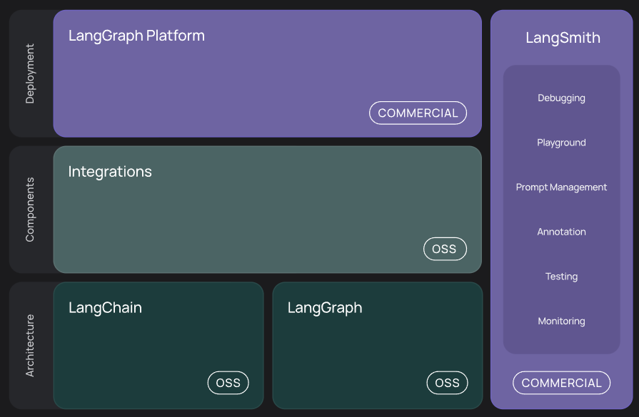
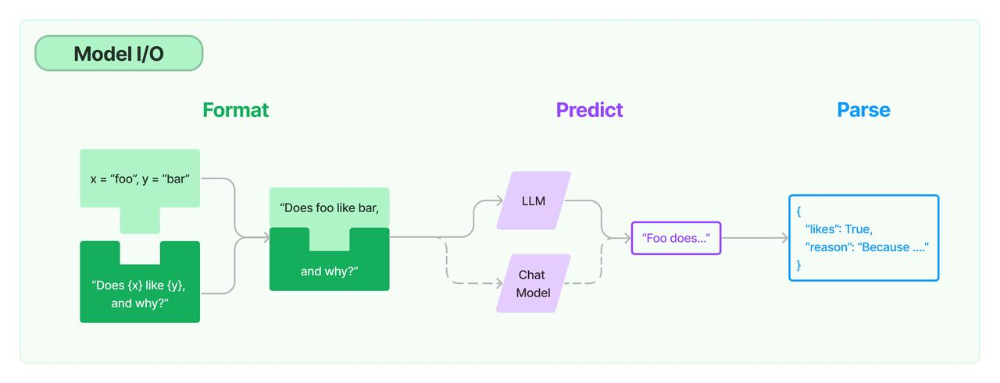
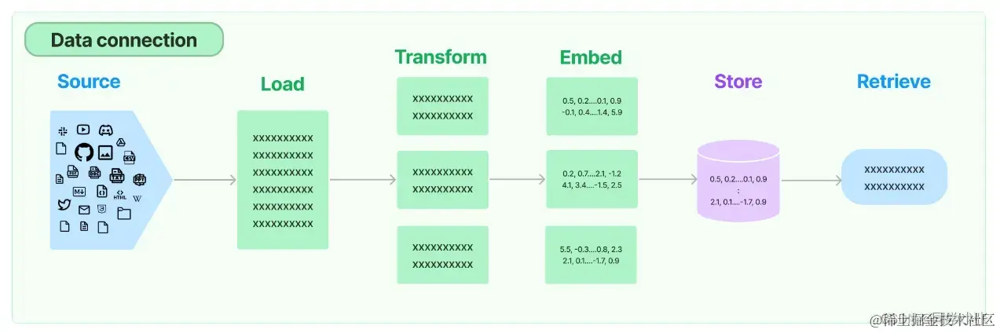
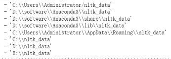
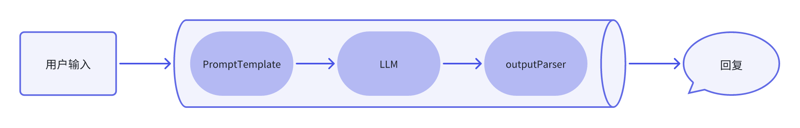
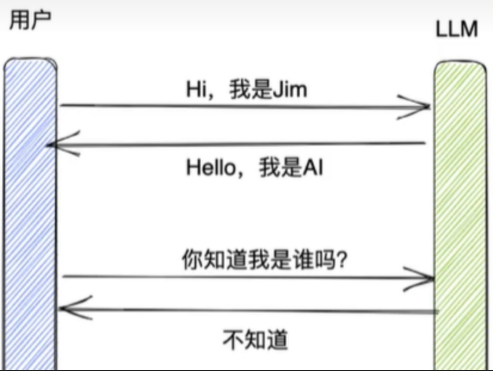
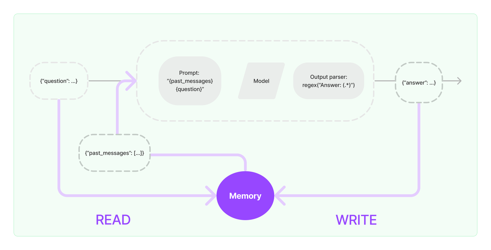

# LangChain介绍
angChain 是一个用于构建基于大语言模型（LLM）应用程序的 开发框架，它通过模块化设计简化了LLM与其他工具、数据源和业务流程的集成。

官网地址：https://python.langchain.com/docs/introduction/

中文地址：https://www.langchain.com.cn/docs/introduction/

GitHub源码地址：https://github.com/langchain-ai/langchain



+ 开发：使用 LangChain 的开源[组件](https://python.langchain.com/docs/concepts/)和[第三方集成](https://python.langchain.com/docs/integrations/providers/)构建您的应用程序。使用[LangGraph](https://python.langchain.com/docs/concepts/architecture/#langgraph)构建具有一流流媒体和人机交互支持的状态代理。
+ 生产化：使用[LangSmith](https://docs.smith.langchain.com/)检查、监控和评估您的应用程序，以便您可以自信地持续优化和部署。
+ 部署：使用[LangGraph 平台](https://langchain-ai.github.io/langgraph/cloud/)将您的 LangGraph 应用程序转变为可用于生产的 API 和助手。

**Langchain的核心组件**

+ 模型输入/输出（Model I/O）：包含各大语言模型的LangChain接口和调用细节，以及输出解析机制。
+ 提示模板（Prompts）：使提示工程流线化，进一步激发大语言模型的潜力。
+ 数据连接（Data connection）：专门用于将 外部数据源（如数据库、文档、API等）与 大语言模型（LLM） 高效连接，实现数据的加载、处理和检索。
+ 数据检索（Indexes）：构建并操作文档的方法，接受用户的查询并返回最相关的文档，轻松搭建本地知识库。
+ 记忆（Memory）：用于链的多次运行之间持久化应用程序状态；。
+ 链（Chains）：Chains是LangChain的核心抽象，通过编排模型、工具和逻辑，实现多步骤任务的自动化执行。
+ 代理（Agents）：LangChain的Agent机制实现了：模型自主决策 → 工具调用（内/外部）→ 结果处理的工作流闭环，使静态模型进化为可自主完成复杂任务的智能体。
+ 回调（Callbacks）：跟踪模型调用、工具执行、链式流程的每一步细节，快速定位问题；自动记录交互数据（如用户输入、模型输出、耗时），便于审计和分析

**LangChain中的模块**

1. 模型（Models）

+ 大语言模型（LLMs）：如 OpenAI、Anthropic、Llama 等
+ 聊天模型（Chat Models）：专为对话优化的模型（如 GPT-4-turbo）
+ 嵌入模型（Embeddings）：用于文本向量化（如 OpenAI Embeddings）

2. 提示（Prompts）

+ 提示模板（Prompt Templates）：动态生成提示，支持变量插值
+ 示例选择器（Example Selectors）：优化 few-shot 学习
+ 输出解析器（Output Parsers）：结构化模型输出

3. 链（Chains）

+ 基础链（LLMChain）：组合模型 + 提示
+ 检索链（RetrievalQA）：结合检索与问答
+ 自定义链：构建多步骤任务流程

4. 记忆（Memory）

+ 对话记忆（ConversationBuffer）：存储聊天历史
+ 向量存储记忆（VectorStore-backed）：长期记忆检索

5. 索引（Indexes）

+ 文档加载器（Document Loaders）：从文件/网页加载数据
+ 文本分割器（Text Splitters）：拆分长文本
+ 向量存储（Vector Stores）：FAISS、Pinecone 等

6. 代理（Agents）

+ 工具（Tools）：外部 API 或函数（如搜索、计算）
+ 代理执行器（AgentExecutor）：动态决策调用工具

7. 回调（Callbacks）

+ 日志/监控：跟踪执行流程
+ 自定义钩子：干预模型行为

## LangChain**的基本使用**
```plain
# 安装指定版本的LangChain 
pip install langchain==0.3.7  -i https://pypi.tuna.tsinghua.edu.cn/simple
pip install langchain-openai==0.2.3  -i https://pypi.tuna.tsinghua.edu.cn/simple
```

通过LangChain的接口来调用大模型

```plain
from dotenv import load_dotenv
from langchain_openai import ChatOpenAI
import os

load_dotenv()

llm = ChatOpenAI(api_key=os.getenv("DASHSCOPE_API_KEY"),
                 base_url=os.getenv("DASHSCOPE_BASE_URL"),
                 model_name="qwen-max-latest")

# 输入问题，调用llm进行回复
res = llm.invoke("什么是大模型？")
print("res", res)
print("content", res.content)
```

多轮对话的封装

```plain
from dotenv import load_dotenv
from langchain_openai import ChatOpenAI
from langchain.schema import (
    AIMessage,  # assistant role
    HumanMessage,  # user role
    SystemMessage  # system role
)
import os

load_dotenv()

llm = ChatOpenAI(api_key=os.getenv("DASHSCOPE_API_KEY"),
                 base_url=os.getenv("DASHSCOPE_BASE_URL"),
                 model_name="qwen-max-latest")
messages = [
    SystemMessage(content="你是同学们的指导老师，你叫张老师"),
    HumanMessage(content="老师你好，我是你的学生，小贺"),
    AIMessage(content="同学你好，我是张老师，请问有什么问题吗？"),
    HumanMessage(content="我的名字是？"),
]
response = llm.invoke(messages)
print(response.content)
```

### 使用提示模板
```plain
# 我们也可以创建prompt template, 并引入一些变量到prompt template中，这样在应用的时候更加灵活
from langchain_core.prompts import ChatPromptTemplate
from dotenv import load_dotenv
from langchain_openai import ChatOpenAI
import os

load_dotenv()
llm = ChatOpenAI(api_key=os.getenv("DASHSCOPE_API_KEY"),
                 base_url=os.getenv("DASHSCOPE_BASE_URL"),
                 model_name="qwen-max-latest")

# 需要注意的一点是，这里需要指明具体的role，在这里是system和用户
prompt = ChatPromptTemplate.from_messages([
    ("system", "你是一个大模型专家"),
    ("user", "{input}")  # {input}为变量
])
print(prompt)

chain = prompt | llm
response = chain.invoke({"input": "大模型中的prompt是什么？"})
print(response.content)
```

### 使用输出解析器
```plain
from langchain_openai import ChatOpenAI
from langchain_core.prompts import ChatPromptTemplate
from langchain_core.output_parsers import StrOutputParser, JsonOutputParser
from dotenv import load_dotenv
import os

load_dotenv()
# 初始化模型
llm = ChatOpenAI(api_key=os.getenv("DASHSCOPE_API_KEY"),
                 base_url=os.getenv("DASHSCOPE_BASE_URL"),
                 model_name="qwen-max-latest")

# 创建提示模板
prompt = ChatPromptTemplate.from_messages([
    ("system", "你是一个大模型专家"),
    ("user", "{input}")
])
# 使用字符串格式输出解析器
output_parser = StrOutputParser()
# 使用JSON格式输出解析器
# output_parser = JsonOutputParser()

# 将其添加到上一个链中
chain = prompt | llm | output_parser
# chain = prompt | llm

res = chain.invoke({"input": "大模型中的prompt是什么？"})
# 如果你没有让大模型使用json格式输出，会报错
# res = chain.invoke({"input": "LangChain是什么? 问题用question 回答用answer 用JSON格式回复"})

print(res)
```

### 向量存储
使用一个简单的本地向量存储 FAISS，首先需要安装它

```plain
pip install faiss-cpu
pip install langchain_community==0.3.7
pip install dashscope
```

```plain
# 导入和使用 WebBaseLoader
from langchain_community.document_loaders import WebBaseLoader
from dotenv import load_dotenv
import bs4
# 对于嵌入模型，这里通过 API调用
from langchain_community.embeddings import DashScopeEmbeddings
# 使用此嵌入模型将文档摄取到矢量存储中
from langchain_community.vectorstores import FAISS
from langchain_text_splitters import RecursiveCharacterTextSplitter

load_dotenv()


def faiss_conn():
    # 读取网页中的数据
    loader = WebBaseLoader(
        web_path="https://www.gov.cn/xinwen/2020-06/01/content_5516649.htm",
        bs_kwargs=dict(parse_only=bs4.SoupStrainer(id="UCAP-CONTENT"))
    )
    # 读取数据
    docs = loader.load()
    # print(docs)
    # 创建向量模型
    embeddings = DashScopeEmbeddings()
    # 使用分割器分割文档
    text_splitter = RecursiveCharacterTextSplitter(chunk_size=500, chunk_overlap=50)
    documents = text_splitter.split_documents(docs)
    # print(documents)
    # 向量存储  embeddings 会将 documents 中的每个文本片段转换为向量，并将这些向量存储在 FAISS 向量数据库中
    vector = FAISS.from_documents(documents, embeddings)
    return vector
```

### RAG+Langchain，基于外部知识，增强大模型回复
```plain
from langchain.chains.combine_documents import create_stuff_documents_chain
from langchain_core.prompts import ChatPromptTemplate
from langchain_openai import ChatOpenAI
from langchain.chains import create_retrieval_chain
import os
from 简单使用_向量存储 import faiss_conn
from dotenv import load_dotenv

load_dotenv()

# {context}变量必须包含
prompt = ChatPromptTemplate.from_template("""仅根据提供的上下文回答以下问题:

<context>
{context}
</context>

问题: {input}""")
# 创建llm连接
llm = ChatOpenAI(api_key=os.getenv("DASHSCOPE_API_KEY"),
                 base_url="https://dashscope.aliyuncs.com/compatible-mode/v1",
                 model='qwen-plus')
# 创建文档组合链  将文档内容和用户问题组合成一个完整的提示，然后传递给语言模型生成回答
document_chain = create_stuff_documents_chain(llm, prompt)
# 生成检索器示例
retriever = faiss_conn().as_retriever()
retriever.search_kwargs = {"k": 3}  # 限制为最多检索3个文档
# 创建检索链   该链结合了检索器和文档组合链，实现了从向量数据库中检索相关文档，并将这些文档与用户问题组合成提示
retrieval_chain = create_retrieval_chain(retriever, document_chain)
# 调用检索链并获取回答
response = retrieval_chain.invoke({"input": "建设用地使用权是什么？"})
print(response["answer"])
```

### 代理的使用
在LangChain框架中，Agents是一种利用大型语言模型（Large Language Models，简称LLMs）来执行任务和做出决策的系统

在 LangChain 的世界里，Agent 是一个智能代理，它的任务是听取你的需求（用户输入）和分析当前的情境（应用场景），然后从它的工具箱（一系列可用工具）中选择最合适的工具来执行操作

+ 使用工具（Tool）：LangChain中的Agents可以使用一系列的工具（Tools）实现，这些工具可以是API调用、数据库查询、文件处理等，Agents通过这些工具来执行特定的功能。
+ 推理引擎（Reasoning Engine）：Agents使用语言模型作为推理引擎，以确定在给定情境下应该采取哪些行动，以及这些行动的执行顺序。
+ 可追溯性（Traceability）：LangChain的Agents操作是可追溯的，这意味着可以记录和审查Agents执行的所有步骤，这对于调试和理解代理的行为非常有用。
+ 自定义（Customizability）：开发者可以根据需要自定义Agents的行为，包括创建新的工具、定义新的Agents类型或修改现有的Agents。
+ 交互式（Interactivity）：Agents可以与用户进行交互，响应用户的查询，并根据用户的输入采取行动。
+ 记忆能力（Memory）：LangChain的Agents可以被赋予记忆能力，这意味着它们可以记住先前的交互和状态，从而在后续的决策中使用这些信息。
+ 执行器（Agent Executor）：LangChain提供了Agent Executor，这是一个用来运行代理并执行其决策的工具，负责协调代理的决策和实际的工具执行。

```plain
from langchain_openai import ChatOpenAI
from langchain import hub
from langchain.agents import create_openai_functions_agent
from langchain.agents import AgentExecutor
from langchain.tools.retriever import create_retriever_tool
import os
from 简单使用_向量存储 import faiss_conn
from dotenv import load_dotenv

load_dotenv()
# 读取数据
retriever = faiss_conn().as_retriever()

# 检索器工具
retriever_tool = create_retriever_tool(
    retriever,
    "中华人民共和国民法典的一个检索器工具",
    "搜索有关中华人民共和国民法典的信息。关于中华人民共和国民法典的任何问题，您必须使用此工具!",
)

tools = [retriever_tool]

# https://smith.langchain.com/hub
# 使用在线的提示词模板
prompt = hub.pull("hwchase17/openai-functions-agent")

llm = ChatOpenAI(api_key=os.getenv("DASHSCOPE_API_KEY"),
                 base_url="https://dashscope.aliyuncs.com/compatible-mode/v1",
                 model='qwen-plus')
# 创建一个agent代理，tools：该代理可以访问的工具
agent = create_openai_functions_agent(llm, tools, prompt)
# agent：要执行那个代理 tools：代理可以调用的工具，verbose：是否以详细模型运行，
agent_executor = AgentExecutor(agent=agent, tools=tools, verbose=True)

# 运行代理
res = agent_executor.invoke({"input": "你是谁？"})
print(res)
```

# LangChain的Model I/O
在 LangChain 体系里，模型的运用流程可拆解为三个核心部分：提示格式化（Format）、模型调用（Predict）、输出解析（Parse）。

+ 提示格式化（Format）：LangChain 的提示模板具备灵活的输入动态选取机制，能够依照实际需求进行针对性调整，完美契合多样化的特定任务与应用情景。
+ 模型调用（Predict）：LangChain 搭建了通用接口桥梁，可轻松对接各类语言模型，大幅增强了使用时的灵活度与便捷性。
+ 输出解析（Parse）：通过 LangChain 的输出解析工具，能够精准筛选模型输出里的有效信息，摆脱冗余内容的困扰。并且，可将杂乱无章的非结构化文本规整为条理清晰、易于处理的结构化数据，显著提升信息处理效能。

这三大环节相辅相成，在 LangChain 中合称为 Model I/O 。针对每个环节，LangChain 都精心准备了实用模板与工具，为快速调用各类语言模型接口提供有力支持。



## 提示模板
在 LangChain 的 Model I/O 中，提示模板是重要构成部分。语言模型的提示，是用户给出的一系列指令或输入信息，用来指引模型作出回应。它能帮模型弄懂上下文，进而产出相关且连贯的语言内容，像解答问题、续写句子，或是参与活动、展开对话等。

PromptTemplates 是 LangChain 里的概念。它接收用户最初的输入，再输出一份可直接交给语言模型的提示信息（即 prompt ）。

直白地说，prompt template 是一个模板式字符串，可用于生成特定的提示内容（prompts） 。你能把变量嵌入模板，借此生成不同的提示。这在反复生成格式相近的提示时很有用，尤其是在自动化任务里，能大大提高效率。

**特点**

1. 动态变量插入：支持在模板中设置变量占位符，可根据实际需求动态填充不同内容，生成多样化提示词
2. 结构化输入处理：能将用户原始输入整理为模型可理解的格式，适配问答、文本生成等多种任务场景
3. 复用性与标准化：通过模板预定义格式，避免重复编写相似提示逻辑，提升自动化任务的开发效率
4. 参数化配置：允许自定义模板参数，灵活调整提示的结构、指令强度及上下文信息
5. 多场景适配：可针对问答、摘要、翻译等不同任务类型，定制专属的提示生成逻辑
6. 与模型解耦：独立于具体语言模型，通过统一接口对接不同 LLM，保持提示生成逻辑的一致性

**类型**

1. 基础提示模板（BasePromptTemplate）：LangChain 中最基本的抽象类，定义了提示模板的核心接口和方法，其他具体模板类型继承自该类。
2. 字符串模板（StringPromptTemplate）：基于 Python 字符串格式化的简单模板，使用花括号`{}`作为变量占位符，例如：`"请回答问题：{question}"`。
3. FewShotPromptTemplate：用于少量样本学习的提示模板，可在提示中包含示例（Examples）来引导模型生成更符合预期的输出。
4. ChatPromptTemplate：专为聊天模型设计的模板，支持多轮对话格式，可分别定义系统消息、用户消息和助手消息的模板。
5. PromptTemplate：最常用的具体实现，支持通过变量名动态生成提示，可配置输入变量、模板字符串和输出解析器。
6. FunctionCallPromptTemplate：用于函数调用场景的模板，可生成指导模型调用特定函数的提示，通常与 OpenAI 函数调用 API 结合使用。
7. FileTemplate：从外部文件加载模板内容，便于管理复杂或长文本提示，支持文件路径或 URL 引用。
8. CustomPromptTemplate：允许用户自定义实现的模板，通过继承`BasePromptTemplate`类并实现必要方法来创建特定逻辑的模板。

**创建提示模板**

```plain
# 导入LangChain中的提示模板
from langchain.prompts import PromptTemplate

# 创建原始模板
template = "你是一位专业的数学老师。\n对于信息 {content} 进行简短描述"

# 根据原始模板创建LangChain提示模板
prompt = PromptTemplate.from_template(template)

print(prompt)
print(prompt.format(content="一元二次方程"))
```

直接生成提示模板

```plain
from langchain.prompts import PromptTemplate

prompt = PromptTemplate(
    input_variables=["content"],
    template="你是一位专业的数学老师。\n对于信息 {content} 进行简短描述"
)
print(prompt.format(content="一元二次方程"))
```

**使用提示模板**

```plain
# 导入LangChain中的OpenAI模型接口
from langchain_openai import ChatOpenAI
# 导入LangChain中的提示模板
from langchain.prompts import PromptTemplate
import os
from dotenv import load_dotenv

load_dotenv()

# 创建模型实例
model = ChatOpenAI(api_key=os.getenv("DASHSCOPE_API_KEY"),
                   base_url="https://dashscope.aliyuncs.com/compatible-mode/v1",
                   model='qwen-max-latest')

# 创建提示模板
prompt = PromptTemplate(
    input_variables=["content"],
    template="你是一位专业的数学老师。\n对于信息 {content} 进行简短描述"
)

# 将具体的内容填充到模板中
q = prompt.format(content="一元二次方程")

# 模型进行回复
output = model.invoke(q)
# output = model.invoke("你是一位专业的数学老师。对于信息一元二次方程进行简短描述")

# 打印输出内容
print(output.content)
```

**ChatPromptTemplate聊天提示模板**

`PromptTemplate`用于创建字符串格式的提示模板，默认采用 Python 的`str.format`语法进行模板化处理。而`ChatPromptTemplate`则专门用于生成聊天消息列表形式的提示模板，二者的核心差异在于：

`ChatPromptTemplate`支持为不同消息赋予对应的角色属性（如系统指令、用户输入、助手回复等），能够以结构化方式组织多轮对话的上下文，更贴合聊天模型的交互逻辑；而`PromptTemplate`仅生成单一的字符串文本，适用于非对话场景的提示生成。

```plain
from langchain.prompts.chat import ChatPromptTemplate
# 导入LangChain中的ChatOpenAI模型接口
from langchain_openai import ChatOpenAI
import os
from dotenv import load_dotenv

load_dotenv()

# 创建系统模板
template = "你是一个计算天才，你可以计算任何算式"
# 创建用户模板
human_template = "{question}"

# 组装到提示模板中
chat_prompt = ChatPromptTemplate.from_messages([
    ("system", template),
    ("human", human_template),
])

# 创建模型实例
model = ChatOpenAI(api_key=os.getenv("DASHSCOPE_API_KEY"),
                   base_url="https://dashscope.aliyuncs.com/compatible-mode/v1",
                   model='qwen-max-latest')
# 输入问题
messages = chat_prompt.format_messages(question="一本故事书有 180 页，小华每天看 15 页，看了一周后还剩多少页？")
print(messages)
# 得到模型的输出
output = model.invoke(messages)
# 打印输出内容
print(output.content)
```

接下来使用LangChain提供不同类型的MessagePromptTemplate

```plain
from langchain.prompts import (
    ChatPromptTemplate,
    SystemMessagePromptTemplate,
    HumanMessagePromptTemplate,
)
from langchain_openai import ChatOpenAI
import os
from dotenv import load_dotenv

load_dotenv()

# 创建模型实例
llm = ChatOpenAI(api_key=os.getenv("DASHSCOPE_API_KEY"),
                 base_url="https://dashscope.aliyuncs.com/compatible-mode/v1",
                 model='qwen-max-latest')

# 系统模板的设置
system_template = "作为专业翻译专家，我能够精准实现 {input_language} 到 {output_language} 的语言转换"
system_message_prompt = SystemMessagePromptTemplate.from_template(system_template)

# 用户模版的设置
human_template = "{question}"
human_message_prompt = HumanMessagePromptTemplate.from_template(human_template)

# 组装成最终模版
prompt_template = ChatPromptTemplate.from_messages([system_message_prompt, human_message_prompt])

# 格式化提示消息生成提示
prompt = prompt_template.format_prompt(input_language="英文", output_language="中文",
                                       question="A storybook has 180 pages. Xiaohua reads 15 pages every day. "
                                                "After reading for a week, how many pages are left?")
# 打印模版
print("prompt:", prompt)

# 得到模型的输出
res = llm.invoke(prompt)
# 打印输出内容
print("结果:", res.content)
```

**少量样本示例的提示模板**

```plain
# 定义少量样本示例（Few-shot examples）
examples = [
    {
        "text": "这部电影的剧情太精彩了，特效也超震撼！",
        "sentiment": "积极"
    },
    {
        "text": "新买的手机经常卡顿，充电还很慢，体验太差了",
        "sentiment": "消极"
    },
    {
        "text": "这家餐厅的菜品味道不错，服务态度也很好",
        "sentiment": "积极"
    }
]
```

创建提示模板

```plain
# 定义示例模板，包含输入（文本）和输出（情感类别）
example_template = """
文本: "{text}"
情感类别: "{sentiment}"
"""
example_prompt = PromptTemplate(
    input_variables=["text", "sentiment"],
    template=example_template
)
```

创建FewShotPromptTemplate对象

```plain
# 定义整体提示模板，包含示例和用户输入部分
prefix = "请根据以下示例，判断给定文本的情感是积极还是消极："
suffix = """
文本: "{user_text}"
情感类别: """

# 构建FewShotPromptTemplate
few_shot_prompt = FewShotPromptTemplate(
    # 示例列表
    examples=examples,
    # 示例模板
    example_prompt=example_prompt,
    # 前缀说明
    prefix=prefix,
    # 用户输入占位符
    suffix=suffix,
    # 输入变量
    input_variables=["user_text"],
    # 示例分隔符
    example_separator="\n\n"
)

# 使用模板生成最终提示
prompt = few_shot_prompt.format(user_text="今天的天气阴沉沉的，心情也不好")
print(prompt)
```

初始化大模型，然后调用

```plain
print('-' * 50)

model = ChatOpenAI(api_key=os.getenv("DASHSCOPE_API_KEY"),
                   base_url="https://dashscope.aliyuncs.com/compatible-mode/v1",
                   model='qwen-max-latest')
result = model.invoke(prompt)
print(result.content)
```

## Model 模型
在 LangChain 框架中，支持的模型主要分为三大类型：

1. 大语言模型（LLM/Text Model） 这类模型以文本字符串作为输入，并输出文本字符串。它们是基础的语言理解与生成模型，可用于文本续写、摘要、翻译等任务。
2. 聊天模型（Chat Model） 以 OpenAI 的 ChatGPT 系列为代表，本质上由大语言模型驱动，但针对对话场景做了优化。其核心特点是 API 接口更结构化：输入为聊天消息列表（包含系统、用户、助手等角色的消息），输出为 AI 生成的对应消息，更适合多轮对话交互。
3. 文本嵌入模型（Embedding Model） 将文本转换为浮点数向量（Embedding），用于表示文本的语义特征。这些向量可用于文本相似度计算、聚类、检索等场景。

### 关键差异说明：
+ 聊天模型与大语言模型的关系： 聊天模型基于大语言模型构建，但接口设计更贴合对话逻辑 —— 输入不再是单一文本，而是结构化的消息列表（如`[{'role': 'user', 'content': '问题'}]`），输出也以消息对象形式呈现，更便于管理对话上下文。
+ 应用场景区分：
    - 大语言模型：适用于非对话类任务（如文档生成、代码编写）。
    - 聊天模型：更适合交互式场景（如智能客服、对话式 AI）。

### 大语言模型LLM
LangChain的核心组件是大型语言模型（LLM），它提供一个标准接口以字符串作为输入并返回字符串的形式与多个不同的LLM进行交互。这一接口旨在为诸如OpenAI、Hugging Face等多家LLM供应商提供标准化的对接方法。

```plain
from langchain_community.chat_models import ChatTongyi
from dotenv import load_dotenv
import os

load_dotenv()


# LLM纯文本补全模型
llm = ChatTongyi(api_key=os.getenv("DASHSCOPE_API_KEY"),
                 base_url="https://dashscope.aliyuncs.com/compatible-mode/v1",
                 model='qwen-max-latest')

text = "我今天真的是服了（帮我补全这个文本）"
res = llm.invoke(text)
print(res.content)
```

对话模型

```plain
from langchain_openai import ChatOpenAI
from dotenv import load_dotenv
import os

load_dotenv()

text = "你知道爬虫吗？"
llm = ChatOpenAI(
    api_key=os.getenv("DASHSCOPE_API_KEY"),
    base_url="https://dashscope.aliyuncs.com/compatible-mode/v1",
    model="qwen-max-latest",
)

res = llm.invoke(text)

print(res)
```

| <font style="color:rgb(0, 0, 0);">维度</font> | <font style="color:rgb(0, 0, 0);">大语言模型（LLM/Text Model）</font> | <font style="color:rgb(0, 0, 0);">聊天模型（Chat Model）</font> |
| :--- | :--- | :--- |
| <font style="color:rgb(0, 0, 0);">核心定位</font> | <font style="color:rgba(0, 0, 0, 0.85);">基础文本处理模型，专注于文本生成、理解、编辑等通用任务。</font> | <font style="color:rgba(0, 0, 0, 0.85);">对话场景专用模型，针对多轮交互优化，模拟自然对话逻辑。</font> |
| <font style="color:rgb(0, 0, 0);">设计目标</font> | <font style="color:rgba(0, 0, 0, 0.85);">处理单一文本输入（如段落、文章），输出连贯文本。</font> | <font style="color:rgba(0, 0, 0, 0.85);">管理对话上下文，保持多轮交流的逻辑性和一致性。</font> |


+ 大语言模型适用场景：
    - 非对话类文本生成（如报告撰写、代码生成）；
    - 单轮文本交互（如简单问答、文本摘要）。
+ 聊天模型适用场景：
    - 多轮对话系统（智能客服、虚拟助手）；
    - 角色扮演、对话式应用（如聊天机器人、教育互动）；
    - 需要严格上下文管理的任务（如长对话故事创作、多轮逻辑推理）。

**智普模型**

可能需要安装模块`pyjwt`

```plain
from langchain_community.chat_models import ChatZhipuAI, ChatTongyi
from dotenv import load_dotenv
import os

load_dotenv()
zhipu_api_key = os.getenv("ZHIPU_API_KEY")

llm = ChatZhipuAI(
    model="glm-4-flash",
    temperature=0.5,
    api_key=zhipu_api_key
)

text = "你知道爬虫吗？？"
res = llm.invoke(text)
print(res.content)
```

### 聊天模型
聊天模型是 LangChain 的关键模块，其交互逻辑基于 "聊天消息输入 - 聊天消息输出" 的模式。

1. 内置消息类型解析
    1. 系统消息（SystemMessage）： 功能：定义 AI 角色与行为规则，需作为消息序列的首个输入。 示例："你是专注医疗咨询的助手，仅回答健康问题"。
    2. 用户消息（HumanMessage）： 功能：承载用户的提问、指令或对话内容。 示例："请问咳嗽持续三天需要用药吗？"。
    3. AI 回复（AIMessage）： 功能：模型生成的响应，支持纯文本或工具调用指令。 示例：
        * 纯文本："建议先观察体温变化"；
        * 工具调用："调用天气 API 获取北京明日气温"。

```plain
from langchain_openai import ChatOpenAI
from langchain_core.messages import HumanMessage, SystemMessage
from dotenv import load_dotenv
import os

load_dotenv()

human_text = "你好啊"
system_text = "你是一个十分厉害的五星级大厨"
# 聊天模型
chat_model = ChatOpenAI(
    api_key=os.getenv("DASHSCOPE_API_KEY"),
    base_url="https://dashscope.aliyuncs.com/compatible-mode/v1",
    model="qwen-plus",
)

messages = [HumanMessage(content=human_text)]
# 聊天模型支持多个消息作为输入
# messages = [SystemMessage(content=system_text), HumanMessage(content=human_text)]

res = chat_model.invoke(messages)
print(res.content)
```

### 文本嵌入模型
Embedding类是一个用于与嵌入进行交互的类。有许多嵌入提供商（OpenAI、Cohere、Hugging Face等)- 这个类旨在为所有这些提供商提供一个标准接口。

```plain
from langchain_community.embeddings import DashScopeEmbeddings
from dotenv import load_dotenv

load_dotenv()
# 初始化 DashScopeEmbeddings实例
embeddings = DashScopeEmbeddings()

# 定义一个文本字符串
text = "我爱学习大模型"

# 嵌入文档
doc_result = embeddings.embed_documents([text])
print(doc_result[0][:5])

# 嵌入查询
query_result = embeddings.embed_query(text)
print(query_result[:5])
```

```plain
from langchain_huggingface import HuggingFaceEmbeddings

# 创建嵌入模型
model_name = r'D:\llm\Local_model\BAAI\bge-large-zh-v1___5'

embed_model = HuggingFaceEmbeddings(
    model_name=model_name
)
text = "我爱学习大模型"
query_result = embed_model.embed_query(text)
print(query_result[:5])
```

通过Hugging Face官方包的加持，开发小伙伴们通过简单的api调用就能在langchain中轻松使用Hugging Face上各类流行的开源大语言模型以及各类AI工具

**环境准备 **

访问：HuggingFace(`https://huggingface.co/settings/tokens`)，在个人设置中心，创建一个API Token 

```plain
from langchain_huggingface import HuggingFaceEndpoint, ChatHuggingFace
from dotenv import load_dotenv
import os

load_dotenv()
HF_TOKEN = os.getenv("HF_TOKEN")

# 推荐使用以下任一模型名：
for model in ["Qwen/Qwen3-8B", "Qwen/Qwen3-1.7B", "mistralai/Mistral-7B-Instruct-v0.3"]:
    print(f"尝试模型: {model}")
    llm = HuggingFaceEndpoint(
        repo_id=model,
        task="conversational",
        max_new_tokens=100,  # 限制生成的最大 token 数量为 30 个
        typical_p=0.95,  # 控制输出文本的多样性，避免生成太过常见或太过罕见的 tokens
        repetition_penalty=1.03,  # 对重复出现的 tokens 施加惩罚，避免生成重复的内容
        huggingfacehub_api_token=HF_TOKEN,
        provider="auto"
    )
    try:
        chat_model = ChatHuggingFace(llm=llm)
        resp = chat_model.invoke("解释 prompt 是什么？")
        print("调用成功！输出如下：")
        print(resp)
        break
    except Exception as e:
        print(f"模型 {model} 调用失败：{e}")
        print("---")
```

## 输出解析器
输出解析器（Output Parsers）是 LangChain 的核心组件，负责将大语言模型（LLM）的非结构化文本输出转换为程序可处理的标准化格式。通过解析器，开发者可以强制模型生成结构化数据（如列表、JSON、日期等），使输出更易于集成到下游任务中。

---

**1. 核心功能**

+ 结构化转换：将自由文本转换为编程友好格式（如列表、JSON、XML等）。
+ 数据规范化：确保模型输出符合预设的格式要求（如字段类型、日期格式）。
+ 无缝集成：使模型输出可直接对接数据库、API 或其他 LangChain 组件（如 Chains、Agents）。

**2. 常用输出解析器类型**

(1) 列表解析器（CommaSeparatedListOutputParser）

+ 功能：将逗号分隔的字符串转换为 Python 列表。
+ 适用场景：关键词提取、多选项生成、批量数据处理。

(2) 日期时间解析器（DatetimeOutputParser）

+ 功能：将自然语言描述的日期或时间解析为标准 `datetime` 对象。
+ 适用场景：日程安排、时间敏感任务、日志分析。

(3) JSON 解析器（JsonOutputParser）

+ 功能：确保模型输出符合特定的 JSON Schema 结构。
+ 适用场景：API 交互、数据存储、结构化数据生成。

(4) XML 解析器（XMLOutputParser）

+ 功能：将模型输出解析为符合 XML 格式的数据。
+ 适用场景：企业级数据交换、文档生成、Web 服务集成。

```plain
from langchain_core.prompts import ChatPromptTemplate
from langchain_openai import ChatOpenAI
# 创建解析器
from langchain_core.output_parsers import JsonOutputParser, StrOutputParser, XMLOutputParser
from dotenv import load_dotenv
import os

load_dotenv()

# 初始化语言模型
llm = ChatOpenAI(
    api_key=os.getenv("DASHSCOPE_API_KEY"),
    base_url="https://dashscope.aliyuncs.com/compatible-mode/v1",
    model="qwen-max-latest",
)

# 使用除StrOutputParser之外的解释器,需要在提示词中明确的指出是按照什么格式输出
# output_parser = StrOutputParser()
output_parser = JsonOutputParser()
# output_parser = XMLOutputParser()

# 提示模板
prompt = ChatPromptTemplate.from_messages([
    ("system", "你是一个大模型的专家"),
    ("user", " {question},请按照JSON格式输出")
])

# 将提示和模型合并以进行调用
chain = prompt | llm | output_parser

res = chain.invoke({"question": "langchain是什么?"})
print(res)
```

```plain
from langchain.output_parsers import DatetimeOutputParser
from langchain.prompts import PromptTemplate
from langchain_openai import ChatOpenAI
from dotenv import load_dotenv
import os

load_dotenv()

model = ChatOpenAI(
    api_key=os.getenv("DASHSCOPE_API_KEY"),
    base_url="https://dashscope.aliyuncs.com/compatible-mode/v1",
    model="qwen-max-latest"
)

# 定义模板格式
template = """
回答用户的问题：{question}

{format_instructions}
"""

# 使用日期时间解析器
output_parser = DatetimeOutputParser()
# output_parser.get_format_instructions()：将时间解释器中的提示词模板内容添加到自定义的提示词中
print(output_parser.get_format_instructions())
prompt = PromptTemplate.from_template(
    template,
    partial_variables={"format_instructions": output_parser.get_format_instructions()},
    # partial_variables参数是可以在程序运行是动态传入值，还可以直接传入函数
)

# 链式调用
chain = prompt | model | output_parser
output = chain.invoke({"question": "新中国是什么时候成立的？"})
# 打印输出
print(output)  # 1949-10-01

# 手动通过输出解释器执行
# output = model.invoke(prompt.format(question='新中国成立的时间？'))
# datetime_parsed = output_parser.parse(output.content)
# print(datetime_parsed)  # 1949-10-01
```

# Langchain的DataConnection
在前面课程中我们已经讲了大模型存在的缺陷：数据不实时，缺少垂直领域数据和私域数据等。解决这些缺陷的主要方法是通过检索增强生成（RAG）。首先检索外部数据，然后在执行生成步骤时将其传递给LLM。

LangChain为RAG应用程序提供了从简单到复杂的所有构建块，本文要学习的数据检索（Retrieval）模块包括与检索步骤相关的所有内容，例如数据的获取、切分、向量化、向量存储、向量检索等模块（见下图）。



## Document loaders 文档加载模块
LangChain封装了一系列类型的文档加载模块，例如PDF、CSV、HTML、JSON、Markdown、File Directory等。下面以PDF文件夹在为例看一下用法，其它类型的文档加载的用法都类似。

#### 加载本地文件
LangChain加载PDF文件使用的是pypdf，先安装：

```python
python
复制代码
pip install pypdf
```

加载代码示例：

```python
from langchain_community.document_loaders import PyPDFLoader

loader = PyPDFLoader("D:\Llm\DeepSeek15天指导手册.pdf")
pages = loader.load_and_split()

print(f"第0页：\n{pages[0]}")  ## 也可通过 pages[0].page_content只获取本页内容
```

langchain加载Word文件，先下载

```python
pip install unstructured
pip install python-doc
pip install python-docx
```

还需要下载一个分词器NLTK 

参考文档：https://blog.csdn.net/lu_rong_qq/article/details/143409795

下载好之后，在这个他遍历的路径列表中，创建自己的文件夹，



```python
D:\nltk_data\tokenizers\punkt_tab  # 创建一个这个名称的文件

# punkt_tab这个文件是由你下载的压缩文件解压的
```

代码示例：

```python
from langchain_community.document_loaders import UnstructuredWordDocumentLoader

# 指定要加载的Word文档路径
loader = UnstructuredWordDocumentLoader("D:\Llm\人事管理流程.docx")

# 加载文档并分割成段落或元素
documents = loader.load()

# 输出加载的内容
for doc in documents:
    print(doc.page_content)
```

#### 加载在线PDF文件
LangChain竟然也能加载在线的PDF文件。

在开始之前，你可能需要安装以下的Python包：

```python
pip install -i https://pypi.tuna.tsinghua.edu.cn/simple unstructured
pip install -i https://pypi.tuna.tsinghua.edu.cn/simple pdf2image
pip install -i https://pypi.tuna.tsinghua.edu.cn/simple opencv-python
pip install -i https://pypi.tuna.tsinghua.edu.cn/simple unstructured-inference
pip install -i https://pypi.tuna.tsinghua.edu.cn/simple pikepdf
```

代码示例：

```python
from langchain_community.document_loaders import PyPDFLoader

loader = PyPDFLoader("https://arxiv.org/pdf/2302.03803.pdf")
data = loader.load()
print(f"第0页：\n{data[0].page_content}")
```

## Text Splitting 文档切分模块
LangChain提供了许多不同类型的文本切分器，具体见下表：

| **<font style="color:rgba(0, 0, 0, 0.9);">分割器类型</font>** | **<font style="color:rgba(0, 0, 0, 0.9);">核心逻辑</font>** | **<font style="color:rgba(0, 0, 0, 0.9);">适用场景</font>** | **<font style="color:rgba(0, 0, 0, 0.9);">关键参数</font>** | **<font style="color:rgba(0, 0, 0, 0.9);">优点</font>** | **<font style="color:rgba(0, 0, 0, 0.9);">缺点</font>** |
| :---: | :---: | :---: | :---: | :---: | :---: |
| <font style="color:rgba(0, 0, 0, 0.9);">CharacterTextSplitter</font> | <font style="color:rgba(0, 0, 0, 0.9);">按固定字符数切割</font> | <font style="color:rgba(0, 0, 0, 0.9);">简单文本、通用场景</font> | <font style="color:rgba(0, 0, 0, 0.9);">chunk_size, chunk_overlap</font> | <font style="color:rgba(0, 0, 0, 0.9);">速度快，无需依赖外部模型</font> | <font style="color:rgba(0, 0, 0, 0.9);">可能切断单词或句子</font> |
| <font style="color:rgba(0, 0, 0, 0.9);">RecursiveCharacterTextSplitter</font> | <font style="color:rgba(0, 0, 0, 0.9);">递归按分隔符（如段落、句子）分割</font> | <font style="color:rgba(0, 0, 0, 0.9);">长文档、多语言文本</font> | <font style="color:rgba(0, 0, 0, 0.9);">separators=["\n\n", "\n", " "]</font> | <font style="color:rgba(0, 0, 0, 0.9);">保留语义完整性，支持自定义优先级</font> | <font style="color:rgba(0, 0, 0, 0.9);">需手动调优分隔符顺序</font> |
| <font style="color:rgba(0, 0, 0, 0.9);">TokenTextSplitter</font> | <font style="color:rgba(0, 0, 0, 0.9);">按 Token 计数分割（如 GPT 的 4K 限制）</font> | <font style="color:rgba(0, 0, 0, 0.9);">需精确控制 LLM 输入成本</font> | <font style="color:rgba(0, 0, 0, 0.9);">encoding_name（如 "cl100k_base"）</font> | <font style="color:rgba(0, 0, 0, 0.9);">精准适配模型上下文窗口</font> | <font style="color:rgba(0, 0, 0, 0.9);">计算稍复杂</font> |
| <font style="color:rgba(0, 0, 0, 0.9);">Language 专属分割器</font> | <font style="color:rgba(0, 0, 0, 0.9);">按编程语言语法分割（Python/JS 等）</font> | <font style="color:rgba(0, 0, 0, 0.9);">源代码处理</font> | <font style="color:rgba(0, 0, 0, 0.9);">language=Language.PYTHON</font> | <font style="color:rgba(0, 0, 0, 0.9);">保留代码结构（函数、类）</font> | <font style="color:rgba(0, 0, 0, 0.9);">仅支持特定语言</font> |
| <font style="color:rgba(0, 0, 0, 0.9);">SemanticChunker</font> | <font style="color:rgba(0, 0, 0, 0.9);">基于嵌入模型（Embeddings）的语义相似度分割</font> | <font style="color:rgba(0, 0, 0, 0.9);">高精度语义场景</font> | <font style="color:rgba(0, 0, 0, 0.9);">embeddings=OpenAIEmbeddings()</font> | <font style="color:rgba(0, 0, 0, 0.9);">按主题/段落自然分块</font> | <font style="color:rgba(0, 0, 0, 0.9);">计算开销大</font> |
| <font style="color:rgba(0, 0, 0, 0.9);">MarkdownHeaderTextSplitter</font> | <font style="color:rgba(0, 0, 0, 0.9);">按 Markdown 标题层级分割</font> | <font style="color:rgba(0, 0, 0, 0.9);">结构化文档（如 README）</font> | <font style="color:rgba(0, 0, 0, 0.9);">headers_to_split_on=[("#", "H1")]</font> | <font style="color:rgba(0, 0, 0, 0.9);">保留标题层级关系</font> | <font style="color:rgba(0, 0, 0, 0.9);">仅适用于 Markdown</font> |


这里以Recursive为例展示用法。RecursiveCharacterTextSplitter是LangChain对这种文档切分方式的封装，里面的几个重点参数：

+ chunk_size：每个切块的token数量
+ chunk_overlap：相邻两个切块之间重复的token数量
+ separators：分割符优先级列表（按顺序尝试）

```python
from langchain_community.document_loaders import PyPDFLoader
from langchain.text_splitter import RecursiveCharacterTextSplitter

loader = PyPDFLoader("D:\Llm\DeepSeek15天指导手册.pdf")
pages = loader.load_and_split()
# print(f"第0页：\n{pages[0].page_content}")
# print(pages)

text_splitter = RecursiveCharacterTextSplitter(
    chunk_size=200,
    chunk_overlap=100,
    length_function=len,
    add_start_index=True,
)
# [pages[1].page_content]
paragraphs = text_splitter.create_documents([page.page_content for page in pages if pages])
for para in paragraphs:
    print(para.page_content)
    print('-------')
```

以上示例程序将chunk_overlap设置为100，看下运行效果，可以看到上一个chunk和下一个chunk会有一部分的信息重合，**这样做的原因是尽可能地保证两个chunk之间的上下文关系**：

这里提供了一个可视化展示文本如何分割的工具，感兴趣的可以看下。

工具网址：http://chunkviz.up.railway.app/

## Text embedding models 文本向量化模型封装
LangChain对一些文本向量化模型的接口做了封装，例如OpenAI, Cohere, Hugging Face等。 向量化模型的封装提供了两种接口，一种针对文档的向量化`embed_documents`，一种针对句子的向量化`embed_query`。

示例代码：

+ 文档的向量化`embed_documents`，接收的参数是字符串数组

```plain
from langchain_community.embeddings import DashScopeEmbeddings
embeddings_model = DashScopeEmbeddings()  ## OpenAI文本向量化模型接口的封装
embeddings = embeddings_model.embed_documents(
    [
        "Hi there!",
        "Oh, hello!",
        "What's your name?",
        "My friends call me World",
        "Hello World!"
    ]
)
len(embeddings), len(embeddings[0])
##运行结果 (5, 1536)
```

+ 句子的向量化`embed_query`，接收的参数是字符串

```python
embedded_query = embeddings_model.embed_query("What was the name mentioned in the conversation?")
embedded_query[:5]
```

## `Vector stores 向量存储（数据库`）
将文本向量化之后，下一步就是进行向量的存储。 这部分包含两块：一是向量的存储。二是向量的查询。

官方提供了三种开源、免费的可用于本地机器的向量数据库示例（chroma、FAISS、 Lance）。因为我在之前RAG的文章中用的chroma数据库，所以这里还是以这个数据库为例。

```python
from langchain_community.embeddings import DashScopeEmbeddings
from langchain_chroma import Chroma
from langchain_community.document_loaders import PyPDFLoader
from langchain.text_splitter import RecursiveCharacterTextSplitter
from dotenv import load_dotenv

load_dotenv()
# 读取文件
loader = PyPDFLoader("D:\Llm\DeepSeek15天指导手册.pdf")
pages = loader.load_and_split()

text_splitter = RecursiveCharacterTextSplitter(
    chunk_size=200,
    chunk_overlap=100,
    length_function=len,
    add_start_index=True,
)

# 将数据进行切割成块
paragraphs = text_splitter.create_documents([page.page_content for page in pages if pages])

# 创建chroma数据库，并将文本数据个向量化的数据存入
db = Chroma.from_documents(paragraphs, DashScopeEmbeddings())  # 一行代码搞定

# 在数据库中进行搜索
query = "有效提问的五个⻩⾦法则？"
docs = db.similarity_search(query)  # 一行代码搞定
for doc in docs:
    print(f"{doc}\n-------\n")
```

## Retrievers 检索器
检索器是在给定非结构化查询的情况下返回相关文本的接口。它比Vector stores更通用。检索器不需要能够存储文档，只需要返回（或检索）文档即可。Vector stores可以用作检索器的主干，但也有其他类型的检索器。**检索器接受字符串查询作为输入，并返回文档列表作为输出**。

检索器（Retrievers） 是一个用于从文档集合中检索最相关文档或信息片段的关键组件。它们通常与向量存储（Vector Stores）结合使用，通过计算查询向量与存储中的文档向量之间的相似度来实现高效的语义搜索。简单来说，检索器帮助你找到与特定查询最相关的文档。

LangChain检索器提供的检索类型如下：

| **<font style="color:rgba(0, 0, 0, 0.9);">检索器类型</font>** | **<font style="color:rgba(0, 0, 0, 0.9);">底层技术</font>** | **<font style="color:rgba(0, 0, 0, 0.9);">适用场景</font>** | **<font style="color:rgba(0, 0, 0, 0.9);">优点</font>** | **<font style="color:rgba(0, 0, 0, 0.9);">缺点</font>** |
| :---: | :---: | :---: | :---: | :---: |
| <font style="color:rgba(0, 0, 0, 0.9);">VectorStoreRetriever</font> | <font style="color:rgba(0, 0, 0, 0.9);">向量相似度搜索（如余弦相似度）</font> | <font style="color:rgba(0, 0, 0, 0.9);">语义搜索、RAG</font> | <font style="color:rgba(0, 0, 0, 0.9);">理解语义，支持多模态数据</font> | <font style="color:rgba(0, 0, 0, 0.9);">依赖嵌入模型质量</font> |
| <font style="color:rgba(0, 0, 0, 0.9);">TF-IDFRetriever</font> | <font style="color:rgba(0, 0, 0, 0.9);">关键词权重统计</font> | <font style="color:rgba(0, 0, 0, 0.9);">精确关键词匹配</font> | <font style="color:rgba(0, 0, 0, 0.9);">无需训练，计算速度快</font> | <font style="color:rgba(0, 0, 0, 0.9);">忽略语义和上下文</font> |
| <font style="color:rgba(0, 0, 0, 0.9);">BM25Retriever</font> | <font style="color:rgba(0, 0, 0, 0.9);">概率统计模型（改进版TF-IDF）</font> | <font style="color:rgba(0, 0, 0, 0.9);">英文文本检索</font> | <font style="color:rgba(0, 0, 0, 0.9);">对拼写错误和词形变化鲁棒性强</font> | <font style="color:rgba(0, 0, 0, 0.9);">中文支持较弱</font> |
| <font style="color:rgba(0, 0, 0, 0.9);">MultiQueryRetriever</font> | <font style="color:rgba(0, 0, 0, 0.9);">生成多个查询变体进行检索</font> | <font style="color:rgba(0, 0, 0, 0.9);">复杂查询的扩展搜索</font> | <font style="color:rgba(0, 0, 0, 0.9);">提高召回率（Recall）</font> | <font style="color:rgba(0, 0, 0, 0.9);">增加计算开销</font> |
| <font style="color:rgba(0, 0, 0, 0.9);">ContextualCompressionRetriever</font> | <font style="color:rgba(0, 0, 0, 0.9);">对结果二次过滤/压缩</font> | <font style="color:rgba(0, 0, 0, 0.9);">减少冗余信息</font> | <font style="color:rgba(0, 0, 0, 0.9);">提升结果精炼度</font> | <font style="color:rgba(0, 0, 0, 0.9);">需额外配置压缩模型</font> |
| <font style="color:rgba(0, 0, 0, 0.9);">SelfQueryRetriever</font> | <font style="color:rgba(0, 0, 0, 0.9);">自动解析查询中的元数据条件</font> | <font style="color:rgba(0, 0, 0, 0.9);">带过滤条件的检索（如日期范围）</font> | <font style="color:rgba(0, 0, 0, 0.9);">支持结构化字段过滤</font> | <font style="color:rgba(0, 0, 0, 0.9);">需预定义元数据架构</font> |
| <font style="color:rgba(0, 0, 0, 0.9);">EnsembleRetriever</font> | <font style="color:rgba(0, 0, 0, 0.9);">多检索器结果融合</font> | <font style="color:rgba(0, 0, 0, 0.9);">高精度要求场景</font> | <font style="color:rgba(0, 0, 0, 0.9);">结合不同检索器的优势</font> | <font style="color:rgba(0, 0, 0, 0.9);">实现复杂</font> |


```python
from langchain_community.embeddings import DashScopeEmbeddings
from langchain_chroma import Chroma
from langchain_community.document_loaders import PyPDFLoader
from langchain.text_splitter import RecursiveCharacterTextSplitter
from dotenv import load_dotenv

load_dotenv()
# 读取文件
loader = PyPDFLoader("D:\Llm\DeepSeek15天指导手册.pdf")
pages = loader.load_and_split()

text_splitter = RecursiveCharacterTextSplitter(
    chunk_size=200,
    chunk_overlap=100,
    length_function=len,
    add_start_index=True,
)

# 将数据进行切割成块
paragraphs = text_splitter.create_documents([page.page_content for page in pages if pages])

# 创建chroma数据库，并将文本数据个向量化的数据存入
db = Chroma.from_documents(paragraphs, DashScopeEmbeddings())  # 一行代码搞定
# 实例化一个检索器
retriever = db.as_retriever()

# 相似度分数阈值检索
# retriever = db.as_retriever(
#     search_type="similarity_score_threshold", search_kwargs={"score_threshold": 0.5}
# )

# 我们还可以限制检索器返回的文档数量
# retriever = db.as_retriever(search_kwargs={"k": 1})

# 获取问题相关文档
docs = retriever.get_relevant_documents("有效提问的五个⻩⾦法则？")
for doc in docs:
    print(f"{doc.page_content}\n-------\n")
```

# Langchain的Chain链
为构建复杂 AI 应用，Chain（链）是串联 LangChain 各组件与功能的核心枢纽，不仅能实现不同模型间的协作调用（如 GPT-4 与 Claude 协同生成内容），还可打通模型与检索模块、工具插件等外部组件（如 RAG 流程中的向量检索与 LLM 联动）。

从架构设计来看，Chain 具备 **“内聚外连” 的双重特性 **：

+ 内部封装：将模型调用、数据处理、工具交互等复杂逻辑封装为标准化接口，隐藏底层实现细节（如 API 调用、参数传递规则）；
+ 外部串联：每个 Chain 可作为独立单元，通过组合嵌套形成更复杂的逻辑链条，支持像 “搭积木” 般自由扩展应用功能。

本质上，Chain 是 LangChain 生态的基础功能单元，无论是单步的 LLM 调用（如`LLMChain`），还是多模块协同的复合流程（如`ConversationalRetrievalChain`），都依赖 Chain 实现高效编排与无缝衔接。

API地址：https://python.langchain.com/api_reference/langchain/chains.html

## 链的基本使用
LLMChain 作为 LangChain 框架中最基础且核心的链类型，是连接用户需求与大语言模型（LLM）的桥梁。它通过整合三大关键组件 ——PromptTemplate（提示词模板）、LLM（语言模型）、Output Parser（输出解析器），将复杂的模型调用流程抽象为统一接口，实现输入格式化、模型推理、输出处理的一站式操作。

**未使用Chain的例子**

```plain
# 导入LangChain中的提示模板
from langchain_core.prompts import PromptTemplate
# 导入LangChain中的OpenAI模型接口
from langchain_openai import ChatOpenAI
from dotenv import load_dotenv

load_dotenv()
import os

# 原始字符串模板
template = "我买了一台电脑花了{money}元，买了一个手机6000元，还买了一个西瓜20元，请问我买的电子产一共花了多少钱?"

# 创建LangChain模板
prompt_template = PromptTemplate.from_template(template)

# 根据模板创建提示
prompt = prompt_template.format(money=20000)

# 创建模型实例
llm = ChatOpenAI(api_key=os.getenv("DASHSCOPE_API_KEY"),
                 base_url="https://dashscope.aliyuncs.com/compatible-mode/v1",
                 model='qwen-max-latest',
                 temperature=0)
# 传入提示，调用模型返回结果
result = llm.invoke(prompt)
print(result.content)
```

**使用Chain**

```plain
# 导入LangChain中的提示模板
from langchain_core.prompts import PromptTemplate
# 导入LangChain中的OpenAI模型接口
from langchain_openai import ChatOpenAI
from langchain.chains.llm import LLMChain
from dotenv import load_dotenv
import os

load_dotenv()

# 原始字符串模板
template = "我买了一台电脑花了{money}元，买了一个手机6000元，还买了一个西瓜20元，请问我买的电子产一共花了多少钱?"

# 创建LangChain模板
prompt = PromptTemplate.from_template(template)

# 创建模型实例
llm = ChatOpenAI(api_key=os.getenv("DASHSCOPE_API_KEY"),
                 base_url="https://dashscope.aliyuncs.com/compatible-mode/v1",
                 model='qwen-max-latest',
                 temperature=0)
# 使用LLMChain,会提示选择最新的方式去构建chain
llm_chain = LLMChain(
    llm=llm,
    prompt=prompt
)
# 传入提示，调用模型返回结果
result = llm_chain.invoke({"money": 200000})
print(result)
```

**LangChain 表达语言 (LCEL)**

LangChain 表达式语言（LangChain Expression Language，简称 LCEL）是一种专为链组件（Chain）编排设计的声明式语法，其核心价值在于以统一的方式实现从简单到复杂的 AI 应用构建。从设计之初，LCEL 就致力于消除原型开发与生产部署间的鸿沟 —— 无论是基础的 "提示词 + LLM" 单链结构，还是包含 100 + 步骤的复杂工作流，均可通过同一套语法实现，无需修改代码逻辑。



```plain
from dotenv import load_dotenv
from langchain_openai import ChatOpenAI
from langchain_core.output_parsers import StrOutputParser
from langchain_core.prompts import ChatPromptTemplate
import os

load_dotenv()

# 创建提示词
prompt = ChatPromptTemplate.from_template("你是一个计算器专家，能够准确的算出对应的答案。{question}")

# 创建llm模型
model = ChatOpenAI(api_key=os.getenv("DASHSCOPE_API_KEY"),
                   base_url="https://dashscope.aliyuncs.com/compatible-mode/v1",
                   model="qwen-max-latest")
# 创建输出解释器
output_parser = StrOutputParser()
# 使用chain链在一起
chain = prompt | model | output_parser

user_input = ("我买了一台电脑花了45678元，买了一个手机6000元，买了一个显卡16050元，买了一条鱼35元"
              "还买了一个西瓜20元，买了一个智能手表1000，请问我买的电子产一共花了多少钱?")
print(chain.invoke({"question": user_input}))
```

语言表达式语言(LCEL) 采用声明式[方法](https://en.wikipedia.org/wiki/Declarative_programming)从现有的 Runnable构建新的[Runnable](https://python.langchain.com/docs/concepts/runnables/)。

## Runnable是什么？
Runnable 接口是 LangChain 0.2 版本后推出的核心抽象层，旨在通过函数式编程模型统一各类 AI 组件的交互方式。它将语言模型（LLM）、链（Chain）、工具调用、数据处理等操作抽象为可组合的 "可运行单元"（Runnable），允许开发者以类似流水线（Pipeline）的方式编排复杂逻辑，而无需关注底层实现细节。

#### 1. 核心特性
| **<font style="color:rgba(0, 0, 0, 0.9);">特性</font>** | **<font style="color:rgba(0, 0, 0, 0.9);">说明</font>** | **<font style="color:rgba(0, 0, 0, 0.9);">示例场景</font>** |
| :---: | :---: | :---: |
| <font style="color:rgba(0, 0, 0, 0.9);">统一调用接口</font> | <font style="color:rgba(0, 0, 0, 0.9);">所有 Runnable 对象都实现 .invoke() 或 .stream() 方法</font> | <font style="color:rgba(0, 0, 0, 0.9);">链、模型、工具均可通过相同方式调用</font> |
| <font style="color:rgba(0, 0, 0, 0.9);">链式组合</font> | <font style="color:rgba(0, 0, 0, 0.9);">通过 | 运算符连接多个 Runnable（类似 Unix 管道）</font> | <font style="color:rgba(0, 0, 0, 0.9);">prompt | model | output_parser</font> |
| <font style="color:rgba(0, 0, 0, 0.9);">批量处理</font> | <font style="color:rgba(0, 0, 0, 0.9);">支持 .batch() 并行处理输入列表</font> | <font style="color:rgba(0, 0, 0, 0.9);">同时处理多个用户查询</font> |
| <font style="color:rgba(0, 0, 0, 0.9);">异步支持</font> | <font style="color:rgba(0, 0, 0, 0.9);">提供 .ainvoke(), .astream() 等异步方法</font> | <font style="color:rgba(0, 0, 0, 0.9);">构建高并发 API 服务</font> |
| <font style="color:rgba(0, 0, 0, 0.9);">自动类型转换</font> | <font style="color:rgba(0, 0, 0, 0.9);">在组合时自动处理不同组件的输入/输出类型匹配</font> | <font style="color:rgba(0, 0, 0, 0.9);">模型输出自动适配解析器的输入要求</font> |


#### 2. 主要实现类
LangChain 中几乎所有核心组件都实现了 `Runnable` 接口：

| **<font style="color:rgba(0, 0, 0, 0.9);">组件类型</font>** | **<font style="color:rgba(0, 0, 0, 0.9);">实现类示例</font>** | **<font style="color:rgba(0, 0, 0, 0.9);">功能说明</font>** |
| :---: | :---: | :---: |
| <font style="color:rgba(0, 0, 0, 0.9);">模型</font> | <font style="color:rgba(0, 0, 0, 0.9);">ChatOpenAI, LlamaCpp</font> | <font style="color:rgba(0, 0, 0, 0.9);">大语言模型调用</font> |
| <font style="color:rgba(0, 0, 0, 0.9);">提示词</font> | <font style="color:rgba(0, 0, 0, 0.9);">PromptTemplate</font> | <font style="color:rgba(0, 0, 0, 0.9);">动态生成模型输入</font> |
| <font style="color:rgba(0, 0, 0, 0.9);">工具</font> | <font style="color:rgba(0, 0, 0, 0.9);">Tool, GoogleSearchAPI</font> | <font style="color:rgba(0, 0, 0, 0.9);">外部功能调用（如搜索/计算）</font> |
| <font style="color:rgba(0, 0, 0, 0.9);">链</font> | <font style="color:rgba(0, 0, 0, 0.9);">LLMChain, RetrievalQA</font> | <font style="color:rgba(0, 0, 0, 0.9);">多步骤工作流</font> |
| <font style="color:rgba(0, 0, 0, 0.9);">输出解析器</font> | <font style="color:rgba(0, 0, 0, 0.9);">JsonOutputParser, StrOutputParser</font> | <font style="color:rgba(0, 0, 0, 0.9);">结构化模型输出</font> |


https://python.langchain.com/api_reference/core/runnables/langchain_core.runnables.base.Runnable.html#langchain_core.runnables.base.Runnable可以在这个网站中查询所有Runnable对应的方法

案例

```plain
from langchain_openai import ChatOpenAI
from langchain.schema import SystemMessage
from langchain.prompts import ChatPromptTemplate
from langchain_core.output_parsers import JsonOutputParser
from langchain_core.vectorstores import InMemoryVectorStore
from langchain.schema.runnable import RunnableMap, RunnableBranch, RunnableLambda
from langchain_community.tools.tavily_search import TavilySearchResults
from langchain_huggingface import HuggingFaceEmbeddings
from dotenv import load_dotenv
import os

load_dotenv()


class TravelQASystem:
    def __init__(self, openai_api_key, embed_path):
        """初始化旅游问答系统核心组件"""

        # 初始化语言模型
        self.llm = ChatOpenAI(api_key=openai_api_key,
                              base_url="https://dashscope.aliyuncs.com/compatible-mode/v1",
                              model="qwen-max-latest")

        # 初始化搜索工具
        self.search = TavilySearchResults()

        # 初始化嵌入模型
        self.embeddings = HuggingFaceEmbeddings(model_name=embed_path)

        # 构建景点知识库
        self.attraction_data = [

            "故宫：北京地标，明清皇宫，开放时间8:30-17:00",
            "颐和园：皇家园林，昆明湖、长廊等景点",
            "八达岭长城：距离市区70公里，建议游览3-4小时"

        ]

        # 使用内存型向量存储类
        self.vector_store = InMemoryVectorStore.from_texts(
            self.attraction_data, self.embeddings, k=1
        )

    def setup_runnable_pipeline(self):
        """定义Runnable流程管道"""
        # 3.1 问题解析模块：识别地点与查询类型
        parse_prompt = ChatPromptTemplate.from_messages([
            SystemMessage(content="你是旅游助手，需从用户问题中提取地点和查询类型（天气/景点介绍/行程规划）"),
            ("user", """问题：{user_question}请以JSON格式返回：{{"location": "地点", "type": "查询类型"}}""")
        ])
        parse_module = parse_prompt | self.llm | JsonOutputParser()  # Output JSON string

        # 3.2 并行数据获取：天气查询+景点信息检索
        weather_query = RunnableLambda(
            lambda x: self.search(f"{x['location']} 今日天气")
        )
        attraction_retrieval = (lambda x: x["location"]) | self.vector_store.as_retriever() | (
            lambda x: x[0].page_content)
        data_acquisition = RunnableMap({
            "weather": weather_query,
            "attraction": attraction_retrieval,
            "location": (lambda x: x["location"])
        })

        # 3.3 回答生成模块：整合信息并格式化
        generate_prompt = ChatPromptTemplate.from_messages([
            SystemMessage(content="你是专业旅游顾问，需结合景点信息和天气生成建议"),
            ("user", """地点：{location}
                景点信息：{attraction}
                天气情况：{weather}
                请生成1条行程建议，包含注意事项（如天气相关准备）""")
        ])
        generate_module = generate_prompt | self.llm | (lambda x: x.content.strip())

        # 3.4 全流程串联
        self.travel_qa_pipeline = (
            # 阶段1：解析问题
            parse_module
            | (lambda x: {"location": x["location"], "type": x["type"]})
            # 阶段2：并行获取数据（仅当查询类型为天气或行程时触发）
            | RunnableBranch(
                (lambda x: "天气" in x["type"], data_acquisition),
                lambda x: {"location": x["location"], "attraction": attraction_retrieval.invoke(x)}
            )
            # 阶段3：生成回答
            | generate_module
        )

    def process_user_question(self, user_question, context=None):
        """处理用户提问并返回回答"""
        if context is None:
            context = {}
        input_data = {"user_question": user_question}
        if context:
            input_data.update(context)

        try:
            response = self.travel_qa_pipeline.invoke(input_data)
            return response
        except Exception as e:
            return f"Sorry, an error occurred: {str(e)}"


# 示例用法
if __name__ == "__main__":
    # 替换为实际API密钥
    OPENAI_API_KEY = os.getenv("DASHSCOPE_API_KEY")
    embed_path = r"D:\llm\Local_model\BAAI\bge-large-zh-v1___5"

    # 初始化系统
    travel_qa = TravelQASystem(OPENAI_API_KEY, embed_path)
    travel_qa.setup_runnable_pipeline()

    # 测试1：查询天气与景点建议
    question1 = "今天故宫的天气怎么样?"
    answer1 = travel_qa.process_user_question(question1)
    print(f"User Question: {question1}\nAI Answer: {answer1}\n")

    # 测试2：多轮对话
    context = {"location": "北京", "previous_weather": "晴朗"}
    question2 = "明天去颐和园合适吗？"
    answer2 = travel_qa.process_user_question(question2, context)
    print(f"User Question: {question2}\nAI Answer: {answer2}")
```

## 链的调用方式
**通过invoke方法**

```plain
from langchain_core.prompts import PromptTemplate
from langchain_openai import ChatOpenAI
from dotenv import load_dotenv
import os

load_dotenv()

# 原始字符串模板
template = "我买了一台电脑花了{money}元，买了一个手机6000元，还买了一个西瓜20元，请问我买的电子产一共花了多少钱?"
prompt = PromptTemplate.from_template(template)

# 创建模型实例
llm = ChatOpenAI(api_key=os.getenv("DASHSCOPE_API_KEY"),
                 base_url="https://dashscope.aliyuncs.com/compatible-mode/v1",
                 model='qwen-max-latest',
                 temperature=0)

# 创建Chain
chain = prompt | llm

# 调用Chain，返回结果
result = chain.invoke({"money": "2000"})
print(result)
```

**通过predict方法**,将输入键指定为关键字参数

```plain
from langchain.chains.llm import LLMChain
from langchain_core.prompts import PromptTemplate
from langchain_openai import ChatOpenAI
from dotenv import load_dotenv
import os

load_dotenv()

# 创建模型实例
template = "我买了一台电脑花了{money}元，买了一个手机6000元，还买了一个西瓜20元，请问我买的电子产一共花了多少钱?"
prompt = PromptTemplate(template=template, input_variables=["number"])

# 创建模型实例
llm = ChatOpenAI(api_key=os.getenv("DASHSCOPE_API_KEY"),
                 base_url="https://dashscope.aliyuncs.com/compatible-mode/v1",
                 model='qwen-max-latest',
                 temperature=0)
# 创建LLMChain    0.1.17 开始被标记为弃用，并计划在未来的 1.0 版本中移除
llm_chain = LLMChain(llm=llm, prompt=prompt)
# 调用LLMChain，返回结果
result = llm_chain.predict(money=3000)
print(result)
```

**通过batch方法**:batch方法允许列表运行，一次执行多个输入。

```plain
from langchain.chains.llm import LLMChain
from langchain_core.prompts import PromptTemplate
from langchain_openai import ChatOpenAI
from dotenv import load_dotenv
import os

load_dotenv()


# 创建模型实例
template = PromptTemplate(
    input_variables=["role", "interest"],
    template="{role}最喜欢的做的事情是{interest}?",
)

# 创建LLM
llm = ChatOpenAI(api_key=os.getenv("DASHSCOPE_API_KEY"),
                 base_url="https://dashscope.aliyuncs.com/compatible-mode/v1",
                 model='qwen-max-latest',
                 temperature=0)

# 创建LLMChain     0.1.17 开始被标记为弃用，并计划在未来的 1.0 版本中移除
# llm_chain = LLMChain(llm=llm, prompt=template)
llm_chain = template | llm

# 输入列表
input_list = [
    {"role": "张三", "interest": "钓鱼"}, {"role": "李四", "interest": "打麻将"}
]

# 调用LLMChain，返回结果
result = llm_chain.batch(input_list)
print(result)
```

**文档链**

该链会获取一系列文档，将所有文档内容按序拼接并格式化为单个提示词（即 "文档列表"），然后将此提示词整体传递给语言模型（LLM）进行处理。这种方式适用于处理少量文档，确保模型能在单次调用中访问所有相关信息。

```plain
pip install pypdf
```

```plain
from langchain_openai import ChatOpenAI
from langchain_core.prompts import ChatPromptTemplate
from langchain.chains.combine_documents import create_stuff_documents_chain
from langchain_community.document_loaders import PyPDFLoader
from langchain.text_splitter import RecursiveCharacterTextSplitter
from dotenv import load_dotenv
import os

load_dotenv()
# 创建模型对象
llm = ChatOpenAI(api_key=os.getenv("DASHSCOPE_API_KEY"),
                 base_url="https://dashscope.aliyuncs.com/compatible-mode/v1",
                 model='qwen-max-latest',
                 temperature=0)

# 创建提示模板
prompt = ChatPromptTemplate.from_messages(
    [("system", """根据提供的上下文: {context} \n\n 回答问题: {input}""")]
)

# 构建链  这个链将文档作为输入，并使用之前定义的提示模板和初始化的大模型来生成答案
chain = create_stuff_documents_chain(llm, prompt)

# 加载对应的文档
loader = PyPDFLoader("DeepSeek15天指导手册.pdf")
pages = loader.load_and_split()

# 使用递归方法分割文档
text_splitter = RecursiveCharacterTextSplitter(chunk_size=200, chunk_overlap=50)
documents = text_splitter.create_documents([pages[13].page_content])
# print(documents)
print(len(documents))

# 执行链  检索  民事法律行为? 出来的结果
res = chain.invoke({"input": "论⽂精读秘籍是什么?", "context": documents})
print(res)
```

**数学链**

LLMMathChain 能将用户的自然语言描述的数学问题转换为 Python 的 numexpr 库执行的表达式，再用计算结果生成回答。

```plain
# 使用LLMMathChain，需要安装numexpr库
pip install numexpr
```

```plain
from langchain_openai import ChatOpenAI
from langchain.chains import LLMMathChain
from dotenv import load_dotenv
import os

load_dotenv()
# 创建模型对象
llm = ChatOpenAI(api_key=os.getenv("DASHSCOPE_API_KEY"),
                 base_url="https://dashscope.aliyuncs.com/compatible-mode/v1",
                 model='qwen-plus',
                 temperature=0)

# 创建数学链
llm_math = LLMMathChain.from_llm(llm)

# 执行链
res = llm_math.invoke("12000+15000 / 300的结果是多少？")
print(res)
```

**SQL查询链**

将自然语言转换成SQL语句

```plain
# 这里使用MySQL数据库，需要安装pymysql
pip install pymysql
```

```plain
from langchain_community.utilities import SQLDatabase
from langchain_openai import ChatOpenAI
from langchain.chains.sql_database.query import create_sql_query_chain
from langchain_core.prompts import PromptTemplate
from dotenv import load_dotenv
import os

load_dotenv()

# 连接 MySQL 数据库
db_user = "root"
db_password = "root"
db_host = "127.0.0.1"
db_port = "3306"
db_name = "llm"
db = SQLDatabase.from_uri(f"mysql+pymysql://{db_user}:{db_password}@{db_host}:{db_port}/{db_name}")

print("哪种数据库：", db.dialect)
print("获取数据表：", db.get_usable_table_names())
# 执行查询
res = db.run("SELECT count(*) FROM students;")
print("查询结果：", res)

# 加上大模型

# 创建模型对象
llm = ChatOpenAI(api_key=os.getenv("DASHSCOPE_API_KEY"),
                 base_url="https://dashscope.aliyuncs.com/compatible-mode/v1",
                 model='qwen-max-2025-01-25',
                 temperature=0)

template = """你是专业的SQL数据库查询专家。

数据库表结构:
{table_info}

用户问题: {input}

## 关键要求
1. 只使用标准SQL函数：COUNT, SUM, AVG, MAX, MIN, DISTINCT
2. 语法必须完全正确
3. 字段名必须与表结构完全匹配
4. 聚合函数示例：COUNT(*), COUNT(id), SUM(amount)

## 检查清单
- ✓ 表名拼写正确
- ✓ 字段名存在于表中  
- ✓ SQL关键字拼写正确
- ✓ JOIN条件准确
- ✓ WHERE条件合理

## 最后输出
必须只能完整的SQL语句，不能是其他内容

生成标准SQL查询（限制{top_k}行）:"""
prompt = PromptTemplate(input_variables=["input", "table_info", "top_k"],
                        template=template)

chain = create_sql_query_chain(llm=llm, db=db, prompt=prompt)

response = chain.invoke({"question": "一年级一班一共有多少个学生？"})
# 限制使用的表
# response = chain.invoke({"question": "一共有多少个学生？", "table_names_to_use": ["students"]})

print(response)
print("查询结果：", db.run(response))
```

# Agent代理
Agent 代理的本质：以语言模型为推理引擎，让模型自主决策 "动作序列" 的智能框架。与传统链（Chain）中硬编码的固定流程不同，Agent 通过 LLM 动态判断 "该调用什么工具" 和 "按什么顺序执行"，实现类似人类的推理式问题解决。

核心能力表现：

+ 工具调用自主性：根据用户输入自动识别所需工具（如搜索、计算、数据库查询），无需人工预设流程；
+ 数据流转智能化：将前一个工具的输出（如搜索结果）作为后一个工具的输入（如 LLM 生成），形成闭环推理；
+ 多工具协同性：作为统一接口整合多种工具，支持跨工具的数据传递与逻辑衔接（如 "搜索天气→计算穿衣指数→生成建议"）。

与传统链的本质区别：

| <font style="color:rgb(0, 0, 0);">维度</font> | <font style="color:rgb(0, 0, 0);">传统链（Chain）</font> | <font style="color:rgb(0, 0, 0);">Agent 代理</font> |
| :--- | :--- | :--- |
| <font style="color:rgb(0, 0, 0);">决策方式</font> | <font style="color:rgba(0, 0, 0, 0.85);">硬编码动作序列</font> | <font style="color:rgba(0, 0, 0, 0.85);">LLM 动态推理决定动作与顺序</font> |
| <font style="color:rgb(0, 0, 0);">灵活性</font> | <font style="color:rgba(0, 0, 0, 0.85);">流程固定，需修改代码扩展</font> | <font style="color:rgba(0, 0, 0, 0.85);">可实时调整策略，适配新场景</font> |
| <font style="color:rgb(0, 0, 0);">问题解决</font> | <font style="color:rgba(0, 0, 0, 0.85);">单一功能执行</font> | <font style="color:rgba(0, 0, 0, 0.85);">复杂问题的多步推理与工具协同</font> |


## Agent的基本使用
接下来我们使用在线搜索工具Tavily。

访问Tavily（用于在线搜索）注册账号并登录，获取API 密钥 

TAVILY_API_KEY申请：https://tavily.com/

**Tavily在线搜索**

```plain
# 加载所需的库
from langchain_community.tools.tavily_search import TavilySearchResults
from dotenv import load_dotenv
load_dotenv()

# 查询 Tavily 搜索 API 并返回 json 的工具
search = TavilySearchResults()
# 执行查询
res = search.invoke("目前市场上苹果手机16的售价是多少？")
print(res)
```

**在Agent中使用搜索工具**

```plain
# 加载所需的库
from langchain_community.tools.tavily_search import TavilySearchResults
from langchain_community.document_loaders import WebBaseLoader
from langchain_community.vectorstores import FAISS
from langchain_community.embeddings import DashScopeEmbeddings
from langchain_text_splitters import RecursiveCharacterTextSplitter
from langchain.tools.retriever import create_retriever_tool
from langchain_openai import ChatOpenAI
from langchain import hub
from langchain.agents import create_openai_functions_agent
from langchain.agents import AgentExecutor
import os
from dotenv import load_dotenv
from typing import List, Dict, Any, Optional


class AISearchAgent:
    """AI搜索代理类，整合搜索和文档检索功能"""

    def __init__(self, api_key: Optional[str] = None, model: str = 'qwen-max-latest'):
        """
        初始化AI搜索代理

        Args:
            api_key: API密钥，如果不提供则从环境变量获取
            model: 模型名称，默认为qwen-max-latest
        """
        load_dotenv()

        self.api_key = api_key or os.getenv("DASHSCOPE_API_KEY")
        if not self.api_key:
            raise ValueError("API密钥未找到，请设置DASHSCOPE_API_KEY环境变量或传入api_key参数")

        self.model = model
        self.llm = None
        self.search_tool = None
        self.retriever_tools = []
        self.agent_executor = None

        self._initialize_components()

    def _initialize_components(self):
        """初始化核心组件"""
        # 初始化大模型
        self.llm = ChatOpenAI(
            api_key=self.api_key,
            base_url="https://dashscope.aliyuncs.com/compatible-mode/v1",
            model=self.model,
            temperature=0
        )

        # 创建Tavily搜索工具
        self.search_tool = TavilySearchResults()

    def add_document_retriever(self, url: str, tool_name: str, description: str,
                               chunk_size: int = 1000, chunk_overlap: int = 200) -> None:
        """
        添加文档检索器

        Args:
            url: 文档URL
            tool_name: 工具名称
            description: 工具描述
            chunk_size: 文档分割大小
            chunk_overlap: 文档重叠大小
        """
        try:
            # 加载HTML内容
            loader = WebBaseLoader(url)
            docs = loader.load()

            # 分割文档
            text_splitter = RecursiveCharacterTextSplitter(
                chunk_size=chunk_size,
                chunk_overlap=chunk_overlap
            )
            documents = text_splitter.split_documents(docs)

            # 向量化并存入向量数据库
            vector_store = FAISS.from_documents(
                documents,
                DashScopeEmbeddings(model="text-embedding-v2")
            )

            # 创建检索器
            retriever = vector_store.as_retriever()

            # 创建检索工具
            retriever_tool = create_retriever_tool(
                retriever,
                name=tool_name,
                description=description,
            )

            self.retriever_tools.append(retriever_tool)
            print(f"成功添加文档检索器: {tool_name}")

        except Exception as e:
            print(f"添加文档检索器失败: {str(e)}")

    def test_retriever(self, query: str, tool_name: str = None) -> List[Any]:
        """
        测试检索器功能

        Args:
            query: 查询内容
            tool_name: 指定工具名称，如果不指定则使用第一个

        Returns:
            检索结果列表
        """
        if not self.retriever_tools:
            print("没有可用的检索工具")
            return []

        # 找到指定的工具或使用第一个
        target_tool = None
        if tool_name:
            for tool in self.retriever_tools:
                if tool.name == tool_name:
                    target_tool = tool
                    break
        else:
            target_tool = self.retriever_tools[0]

        if target_tool:
            try:
                result = target_tool.invoke(query)
                print(f"检索器回复: {result}")
                return result
            except Exception as e:
                print(f"检索测试失败: {str(e)}")
                return []
        else:
            print(f"未找到名为 {tool_name} 的工具")
            return []

    def setup_agent(self, prompt_template: str = "hwchase17/openai-functions-agent") -> None:
        """
        设置代理

        Args:
            prompt_template: 提示模板
        """
        try:
            # 组合所有工具
            all_tools = [self.search_tool] + self.retriever_tools

            if not all_tools:
                raise ValueError("没有可用的工具")

            # 获取提示模板
            prompt = hub.pull(prompt_template)

            # 创建代理
            agent = create_openai_functions_agent(self.llm, all_tools, prompt)

            # 创建代理执行器
            self.agent_executor = AgentExecutor.from_agent_and_tools(
                agent=agent,
                tools=all_tools,
                verbose=True,
                handle_parsing_errors=True
            )

            print("代理设置完成")

        except Exception as e:
            print(f"代理设置失败: {str(e)}")

    def query(self, question: str) -> Dict[str, Any]:
        """
        执行查询

        Args:
            question: 查询问题

        Returns:
            查询结果字典
        """
        if not self.agent_executor:
            raise ValueError("代理未初始化，请先调用setup_agent方法")

        try:
            result = self.agent_executor.invoke({"input": question})
            return result
        except Exception as e:
            print(f"查询失败: {str(e)}")
            return {"error": str(e)}

    def get_tools_info(self) -> List[Dict[str, str]]:
        """获取所有工具信息"""
        tools_info = []

        # 搜索工具信息
        tools_info.append({
            "name": "tavily_search",
            "type": "search",
            "description": "网络搜索工具"
        })

        # 检索工具信息
        for tool in self.retriever_tools:
            tools_info.append({
                "name": tool.name,
                "type": "retriever",
                "description": tool.description
            })

        return tools_info


# 使用示例
def main():
    """主函数，演示如何使用AISearchAgent类"""
    try:
        # 创建AI搜索代理实例
        agent = AISearchAgent()

        # 添加文档检索器
        agent.add_document_retriever(
            url="https://xnews.jin10.com/details/135371",
            tool_name="xiaomisu7_info_search",
            description="搜索Xiaomi SU7 的各种信息。对于Xiaomi SU7的任何问题，您必须使用此工具！"
        )

        # 测试检索器
        agent.test_retriever("目前市场上Xiaomi SU7的售价是多少？")

        # 设置代理
        agent.setup_agent()

        # 查看工具信息
        print("\n当前可用工具:")
        for tool_info in agent.get_tools_info():
            print(f"- {tool_info['name']}: {tool_info['description']}")

        # 执行查询
        print("\n=== 查询1: Xiaomi SU7售价 ===")
        result1 = agent.query("目前Xiaomi SU7的售价是多少？")
        print(f"查询结果: {result1}")

        print("\n=== 查询2: 新中国成立周年 ===")
        result2 = agent.query("现在是2025年，请问新中国成立多少周年了？")
        print(f"查询结果: {result2}")

    except Exception as e:
        print(f"程序执行出错: {str(e)}")


if __name__ == "__main__":
    main()
```

## OpenAI函数代理
create_openai_functions_agent 是 LangChain 提供的便捷工具函数，用于快速构建支持OpenAI 函数调用协议的智能代理。该函数通过封装底层交互逻辑，让开发者能够轻松创建具备 "自然语言理解 - 工具调用决策 - 函数结果整合" 能力的 AI 应用，显著降低多轮对话系统的开发门槛。

**基本使用**

```plain
from langchain import hub
from langchain.agents import create_openai_functions_agent, AgentExecutor
from langchain_community.tools.tavily_search import TavilySearchResults
from langchain_core.messages import HumanMessage, AIMessage
from langchain_openai import ChatOpenAI
import os
from dotenv import load_dotenv
from typing import List, Dict, Any, Optional, Union


class ChatAgent:
    """
    聊天代理类，支持工具调用和聊天历史管理
    """

    def __init__(self, api_key: Optional[str] = None, model: str = 'qwen-max-latest',
                 max_search_results: int = 1, verbose: bool = True):
        """
        初始化聊天代理

        Args:
            api_key: API密钥，如果不提供则从环境变量获取
            model: 模型名称，默认为qwen-max-latest
            max_search_results: 搜索结果的最大数量
            verbose: 是否显示详细信息
        """
        load_dotenv()

        self.api_key = api_key or os.getenv("DASHSCOPE_API_KEY")
        if not self.api_key:
            raise ValueError("API密钥未找到，请设置DASHSCOPE_API_KEY环境变量或传入api_key参数")

        self.model = model
        self.max_search_results = max_search_results
        self.verbose = verbose

        # 聊天历史
        self.chat_history: List[Union[HumanMessage, AIMessage]] = []

        # 核心组件
        self.llm = None
        self.tools = []
        self.agent = None
        self.agent_executor = None

        self._initialize_components()

    def _initialize_components(self):
        """初始化核心组件"""
        # 初始化LLM
        self.llm = ChatOpenAI(
            api_key=self.api_key,
            base_url="https://dashscope.aliyuncs.com/compatible-mode/v1",
            model=self.model
        )

        # 初始化工具
        self.tools = [TavilySearchResults(max_results=self.max_search_results)]

        # 获取提示模板
        prompt = hub.pull("hwchase17/openai-functions-agent")

        # 构建OpenAI函数代理
        self.agent = create_openai_functions_agent(self.llm, self.tools, prompt)

        # 创建代理执行器
        self.agent_executor = AgentExecutor(
            agent=self.agent,
            tools=self.tools,
            verbose=self.verbose,
            handle_parsing_errors=True
        )

        print("聊天代理初始化完成")

    def add_to_history(self, message: Union[HumanMessage, AIMessage]):
        """
        添加消息到聊天历史

        Args:
            message: 要添加的消息
        """
        self.chat_history.append(message)

    def add_human_message(self, content: str):
        """
        添加用户消息到聊天历史

        Args:
            content: 消息内容
        """
        self.add_to_history(HumanMessage(content=content))

    def add_ai_message(self, content: str):
        """
        添加AI消息到聊天历史

        Args:
            content: 消息内容
        """
        self.add_to_history(AIMessage(content=content))

    def clear_history(self):
        """清空聊天历史"""
        self.chat_history = []
        print("聊天历史已清空")

    def get_history(self) -> List[Union[HumanMessage, AIMessage]]:
        """
        获取聊天历史

        Returns:
            聊天历史列表
        """
        return self.chat_history.copy()

    def print_history(self):
        """打印聊天历史"""
        if not self.chat_history:
            print("聊天历史为空")
            return

        print("=== 聊天历史 ===")
        for i, message in enumerate(self.chat_history):
            message_type = "用户" if isinstance(message, HumanMessage) else "AI"
            print(f"{i + 1}. {message_type}: {message.content}")
        print("================")

    def chat(self, user_input: str, use_history: bool = True) -> Dict[str, Any]:
        """
        进行对话

        Args:
            user_input: 用户输入
            use_history: 是否使用聊天历史

        Returns:
            代理执行结果
        """
        try:
            # 准备输入数据
            input_data = {"input": user_input}

            # 如果使用历史记录，添加到输入中
            if use_history:
                input_data["chat_history"] = self.chat_history

            # 执行代理
            result = self.agent_executor.invoke(input_data)

            # 将用户输入和AI回复添加到历史记录
            self.add_human_message(user_input)
            if 'output' in result:
                self.add_ai_message(result['output'])

            return result

        except Exception as e:
            print(f"对话执行失败: {str(e)}")
            return {"error": str(e)}

    def quick_chat(self, user_input: str) -> str:
        """
        快速对话，只返回AI回复内容

        Args:
            user_input: 用户输入

        Returns:
            AI回复内容
        """
        result = self.chat(user_input)
        return result.get('output', '抱歉，我无法回答这个问题。')

    def batch_chat(self, messages: List[str], use_history: bool = True) -> List[Dict[str, Any]]:
        """
        批量对话

        Args:
            messages: 消息列表
            use_history: 是否在批量对话中累积历史

        Returns:
            结果列表
        """
        results = []
        for message in messages:
            result = self.chat(message, use_history)
            results.append(result)
        return results

    def set_custom_history(self, history: List[Union[HumanMessage, AIMessage]]):
        """
        设置自定义聊天历史

        Args:
            history: 聊天历史列表
        """
        self.chat_history = history.copy()
        print(f"已设置自定义聊天历史，包含 {len(history)} 条消息")

    def get_tools_info(self) -> List[Dict[str, Any]]:
        """获取工具信息"""
        tools_info = []
        for tool in self.tools:
            tools_info.append({
                "name": tool.name if hasattr(tool, 'name') else str(type(tool).__name__),
                "description": tool.description if hasattr(tool, 'description') else "无描述",
                "type": str(type(tool).__name__)
            })
        return tools_info

    def add_custom_tool(self, tool):
        """
        添加自定义工具

        Args:
            tool: 要添加的工具
        """
        try:
            self.tools.append(tool)
            # 重新初始化代理
            prompt = hub.pull("hwchase17/openai-functions-agent")
            self.agent = create_openai_functions_agent(self.llm, self.tools, prompt)
            self.agent_executor = AgentExecutor(
                agent=self.agent,
                tools=self.tools,
                verbose=self.verbose,
                handle_parsing_errors=True
            )
            print(f"成功添加工具: {tool}")
        except Exception as e:
            print(f"添加工具失败: {str(e)}")


# 使用示例
def main():
    """主函数，演示如何使用ChatAgent类"""
    try:
        # 创建聊天代理实例
        chat_agent = ChatAgent(verbose=True)

        # 查看工具信息
        print("当前可用工具:")
        for tool_info in chat_agent.get_tools_info():
            print(f"- {tool_info['name']}: {tool_info['description']}")

        # 设置初始聊天历史
        initial_history = [
            HumanMessage(content="你好！我是杰克，我今天吃了火锅"),
            AIMessage(content="你好杰克！火锅很好吃的"),
        ]
        chat_agent.set_custom_history(initial_history)

        # 打印初始历史
        chat_agent.print_history()

        # 进行对话
        print("\n=== 开始对话 ===")
        result = chat_agent.chat("小米su7基础版价格是多少？")
        print(f"完整结果: {result}")

        # 继续对话
        print("\n=== 继续对话 ===")
        response = chat_agent.quick_chat("除了基础版，还有其他版本吗？")
        print(f"AI回复: {response}")

        # 查看完整聊天历史
        print("\n=== 完整聊天历史 ===")
        chat_agent.print_history()

        # 演示批量对话
        print("\n=== 批量对话测试 ===")
        batch_messages = [
            "你还记得我的名字吗？",
            "我今天吃了什么？"
        ]
        batch_results = chat_agent.batch_chat(batch_messages)
        for i, result in enumerate(batch_results):
            print(f"问题 {i + 1}: {batch_messages[i]}")
            print(f"回答: {result.get('output', 'No output')}")

        # 最终历史
        print("\n=== 最终聊天历史 ===")
        chat_agent.print_history()

    except Exception as e:
        print(f"程序执行出错: {str(e)}")


# 高级使用示例
def advanced_example():
    """高级使用示例"""
    # 创建多个代理实例
    agent1 = ChatAgent(verbose=False)  # 静默模式
    agent2 = ChatAgent(max_search_results=3)  # 更多搜索结果

    # 为不同代理设置不同的历史
    agent1.add_human_message("我喜欢技术")
    agent1.add_ai_message("很好！技术很有趣")

    agent2.add_human_message("我喜欢音乐")
    agent2.add_ai_message("音乐很棒！")

    # 分别对话
    print("技术代理回复:", agent1.quick_chat("推荐一些编程语言"))
    print("音乐代理回复:", agent2.quick_chat("推荐一些好听的歌"))


if __name__ == "__main__":
    main()
    print("\n" + "=" * 50)
    advanced_example()
```

**应用示例**

```plain
from langchain import hub
from langchain.agents import create_openai_functions_agent, AgentExecutor
from langchain_community.tools.tavily_search import TavilySearchResults
from langchain_openai import ChatOpenAI
from langchain_core.tools import Tool
import json
import os
from dotenv import load_dotenv

load_dotenv()


# 定义查询订单状态的函数
def query_order_status(order_id):
    if order_id == "1024":
        return "订单 1024 的状态是：已发货，预计送达时间是 3-5 个工作日。"
    else:
        return f"未找到订单 {order_id} 的信息，请检查订单号是否正确。"


# 定义退款政策说明函数
def company_refund_policy(company_name):
    print(company_name)
    if company_name == "tom公司":
        return "tom公司的退款政策是：在购买后7天内可以申请全额退款，需提供购买凭证。"
    else:
        print('输入有误')


# 查询年龄
def get_age(name):
    if name == "tom":
        print(name)
        return "我的年龄是56岁！"
    else:
        print('输入有误')


# 初始化工具
tools = [
    TavilySearchResults(max_results=1),
    Tool(
        name="queryOrderStatus",
        func=query_order_status,
        description="根据订单ID查询订单状态",
        args={"order_id": "订单的ID"}
    ),
    Tool(
        name="companyRefundPolicy",
        func=company_refund_policy,
        description="查询某某公司退款政策详细内容",
        args={"company_name": "公司名称"}
    ),
    Tool(
        name="getAge",
        func=get_age,
        description="查询tom年龄大小",
        args={"name": "查询tom年龄大小"}
    ),
]

# 获取使用的提示
prompt = hub.pull("hwchase17/openai-functions-agent")

# 选择将驱动代理的LLM
llm = ChatOpenAI(api_key=os.getenv("DASHSCOPE_API_KEY"),
                 base_url="https://dashscope.aliyuncs.com/compatible-mode/v1",
                 model='qwen-plus')

# 构建OpenAI函数代理
agent = create_openai_functions_agent(llm, tools, prompt)

# 通过传入代理和工具创建代理执行器
agent_executor = AgentExecutor(agent=agent, tools=tools, handle_parsing_errors=True, verbose=True)

# 定义一些测试询问
queries = [
    "请问订单1024的状态是什么？",
    "请问tom公司退款政策是什么？",
    "2024年谁胜出了美国总统的选举"
]

# 运行代理并输出结果
for input in queries:
    response = agent_executor.invoke({"input": input})
    print(f"客户提问：{input}")
    print(f"代理回答：{response}\n")

# response = agent_executor.invoke({"input": "请问tom公司退款政策是什么？"})
# print(f"代理回答：{response}\n")
```

**应用示例**：创建一个能帮助用户进行搜索与获取天气信息的智能代理。

```plain
# 加载所需的库
from langchain_tavily import TavilySearch
from langchain_community.document_loaders import WebBaseLoader
from langchain_community.vectorstores import FAISS
from langchain_community.embeddings import DashScopeEmbeddings
from langchain_text_splitters import RecursiveCharacterTextSplitter
from langchain.tools.retriever import create_retriever_tool
from langchain_openai import ChatOpenAI
from langchain.agents import create_openai_functions_agent
from langchain.agents import AgentExecutor
from langchain.prompts import ChatPromptTemplate
import os
from dotenv import load_dotenv
from typing import List, Dict, Any, Optional


class AISearchAgent:
    """AI搜索代理类，整合搜索和文档检索功能"""

    def __init__(self, api_key: Optional[str] = None, model: str = 'qwen-turbo'):
        """
        初始化AI搜索代理

        Args:
            api_key: API密钥，如果不提供则从环境变量获取
            model: 模型名称，默认为qwen-max-latest
        """
        load_dotenv()

        self.api_key = api_key or os.getenv("DASHSCOPE_API_KEY")
        if not self.api_key:
            raise ValueError("API密钥未找到，请设置DASHSCOPE_API_KEY环境变量或传入api_key参数")

        self.model = model
        self.llm = None
        self.search_tool = None
        self.retriever_tools = []
        self.agent_executor = None

        self._initialize_components()

    def _initialize_components(self):
        """初始化核心组件"""
        # 初始化大模型
        self.llm = ChatOpenAI(
            api_key=self.api_key,
            base_url="https://dashscope.aliyuncs.com/compatible-mode/v1",
            model=self.model,
            temperature=0
        )

        # 创建Tavily搜索工具
        self.search_tool = TavilySearch()

    def add_document_retriever(self, url: str, tool_name: str, description: str,
                               chunk_size: int = 1000, chunk_overlap: int = 200) -> None:
        """
        添加文档检索器

        Args:
            url: 文档URL
            tool_name: 工具名称
            description: 工具描述
            chunk_size: 文档分割大小
            chunk_overlap: 文档重叠大小
        """
        try:
            # 加载HTML内容
            loader = WebBaseLoader(url)
            docs = loader.load()

            # 分割文档
            text_splitter = RecursiveCharacterTextSplitter(
                chunk_size=chunk_size,
                chunk_overlap=chunk_overlap
            )
            documents = text_splitter.split_documents(docs)

            # 向量化并存入向量数据库
            vector_store = FAISS.from_documents(
                documents,
                DashScopeEmbeddings(model="text-embedding-v2")
            )

            # 创建检索器
            retriever = vector_store.as_retriever()

            # 创建检索工具
            retriever_tool = create_retriever_tool(
                retriever,
                name=tool_name,
                description=description,
            )

            self.retriever_tools.append(retriever_tool)
            print(f"成功添加文档检索器: {tool_name}")

        except Exception as e:
            print(f"添加文档检索器失败: {str(e)}")

    def test_retriever(self, query: str, tool_name: str = None) -> List[Any]:
        """
        测试检索器功能

        Args:
            query: 查询内容
            tool_name: 指定工具名称，如果不指定则使用第一个

        Returns:
            检索结果列表
        """
        if not self.retriever_tools:
            print("没有可用的检索工具")
            return []

        # 找到指定的工具或使用第一个
        target_tool = None
        if tool_name:
            for tool in self.retriever_tools:
                if tool.name == tool_name:
                    target_tool = tool
                    break
        else:
            target_tool = self.retriever_tools[0]

        if target_tool:
            try:
                result = target_tool.invoke(query)
                print(f"检索器回复: {result}")
                return result
            except Exception as e:
                print(f"检索测试失败: {str(e)}")
                return []
        else:
            print(f"未找到名为 {tool_name} 的工具")
            return []

    def setup_agent(self, prompt_template: str = "hwchase17/openai-functions-agent") -> None:
        """
        设置代理

        Args:
            prompt_template: 提示模板
        """
        try:
            # 组合所有工具
            all_tools = [self.search_tool] + self.retriever_tools

            if not all_tools:
                raise ValueError("没有可用的工具")

            prompt_template = """
            你是一个智能助手。你可以使用提供的工具来回答用户的问题。

            规则：
            1. 当需要调用工具时，只能返回一个标准的 JSON 对象。
            2. JSON 必须严格遵循以下结构：
               {{
                 "name": "<工具名>",
                 "arguments": {{
                    "<参数名>": "<参数值>"
                 }}
               }}
            3. JSON 中不允许出现多余的文本、注释或解释。
            4. 如果用户的问题可以直接回答，则直接回答，不要调用工具。
            5. 如果调用工具，请确保 JSON 完整且语法正确，所有字符串必须用双引号包裹。
            
            下面是用户的问题：
            {input}
            
            下面是你之前的思考与工具调用记录（如果有）：
            {agent_scratchpad}
            """

            # 创建代理
            agent = create_openai_functions_agent(self.llm, all_tools, ChatPromptTemplate.from_template(prompt_template))

            # 创建代理执行器
            self.agent_executor = AgentExecutor.from_agent_and_tools(
                agent=agent,
                tools=all_tools,
                verbose=True,
                handle_parsing_errors=True
            )

            print("代理设置完成")

        except Exception as e:
            print(f"代理设置失败: {str(e)}")

    def query(self, question: str) -> Dict[str, Any]:
        """
        执行查询

        Args:
            question: 查询问题

        Returns:
            查询结果字典
        """
        if not self.agent_executor:
            raise ValueError("代理未初始化，请先调用setup_agent方法")

        try:
            result = self.agent_executor.invoke({"input": question})
            return result
        except Exception as e:
            print(f"查询失败: {str(e)}")
            return {"error": str(e)}

    def get_tools_info(self) -> List[Dict[str, str]]:
        """获取所有工具信息"""
        tools_info = []

        # 搜索工具信息
        tools_info.append({
            "name": "tavily_search",
            "type": "search",
            "description": "网络搜索工具"
        })

        # 检索工具信息
        for tool in self.retriever_tools:
            tools_info.append({
                "name": tool.name,
                "type": "retriever",
                "description": tool.description
            })

        return tools_info


# 使用示例
def main():
    """主函数，演示如何使用AISearchAgent类"""
    try:
        # 创建AI搜索代理实例
        agent = AISearchAgent()

        # 添加文档检索器
        agent.add_document_retriever(
            url="https://xnews.jin10.com/details/135371",
            tool_name="xiaomisu7_info_search",
            description="搜索Xiaomi SU7 的各种信息。对于Xiaomi SU7的任何问题，您必须使用此工具！"
        )

        # 测试检索器
        agent.test_retriever("目前市场上Xiaomi SU7的售价是多少？")

        # 设置代理
        agent.setup_agent()

        # 查看工具信息
        print("\n当前可用工具:")
        for tool_info in agent.get_tools_info():
            print(f"- {tool_info['name']}: {tool_info['description']}")

        # 执行查询
        print("\n=== 查询1: Xiaomi SU7售价 ===")
        result1 = agent.query("目前Xiaomi SU7的售价是多少？")
        print(f"查询结果: {result1}")

        print("\n=== 查询2: 特斯拉model y 售价 ===")
        result2 = agent.query("特斯拉model y 售价 ？")
        print(f"查询结果: {result2}")

    except Exception as e:
        print(f"程序执行出错: {str(e)}")


if __name__ == "__main__":
    main()
```

## ReAct Agent
ReAct (Reflective Agent) 是 LangChain 中的一种聊天代理(Agent)类型。它具有以下独特的特点:

+ 反思能力：ReAct 代理在给出响应之前,会先对自己的行为和预测进行深入的反思和评估。它会检查自己是否遵循了预先设定的规则和指令,是否达到了预期的目标。
+ 自我纠错：如果ReAct代理在反思过程中发现自己存在问题或疏漏,它会主动尝试对自己的行为进行纠正和改正,以修复错误,提高自身的表现。
+ 迭代学习：通过不断的反思和自我纠错,ReAct 代理可以在与用户的交互中逐步学习和优化自己的行为方式,不断提高回答的质量和准确性。
+ 可解释性：ReAct 代理在给出最终响应时,会同时提供自己的思考过程和决策依据,使得它的行为更加透明和可解释。

这种具备反思和自我纠错能力的 ReAct 代理,在需要较高可靠性和稳定性的应用场景中很有优势,例如智能客服、问答系统、任务执行等。它可以通过持续的自我学习和优化,为用户提供更加智能和可信的交互体验。

Google搜索API：访问 SerpApi ，注册账号，选择相应的订阅计划(Free)，然后获取API Key，利用这个API为大模型提供Google搜索工具。

SerpApi：https://serpapi.com/

```plain
# 安装模块
pip install google-search-results
```

```plain
from langchain_community.agent_toolkits.load_tools import load_tools
from langchain.agents import initialize_agent
from langchain.agents import AgentType
from langchain_openai import ChatOpenAI
from dotenv import load_dotenv
import os

load_dotenv()

# 开启DEBUG 显示具体的日志信息
# langchain.debug = True
# langchain.verbose = True

# 初始化大模型:语言模型控制代理
llm = ChatOpenAI(
    api_key=os.getenv("DASHSCOPE_API_KEY"),
  base_url="https://dashscope.aliyuncs.com/compatible-mode/v1",
    model="qwen-plus",  # 此处以qwen-plus为例，您可按需更换模型名称。模型列表：https://help.aliyun.com/zh/model-studio/getting-started/models
    # other params...
)

# 设置工具:加载使用的工具，serpapi:调用Google搜索引擎 llm-math:通过LLM进行数学计算的工具
tools = load_tools(["serpapi", "llm-math"], llm=llm)

# 初始化Agent:使用工具、语言模型和代理类型来初始化代理    ZERO_SHOT_REACT_DESCRIPTION 类型的代理可以在没有预先训练的情况下尝试解决新的问题
agent = initialize_agent(tools, llm,
                         agent=AgentType.ZERO_SHOT_REACT_DESCRIPTION, 
                         verbose=True)

# 让代理来回答提出的问题
agent.invoke({"input": "今天上海和北京的气温差几度？用中文回答"})
```

**Self-Ask with Search Agent**：Self-Ask with Search是一个通过搜索自我询问的代理，通过询问+答案的机制来帮助大模型寻找事实性问题的过渡性答案，从而引出最终答案。

```plain
from langchain import hub
from langchain.agents import AgentExecutor, create_self_ask_with_search_agent
from langchain_community.tools.tavily_search import TavilyAnswer
from langchain_openai import ChatOpenAI
from dotenv import load_dotenv
import os

load_dotenv()

# 将初始化工具，让它提供答案而不是文档
tools = [TavilyAnswer(max_results=1, name="Intermediate Answer", description="Answer Search")]

# 初始化大模型
llm = ChatOpenAI(
    api_key=os.getenv("DASHSCOPE_API_KEY"),
    base_url="https://dashscope.aliyuncs.com/compatible-mode/v1",
    model="qwen-plus",  # 此处以qwen-plus为例，您可按需更换模型名称。模型列表：https://help.aliyun.com/zh/model-studio/getting-started/models
    # other params...
)

# 获取使用提示 可以修改此提示
prompt = hub.pull("hwchase17/self-ask-with-search")

# 使用搜索代理构建自助询问
agent = create_self_ask_with_search_agent(llm, tools, prompt)

# 通过传入代理和工具创建代理执行程序
agent_executor = AgentExecutor(agent=agent, tools=tools, verbose=True, handle_parsing_errors=True)

# 运行代理
agent_executor.invoke({"input": "中国有哪些省份呢? 请用中文回答"})
```

# LangChain之Tools工具
## 工具Tools
工具是代理、链或LLM可以用来与世界互动的接口。它们结合了几个要素

+ 工具的名称
+ 工具的描述
+ 该工具输入的JSON模式
+ 要调用的函数
+ 是否应将工具结果直接返回给用户

LangChain通过提供统一框架集成功能的具体实现。在框架内，每个功能被封装成一个工具，具有自己的输入输出及处理方法。代理接收任务后，通过大模型推理选择适合的工具处理任务。一旦选定，LangChain将任务输入传递给该工具，工具处理输入生成输出。输出经过大模型推理，可用于其他工具的输入或作为最终结果返回给用户。

Langchain地址：https://python.langchain.com/v0.2/docs/integrations/tools/

API地址：https://api.python.langchain.com/en/latest/community_api_reference.html#module-langchain_community.tools

## 工具的初步认识
```plain
from langchain_community.tools import WikipediaQueryRun
from langchain_community.utilities import WikipediaAPIWrapper
from dotenv import load_dotenv
import os

load_dotenv()

# 初始化工具 可以根据需要进行配置
# 使用包装器WikipediaAPIWrapper进行搜索并获取页面摘要。默认情况下，它将返回前 k 个结果的页面摘要。它通过 doc_content_chars_max 限制文档内容。
api_wrapper = WikipediaAPIWrapper(top_k_results=1, doc_content_chars_max=100)
tool = WikipediaQueryRun(api_wrapper=api_wrapper)

# 工具默认名称
print("name:", tool.name)
# 工具默认的描述
print("description:", tool.description)
# 输入内容 默认JSON模式
print("args:", tool.args)
# 工具是否应该直接返回给用户
print("return_direct:", tool.return_direct)

# 可以用字典输入来调用这个工具
print(tool.run({"query": "langchain"}))
# 使用单个字符串输入来调用该工具。
print(tool.run("langchain"))
```

**自定义默认工具**

可以修改参数的内置名称、描述和JSON模式。

```plain
from langchain_community.tools import WikipediaQueryRun
from langchain_community.utilities import WikipediaAPIWrapper
from pydantic import BaseModel, Field

# 初始化工具 可以根据需要进行配置
api_wrapper = WikipediaAPIWrapper(top_k_results=1, doc_content_chars_max=100)


class WikiInputs(BaseModel):
    """维基百科工具的输入。"""

    query: str = Field(
        description="维基百科中的查询，字数应在3个字以内"
    )


tool = WikipediaQueryRun(
    name="wiki-tool",
    description="在维基百科中查找内容",
    args_schema=WikiInputs,
    api_wrapper=api_wrapper,
    return_direct=True,
)

# 工具默认名称
print("name:", tool.name)
# 工具默认的描述
print("description:", tool.description)
print(tool.run("langchain"))
```

**自定义工具**

在LangChain中，自定义工具有多种方法

**@tool装饰器**

@tool装饰器是定义自定义工具的最简单方法。装饰器默认使用函数名称作为工具名称，但可以通过传递字符串作为第一个参数来覆盖此设置。此外，装饰器将使用函数的文档字符串作为工具的描述 - 因此必须提供文档字符串。

```plain
from langchain.tools import tool


@tool
def add_number(a: int, b: int) -> int:
    """add two numbers."""
    return a + b


print(add_number.name)
print(add_number.description)
print(add_number.args)

res = add_number.run({"a": 10, "b": 20})
print(res)
```

## 更多Tools
Tavily Search工具：Tavily的搜索API是一个专门为人工智能代理(llm)构建的搜索引擎，可以快速提供实时、准确和真实的结果。

访问Tavily（`https://tavily.com/`）注册账号并登录，获取API 密钥

```plain
from langchain import hub
from langchain.agents import AgentExecutor, create_openai_tools_agent
from langchain_community.tools.tavily_search import TavilySearchResults
from langchain_openai import ChatOpenAI

#  使用Tavily搜索工具
tools = [TavilySearchResults(max_results=1)]
# print(tool.run("目前市场上黄金的售价是多少?"))

# 获取要使用的提示
prompt = hub.pull("hwchase17/openai-tools-agent")

# 初始化大模型
llm = ChatOpenAI(model="gpt-4", temperature=0)

# 构建 OpenAI 工具代理
agent = create_openai_tools_agent(llm, tools, prompt)

# 通过传入代理和工具创建代理执行程序
agent_executor = AgentExecutor(agent=agent, tools=tools, verbose=True)

# 运行代理
agent_executor.invoke({"input": "中国有多少个省份？"})
```

# LangChain之Memory
大多数的 LLM 应用程序都会有一个会话接口，允许我们和 LLM 进行多轮的对话，并有一定的上下文记忆能力。但实际上，模型本身是不会记忆任何上下文的，只能依靠用户本身的输入去产生输出。而实现这个记忆功能，就需要额外的模块去保存我们和模型对话的上下文信息，然后在下一次请求时，把所有的历史信息都输入给模型，让模型输出最终结果。

而在 LangChain 中，提供这个功能的模块就称为 Memory，用于存储用户和模型交互的历史信息。

记忆系统需要支持两种基本操作：读取和写入。



1.在接收到初始用户输入之后但在执行核心逻辑之前，链将从其内存系统中读取并增强用户输入。

2.在执行核心逻辑之后但在返回答案之前，链会将当前运行的输入和输出写入内存，以便在将来的运行中引用它们。



对该图的解释:

1、输入问题: ({"question": ...})

2、读取历史消息: 从Memory中READ历史消息（{"past_messages": [...]}）

3、构建提示（Prompt): 读取到的历史消息和当前问题会被合并，构建一个新的Prompt

4、模型处理: 构建好的提示会被传递给语言模型进行处理。语言模型根据提示生成一个输出。

5、解析输出: 输出解析器通过正则表达式 regex("Answer: (.*)")来解析,返回一个回答（{"answer": ...}）给用户

6、得到回复并写入Memory: 新生成的回答会与当前的问题一起写入Memory，更新对话历史。Memory会存储最新的对话内容，为后续的对话提供上下文支持。

## Chat Messages(最基础的记忆管理方法)
Chat Messages 是用于管理和存储对话历史的具体实现。它们通常用于构建对话系统，帮助系统保持对话的连续性和上下文。这些消息通常包含了对话的每一轮，包括用户的输入和系统的响应。

```plain
from langchain_community.chat_message_histories import ChatMessageHistory

history = ChatMessageHistory()
history.add_user_message("hi!")
history.add_ai_message("whats up?")
print(history.messages)
```

## Memory classes (更高级、更灵活的记忆管理)
Memory Classes [BETA] 是一个更高级的概念，提供了一种更灵活和强大的方式来管理对话中的记忆和状态。它们不仅包括Chat Messages的功能，还提供了更多高级特性，如长期记忆、短期记忆、不同记忆类型的管理等。

### ConversationBufferMemory
最基础的内存模块，可以实现最简单的记忆机制，这种记忆允许将消息存储在缓冲区中，在链式调用时，它会返回它所存储的所有消息。

```plain
from langchain.chains import ConversationChain
from langchain.memory import ConversationBufferMemory
from langchain_openai import ChatOpenAI
import pickle
from langchain.memory import ChatMessageHistory
from langchain.schema import messages_from_dict, messages_to_dict
from dotenv import load_dotenv
import os

load_dotenv()

llm = ChatOpenAI(
    api_key=os.getenv("DASHSCOPE_API_KEY"),
    base_url="https://dashscope.aliyuncs.com/compatible-mode/v1",
    model="qwen-plus",  # 此处以qwen-plus为例，您可按需更换模型名称。模型列表：https://help.aliyun.com/zh/model-studio/getting-started/models
    # other params...
)
memory = ConversationBufferMemory()

conversation = ConversationChain(llm=llm, memory=memory, verbose=True)
conversation.predict(input='你好')
conversation.predict(input='你是谁')
conversation.predict(input='你的背后实现原理是什么')
conversation.predict(input='截止到现在我们聊了什么?')
# 得到所有聊天信息内容
print(memory.buffer)
# 保存历史对话记录
print(conversation.memory.chat_memory.messages)

# 转换成字典
dicts = messages_to_dict(conversation.memory.chat_memory.messages)
# 序列化存储到文件中
f = open("./memory", 'wb')
pickle.dump(dicts, f)
f.close()

# 读取文件
dicts_load = pickle.load(open("./memory", "rb"))
new_messages = messages_from_dict(dicts_load)
# 将消息存储在内存列表中
retrieved_chat_history = ChatMessageHistory(messages=new_messages)
retrieved_memory = ConversationBufferMemory(chat_memory=retrieved_chat_history)
# 向对话中添加记忆
conversation_reload = ConversationChain(
    llm=llm,
    verbose=True,
    memory=retrieved_memory
)

conversation_reload.predict(input="我回来了，我们之前都聊了一些什么?")
print(retrieved_memory.buffer)
```

### ConversationBufferWindowMemory
更改k可以指定返回历史记录的条数

```plain
from langchain.memory import ConversationBufferWindowMemory

# 将历史记录作为消息列表获取  return_messages=True
window = ConversationBufferWindowMemory(k=2)
window.save_context({"input": "第一轮问"}, {"output": "第一轮答"})
window.save_context({"input": "第二轮问"}, {"output": "第二轮答"})
window.save_context({"input": "第三轮问"}, {"output": "第三轮答"})
# 调用load_memory_variables方法，加载当前存储的记忆变量，并打印出来。
print(window.load_memory_variables({}))
window.save_context({"input": "第四轮问"}, {"output": "第四轮答"})
window.save_context({"input": "第五轮问"}, {"output": "第五轮答"})
window.save_context({"input": "第六轮问"}, {"output": "第六轮答"})
# 调用load_memory_variables方法，加载当前存储的记忆变量，并打印出来。
print(window.load_memory_variables({}))
```

### ConversationSummaryMemory
对历史的所有信息进行抽取，生成摘要信息，然后将摘要信息作为历史信息进行保存。

```plain
from langchain.memory import ConversationSummaryMemory
from langchain_openai import ChatOpenAI
from dotenv import load_dotenv
import os

load_dotenv()

llm = ChatOpenAI(
    api_key=os.getenv("DASHSCOPE_API_KEY"),
    base_url="https://dashscope.aliyuncs.com/compatible-mode/v1",
    model="qwen-plus",  # 此处以qwen-plus为例，您可按需更换模型名称。模型列表：https://help.aliyun.com/zh/model-studio/getting-started/models
    # other params...
)
memory = ConversationSummaryMemory(llm=llm, temperature=0, buffer="以中文表示")
memory.save_context({
    "input": "在现代社会中，技术的进步改变了我们的生活方式。互联网的普及使信息获取变得更加便捷，同时也带来了新的挑战。保持学习的热情和适应变化的能力，是个人成长和职业发展的重要因素。"},
    {"output": "你好 我是你的AI助手"})
print(memory.load_memory_variables({}))
```

### ConversationChain
ConversationChain提供了包含AI角色和人类角色的对话摘要格式，这个对话格式和记忆机制结合得非常紧密。ConversationChain实际上是对Memory和LLMChain进行了封装，简化了初始化Memory的步骤。

```plain
# 导入所需的库
from langchain_openai import ChatOpenAI
from langchain.chains.conversation.base import ConversationChain
from dotenv import load_dotenv

load_dotenv()
import os

load_dotenv()

llm = ChatOpenAI(
    api_key=os.getenv("DASHSCOPE_API_KEY"),
    base_url="https://dashscope.aliyuncs.com/compatible-mode/v1",
    model="qwen-plus",  # 此处以qwen-plus为例，您可按需更换模型名称。模型列表：https://help.aliyun.com/zh/model-studio/getting-started/models
    # other params...
)

# 初始化对话链
conv_chain = ConversationChain(llm=llm)

# 打印对话的模板
print(conv_chain.prompt.template)
```

### LLMChain
在LLMChain中使用Memory记忆一起使用

```plain
from langchain_openai import ChatOpenAI
from langchain.memory import ConversationBufferMemory
from langchain.chains.llm import LLMChain
from langchain_core.prompts import PromptTemplate
from dotenv import load_dotenv
import os

load_dotenv()

# 初始化大语言模型
llm = ChatOpenAI(
    api_key=os.getenv("DASHSCOPE_API_KEY"),
    base_url="https://dashscope.aliyuncs.com/compatible-mode/v1",
    model="qwen-plus",  # 此处以qwen-plus为例，您可按需更换模型名称。模型列表：https://help.aliyun.com/zh/model-studio/getting-started/models
    # other params...
)

# 创建提示   有两个输入键：实际输入与来自记忆类的输入 需确保PromptTemplate和ConversationBufferMemory中的键匹配
template = """你可以与人类对话。

当前对话: {chat_history}

人类问题: {question}

回复:
"""
prompt = PromptTemplate(
    input_variables=["chat_history", "question"], template=template
)

# 创建ConversationBufferMemory
memory = ConversationBufferMemory(memory_key="chat_history")

# 初始化链
chain = LLMChain(llm=llm, prompt=prompt, memory=memory)

# 提问
res = chain.invoke({"question": "你是LangChain专家"})
print(str(res) + "\n")

res = chain.invoke({"question": "你是谁?"})
print(res)
```

如果使用聊天模型，使用结构化的聊天消息可能会有更好的性能。

```plain
from langchain_openai import ChatOpenAI
from langchain.memory import ConversationBufferMemory
from langchain.chains.llm import LLMChain
from langchain.schema import SystemMessage
from langchain_core.prompts import MessagesPlaceholder, HumanMessagePromptTemplate, ChatPromptTemplate,SystemMessagePromptTemplate
from dotenv import load_dotenv
import os

load_dotenv()

# 初始化大语言模型
llm = ChatOpenAI(
    api_key=os.getenv("DASHSCOPE_API_KEY"),
    base_url="https://dashscope.aliyuncs.com/compatible-mode/v1",
    model="qwen-plus",  # 此处以qwen-plus为例，您可按需更换模型名称。模型列表：https://help.aliyun.com/zh/model-studio/getting-started/models
    # other params...
)

# 使用ChatPromptTemplate设置聊天提示
prompt = ChatPromptTemplate.from_messages(
    [
        SystemMessage(content="你是一个与人类对话的机器人。"),
        MessagesPlaceholder(variable_name="history"),
        HumanMessagePromptTemplate.from_template("{question}"),
    ]
)

# 创建ConversationBufferMemory
memory = ConversationBufferMemory(memory_key="history", return_messages=True)

# 初始化链
chain = LLMChain(llm=llm, prompt=prompt, memory=memory)
# 提问
res = chain.invoke({"question": "我今天吃了炸鸡和火锅，很开心"})
print(str(res) + "\n")

res = chain.invoke({"question": "我今天吃了烧烤吗?"})
print(res)
```

