# Retrieval-Augmented Generation-检索增强生成
## 大模型存在的缺陷
### 1. 知识局限性
+ 训练数据依赖：
    - 知识截止于训练数据时间（如GPT-4的知识截止到2023年10月），无法自动获取新信息。
    - 示例：无法回答“2024年最新诺贝尔奖得主是谁？”
+ 领域知识不足：
    - 对垂直领域（如医疗、法律）的专业知识覆盖不全面，易产生错误。
    - 示例：可能混淆罕见病的诊断标准。

### 2. 事实性错误（幻觉问题）
+ 虚构内容：
    - 生成看似合理但完全错误的信息，尤其在缺乏相关训练数据时。
    - 示例：编造不存在的学术论文标题或作者。
+ 过度自信：
    - 即使答案错误，仍以高置信度输出（无不确定性表达）。

### 3. 逻辑与数学缺陷
+ 复杂推理能力有限：
    - 多步逻辑推理、数学计算易出错（如长链条推导或符号运算）。
    - 示例：解多元方程时步骤正确但结果错误。
+ 上下文一致性差：
    - 在长对话或长文本生成中可能自相矛盾。

RAG通过检索+生成的协同机制，本质上是将大语言模型的通用推理能力与外部知识源的精准性、时效性相结合，解决了纯生成模型在知识依赖、事实性和可控性方面的根本缺陷。其技术价值在于：

1. 知识可扩展：无需重新训练即可更新知识。
2. 结果可验证：答案与检索内容绑定，降低法律风险。
3. 领域可定制：快速适配垂直场景（如医疗、金融）。

## RAG基础概念
RAG（检索增强生成）顾名思义，通过检索提供的内容数据，增强大模型的生成效果。

类比：你可以把RAG想象成一个“学霸+搜索引擎”组合

1. RAG（学霸+搜索引擎）：
    1. 遇到不会的题，先上网搜最新资料（检索）
    2. 把搜到的内容整理成自己的话回答你（生成）
    3. 好处： ✅ 能回答课本外的问题（比如2024新新闻） ✅ 答案有据可查（不像纯AI瞎编） ✅ 能学你的私人笔记（比如公司内部文件）

## RAG流程图详解 
RAG论文：[https://arxiv.org/pdf/2312.10997](https://arxiv.org/pdf/2312.10997)

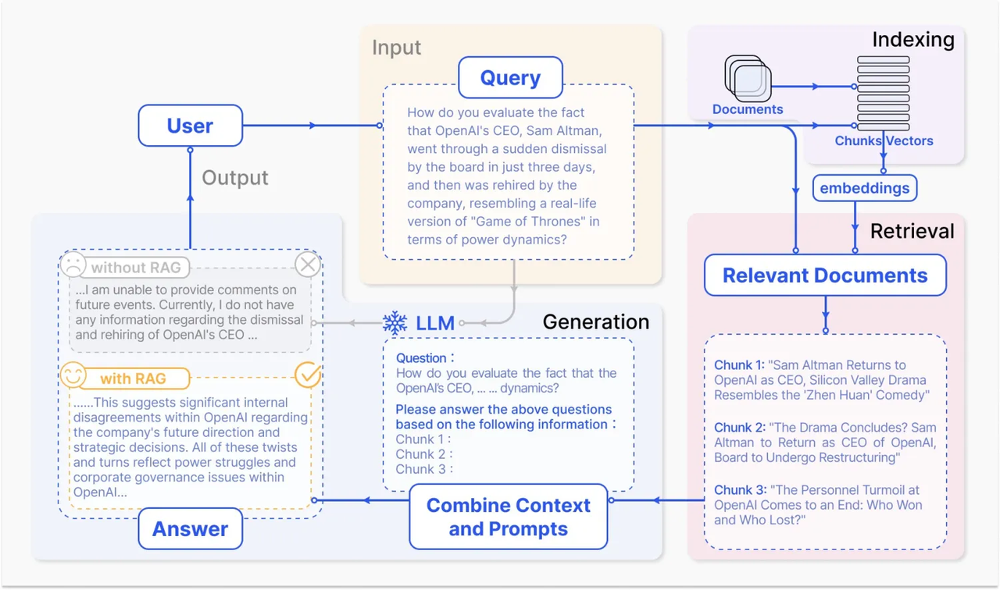

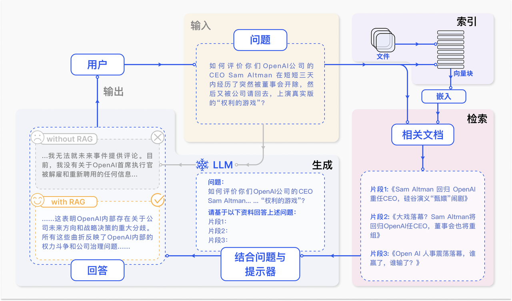

可以看出，它主要包括三个步骤：

1. 索引化（Indexing）
    1. 文档预处理：将原始文档（PDF/网页/数据库等）按语义切分为连贯的文本块（chunk），通常每块包含200-500个token
    2. 向量编码：使用嵌入模型（如BERT、OpenAI Embeddings）将文本块转化为高维向量
    3. 存储优化：向量存入专用数据库（FAISS/Pinecone），建立快速检索索引
2. 检索（Retrieval）
    1. 问题向量化：将用户查询转换为同编码体系的向量
    2. 相似度计算：通过余弦相似度或欧式距离匹配最相关的Top-K文本块（K通常取3-5）
    3. 结果过滤：可选时间范围、来源等元数据过滤提升精度
3. 生成（Generation）
    1. 提示工程：构造包含检索结果的增强提示，例如：

```plain
基于以下上下文回答问题：  
[检索文本1]...[检索文本K]  
问题：{用户提问}  
要求：仅根据上下文回答
```

    2. 条件生成：大模型（如GPT-4）基于增强提示生成最终回复，严格受限于检索内容

我们根据技术架构和功能特性的发展，将RAG的研究范式划分为三个重要阶段

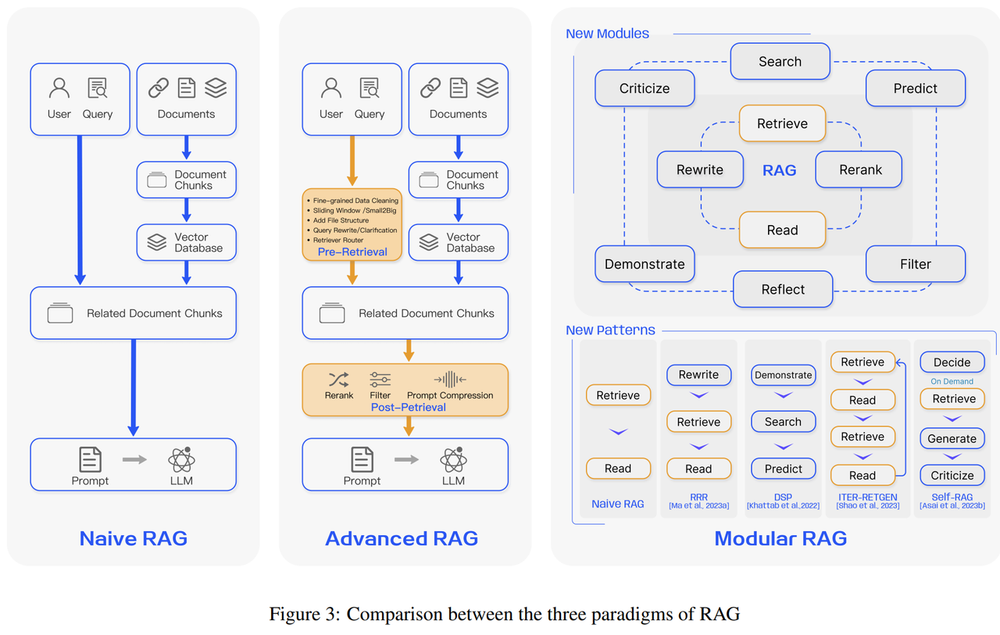

| **<font style="color:rgba(0, 0, 0, 0.9);">演进阶段</font>** | **<font style="color:rgba(0, 0, 0, 0.9);">核心技术特征</font>** | **<font style="color:rgba(0, 0, 0, 0.9);">典型方法/工具</font>** | **<font style="color:rgba(0, 0, 0, 0.9);">主要局限性</font>** | **<font style="color:rgba(0, 0, 0, 0.9);">应用场景</font>** |
| :---: | :---: | :---: | :---: | :---: |
| <font style="color:rgba(0, 0, 0, 0.9);">朴素RAG   </font><font style="color:rgba(0, 0, 0, 0.9);">(Naive RAG)</font> | <font style="color:rgba(0, 0, 0, 0.9);">• 基于关键词/基础向量检索   </font><font style="color:rgba(0, 0, 0, 0.9);">• 固定长度文档分块   </font><font style="color:rgba(0, 0, 0, 0.9);">• 检索结果直接拼接生成</font> | <font style="color:rgba(0, 0, 0, 0.9);">• BM25+GPT   </font><font style="color:rgba(0, 0, 0, 0.9);">• FAISS基础版</font> | <font style="color:rgba(0, 0, 0, 0.9);">• 检索精度低   </font><font style="color:rgba(0, 0, 0, 0.9);">• 生成内容不稳定   </font><font style="color:rgba(0, 0, 0, 0.9);">• 无法处理复杂查询</font> | <font style="color:rgba(0, 0, 0, 0.9);">简单问答   </font><font style="color:rgba(0, 0, 0, 0.9);">文档摘要</font> |
| <font style="color:rgba(0, 0, 0, 0.9);">高级RAG   </font><font style="color:rgba(0, 0, 0, 0.9);">(Advanced RAG)</font> | <font style="color:rgba(0, 0, 0, 0.9);">• 稠密向量语义检索   </font><font style="color:rgba(0, 0, 0, 0.9);">• 动态语义分块   </font><font style="color:rgba(0, 0, 0, 0.9);">• 检索结果重排序   </font><font style="color:rgba(0, 0, 0, 0.9);">• 多跳推理支持</font> | <font style="color:rgba(0, 0, 0, 0.9);">• ColBERT+LLaMA   </font><font style="color:rgba(0, 0, 0, 0.9);">• 混合检索系统（BM25+DPR）</font> | <font style="color:rgba(0, 0, 0, 0.9);">• 计算成本较高   </font><font style="color:rgba(0, 0, 0, 0.9);">• 需要精细调参   </font><font style="color:rgba(0, 0, 0, 0.9);">• 领域迁移性一般</font> | <font style="color:rgba(0, 0, 0, 0.9);">专业咨询   </font><font style="color:rgba(0, 0, 0, 0.9);">法律文书分析</font> |
| <font style="color:rgba(0, 0, 0, 0.9);">模块化RAG   </font><font style="color:rgba(0, 0, 0, 0.9);">(Modular RAG)</font> | <font style="color:rgba(0, 0, 0, 0.9);">• 组件化流水线设计   </font><font style="color:rgba(0, 0, 0, 0.9);">• 可插拔增强模块   </font><font style="color:rgba(0, 0, 0, 0.9);">• 端到端联合优化   </font><font style="color:rgba(0, 0, 0, 0.9);">• 支持自定义知识路由</font> | <font style="color:rgba(0, 0, 0, 0.9);">• LangChain模块   </font><font style="color:rgba(0, 0, 0, 0.9);">• DSPy框架   </font><font style="color:rgba(0, 0, 0, 0.9);">• 自优化RAG系统</font> | <font style="color:rgba(0, 0, 0, 0.9);">• 系统复杂度高   </font><font style="color:rgba(0, 0, 0, 0.9);">• 需要专业知识配置</font> | <font style="color:rgba(0, 0, 0, 0.9);">企业知识中枢   </font><font style="color:rgba(0, 0, 0, 0.9);">AI Agent系统</font> |


# 朴素RAG(Naive RAG)
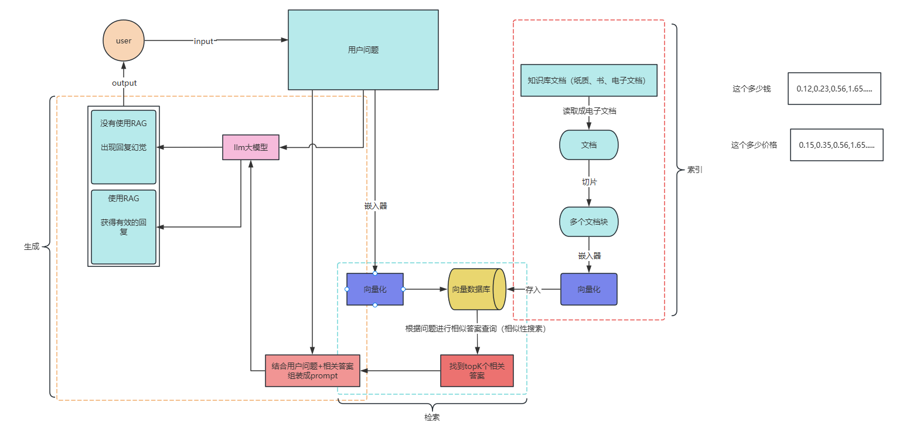

## 知识库构建
### 文档加载与分块
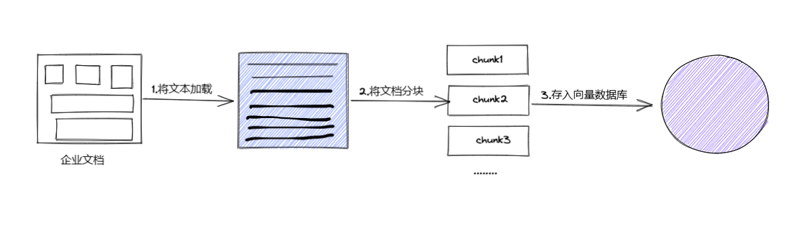

1. **解决上下文窗口限制**
+ 技术现实：即使GPT-4-128K模型也仅能处理约300页文本，而企业知识库常达TB级
+ 案例：某医疗AI系统将《默克诊疗手册》分块为5KB片段后，检索准确率提升37%
1. **优化检索精度**
+ 对比实验：
    - 未分块：检索"心肌梗死急诊PCI指征"时返回整本内科学教材
    - 分块后：精确定位到心血管章节的适应证段落

### 分块策略
+ 按照句子来切分
+ 按照字符数来切分
+ 按固定字符数 结合overlapping window
+ 递归方法 RecursiveCharacterTextSplitter

**按照句子来切分**

```plain
import re


def split_sentences(text: str) -> list:
    """
    基础版句子切分（支持中英文句号、问号、感叹号）
    :param text: 输入文本
    :return: 句子列表
    """
    # 正则表达式匹配句子结尾（中英文标点+换行）
    sentence_endings = r'(?<=[。！？.?!\n])\s*'
    sentences = re.split(sentence_endings, text.strip())
    return [s for s in sentences if s]  # 过滤空字符串


# 测试
text = """2025年2月6日，DeepSeek已暂停API服务充值，按钮显示灰色不可用状态。对此官方声明称，"
        "“当前服务器资源紧张，为避免对您造成业务影响，我们已暂停API服务充值。"
        "同日消息，中国电信、中国移动、中国联通三大运营商相继宣布全面接入DeepSeek。"
        "同日，吉利汽车宣布其自研的星睿大模型与DeepSeek R1大模型已完成深度融合，这是汽车行业首次实现此类深度合作。"""
print(split_sentences(text))
print(len(split_sentences(text)))
```

**按照固定字符数切分**

```plain
def chunk_with_overlap(text: str, chunk_size: int, overlap: int) -> list[str]:
    """
    带重叠的固定字符数切分
    :param text: 输入文本
    :param chunk_size: 每块字符数
    :param overlap: 重叠字符数（需小于chunk_size）
    :return: 分块列表
    """
    if overlap >= chunk_size:
        raise ValueError("重叠量必须小于块大小")

    chunks = []
    # 循环分割字符
    for i in range(0, len(text), overlap):
        chunks.append(text[i:i + chunk_size])
    return chunks


# 示例
text = """2025年2月6日，DeepSeek已暂停API服务充值，按钮显示灰色不可用状态。对此官方声明称，"
        "“当前服务器资源紧张，为避免对您造成业务影响，我们已暂停API服务充值。"
        "同日消息，中国电信、中国移动、中国联通三大运营商相继宣布全面接入DeepSeek。"
        "同日，吉利汽车宣布其自研的星睿大模型与DeepSeek R1大模型已完成深度融合，这是汽车行业首次实现此类深度合作。"""
print(chunk_with_overlap(text, chunk_size=50, overlap=20))
```

**递归方法 RecursiveCharacterTextSplitter**

```plain
from langchain.text_splitter import RecursiveCharacterTextSplitter

text = """
自然语言处理（NLP），作为计算机科学、人工智能与语言学的交融之地，致力于赋予计算机解析和处理人类语言的能力。在这个领域，机器学习发挥着至关重要的作用。利用多样的算法，机器得以分析、领会乃至创造我们所理解的语言。从机器翻译到情感分析，从自动摘要到实体识别，NLP的应用已遍布各个领域。随着深度学习技术的飞速进步，NLP的精确度与效能均实现了巨大飞跃。如今，部分尖端的NLP系统甚至能够处理复杂的语言理解任务，如问答系统、语音识别和对话系统等。NLP的研究推进不仅优化了人机交流，也对提升机器的自主性和智能水平起到了关键作用。
"""
'''
    RecursiveCharacterTextSplitter 是一个用于将文本分割成较小块的工具。
    它特别适用于需要递归地按字符拆分文本的场景，例如处理超长文档或嵌套结构的文本
    chunk_size = 分割长度
    chunk_overlap = 重叠长度
    length_function = 固定写法（用于定义如何计算每个文本片段的长度）
    separators = 设置对应的正则表达式去进行语义分割（默认["\n\n", "\n", " ", ""]）
'''
splitter = RecursiveCharacterTextSplitter(
    chunk_size=50,
    chunk_overlap=10,
    length_function=len,
    separators=[",", "，", "。", "."]
)

chunks = splitter.split_text(text)

for i, chunk in enumerate(chunks):
    print(f"块 {i + 1}: {len(chunk)}: {chunk}")
```

## 向量检索阶段
根据用户的输入，与向量数据库中存放的文本向量进行相似度计算匹配，并检索返回最为相似的内容

### **Embeddings向量化**
#### 向量与Embeddings的含义
在数学领域中，向量（亦称作欧几里得向量或几何向量）是一种同时具备大小（magnitude）与方向属性的量。从直观可视化角度来看，它能够用带箭头的线段来形象呈现 —— 其中箭头的指向明确表征了向量的方向，而线段的长度则精准对应着向量的大小。这种兼具数值特性与空间指向性的数学概念，在几何分析、物理建模等多个学科领域中均扮演着基础且关键的角色。

1. 文本向量化转换：将文本映射为一组浮点数序列，其中每个下标 `i` 唯一对应向量的一个维度，实现文本信息的数值化表达。
2. 高维空间映射：这组浮点数构成的数组，本质上对应着 n 维空间中的一个点，该点即为文本的向量表示（又称 Embeddings），完成从语义到空间坐标的数学转化。
3. 语义相似度度量：通过计算不同文本向量在空间中的距离（如余弦距离、欧氏距离等），可量化文本间的语义关联 —— 距离越近，语义相似度越高，为自然语言处理中的语义分析提供数学基础。

Embedding（嵌入） 是一种通过数值向量来表征对象（Object） 的方法。这里的 “实体对象” 涵盖广泛，既可以是图像（image）、词语（word）等常见数据形态，也可以是任意需要量化描述的事物；而 “数值化表示” 的本质，是将对象转化为一组有序的编码向量。

以 “颜色” 这一实体为例，其经典的 RGB 表征方式 —— 用（R, G, B）三元组向量进行编码 —— 便是 Embedding 的直观体现：三个维度的数值分别对应红、绿、蓝三原色的强度，通过向量形式完成对颜色的精确描述。

从更抽象的视角看，Embedding 可理解为将离散的目标对象映射到连续空间中的特定坐标点。这种映射打破了离散数据的语义隔阂，使原本孤立的对象在高维空间中获得具有相对位置关系的 “坐标”，从而为挖掘对象间的语义关联（如词语的近义词关系、图像的特征相似性等）提供了数学基础。

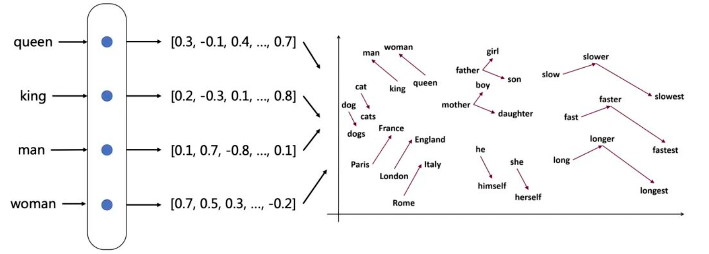

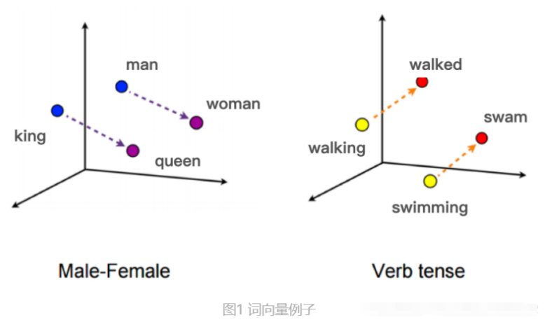

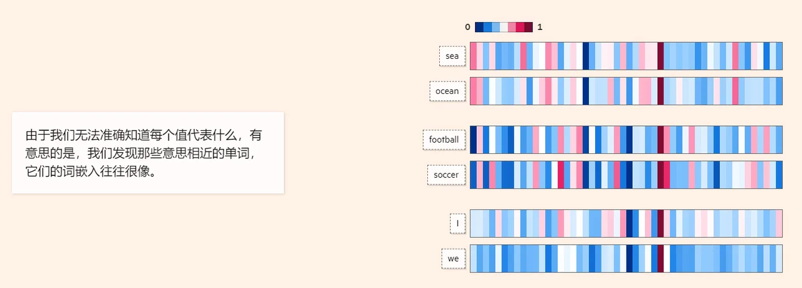

```plain
from openai import OpenAI
from dotenv import load_dotenv
import os

load_dotenv()
client = OpenAI(api_key=os.getenv("DASHSCOPE_API_KEY"), base_url=os.getenv("DASHSCOPE_BASE_URL"))


def get_embeddings(texts, model="text-embedding-v1"):
    #  texts 是一个包含要获取嵌入表示的文本的列表，
    #  model 模型名称
    #  生成文本的嵌入表示。结果存储在data中。
    data = client.embeddings.create(input=texts, model=model).data
    # print(data)
    # 返回了一个包含所有嵌入表示的列表
    return [x.embedding for x in data]


test_query = ["我爱你"]

vec = get_embeddings(test_query)
#  "我爱你" 文本嵌入表示的列表。
print(len(vec))
#  "我爱你" 文本的嵌入表示。
print(vec[0])
#  "我爱你" 文本的嵌入表示的维度。3072
print(len(vec[0]))
```

#### **向量模型本地使用**
+ Huggingface：https://huggingface.co/，国内的镜像地址：https://hf-mirror.com/
+ 魔搭社区：https://www.modelscope.cn/my/overview

```plain
# 安装模块
pip install modelscope
```

```plain
# 模型下载
from modelscope import snapshot_download
model_dir = snapshot_download("BAAI/bge-large-zh-v1.5", cache_dir="D:\llm\Local_model")
```

使用本地的向量模型进行向量化

```python
from sentence_transformers import SentenceTransformer

model_path = "D:\\llm\\Local_model\\BAAI\\bge-large-zh-v1___5"  # 替换为实际路径
model = SentenceTransformer(model_path)

sentences = [
    "Quantum computing uses quantum bits.",
    "Deep learning requires large datasets.",
    "Sentence-Transformers generate embeddings."
]

# 生成向量（默认返回numpy数组）
embeddings = model.encode(sentences)
print(embeddings.shape)  # 输出: (3, 384)  （维度取决于模型）
```

### **向量间的相似度计算 **
在衡量向量间相似度时，常用的计算方法有：

+ 余弦距离（Cosine）：依据两个向量夹角的余弦值来度量相似度。余弦值越趋近于 1，表明两向量方向越相近，相似度越高 。
+ 欧式距离（L2）：通过计算向量在多维空间中的欧几里得距离来衡量相似度。距离值越小，意味着向量间差异越小，相似度越高。
+ 点积：通过计算两个向量的点积来评估相似度，尤其适用于已经归一化处理后的向量，点积结果越大，向量相似度越高。

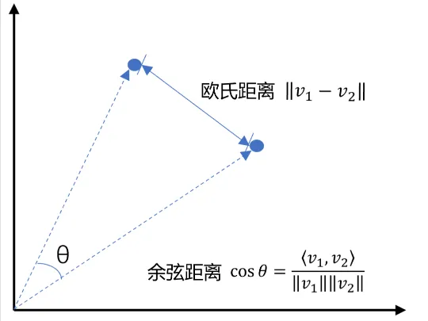

```python
import numpy as np
from numpy import dot
from numpy.linalg import norm
from openai import OpenAI
from dotenv import load_dotenv
import os

load_dotenv()
client = OpenAI(api_key=os.getenv("DASHSCOPE_API_KEY"), base_url=os.getenv("DASHSCOPE_BASE_URL"))


def cosine_similarity(a, b):
    """计算余弦相似度，值越接近1表示越相似"""
    return np.dot(a, b) / (np.linalg.norm(a) * np.linalg.norm(b))


def euclidean_distance(a, b):
    """计算欧氏距离，值越小表示越相似"""
    return np.sqrt(np.sum((np.array(a) - np.array(b)) ** 2))


def get_embeddings(texts, model="text-embedding-v3"):
    #  texts 是一个包含要获取嵌入表示的文本的列表，
    #  model 则是用来指定要使用的模型的名称
    #  生成文本的嵌入表示。结果存储在data中。
    data = client.embeddings.create(input=texts, model=model).data
    # print(data)
    # 返回了一个包含所有嵌入表示的列表
    return [x.embedding for x in data]


# 且能支持跨语言
# query = "global conflicts"
query = "国际新闻"
documents = [
    "世卫组织对刚果（金）埃博拉疫情反弹风险发布紧急预警",
    "韩国、挪威、冰岛启动北极圈联合科考 磋商极地资源开发协议",
    "美国佐治亚州国民警卫队训练基地发生爆炸事故 致2人重伤",
    "国家速滑馆（冰丝带）：即日起开放公众滑冰体验与青少年冰球培训",
    "我国成功完成深海万米着陆器生物基因采样实验",
]

a = get_embeddings([query])[0]

b = get_embeddings(documents)

print("余弦距离:")
print(cosine_similarity(a, a))
for vec in b:
    print(cosine_similarity(a, vec))

print("\n欧式距离:")
print(euclidean_distance(a, a))
for vec in b:
    print(euclidean_distance(a, vec))
```

### 向量数据库
在人工智能时代，向量数据库已成为数据管理与 AI 模型的核心基础设施。这类数据库专为存储和查询向量嵌入数据而设计 —— 这些由 AI 模型生成的数值向量，是识别模式关联、挖掘潜在结构的关键数据载体。

随着 AI 与机器学习应用的深度渗透，模型输出的嵌入数据往往包含成百上千的属性特征，传统数据库在处理高维向量的存储、检索和相似度计算时面临效率瓶颈。而向量数据库通过定制化的索引结构（如 HNSW、LSH 等）和计算优化，能够高效处理百万级甚至十亿级向量的语义检索需求—— 当用户输入一个查询向量时，数据库可快速返回空间距离最近的一组向量，实现 “语义相似性搜索”。

这种专为 AI 工作流设计的数据管理方案，不仅解决了高维数据的存储难题，更通过与大语言模型、计算机视觉模型的深度集成，推动了推荐系统、智能检索、生成式 AI 等场景的工程化落地，成为连接模型训练与实际应用的关键桥梁。

#### Pinecone
Pinecone 是一款面向生成式 AI 场景的全托管向量数据库，具备以下核心能力：

+ 重复数据治理：通过智能算法识别并删除重复向量数据，保障数据集的纯净性与一致性，减少冗余存储；
+ 搜索结果优化：支持实时跟踪数据在搜索结果中的排名，帮助用户分析检索效果，针对性调整搜索策略与索引配置；
+ 灵活数据检索：支持复杂布尔条件与向量相似度的混合查询，可快速定位目标数据；
+ 智能数据分类：基于向量语义特征自动聚类数据，构建层级化数据结构，显著提升检索效率。

#### Milvus
作为开源向量数据库的标杆，Milvus 专为超大规模数据场景设计：

+ 极致性能：基于自研混合索引技术，可实现毫秒级检索万亿级向量数据集，满足高并发实时查询需求；
+ 非结构化数据管理：提供统一接口管理图像、文本、音频等多模态向量数据，简化数据接入流程；
+ 高可用架构：采用分布式存储与计算分离设计，支持集群弹性扩缩容，确保服务始终在线；
+ 混合搜索能力：同时支持向量相似度检索与 SQL 结构化查询，适配复杂业务场景；
+ 统一 Lambda 架构：整合批处理与流处理能力，实现数据的实时更新与离线分析；
+ 社区生态：拥有活跃的开源社区支持，在推荐系统、智能客服等领域积累众多行业落地案例。

#### Chroma
Chroma 以轻量化与高扩展性著称，是开发者快速构建 AI 应用的首选：

+ 功能完备：内置查询、过滤、密度估计等基础功能，覆盖向量数据处理全流程；
+ 生态集成：即将深度集成 LangChain、LlamaIndex 等大模型开发框架，助力 RAG（检索增强生成）场景落地；
+ 无缝部署：同一 API 支持从 Python 本地开发到集群生产环境的平滑过渡，显著降低开发测试成本。

#### Faiss
Facebook AI 推出的 Faiss 是高性能向量检索库，以算法灵活性见长：

+ K 近邻扩展：支持返回第 k 近邻结果，便于分析数据局部特征与分布；
+ 批量处理能力：支持多向量并行检索，大幅提升大规模数据处理效率；
+ 独特度量算法：默认采用最大内积搜索（MIPS），相比传统欧氏距离更适用于高维向量场景；
+ 多度量兼容：支持余弦距离、L2 距离等多种度量方式，满足不同业务需求；
+ 范围搜索：可检索指定半径范围内的所有向量，实现空间区域内的数据筛选；
+ 持久化存储：支持将索引存储至磁盘，突破内存限制，处理超大规模数据集。

#### Qdrant
Qdrant 是一款基于 Rust 开发的高性能向量数据库，专为大规模向量相似度搜索和存储设计，具备以下核心特性与优势：

+ 高效向量检索： 采用混合索引机制（如 HNSW、NSW 等图索引结合量化技术），支持毫秒级检索千万至十亿级向量数据，适用于高并发实时查询场景。
+ 多模态混合搜索： 支持向量相似度检索与结构化数据（如文本、数值、布尔值）的组合查询，可通过 SQL-like 语法或 API 灵活定义检索条件，适配复杂业务逻辑。
+ 分布式架构与高可用性： 原生支持分布式集群部署，通过分片（Sharding）与复制（Replication）机制实现数据冗余与负载均衡，保障服务高可用与横向扩展能力。
+ 灵活的数据存储与管理： 不仅存储向量嵌入，还可关联存储元数据（如文本、标签等），支持数据的增删改查与版本管理，简化非结构化数据与向量的关联存储。
+ 丰富的距离度量与索引策略： 支持余弦相似度、欧氏距离、曼哈顿距离等多种度量方式，并可根据数据特性动态调整索引参数（如索引构建速度与查询效率的平衡）。

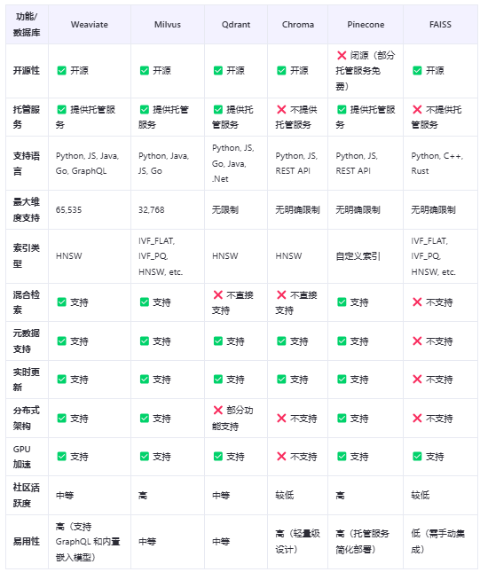

#### 如何选择合适的向量数据库
一、按数据规模与场景选型

| <font style="color:rgb(0, 0, 0);">场景</font> | <font style="color:rgb(0, 0, 0);">数据量</font> | <font style="color:rgb(0, 0, 0);">推荐方案</font> | <font style="color:rgb(0, 0, 0);">优势</font> |
| :--- | :--- | :--- | :--- |
| <font style="color:rgba(0, 0, 0, 0.85);">中小团队原型开发</font> | <font style="color:rgba(0, 0, 0, 0.85);">百万级以下</font> | <font style="color:rgba(0, 0, 0, 0.85);">Chroma</font> | <font style="color:rgba(0, 0, 0, 0.85);">轻量易部署，直接集成 LangChain</font> |
| <font style="color:rgba(0, 0, 0, 0.85);">电商推荐 / 企业知识库</font> | <font style="color:rgba(0, 0, 0, 0.85);">千万 - 十亿级</font> | <font style="color:rgba(0, 0, 0, 0.85);">Milvus/Qdrant</font> | <font style="color:rgba(0, 0, 0, 0.85);">分布式架构，支持混合搜索</font> |
| <font style="color:rgba(0, 0, 0, 0.85);">超大规模生产场景</font> | <font style="color:rgba(0, 0, 0, 0.85);">十亿级以上</font> | <font style="color:rgba(0, 0, 0, 0.85);">Pinecone Cloud</font> | <font style="color:rgba(0, 0, 0, 0.85);">全托管服务，免运维且高可用</font> |


二、核心考量维度速查

1. 性能需求：
    1. 低延迟（毫秒级）：选 Qdrant（Rust 底层）或 Pinecone（全托管）。
    2. 高并发：优先 Milvus/Weaviate 的分布式架构。
2. 技术生态：
    1. 用大模型（如 OpenAI）：Pinecone 原生集成 Embedding 接口。
    2. 开源定制：Milvus/Faiss 支持算法自定义。
3. 成本与运维：
    1. 快速上线：选 Pinecone Cloud（按用量付费，零运维）。
    2. 长期可控：自建 Milvus（初期投入高，适合技术团队）。

三、避坑关键点

+ 高维向量：实测 1536 维向量检索延迟（如 Qdrant 保持毫秒级）。
+ 元数据量：字段超过 50 个时，选支持 SQL 索引的 Milvus。
+ 冷启动：全托管服务（如 Pinecone）重启加载速度远快于自建集群。

四、分阶段演进策略

1. MVP 期：Chroma 本地部署，成本 < 5000 元。
2. 增长期：Qdrant/Milvus 开源版，3 节点集群预算 5-10 万元。
3. 成熟期：亿级数据选 Pinecone Cloud（托管）或 Milvus 分布式（自建）。

总结：先定数据规模与核心场景，再匹配性能、生态与成本，优先通过小范围 POC 验证方案可行性。

#### chroma向量数据库使用
chroma学习：[https://zhuanlan.zhihu.com/p/680661442](https://zhuanlan.zhihu.com/p/680661442)

```plain
# 安装模块
pip install chromadb==0.5.3
```

```plain
import chromadb
from sentence_transformers import SentenceTransformer
from langchain.text_splitter import RecursiveCharacterTextSplitter


# -------------------- 第一步：读取本地txt文件和分块 --------------------
def read_txt_files(file_path):
    """
    读取文件夹内所有txt文件，返回文件名和内容列表
    """

    # 创建递归切片
    splitter = RecursiveCharacterTextSplitter(
        chunk_size=50,
        chunk_overlap=10,
        length_function=len,
    )

    with open(file_path, 'r', encoding='utf-8') as f:
        content = f.read().strip()

    documents = splitter.split_text(content)
    ids = [f"ids{i}" for i in range(len(documents))]
    print(len(ids))
    return ids, documents


# -------------------- 第二步：初始化ChromaDB --------------------
client = chromadb.PersistentClient(path="./chroma_db")

# 使用自定义嵌入模型（比Chroma默认的更灵活）
embed_model = SentenceTransformer('D:\\llm\\Local_model\\BAAI\\bge-large-zh-v1___5')


def my_embed_function(texts):
    return embed_model.encode(texts).tolist()


# 创建集合
collection = client.get_or_create_collection(
    name="txt_documents"
)

# -------------------- 第三步：添加文件内容到数据库 --------------------
file_path = "data/刑法.txt"
ids, documents = read_txt_files(file_path)

# 添加数据（自动向量化）
collection.add(
    embeddings=my_embed_function(documents),
    documents=documents,
    ids=ids,
)

print(f"成功加载 {len(ids)} 个文档到ChromaDB")

# -------------------- 第四步：相似度查询 --------------------
query = "一切危害国家主权、领土完整和安全，分裂国家"
results = collection.query(
    query_embeddings=my_embed_function(query),
    n_results=2,
)
print(results)
print("\n查询:", query)
print("最匹配结果:")
for doc, dist in zip(results['documents'][0],
                     results['distances'][0]):
    print(f"""
  - 内容: {doc}
  - 相似度: {1 - dist:.2f}  # 将距离转换为相似度[0,1]
    """)
```

chroma原理

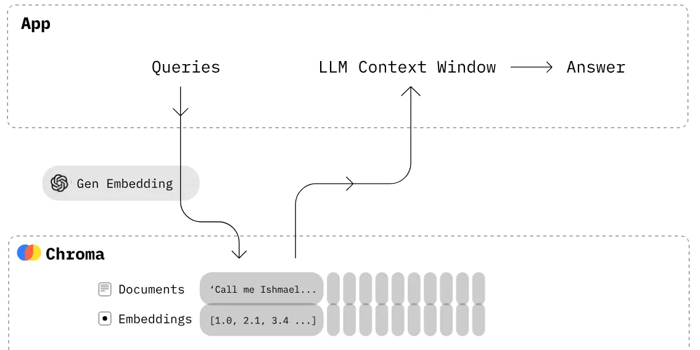

除了使用向量数据库进行语义检索，还可以使用Redis来实现关键词检索。

#### Redis实现检索
https://www.cnblogs.com/ahmao/p/13746094.html

Redis介绍

Redis，英文全称是[<font style="color:rgb(36,91,219);">Remote Dictionary Server</font>](https://zhida.zhihu.com/search?content_id=235651583&content_type=Article&match_order=1&q=Remote+Dictionary+Server&zhida_source=entity)（远程字典服务），是一个开源的使用[<font style="color:rgb(36,91,219);">ANSI C</font>](https://zhida.zhihu.com/search?content_id=235651583&content_type=Article&match_order=1&q=ANSI+C&zhida_source=entity)语言编写、支持网络、可基于内存亦可持久化的日志型、Key-Value数据库，并提供多种语言的API。

与MySQL数据库不同的是，Redis的数据是存在内存中的。它的读写速度非常快，每秒可以处理超过10万次读写操作。因此redis被广泛应用于缓存，另外，Redis也经常用来做分布式锁。除此之外，Redis支持事务、持久化、[<font style="color:rgb(36,91,219);">LUA 脚本</font>](https://zhida.zhihu.com/search?content_id=235651583&content_type=Article&match_order=1&q=LUA+%E8%84%9A%E6%9C%AC&zhida_source=entity)、LRU 驱动事件、多种集群方案。

Redis的基本数据类型

+ String（字符串）
+ Hash（哈希）
+ List（列表）
+ Set（集合）
+ zset（有序集合）

1.安装Redis

从这下载好Redis

https://gitcode.com/open-source-toolkit/4340f/blob/main/redis-windows-7.2.3.zip

2.启动Redis


3.使用python连接Redis

```python
import redis # pip install redis -i https://mirrors.aliyun.com/pypi/simple/       


# 创建 Redis 连接
r = redis.Redis(host='127.0.0.1', port=6379, decode_responses=True)
# 测试
print(r.ping())
```

4.使用Redis作为缓存进行向量检索

```python
from langchain.text_splitter import RecursiveCharacterTextSplitter
import redis
import json


# -------------------- 第一步：读取本地json文件和分块 --------------------
def read_json_files(file_path):
    """
    读取文件夹内所有txt文件，返回文件名和内容列表
    """

    # 创建递归切片
    splitter = RecursiveCharacterTextSplitter(
        chunk_size=50,
        chunk_overlap=10,
        length_function=len,
    )

    with open(file_path, 'r', encoding='utf-8') as file:
        data = json.load(file)

    question = [entry['question'] for entry in data]
    answer = [entry['answer'] for entry in data]
    return question, answer


# -------------------- 第二步：设置redis --------------------

class RedisClient:
    def __init__(self):
        self.r = redis.Redis(host='127.0.0.1', port=6379,  decode_responses=True)

    # 将读取出来的数据存入Redis中
    def add_redis_documents(self, question, answer):
        for q, a in zip(question, answer):
            self.r.set(q, a)

    # 在Redis中根据关键词进行模糊搜索
    def search(self, question, top_n=3):
        keys = self.r.keys(pattern='*' + question + '*')
        data = []
        for key in keys:
            data.append(self.r.get(key))
        return data[:top_n]


if __name__ == '__main__':
    r = RedisClient()
    # 先从文件中读取数据
    file_path = "data/法律.json"
    question, answer = read_json_files(file_path)
    # 在把数据存入到Redis中
    r.add_redis_documents(question, answer)
    # 在Redis中进行检索
    data = r.search('行政')
    print(data)
```

## 在线平台RAG实现
### 阿里云-百炼RAG
地址：[https://bailian.console.aliyun.com/#/home](https://bailian.console.aliyun.com/#/home)

创建应用->上传数据->知识索引

1.新建一个RAG应用

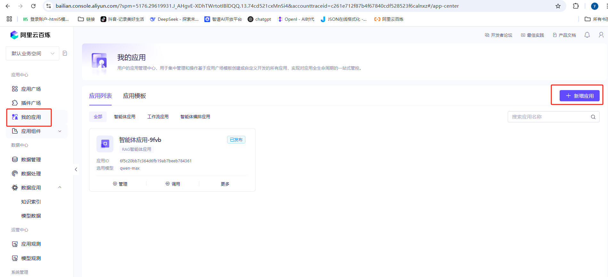

2.选择RAG应用

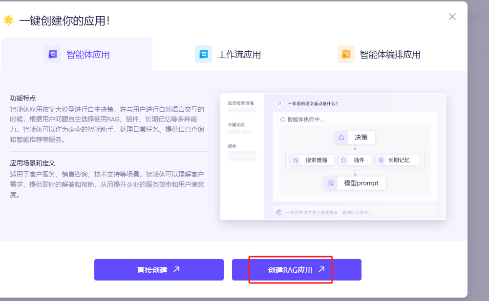

3.创建自己的知识库

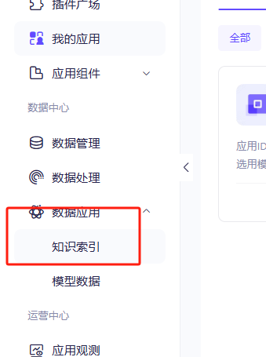


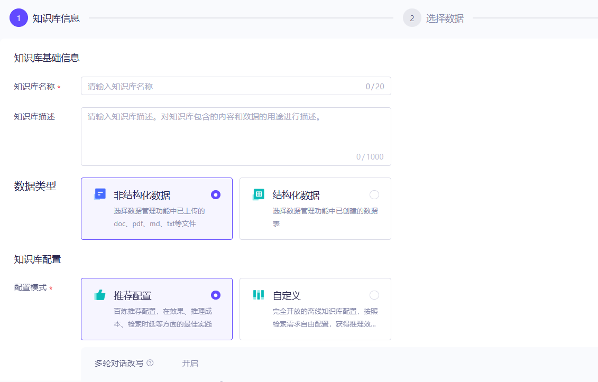


4.添加知识库所需要的文件

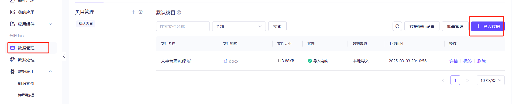

5.在知识库中去对数据进行切片


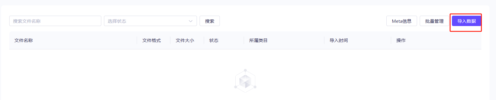

6.选择你自己导入的文件

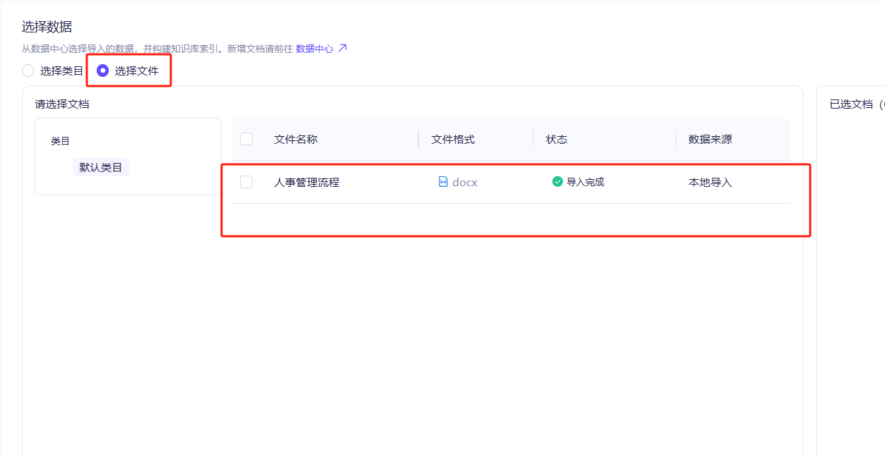

能够看到切片的内容


7.使用千问中的自己创建的应用，可以在本地调用API


```python
import os
from http import HTTPStatus
from dashscope import Application

response = Application.call(
    # 若没有配置环境变量，可用百炼API Key将下行替换为：api_key="sk-xxx"。但不建议在生产环境中直接将API Key硬编码到代码中，以减少API Key泄露风险。
    api_key="sk-2757799f72c64213a2250cf83f04175b",
    app_id='6f5c20bb7c364d6fb19ab7beeb784361',  # 替换为实际的应用 ID
    prompt='公司的请假流程？')

if response.status_code != HTTPStatus.OK:
    print(f'request_id={response.request_id}')
    print(f'code={response.status_code}')
    print(f'message={response.message}')
    print(f'请参考文档：https://help.aliyun.com/zh/model-studio/developer-reference/error-code')
else:
    print(response.output.text)
```

# **实战项目：基于RAG实现智能检索系统**
```plain
# 先下载解析PDF和word的模块
pip install -i https://pypi.tuna.tsinghua.edu.cn/simple python-docx
pip  install -i https://pypi.tuna.tsinghua.edu.cn/simple PyPDF2
```

```plain
import os
import PyPDF2
from docx import Document


class File:
    def __init__(self, filePath: str):
        self.filePath = filePath

    def read_pdf(self):
        """读取PDF文件内容"""
        try:
            with open(self.filePath, 'rb') as file:
                reader = PyPDF2.PdfReader(file)
                text = ""
                for page in reader.pages:
                    text += page.extract_text()
            return text
        except Exception as e:
            print(f"读取PDF失败: {e}")
            return None

    def read_docx(self):
        """读取docx文件内容"""
        try:
            doc = Document(self.filePath)
            text = []
            for para in doc.paragraphs:
                text.append(para.text)
            return "\n".join(text)
        except Exception as e:
            print(f"读取docx失败: {e}")
            return None

    def read_file(self):
        """根据文件扩展名自动选择读取方式"""
        ext = os.path.splitext(self.filePath)[1].lower()
        if ext == '.pdf':
            return self.read_pdf()
        elif ext == '.docx':
            return self.read_docx()
        else:
            print(f"不支持的文件格式: {ext}")
            return None
```

```plain
from dotenv import load_dotenv
from openai import OpenAI
import chromadb
from chromadb.config import Settings
from sentence_transformers import SentenceTransformer
from RAG案例.按照固定字符数来切割 import chunk_with_overlap
from loadFile import File
import os

load_dotenv()
client = OpenAI(api_key=os.getenv("DASHSCOPE_API_KEY"),
                base_url="https://dashscope.aliyuncs.com/compatible-mode/v1")
prompt_template = """
作为问答机器人，你需要依据下方的已知信息回复用户提问。
请严格基于提供的内容作答，禁止虚构信息。
若信息不足，直接回复 “我无法回答您的问题”。

已知信息：
{info}

用户提问：
{query}

请用中文回应。
"""


# 定义llm模型
def llm(prompt, model="qwen-plus-latest"):
    '''封装 千问 接口'''
    messages = [{"role": "user", "content": prompt}]
    response = client.chat.completions.create(
        model=model,
        messages=messages,
        temperature=0,  # 模型输出的随机性，0 表示随机性最小
    )
    return response.choices[0].message.content


# 向量数据库类
class VectorDB:
    def __init__(self, collection_name, embedding):
        # 进行本地存储，并创建chroma连接对象
        client = chromadb.PersistentClient(path="./chroma_db")

        # 创建一个 collection
        self.collection = client.get_or_create_collection(name=collection_name)
        self.embedding = embedding

    def add_documents(self, documents):
        '''向 collection 中添加文档与向量'''
        self.collection.add(
            # 每个文档的向量
            embeddings=self.embedding.encode(documents).tolist(),
            # 文档的原文
            documents=documents,
            # 每个文档的 id
            ids=[f"ids{i}" for i in range(len(documents))]
        )

    def search(self, query, top_k):
        '''检索向量数据库'''
        results = self.collection.query(
            query_embeddings=self.embedding.encode(query).tolist(),
            n_results=top_k
        )
        return results


class RAG:
    def __init__(self, vector_db, llm, top_k=2):
        self.vector_db = vector_db
        self.llm = llm
        self.top_k = top_k

    def chat(self, user_query):
        # 1. 检索
        search_results = self.vector_db.search(user_query, self.top_k)
        print('search_results:', search_results["documents"][0][0])
        # 2. 构建 Prompt
        prompt = prompt_template.format(info=search_results["documents"][0][0], query=user_query)

        print('prompt:', prompt)
        # 3. 调用 LLM
        response = self.llm(prompt)
        return response


if __name__ == '__main__':
    # 使用示例
    file_name = "D:\llm\LLMProject\RAG案例\data\财务管理文档.pdf"
    # 使用自定义嵌入模型（比Chroma默认的更灵活）
    embed_model = SentenceTransformer('D:\\llm\\Local_model\\BAAI\\bge-large-zh-v1___5')
    # 读取文件
    text = File(file_name).read_file()
    # 文本分割
    text_chunk = chunk_with_overlap(text, chunk_size=200, overlap=50)
    # 创建一个向量数据库对象
    vector_db = VectorDB("demo", embed_model)
    # 向向量数据库中添加文档
    vector_db.add_documents(text_chunk)

    # 创建一个RAG对象
    rag = RAG(
        vector_db,
        llm=llm
    )
    user_query = "财务管理权限划分?"
    response = rag.chat(user_query)
    print(response)
```

