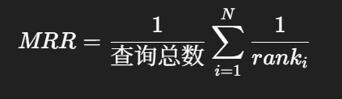
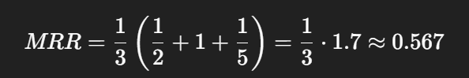
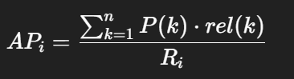
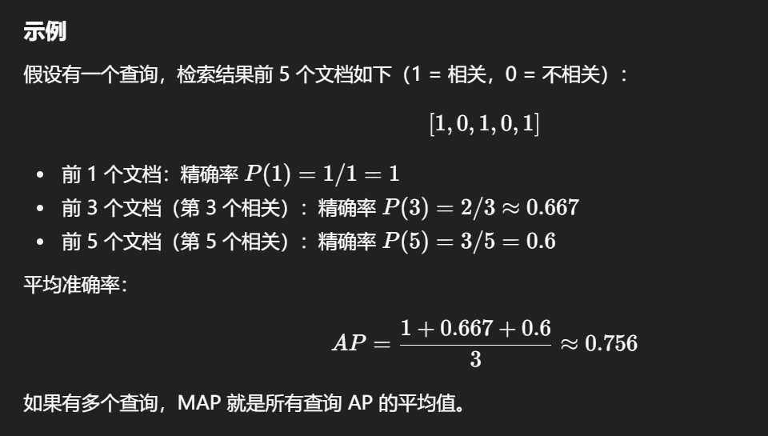
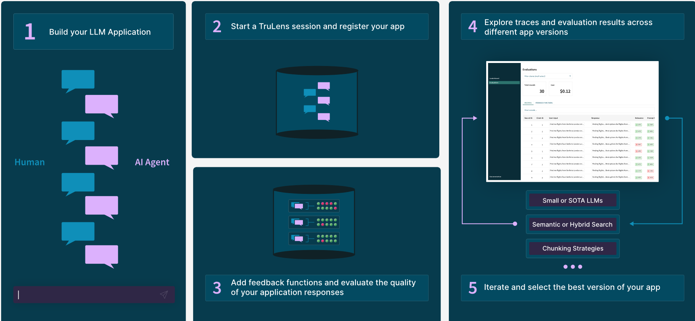
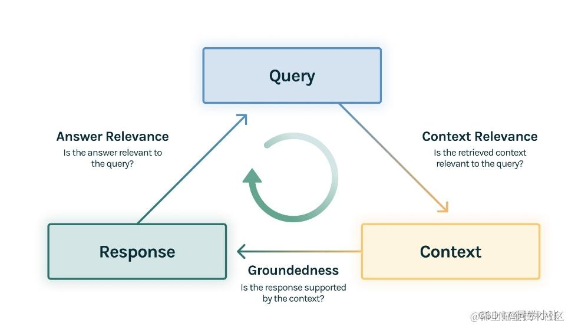
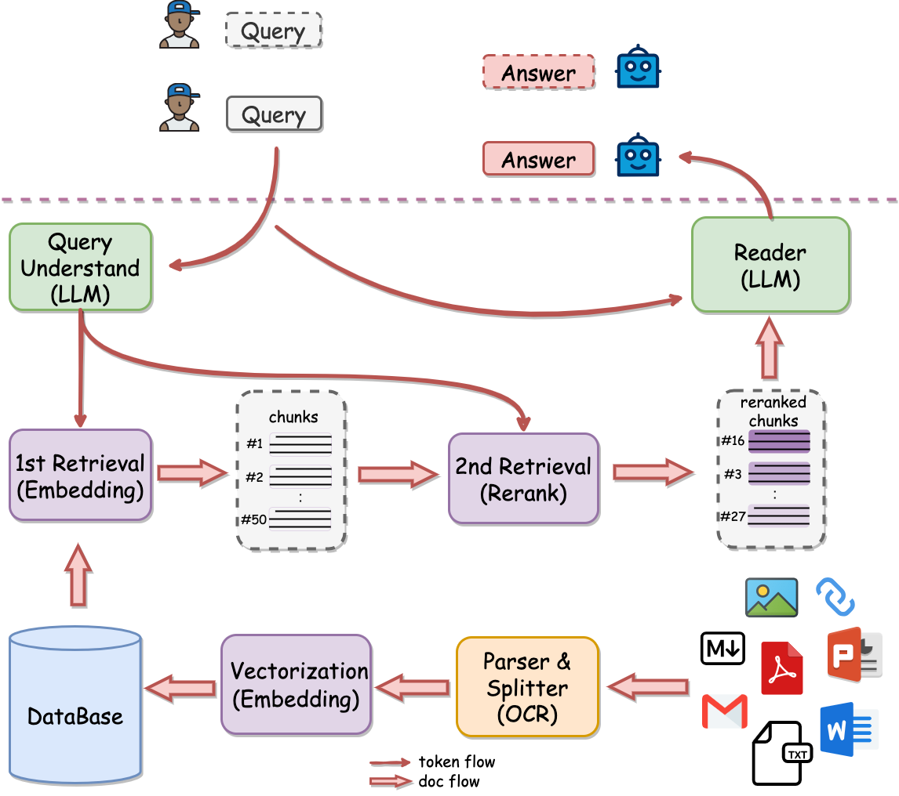
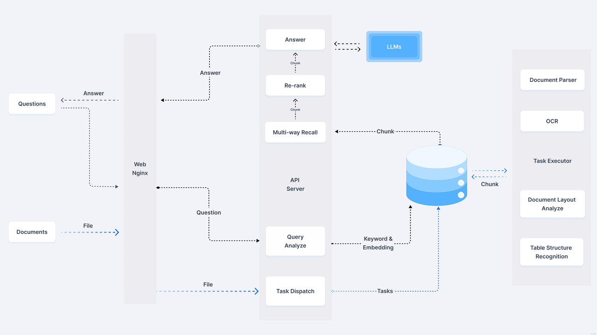
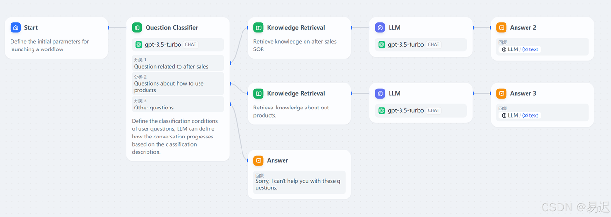
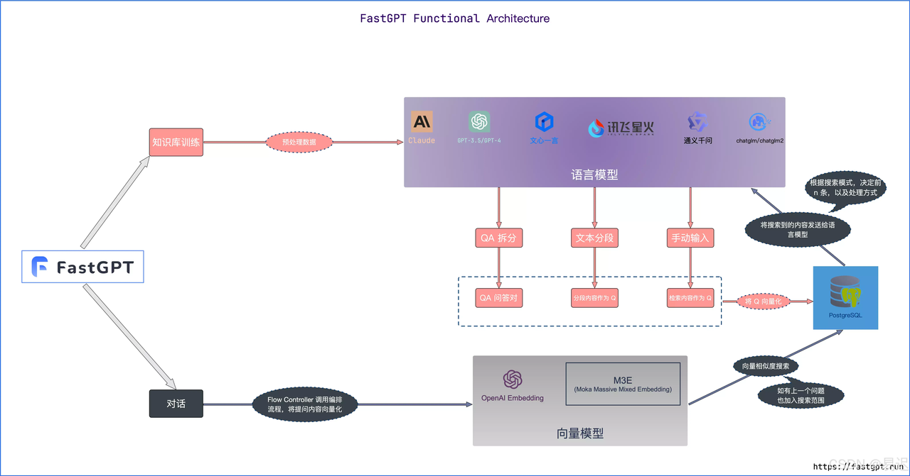

# RAG评估
**RAG 评估**（Retrieval-Augmented Generation Evaluation）是对 **基于检索增强生成模型（RAG）** 的性能进行系统化分析和验证的过程，其核心目标是衡量模型在 **检索** 和 **生成** 两方面的表现。RAG 常用于对话系统、问答系统等场景，其效果高度依赖两个关键组件：

1. **检索器（Retriever）**：需要能够高效、准确地找到与用户查询最相关的文档。
2. **生成器（Generator）**：应基于检索结果生成内容连贯、信息相关且事实准确的回答。

因此，RAG 的评估目标是全面考察系统在 **文档检索的相关性与有效性** 以及 **答案生成的准确性与可读性** 方面的表现。只有对这两个环节进行严格评估，才能确保 RAG 系统在实际部署中具备最佳性能和可靠性。

## 评估指标
在评估 RAG 系统时，通常会从 **检索评估** 和 **响应评估** 两个维度出发：

**1.****检索评估**

检索评估的核心目标是衡量检索结果与用户查询的匹配程度，即 上下文相关性。它旨在确保传递给生成器的文档足够相关且准确，从而为后续的回答生成提供可靠的依据。

+ **上下文相关性**
    - 目标：衡量检索器是否能够从大型数据集中准确找到与用户查询最相关的文档。
    - 常用指标：**精确率（Precision）**、**召回率（Recall）**、**MRR（Mean Reciprocal Rank）**、**MAP（Mean Average Precision）**。

**2. 响应评估**

+ **忠实度（Faithfulness）**
    - 检查生成的回答是否准确、无误，并且确实基于检索到的文档。
    - 评估方式：人工评估、自动化事实核查工具、一致性检查。
+ **答案相关性（Answer Relevance）**
    - 衡量生成的回答是否真正解决了用户的问题、提供了有用的信息。
    - 常用指标：**BLEU、ROUGE、METEOR** 以及 **基于嵌入的相似度评估**。

**3. 其他指标（补充了解）**

+ **噪声鲁棒性**：在包含干扰或无关文档时，系统是否仍能保持稳定表现。
+ **负面拒绝**：在无法回答的问题上，系统是否能够合理拒答，而不是产生错误答案。
+ **信息整合**：能否将多个检索文档中的信息正确整合到答案中。
+ **反事实鲁棒性**：在面对误导性或虚假输入时，系统是否能避免生成错误答案。

### 检索评估
**检索评估的核心目标**是衡量检索结果与用户查询的匹配程度，即 **上下文相关性**。它旨在确保传递给生成器的文档足够相关且准确，从而为后续的回答生成提供可靠的依据。

#### **精确率（Precision）**
$$精确率（Precision）=\frac{检索到的相关文档数}{检索到的文档总数}$$

精确率评估的是：**“在系统检索到的所有文档中，有多少是真正相关的？”**

**例如，检索器返回10个文档，其中5个事相关的，那么精确率就是0.5。**

#### **召回率（Recall）**
   $$召回率（Recall）=\frac{检索到的相关文档数}{所有相关文档总数}$$

**召回率**衡量系统从数据库中成功检索到相关文档的比例。它回答的问题是：

**“数据库中存在的所有相关文档中，系统找到了多少？”**

例如，如果知识库中有 20 个相关文档，而系统检索出了其中 15 个，那么召回率就是 15/20=0.7515/20 = 0.7515/20=0.75 或 75%。

#### 平均倒数排名（MRR, Mean Reciprocal Rank）


+ $$rank_i$$ = 第 iii 个查询第一个相关文档在检索结果中的位置（从 1 开始计数）
+ N = 查询总数

MRR 值范围：0 ~ 1，越接近 1 表示第一个相关文档排名越靠前，用户越容易快速找到答案。

适用场景：搜索引擎、问答系统、RAG 系统等，关注用户 **快速获取正确答案** 的体验。

### **示例**
假设有 3 个查询：

1. 第 1 个查询第一个相关文档在第 2 位 → 倒数 = 1/2
2. 第 2 个查询第一个相关文档在第 1 位 → 倒数 = 1/1
3. 第 3 个查询第一个相关文档在第 5 位 → 倒数 = 1/5



MRR 值范围：0 ~ 1，越接近 1 表示第一个相关文档排名越靠前，用户越容易快速找到答案。

适用场景：搜索引擎、问答系统、RAG 系统等，关注用户 **快速获取正确答案** 的体验。

#### 平均准确率（MAP, Mean Average Precision）


+ P(k)= 前 k 个检索结果的精确率
+ rel(k) = 第 k 个文档是否相关（相关 = 1，不相关 = 0）
+ $$R_i$$ = 第 iii 个查询的相关文档总数

MAP 衡量检索系统在多个查询上的整体排序表现，综合考虑所有相关文档的精确率，关注检索结果的整体质量，而不仅仅是第一个相关文档。



MAP 值范围：0 ~ 1，越高表示检索系统整体上越能把相关文档排在前面。

适用场景：RAG 系统、搜索引擎、问答系统等，需要衡量**整体检索效果**而不仅仅是第一个相关文档。

#### F1分数
$$F1=2\times \frac{精确率\times召回率}{精确率+召回率}$$

假设检索结果如下：

+ 精确率 = 0.7（检索到的文档中 70% 相关）
+ 召回率 = 0.5（数据库中 50% 的相关文档被检索到）

则 F1 分数为：

$$F1=2\times \frac{0.7\times0.5}{0.7+0.5}=2\times\frac{0.35}{1.2}\approx0.583$$

+ F1 值范围：0 ~ 1，越接近 1 表示系统在精确率和召回率上表现越平衡。
+ 适用场景：当你希望系统既**准确**又**全面**，比如 RAG 检索器、问答系统、医学或法律文档检索等场景。

### 响应评估
****响应评估（Response Evaluation）**专注于系统的生成模块，用于衡量模型在 利用检索到的文档上下文生成准确、连贯且有信息量的响应 方面的能力。**

#### 忠实度
忠诚度衡量 **模型生成的回答与检索到的文档内容是否一致**。也就是回答有没有“捏造”信息或者偏离原始文档。

+ 高忠诚度：回答严格基于检索到的上下文，不编造信息。
+ 低忠诚度：回答虽然流畅，但加入了模型自己“猜测”的信息，可能和事实不符。

#### 答案相关性
答案相关性衡量 **模型的回答是否解答了用户的问题**，不一定严格依赖检索到的文档内容。

+ 高相关性：回答紧扣问题核心，用户得到想要的信息。
+ 低相关性：回答偏题或者没有直接回应问题。

## RAG 评估方法
### 人工评估
人工评估是 RAG 系统质量评估的基础方法。通过邀请专家或评估员对生成结果进行打分，通常关注以下指标：

+ **准确性**：回答是否正确、忠于事实或文档内容
+ **连贯性**：语言表达是否流畅、逻辑是否清晰
+ **相关性**：回答是否切题、解决用户问题

**优点**：能够提供高质量、细致的反馈。 **缺点**：耗时耗力，受评估员主观因素和经验差异影响较大。

### 自动化评估
自动化评估是当前 RAG 系统评估的主流方向。通过使用大型语言模型或专门的算法工具，可以对生成文本进行快速质量评分。

**优点**：

+ 提高评估效率
+ 降低人力成本
+ 支持大规模、重复性评估

**缺点**：对模型判断依赖一定的算法或预训练模型，可能存在偏差，需要与人工评估结合验证。

## 常用的评估工具介绍
目前开源社区提供了多种 RAG 评估工具，方便用户进行定量分析和性能对比。这些工具通常具备以下特点：

+ 支持自动化评分和指标计算
+ 能够处理大规模生成文本
+ 可扩展性强，适合不同任务场景

### Ragas
**RAGAs** 是一个用于评测 **检索增强生成（RAG, Retrieval-Augmented Generation）** 系统的开源框架。它提供一套 **统一、量化的评测方法和指标**，用于评估 RAG 管道中各个组件的性能。

RAGAs 特别适合同时包含 **检索（Retrieval）** 和 **生成（Generation）** 两个核心模块的系统，并支持 **LangChain** 和 **LlamaIndex**。

开源链接：[https://github.com/explodinggradients/ragas](https://github.com/explodinggradients/ragas) 官网：https://docs.ragas.io/en/latest/concepts/metrics/index.html

为了评测 RAG 系统，RAGAs 需要以下信息：

+ **question**：用户输入的问题。
+ **answer**：RAG 系统生成的答案（由 LLM 输出）。
+ **contexts**：根据问题检索到的相关文档或上下文信息。
+ **ground_truths**：人工提供的标准答案，是唯一需要人工标注的数据。

RAGAs 提供 **四个核心评估指标**，用于衡量 RAG 系统在检索和生成两个环节的表现：

**1. 检索质量评估**

+ **context_relevancy（上下文相关性 / context_precision）**：衡量检索到的文档与问题的匹配程度。
+ **context_recall（召回率）**：衡量检索内容覆盖正确答案的程度，值越高表示检索出的文档越完整、相关。

**2. 生成质量评估**

+ **faithfulness（忠实性）**：衡量生成答案在多大程度上依赖检索到的文档，值越高表示答案越“基于事实”。
+ **answer_relevancy（答案相关性）**：衡量生成答案与问题本身的相关性和准确性。

### Trulens
**TruLens** 是一个帮助你“看懂”AI的工具。它能分析你的 AI 或聊天机器人（基于大型语言模型）表现如何，比如回答是否相关、有用，或者是否有潜在风险。

TruLens 可以直接和 **LangChain**、**LlamaIndex** 等开发工具配合使用，让开发者快速发现问题并改进 AI 的表现。相比人工评估，它更快、更方便，也更容易扩展。

+ **开源地址**：[https://github.com/truera/trulens](https://github.com/truera/trulens)



#### TruLens 使用步骤
1. **创建 LLM 应用** 开发或准备你的大型语言模型应用。
2. **连接 TruLens** 将 LLM 应用与 TruLens 集成，记录运行日志并上传。
3. **添加反馈函数（Feedback Functions）** 在日志中配置反馈函数，对模型输出进行自动评估，包括相关性、适用性、有害性等指标。
4. **可视化分析** 在 TruLens 看板中查看日志、评估结果和性能指标。
5. **迭代优化** 根据评估结果调整和优化 LLM 应用，选择最优版本进行部署。

**三个评估指标**

+ 上下文相关性（context relevance）：衡量用户提问与查询到的参考上下文之间的相关性
+ 忠实性（groundedness ）：衡量大模型生成的回复有多少是来自于参考上下文中的内容
+ 答案相关性（answer relevance）：衡量用户提问与大模型回复之间的相关性



## RAGAS评估案例：
```plain
import os
from dotenv import load_dotenv
from langchain_huggingface import HuggingFaceEmbeddings
from langchain_community.document_loaders import WebBaseLoader
from langchain.text_splitter import RecursiveCharacterTextSplitter
from langchain.retrievers import ParentDocumentRetriever
from langchain.storage import InMemoryStore
from langchain_chroma import Chroma
from langchain.prompts import ChatPromptTemplate
from langchain.schema.runnable import RunnableMap
from langchain.schema.output_parser import StrOutputParser
from langchain_openai import ChatOpenAI

load_dotenv()

# 创建BAAI的embedding
embedding_model = 'D:\\llm\\Local_model\\BAAI\\bge-large-zh-v1___5'
bge_embeddings = HuggingFaceEmbeddings(model_name=embedding_model)
urls = "https://baike.baidu.com/item/%E6%81%90%E9%BE%99/139019"
loader = WebBaseLoader(urls)
docs = loader.load()

# 创建主文档分割器
parent_splitter = RecursiveCharacterTextSplitter(chunk_size=1000)

# 创建子文档分割器
child_splitter = RecursiveCharacterTextSplitter(chunk_size=400)

# 创建向量数据库对象
vectorstore = Chroma(
    collection_name="split_parents", embedding_function=bge_embeddings
)
# 创建内存存储对象
store = InMemoryStore()
# 创建父文档检索器
retriever = ParentDocumentRetriever(
    vectorstore=vectorstore,
    docstore=store,
    child_splitter=child_splitter,
    parent_splitter=parent_splitter,
    #     verbose=True,
    search_kwargs={"k": 2}
)

# 添加文档集
retriever.add_documents(docs)

chat = ChatOpenAI(api_key=os.getenv("DASHSCOPE_API_KEY"),
                  base_url="https://dashscope.aliyuncs.com/compatible-mode/v1",
                  model='qwen-plus-2025-04-28',
                  temperature=0)

# 创建prompt模板
template = """你是负责回答问题的助手。使用以下检索到的上下文片段来回答问题。
如果你不知道答案，就说你不知道。最多用两句话，回答要简明扼要。
Question: {question} 
Context: {context} 
Answer:
"""

# 由模板生成prompt
prompt = ChatPromptTemplate.from_template(template)

# 创建chain
chain = RunnableMap({
    "context": lambda x: retriever.invoke(x["question"]),
    "question": lambda x: x["question"]
}) | prompt | chat | StrOutputParser()

from datasets import Dataset

# 问题
questions = ["恐龙是怎么被命名的？",
             "恐龙怎么分类的？",
             "体型最大的是哪种恐龙?",
             "体型最长的是哪种恐龙？它在哪里被发现？",
             "恐龙采样什么样的方式繁殖？",
             "恐龙是冷血动物吗？",
             "陨石撞击是导致恐龙灭绝的原因吗？",
             "恐龙是在什么时候灭绝的？",
             "鳄鱼是恐龙的近亲吗？",
             "恐龙在英语中叫什么？"
             ]
# 真实答案
ground_truths = [
    "1841年，英国科学家理查德·欧文在研究几块样子像蜥蜴骨头化石时，认为它们是某种史前动物留下来的，并命名为恐龙，意思是“恐怖的蜥蜴”。",
    "恐龙可分为鸟类和非鸟恐龙。",
    "恐龙整体而言的体型很大。以恐龙作为标准来看，蜥脚下目是其中的巨无霸。",
    "最长的恐龙是27米长的梁龙，是在1907年发现于美国怀俄明州。",
    "恐龙采样产卵、孵蛋的方式繁殖。",
    "恐龙是介于冷血和温血之间的动物",
    "科学家最新研究显示，0.65亿年前小行星碰撞地球时间或早或晚都可能不会导致恐龙灭绝，真实灭绝原因是当时恐龙处于较脆弱的生态系统中，环境剧变易导致灭绝。",
    "恐龙灭绝的时间是在距今约6500万年前，地质年代为中生代白垩纪末或新生代第三纪初。",
    "鳄鱼是另一群恐龙的现代近亲，但两者关系较非鸟恐龙与鸟类远。",
    "1842年，英国古生物学家理查德·欧文创建了“dinosaur”这一名词。英文的dinosaur来自希腊文deinos（恐怖的）Saurosc（蜥蜴或爬行动物）。"
    "对当时的欧文来说，这“恐怖的蜥蜴”或“恐怖的爬行动物”是指大的灭绝的爬行动物（实则不是）"
]
# 模型回答
answers = []
# 文档内容
contexts = []

# Inference
for query in questions:
    answers.append(chain.invoke({"question": query}))
    contexts.append([docs.page_content for docs in retriever.invoke(query)])
print("question", questions)
print("answer", answers)
print("contexts", contexts)
print("ground_truth", ground_truths)
# To dict
data_samples = {
    "question": questions,
    "answer": answers,
    "contexts": contexts,
    "ground_truth": ground_truths
}

# Convert dict to dataset
dataset = Dataset.from_dict(data_samples)

from ragas import evaluate
from ragas.metrics import (
    faithfulness,
    answer_relevancy,
    context_recall,
    context_precision,
)

'''
    与评估Retrieval 检索器相关的指标如下:
        - Context Precision  question和contexts   问题和检索到的文档
        - Context Recall。    ground truth和contexts 真实答案和检索到的文档
    与评估Generation 答案相关的指标如下:
        - Faithfulness。     answer和contexts     回答和检索到的文档
        - Answer Relevancy。 answer和question     回答和问题
'''
result = evaluate(
    dataset,
    metrics=[
        context_precision,
        context_recall,
        faithfulness,
        answer_relevancy,
    ],
    llm=chat,
    embeddings=bge_embeddings
)
result.upload()
# df = result.to_pandas()
# print(df)
```

# RAG应用项目介绍
在当今人工智能领域，大型语言模型（LLM）已成为开发者和企业构建智能应用的核心工具。本文将对比四个知名平台：**Dify、FastGPT、RagFlow** 和 **QAnything**，帮助用户了解它们的功能、优势及适用场景。

## QAnything 
**QAnything**（Question and Answer based on Anything）是一款开源的本地知识库 RAG 问答系统。它支持用户上传多种格式的文档来构建知识库，并采用**两阶段检索机制**和**混合检索技术**，显著提升了信息检索的效率与准确性。



**QAnything 技术亮点**

1. **强化 Rerank 环节**
    1. 将 Rerank 作为第二阶段检索（2nd Retrieval），显著提升检索精度。
2. **SOTA 模型组合**
    1. 向量检索：`bce-embedding-base_v1`
    2. 向量排序：`bce-reranker-base_v1`
    3. 这一组合被官方认定为最先进方案。
3. **架构设计验证**
    1. 架构图与文档一致，Rerank 是核心模块，体现了有道对 RAG 的独到理解。
+ **源码**：[GitHub](https://github.com/netease-youdao/QAnything/)
+ **官网**：[QAnything 官方网站](https://qanything.ai/)

## RagFlow
RAGFlow 是一个开源工具，可以让 AI 更聪明地理解和利用文档信息。当它与大型语言模型结合时，能够基于知识库里的各种复杂数据，为用户提供**准确可靠、幻觉少**的答案。

核心亮点：

1. **深度文档理解**：能从复杂、非结构化的数据中提取关键信息。
2. **检索增强生成**：结合知识库，生成更可信的回答。
3. **先进技术支撑**：应用生成模型和注意力机制提升理解与生成能力。

简而言之，RAGFlow 就像一个“超级文档助手”，帮助 AI 更好地理解信息并给出可靠答案。

首先依旧可以先从框架图入手，与常规的 RAG 架构 进行一些比较



可以看到，右侧的知识库板块被显著放大，同时最右侧详细介绍了文件解析的各种技术手段，例如 OCR（光学字符识别）、Document Layout Analysis（文档布局分析）等。这些技术在常规的 RAG（检索增强生成）流程中，往往仅作为一个不起眼的“Unstructured Loader”被一笔带过。由此可以推测，RagFlow 的一项核心能力，正是体现在其对复杂文件解析环节的深度优化与强化。

在官方文档中，RAGFlow 反复强调 “Quality in, quality out”，体现出其核心设计理念在于通过精细化的文档解析提升结果质量，这也正是其与众不同之处。

同时，介绍文章中还提到，RAGFlow 并未依赖任何现成的 RAG 中间件，而是选择从头自主研发了一整套智能文档理解系统，并基于此构建出完整的 RAG 任务编排架构。这一点进一步印证，深度、精准的文档解析能力正是 RagFlow 的关键优势与显著亮点。

源码地址：https://github.com/infiniflow/ragflow

官方网址：https://ragflow.io/

## Dify
Dify 作为一款开源大模型应用开发平台，其技术架构围绕高效构建与部署 LLM 应用展开，具备以下核心技术特性：

**多模型统一支持与智能路由**

+ 集成数百个主流大语言模型（包括 GPT、Claude、Llama 及开源模型），提供标准化 API 接口。
+ 支持智能路由与故障转移，可自动选择最优模型或备用模型，保障服务高可用。

**可视化 Prompt 编排与调试**

+ 提供低代码 Prompt 设计界面，支持变量注入、条件分支与多轮对话结构。
+ 内置实时响应预览与效果评测工具，帮助开发者迭代优化提示词策略。

**高质量 RAG 引擎**

+ 支持复杂文档解析（包括表格、PDF、OCR 图像处理），结合布局分析（Document Layout Analysis）提取结构化文本。
+ 采用多路召回 + 重排序架构，融合语义与关键词检索，提升检索精度。
+ 支持动态上下文窗口调整与段落粒度切片，减少噪声输入。

**稳健的 Agent 框架**

+ 内置工具调用（Function Calling）与规划决策模块，可灵活接入自定义 API、数据库查询及外部工具。
+ 支持 ReAct 推理模式与多代理协作流程，适应复杂任务自动分解与执行。

**灵活的工作流编排**

+ 提供图形化流程设计器，支持拖拽组合 RAG、模型调用、代码执行、条件判断等节点。
+ 允许闭环数据处理与人工审核介入，适合构建审核、合规类关键应用。

**企业级部署与扩展**

+ 支持容器化部署（Docker & Kubernetes），提供水平扩展与负载均衡能力。
+ 具备项目级权限隔离、审计日志和 SSO 集成，满足企业安全与协作需求。



Dify源码地址：[https://github.com/langgenius/dify](https://link.zhihu.com/?target=https%3A//github.com/langgenius/dify)

中文文档：[https://docs.dify.ai/v/zh-hans](https://link.zhihu.com/?target=https%3A//docs.dify.ai/v/zh-hans)

## FastGPT
**FastGPT **是一款基于大语言模型（LLM）构建的企业级知识库问答系统。它集成了数据处理、多模型调用、RAG 检索增强生成和可视化工作流编排等核心能力，使用户能够快速构建面向生产环境的复杂 AI 应用。系统不仅支持多轮对话，还能有效处理实时数据流和企业内部知识库，显著提升了问答系统的准确性和实用性。

与传统 RAG 系统相比，FastGPT 的关键增强在于引入了可灵活编排的工作流机制，这一特性与 Dify 平台类似，但在第三方工具和生态集成方面目前相对有限。接下来，我们将首先通过架构图来分析其系统设计：



从这张架构图可以看出，与常规 RAG 系统相比，一个显著的特征是大模型模块在流程中的比重被明显放大，尤其在文件入库阶段就引入了大模型调用。从输出结果来看，数据输入主要分为三种路径：QA 拆分、文本分段和手动输入。

+ 文本分段：采用常规 RAG 处理方式，对原始文本进行切块与向量化；
+ QA 拆分：借助大模型能力，从原始文本自动生成问答对，该处理方式与 Dify 中的“Q&A 生成模式”类似，用于构建高质量问答型语料；
+ 手动输入：支持直接录入问答对，可用于重要知识补充或模型生成结果的校准。

可以推测，文件入库环节调用大模型的核心作用，正是实现基于生成式的 QA 拆分，以提升知识库的查询匹配准确率和答案生成质量。

源码地址：https://github.com/labring/FastGPT

官方文档：https://doc.tryfastgpt.ai/docs/

## RAG 能力比较
| <font style="color:#1f2329;">维度</font> | <font style="color:#1f2329;">QAnything</font> | <font style="color:#1f2329;">RagFlow</font> | <font style="color:#1f2329;">Dify</font> | <font style="color:#1f2329;">FastGPT</font> |
| --- | --- | --- | --- | --- |
| <font style="color:#1f2329;">文档解析</font> | <font style="color:#1f2329;">强。内置一流 OCR（支持 handwritten），格式支持广。</font> | <font style="color:#1f2329;">极强（核心卖点）。深度融合 NLP 技术，支持 OCR、版面分析（Layout Analysis）、表格重建、公式提取等，解析粒度极细。</font> | <font style="color:#1f2329;">中。依赖 Unstructured 等开源库，能力通用，但深度和精度不如专业工具。</font> | <font style="color:#1f2329;">中。具备常规解析能力，能满足大部分场景。</font> |
| <font style="color:#1f2329;">RAG 能力</font> | <font style="color:#1f2329;">强。向量检索 + 全文检索的多路召回，重排序。</font> | <font style="color:#1f2329;">极强。多路召回、重排序、上下文动态切片，整个流程为精准检索深度优化。</font> | <font style="color:#1f2329;">强。提供完整的 RAG 组件（检索、重排序等），可无缝嵌入工作流中，灵活但精度非其唯一焦点。</font> | <font style="color:#1f2329;">强。提供标准且高效的 RAG 流程，结合工作流可实现复杂逻辑。</font> |
| <font style="color:#1f2329;">工作流/编排</font> | <font style="color:#1f2329;">弱。专注于问答本身，无可视化编排。</font> | <font style="color:#1f2329;">中。具备 “RAG 流水线” 概念，可配置解析、检索等环节，但非通用工作流。</font> | <font style="color:#1f2329;">极强（核心卖点）。提供强大的可视化工作流编排，可组合 RAG、代码执行、条件判断、多模型调用等，构建复杂应用。</font> | <font style="color:#1f2329;">强。提供了类似 Dify 的可视化工作流编排能力，是其区别于普通知识库的关键。</font> |
| <font style="color:#1f2329;">Agent 能力</font> | <font style="color:#1f2329;">无</font> | <font style="color:#1f2329;">无</font> | <font style="color:#1f2329;">强。内置成熟的 Agent（工具调用、ReAct）框架，可便捷接入外部工具和 API。</font> | <font style="color:#1f2329;">弱。主要通过工作流模拟部分 Agent 逻辑，非原生 Agent 框架。</font> |
| <font style="color:#1f2329;">模型支持</font> | <font style="color:#1f2329;">主要支持本地模型（Qwen等）和 OpenAI API。</font> | <font style="color:#1f2329;">支持主流 API 和本地模型。</font> | <font style="color:#1f2329;">极丰富。支持几乎所有主流云模型和本地模型，堪称最全。</font> | <font style="color:#1f2329;">支持主流 API 和本地模型（通过 One API 等）。</font> |
| <font style="color:#1f2329;">部署方式</font> | <font style="color:#1f2329;">极致本地化。支持 Docker 一键部署，完全离线。</font> | <font style="color:#1f2329;">支持 Docker 部署，可本地化。</font> | <font style="color:#1f2329;">云原生设计，支持 Docker 和 Kubernetes，更偏向云上部署。</font> | <font style="color:#1f2329;">支持 Docker compose 一键部署，简单方便。</font> |
| <font style="color:#1f2329;">生态与集成</font> | <font style="color:#1f2329;">较弱，聚焦核心功能。</font> | <font style="color:#1f2329;">较弱，聚焦 RAG 流水线。</font> | <font style="color:#1f2329;">极强。提供 API、插件市场、Webhook，易于集成和二次开发。</font> | <font style="color:#1f2329;">中等，提供 API，易于对接其他系统。</font> |


