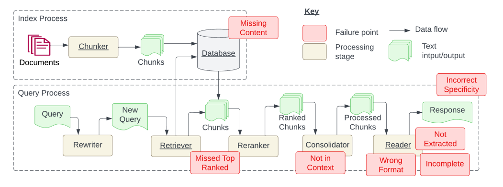
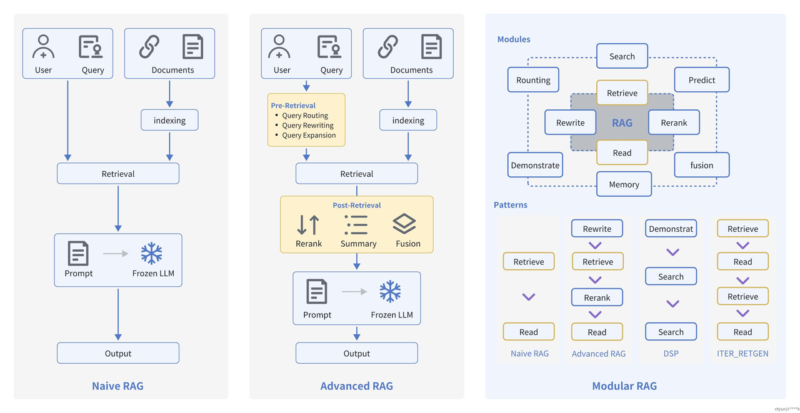
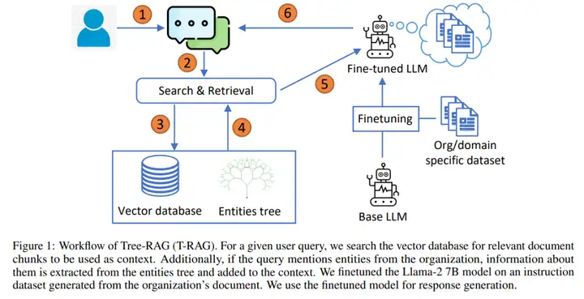
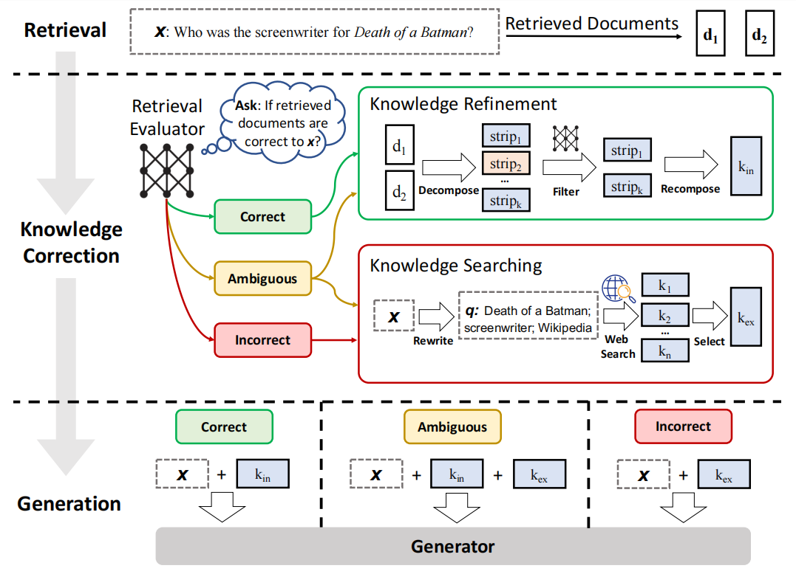
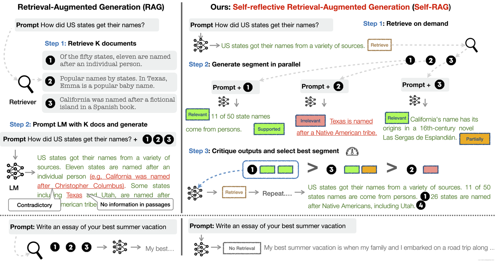
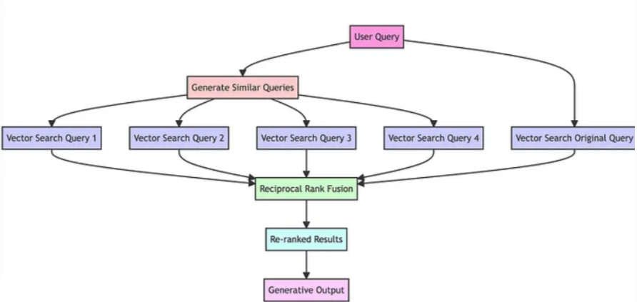
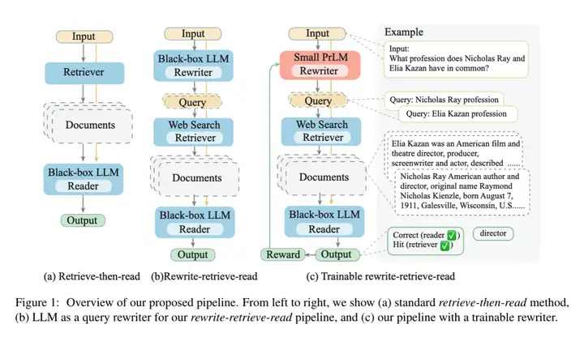
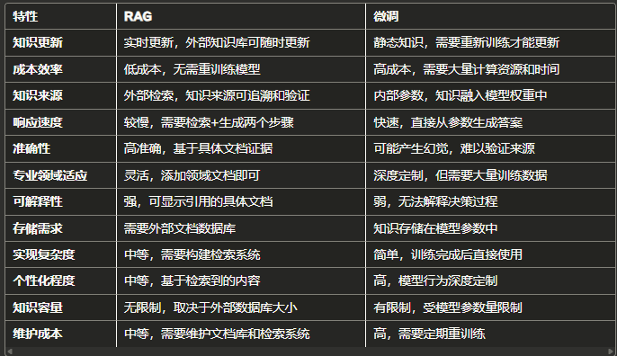

**RAG流程回顾**：

```plain
[文件加载]
     ↓
[文本清洗]
     ↓
[文本分割]
     ↓
[向量化并存入向量库]
     ↓                               
   用户提问  →→→→ [向量化]           
                           ↓         
                      [Top-K 检索]
                           ↓
                    [构建 Prompt 上下文]
                           ↓
                     [大模型生成回答]
```

# RAG知识库存在的BUG
## RAG 痛点问题分析论文概览
**论文标题**：_Seven Failure Points When Engineering a Retrieval-Augmented Generation System_**论文地址**：[arXiv:2401.05856](https://arxiv.org/pdf/2401.05856)

## 具体痛点问题总结


## 系统中的七大故障点（Failure Points）
论文指出在实际构建 RAG 系统过程中，**从数据流（Data Flow）和处理阶段（Processing Stage）来看，存在七个典型的故障点**，它们往往导致系统性能下降或输出不可靠：

| **<font style="color:rgb(0, 0, 0);">故障点名称</font>** | **<font style="color:rgb(0, 0, 0);">所在阶段</font>** | **<font style="color:rgb(0, 0, 0);">描述</font>** |
| --- | --- | --- |
| <font style="color:rgb(0, 0, 0);">文本清洗失败（Cleaning Failure）</font> | <font style="color:rgb(0, 0, 0);">Index Process</font> | <font style="color:rgb(0, 0, 0);">数据未规范化、HTML残留、乱码等影响embedding质量</font> |
| <font style="color:rgb(0, 0, 0);">分割策略错误（Chunking Failure）</font> | <font style="color:rgb(0, 0, 0);">Index Process</font> | <font style="color:rgb(0, 0, 0);">分割粒度不合理，导致上下文割裂或信息不足</font> |
| <font style="color:rgb(0, 0, 0);">嵌入不匹配（Embedding Mismatch）</font> | <font style="color:rgb(0, 0, 0);">Index & Query</font> | <font style="color:rgb(0, 0, 0);">使用不同模型编码索引和查询，语义不一致</font> |
| <font style="color:rgb(0, 0, 0);">检索无效（Retrieval Failure）</font> | <font style="color:rgb(0, 0, 0);">Query Process</font> | <font style="color:rgb(0, 0, 0);">召回不到相关 chunk 或召回噪音过多</font> |
| <font style="color:rgb(0, 0, 0);">Prompt 构造失效（Prompt Failure）</font> | <font style="color:rgb(0, 0, 0);">Query Process</font> | <font style="color:rgb(0, 0, 0);">拼接的 prompt 缺乏结构、冗长、缺乏指令性</font> |
| <font style="color:rgb(0, 0, 0);">LLM 生成幻觉（Generation Failure）</font> | <font style="color:rgb(0, 0, 0);">Query Process</font> | <font style="color:rgb(0, 0, 0);">模型生成与事实不符，内容虚构或错解</font> |
| <font style="color:rgb(0, 0, 0);">评估误导（Evaluation Failure）</font> | <font style="color:rgb(0, 0, 0);">全流程</font> | <font style="color:rgb(0, 0, 0);">评估指标（如准确率）无法衡量真实有效性或实用性</font> |


# RAG优化
### 1. 文档加载准确性与效率
#### 解决思路：
+ 使用专用文档加载器（Loader）：根据文件类型（如 PDF/HTML/Markdown/CSV）选择专属工具，保留结构、避免乱码。
+ 加强数据清洗：
    - 去除冗余、乱码、重复；
    - 同义词规范化、实体统一；
    - 翻译增强、结构补全。
+ 自动更新机制：通过反馈和时效规则自动标记无效信息。

### 2. 文档切分粒度不合理
#### 解决思路：
+ 分块应保持语义完整性。
+ 切分方法推荐：
    - 递归分块（RecursiveTextSplitter）
    - 段落/句子/标点切分
    - Chunk Size + Chunk Overlap 控制上下文连续性（如128/32）
    - 多尺度分块：适应不同类型内容

#### 经验推荐：
+ 使用嵌入模型偏好的输入长度（256~512 tokens）
+ 不同文档类型设置不同 ChunkSize：如 FAQ 可短，政策文档需长

### 3. 内容缺失
#### 解决思路：
+ 明确 Prompt 要求：当找不到答案时直接回答“根据当前知识库，无法回答该问题”。
+ 增加知识库覆盖面：加入遗漏领域文本。
+ 数据标注机制：标记历史未命中查询，指导内容补充。

### 4. 检索未命中高质量文档
#### 解决思路：
+ 不盲目提高 Top-K（如 k=20），避免引入无关噪声。
+ 使用 Reranker 模型进行二次排序（如 Cohere Reranker、Qwen-Reranker）。
+ 多向量增强文档表达力。

### 5. 上下文与问题无关
#### 解决思路：
+ 更好的文档分块逻辑。
+ 优化召回策略：多轮召回、多向量、多阶段筛选。
+ 引入 Query 重写器（Query Rewriter）提升问题意图表达。

### 6. 格式错误
#### 解决思路：
+ Prompt 中加入严格输出格式说明。
+ 使用 Output Parser（如 PydanticOutputParser）限制结构。
+ 引入自动修复模块（AutoFixing Parser）

https://python.langchain.com/docs/how_to/output_parser_fixing/

### 7. 答案不完整
#### 解决思路：
+ Prompt 引导细化回答步骤（例如“请分点回答”）
+ 拆解复杂问题为子问题逐一检索。
+ 扩大上下文窗口（Context Window），适配长答案场景。

### 8. 未提取到答案
#### 解决思路：
+ 压缩上下文（Prompt Compression），去除无关内容。
+ 突出问题关键实体，提高匹配概率。
+ 将答案可能出现的位置（如开头/结尾）优先抽取。

### 9. 答案太泛或过于具体
#### 解决思路：
+ 使用 Parent-Document 检索策略。
+ 多查询改写器（Multi-Query Retriever）表达不同问法。
+ Sentence Window 检索，定位更精确内容块。
+ 引入 RAG-Fusion，整合多个答案。

### 10. 安全性问题
#### 解决思路：
+ Prompt Injection 规避方案：加入系统角色限定、严格输入控制。
+ 敏感信息保护：字段脱敏、隐私内容不向大模型传递。
+ 用户权限与访问控制策略：对不同人群返回不同上下文。

# Advanced RAG前沿Paper解读


基于朴素RAG，高级RAG主要通过预检索策略和后检索策略来提升检索质量。

**预检索过程**

高级 RAG 主要通过优化索引结构和查询方式来提升检索效果。其中，**索引优化**侧重于提升内容质量，常见策略包括：细化数据颗粒度、改进索引结构、添加元数据、进行语义对齐优化，以及引入混合检索等手段。**查询优化**则致力于使用户问题更适配检索任务，常用方法包括：查询重写、格式转换和语义扩展等技术。

1. **查询重写** 就是把用户的问题用更清楚、更准确的话重新说一遍，方便系统理解和找到答案。 比如把“它是什么？”改成“什么是RAG预检索过程？”
2. **格式转换** 把用户的问题从普通话变成系统更容易处理的格式，比如变成关键词列表或结构化语句。 比如把“找2022年RAG论文”变成“关键词：RAG，年份：2022”。
3. **语义扩展** 在用户的问题里加上相关的同义词或者相关词，帮助找到更多相关的答案。 比如“RAG模型”还会自动加上“检索增强生成”、“文档检索”等相关词。

**后检索过程**

后检索阶段主要聚焦于如何更有效地整合检索到的上下文信息与查询问题，核心操作包括**重新排序**和**压缩上下文**。

+ **重新排序**：对检索结果进行相关性排序，并突出最重要的信息，这一方法已在 LlamaIndex2、LangChain 等框架中得到应用。
+ **压缩上下文**：直接将所有文档输入大型语言模型可能导致信息过载，因此通过筛选必要内容、突出关键部分，并限制上下文长度来减轻模型负担，提升处理效率和效果。

### 重排（重新排序）
就是把检索出来的一堆相关内容，根据和问题的相关程度，从最重要、最贴切的排到最不相关的。

 这样模型先看最关键的信息，效果更好。

### 上下文压缩
因为把所有找到的内容全给模型看，信息太多，模型会“看不过来”。

 上下文压缩就是挑出最关键、最有用的部分，把多余的删掉或浓缩，控制信息量，帮助模型更高效地理解和回答。

## T-RAG


论文地址：https://arxiv.org/pdf/2402.07483

本方法的核心创新在于将企业内部实体以树形结构进行组织管理。在完成基于 RAG 的上下文检索后，系统会检测用户查询中的实体信息，并从实体树中精准提取相关内容，补充到检索上下文中。鉴于企业项目或业务领域通常包含大量专用术语，这种结构化的实体表示显著提升了大模型对问题的理解能力，有效避免了对概念的误解和无效猜测，从而提高了回答的准确性和可靠性。

## CRAG
可进行知识纠错的检索增强生成



论文地址：https://arxiv.org/pdf/2401.15884

**1. 检索阶段（Retrieval）**

+ 用户提问：_"Who was the screenwriter for Death of a Batman?"_
+ 系统从文档库中检索相关文档 d₁, d₂

**2. 知识纠错阶段（Knowledge Correction）**

这是该系统的核心创新，包含一个**检索评估器（Retrieval Evaluator）**，它会判断检索到的文档是否能正确回答问题：

**三种判断结果：**

+ **正确（Correct）**：文档能准确回答问题 
    - 进入**知识精炼（Knowledge Refinement）**流程
    - 对文档进行分解→过滤→重组，提取最相关信息 k_in
+ **模糊（Ambiguous）**：文档信息不够明确 
    - 同时进行知识精炼和知识搜索
+ **错误（Incorrect）**：文档无法正确回答问题 
    - 启动**知识搜索（Knowledge Searching）**
    - 重写查询为："Death of a Batman, screenwriter, Wikipedia"
    - 进行网络搜索获取外部知识 k_ex

**3. 生成阶段（Generation）**

根据知识纠错的结果，将原始问题与不同的知识源组合：

+ **正确**：x + k_in
+ **模糊**：x + k_in + k_ex
+ **错误**：x + k_ex

## self-RAG
自反思RAG



论文地址：https://arxiv.org/pdf/2310.11511

参考： https://selfrag.github.io/

传统RAG系统（左侧）

**固定的两步流程：**

1. **检索**：从知识库检索K个文档
2. **生成**：将问题和检索到的文档一起输入LM生成答案

**问题：**

+ 无论检索质量如何都会使用
+ 可能产生矛盾信息（如例子中关于加州命名的错误信息）
+ 缺乏质量控制机制

Self-RAG系统（右侧）

**三步自适应流程：**

Step 1: 按需检索（Retrieve on demand）

+ 系统首先判断是否需要检索外部知识
+ 如果问题是个人经验类（如"写一篇关于最佳暑假的文章"），则标记"No Retrieval"
+ 如果需要事实信息，则进行检索

Step 2: 并行分段生成（Generate segment in parallel）

+ 同时基于不同检索文档生成多个回答片段
+ 每个片段都会被评估： 
    - **Relevant**（相关）：绿色标记
    - **Irrelevant**（不相关）：红色标记
    - **Supported**（有支撑）：绿色标记
    - **Partially**（部分支撑）：橙色标记

Step 3: 批评和选择最佳片段（Critique and select best segment）

+ 系统评估所有生成片段的质量
+ 选择最相关、最准确的片段
+ 可以继续检索更多信息如果需要

## RAG-Fusion
多查询检索融合



项目地址：https://github.com/Raudaschl/rag-fusion

参考：https://mp.weixin.qq.com/s/hxukMEeMzTEOVqd1P1fQLQ

**分析:**

基本流程

1. **一变多**：把用户的1个问题变成5个相似问题
2. **分别搜**：5个问题同时去搜索相关文档
3. **合并排序**：用融合算法把所有搜索结果合并重排
4. **生成答案**：基于合并后的结果生成最终回答

为什么这样做

+ 单个查询可能漏掉重要信息
+ 多个角度的查询能找到更全面的内容
+ 融合多个结果比单一结果更准确

## Rewrite-Retrieve-Read RAG


论文地址：https://arxiv.org/pdf/2305.14283

### 三种方法对比
**(a) 标准检索-阅读 (Retrieve-then-read)**

+ **流程**：输入 → 检索器 → 文档 → 黑盒LLM阅读器 → 输出
+ **特点**：最基础的RAG方法，直接检索后阅读

**(b) 重写-检索-阅读 (Rewrite-retrieve-read)**

+ **流程**：输入 → 黑盒LLM重写器 → 查询重写 → 网络搜索检索 → 文档 → 黑盒LLM阅读器 → 输出
+ **改进**：增加了查询重写步骤，让搜索更精准

**(c) 可训练的重写-检索-阅读 (Trainable rewrite-retrieve-read)**

+ **流程**：输入 → 小型PLM重写器 → 查询重写 → 网络搜索检索 → 文档 → 黑盒LLM阅读器 → 输出（带奖励反馈）
+ **核心创新**： 
    - 用小型可训练模型替代大型LLM做重写
    - 引入奖励机制优化重写效果
    - 成本更低，效果可控

关键：

**从(a)到(b)**：增加查询重写，提升检索精度 **从(b)到(c)**：用小模型+训练替代大模型，降低成本提升效果

**RAG和微调对比：**



